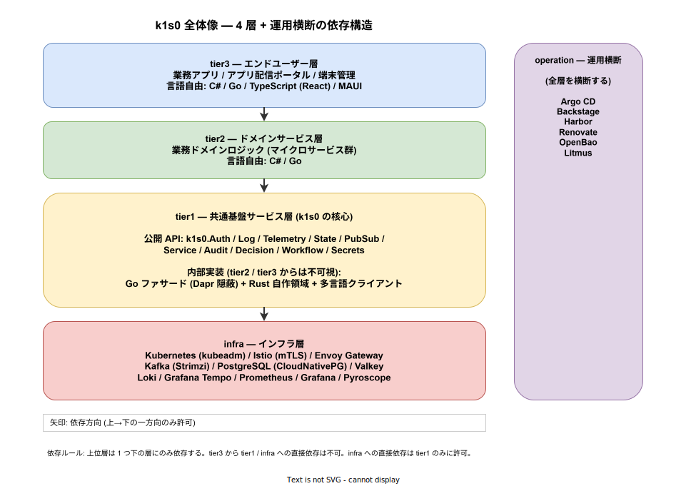

# 02. プロジェクト概要

## この章の読み方

本章は、k1s0 という言葉を初めて聞いた読者が、**10 分以内に「何を」「なぜ」「どう作るのか」を把握する** ことを目指す。後続の章 (業務要件・機能要件・非機能要件) では要件を ID 付きで列挙するが、本章を読まずに飛び込むと各要件の意図が見えにくい。

要件定義書全体を一枚の地図に喩えるなら、本章はその地図の凡例である。個別の要件がどの文脈に位置するかを思い出したくなったら、いつでも本章に戻ってきてほしい。

---

## 1. プロジェクトの一行サマリ

> **k1s0 は、JTC 情報システム部門が自前で運用できる、OSS 積み上げ型のマイクロサービス基盤プラットフォームである。**

この一行に込めた 4 つの要点を、部外者でも伝わるように分解する。

### 1.1 「自前で運用できる」とは

クラウドサービス (AWS / Azure / GCP) を使わず、**社内のデータセンタや VM 上で完結して動く** ことを指す。多くの JTC ([用語集](./01_用語集.md#jtc-japanese-traditional-company)) では、セキュリティ要件・コスト稟議・レガシー資産との接続性などの理由で、業務システムを社内ネットワーク内に留めておく必要がある。k1s0 はその前提を崩さない。

### 1.2 「OSS 積み上げ型」とは

k1s0 はそれ自体が一から作られた製品ではなく、**実績のある OSS (オープンソースソフトウェア) を組み合わせて作る** プラットフォームである。商用ライセンスを必要とする OSS は使わない。これにより「年間数百万〜数千万円のライセンス稟議」が不要となる。

### 1.3 「マイクロサービス基盤」とは

業務システムを、独立して開発・デプロイできる小さなサービス群 (マイクロサービス, [用語集](./01_用語集.md#マイクロサービス-microservices)) に分割して動かす土台のことである。認証・ログ・監視・メッセージングなど、**どの業務アプリにも共通して必要になる面倒な機能** をプラットフォーム側が肩代わりする。

### 1.4 「JTC 情シス部門向け」とは

Web 系スタートアップや SaaS 企業ではなく、日本の中堅〜大企業の情報システム部門を主な利用者として想定していることを指す。この想定の違いが、既存の商用製品との決定的な差を生む (詳細は後述)。

---

## 2. 解決したい課題 (なぜ作るのか)

k1s0 は「何となくあったら便利だから」作るわけではない。JTC 情シス部門が長年抱えてきた **構造的な負のループ** を断ち切るために作る。以下、このループの仕組みを順を追って説明する。

### 2.1 技術的負債のスパイラル

以下の 6 ステップが、多くの JTC で繰り返されている。

1. 古い単一技術でシステムを作り込む (例: .NET Framework モノリス)
2. 新技術への移行が困難になる
3. 新技術を提案しても「よくわからないからダメ」で却下される
4. 学習投資をした若手が評価されない
5. 古参が既存技術に固執する
6. 結果として、さらに新技術への移行が困難になる (1 に戻る)

このループの質が悪いのは、**個々のステップがそれぞれ合理的** である点である。既存技術に習熟した層が技術選定権を持つのは自然であり、理解できない技術を却下するのも企業ガバナンス上は妥当である。しかしその合理性が積み重なった結果、組織全体は時代から取り残される。

ループが時間を経るごとに「単一技術ごとのモノレポ集合」が組織の資産として積み上がり、全体を俯瞰すると「崩れかけのジェンガ」のような状態になる。1 箇所の変更が予期しない箇所の故障を誘発する。

### 2.2 4 つの典型的な痛み

上記ループの結果として、JTC 情シスは以下の 4 つの痛みを同時に抱えている。単独ではどの痛みも「よくある話」だが、組み合わさることで JTC 情シス特有の詰み状態を形成する。

| 痛み | 詳しい影響 |
|---|---|
| レガシー .NET Framework 資産が動き続けている | 担当者が退職しても捨てられず、塩漬け状態。新規開発のリソースを奪う |
| 認証・ログ・監視のコピペ実装 | 各プロジェクトが同じコードを量産し、バグ修正も個別対応。業務ロジックに集中できない |
| 端末への手動アプリインストール | PC リプレース時に情シスが各端末を訪問。**数人月の工数**が四半期ごとに消える |
| 商用基盤の高額ライセンス | 導入時は数千万円の稟議が壁になり、導入後はベンダーロックインで撤退困難になる |

これらの痛みは「各自でなんとか凌いでいる」状態にあり、現場の痛感はあっても経営層には見えにくい。そのため構造的な手当てが打たれず、個人の気合でカバーされ続ける。

### 2.3 既存製品が JTC に刺さらない理由

市場には商用 IDP ([用語集](./01_用語集.md#idp-internal-developer-platform)) や商用 k8s ディストリビューションが多数存在する。これらは高品質だが、**設計上の前提が JTC の実情と食い違う** ため、JTC に直接は適用できない。

| 既存製品の前提 | JTC 情シス部門の実情 | 結果 |
|---|---|---|
| クラウドマネージド前提 | オンプレ / VMware / 閉域ネットワークが主流 | 導入する土台がない |
| 高額サブスクリプション | 稟議のハードルが極めて高い | 稟議で落ちる |
| Go / TypeScript に言語統一 | .NET Framework / C# 資産を捨てられない | 既存資産を巻き込めない |
| 内製開発文化を前提 | 情シス子会社・ベンダー委託が混在 | 運用主体が定まらない |

とくに Backstage のような OSS IDP は優秀だが、**「実行基盤側は別途構築する」** 前提で設計されており、JTC 情シスが単体で導入しても効果を引き出しきれない。k1s0 はこの「実行基盤 + 開発者ポータル + エンドユーザー配信」を一体で提供することで、このギャップを埋める。

詳細は [`../01_企画/01_背景と目的/00_背景と課題.md`](../01_企画/01_背景と目的/00_背景と課題.md) を参照。

---

## 3. 提供価値 (何を提供するのか)

前節の課題に対して、k1s0 は以下の 5 つの価値を提供する。どの価値も「誰に効くのか」と紐付けて設計されている点が重要である。

### 3.1 価値 1: OSS 積み上げで無償

ライセンス費ゼロで構築できる。CNCF ([用語集](./01_用語集.md#cncf-cloud-native-computing-foundation)) 管理の成熟した OSS を中心に組み合わせることで、商用製品に引けを取らない機能を実現する。**稟議のハードルを下げる** ことで、導入判断を迅速化する。

### 3.2 価値 2: オンプレ / VM で完結

インターネット接続を前提にしない。閉域ネットワーク内で全機能が動く。OSS イメージの取得は社内プロキシ経由を許容する。**情シス部門が「データは社外に出さない」と説明責任を果たせる** 構造を持つ。

### 3.3 価値 3: レガシー (.NET Framework) と共存

既存資産を捨てない。古い .NET Framework アプリは tier3 の拡張ポイントとして扱い、サイドカー方式または API Gateway 経由で新しいプラットフォームに参加できる。**守護者タイプのベテラン開発者を敵に回さない** ことで、組織内合意を得やすくする。

### 3.4 価値 4: 言語を縛らない

tier2 / tier3 では C# / Go / TypeScript (React) / .NET MAUI を自由に選べる。tier1 が言語差を吸収するクライアントライブラリを提供する。**既存の開発資産 (言語スキル・チーム編成) を尊重する** ことで、移行コストと心理的抵抗を最小化する。

### 3.5 価値 5: 金銭的メリットで参加を促す

強制移行ではなく、**運用コスト削減という数値** で参加を訴求する。「k1s0 に乗せると、監視統一・障害対応時間短縮・デプロイ速度向上が得られる」という具体的なメリットを提示し、業務部門が自発的に参加を選ぶ仕組みを目指す。

### 3.6 価値と受益者の対応

これら 5 つの価値は、それぞれ異なるステークホルダーに刺さるよう設計されている。

| 価値 | 主な受益者 | 提示する指標 |
|---|---|---|
| OSS 積み上げで無償 | 経営層・決裁者 | ライセンス費ゼロ・稟議不要 |
| オンプレ完結 | 情シス・セキュリティ担当 | 閉域対応・監査可能 |
| レガシー共存 | 運用担当・ベテラン開発者 | 既存資産を捨てない |
| 言語自由 | 若手開発者・各開発チーム | 既存スキルがそのまま通用 |
| 金銭的メリット | 各部門の合意形成担当 | 運用コスト削減の数値 |

詳細は [`../01_企画/01_背景と目的/02_解決する価値.md`](../01_企画/01_背景と目的/02_解決する価値.md) を参照。

---

## 4. アーキテクチャ概観 (どう作るのか)

ここから、k1s0 が内部でどのような構造を取るかを説明する。要件定義の読解に必要な最低限の構造だけを示し、詳細は [`../01_企画/02_アーキテクチャ/`](../01_企画/02_アーキテクチャ/) に委ねる。

### 4.1 4 層 + 運用横断の構造

k1s0 は 4 つの階層 (infra / tier1 / tier2 / tier3) に加え、運用を横断的に担う operation の計 5 つの領域から成る。全体像を下図に示す。



図の読み方は以下のとおりである。

- **縦の 4 つの箱** が階層。上が業務に近く、下がインフラに近い。
- **各層の色** は責務の種類を示す (青: ユーザー向け / 緑: ドメイン / 黄: 共通基盤 / 赤: インフラ / 紫: 運用)。
- **矢印** は「上の層が下の層に依存する」一方向の関係を示す。矢印は常に上から下へのみ引かれ、逆方向の依存は禁止する。
- **右の縦長の箱 (operation)** は全層を横断する運用機能であり、階層構造には組み込まれない。

### 4.2 各層の役割

| 層 | 担当チーム | 役割 | 主な技術 |
|---|---|---|---|
| tier3 | アプリ開発チーム | エンドユーザー向け UI / API / 配信ポータル | C# / Go / TypeScript / MAUI |
| tier2 | ドメイン開発チーム | 業務ドメインのロジック | C# / Go |
| tier1 | システム基盤チーム | 横断的関心事の統一 API 化 (k1s0 の核心) | Go (Dapr ファサード) + Rust (自作領域) |
| infra | インフラチーム | Kubernetes / メッシュ / 観測基盤 / メッセージング | k8s / Istio / Kafka / LGTMP |
| operation | 運用チーム | 監視 / オンコール / リリース | Argo CD / Backstage / Harbor |

### 4.3 階層分離の設計意図

この 4 層構造は単なる「きれいに整理した図」ではなく、**組織的・技術的な意思決定の反映** である。

第一に、**「自由にしてよい層」と「統一すべき層」を分離する**。tier2 / tier3 は業務側の都合で言語・フレームワーク・リリースサイクルを自由に決めてよい。一方、infra / tier1 は全社統一する。自由と統一は矛盾せず、層で分離する。

第二に、**横断的関心事を tier1 に一手に集約する**。認証・ログ・監視・メッセージング・監査などの「どの業務アプリにも必要だが、業務ロジックではない機能」は、すべて tier1 が統一 API として提供する。これにより tier2 / tier3 の開発者は業務ロジックだけに集中できる。

第三に、**下位層の技術詳細を上位層に漏らさない**。tier1 は内部で Dapr や Kafka や Keycloak を使うが、tier2 / tier3 からはそれらが見えない。後述する「Dapr 隠蔽」の仕組みがこれを支える。

---

## 5. tier1 の核心: 統一 API (k1s0 API)

tier1 が提供する統一 API こそが k1s0 の付加価値の中心である。その具体的な姿を示す。

### 5.1 使用感 (tier2 / tier3 の開発者視点)

tier2 / tier3 の開発者は、以下のようなシンプルな API を呼ぶだけで、複雑な基盤機能を使える。

```csharp
// tier2 / tier3 のコード — 複雑な基盤は一切意識しない
await k1s0.Log.Info("注文を受領", new { orderId });
await k1s0.State.SaveAsync("orders", orderId, order);
await k1s0.PubSub.PublishAsync("order-events", "created", order);
await k1s0.Audit.RecordAsync("ORDER_CREATED", userId, orderId);
```

このコードは、**裏側で以下のすべてを実行している**。

1. 構造化ログを Loki に非同期送信し、トレース ID を自動付与する。
2. `orders` という論理キーで、Valkey バックエンドに JSON を保存する。
3. Kafka トピック `order-events` に CloudEvents 形式で発行する。
4. 改ざん防止のハッシュチェーン付きで、PostgreSQL の監査テーブルに永続化する。

開発者は Loki / Valkey / Kafka / PostgreSQL の存在を **一度も意識する必要がない**。これらは将来、別の技術 (たとえば Redis / NATS / ClickHouse 等) に差し替わる可能性があるが、その時も tier2 / tier3 のコードは変更不要である。

### 5.2 統一 API のカテゴリ (抜粋)

| API カテゴリ | 機能 | 主なバックエンド |
|---|---|---|
| `k1s0.Auth` | ユーザ認証 / トークン検証 / ロール解決 | Keycloak |
| `k1s0.Log` / `k1s0.Telemetry` | 構造化ログ / メトリクス / トレース送信 | Loki / Prometheus / Tempo |
| `k1s0.State` | キー・値の永続化 | Valkey / PostgreSQL |
| `k1s0.PubSub` | イベントの発行 / 購読 | Kafka |
| `k1s0.Service` | 他サービスの呼び出し (mTLS 経由) | Istio |
| `k1s0.Workflow` | 長時間ワークフローの起動・再開 | Dapr Workflow / Temporal |
| `k1s0.Decision` | 業務ルール評価 | ZEN Engine |
| `k1s0.Audit` | 監査ログ記録 (改ざん防止) | PostgreSQL + MinIO |
| `k1s0.Secrets` | シークレット取得 | OpenBao |
| `k1s0.Settings` | 端末横断の設定同期 | PostgreSQL |

### 5.3 Dapr 隠蔽の設計意図

tier1 は内部で Dapr ([用語集](./01_用語集.md#dapr-distributed-application-runtime)) という OSS を使って、これらの機能を効率よく実装する。ただし **Dapr を tier2 / tier3 に直接触らせない**。これを「Dapr 隠蔽」と呼ぶ。

Dapr 隠蔽の狙いは、将来 Dapr を別の技術に差し替える際、**影響を tier1 の中に閉じ込める** ことである。もし tier2 / tier3 が Dapr を直接呼び出していたら、Dapr のバージョンアップや差し替えのたびに数十〜数百のサービスを改修する羽目になる。これは「ベンダーロックインを避ける」という k1s0 の設計原則と矛盾する。

詳細は [`../01_企画/03_tier1設計/01_Dapr隠蔽方針.md`](../01_企画/03_tier1設計/01_Dapr隠蔽方針.md) を参照。

---

## 6. 配信側: 2 つのポータル

k1s0 は **役割の異なる 2 つのポータル** を提供する。両者は競合せず、明確に棲み分ける。混同を避けるため、社内でも「業務アプリストア」と「開発者ポータル」と呼称する。

### 6.1 アプリ配信ポータル (業務アプリストア) — エンドユーザー向け

業務担当者がブラウザからアクセスすると、**スマホのアプリストア風の UI** で、自分が使える業務アプリが一覧表示される。ボタン 1 つで PWA / MSIX 形式のアプリがインストールされ、起動できる。PC リプレース時には、旧端末の設定を新端末へ 1 クリックで復元する機能も備える。

ここでの設計意図は、**「情シスが各端末を訪問して exe をインストール」** という JTC の典型的な業務を、構造的に排除することである。ユーザの権限変更・退職に伴うアプリ剥奪も、ポータル経由で自動化される。

### 6.2 Backstage (開発者ポータル) — 開発者・運用者向け

開発者・運用者・SRE が使う社内のサービスカタログである。全サービスの一覧・依存関係・オーナー情報を検索でき、新規サービスの雛形を UI から生成でき、ドキュメント (TechDocs) が集中公開される。Spotify 発の OSS であり、CNCF Incubating プロジェクト。

### 6.3 2 つのポータルの棲み分け

両者が提供する機能は重ならない。以下の対比表で差を把握されたい。

| 軸 | アプリ配信ポータル (k1s0 自製) | Backstage (OSS 採用) |
|---|---|---|
| 対象ユーザー | 業務担当 / エンドユーザー | 開発者 / 運用者 / SRE |
| 主目的 | 業務アプリの利用開始 | サービスの発見・把握・運用 |
| 表示内容 | 業務アプリ一覧 / 説明 / レビュー | サービスカタログ / 依存 / API |
| 端末設定コピー | あり | なし |
| 配置 | tier3 名前空間 | operation 名前空間 |

「業務担当者が見るもの」と「開発者が見るもの」を **物理的に別のポータル** として提供することで、UI の対象を明確にし、それぞれの主目的に集中した体験を提供する。

---

## 7. MVP スコープ (最初に作るのは何か)

k1s0 は MVP (Minimum Viable Product、[用語集](./01_用語集.md#mvp-minimum-viable-product)) を **2 段階** に分割する。一度に全機能を作らない理由は、後述するリスク構造に起因する。

### 7.1 MVP を 2 段階に分ける理由

企画段階では、起案者は 1 名である。1 名で 20 を超える OSS コンポーネントを構築・運用するのは、**バス係数 1** (起案者 1 名が抜けたら終わる状態) という構造的リスクを抱えている。

このリスクを技術的な工夫ではなく、**プロセス設計** で解消する。すなわち、まず 2 週間で「動くデモ」を作り、それを見せることで協力者を獲得する。協力者を得てから本格的な MVP 構築に進む。

### 7.2 MVP-0: デモ構成 (Phase 1a)

| 項目 | 内容 |
|---|---|
| 目的 | 「動くもの」をデモし、協力者と予算を獲得する |
| 期間 | 2 週間以内 |
| 体制 | 起案者単独 |
| ハードウェア | VM 1 台 (4 vCPU / 8 GB / 100 GB SSD) |
| 達成内容 | SSO ログイン → 配信ポータル → サンプルアプリ起動 |

MVP-0 の成果物は、業務での本格利用を想定していない。**見せて説得する** ための道具である。ハードウェア要件が既存 VM で済むレベルに抑えられているのは、追加稟議なしで即着手できるようにするためである。

### 7.3 MVP-1: パイロット運用 (Phase 1b)

| 項目 | 内容 |
|---|---|
| 目的 | 実業務 (1 件) でパイロット運用する |
| 体制 | 2 名 (起案者 + 協力者 1 名) |
| ハードウェア | VM × 3 (16 vCPU / 32 GB / 500 GB SSD 相当) |
| 達成内容 | infra フルスタック + Backstage + Argo CD + OpenTofu |

MVP-1 は **実業務 1 件で稼働させる** ことを目指す。ここで重要なのは、「すべての機能を揃える」ことではなく、「バス係数 2 以上で運用できる状態を整える」ことである。パイロット業務は小規模 (10 人以内)・クリティカルでない業務を選定する。

詳細は [`../01_企画/07_ロードマップと体制/01_MVPスコープ.md`](../01_企画/07_ロードマップと体制/01_MVPスコープ.md) を参照。

---

## 8. フェーズ計画 (どう育てるのか)

k1s0 は MVP から全社ロールアウトまで、6 フェーズで段階的に成長させる。

| フェーズ | 位置付け | 主な成果物 |
|---|---|---|
| Phase 0 | 企画承認 (現在進行中) | 企画書 / 技術選定 / 競合分析 / 要件定義書 (本書) |
| Phase 1a (MVP-0) | デモ構成 | kubeadm + Dapr + Keycloak SSO + 配信ポータル |
| Phase 1b (MVP-1) | パイロット運用 | infra フルスタック + Backstage + Argo CD + OpenTofu |
| Phase 2 | 機能拡張 | tier1 拡張 + tier2 サンプル + 端末台帳 + Backstage プラグイン |
| Phase 3 | エンドユーザー体験拡充 | tier3 サンプル + ネイティブ配信 + 端末設定コピー |
| Phase 4 | 業務運用 | 申請ワークフロー / レガシー .NET Framework 共存 |
| Phase 5 | 全社ロールアウト | 本番展開 / マルチクラスタ |

各フェーズは前フェーズの成果を前提に設計されており、途中のフェーズだけを飛び越えて実装することはできない。とくに **Phase 1a (デモ) → Phase 1b (パイロット) の間に協力者獲得を挟む** 点が、本プロジェクトの成功確率を上げる鍵である。

詳細は [`../01_企画/07_ロードマップと体制/00_フェーズ計画.md`](../01_企画/07_ロードマップと体制/00_フェーズ計画.md) を参照。

---

## 9. 本書が対象とするスコープ

本要件定義書は、主に **Phase 1 (MVP-0 および MVP-1)** で達成すべき要件を記述する。Phase 2 以降の要件は、将来の改訂で順次追加する。

| Phase | 本書での扱い |
|---|---|
| Phase 0 | 完了済み (企画承認後に本書を Phase 1 要件で確定) |
| **Phase 1a (MVP-0)** | **主対象 (MUST 要件の中心)** |
| **Phase 1b (MVP-1)** | **主対象 (MUST / SHOULD 要件)** |
| Phase 2 | COULD 要件として方針のみ記載 |
| Phase 3 以降 | スコープ外 (将来の改訂で追加) |

要件定義書は「一度書けば永遠に有効」ではなく、**Phase の進行とともに改訂する生きた文書** である。

---

## 10. 読み進めるための地図

本書を読み進めるうえでの道標を以下に示す。各章が答える問いは異なるため、自分の関心に応じて必要な章を優先的に読むとよい。

| 章 | 答える問い |
|---|---|
| 03_ステークホルダー | **誰のために作るのか? 誰が何を得るのか?** |
| 04_業務要件 (BR-xxx) | **業務上、何を実現したいのか?** |
| 05_機能要件 (FR-xxx) | **システムとして、何ができる必要があるのか?** |
| 06_非機能要件 (NFR-xxx) | **どれくらいの性能・可用性・セキュリティが必要か?** |
| 07_制約条件 (CON-xxx) | **守らなければならないルールは何か?** |
| 08_前提条件 (ASM-xxx) | **何を所与の条件とするか?** |
| 09_スコープ | **何は作って、何は作らないのか?** |
| 10_リスク (RISK-xxx) | **何が怖いか? どう備えるか?** |

---

## 関連ドキュメント

- [`README.md`](./README.md) — 要件定義書のインデックス
- [`00_はじめに.md`](./00_はじめに.md) — 本書の目的
- [`01_用語集.md`](./01_用語集.md) — 専門用語の解説
- [`../01_企画/企画書.md`](../01_企画/企画書.md) — 企画書 (Marp スライド)
- [`../01_企画/README.md`](../01_企画/README.md) — 企画資料のインデックス
