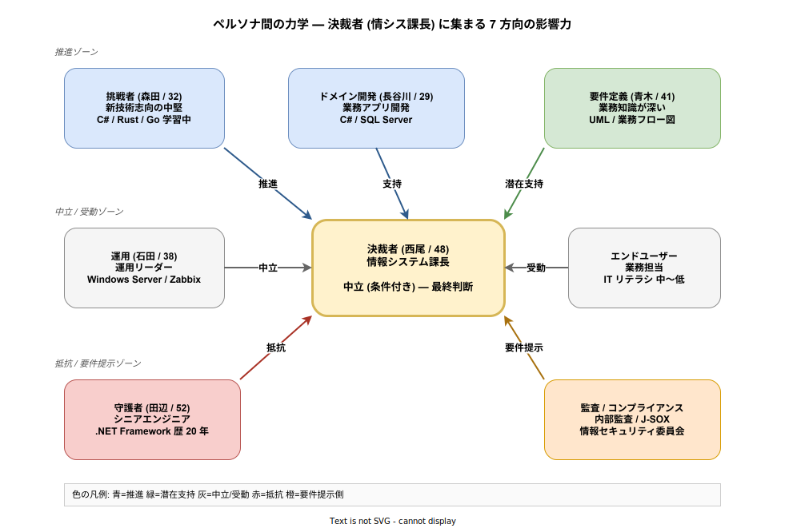

# 03. ステークホルダー

## この章の読み方

要件定義の根幹は「誰のために、何を作るか」である。設計判断を下す際、常に **「このステークホルダーの期待に応えているか」** という問いが判断基準になる。本章では、k1s0 に関わる関係者を分類・整理し、それぞれが何を期待し、何を提供するかを示す。

この章を読み飛ばして機能要件 (FR-xxx) に進むと、「なぜこの機能が MUST なのか」の根拠が見えなくなる。要件の優先度に疑問を感じたら、本章に立ち戻って「誰がこの要件を必要としているか」を確認してほしい。

---

## 1. ステークホルダー全体像

k1s0 のステークホルダーは、**関与の仕方** によって大きく 4 つのグループに分かれる。

| グループ | 立場 | 関与の仕方 | 代表例 |
|---|---|---|---|
| 経営・管理層 | 承認・予算・人員配置を司る | 意思決定 | 経営層 / 情シス管理職 |
| 開発・運用従事者 | プラットフォームを作り・使う | 実務 | tier1/2/3 開発者 / 運用担当 |
| 業務部門 | プラットフォーム上のアプリを使う | 利用 | 業務担当エンドユーザー / 要件定義担当 |
| 外部協力者 | 補助的に関与 | 補助 | パートナー企業 / ベンダー / 監査 |

これらは単なる組織図ではなく、**決裁者に向かって「推進」「中立」「抵抗」のいずれかの影響力を及ぼす、力関係を持った集団** である。組織内導入の成否は、技術的な完成度ではなくこの力関係の扱い方で決まる。次節でその構造を図示する。

---

## 2. ステークホルダー間の力学 (図解)

k1s0 の導入判断は、**複数のペルソナから同時に影響を受ける決裁者 (情シス課長)** が最終的に下す。決裁者に集まる影響力の方向と強さを、以下の図で示す。

### 2.1 図の読み方

- 中央の **決裁者 (西尾)** が最終判断を下す。周囲の 7 つのペルソナから、色分けされた矢印で影響力が集まる。
- 矢印の **色** は各ペルソナの基本姿勢を示す (青=推進 / 緑=潜在支持 / 灰=中立・受動 / 赤=抵抗 / 橙=要件提示)。
- 上・中・下の 3 ゾーンは、推進・中立・抵抗の 3 方向からの圧力を表す。**決裁者はこの 3 方向の圧力を同時に受ける** 構造になっている。

### 2.2 この力学が示唆すること

この図から読み取れるもっとも重要な点は以下の 2 つである。

第一に、**「推進 vs 抵抗」の二項対立ではない**。ドメイン開発者や要件定義担当は推進側を援護し、運用担当は中立から加点する。監査担当は要件を提示することで間接的に方向付ける。単に推進派を増やすだけでは決裁者の判断を動かせない。

第二に、**守護者タイプを排除してはならない**。図の赤い矢印 (抵抗) が消えたら決裁者は動きやすくなるように見えるが、実際には守護者が持つレガシー資産の運用知識が組織の業務継続性を支えている。守護者を敵視した瞬間、プロジェクトは政治的に崩壊する。k1s0 の設計原則「レガシー共存」「言語自由」は、守護者を敵にしないための構造的な配慮である。

---

## 3. ステークホルダー別の詳細

ここからは個別のステークホルダーについて、**期待 / 提供 / 態度 / 攻略方針** を記述する。記述順は前節の力学図の上から時計回りに対応する。

本書で想定するペルソナは、企画ドキュメント ([`../01_企画/01_背景と目的/01_ペルソナ.md`](../01_企画/01_背景と目的/01_ペルソナ.md)) で定義した人物像を踏襲している。

### 3.1 挑戦者タイプ (新技術志向の中堅開発者)

| 項目 | 内容 |
|---|---|
| 代表ペルソナ | 森田 (32 歳 / エンジニア) |
| スキル | C# 実務 5 年。プライベートで Rust / Go / k8s を学習中 |
| 期待 | 新技術を使った貢献が評価される / プライベート学習が業務成果に直結する / 若手でも基盤開発に参画できる |
| 提供 | tier1 開発の実装力 / OSS 追従 / 新技術のキャッチアップ |
| 主な関心要件 | BR-006 (言語自由) / FR-100 (雛形生成 CLI) / FR-110 (Software Templates) |
| 態度 | **強く推進** |

**このペルソナへの取り組み**: 挑戦者タイプは k1s0 の思想的な支持者であり、パイロット開発の中核候補である。ただし組織内で「独走」して見られると守護者との対立が深刻化する。k1s0 では、彼らに **tier1 開発という明確な役割** を与え、個人プレーではなく基盤整備の担い手として位置付けることで、挑戦の場と承認を両立させる。

### 3.2 ドメイン開発者 (tier2 担当)

| 項目 | 内容 |
|---|---|
| 代表ペルソナ | 長谷川 (29 歳 / 業務アプリ開発) |
| スキル | C# / SQL Server。クリーンアーキテクチャを勉強中 |
| 期待 | 認証・ログ・監視の実装から解放される / 業務ロジックに集中できる / セットアップが数分で終わる |
| 提供 | 業務ドメイン知識 / サービス実装 |
| 主な関心要件 | FR-010 (SSO) / FR-020 (構造化ログ) / FR-040 (State) / FR-050 (PubSub) / NFR-001 (レイテンシ) |
| 態度 | **推進** |

**このペルソナへの取り組み**: 「業務ロジックに集中できる」という価値をもっとも強く実感する層。tier1 の存在意義を語る際の代表顧客であり、かつ tier2 開発の最初のパイロット担当候補でもある。彼らの開発効率を具体的な数値 (雛形生成 30 秒・お作法コードゼロ) で示すことで、組織内の他の開発者への説得材料になる。

### 3.3 要件定義担当 (業務側)

| 項目 | 内容 |
|---|---|
| 代表ペルソナ | 青木 (41 歳 / 要件定義担当) |
| スキル | 業務知識が深い。技術は浅い。UML / 業務フロー図が主戦場 |
| 期待 | 業務要件の実装リードタイム短縮 / 新機能追加のしやすさ / 業務側主導のルール変更 (BRE) |
| 提供 | 業務要件の言語化 / 優先度付け / ユーザ代弁 |
| 主な関心要件 | BR-010 (リードタイム短縮) / FR-070 (業務ルール) / FR-110 (Software Templates) |
| 態度 | **潜在的推進 (ユーザー代弁者)** |

**このペルソナへの取り組み**: エンドユーザーに最も近い立場から「業務価値の実現速度」を語れる援軍。技術には詳しくないが、**リードタイム指標** (要件から本番投入までの期間) で説得すると推進側に引き込める。ZEN Engine ([用語集](./01_用語集.md#zen-engine)) による決定表で、業務側が開発者の手を借りずにルール変更できる仕組みは、この層が最も歓迎する機能である。

### 3.4 運用担当・SRE

| 項目 | 内容 |
|---|---|
| 代表ペルソナ | 石田 (38 歳 / 運用リーダー) |
| スキル | Windows Server 運用 10 年。監視ツールは Zabbix が中心 |
| 期待 | 監視・ログ・トレースの一元化 / 夜間対応の負荷軽減 / 障害時の原因特定時間短縮 |
| 提供 | Runbook 整備 / 監視運用 / SLA 遵守 |
| 主な関心要件 | FR-060 (観測性統一) / NFR-040 (運用性) / FR-120 (Runbook) |
| 態度 | **中立 (運用観点で加点)** |

**このペルソナへの取り組み**: 「運用が楽になる」という実感で味方になる。LGTMP スタック ([用語集](./01_用語集.md#lgtmp-スタック)) での監視一元化が最大の訴求ポイント。ただし既存の Zabbix 等のツールを即座に捨てさせると反発が強いため、**Phase 1b まで並行利用を許容する移行計画** が重要である (スコープ節で後述)。

### 3.5 エンドユーザー (業務担当)

| 項目 | 内容 |
|---|---|
| 代表ペルソナ | 業務部門の現場担当。IT リテラシは中〜低 |
| 期待 | 業務アプリへのアクセスが簡単 / PC リプレース時の設定復元 / アプリ一覧がわかりやすい |
| 提供 | 実業務での利用フィードバック |
| 主な関心要件 | FR-090 (アプリ配信ポータル) / FR-091 (端末設定コピー) / NFR-050 (UX) |
| 態度 | **受動的** |

**このペルソナへの取り組み**: 彼らは自発的に意見を発信しない。「アプリが使えれば良い」と思っている。しかし、使いにくさは静かな離脱 (別ツールの私的利用・ワークアラウンドの蔓延) を生むため、**UX 指標 (3 クリック以内でアプリ起動・設定コピー 1 クリック)** を具体的に定めて担保する必要がある。

### 3.6 守護者タイプ (保守派ベテラン開発者)

| 項目 | 内容 |
|---|---|
| 代表ペルソナ | 田辺 (52 歳 / シニアエンジニア、.NET Framework 歴 20 年) |
| 期待 | 既存 .NET Framework 資産が捨てられないこと / 無理な学び直しを強制されないこと / 自分の経験が否定されないこと |
| 提供 | レガシーシステムの深い知見 / 業務知識 |
| 主な関心要件 | BR-005 / FR-080 (レガシー共存) / CON-010 (既存言語尊重) |
| 態度 | **抵抗寄り** |

**このペルソナへの取り組み**: このペルソナの不安は「自分の価値が否定される」ことに由来する。企画・要件・設計のすべての段階で **「既存資産を捨てない」「強制移行しない」「学び直しを強制しない」** を第一級で明示する必要がある。守護者が持つレガシーシステムの知見は組織資産であり、彼らが安心して k1s0 に関与できる通路 (サイドカー方式・API Gateway 経由) を設計段階から用意する。

### 3.7 監査 / コンプライアンス担当

| 項目 | 内容 |
|---|---|
| 代表ペルソナ | 内部監査 / J-SOX / 情報セキュリティ委員会 |
| 期待 | 監査ログの完全性 / 権限管理の追跡性 / サプライチェーンの安全性 |
| 提供 | 監査要件の提示 / コンプライアンスチェック |
| 主な関心要件 | FR-030 (監査ログ) / NFR-060 (セキュリティ) / CON-040 (法令遵守) |
| 態度 | **要件提示側** |

**このペルソナへの取り組み**: 推進も抵抗もしないが、**要件を提示する** 立場。彼らの要件が満たされない限り本番稼働の承認は下りない。とくに改ざん防止の監査ログ (ハッシュチェーン) と権限剥奪の即時性 (24 時間以内) は、早期に合意を取っておくべき項目である。

### 3.8 経営層・決裁者

| 項目 | 内容 |
|---|---|
| 代表ペルソナ | 西尾 (48 歳 / 情報システム課長) |
| 期待 | TCO 削減 / ベンダーロックイン回避 / 属人化解消 / 失敗時に許容できるリスク範囲 |
| 提供 | 予算 / 人員 / 稟議承認 / パイロット業務の選定 |
| 主な関心要件 | BR-001 (TCO 削減) / BR-005 (レガシー共存) / NFR-030 (可用性) / CON-030 (予算制約) |
| 態度 | **中立 (条件付き)** |

**このペルソナへの取り組み**: 技術的な美しさには反応しない。**金銭 (TCO)・工数 (リードタイム・運用負荷)・リスク (バス係数・コンプライアンス)** の 3 軸で語る必要がある。とくに Phase ごとに数値を更新して提示することで、継続的な投資判断を促す。

### 3.9 外部協力者 (パートナー企業 / ベンダー)

| 項目 | 内容 |
|---|---|
| 代表ペルソナ | 情シス子会社・SIer・ベンダー委託先 |
| 期待 | 仕様書・要件定義書の明確さ / ドキュメントの整備 / 既存契約への影響が小さいこと |
| 提供 | 開発リソース / 運用支援 / 業界知見 |
| 主な関心要件 | FR-110 (TechDocs) / CON-020 (OSS ライセンス) |
| 態度 | **中立** |

**このペルソナへの取り組み**: 契約範囲に応じて推進にも抵抗にもなる。**ドキュメント品質** (本書がまさにその最前線) と **TechDocs の整備度** が、彼らの生産性と態度を決める。

---

## 4. 責任分担 (RACI マトリクス)

ここまで「誰が何を期待するか」を示したので、次は **「誰が何に責任を持つか」** を明確にする。このために RACI マトリクスを用いる。

### 4.1 RACI の意味

| 記号 | 意味 | 解釈 |
|---|---|---|
| **R** (Responsible) | 実行責任者 | 実際に手を動かす人 |
| **A** (Accountable) | 最終責任者 | 結果に責任を持つ人 (各タスクに 1 名のみ) |
| **C** (Consulted) | 事前相談 | 着手前に意見を聞く相手 |
| **I** (Informed) | 事後報告 | 完了後に結果を知らされる相手 |

RACI が曖昧なままでは「誰かがやるだろう」と放置されるタスクや、「誰の許可を取るべきか分からず停滞するタスク」が発生する。**各タスクに明確な A (最終責任者) を 1 名だけ割り当てる** ことがもっとも重要である。

### 4.2 主要タスクの RACI

| タスク | 起案者/tier1 開発 | 運用チーム | 要件定義担当 | 情シス管理職 | 経営層 |
|---|---|---|---|---|---|
| 要件定義 (本書) 作成 | R | C | C | A | I |
| tier1 実装 | R, A | C | I | I | I |
| tier2 業務実装 | C | C | C | A | I |
| 運用設計 (Runbook) | C | R, A | I | I | I |
| パイロット業務選定 | I | C | C | A | C |
| 予算承認 | C | I | I | C | R, A |
| セキュリティレビュー | R | C | I | A | I |

### 4.3 RACI から読み取れる構造

この表から読み取れる主要な構造は以下の 2 点である。

- **情シス管理職は「要件定義」「tier2 実装」「パイロット業務選定」「セキュリティレビュー」の 4 つで A (最終責任者) を担う**。したがって情シス管理職が機能しない場合、プロジェクト全体が停滞する。情シス管理職との信頼関係構築は最優先事項である。
- **tier1 開発は「要件定義」と「tier1 実装」の両方で R または R,A を担う**。この集中は MVP-0 期における構造的必然であるが、同時にバス係数 1 の根源でもある (RISK-001)。MVP-1 以降で tier1 実装を複数名体制に分散することが、このリスクを解消する唯一の手段である。

---

## 5. 期待値のすれ違いを防ぐための約束事

ステークホルダー間で同じ言葉が違う意味で使われると、プロジェクトは静かに迷走する。よくある誤解を先に潰しておく。

### 5.1 「早いリリース」の意味を揃える

「早く出そう」と言ったとき、人によって想定しているゴールが異なる。

| 解釈 | 誰の期待 |
|---|---|
| 企画承認から 2 週間で何か見える (MVP-0) | 経営層 / 情シス管理職 |
| 実業務で使える (MVP-1) | 業務部門 / 要件定義担当 |
| 機能追加のリードタイム短縮 (Phase 2 以降) | ドメイン開発者 |

**本書では**: MVP-0 の成果物は **デモ** と明記し、「実業務で使える」のは MVP-1 以降であることを関係者全員にすり合わせる。この合意がないと、MVP-0 デモを見た業務部門が「もう使える」と期待し、実運用に投入しようとするリスクがある。

### 5.2 「セキュア」の意味を揃える

「セキュアに作ってください」と言われたとき、人によって想定範囲が異なる。

| 解釈 | 誰の期待 |
|---|---|
| 外部ネットから隔離されている | 情シス管理職 / 守護者 |
| 認証・認可が統一されている | 運用担当 / 開発者 |
| 監査ログが改ざん不能 | 監査担当 |

**本書では**: [`06_非機能要件.md`](./06_非機能要件.md) の「セキュリティ要件」節で、具体的な数値 / 技術 (mTLS / TLS 1.2 以上 / ハッシュチェーン等) を明示する。「セキュア」という曖昧語を使わず、個別の NFR で検証可能な形に落とす。

### 5.3 「オンプレ」の意味を揃える

「オンプレで動くこと」と言ったときの解釈もずれる。

| 解釈 | 誰の期待 |
|---|---|
| 物理サーバで動く | 守護者 |
| VM / VMware 上で動く | 情シス管理職 |
| 社内データセンタで閉じる | 監査担当 |

**本書では**: `CON-005` (オンプレ完結) の定義を **「インターネット接続を前提にせず、社内 LAN / 閉域ネットワーク内で完結すること。ただし OSS イメージのダウンロード等は社内プロキシ経由を許容する」** と明文化する。これにより、物理 vs VM の議論は環境選定の実装詳細であり、要件レベルでは不問とする。

---

## 6. ステークホルダー管理のポイント

本章の内容は要件の正しさを裏付ける根拠だが、同時に **プロジェクト運営の実務にも直接効く**。以下の 3 点を日常の運営ルールとする。

1. **四半期ごとにステークホルダー一覧を見直す** — 人事異動・役職変更により、決裁者や推進者が入れ替わる可能性が高い。入れ替わった直後は既存の合意が揺らぐため、早期の再整理が必要。
2. **守護者タイプとの対話チャネルを恒常化する** — レビューや合意形成の場で常に意見を聞く。排除すると抵抗が裏に回り、静かにプロジェクトを潰す動きになる。
3. **業務側のユーザー代弁者 (要件定義担当) を巻き込み続ける** — 彼らが離れると、k1s0 が技術的自己満足に陥るリスクが高まる。

---

## 関連ドキュメント

- [`../01_企画/01_背景と目的/01_ペルソナ.md`](../01_企画/01_背景と目的/01_ペルソナ.md) — 詳細なペルソナ設定
- [`../01_企画/01_背景と目的/02_解決する価値.md`](../01_企画/01_背景と目的/02_解決する価値.md) — ペルソナ別の k1s0 価値
- [`04_業務要件.md`](./04_業務要件.md) — 本章のステークホルダーの期待を BR-xxx に落とし込んだもの
