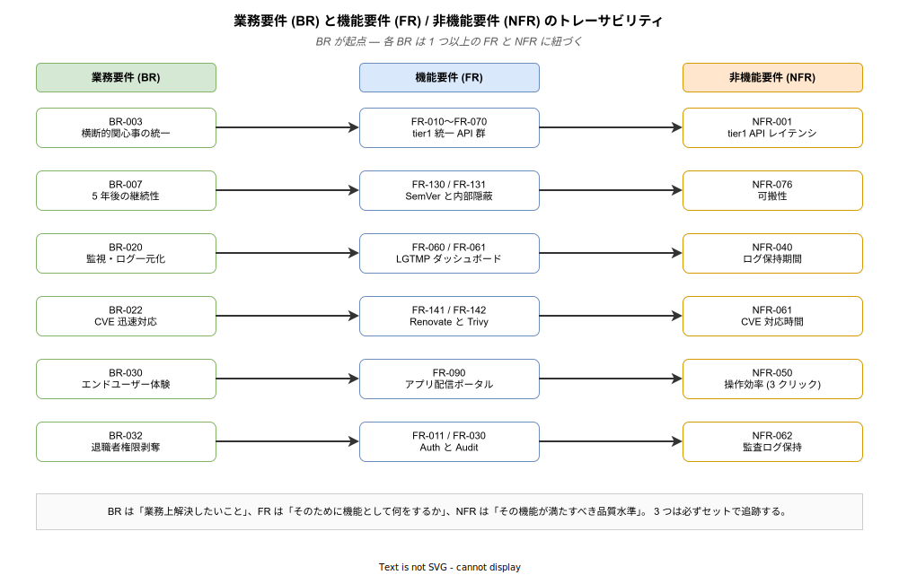

# 04. 業務要件 (BR-xxx)

本章では、k1s0 が **業務上** 解決すべき要求を Business Requirement (BR) として整理する。機能要件 (FR) や非機能要件 (NFR) は、すべていずれかの BR の実現を支えるために存在する。

業務要件は「プラットフォームが完成したときに、業務現場や経営判断がどう変わっているか」を記述する層である。技術的な手段には踏み込まず、達成したい状態と、それを望む立場 (経営層・開発者・運用担当・エンドユーザー) を明らかにする。後続の機能要件 (05 章) はここで定めた BR を実装手段に翻訳し、非機能要件 (06 章) はその手段が備えるべき品質水準を定める。したがって「FR / NFR が BR のどれを支えているか」を常に追跡できる状態を保つことが、本書全体の整合性を保つ最も基本的な仕掛けとなる。



図中の 6 本のラインは、BR が独立した目標ではなく、具体的な FR と NFR を引き寄せる **起点** であることを示している。例えば BR-020 「監視・ログ一元化」は、FR-060 「LGTMP 統合ダッシュボード」という機能と、NFR-040 「ログ保持期間」という品質水準を同時に要求する。どちらか一方しか満たさないと、BR の意図 (障害時の原因特定時間を短縮) は達成できない。BR を読むとき、読者は必ず「この要件が崩れたら、どの FR / NFR が宙に浮くか」を頭に入れて読み進めてほしい。

---

## 1. 業務要件の読み方

### 1.1 フォーマット

各要件は以下の形式で記述する。

```
### BR-xxx: (要件名)

| 項目 | 内容 |
|---|---|
| 優先度 | MUST / SHOULD / COULD / WON'T |
| 期待効果 | 定量・定性の期待効果 |
| 主要関係者 | 期待を抱くステークホルダー |
| 根拠 | なぜこの要件が必要か |
| 関連 FR / NFR | 実現を支える機能・非機能要件 |

(本文)
```

### 1.2 分類

業務要件は以下の 4 カテゴリに分類する。

| カテゴリ | ID 範囲 | 概要 |
|---|---|---|
| 経営的要求 | BR-001 ～ BR-009 | TCO / ベンダーロックイン / リスク |
| 開発生産性 | BR-010 ～ BR-019 | リードタイム / 開発者体験 |
| 運用性 | BR-020 ～ BR-029 | 属人化解消 / 監視統一 / 運用コスト削減 |
| エンドユーザー体験 | BR-030 ～ BR-039 | アプリ配信 / 端末設定 |

---

## 2. 経営的要求 (BR-001 ～ BR-009)

経営的要求は「稟議を通す上での根拠」として最も重い位置を占める。JTC (Japanese Traditional Company) 情シス部門では、ライセンス費・ベンダー依存・5 年先の保守性が導入判断の三大軸であり、技術的に優れていても、これらの軸で不安が残ると稟議を通せない。BR-001 から BR-009 は、その不安を一つずつ構造的に解消するための宣言である。BR-001 でライセンス費ゼロを約束し、BR-002 で単一ベンダー依存を設計的に排除し、BR-007 で「5 年後誰がメンテするのか」という新技術導入における最大の懸念に回答する。これらが揃って初めて経営層は「やってみろ」と判断できる。

### BR-001: 商用ライセンス費用ゼロで構築できること

**優先度 MUST / 主要関係者: 経営層・情シス管理職 / 関連: CON-020**

JTC 情シス部門では、年次ライセンス費がそのまま稟議の通しやすさを決める。商用 Kubernetes ディストリビューション (OpenShift や Tanzu) を一式揃えると、Red Hat OpenShift の Standard サブスクリプションで 2 ソケットあたり年額約 150 万円、10 ノード構成で年間 1,500 万円、5 年保守契約を含めると 7,500 万円以上に達する。「現場で試したい」「PoC で 1 か月だけ動かしたい」という動機では、この規模の予算を取りに行けない。結果として稟議が通らず、現場は 10 年前と同じ構成で今日も動かしている — これが本要件の解決したい現状である。

この要件が満たされた世界では、プラットフォームの全コンポーネントが OSS (Apache-2.0 / MIT / MPL-2.0 / AGPL-3.0 のいずれか) で構成され、年次ライセンス費は 0 円になる。起案者は「OSS 導入につき稟議不要」の既存ルール (ASM-033) に従って着手でき、MVP-0 を予算 0 円で始められる。有償サポート契約は任意であり、契約を結ばなくても機能は完全に動く。これは「無償版で我慢する」のではなく「有償サポートを買わないことを選べる」状態であり、必要になった時点 (インシデント頻発時など) だけ個別稟議で契約すればよい。

逆にこの要件が崩れた場合、商用ライセンス費が経営会議の議題に登り、Phase 0 承認が 3〜6 か月単位で遅延する。競合製品の値上げや機能制限の都度、再度稟議を通す必要が発生し、情シスが「値上げに振り回される側」の立場に戻る。

受け入れ基準として、Phase 0 承認時点で以下を満たす:

- プラットフォーム構成図の全コンポーネントが商用利用可能 OSS であり、各ライセンス種別が一覧化されている
- 有償サポート契約なしで MVP-0 / MVP-1 が機能することを構成検証レポートで示す
- MinIO (AGPL-3.0) のような特殊ライセンスは利用形態制限 (SaaS 提供しない) を CON-021 で明文化している

---

### BR-002: ベンダーロックインを構造的に回避できること

**優先度 MUST / 主要関係者: 経営層・情シス管理職 / 関連: BR-001 / CON-002 / FR-131**

ベンダーロックインが現実的リスクであることは、ここ数年で複数の実例が示している。2023 年の VMware Broadcom 買収後、vSphere の購読型への移行で既存顧客が想定の 3〜10 倍の更新費を提示された事例、HashiCorp Terraform の BSL 移行で OpenTofu フォークが発生した事例、Redis の SSPL 移行で Valkey フォークが発生した事例は、いずれも「製品に深く依存した後では、値上げや契約変更を断れない」という構造的な問題を露呈させた。一度業務システムを特定ベンダーに乗せると、移行コストがベンダーの交渉力を押し上げ、値上げを呑まされ続ける。

この要件が満たされた世界では、プラットフォームを構成する OSS がいずれも CNCF Graduated / Incubating か、Linux Foundation / Apache Foundation 等の中立財団管理下にある。単一企業所有の OSS を採用する場合は、選定時に代替候補を 1 つ以上評価し、ADR にその比較を残す。さらに tier1 ファサード (FR-131) が内部 OSS の差し替えを吸収する構造になっているため、将来 Keycloak を Authelia に差し替えるような判断が発生しても、tier2 / tier3 のコードには変更を及ぼさない。

この要件が崩れると、採用 OSS の企業買収 (RISK-041) や独自ライセンスへの移行 (RISK-040) が発生した時点で、tier1 の全面改修か、最悪の場合プラットフォーム全体の作り直しが必要になる。過去の Terraform → OpenTofu 移行では、既存組織が移行判断に 3〜6 か月、実際の移行作業に数人月を費やしており、これを避けることが本要件の経済的な意義である。

受け入れ基準:

- 採用 OSS 一覧に「管理組織 (CNCF / LF / 単一企業 / etc)」「代替候補」の列が揃っている
- 単一企業所有の OSS (Dapr / ZEN Engine 等) には代替評価 ADR が存在する
- tier1 公開 API (`k1s0.*`) が内部 OSS 名を露出していないことを CI ガード (FR-101) で検証できる

---

### BR-003: 横断的関心事を統一プラットフォームに集約すること

**優先度 MUST / 主要関係者: 情シス管理職・ドメイン開発者・運用担当 / 関連: FR-010 〜 FR-070・FR-160・FR-170 / BR-012**

現在の情シス開発では、新規サービスを立ち上げるたびに「認証のトークン検証」「ログの構造化」「メトリクスの送信」「監査ログの記録」「DB 接続の設定」を各チームがコピペで再実装している。あるチームが Keycloak 連携の JWT 検証を 200 行書けば、半年後に別チームが同じコードを 250 行で別物として書く。コピペ元が古いライブラリ版だったために脆弱性対応時に全プロジェクトを手で修正することになり、1 件の CVE 対応に数週間かかる — これが現状の横断的関心事の姿である。

この要件が満たされた世界では、開発者は `k1s0.Auth.ValidateToken(token)` の 1 行でトークン検証を終える。`k1s0.Log.Info(msg, ctx)` の 1 行で構造化ログ・traceId 付与・Loki への非同期送信が完了する。認証・ログ・メトリクス・トレース・監査・State・PubSub・決定評価・シークレット・Workflow の 10 領域すべてが tier1 の `k1s0.*` 公開 API で提供され、内部の OSS (Keycloak / Kafka / PostgreSQL / OpenBao / ZEN Engine) は tier2 / tier3 からは一切見えない。CVE が発生した場合、tier1 を 1 回更新すれば全 tier2 / tier3 サービスに伝播する。

この要件が崩れた場合、開発者は引き続き 1 サービスあたり「お作法コード」を数百行書き続け、業務ロジックの実装時間は全体の半分以下に留まる。セキュリティ更新は各プロジェクトで個別に走り、漏れが発生する。BR-010 (リードタイム短縮) と BR-022 (CVE 48 時間以内対応) はどちらも本要件の達成に依存しており、ここが崩れると両方が成立しない。

受け入れ基準:

- Phase 1a: 6 領域 (Auth・Log・Metrics・Trace・Audit・State) が `k1s0.*` API で呼び出せる (C# / Go の 2 言語)。残り 4 領域 (PubSub・Decision・Secret・Workflow) は Phase 1b で追加
- Phase 1b: 10 領域すべてが `k1s0.*` API で呼び出せる (TypeScript を加えた 3 言語)
- tier2 / tier3 サンプル実装が Dapr SDK / Kafka クライアント / Keycloak SDK / OpenBao SDK を一切 import していない (FR-101 の CI ガードで検証)
- Keycloak の JWKS 取得や Kafka の Consumer Lag のような内部実装詳細は `k1s0.*` API の返り値やドキュメントに露出していない
- シークレット管理 (FR-160) とサービス間呼び出し (FR-170) を含む全 10 領域が `k1s0.*` 名前空間で統一されている

---

### BR-004: オンプレミス / 閉域ネットワークで完結できること

**優先度 MUST / 主要関係者: 情シス管理職・監査担当 / 関連: CON-005 / NFR-060**

JTC 情シスが扱う業務システムの多くは、取引先情報・従業員の個人情報・業務フローデータといった「社外に出せない情報」を日常的に保持する。金融・製造・公共領域では規程でインターネット接続自体が禁止されており、クラウド前提の IDP (Auth0 / Azure AD B2C 等) は導入前の稟議段階で「法令違反の可能性」として跳ね返される。クラウド SaaS ベンダーが提供する OSS 対応プラグイン (例: Auth0 の OSS 版) があっても、内部で SaaS 側 API を呼ぶ前提になっていると使えない。

この要件が満たされた世界では、プラットフォーム全機能がインターネット接続ゼロの環境で起動・稼働する。Keycloak も OpenBao も PostgreSQL もすべて社内ネットワーク内で完結し、外部通信は OSS / コンテナイメージの取得時のみ社内プロキシ (ASM-022) か社内ミラーレジストリ経由で行われる。Phase 0 承認前にエアギャップ環境での起動検証を完了させ、「ネットワーク切断後 24 時間動作し続ける」シナリオで検収する。

この要件が崩れると、適用可能な業種が一部のクラウド前提企業に限定され、当初想定していた JTC 情シス市場に導入できない。Phase 0 での稟議も法令リスク観点で差し戻されるため、プロジェクト全体が再起不能になる。

受け入れ基準:

- インターネット切断環境 (ファイアウォール全拒否設定) で MVP-0 全機能が起動することを検証
- 外部通信が必要な OSS / イメージ取得経路は「社内プロキシ」「Harbor replication」の 2 経路のみに集約
- Keycloak / OpenBao / PostgreSQL / Kafka 等のすべての依存が社内完結で動作する ADR / 構成図が存在する

---

### BR-005: レガシー資産 (.NET Framework) と共存できること

**優先度 MUST / 主要関係者: 経営層・守護者タイプ・情シス管理職 / 関連: FR-080 / FR-081 / CON-010**

JTC 情シスの既存業務システムは、.NET Framework 4.x で構築された業務アプリが数十本規模で稼働しているのが標準的な姿である。これらは 10 年〜20 年の運用履歴を持ち、業務ロジックが深く埋め込まれた状態で、仕様書が失われているケースも珍しくない。「近代化しましょう」「.NET 8 に移行しましょう」という提案が毎年のように出るが、費用対効果の試算に耐えないまま棚上げされてきた。この既存資産を「捨てろ」と迫るプラットフォームは、守護者タイプ (田辺ペルソナ, .NET 歴 20 年) の強い抵抗により導入に失敗する。

この要件が満たされた世界では、既存 .NET Framework アプリはそのまま IIS 上で動かし続け、k1s0 への参加はサイドカー経由 (FR-080) または Envoy Gateway 経由 (FR-081) で段階的に行う。tier1 公開 API は .NET Framework 4.8 向けの NuGet パッケージを提供し、C# クライアントから `k1s0.Auth` / `k1s0.Log` / `k1s0.PubSub` を呼び出せる。「まずログ送信だけ」「次に認証統合」と部分的に近代化でき、全面書き換えを迫られない。

この要件が崩れた場合、守護者タイプが企画書レビュー段階で反対に回り (RISK-003)、決裁者 (西尾課長) の判断が「パイロット却下」に傾く。技術的正しさより政治的成立可能性の問題であり、ここが成立しないと Phase 0 を通せない。

受け入れ基準:

- .NET Framework 4.8 向け `k1s0` クライアントライブラリが Phase 1b までに公開される
- Phase 1b で .NET Framework サンプルアプリから `k1s0.Log` 呼び出し成功 PoC を実施
- 本格共存実装 (FR-080 / FR-081) を Phase 4 まで待つことに守護者が合意済み (議事録で確認)

---

### BR-006: 開発言語を縛らないこと (tier2 / tier3)

**優先度 MUST / 主要関係者: 全開発者 / 関連: FR-150 / CON-011**

現場の開発者は、各自が 10 年単位で投資してきた言語スキルを持つ。ドメイン開発者 (長谷川ペルソナ) は C# + SQL Server、挑戦者 (森田ペルソナ) は Rust を学習中、Web 系の小規模チームは React + TypeScript、基幹系は .NET Framework。ここに「全員 Go で書いてください」「全員 Rust で書いてください」と号令をかければ、既存資産を捨てさせるに等しく、導入の政治コストが跳ね上がる。加えて Java / C# しか書けないベテランを実質的に外す形になり、組織的な合意形成が不可能になる。

この要件が満たされた世界では、tier2 / tier3 の開発者は自分が得意な言語で業務ロジックを書き続ける。`k1s0.*` クライアントライブラリは C# (.NET Framework 4.8 / .NET 8) / Go / TypeScript の 3 言語で同じ API サーフェスを提供し、API 挙動の差異を Acceptance Test で継続検証する。gRPC でも HTTP でも呼べる設計で、新規言語の追加 (Java / Python) も tier1 公開 API を変えずに行える。

この要件が崩れた場合、既存 C# 資産を活かせないという理由でドメイン開発者 (長谷川) が不安を示し、BR-005 (レガシー共存) とセットで導入失敗の要因になる。言語強制は挑戦者タイプ以外の全員を失うリスクがある。

受け入れ基準:

- Phase 1a: C# / Go クライアントライブラリが GA、両者同一バージョンで公開
- Phase 1b: TypeScript クライアント追加、Acceptance Test が 3 言語すべてで通過
- 各ライブラリが semantic versioning を共有し、バージョン差分が 24 時間以内に解消される CI フローを整備

---

### BR-007: 5 年後の継続性を構造的に保証すること

**優先度 MUST / 主要関係者: 経営層・情シス管理職・守護者 / 関連: FR-130 / FR-131 / CON-002**

JTC 情シスの新技術導入で最も重い懸念が「5 年後誰がこれをメンテしているのか」「採用した OSS が消えたらどうなるか」である。過去に情シスで導入して撤退した事例 (Solaris 時代の Java EE サーバ、Oracle 買収後の MySQL ライセンス混乱、HashiCorp Terraform の BSL 移行) は当事者の記憶に残っており、「新技術を導入したのに数年で作り直しになった」経験値が抵抗の根拠を作る。この懸念に「大丈夫です」「信頼してください」と答えるのは通らない。構造で答える必要がある。

この要件が満たされた世界では、tier1 公開 API (`k1s0.*`) が Semantic Versioning で管理され、Minor / Patch Bump では後方互換が保たれる。Major Bump は 6 か月の事前告知と旧版の並行提供を義務付け、tier2 / tier3 側には移行期間が必ず確保される。さらに tier1 内部で採用 OSS を差し替える (Keycloak → Authelia など) 場合でも、tier2 / tier3 のコードに影響が及ばないことを CI (FR-101 の禁止 import 検知) で継続的に保証する。

この要件が崩れた場合、OSS の破壊的変更 (RISK-010) や撤退 (RISK-041) が発生した時点で tier2 / tier3 全コードの改修が必要になり、「やっぱり作り直し」の悪夢が再来する。それを見越したベテラン層が導入時点で反対に回るため、そもそも着手に到達しない。

受け入れ基準:

- tier1 公開 API 仕様が Semantic Versioning を明記
- 破壊的変更時の告知期間 6 か月・並行提供のルールが ADR と README に記載
- tier2 / tier3 サンプルコードが Dapr / Kafka / Keycloak SDK を一切参照していないことを CI で強制

---

### BR-008: 属人化を構造的に解消すること

**優先度 MUST / 主要関係者: 情シス管理職・運用担当 / 関連: FR-100 / FR-101 / FR-110 / RISK-001**

JTC 情シスには「A さんしか作れない問題」「B さんがいないとデプロイできない問題」が温存されている。過去 10 年で退職時の引き継ぎが機能せず、結局その業務システムを誰も触れなくなったという失敗は複数の現場で観測されている。本プロジェクトでも MVP-0 は起案者 1 名でのスタートになるため、「起案者の離脱」でプロジェクト自体が崩壊するバス係数 1 問題 (RISK-001) を最大のリスクとして抱える。

この要件が満たされた世界では、雛形生成 CLI (FR-100) が正しい初期構造を自動で配り、禁止 import の CI ガード (FR-101) が規約違反を機械的に検知し、TechDocs (FR-110) にすべての実装判断と運用手順が文書化されている。新規参画者は「先輩に教わる」のではなく、CLI と TechDocs で自立的に立ち上がれる。MVP-1 では 2 名体制を必須とし (CON-031, ASM-002)、バス係数を構造的に 2 以上に引き上げる。

この要件が崩れた場合、Phase 2 以降の拡張で人員を増やしても「教えられる人」が増えず、結局 1 名体制のまま Phase 進行がロックされる。さらに起案者離脱が起きた時点でプロジェクトが停止する致命的リスクを残す。

受け入れ基準:

- Phase 1a: 雛形生成 CLI が `k1s0 new service --type=tier2-go` 等で 5 秒以内に雛形を生成
- Phase 1b: TechDocs 上に「新規参画者 1〜3 日目」手順が整備され、実際に 2 人目 (協力者) の初回コミットまで 3 営業日以内を実測
- MVP-1 開始時点で 2 名体制確立 (バス係数 2 以上)。バス係数 2 の判定基準: 協力者が以下の 4 操作を起案者の補助なしで単独遂行できること — (1) tier1 ファサードのビルド・デプロイ、(2) 雛形 CLI による新規サービス作成、(3) Grafana ダッシュボードでの障害調査初動、(4) Runbook に基づく Critical アラート対応
- バス係数 2 の継続検証: 四半期ごとに上記 4 操作のクロスチェック (起案者不在で協力者が単独遂行、逆も同様) を実施し、結果を TechDocs に記録する。**検証の主体は「操作を実行しない側」が観察・判定する** — すなわち協力者の検証時は起案者が判定者となり、逆も同様。1 名体制の Phase 1a では外部検証者がいないため、起案者自身が操作手順を TechDocs に記述し、Phase 1b 移行後に協力者がその手順のみで 4 操作を遂行できるかを初回検証とする。検証結果は TechDocs の `operational-readiness/bus-factor-check-YYYY-QN.md` に「操作 ID / 遂行可否 / 所要時間 / 詰まった箇所 / 改善アクション」を記録する。いずれかの操作が単独遂行不能と判定された場合、次四半期までに手順書更新またはペアオペレーション訓練で解消する。なお、Phase 3 以降でチーム規模が 3 名以上に拡大し、全操作が 2 四半期連続で問題なく遂行された場合は、検証頻度を半期ごとに緩和してよい。将来的にはオペレーション手順の自動テスト化 (CI パイプラインでの Runbook ドライラン) による検証の機械化を検討する

---

### BR-009: TCO (総所有コスト) を既存の商用選択肢より低減し、TVO (総所有価値) を可視化すること

**優先度 MUST / 主要関係者: 経営層 / 関連: BR-001 / BR-002 / CON-033 / NFR-030**

経営判断で最も重い指標は TCO であり、「初期費用だけ安い」ではなく「5 年トータルで商用製品より安い」ことを数値で示せないと承認は得られない。ただし TCO だけで経営を説得するのは片面的であり、TVO (Total Value of Ownership — 総所有価値) の観点も不可欠である。TVO とは、プラットフォーム導入によって生まれる定量的価値 (開発リードタイムの短縮、CVE 対応工数の削減、ベンダーロックイン離脱による交渉力向上など) を金額換算したものであり、TCO 比較で「境界線上」にある本プロジェクトが「トータルでは商用を上回る」ことを示す武器になる。競合する選択肢 (OpenShift + 商用 IDP + 商用監視製品のフルスタック構成) の 5 年 TCO は、Red Hat 公開価格 (Standard サブスクリプション 2 ソケット年額約 150 万円) を基準にすると、10 ノード構成で年間 1,500 万円、5 年で 7,500 万円 + 初期構築費 1,000〜2,000 万円 = 合計 8,500 万〜9,500 万円のレンジに入る。本プロジェクトの初期開発コスト (起案者 + MVP-1 協力者、Phase 2 以降で 2〜3 名体制) を人件費換算すると、5 年で 1〜2 億円規模になる。これが「商用より安いかどうか」の境界線上にあることを認識しておく必要がある。

この要件が満たされた世界では、Phase 0 承認時点で商用選択肢との 5 年 TCO 比較試算が添付され、四半期ごとに実績と見積もり差異がレビューされる。ライセンス費ゼロ (BR-001) と撤退コストゼロ (BR-002) を前提に、ノード数拡大 (Phase 3: 5〜8 ノード、Phase 5: 10+ ノード) での TCO 優位性を維持する。商用 OpenShift は Core 単位で課金される (1 Core あたり年 10 万円台のレンジ) ため、ノード数が増えるほど差が広がる構造。

この要件が崩れた場合、経営会議で「結局商用と同じコストなら商用にしろ」と差し戻される。TCO 劣位が判明した段階で Phase 3 以降の予算が停止し、Phase 2 までで中断 (パイロット止まり) となる。

**TCO 比較の公平性に関する注意**: 商用選択肢の TCO はライセンス費 + 初期構築費で算出しているが、商用製品にはベンダーサポート (24/7 SLA 付き障害対応、パッチの品質保証、アップグレードパス提供) が含まれる。k1s0 の TCO にはこれに相当する以下のコストを必ず含めること。この費目を省略すると「k1s0 はライセンス費ゼロだから安い」という見かけの優位性になり、経営判断を誤らせる。

- **OSS パッチ管理工数**: Kubernetes / Istio / Dapr / Keycloak / Kafka / PostgreSQL の各アップグレード対応。年 2 回のメジャーアップグレード × 平均 3 人日 = 年 36 人日 (6 コンポーネント)。商用製品のアップグレードパスはベンダーが検証済みだが、OSS は自社検証が必要。
- **セキュリティ対応工数**: CVE 対応 (NFR-061) の年間見積もり。Critical/High 合計で年 20 件前後 (Kubernetes + 依存 OSS の過去実績)、1 件あたり平均 0.5 人日 = 年 10 人日。
- **障害調査工数**: ベンダーサポートなしの障害調査。商用製品では「サポートチケットを切れば 4 時間以内に一次回答」が得られるが、OSS では自力調査 + コミュニティへの問い合わせが必要。年間 5〜10 件の重大障害を想定し、1 件あたり 2 人日 = 年 10〜20 人日。
- **学習・習熟コスト**: Phase ごとに新技術要素を追加するため、チームメンバーの習熟コストが継続的に発生する。Phase 2 以降の年間教育予算を人件費の 5% として見込む。

受け入れ基準:

- Phase 0 承認前に「5 年 TCO / TVO 試算書」を添付。比較対象: OpenShift + Azure AD + Datadog + Oracle DB の標準的商用構成。k1s0 側 TCO には上記運用コスト (パッチ管理・セキュリティ対応・障害調査・学習コスト) を含めること
- TVO 試算には以下を定量化して含める: (1) 開発リードタイム短縮による機会コスト削減 (BR-010 の Before/After)、(2) CVE 対応の高速化による被害軽減期待値 (BR-022 の 48 時間 vs 業界平均 72 時間)、(3) ベンダーロックイン離脱による将来の価格交渉力 (BR-002)、(4) 属人化解消によるバス係数改善の定性的効果
- 四半期レビューで見積もり vs 実績の差が ±20% 以内に収まる
- Phase 3 完了時点で累積 TCO が商用選択肢対比で明確に優位 (試算書の 80% 以内)、かつ TVO を加味した投資効率 (TVO ÷ TCO) が商用選択肢を上回る

---

## 3. 開発生産性 (BR-010 ～ BR-019)

開発生産性の要求は、業務ロジックを「素早く」「同じやり方で」「横展開しやすい形で」実装できる状態を目指す。現状の情シス開発では、新規サービスを立ち上げるたびに認証・ログ・監視・CI/CD を各プロジェクトがコピペで再実装しており、本来の業務ロジックと同量の「お作法コード」が蓄積されていく。その結果、新機能リリースのリードタイムが延び、品質がプロジェクトごとにばらつき、新規参画者のオンボーディングも長期化する。BR-010 〜 BR-013 は、この再発明コストを雛形 CLI と統一 API で削減する方針を宣言するものであり、実装手段は FR-100 系と FR-010 〜 FR-070 の tier1 公開 API 群で提供される。

### BR-010: 業務要件から実装までのリードタイムを短縮すること

**優先度 MUST / 主要関係者: 要件定義担当・ドメイン開発者 / 関連: FR-100 / FR-110 / FR-140**

現状の情シスにおける新規サービス立ち上げは、業務要件が確定してから本番投入までに 3〜6 か月かかる。このうち純粋な業務ロジック実装は 2〜4 週間に過ぎず、残りは「CI/CD 設定の試行錯誤」「認証統合の交渉」「監視設定の依頼」「インフラ調達の待ち時間」に費やされている。業務部門から見れば「依頼から半年待って、結局期待した機能ではなかった」という失望の連鎖になり、情シスへの依頼自体が敬遠される文化を作ってきた。

この要件が満たされた世界では、`k1s0 new service --type=tier2-go` を実行してから業務ロジックを書き始めるまでが 30 分以内、本番同等の開発クラスタにデプロイされるまでが 1 時間以内で完了する。CI / Dockerfile / k8s マニフェスト / 認証 / ログ / メトリクスの配線はすべて雛形に含まれ、Argo CD による GitOps (FR-140) でメインブランチへのマージから 5 分以内に環境反映される。結果として業務要件確定から本番投入までが 6 週〜3 か月に短縮される (現状比 50%〜70% 減)。

この要件が崩れた場合、雛形生成と GitOps の恩恵が得られず、従来通り「新規サービス立ち上げに半年」の状態が続く。業務部門から k1s0 を選ぶ動機が生まれず、結局既存のコピペ開発に戻る。

**リードタイム測定方法の定義**: 「業務要件から実装まで」のリードタイムは範囲が広く、何を計測するかを定義しないと改善の検証ができない。本要件では以下の 2 つの区間を分離して計測する。

- **区間 A: 雛形展開 → 初回デプロイ** — `k1s0 new service` 実行時刻から、生成されたサービスの `Hello, World` エンドポイントが本番同等環境で HTTP 200 を返した時刻まで。この区間は k1s0 プラットフォーム自体の能力を測る指標であり、業務ロジック実装は含まない。目標 60 分以内 (Phase 1a)。計測は雛形 CLI のログタイムスタンプと Argo CD の同期完了イベントから自動収集する。
- **区間 B: 業務要件確定 → 本番投入** — 業務要件定義が完了 (要件レビュー承認日) してから、実装されたサービスが本番環境でトラフィックを受け始めるまで。この区間は k1s0 に加えて組織プロセス (レビュー・承認・調整) も含むため、k1s0 単独では制御できない。目標 6 週〜3 か月 (現状比 50%〜70% 減)。計測は GitHub Issue の `approved` ラベル付与日と Argo CD の本番 Sync 完了日から算出する。

受け入れ基準:

- 区間 A: 雛形生成 CLI 実行から `Hello, World` 本番同等環境到達までが 60 分以内 (Phase 1a で実測)
- 雛形がログ送信 / 認証 / メトリクス / Dockerfile / k8s マニフェスト / CI 設定を含む
- Argo CD 同期が main マージから 5 分以内 (NFR-003 で計測)
- 区間 B: Phase 2 完了時点でパイロット部署のサービス 3 件以上で区間 B を計測し、中央値が 3 か月以内であることを確認

---

### BR-011: 新規参画者のオンボーディングを高速化すること

**優先度 SHOULD / 主要関係者: 情シス管理職・全開発者 / 関連: FR-100 (雛形 CLI) / FR-110 (Backstage TechDocs) / NFR-051 (セットアップ時間)**

情シスの新規参画者が最初のコミットを打つまでに、現状では 2〜4 週間かかる。この間「開発環境構築でハマる」「社内ネットワーク経由のビルドが通らない」「ドキュメントが散在している」といった非本質的な待ち時間が大半を占める。人員交代時に毎回同じ立ち上げコストが発生するため、人を増やしても生産性が線形には伸びない現象が定常化している。

この要件が満たされた世界では、Backstage TechDocs 上の「新規参画者 1 日目〜3 日目」手順に沿って環境構築が自動化され、3 営業日以内に第 1 コミット (PR マージ) まで到達する。雛形生成 CLI でローカル k8s (kind) が立ち上がり、社内プロキシ設定が雛形に含まれているため、個人のネットワーク設定で詰まらない。

この要件が崩れると、MVP-1 で協力者 (ASM-002) が確保できても立ち上げに数週間を要し、実質的な 2 名体制が Phase 2 にずれ込む。バス係数 2 達成のタイミングが遅れ、RISK-001 (起案者離脱) の顕在化期間が延長する。

受け入れ基準:

- Phase 1b で TechDocs に 1 日目〜3 日目手順が整備される
- MVP-1 開始時、協力者が 3 営業日以内に初回 PR をマージできることを実測
- 手順書はコードの更新と同期し、CI で手順の再現性を週次検証

---

### BR-012: 開発者が業務ロジックに集中できること

**優先度 MUST / 主要関係者: ドメイン開発者 / 関連: FR-010 〜 FR-070 / BR-003**

現状のドメイン開発者は、100 行の業務ロジックを書くために 100〜200 行の「お作法コード」 (JWT 検証・ログ送信・メトリクス送信・DB 接続・エラーハンドリング) を添えなければならない。このお作法コードは業務ロジックと同じ PR に混ざり、レビュー時のノイズになり、変更時の影響範囲を不必要に広げる。業務要件の変化を速く反映したいのに、毎回「設定周りの回帰テストが通らない」で時間を消費する。

この要件が満たされた世界では、認証は `k1s0.Auth.ValidateToken(token)` 1 行、ログは `k1s0.Log.Info(msg, ctx)` 1 行で書ける。100 行の業務ロジックの PR には、お作法コードがほぼ 0 行で混ざらない。レビュアーは業務ロジックの正しさだけを見ればよく、レビュー時間が半減する。

この要件が崩れた場合、BR-003 (横断的関心事の統一) が部分的にしか達成されず、お作法コードの再発明が tier2 / tier3 で続く。結果として BR-010 (リードタイム短縮) も連鎖的に達成できない。

受け入れ基準:

- tier2 サンプルサービスで、業務ロジック外のお作法コード (k1s0 クライアント初期化・認証検証・ログ送信・メトリクス送信・エラーハンドリングの配線コード。import 文は除く) が 10 行以下
- 認証・ログ・メトリクス・監査・State・PubSub の各領域が `k1s0.*` 1 行で呼び出せる
- 呼び出し側コードが `// TODO: エラーハンドリング` のような抜け道を含まない (CI ガードで検証)

---

### BR-013: 変更の影響範囲を局所化できること

**優先度 MUST / 主要関係者: tier1 開発者・情シス管理職 / 関連: FR-130 / FR-131 / BR-007**

現状の情シスで OSS バージョン更新を行うと、「依存している全サービスを順番に更新して回帰テストを走らせる」作業が毎回発生する。Spring Boot のメジャー更新で 20 本の業務アプリを 3 か月かけて順次対応した過去事例があり、その間セキュリティパッチすら後手に回った。CVE 対応の鈍重さもこの構造に起因する。

この要件が満たされた世界では、tier1 内部で採用している Keycloak / Dapr / Kafka / PostgreSQL などを更新しても、tier2 / tier3 のコードには一切影響しない。tier1 ファサード (FR-131) が内部実装を隠蔽し、tier1 公開 API のシグネチャが変わらない限り tier2 / tier3 は再ビルド不要。CVE 対応 (NFR-061) もこの構造のおかげで「tier1 だけ更新すれば 48 時間以内に全体完了」を達成できる。

この要件が崩れた場合、OSS 更新のたびに全 tier2 / tier3 サービスの回帰テストが必要になり、更新頻度が落ちる。更新が溜まると大型アップグレード時の破損リスクが累積し、最終的にバージョン固定で動かすしかなくなる (脆弱性を抱えたまま運用する状態)。

受け入れ基準:

- tier1 内部 OSS のマイナー更新時、tier2 / tier3 の再ビルド・再デプロイなしで動作継続
- FR-131 の内部実装隠蔽が CI ガードで強制される (禁止 import 検知)
- tier1 公開 API の破壊的変更が SemVer Major Bump と 6 か月並行提供で管理される

---

## 4. 運用性 (BR-020 ～ BR-029)

運用性の要求は、「夜間にアラートが鳴った時、誰がどう対処するか」という現場の痛みから生まれる。現状はシステムごとに監視ツールが散在し、ログの探索だけで数十分を消費し、Runbook はリポジトリ毎にフォーマットが違うため「A さんしか対応できない」属人化が再生産される。BR-020 の一元化は単なる利便性ではなく、夜間対応の負荷軽減と初動の均質化という目的に直結する。BR-022 の CVE 対応スピードは経営リスクと法令遵守の両軸から要求される非交渉の要件で、実装的には Renovate (FR-141) と Trivy (FR-142) を CI に組み込み、NFR-061 の応答期限でプロセスを縛る。

### BR-020: 監視・ログ・トレースが一元化されていること

**優先度 MUST / 主要関係者: 運用担当・ドメイン開発者 / 関連: FR-060 / FR-061 / NFR-040**

現在の情シス運用では、監視ツールがシステムごとに別々に導入されている。基幹系は Zabbix、Web 系は Nagios の古いインスタンス、一部システムは商用 APM、ログは各サーバの `/var/log/` を SSH で見に行くという、統合されていない観測基盤が並立している。夜間にアラートが鳴ると、まず「どのシステムか」を切り分けるのに 15〜30 分を要し、次に「どのツールを見に行くか」で 15 分、ログと時刻を突き合わせるのに 30〜60 分という調査フローが常態化している。結果として Critical インシデントの初動が 2 時間以内に終わることが稀で、経営層への第一報が大幅に遅延する。

この要件が満たされた世界では、全サービスのログ・メトリクス・トレースが LGTMP スタック (Loki / Grafana / Tempo / Mimir / Prometheus) に集約され、Grafana ダッシュボードから `traceId` 1 つで 3 点セット (ログ・メトリクス・トレース) を相互遷移できる。調査初動が 15 分以内に原因候補 (どの tier のどのサービスか) まで絞り込めるようになり、アラート発生から第一報までを 30 分以内に短縮する。

この要件が崩れた場合、観測基盤が統合されないため「どこから見ればいいかわからない」状態が残り、BR-021 (Runbook 一元化) も連鎖的に効果を失う。結局夜間対応が属人化したまま残り、BR-008 (属人化解消) とも相互に達成不能になる。

受け入れ基準:

- Phase 1b で Loki / Prometheus / Tempo / Grafana が起動し、単一ダッシュボードから横断参照可能
- 任意のサービスの任意の traceId から、ログ・メトリクス・トレースを 3 クリック以内で相互遷移できる
- 標準ダッシュボード 5 種 (k8s 全体 / tier1 API / Kafka / PostgreSQL / Istio) が提供される

---

### BR-021: 運用手順 (Runbook) が集中管理されていること

**優先度 MUST / 主要関係者: 運用担当 / 関連: FR-110 / FR-120**

現状の Runbook は、リポジトリごと / システムごとにフォーマットがバラバラで、Confluence の古い Wiki ページと Git リポジトリ内の README が混在している。夜間アラート発生時に「このアラートに対応する Runbook がどこにあるか」の検索で 10〜20 分を消費し、見つかった Runbook が 2 年前のバージョンだったり、手順中のコマンドが既に廃止されていたりする事例が後を絶たない。結果として Runbook が実質的に使われず、結局「A さんに電話する」に戻る属人化サイクルが完成する。

この要件が満たされた世界では、全 Runbook が Backstage TechDocs (FR-110) 上で一元管理され、アラート通知メッセージに Runbook の直接リンクが自動付与される。Runbook のないアラートは PR チェックリストで弾かれ、Runbook 整備が CI の一部として強制される (FR-120)。運用担当は通知を開いた時点で 1 クリックで手順に到達でき、属人的な連絡網に頼らずに初動できる。

この要件が崩れた場合、夜間対応が特定個人 (田辺ペルソナ、石田ペルソナ) に集中し、属人化が再生産される。RISK-023 (Runbook 不整備) が顕在化し、運用チームの疲弊と退職リスクが高まる。

受け入れ基準:

- Phase 1b で全 Critical アラートに対応する Runbook が TechDocs に整備される
- アラート通知に Runbook URL が自動添付される (PagerDuty / Slack 連携)
- 新規アラート追加時、PR チェックリストで Runbook 必須化

---

### BR-022: CVE (脆弱性) への対応が迅速であること

**優先度 MUST / 主要関係者: 情シス管理職・監査担当・運用担当 / 関連: FR-141 / FR-142 / NFR-061**

Log4Shell (CVE-2021-44228) は、情シス部門が「自社がどのシステムで影響を受けているか」を把握するだけで 1〜2 週間、修正完了までに 1 か月以上を要した。現状の情シスでは CVE 検知から対応完了までの時間が業界平均 72 時間を大きく超過しており、経営層からは「なぜ対応に 1 か月もかかるのか」と問い詰められる一方、現場は「全システムの依存を洗い出す手段がないから」と答えるしかない構造的問題がある。コンプライアンス的にも J-SOX 監査で脆弱性対応プロセスの有無が指摘事項になりやすい。

この要件が満たされた世界では、CVE 検知 (OSS コミュニティ / JVN 公開) から 48 時間以内に tier1 更新 PR が Renovate (FR-141) で自動作成され、CI (Trivy, FR-142) で検証、人間レビュー後にマージされ、Argo CD で全クラスタに配布される。tier1 ファサード (FR-131) の構造上、tier2 / tier3 の再ビルドは不要で、tier1 のコンテナイメージ更新だけで全体伝播が完了する。Critical は 48 時間、High は 7 日、Medium は 30 日という NFR-061 の応答期限がプロセスとして機械化される。

この要件が崩れた場合、J-SOX 監査の指摘事項が残り続け、次の Log4Shell 相当の大規模 CVE 発生時に経営層から「k1s0 を導入した意味は何か」と詰められる。プロジェクト継続の正当性が揺らぐ。

受け入れ基準:

- Critical CVE 発生から tier1 更新完了までの実測時間が 48 時間以内 (DryRun も含めて計測)。起算点の定義は NFR-061 に一元化する（概要: 自社環境での検知日時 = Trivy スキャン検出または Renovate PR 自動作成のいずれか早い方）
- 修正版未リリースの Critical CVE が公開された場合は、ワークアラウンド (NetworkPolicy 遮断 / エンドポイント停止) を 24 時間以内に適用する
- Renovate が 24 時間以内に更新 PR を自動作成する設定
- Trivy が Critical / High CVE を検出したイメージは本番デプロイをブロックする

---

### BR-023: バックアップとリストアが自動化されていること

**優先度 MUST / 主要関係者: 運用担当・経営層 / 関連: NFR-070 / NFR-071**

業務データ喪失は経営リスクである。過去の情シス運用では、PostgreSQL のダンプを手動で取る運用が続いた結果、取り忘れが発生したり、ダンプがあってもリストア手順が検証されていなかったりで、実際の障害時にリストアに 1 日以上かかる事例があった。「バックアップは取っていました。でもリストアしたら動きません」は最悪の結末であり、これを構造的に防ぐ必要がある。

この要件が満たされた世界では、CloudNativePG が WAL アーカイブを MinIO に継続送信しており、RPO 数秒・RTO 15 分で PostgreSQL を復元できる。etcd は CronJob で 24 時間ごとにスナップショットが取得され、クラスタ全壊からの復旧 RTO は 4 時間。Phase 3 以降は四半期ごとに DR 訓練を実施し、リストア手順が実際に動くことを定常検証する。

この要件が崩れた場合、業務データ喪失インシデントが経営ダメージに直結する。過去事例では 1 日のデータ喪失で売上数千万円規模の損失と、信用失墜によるその後の営業機会損失が発生している。

受け入れ基準:

- Phase 1a で PostgreSQL バックアップが CronJob で自動化され、リストア手順が TechDocs に整備
- Phase 1b で CloudNativePG の WAL アーカイブが稼働、RPO 数秒を実測
- Phase 3 で四半期ごとの DR 訓練を開始

---

### BR-024: 属人的運用ではなく自動化された運用であること

**優先度 MUST / 主要関係者: 運用担当 / 関連: FR-140 / FR-141 / FR-142 / NFR-020 (水平スケーリング) / NFR-032 (自動復旧) / NFR-041 (運用自動化)**

現状の情シス運用は手動オペレーションに依存している。デプロイは SSH 経由の `git pull && systemctl restart`、スケーリングは「負荷が上がったら手でサーバを増やす」、証明書更新はカレンダーに書いて毎年手動で対応する、といった運用が標準的である。結果として運用担当の夜間対応や休日出勤が常態化し、離職率が高まる負のスパイラルに陥りやすい。

この要件が満たされた世界では、デプロイは GitOps (Argo CD, FR-140) で自動、スケーリングは HPA + KEDA (Phase 2 以降) で自動、証明書更新は Istio CA (24 時間自動ローテート) と cert-manager (Phase 3 以降) で自動。運用担当は「異常時の判断」だけに集中でき、定常業務の 80% 以上を自動化で吸収する。

この要件が崩れた場合、BR-008 (属人化解消) と連動して運用担当が特定個人に集中し、退職で運用が停止するリスクが残る。

受け入れ基準:

- Phase 1b で Argo CD による GitOps が稼働、main マージから 5 分以内にデプロイ完了
- Phase 2 で HPA / KEDA による自動スケールが稼働
- Phase 3 以降、定常運用タスク (デプロイ・スケーリング・証明書更新・バックアップ確認・依存更新確認) の手動操作が週 2 時間以下 (運用担当の週次作業ログで計測)

---

## 5. エンドユーザー体験 (BR-030 ～ BR-039)

エンドユーザー体験の要求は、情シスが長年「裏方」として向き合ってこなかった領域を正面から扱う。業務アプリを端末にインストールするために情シスへ申請書を出し、数日後にキッティング済みの PC が届く — この業務フロー自体が情シスとユーザ双方の時間を消耗させている。BR-030 はブラウザから 3 クリックで業務アプリを起動できる状態を目指し、BR-031 は PC リプレース時の設定復元を 1 クリックで完了させる。BR-032 は退職者のアカウント即時無効化というセキュリティ要件だが、裏を返せばユーザから見れば「自分の権限が常に正しく反映されている」という体験の担保でもある。BR-033 の全操作監査可能性は J-SOX 対応の基盤であり、NFR-062 の 365 日保持と組み合わせて運用される。

### BR-030: エンドユーザーが業務アプリに簡単にアクセスできること

**優先度 MUST / 主要関係者: エンドユーザー・情シス管理職 / 関連: FR-090 アプリ配信ポータル、NFR-050 UX**

現状、業務アプリを端末で利用開始するには、エンドユーザーがサービスデスクへ申請票を出し、情シスが端末を一旦回収 / キッティングし、数日後に返却するというフローが一般的である。JTC 情シスの実態調査では、1 件あたりの事務処理 15〜20 分 + キッティング実作業 30〜60 分 + 物流待ち時間 1〜3 営業日、という内訳で、1,000 名規模の事業会社では年間約 3,000 件 (1 名あたり平均 3 件/年) の申請を処理している。ユーザは待たされ、情シスは定型作業に忙殺される。

この要件が満たされた世界では、エンドユーザーは自分の PC でブラウザを開き、k1s0 のアプリ配信ポータル (Backstage + 自社カタログ) にログインする。画面には自分の権限で利用できる業務アプリが一覧表示され、「インストール」ボタンを押すと PWA (Progressive Web App) または MSIX として端末に展開される。目標は **ログイン → 目的アプリ起動までを 3 クリック以内・60 秒以内** に完了させることである。権限判定は Keycloak のロールから自動的に行われ、情シスへの申請は不要になる。

逆にこの要件が崩れた場合、k1s0 を導入してもエンドユーザーから見える景色は従来と変わらない。舞台裏でマイクロサービスが動いていようと、最終的に「業務アプリをインストールするのに 3 日かかる」なら投資対効果は説明できない。ROI の算定根拠 (申請処理工数の年間約 3,000 時間削減 = 3,000 件 × 1 時間/件) がそのまま失われる。

受け入れ基準として、Phase 1b 完了時点で以下を満たす:
- パイロット部署 (10 名以内) でポータルからの業務アプリ起動を実測し、95 パーセンタイルで 3 クリック以内を確認する
- 権限のないユーザにはアプリが一覧表示されない (Keycloak ロール連動) ことを E2E テストで検証する
- 1 業務アプリを PWA として配信でき、オフライン環境でもキャッシュで起動できることをデモする

---

### BR-031: PC リプレース時に旧端末の設定を復元できること

**優先度 SHOULD / 主要関係者: エンドユーザー・情シス管理職 / 関連: FR-091 端末設定コピー**

現状、PC リプレース (3〜5 年周期で全社一斉または部門単位) は情シスの年間工数を最も圧迫する作業である。ユーザ 1 名あたり、旧端末からの設定退避 (ブラウザのブックマーク、業務アプリのログイン情報、VPN 設定、プリンタ設定、ショートカットなど) 1〜2 時間、新端末へのリストア 1〜2 時間、動作確認 30 分〜1 時間が標準工数で、1,000 台規模のリプレースでは **数人月単位** の工数が消える。結果、多くの JTC では「リプレース後しばらくは生産性が落ちる」ことが暗黙の前提になっている。

この要件が満たされた世界では、新端末で初回ログインすると「旧端末からコピー」ボタンが表示される。コピー元として ① 自分の旧端末 (前回ログインから 90 日以内) / ② 同僚のテンプレート (本人の明示承認が必要) / ③ 部署標準テンプレート (情シス管理) の 3 種類を選択でき、ワンクリックで業務アプリ一覧・設定・ブックマーク・プリンタ接続情報が復元される。パスワード / 生体認証などの機密情報はコピー対象外とし、ユーザに再設定を促す。目標は **リプレース作業のうち情シスが介在する時間を従来比 70% 削減** することである。

逆にこの要件が崩れた場合、k1s0 を導入しても次のリプレース時に情シスは従来通り全台を個別対応せざるを得ない。BR-030 で得た「申請不要」の価値がリプレース時だけ元に戻り、情シス管理職から見た年間負荷削減の絵が崩れる。

本要件は SHOULD であり、Phase 2 以降の実装でも構わない。Phase 1b 時点では設計ドキュメント (コピー対象項目の一覧、機密判定ルール、3 種コピー元の選択 UI) が ADR 化されていれば達成とみなす。

---

### BR-032: 退職者・異動者の権限剥奪が迅速であること

**優先度 MUST / 主要関係者: 情シス管理職・監査担当 / 関連: FR-011 Keycloak 統合、FR-012 RBAC、FR-013 権限即時反映、FR-030 監査ログ、FR-092 端末台帳、NFR-063 シークレット管理、NFR-068 インシデント対応**

現状、退職 / 異動時の権限剥奪は、人事から情シスへの連絡 → 各システム担当者への個別依頼 → 手動でのアカウント無効化、という多段フローで行われる。JTC では 20〜50 種類の業務システムが並存していることが珍しくなく、すべての権限を剥奪するのに **数日〜数週間** かかる事例がある。この間、退職者が業務データにアクセス可能な状態が残るため、情報漏洩インシデントの温床となる。実際、IPA の 2023 年情報セキュリティ 10 大脅威でも「内部不正による情報漏えい」が組織向け第 4 位に挙げられており、退職者による持ち出しが典型事例として報告されている。

この要件が満たされた世界では、Keycloak が認証・認可の単一ソースとなり、人事システムと連携して退職フラグが立った瞬間に該当ユーザのアクセストークンが無効化される。全業務アプリは k1s0 の Auth API (FR-011) を経由して認可判定を行うため、Keycloak 側の無効化が即座に全アプリへ波及する。目標は **退職 / 異動確定から 24 時間以内** に全アプリへのアクセスが剥奪されることで、これは J-SOX 内部統制評価の「アクセス権限管理」項目で求められる水準を満たす。

逆にこの要件が崩れた場合、退職者の権限が残存することで情報漏洩インシデントが起きれば、金銭的被害 (JNSA「2018 年情報セキュリティインシデントに関する調査報告書」によると個人情報 1 件あたりの平均想定損害賠償額は 28,308 円 + ブランド毀損) だけでなく、上場企業であれば有価証券報告書の内部統制評価に「重要な不備」として記載される事態にもなり得る。k1s0 のセキュリティ価値そのものが否認される。

受け入れ基準として、Phase 1b 完了時点で以下を満たす:
- 人事システムからの退職通知 (CSV または API) を受けて、Keycloak のユーザを 24 時間以内に無効化できることを手順書 + 自動化スクリプトで示す
- 無効化後のユーザがいずれの業務アプリにもアクセスできないことを E2E テストで検証する
- 無効化操作が監査ログ (FR-030) に改ざん不可で記録されることを示す

---

### BR-033: エンドユーザーの全操作が監査可能であること

**優先度 MUST / 主要関係者: 監査担当・情シス管理職 / 関連: FR-030 監査ログ、NFR-062 監査ログ保持**

現状、業務アプリごとに独自の操作ログを持っており、監査担当が「特定ユーザの 1 年前の全操作」を追跡するには、各システムから個別にログを取得し、フォーマットの違いを吸収して突合する必要がある。J-SOX 対応の内部監査では毎年この作業に 数人月 が費やされ、監査法人から「横串で追跡できないこと」が改善要望として繰り返し挙がるのが JTC の典型パターンである。

この要件が満たされた世界では、tier1 の Audit API (FR-030) を経由した全操作が構造化フォーマット (JSON、actor / action / resource / timestamp / traceId) で統一ログとして集約される。監査担当は Grafana または Loki の単一クエリ画面で「user=xxx」「resource=yyy」のような条件で横串検索ができ、365 日遡って全操作を 1 分以内に取り出せる。これは J-SOX 監査の証跡要件 (取引記録の保存 7 年は別系統だが、アクセス監査は 1 年が一般的水準) を満たす最低ラインであり、NFR-062 の 365 日保持と対になる要件である。

逆にこの要件が崩れた場合、監査担当は従来通り個別システムの個別ログを集める作業に戻り、k1s0 化した意味がなくなる。むしろマイクロサービス化でログ出力箇所が増える分、監査工数はむしろ悪化する可能性さえある。

受け入れ基準として、Phase 1b 完了時点で以下を満たす:
- tier2 業務アプリから Audit API 経由で 1 件ログ送信 → Loki に保存 → Grafana でクエリ、の経路が E2E で動作する
- 監査ログが 365 日保持されることを NFR-062 と揃えて確認する
- 改ざん不可性: 監査ログ書き込み用の権限分離 (書き込み専用ロール、削除禁止) が Keycloak で設定されていることを示す

---

## 6. 業務要件のサマリ

MVP-1 (Phase 1b) までに **MUST の業務要件をすべて達成** することを目標とする。以下のサマリは各要件の達成度を単なる ◎ / ○ / △ で示すのではなく、各 Phase 時点で具体的に何が検証可能な状態になっているかを併記している。部分達成 (△) の箇所はその時点で残っている未達領域を明記する。

| 要件 | Phase 1a (MVP-0) 達成水準 | Phase 1b (MVP-1) 達成水準 |
|---|---|---|
| BR-001 ライセンス費ゼロ | ◎ 全 OSS 商用利用可能ライセンスで VM 1 台デモ完結。外部契約ゼロ | ◎ HA 構成・Backstage・Argo CD 追加後も全構成が OSS。年次契約金額 0 円 |
| BR-002 ベンダーロックイン回避 | ◎ CNCF Graduated / Incubating のみ採用。単一企業所有は Dapr のみ (代替 REST API 経路を準備) | ◎ 新規採用 OSS (ZEN Engine / OpenBao) 含め代替候補 ADR 作成済 |
| BR-003 横断的関心事の統一 | △ Auth / Log / Telemetry / State / PubSub / Audit の 6 API が Go ファサードで動作。Decision / Workflow / Secrets は未実装 | ◎ 10 領域すべて稼働。tier2 サンプルが Dapr SDK / Kafka / Keycloak SDK を一切 import していないことを CI で検証 |
| BR-004 オンプレ完結 | ◎ インターネット接続なし環境で全機能が起動することを閉域検証で確認 | ◎ OSS 取得は社内プロキシ経由、イメージは Harbor の replication で社内ミラー化 |
| BR-005 レガシー共存 | △ .NET Framework 共存は設計ドキュメントのみ。実装は Phase 4 | ○ API Gateway 経由の接続 PoC 実施 (C# クライアントから `k1s0.*` 呼び出し成功) |
| BR-006 言語自由 | ○ C# / Go クライアントライブラリが Phase 1a で提供、両者で Acceptance Test 通過 | ◎ TypeScript 追加で 3 言語対応。Java は Phase 2 に持ち越し (COULD 扱い) |
| BR-007 5 年継続性 | ◎ SemVer タグ付与・6 か月並行提供ルール ADR 化・tier2 サンプルが内部 OSS を参照しないことを確認 | ◎ CI ガード (FR-101) 稼働で禁止 import 検知を機械的に強制 |
| BR-008 属人化解消 | △ 起案者 1 名による TechDocs 整備段階。バス係数 1 のまま | ○ 2 名体制達成 (ASM-002 成立)。TechDocs から雛形生成 CLI の手順が 1 名で再現可能なことを検証 |
| BR-009 TCO 低減 | △ 5 年 TCO 試算書ドラフト作成。比較対象: OpenShift 10 ノード 5 年 8,500 万円 vs k1s0 人件費中心の試算 | ○ 四半期レビューで見積もり vs 実績の差を確認。±20% 以内に収まることを検証 |
| BR-010 リードタイム短縮 | △ 雛形生成 CLI は動作するが Argo CD 未導入のためデプロイ部分は手動 | ○ 雛形生成 → 本番相当環境デプロイが 30 分以内で完了することを実測 |
| BR-011 オンボーディング高速化 | 未着手 | ○ TechDocs に 1〜3 日目手順整備済。協力者が 3 営業日以内に初回 PR マージを実測 |
| BR-012 業務ロジック集中 | △ tier1 API 6 領域で `k1s0.*` 1 行呼び出しが成立。お作法コード 10 行以下を確認 | ◎ 10 領域すべてが `k1s0.*` で呼べ、tier2 サンプルのお作法コードが 10 行以下 |
| BR-013 変更影響局所化 | ○ SemVer + FR-131 隠蔽が動作。tier2 サンプルが内部 OSS を参照しない | ◎ CI ガード強制 + Renovate による tier1 内部更新で tier2 無改修を検証 |
| BR-020 監視一元化 | △ Grafana 最小構成でログのみ集約。メトリクスは Prometheus 単体、トレースなし | ◎ LGTMP 完全構成で 3 点セットが traceId で相互遷移可能 |
| BR-021 Runbook 集中管理 | 未着手 | ◎ 全 Phase 1b アラートに Runbook URL 紐付け。CI で必須セクション検証 |
| BR-022 CVE 迅速対応 | △ Trivy スキャンが Harbor で稼働。Renovate は未導入のため手動更新 | ◎ Renovate 自動 PR + Trivy ブロック + Argo CD 配布で Critical 48 時間以内を実測 |
| BR-023 バックアップ自動化 | △ PostgreSQL CronJob バックアップ稼働。リストア手順は TechDocs ドラフト段階 | ○ CloudNativePG WAL アーカイブ稼働。RPO 数秒を実測 |
| BR-024 自動化された運用 | △ Argo CD 未導入のためデプロイは手動。証明書は Istio CA 未導入で手動管理 | ○ Argo CD 稼働で GitOps 自動デプロイ達成。HPA / KEDA 自動スケールは Phase 2 以降 |
| BR-030 エンドユーザー体験 | △ 配信ポータルは PWA 1 本を「インストール」できる状態のデモ。検索・お気に入り未実装 | ○ パイロット業務 1 件 (小規模部署 10 名以内) で 3 クリック以内起動を実測 |
| BR-031 PC リプレース設定復元 | 未着手 | △ 設計ドキュメント (コピー対象項目一覧・機密判定ルール・3 種コピー元の選択 UI) を ADR 化。実装は Phase 2 以降 |
| BR-032 退職者権限剥奪 | △ Keycloak ユーザ無効化の手順書作成。自動化は未実装 | ○ 退職通知 → Keycloak 無効化 → 全アプリ 403 を E2E テストで検証。24 時間以内達成 |
| BR-033 全操作監査 | △ Audit API のハッシュチェーン構造が動作。Grafana クエリは最小構成 | ○ tier2 → Audit API → Loki → Grafana の E2E 経路が動作。365 日保持設定済み |

判定記号: **◎** = 受け入れ基準のすべてを満たす / **○** = 基準を満たし、主要機能すべて動作 / **△** = 部分実装 (残存課題あり、次 Phase に持ち越し) / **未着手** は記号を付けずセルを空にする。

達成判定はいずれも Phase 完了レビューで測定可能な形で検証する。「完了したと本人が主張する」のではなく、上記セルに書かれた内容を **再現可能な手順または計測値で** 示せるかどうかで判定する。

---

## 関連ドキュメント

- [`05_機能要件.md`](./05_機能要件.md) — BR を実現する機能 (FR-xxx)
- [`06_非機能要件.md`](./06_非機能要件.md) — BR を支える性能・可用性・セキュリティ (NFR-xxx)
- [`../01_企画/01_背景と目的/02_解決する価値.md`](../01_企画/01_背景と目的/02_解決する価値.md) — 業務要件の背景となる価値提案
