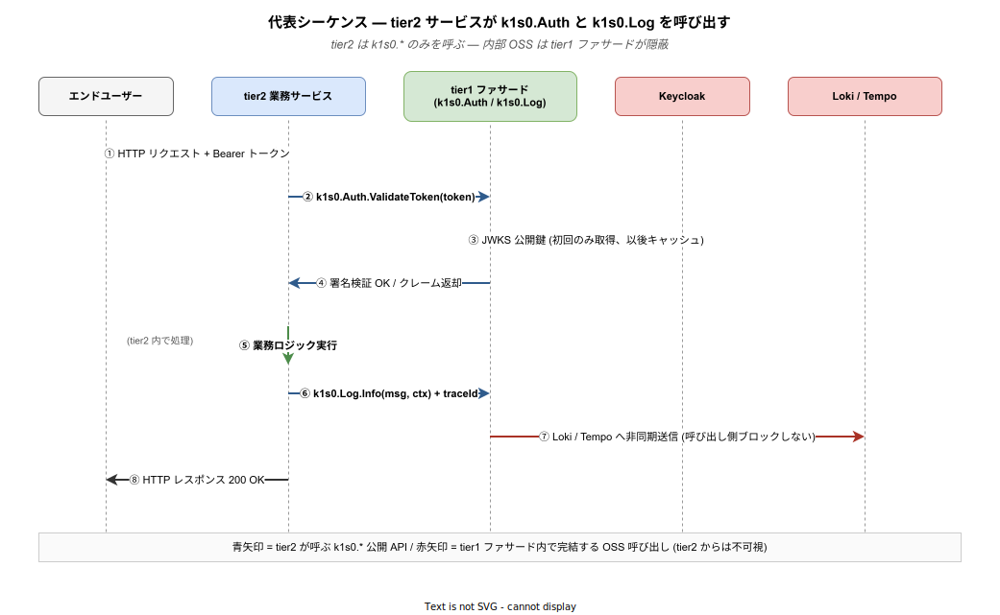

# 05. 機能要件 (FR-xxx)

本章では、k1s0 プラットフォームが **システムとして提供すべき機能** を Functional Requirement (FR) として列挙する。各 FR は業務要件 ([`04_業務要件.md`](./04_業務要件.md) BR-xxx) の実現を支える。

機能要件は「業務要件を満たすためにプラットフォームが具体的に何をするか」を記述する層で、後工程の設計・実装・テストが直接参照する入力となる。各 FR は「どの tier で提供するか」「どの Phase で着手するか」「どの BR を支えるか」の 3 軸で必ず位置づけられている。特に重要なのは tier の区別で、tier1 公開 API として提供するものは `k1s0.*` という名前空間で統一され、内部の OSS 実装 (Keycloak / Kafka / PostgreSQL 等) は tier2 / tier3 から一切見えない状態を保つ。これが BR-003 「横断的関心事の統一」と BR-007 「5 年後の継続性」を同時に実現する構造上の要となる。



図は業務サービスが認証つきリクエストを受けてログを出力するまでの最小の流れを示している。tier2 サービスは `k1s0.Auth.ValidateToken` と `k1s0.Log.Info` の 2 つしか呼ばない — それなのに実体としては Keycloak の JWKS 取得、署名検証、Loki / Tempo への非同期送信、traceId の自動付与までが起きている。青い矢印が tier2 から見える世界、赤い矢印が tier1 の内側で完結して tier2 には見えない世界である。この「見える / 見えない」の境界線を厳格に引くことが、個別 FR の設計判断すべての共通ルールになる。FR-101 の CI ガード (禁止 import 検知) はこの境界線を機械的に強制する装置として位置付けられる。

---

## 1. 機能要件の読み方

### 1.1 フォーマット

```
### FR-xxx: (要件名)

| 項目 | 内容 |
|---|---|
| 優先度 | MUST / SHOULD / COULD / WON'T |
| 関連 BR | BR-xxx |
| 提供層 | infra / tier1 / tier2 / tier3 / operation |
| Phase | Phase 1a / 1b / 2 / 3 以降 |
| 根拠 / 参照 | 詳細資料リンク |

(機能概要と受け入れ基準)
```

### 1.2 ID 体系

| ID 範囲 | カテゴリ | 提供層 |
|---|---|---|
| FR-010 ～ FR-019 | 認証 / 認可 | tier1 |
| FR-020 ～ FR-029 | ログ / メトリクス / トレース | tier1 |
| FR-030 ～ FR-039 | 監査 | tier1 |
| FR-040 ～ FR-049 | State / データ永続化 | tier1 |
| FR-050 ～ FR-059 | Pub-Sub / メッセージング | tier1 / infra |
| FR-060 ～ FR-069 | 観測性統合 / ダッシュボード | operation |
| FR-070 ～ FR-079 | Workflow / 業務ルール | tier1 |
| FR-080 ～ FR-089 | レガシー共存 | tier1 / tier3 |
| FR-090 ～ FR-099 | アプリ配信ポータル / 端末管理 | tier3 |
| FR-100 ～ FR-109 | 開発者支援ツール (CLI 等) | operation |
| FR-110 ～ FR-119 | 開発者ポータル (Backstage) | operation |
| FR-120 ～ FR-129 | Runbook / ドキュメント | operation |
| FR-130 ～ FR-139 | API 設計原則・バージョニング | tier1 |
| FR-140 ～ FR-149 | CI/CD / GitOps | operation |
| FR-150 ～ FR-159 | 多言語クライアントライブラリ | tier1 |
| FR-160 ～ FR-169 | シークレット管理 | tier1 |
| FR-170 ～ FR-179 | サービス間呼び出し | tier1 |

---

## 2. 認証 / 認可 (FR-010 ～ FR-019)

認証・認可は「誰が」「何をしてよいか」を全コンポーネントで統一的に判定するレイヤで、k1s0 の他のすべての機能が前提として依存する。tier2 / tier3 の開発者は Keycloak の存在や JWKS の仕組みを知らずに `k1s0.Auth.*` を呼ぶだけで要件を満たせる状態を目指す。将来 Keycloak を別の IdP (Authelia 等) に差し替えても、呼び出し側コードに変更を及ばせないことが FR-131 「内部実装の隠蔽」と合流する最初の実例となる。

### FR-010: SSO による全コンポーネント認証統合

**優先度 MUST / 関連 BR-003・BR-032 / 提供層 tier1・operation / Phase 1a**

現状、JTC 情シスが持つ業務ツール (監視ダッシュボード、CI/CD、リポジトリ、チケット、業務アプリ) はそれぞれ独自のアカウントを持ち、ユーザは 5〜10 個のパスワードを使い分けている。結果として「共通パスワードの使い回し」「退職者アカウントの残存」「パスワード忘れによるサービスデスク工数」が常態化する。k1s0 では Keycloak を OIDC プロバイダとして単一化し、Backstage / Grafana / Argo CD / アプリ配信ポータル / Harbor / tier2 業務アプリのすべてが Keycloak でログインする状態を作る。

ユーザ視点では、いずれかのコンポーネントでログインすると他のコンポーネントは再ログインなしで使える。ログアウト時はシングルログアウト (SLO) で全コンポーネントから同時にログアウトする。これが崩れると BR-032 「退職者の権限剥奪 24 時間以内」が実現できず、個別システムへのアカウント残存が監査上の不備として残る。

受け入れ基準:
- Backstage / Grafana / Argo CD / 配信ポータルの 4 コンポーネントで SSO ログイン 1 回 → 全てアクセス可能を E2E テストで確認
- SLO により 4 コンポーネントすべてから同時にセッションが切れることを確認
- Keycloak は Phase 1b で HA (Active/Active) 構成で稼働する

参照: [`../01_企画/02_アーキテクチャ/04_セキュリティモデル.md`](../01_企画/02_アーキテクチャ/04_セキュリティモデル.md)

---

### FR-011: `k1s0.Auth` 統一 API 提供

**優先度 MUST / 関連 BR-003・BR-012 / 提供層 tier1 / Phase 1a**

tier2 / tier3 の業務アプリが認証・認可を行う際、Keycloak の SDK を直接 import すると、将来 IdP を差し替える (Authelia 等へ) 場合にすべての業務アプリに影響が波及する。BR-007 の「5 年後の継続性」を保つには tier2 / tier3 から IdP 実装が見えない状態が必要である。そこで `k1s0.Auth` ファサードを提供し、tier2 / tier3 は `ValidateToken(token)` / `GetUserClaims()` / `HasRole(role)` の 3 関数だけを呼ぶ。内部では Keycloak JWKS を取得・キャッシュして署名検証する。

性能目標は p99 50 ms 以内 (NFR-001) で、JWKS キャッシュを活用することで Keycloak 自体が短時間 (数分間) 停止してもトークン検証は継続できる (グレースフルデグラデーション)。これにより Keycloak の再起動やアップデート時も業務アプリが止まらない。

受け入れ基準:
- `k1s0.Auth.ValidateToken` の p99 レイテンシ 50 ms 以内を負荷試験で確認
- Keycloak 停止後 10 分間、JWKS キャッシュで検証が継続できることを確認
- tier2 サンプルコードが Keycloak SDK を一切 import していないことを CI で検証 (FR-101 と連動)

---

### FR-012: RBAC によるきめ細かい認可

**優先度 MUST / 関連 BR-032・BR-033 / 提供層 tier1 / Phase 1b**

認可を「ログインできるか」だけで判断すると、一度ログインしたユーザは全機能を触れてしまい、J-SOX の職務分掌要件を満たせない。k1s0 では Keycloak RBAC (業務ロール判定) + k8s RBAC (インフラ操作権限) + Istio AuthorizationPolicy (サービス間通信制御) の 3 層で重ねて認可を判定する。業務アプリの権限は「閲覧」「編集」「管理」などのロールで表現し、Keycloak で集中管理する。

3 層で重ねることで、仮にある層 (例えば tier2 実装側) に認可漏れがあっても Istio 層で拒否される。ゼロトラスト的多層防御の最小構成となる。

受け入れ基準:
- 閲覧ロールのユーザが編集 API を呼ぶと 403 が返ることを E2E で確認
- Istio AuthorizationPolicy が未許可サービス間通信を拒否することを確認
- 全ロール割り当て操作が監査ログ (FR-030) に記録される
- **Phase 1b 暫定運用 (BR-032 対応)**: 退職・異動時の Keycloak ユーザ無効化を手動で 24 時間以内に完了する手順書が TechDocs に整備されていること。手順書には (1) 人事からの連絡受領、(2) Keycloak 管理コンソールでのユーザ無効化操作、(3) 全アプリからの 403 応答確認、(4) 監査ログへの操作記録確認 の 4 ステップを含む。この暫定手順は FR-013 (権限変更即時反映、Phase 2) の実装により自動化に置き換わる。**セキュリティ上の注意**: Phase 1b ではアクセストークン TTL が固定値 (FR-013 未実装) のため、Keycloak でユーザ無効化後もトークンの残り有効期限 (最大 5 分) の間はアクセスが継続する。この猶予ウィンドウは FR-013 実装後に解消されるが、Phase 1b では手順 (2) 実行後に (3) の確認を 5 分間隔で繰り返す必要がある

---

### FR-013: 権限変更の即時反映

**優先度 SHOULD / 関連 BR-032 / 提供層 tier1 / Phase 2**

BR-032 で定めた「退職・異動から 24 時間以内に権限剥奪」を技術的に担保する仕組み。アクセストークンの有効期限を 5 分に設定し、5 分ごとに Keycloak へリフレッシュ要求が飛ぶ構造にすることで、Keycloak 側でユーザを無効化すると最悪でも 5 分で全アプリから締め出される。24 時間という BR 側の目標に対して、技術的には分単位の即時性を提供する。

Phase 2 で実装する理由は、Phase 1b 時点ではアクセストークン有効期限を固定値で運用し、人事イベントを手動で Keycloak に反映する簡易運用で BR-032 の 24 時間目標は満たせるためである。即時性を分単位に上げる価値は、退職者数が増える Phase 2 以降で顕在化する。

受け入れ基準:
- アクセストークン TTL 5 分を設定し、Keycloak でユーザ無効化後 5 分以内に全 API が 401 を返すことを検証

---

## 3. ログ / メトリクス / トレース (FR-020 ～ FR-029)

観測性 3 点セット (ログ・メトリクス・トレース) は、障害発生時に「何が起きたか」を復元するための素材である。tier2 / tier3 の開発者に `traceId` や OpenTelemetry の詳細を意識させず、`k1s0.Log.Info` 1 行を書くだけで 3 点セットが自動で相互リンクされている状態を目指す。ここでの非同期送信 (呼び出し側をブロックしない) はパフォーマンス要件 NFR-001 を守るための必須要件であり、「ログが詰まると業務が止まる」状態を構造的に回避する。

### FR-020: `k1s0.Log` 構造化ログ API

**優先度 MUST / 関連 BR-003・BR-012・BR-020 / 提供層 tier1 / Phase 1a**

従来の業務アプリは各自が printf 相当の自由形式でログを書き、ファイル / syslog / 各社独自のログ基盤に出力していた。結果、障害時に横串検索できず、1 件のエラーに対する影響範囲特定 (どのユーザが何件影響を受けたか) に数時間を要する。k1s0 では `k1s0.Log.Info / Warn / Error(message, context)` の 1 関数呼び出しで JSON 構造化ログが Loki に集約され、`traceId` と `spanId` が自動付与されて分散トレース (FR-022) と相互リンクする。

重要な設計判断として、ログ送信は呼び出し側をブロックしない非同期処理にする。これによりログ送信先 (Loki) が短時間詰まっても業務トランザクションは止まらない。NFR-001 の p99 50 ms を守るための前提となる。

受け入れ基準:
- `k1s0.Log.Info` の p99 レイテンシ 50 ms 以内 (非同期送信のため実質は関数呼び出しコストのみ)
- Trace / Debug / Info / Warn / Error / Fatal の 6 レベル対応
- `traceId` / `spanId` が自動付与され、Grafana で分散トレースと相互遷移可能であることを確認
- Loki が停止中でも呼び出し側の業務処理が継続する (in-memory バッファ + 再送ロジック)
- ログインジェクション防止: ユーザ入力を含むログメッセージの改行文字・制御文字をエスケープし、偽ログ行の挿入を防止する。tier1 の `k1s0.Log` 内部で自動サニタイズを行い、tier2 / tier3 の開発者は追加対応不要とする

---

### FR-021: `k1s0.Telemetry` メトリクス / カスタムメトリクス送信

**優先度 MUST / 関連 BR-020 / 提供層 tier1 / Phase 1a**

障害時に「いつから」「どの程度」異常が起きていたかを判定するにはメトリクスが不可欠である。k1s0 では OpenTelemetry 準拠で Counter / Gauge / Histogram を送信し、Prometheus (短期) + Mimir (長期) に保存する。tier2 / tier3 は `k1s0.Telemetry.Counter("orders.created").Inc()` のような呼び出しを書くだけで、内部の Exporter / Collector / 保存先 URL は一切意識しない。

OpenTelemetry 準拠にする理由は、Prometheus 単体に縛られず将来 Datadog / New Relic 等へ差し替える余地を残すためである。BR-002 「ベンダーロックイン回避」とも連動する。

受け入れ基準:
- Counter / Gauge / Histogram の 3 種を tier2 サンプルから送信 → Grafana で可視化できる
- カスタムメトリクスが Service Level Indicator (例: 注文処理成功率) として定義でき、アラート連携可能

---

### FR-022: 分散トレースの自動付与

**優先度 MUST / 関連 BR-020 / 提供層 tier1・infra / Phase 1a (SDK 手動計装) → Phase 1b (Istio 自動注入)**

マイクロサービスに分割すると、1 リクエストが 5〜10 サービスを跨ぐのが普通になる。分散トレースがなければ「遅いのはどのサービスか」を特定できず、各サービスの開発者が互いに「うちじゃない」と責任を押し付ける状況が発生する。FR-022 では HTTP / gRPC / `k1s0.Service.Invoke` のいずれを経由しても `traceId` / `spanId` が自動伝播し、Grafana Tempo に集約される。

分散トレースの実現は 2 段階で進める。Phase 1a では Istio が未導入のため、`k1s0.Log` / `k1s0.Telemetry` の内部で OpenTelemetry SDK を使い、`traceId` / `spanId` の生成・HTTP ヘッダ伝播・Tempo への送信を tier1 ファサード経由で行う。tier2 / tier3 の業務コードは `k1s0.Log.Info` を呼ぶだけで `traceId` が自動付与される。Phase 1b で Istio を導入した後は、Envoy サイドカーがサービス間通信の HTTP ヘッダ注入を自動で肩代わりし、tier2 / tier3 の業務コードは何も書かずにトレース接続される。ログ (FR-020) / メトリクス (FR-021) との `traceId` 共通化により、Grafana で 1 クリック往復できる。

受け入れ基準:
- Phase 1a: 2 サービス跨ぎの Span Tree が Tempo に記録され、Grafana からログ ⇄ トレース遷移が成立する (OpenTelemetry SDK による手動計装)
- Phase 1b: Istio 導入後、3 サービス以上を跨ぐリクエストの完全な Span Tree が Tempo で可視化される (Envoy 自動注入)
- ログからトレースへ、トレースからメトリクスへ、Grafana UI で遷移できる

---

## 4. 監査 (FR-030 ～ FR-039)

監査ログは「後から証明するための記録」であり、通常のログとは設計思想がまったく異なる。通常ログは障害調査が終われば不要になるが、監査ログは J-SOX / 個人情報保護法の観点から 365 日保持し、改ざん防止が保証されていなければならない。ハッシュチェーン構造によって「あるレコードが途中で書き換わると、それ以降のレコードのハッシュが連鎖的に破綻する」仕組みを導入し、検知可能性を担保する。

### FR-030: `k1s0.Audit` 監査ログ記録

**優先度 MUST / 関連 BR-033 / 提供層 tier1 / Phase 1a**

監査ログは「後から改ざんされていないことを証明できる記録」でなければ法的証拠能力を持たない。単にログを書くだけでは、運用担当が DB を直接いじって削除した場合に検知できない。FR-030 では各監査レコードに「前レコードのハッシュ」を含めるハッシュチェーン構造を採用する。途中で 1 レコードが書き換わると、それ以降すべてのレコードのハッシュが連鎖的に破綻するため、第三者 (監査法人) が改ざん検知できる。

tier2 / tier3 は `k1s0.Audit.RecordAsync(action, userId, targetId, context)` を呼ぶだけで、内部のハッシュ計算 / 署名 / PostgreSQL 永続化は隠蔽される。通常ログ (FR-020) と違い、監査ログは **同期書き込み** で失敗を呼び出し側に返す。監査記録なしに業務処理を完了させないことが J-SOX 対応の前提となる。

**Genesis Record (起源レコード) の管理**

ハッシュチェーンの最初のレコード (genesis record) は「前ハッシュ」が存在しない特殊なレコードであり、チェーン全体の信頼性の根拠となる。genesis record が改ざん・消失すると、それ以降のチェーン全体の検証が不能になる。以下の管理方針を定める。

- genesis record の `prev_hash` フィールドには固定値 `0000000000000000000000000000000000000000000000000000000000000000` (SHA-256 のゼロ値) を格納する。これにより genesis record であることが自明になり、検証スクリプトが特殊分岐なしで処理できる。
- genesis record は k1s0 クラスタの初期化時 (Phase 1a 構築時) に自動生成され、PostgreSQL と MinIO の両方に保管する (NFR-071 のバックアップ方式と連動)。
- genesis record のハッシュ値を TechDocs (FR-110) にオフラインコピーとして記録する。クラスタ再構築時に genesis record の正当性を外部照合できるようにするため。
- genesis record の削除は物理的に禁止する (PostgreSQL の行レベルセキュリティポリシーで DELETE を拒否)。

**同期書き込みの性能影響と緩和策**

FR-030 は「監査記録なしに業務処理を完了させない」ことを原則とし、同期書き込み (`Audit.RecordAsync` の await 完了まで業務レスポンスを返さない) を採用する。これは J-SOX 対応の必須要件だが、全 API 呼び出しに監査ログ書き込みの遅延 (PostgreSQL の fsync 込みで 5〜15 ms) が上乗せされるため、NFR-001 (p99 500 ms) への影響を考慮する必要がある。

緩和策として以下を採用する。

- **バッチ書き込み**: 同一リクエスト内で複数の監査イベントが発生する場合 (例: ロール変更 + 対象ユーザへの通知)、個別に INSERT せず、リクエスト完了時に一括 INSERT する。1 回の fsync で複数レコードを永続化でき、I/O 回数を削減する。
- **PostgreSQL の同期レプリカ構成**: `synchronous_commit = on` (デフォルト) を維持しつつ、WAL の書き込み先を高速ストレージ (NVMe SSD) に限定する。CloudNativePG の `walStorage` で WAL 専用の PVC を割り当てる。
- **非監査対象の分離**: 全 API 呼び出しが監査対象なわけではない。監査対象は「状態変更を伴う操作」(Write / Delete / ロール変更 / シークレットアクセス) に限定し、Read 操作は監査ログではなく通常のアクセスログ (FR-020) で記録する。これにより同期書き込みの発生頻度を全リクエストの 30〜40% に抑える。

受け入れ基準:
- 全レコードに前ハッシュ・タイムスタンプ (RFC 3339 ナノ秒)・署名者 ID を含む
- genesis record が存在し、`prev_hash` がゼロ値であることを検証スクリプトで確認
- 1 レコードを手動で書き換え → 検証スクリプトが改ざんを検知することを確認
- 保持期間 365 日以上 (NFR-062 準拠)
- 期間 / ユーザ / アクション / ターゲット で検索可能
- 同期書き込みを含む監査対象 API の p99 レイテンシが NFR-001 (500 ms) を満たすことを負荷試験で確認

参照: [`../01_企画/03_tier1設計/`](../01_企画/03_tier1設計/)

---

### FR-031: 監査ログの検索 UI

**優先度 SHOULD / 関連 BR-033 / 提供層 operation (Grafana・Backstage) / Phase 2**

監査担当は一般に非エンジニアであり、CLI での検索は現実的でない。FR-031 では Grafana のダッシュボード (または Backstage プラグイン) 上で、期間 / ユーザ / アクション種別を UI から指定し、CSV / Excel 形式でエクスポートする機能を提供する。Phase 2 とした理由は、Phase 1b 時点では監査担当が情シスに依頼して SQL 検索する暫定運用で業務が回るためである。

受け入れ基準:
- 監査担当が自力で検索 → CSV エクスポートまで完結できる
- UI 操作自体も監査ログに記録 (監査担当の検索行為を追跡可能に)

---

## 5. State / データ永続化 (FR-040 ～ FR-049)

マイクロサービスが「セッション情報をどこに持つか」「業務データをどの DB に書くか」を各自判断すると、Redis / Memcached / PostgreSQL / MySQL / SQL Server が乱立し、運用負荷が線形に増える。FR-040 の `k1s0.State` API は、状態永続化の選択肢を Valkey (低レイテンシ) または PostgreSQL (トランザクション / SQL 必須) の 2 択に絞り、tier2 / tier3 からは URL・接続先を意識しない呼び出しを提供する。

### FR-040: `k1s0.State` キー・値ストア API

**優先度 MUST / 関連 BR-003・BR-012 / 提供層 tier1 / Phase 1a**

`k1s0.State.SaveAsync / GetAsync / DeleteAsync(namespace, key, value)` の 3 関数で状態を永続化する。バックエンドはデフォルト Valkey、トランザクションや SQL 検索が必要な場合は PostgreSQL を選択する。tier2 / tier3 は接続文字列・認証情報・レプリカ構成を一切知らずに API を呼ぶ。namespace で各サービスのキー空間を分離し、他サービスとのキー衝突を防ぐ。

ETag による楽観的ロックをサポートし、「読み取り → 更新」間の競合を検知できる。TTL 設定により、一時的なセッション情報は自動消滅する。

受け入れ基準: p99 レイテンシ 100 ms 以内 / ETag 不一致で Save が失敗を返す / TTL 期限後に Get が null を返す

---

### FR-041: Bulk / Transaction 操作

**優先度 SHOULD / 関連 BR-003 / 提供層 tier1 / Phase 2**

複数キーを 1 回の呼び出しで一括取得・更新する Bulk、および複数キーを原子的に更新する Transaction を提供する。Phase 1a では 1 キー単位の操作で業務ユースケースの大半をカバーできるが、Phase 2 以降に業務アプリが増えると「注文明細 10 件を一括更新」のような需要が顕在化する。

受け入れ基準: 100 キーの Bulk Get が 200 ms 以内 / Transaction 中のエラーで全キーがロールバック

---

## 6. Pub-Sub / メッセージング (FR-050 ～ FR-059)

サービス間通信を全て同期 HTTP で組むと、1 サービスの障害が呼び出し元に伝播して連鎖障害を起こす。非同期のイベント駆動アーキテクチャに逃がす部分を設けることで、システム全体のレジリエンスが上がる。FR-050 の `k1s0.PubSub` は Kafka / Strimzi を内部バックエンドとして隠蔽し、tier2 / tier3 は CloudEvents 形式のイベントを発行・購読するだけで済む。

### FR-050: `k1s0.PubSub` イベント発行 / 購読 API

**優先度 MUST / 関連 BR-003 / 提供層 tier1 (バックエンド: Kafka / Strimzi) / Phase 1a**

`k1s0.PubSub.PublishAsync(topic, eventType, payload)` でイベントを発行し、`Subscribe(topic, handler)` で購読する。ペイロードは CloudEvents (CNCF 標準) 形式で、`id` / `source` / `type` / `time` / `data` を含む。Kafka のパーティショニング・Consumer Group 管理・オフセットコミットは tier1 が引き受け、tier2 / tier3 は単純な関数ハンドラを書くだけで済む。

At-Least-Once 配信保証とする — 重複処理は業務アプリ側で冪等性を確保する前提。Consumer Lag (未処理メッセージ数) を `k1s0.Telemetry` が自動公開するため、遅延時のアラート運用がそのまま回る。

受け入れ基準: Publish p99 200 ms 以内 / Consumer Lag メトリクスが Grafana で可視化される / 購読側 Pod の突然停止後、メッセージが他 Pod で処理されることを確認

---

### FR-051: Dead Letter Queue (DLQ) 自動化

**優先度 SHOULD / 関連 BR-020 / 提供層 tier1 / Phase 2**

Handler が連続失敗する (例: 不正なペイロード、外部 API エラー) と、Consumer Group が再試行を繰り返してスタックし、他の正常メッセージも処理できなくなる。FR-051 では連続失敗したメッセージを自動的に DLQ トピックに退避し、運用担当が Runbook に沿って内容を調査・修正・再投入する運用を提供する。Phase 2 とした理由は、Phase 1b 時点では連続失敗メッセージの発生頻度が低く、手動対応で回せるためである。

受け入れ基準: 3 回連続失敗で DLQ に退避される / DLQ からの再投入手順が TechDocs 化されている

---

## 7. 観測性統合 / ダッシュボード (FR-060 ～ FR-069)

ログ・メトリクス・トレースの 3 点セットが別々のツールに散っていると、障害時に 3 画面を行き来しながら状況を組み立てることになる。FR-060 / FR-061 はこの 3 点を Grafana 単一画面に集約し、`traceId` で相互遷移できる状態を提供する。

### FR-060: LGTMP スタック統合ダッシュボード

**優先度 MUST / 関連 BR-020 / 提供層 operation / Phase 1b**

Loki (ログ) / Tempo (トレース) / Mimir (メトリクス長期) / Prometheus (メトリクス短期) / Grafana (可視化) を LGTMP として統合する。Grafana 画面で、メトリクスで異常を検知 → 同時刻帯のログに 1 クリックで遷移 → 特定ログから `traceId` でトレース遷移、が 1 セッションで完結する。障害原因特定までの平均時間 (MTTR) を BR-020 で目標としている 15〜30 分に収める技術基盤となる。

受け入れ基準: 3 点セット間の 1 クリック相互遷移 / `traceId` によるログ・トレース・メトリクス紐付けが動作

---

### FR-061: 標準ダッシュボード群の提供

**優先度 MUST / 関連 BR-020 / 提供層 operation / Phase 1b**

Grafana をただ入れても、ダッシュボードが空では運用担当は使いこなせない。Phase 1b で以下の標準ダッシュボードを同梱する: (1) k8s 全体 (Node / Pod / Namespace)、(2) tier1 API (RPS / Latency / Error Rate、NFR-001 の p99 500 ms 監視用)、(3) Kafka (Consumer Lag / Throughput)、(4) PostgreSQL (接続数 / クエリ遅延 / レプリカ遅延)、(5) Istio (mTLS 成功率 / サービス間遅延)。これらは「初日から使える」状態で配布する。

受け入れ基準: Phase 1b 時点で 5 種のダッシュボードが Grafana に事前構成済みで、起動直後からデータが表示される

---

### FR-062: Pyroscope による継続的プロファイリング

**優先度 SHOULD / 関連 BR-020 / 提供層 operation / Phase 1b**

メトリクス (FR-021) が「何が遅いか」を示すのに対し、継続的プロファイリングは「なぜ遅いか」をコードレベルで示す。tier1 Go ファサードの CPU / メモリ割り当て特性を Phase 1b の早期段階で握っておかないと、Phase 2 以降で性能劣化が発生した際に過去データとの比較ができず、原因特定が極めて困難になる。Pyroscope は Grafana Labs 製の OSS 継続的プロファイリングツールで、LGTMP スタック (FR-060) と統合して Grafana UI から直接参照できる。

Phase 1b で導入する理由は、tier1 の初期段階でベースラインプロファイルを取得しておくことで、Phase 2 以降の機能追加による性能退行を検知できるようにするためである。後から入れると過去データがなく、比較対象を失う。

受け入れ基準:
- tier1 Go ファサードの CPU / メモリプロファイルが Pyroscope に継続的に送信される
- Grafana UI からサービス × 期間を指定してフレームグラフを表示できる
- Phase 1b 完了時点で tier1 の主要 API 10 種のベースラインプロファイルが保存されている

---

## 8. Workflow / 業務ルール (FR-070 ～ FR-079)

「承認金額が 100 万円以上なら部長承認、以下なら課長承認」のような業務ルールは、コードに埋め込むと毎回ソース改修 + デプロイが必要になる。FR-070 はルールを決定表 (JDM) として外部化し、業務部門側で変更可能にする。FR-071 の Workflow は人間承認を含む長期プロセスを Temporal で、機械完結の短期プロセスを Dapr Workflow で振り分ける。

### FR-070: `k1s0.Decision` 業務ルール評価 (ZEN Engine)

**優先度 MUST / 関連 BR-010 / 提供層 tier1 / Phase 1b**

ZEN Engine (GoRules) を tier1 内部に組み込み、JDM 形式の決定表を `k1s0.Decision.Evaluate(decisionId, input)` で評価する。承認ルート判定・権限判定・金額区分分類などを決定表として定義すれば、業務部門のアナリストが GUI で編集して Git へコミット → Argo CD で本番反映、というループがソースコード改修なしで回る。BR-010 の「リードタイム短縮」はコード改修だけでなく、業務ルール変更の反映速度でも評価される。

受け入れ基準: サンプル決定表 (3 条件分岐) を ZEN Engine で評価 → 期待値一致を確認 / 決定表の JDM ファイルを Git で管理し Argo CD で反映される

---

### FR-071: `k1s0.Workflow` 長期ワークフロー

**優先度 SHOULD / 関連 BR-010 / 提供層 tier1 (Dapr Workflow + Temporal) / Phase 2**

短期 (秒〜分) のシステム完結ワークフローは Dapr Workflow で、長期 (数日〜数か月、人間承認含む) は Temporal でというバックエンドの使い分けを tier1 内部で隠蔽する。tier2 / tier3 は `k1s0.Workflow.Start / Signal / Wait` の共通 API で呼ぶ。人間承認ステップが入る稟議フローなどは Temporal 側に振られる。

Phase 2 とした理由は、Phase 1b までのユースケースは PubSub (FR-050) とイベントハンドラで大半が表現可能で、Workflow 抽象が必要になるのは業務アプリが 5 本以上並走する段階だからである。

受け入れ基準: 7 日間待機を含むサンプルワークフローが完走する / Pod 再起動を跨いで状態が保持される

---

## 9. レガシー共存 (FR-080 ～ FR-089)

JTC 情シスは既存の .NET Framework / ASP.NET WebForms 資産を抱えており、これを一掃しなければ k1s0 を導入できないなら政治的に通らない。FR-080 / FR-081 は 2 つの参加経路を用意する — コンテナ化できる .NET Framework アプリは Pod 内サイドカー方式 (FR-080)、コンテナ化困難なオンプレ Windows サーバは API Gateway 経由 (FR-081) で接続する。どちらも Phase 4 で実装するが、Phase 1 時点から「抜け道を設計済」であることを示すことで経営層の安心感を得る。

### FR-080: .NET Framework サイドカー方式参加

**優先度 SHOULD / 関連 BR-005 / 提供層 tier3・tier1 / Phase 4**

.NET Framework 4.8 以降のアプリは Windows Server Core 2019/2022 コンテナに載せられる。k8s Pod 内で IIS + ASP.NET WebForms を動かし、サイドカーとして k1s0 Auth / Log / State 等へ接続するプロキシを同居させる。業務コードは `k1s0.*` クライアントライブラリ (FR-150 の .NET Framework 版) を経由するだけで、Pod の内部構造を意識しない。

受け入れ基準: 既存 .NET Framework WebForms アプリ 1 本を k8s Pod 化し、k1s0.Auth でログインして動作することをデモ

---

### FR-081: API Gateway 経由のレガシー接続

**優先度 SHOULD / 関連 BR-005 / 提供層 infra (Envoy Gateway) / Phase 4**

コンテナ化できないレガシー資産 (AS/400 / Oracle Forms / 古い .NET アプリ) は k8s 外で動かし続け、Envoy Gateway 経由で k1s0 側から参照する。Envoy 側で認証 (k1s0 JWT → レガシー Basic 認証への変換) / レート制限 / 監査ログ取得を肩代わりし、レガシー側の改修を最小化する。

受け入れ基準: レガシー REST API を Envoy Gateway 経由で `k1s0.Service.Invoke` から呼び出し成功

---

## 10. アプリ配信ポータル / 端末管理 (FR-090 ～ FR-099)

アプリ配信ポータルは、情シスとエンドユーザーが k1s0 に初めて触れる「顔」の役割を担う。他のすべての tier1 機能が裏方で機能し、ユーザの前には「ブラウザを開き、アイコンをクリックしたら業務アプリが起動する」という体験だけが現れる状態を目指す。Phase 1a (MVP-0) では PWA 1 本の配信という最小形から始め、Phase 3 で端末設定コピー (BR-031) までを含む完全版に拡張する。

### FR-090: アプリ配信ポータル (業務アプリストア)

**優先度 MUST / 関連 BR-030 / 提供層 tier3 / Phase 1a (最小版)・Phase 3 (完全版)**

BR-030 を技術的に実現する主役の機能。ブラウザでポータル URL にアクセスすると Keycloak SSO が効き、ログイン後は自分の権限で使えるアプリがカード形式で一覧される。権限判定は Keycloak のロールを参照して行われ、権限のないアプリはそもそも表示されない (列挙さえさせないことで、ロール名の漏洩も防ぐ)。カテゴリ検索 / お気に入り登録 / 最近使用した順ソートなどを備える。

Phase 1a の最小版では PWA 1 本を「インストール」できる状態のデモに絞り、Phase 3 で MSIX 配信や端末設定コピー (FR-091) と統合する。全操作 (表示 / インストール / 起動) は `k1s0.Audit` に記録され、不正アクセス調査の素材となる。

受け入れ基準:
- ログイン → 目的アプリ起動までを 95 パーセンタイルで 3 クリック以内・60 秒以内
- 権限のないアプリが一覧に表示されないことを E2E で確認
- 全操作が Audit ログに残ることを確認

参照: [`../01_企画/05_CICDと配信/02_アプリ配信ポータル.md`](../01_企画/05_CICDと配信/02_アプリ配信ポータル.md)

---

### FR-091: 端末設定コピー機能

**優先度 SHOULD / 関連 BR-031 / 提供層 tier1 (Settings API)・tier3 / Phase 3**

BR-031 を技術的に実現する機能。新端末ログイン時に「旧端末からコピー」ボタンが表示され、コピー元として (1) 自分の旧端末 (前回ログインから 90 日以内) / (2) 同僚のテンプレート (本人の明示承認必須) / (3) 部署標準テンプレート (情シス管理) を選択する。コピー対象は業務アプリ一覧・ショートカット・ブックマーク・プリンタ接続設定で、パスワード / 生体認証 / 暗号化鍵などの機密情報は対象外とし、ユーザに再設定を促す。

コピー元 (2) は本人承認を Keycloak ベースの OAuth 同意フローで得る設計とし、同僚が勝手に取得できないことを保証する。

受け入れ基準: 3 種のコピー元それぞれで動作 / 機密設定の除外が明示される / コピー操作が Audit に記録される

---

### FR-092: 端末台帳管理

**優先度 SHOULD / 関連 BR-030・BR-032 / 提供層 tier3 / Phase 2**

「ユーザ × 端末 × インストール済アプリ」の台帳を自動管理する機能。配信ポータル (FR-090) でのインストール操作を契機に台帳が更新され、退職時には該当ユーザの全端末に対して一括でアプリアンインストール指示を出せる。BR-032 (退職者権限剥奪) を端末レベルで担保する補完機能。

受け入れ基準: ユーザ退職フラグ → 対象端末一覧が自動抽出され、アンインストール指示が MDM 連携で発行される

---

### FR-093: `k1s0.Settings` 端末横断設定同期 API

**優先度 SHOULD / 関連 BR-031・BR-033 / 提供層 tier1 (バックエンド: PostgreSQL)・tier3 / Phase 3**

BR-031 (PC リプレース時の設定復元) と FR-091 (端末設定コピー) の技術基盤となる API。ユーザごとの業務設定 (アプリ一覧・ショートカット・ブックマーク・プリンタ接続設定) を `k1s0.Settings.Save / Get / Sync(userId, scope, settings)` で永続化し、端末を跨いで同期する。パスワード・生体認証・暗号化鍵などの機密情報はスキーマレベルで保存を拒否し、送信時に 400 Bad Request を返す。

tier1 の `k1s0.State` (FR-040) との違いは、State がサービス単位のキー・値ストアであるのに対し、Settings はユーザ単位の設定データに特化し、端末識別子・スコープ (個人/部署/全社) ・機密フィルタリングを内蔵する点にある。

Phase 3 で実装する理由は、FR-091 (端末設定コピー) と同時に導入することで一貫した UX を提供でき、Phase 1b 時点ではユーザ設定の横断同期需要がパイロット規模 (10 名) では顕在化しないためである。

受け入れ基準:
- ユーザ A の端末 1 で Save した設定を、端末 2 で Get/Sync して復元できる
- 機密フィールド (password / credential / secret を含むキー) の保存が 400 で拒否される
- 全操作が Audit ログ (FR-030) に記録される

---

## 11. 開発者支援ツール (FR-100 ～ FR-109)

開発者支援ツールは「新規サービス立ち上げのたびに繰り返されてきた単純作業」を自動化し、BR-008 の属人化解消と BR-010 のリードタイム短縮を同時に達成する。雛形生成 CLI (FR-100) が正しい初期構造を配り、CI ガード (FR-101) が禁止パターンの混入を継続的に検知する。「正しいやり方を用意してから使う方が楽」という非対称性を作り出すことが、長期的な規約違反ドリフトを防ぐ最大の仕掛けとなる。

### FR-100: 雛形生成 CLI

**優先度 MUST / 関連 BR-008・BR-010・BR-011 / 提供層 operation / Phase 1a**

新規サービスを立ち上げるたびに Dockerfile / k8s マニフェスト / CI 設定 / 認証・ログ・観測性の配線を手書きすると、初日に数時間を溶かし、かつ人によって微妙に違う「方言」が生まれる。これが属人化の始まりになる。FR-100 では `k1s0 new service --type=tier2-go` のようなコマンドで、正しい構造を持つサービス雛形を 5 秒以内に生成する。雛形には以下が含まれる — Dockerfile (multi-stage、non-root)、k8s マニフェスト (Deployment / Service / Ingress / NetworkPolicy)、CI 設定 (lint / test / build / push / security scan)、tier1 API 利用サンプル (Auth / Log / Telemetry が配線済み)、TechDocs スケルトン。

「正しいやり方」を使う方が「我流で書く」より早い状態を作り出すことで、規約違反のドリフトを構造的に防ぐ。

受け入れ基準: `k1s0 new service --type=tier2-go` で生成された雛形が、その場で push → CI 通過 → 本番相当環境にデプロイされるまで 30 分以内で完走する

---

### FR-101: CI ガード (禁止 import 検知)

**優先度 MUST / 関連 BR-013 / 提供層 operation (CI) / Phase 1b**

tier1 の内部実装を隠蔽する (FR-131) だけでは、tier2 / tier3 の開発者が好奇心で Dapr SDK / Kafka クライアント / Keycloak SDK を直接 import することを防げない。一度でも直接利用が許されると、将来 Dapr を差し替える際に全 tier2 コードを調査・修正する工数が発生し、BR-007 の「5 年後の継続性」が崩壊する。

FR-101 では CI パイプラインで import 文 / package.json の dependencies / go.mod をスキャンし、禁止リスト (例: `github.com/dapr/go-sdk`, `@dapr/js-sdk`, `Confluent.Kafka`, `Keycloak.Net`, `hashicorp/vault`, `openbao-sdk`) が含まれていれば PR をブロックする。NFR-076 (クラウド可搬性) の観点から、クラウド固有 SDK (`aws-sdk`, `Azure.Identity`, `cloud.google.com/go`) も禁止リストに含め、クラウド依存の混入を防ぐ。禁止理由と代替 API (`k1s0.*`) をエラーメッセージに含めることで、開発者が迷わず修正できるようにする。

受け入れ基準: 禁止 import を含む PR が CI で必ず fail / エラーメッセージに代替 API への案内が含まれる / 許可リストの例外は ADR 化されている場合のみ通す

---

### FR-102: ヘルスチェックエンドポイントの標準化

**優先度 MUST / 関連 BR-020・BR-024・NFR-030 / 提供層 tier1 / Phase 1a**

マイクロサービスの運用では、各サービスが「起動済みか」(Liveness) と「トラフィックを受け入れ可能か」(Readiness) を k8s に伝える仕組みが不可欠である。現状の情シス開発では、ヘルスチェックエンドポイントの実装がプロジェクトごとにバラバラ (パスが違う、チェック内容が違う、そもそも無い) で、k8s の livenessProbe / readinessProbe が正しく機能しないケースがある。Pod が落ちたまま気づかない、依存サービスの障害がカスケードする、ローリングアップデート中に不完全な Pod にトラフィックが流れる — これらはすべて標準化の欠如が原因である。

FR-102 では、雛形生成 CLI (FR-100) が生成するすべてのサービスに `/health` (Liveness) と `/ready` (Readiness) の 2 エンドポイントを標準搭載する。`/health` は「プロセスが正常動作中か」を返し、`/ready` は「依存サービス (DB / Kafka / Keycloak 等) への接続が確立済みか」を返す。レスポンス形式は JSON で統一し、`{"status": "ok"}` または `{"status": "degraded", "checks": [...]}` を返す。tier1 の `k1s0.Health` ヘルパーが各依存のチェックロジックを提供し、tier2 / tier3 開発者は `k1s0.Health.Register(name, checkFunc)` で業務固有のチェックを追加登録するだけで済む。

受け入れ基準:
- FR-100 で生成されるすべての雛形に `/health` / `/ready` エンドポイントが含まれる
- k8s の livenessProbe / readinessProbe が正しく動作し、依存障害時に readinessProbe が fail → トラフィック遮断されることを確認
- レスポンス形式が全サービスで統一されている (JSON スキーマの CI 検証)
- Grafana ダッシュボード (FR-061) にヘルスチェック状態のパネルが含まれる

---

## 12. 開発者ポータル (FR-110 ～ FR-119)

マイクロサービスが 10 本を超えると「何のサービスがどこにあるか」「誰がオーナーか」「どう呼び出すか」の情報が急速に散逸する。Backstage は CNCF Incubating のオープンソース開発者ポータルで、Spotify が社内で開発して OSS 化したものを JTC 情シスの属人化解消に転用する。

### FR-110: Backstage Software Catalog / TechDocs / Software Templates

**優先度 MUST / 関連 BR-008・BR-011・BR-021 / 提供層 operation / Phase 1b**

Backstage の 3 機能を導入する — (1) Software Catalog は全サービスの一覧・依存関係・オーナーを Git で宣言的に管理し、1 画面で「このサービスは何を呼び、何から呼ばれているか」を可視化する。(2) TechDocs は Markdown で書かれた各サービスドキュメントを中央集約し、Backstage UI から検索できる。(3) Software Templates は FR-100 の雛形生成 CLI を Web UI から起動できるようにする。開発者がターミナルを開かずに新規サービスを起票できる。

この 3 機能が揃うことで、新規参画者が「このプラットフォームで何をどう作るか」を数時間で把握できる状態になる。BR-008 (属人化解消) の根幹インフラ。

受け入れ基準: 全 tier2 / tier3 サービスが Catalog に登録されている / TechDocs 検索で 3 秒以内に結果が返る / Templates から雛形起票が可能

参照: [`../01_企画/05_CICDと配信/01_開発者ポータル_Backstage.md`](../01_企画/05_CICDと配信/01_開発者ポータル_Backstage.md)

---

### FR-111: Backstage 観測プラグイン

**優先度 SHOULD / 関連 BR-020 / 提供層 operation / Phase 2**

Backstage から Grafana / Tempo / k8s Dashboard / GitHub Actions の画面を直接参照可能にする公式プラグイン群を導入する。サービス詳細ページから「このサービスのメトリクス」「このサービスの CI 履歴」「このサービスの Pod 一覧」にワンクリックで飛べる。Phase 2 で追加する理由は、Phase 1b 時点では Grafana を直接開けば足りる運用規模だからである。

受け入れ基準: サービス詳細画面から 4 種の連携先を 1 クリックで開ける

---

## 13. Runbook / ドキュメント (FR-120 ～ FR-129)

### FR-120: Runbook の集中管理

**優先度 MUST / 関連 BR-021 / 提供層 operation (TechDocs) / Phase 1b**

アラートが発火しても対応手順が担当者の頭の中にしかなければ、深夜呼び出しで担当者が不在のときに対応不能になる。FR-120 では全アラート定義に対して TechDocs 上の Runbook を 1:1 で対応付け、Alertmanager / Slack 通知に Runbook URL を自動注入する。オンコール担当は通知を受けたらリンクをクリックするだけで手順が見られる。

Runbook の記載内容は CI でフォーマットチェック (必須セクション: 影響範囲 / 一次対応 / 根本対応 / エスカレーション先) を強制し、空の Runbook やテンプレート流用が混入しないようにする。

受け入れ基準: 全 Phase 1b アラートに Runbook URL が紐付けられている / Runbook 必須セクションが CI で検証される

---

### FR-121: Postmortem テンプレート管理

**優先度 SHOULD / 関連 BR-021 / 提供層 operation / Phase 2**

インシデント発生後、5 営業日以内に Postmortem を起票する運用をテンプレートで支援する。テンプレートには「何が起きたか / 影響範囲 / タイムライン / 根本原因 / 再発防止アクション」の 5 節が必須項目として用意されており、担当者が空欄を埋めるだけで報告書が完成する。Blameless (個人を責めない) ポリシーを冒頭に明記し、心理的安全性を確保する。

受け入れ基準: Backstage から 1 クリックで Postmortem テンプレートを起票できる / 5 営業日以内の起票率を KPI として可視化

---

## 14. API 設計原則・バージョニング (FR-130 ～ FR-139)

API 設計原則は、他のあらゆる FR の品質を長期的に保つための「メタ要件」である。tier1 が OSS の選定・追従・置換を一手に引き受ける前提で、tier2 / tier3 は `k1s0.*` 公開 API のみに依存する。FR-130 の SemVer 管理は Minor 以下の変更では後方互換を保ち、Major Bump は 6 か月の並行提供を義務付けることで、tier2 / tier3 側の予期せぬ破損を防ぐ。FR-131 の内部実装隠蔽は CI ガード (FR-101) と対になり、ルールを宣言するだけでなく機械的に強制する。

### FR-130: tier1 公開 API の Semantic Versioning

**優先度 MUST / 関連 BR-007・BR-013 / 提供層 tier1 / Phase 1a**

`k1s0.*` API は Semantic Versioning (Major.Minor.Patch) で管理する。Patch は後方互換のバグ修正、Minor は後方互換の機能追加、Major は破壊的変更を意味する。Major Bump には最低 6 か月の移行期間を設け、新旧 2 バージョンの並行提供を義務付ける。これにより tier2 / tier3 の開発者は「今週中に全部直せ」と突然言われることがなくなり、計画的に移行できる。

運用上の重要ルールとして、Major Bump は年 1 回まで、かつ 3 回連続の Major 予定日を公開スケジュールとして事前告知する (例: 2027 年 1 月 / 2028 年 1 月 / 2029 年 1 月)。予測可能性が tier2 / tier3 の信頼の土台となる。

受け入れ基準: tier1 リリースに SemVer タグが付与されている / Major Bump の移行期間 6 か月が運用規約化されている

参照: [`../01_企画/03_tier1設計/04_APIバージョニング戦略.md`](../01_企画/03_tier1設計/04_APIバージョニング戦略.md)

---

### FR-131: tier1 内部実装の隠蔽

**優先度 MUST / 関連 BR-007・BR-013 / 提供層 tier1 / Phase 1a**

tier2 / tier3 のコードからは `k1s0.*` 公開 API **以外** のパッケージ (Dapr SDK / Kafka クライアント / Keycloak SDK / OpenTelemetry SDK など) が参照できない状態を保つ。これが崩れると tier1 の内部 OSS を差し替えるたびに tier2 / tier3 を直す工数が発生し、k1s0 のコア価値である BR-007 (5 年後の継続性) が崩壊する。

隠蔽は規約で宣言するだけでなく、FR-101 の CI ガードで機械的に強制する。禁止 import が含まれる PR は CI で必ず落ちる。また、tier1 の公開 API 定義 (go.mod / .csproj の public package 宣言) を Git 管理し、tier2 / tier3 から参照可能なパッケージのホワイトリストを ADR 化する。

受け入れ基準: tier2 サンプルコードを dependency walk しても `k1s0.*` パッケージ以下しか現れないことを CI で検証 / 例外は ADR 記録された場合のみ通す

---

### FR-133: API 仕様の自動生成と公開

**優先度 SHOULD / 関連 BR-008・BR-010・BR-011 / 提供層 operation / Phase 1b**

tier1 の `k1s0.*` 公開 API が増えるにつれ、「この関数の引数は何か」「エラーコードは何種類あるか」「バージョン間で何が変わったか」を開発者が正確に把握する手段が必要になる。ドキュメントを手書きで維持すると実装との乖離が必ず発生し、「ドキュメントに書いてある通りにやったのに動かない」問題が繰り返される。

FR-133 では、tier1 の gRPC サービス定義 (Protobuf) から OpenAPI / gRPC リフレクション仕様を自動生成し、Backstage (FR-110) の API ドキュメントタブに掲載する。生成は CI パイプラインの一部として自動実行され、PR マージ時に最新の API ドキュメントが常に Backstage に反映される。これにより「ソースコードが唯一のドキュメントソース」が保証され、仕様と実装の乖離がゼロになる。

Phase 1b で実装する理由は、Phase 1a 時点では API の数が限定的 (6 領域) で Protobuf 定義を直接読むことで対応できるが、Phase 1b で 10 領域 + 3 言語に拡張されると人力での仕様管理が破綻するためである。

受け入れ基準:
- Protobuf 定義から OpenAPI 3.0 仕様が CI で自動生成される
- Backstage の各サービス詳細ページに API ドキュメントタブが表示される
- `k1s0.*` の全公開 API について、引数・戻り値・エラーコード・サンプルコードが自動生成ドキュメントに含まれる
- API の破壊的変更 (Major Bump) が Backstage 上で視覚的に警告される

---

## 15. CI/CD / GitOps (FR-140 ～ FR-149)

手動デプロイが残っていると、手順ミス・環境差・デプロイの属人化が必ず発生する。GitOps (Git を唯一のソース・オブ・トゥルースとし、クラスタ状態を Git に追従させる) を採用することで、デプロイが「Git にマージする」という 1 操作に集約され、誰が何をいつ反映したかが Git history で完全に追跡できる。FR-140〜FR-143 はこのサプライチェーン全体を自動化・強化する。

### FR-140: GitOps による自動デプロイ

**優先度 MUST / 関連 BR-010・BR-024 / 提供層 operation (Argo CD) / Phase 1b**

Argo CD が Git リポジトリを常時ポーリングし、メインブランチへのマージ後 5 分以内に k8s クラスタへ差分を適用する。SSH でクラスタに入ってコマンドを打つ運用は禁止する (kubectl による手動変更は Argo CD が自動的に Git 状態へ戻す)。Rollback も「以前のコミットに revert → push」の 1 操作で完結する。

BR-024 の「インフラ管理の自動化」と BR-010 の「リードタイム短縮」を同時に支える基盤。

受け入れ基準: Git マージから本番反映まで 5 分以内 / 手動 kubectl 変更が自動で Git 状態へ戻ることを確認 / Rollback が 1 コミットの revert で成立

---

### FR-141: 依存パッケージ自動更新 (Renovate)

**優先度 MUST / 関連 BR-022 / 提供層 operation / Phase 1b**

OSS 依存 (npm / Go modules / NuGet / Helm Chart / k8s operator) の新バージョンを Renovate が常時検知し、PR を自動作成する。PR には changelog と CVE 関連情報が含まれ、CI が通ったら人間レビュー → マージ → Argo CD 反映で自動的に本番まで届く。BR-022 の「CVE 対応 48 時間以内」を実現するには、依存更新のリードタイムを「見逃していた 3 週間後に気づく」から「翌日 PR が上がっている」に短縮する必要がある。

受け入れ基準: Renovate が全リポジトリで稼働 / 重要度別の自動マージルール (Patch は自動、Minor/Major は人間レビュー) が設定済み

---

### FR-142: コンテナイメージスキャン (Trivy)

**優先度 MUST / 関連 BR-022 / 提供層 operation (CI) / Phase 1a**

Harbor (コンテナレジストリ) への push 時に Trivy が全イメージをスキャンし、Critical / High 重大度の CVE が検出された場合は本番へのデプロイをブロックする。脆弱なイメージが本番に到達する最後の関門として機能する。Log4Shell 級の CVE が流通しても、依存更新 (FR-141) → 再ビルド → スキャン → デプロイのループで 48 時間以内に対応できる。

受け入れ基準: Critical CVE を含むイメージが Harbor のセキュリティポリシー (Prevent vulnerable images from running) で pull をブロックされる / スキャン結果が Harbor UI で確認できる / 例外承認フロー (一時的な許可) が運用化されている / Phase 2 で Kyverno admission controller による二重防御を追加 (FR-143 と連動)

---

### FR-143: Cosign + Kyverno による署名検証

**優先度 SHOULD / 関連 BR-022 / 提供層 operation / Phase 2**

Trivy による脆弱性スキャンに加え、イメージの出所証明として Cosign による署名を導入する。Kyverno admission controller が本番 k8s への Pod 作成時に署名を検証し、未署名または不正な署名のイメージをブロックする。サプライチェーン攻撃 (SolarWinds 型の改ざんされた OSS 混入) への対策。

Phase 2 とした理由は、Phase 1b までは Harbor + Trivy で一定の防御を確立でき、Cosign 導入は運用フロー全体 (署名鍵管理 / CI への統合) の習熟が必要だからである。

受け入れ基準: 未署名イメージの Pod 作成が Kyverno で拒否される / 署名鍵管理が OpenBao に集約されている

---

> **FR-144 は欠番**。当初「イメージレジストリミラーリング」として検討したが、Harbor の Replication 機能で Phase 3 以降にカバーすることとし、独立要件としては削除した。ID の再利用は行わない ([00_はじめに.md 4.1 節](./00_はじめに.md#41-id-の永続性) 準拠)。

---

### FR-145: OpenFeature + flagd によるフィーチャーフラグ基盤

**優先度 SHOULD / 関連 BR-010 / 提供層 operation / Phase 1b (基盤のみ)**

新機能を一斉リリースするのではなく、フィーチャーフラグで段階的にロールアウトする仕組みを Phase 2 以降の tier2 / tier3 開発に備えて整備する。OpenFeature は CNCF Incubating のフィーチャーフラグ統一 API 仕様で、flagd はその軽量サーバ実装である。Phase 1b では flagd を k8s 上にデプロイし、tier1 / tier2 の Go / C# クライアントから参照できる状態を作る。実際の業務でのフラグ活用は Phase 2 以降。

Phase 1b で基盤のみ導入する理由は、Phase 2 の段階的リリース (A/B テスト・カナリアリリース) に必要なインフラを事前に敷設するコストが低い (flagd は Pod 1 つ + ConfigMap) のに対し、後から入れると既存デプロイパイプラインの改修が必要になるためである。

受け入れ基準:
- flagd が k8s 上で稼働し、ConfigMap からフラグ定義を読み込む
- tier2 サンプルサービスから OpenFeature SDK 経由でフラグの真偽を取得できる
- フラグ変更が ConfigMap 更新 → flagd 再読込で 30 秒以内に反映される

---

## 16. 多言語クライアントライブラリ (FR-150 ～ FR-159)

### FR-150: 多言語向け `k1s0` クライアントライブラリ

**優先度 MUST / 関連 BR-006 / 提供層 tier1 / Phase: C#・Go は 1a、TypeScript は 1b、Java は 2 以降**

業務アプリは言語を選べるべき (BR-006) で、同時に言語ごとに API 挙動が微妙に違うと開発者が混乱する。FR-150 では以下 4 言語で同一の API サーフェス (メソッド名 / 引数 / 返り値 / エラー分類) を提供する — C# (.NET 8 以降 + .NET Framework 4.8)、Go、TypeScript (Node.js + Browser)、Java (Phase 2)。全ライブラリは同じバージョン番号で公開し、同じ Acceptance Test スイートを全言語で CI 実行して挙動の差異を検知する。

Acceptance Test は Rust で書かれた共通シナリオ実行器が各言語のクライアントを REST 経由で叩き、返り値を比較する構造とする。言語間の方言が混入する余地を構造的に排除する。

**.NET Framework 4.8 と TLS 1.3 の互換性に関する注記**

NFR-060 ではサービス間通信に TLS 1.3 (Istio mTLS) を必須としているが、.NET Framework 4.8 は TLS 1.3 をネイティブサポートしていない (.NET Framework の TLS サポートは OS の SChannel に依存し、Windows Server 2022 + KB5017316 以降でのみ TLS 1.3 が有効化される)。この制約は tier2/tier3 の .NET Framework 4.8 アプリが k1s0 クライアントライブラリ経由で tier1 に接続する際に影響する。

緩和策として、以下のアプローチを採用する。

- **Istio サイドカーによる TLS オフロード**: .NET Framework 4.8 アプリ自体は localhost 経由で平文 HTTP で通信し、Pod 内の Istio サイドカー (Envoy) が TLS 1.3 mTLS を代行する。アプリコードレベルでは TLS バージョンを意識しない。これは .NET 8 以降のアプリと同一のアーキテクチャであり、言語間で扱いに差はない。
- **外部公開エンドポイントへの直接接続が必要な場合**: Istio サイドカーを経由しない外部通信 (社外 API 呼び出し等) では、.NET Framework 4.8 は TLS 1.2 までに限定される。NFR-060 で外部公開通信の最低ラインを TLS 1.2 としているため、この制約下でも要件は満たされる。ただし、外部 API 側が TLS 1.3 Only を要求する場合は .NET 8 への移行が必要になる旨を TechDocs に記載する。

受け入れ基準: Phase 1a 終了時点で C# / Go の 2 言語で 100% の Acceptance Test が通過 / Phase 1b で TypeScript 追加 / 全言語で同一バージョンタグで配布される / .NET Framework 4.8 クライアントが Istio サイドカー経由で tier1 API に TLS 1.3 で接続できることを確認

---

## 17. シークレット管理 (FR-160 ～ FR-169)

アプリケーションが DB パスワード・API キー・証明書を環境変数や設定ファイルに平文で持つと、コンテナイメージや Git 履歴に秘密情報が残留し、監査で一発アウトになる。`k1s0.Secrets` API は OpenBao (HashiCorp Vault の LF フォーク) をバックエンドに、tier2 / tier3 が「キー名を渡すだけ」でシークレットを取得・ローテートできる統一インターフェースを提供する。内部の OpenBao 接続情報やトークン管理は tier1 に閉じ込め、FR-131 の隠蔽原則を守る。

### FR-160: `k1s0.Secrets` シークレット管理 API

**優先度 MUST / 関連 BR-003・BR-012 / 提供層 tier1 (バックエンド: OpenBao) / Phase 1b**

`k1s0.Secrets.Get(path)` でシークレットを取得し、`k1s0.Secrets.Put(path, value)` で書き込む。バックエンドは OpenBao の KV v2 シークレットエンジンで、バージョニング・監査ログ・アクセスポリシーが自動適用される。tier2 / tier3 は OpenBao のトークン管理やシール/アンシール操作を一切意識しない。

重要な設計判断として、シークレット取得結果はメモリ上にのみ保持し、ログ出力やトレースのコンテキストに混入しないようマスキングを強制する。`k1s0.Log` に渡されたコンテキストにシークレットパスが含まれている場合、値を `[REDACTED]` に自動置換する。

NFR-063 で定めた 90 日ローテーションは、Phase 3 以降で OpenBao の Dynamic Secrets (DB 認証情報の自動生成・自動失効) に拡張する。Phase 1b 時点では手動ローテーション + TechDocs 手順で運用する。

受け入れ基準:
- `k1s0.Secrets.Get("db/password")` で OpenBao KV v2 からシークレットを取得できる (p99 100 ms 以内、NFR-001 準拠)
- tier2 サンプルコードが OpenBao SDK / Vault SDK を一切 import していないことを CI で検証 (FR-101 と連動)
- シークレット値がログ出力 (FR-020) に混入しないことを自動テストで確認
- 全シークレットアクセスが監査ログ (FR-030) に記録される

---

## 18. サービス間呼び出し (FR-170 ～ FR-179)

マイクロサービス間の同期呼び出しは、直接 HTTP / gRPC を叩くとサービスディスカバリ・mTLS・リトライ・タイムアウトの配線をサービスごとに書く必要がある。`k1s0.Service` API はこれらを tier1 で吸収し、tier2 / tier3 は呼び出し先の論理名だけを指定すれば Istio mTLS 経由で安全に通信できる。Istio サイドカーが裏で処理する mTLS ハンドシェイク・サーキットブレーカー・リトライは呼び出し側のコードに一切現れない。

### FR-170: `k1s0.Service.Invoke` サービス間呼び出し API

**優先度 MUST / 関連 BR-003・BR-012 / 提供層 tier1 / Phase 1a (基本実装)・Phase 1b (Istio mTLS 統合)**

`k1s0.Service.Invoke(serviceName, method, request)` で他サービスを呼び出す。内部では Istio サイドカー経由の mTLS 通信が行われるが、呼び出し側は TLS 証明書の管理を意識しない。サービスディスカバリは k8s Service 名で解決し、Namespace 境界は tier 間通信ルール (NFR-064) に従って NetworkPolicy で制御する。

Phase 1a では Istio 未導入のため、k8s Service DNS による直接 HTTP 呼び出し + tier1 ファサードでの traceId 伝播で実装する。Phase 1b で Istio を導入した後は、mTLS が自動適用され、サーキットブレーカー・リトライポリシーが Istio VirtualService / DestinationRule で宣言的に管理される。

タイムアウトのデフォルトは 5 秒とし、呼び出し時にオプションで変更可能にする。NFR-001 で定めた p99 200 ms (+ 宛先サービスの処理時間) を満たすため、Envoy のコネクションプーリングを活用する。

受け入れ基準:
- tier2 サービス A から `k1s0.Service.Invoke("service-b", "GET", "/api/health")` で B を呼び出し、200 応答を得られる
- Phase 1b: 呼び出しが Istio mTLS 経由であることを `istioctl proxy-status` で確認
- traceId が呼び出し元 → 呼び出し先に自動伝播し、Tempo で 1 つの Span Tree に統合される
- 宛先サービスが停止中の場合、Istio サーキットブレーカーが 503 を即座に返し、呼び出し元の待機時間を最小化する

---

## 19. 機能要件のサマリ

Phase 1a (MVP-0) と Phase 1b (MVP-1) で実装する機能は、各々が「何を検証可能な状態にするか」という Phase ゲート基準とセットで扱う。単に「FR-xxx を実装した」ではなく、その FR が Phase 完了時点で持つべき検証済み状態をセル内に記述する。

### 19.1 Phase 1a (MVP-0) で必達の機能

| FR | Phase 1a 完了時点の検証可能な状態 |
|---|---|
| FR-010 SSO 認証統合 | VM 1 台デモで Backstage と配信ポータルの 2 コンポーネントが Keycloak SSO で動作。ログイン 1 回でポータル遷移可能 |
| FR-011 `k1s0.Auth` API | tier2 サンプルが `ValidateToken` 呼び出しで p99 50 ms 以内を達成。Keycloak 停止時も JWKS キャッシュで 10 分動作継続 |
| FR-020 `k1s0.Log` | tier2 サンプルからのログが Loki に到達し、Grafana で traceId 付きで検索可能 |
| FR-021 `k1s0.Telemetry` | Counter / Gauge / Histogram の 3 種が Prometheus に記録、Grafana で可視化 |
| FR-022 分散トレース | OpenTelemetry SDK 手動計装で 2 サービス跨ぎの Span Tree が Tempo に記録、Grafana からログ ⇄ トレース遷移が成立 (Istio 自動注入は Phase 1b) |
| FR-030 `k1s0.Audit` | ハッシュチェーン構造で 100 件の監査ログを記録、1 件改ざんが検証スクリプトで検知される |
| FR-040 `k1s0.State` | Valkey backend で Save/Get/Delete が p99 100 ms 以内。ETag 楽観ロックが動作 |
| FR-050 `k1s0.PubSub` | Kafka backend で CloudEvents 発行 → 購読が成立、Consumer Lag が Grafana で可視化 |
| FR-090 配信ポータル (最小版) | PWA 1 本を「インストール → 起動」できるデモが 3 クリック以内で成立 |
| FR-100 雛形生成 CLI | `k1s0 new service --type=tier2-go` で生成した雛形が push → CI 通過 → デプロイまで 30 分以内で完走 |
| FR-102 ヘルスチェック標準化 | 全雛形に `/health` / `/ready` エンドポイントが含まれ、k8s Probe と連動。依存障害時に readinessProbe fail → トラフィック遮断が動作 |
| FR-130 SemVer 管理 | `k1s0.*` 全パッケージに SemVer タグが付与され、Major Bump の 6 か月並行提供規約が ADR 化 |
| FR-131 内部実装の隠蔽 | tier2 サンプルが Dapr / Kafka / Keycloak SDK を一切 import しないことを dependency walk で確認 |
| FR-142 Trivy スキャン | Harbor push 時にスキャンが走り、Critical CVE 混入イメージが Harbor セキュリティポリシーでブロックされる (Kyverno 二重防御は Phase 2) |
| FR-150 C# / Go クライアント | 両言語で Acceptance Test が 100% 通過。同バージョン番号で配布 |
| FR-170 `k1s0.Service.Invoke` | tier2 サービス間呼び出しが k8s Service DNS 経由で成立、traceId が自動伝播 |

### 19.2 Phase 1b (MVP-1) で追加される機能

| FR | Phase 1b 完了時点の検証可能な状態 |
|---|---|
| FR-012 RBAC 認可 | Keycloak + k8s + Istio の 3 層で権限判定、閲覧ロールで編集 API が 403 を返す |
| FR-060 LGTMP 統合 | 3 点セットが traceId で相互遷移。MTTR 目標 15〜30 分に必要な基盤が揃う |
| FR-061 標準ダッシュボード | 5 種 (k8s / tier1 API / Kafka / PostgreSQL / Istio) が事前構成済み、起動初日から表示 |
| FR-070 `k1s0.Decision` | サンプル決定表 (3 条件分岐) が ZEN Engine で評価 → 期待値一致。Git 管理 → Argo CD 反映が成立 |
| FR-101 CI ガード | 禁止 import を含む PR が CI で fail。エラー文に代替 API 案内が表示される |
| FR-110 Backstage 3 機能 | 全 tier2 / tier3 サービスが Software Catalog に登録、TechDocs 検索 3 秒以内、Software Templates 起票可能 |
| FR-120 Runbook 集中管理 | 全 Phase 1b アラートに Runbook URL 紐付け、必須セクションが CI 検証される |
| FR-140 GitOps | Git マージ → 本番反映 5 分以内。手動 kubectl 変更が Git 状態へ自動復旧 |
| FR-141 Renovate | 全リポジトリで稼働。Patch 自動マージ / Minor・Major 人間レビューの振り分けが動作 |
| FR-145 OpenFeature + flagd | flagd が k8s 上で稼働し、tier2 サンプルから OpenFeature SDK 経由でフラグ取得可能 |
| FR-160 `k1s0.Secrets` | OpenBao KV v2 から `k1s0.Secrets.Get` でシークレットを取得。ログへの値混入が自動マスキングされる |
| FR-062 Pyroscope | tier1 Go ファサードの CPU / メモリプロファイルが Pyroscope に送信、Grafana でフレームグラフ表示 |
| FR-133 API 仕様自動生成 | Protobuf 定義から OpenAPI 仕様が CI で自動生成され、Backstage の API ドキュメントタブに掲載。仕様と実装の乖離ゼロ |

### 19.3 Phase 2 以降に先送りする機能とその根拠

| FR | 先送り理由 |
|---|---|
| FR-013 権限変更即時反映 | Phase 1b 時点では人事イベント手動反映で BR-032 の 24 時間目標が満たせるため |
| FR-031 監査ログ検索 UI | Phase 1b は情シスへの SQL 検索依頼で暫定運用可能 |
| FR-041 Bulk / Transaction | Phase 1a/1b のユースケースは単一キー操作で大半カバー |
| FR-051 DLQ 自動化 | Phase 1b 時点では連続失敗メッセージの発生頻度が低く手動対応で回せる |
| FR-071 長期 Workflow | Phase 1b までは PubSub とハンドラで表現可能。業務アプリ 5 本以上並走する段階で必要化 |
| FR-080 / 081 レガシー共存 | Phase 4 のレガシー統合段階で実装。Phase 1 ではインターフェース設計のみ固める |
| FR-091 端末設定コピー | BR-031 は SHOULD。PC リプレース周期 (3〜5 年) を考慮し Phase 3 で実装 |
| FR-093 端末横断設定同期 | FR-091 と連動するため Phase 3 で同時実装。パイロット規模では需要が顕在化しない |
| FR-092 端末台帳 | FR-091 と連動するため Phase 2 で先行実装 |
| FR-111 Backstage 観測プラグイン | Phase 1b 時点は Grafana 直接参照で足りる運用規模 |
| FR-121 Postmortem テンプレート | Phase 1b はインシデント頻度が低く手動起票で回せる |
| FR-143 Cosign 署名検証 | Phase 1b は Harbor + Trivy で一定防御。Cosign は運用フロー習熟後に導入 |

---

## 関連ドキュメント

- [`04_業務要件.md`](./04_業務要件.md) — 本章の機能がどの業務要件に対応するか
- [`06_非機能要件.md`](./06_非機能要件.md) — 各機能の性能・可用性目標
- [`09_スコープ.md`](./09_スコープ.md) — スコープ内外の最終線引き
- [`../01_企画/03_tier1設計/`](../01_企画/03_tier1設計/) — tier1 API 設計詳細
