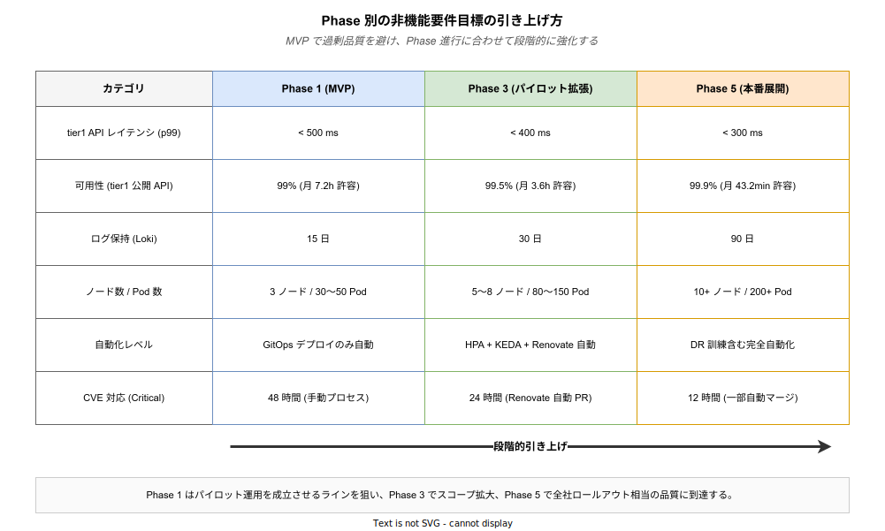

# 06. 非機能要件 (NFR-xxx)

本章では、k1s0 が満たすべき **機能以外の品質要件** を Non-Functional Requirement (NFR) として定義する。性能・可用性・拡張性・運用性・セキュリティなどを数値で明示する。

非機能要件は「機能があること」ではなく「機能が十分な品質で動くこと」を保証する層である。機能要件 (FR) がチェックリスト的に扱えるのに対し、NFR は数値で表現し、かつ Phase ごとに段階的に引き上げるのが本書の方針になる。「MVP で 99.9% 可用性を要求しない」「Phase 5 で本番展開する時点で 99.9% に到達する」というふうに、到達点だけでなく到達までの軌道を設計しておくことで、早すぎる最適化と過剰品質を防ぐ。



図は 6 つの代表指標が Phase 進行に合わせてどう引き上がっていくかを 1 枚に束ねたものである。注目してほしいのは、**MVP (Phase 1) の目標が意図的に低く設定されている** 点。単独開発かつ 2 週間という制約下では、過剰品質を目指すと着地できない。ここでの戦略は「パイロット運用を成立させるラインで止め、その後 Phase 3・Phase 5 で実運用規模に合わせて段階的に引き上げる」ことに尽きる。各節の詳細数値はこの軌道の具体化である。

---

## 1. 非機能要件の読み方

### 1.1 フォーマット

```
### NFR-xxx: (要件名)

| 項目 | 内容 |
|---|---|
| 優先度 | MUST / SHOULD / COULD |
| 関連 BR / FR | BR-xxx / FR-xxx |
| Phase 1 目標 | (数値) |
| Phase 5 目標 | (数値) |
| 測定方法 | どのように検証するか |

(本文)
```

### 1.2 ID 体系

| ID 範囲 | カテゴリ |
|---|---|
| NFR-001 ～ NFR-019 | 性能 (Performance) |
| NFR-020 ～ NFR-029 | スケーラビリティ |
| NFR-030 ～ NFR-039 | 可用性 |
| NFR-040 ～ NFR-049 | 運用性 |
| NFR-050 ～ NFR-059 | ユーザビリティ / UX |
| NFR-060 ～ NFR-069 | セキュリティ |
| NFR-070 ～ NFR-074 | バックアップ / 災害復旧 |
| NFR-075 ～ NFR-079 | 保守性 / 可搬性 |
| NFR-080 ～ NFR-089 | コンプライアンス / 法令 |

### 1.3 段階的な目標設定

k1s0 は Phase ごとに要件を段階的に引き上げる。過剰な初期目標は避ける。

| Phase | 対象 |
|---|---|
| Phase 1 (MVP) | 最低限の数値。実証可能なレベル。本章で「Phase 1」と表記する場合は Phase 1a (MVP-0) + Phase 1b (MVP-1) の両方を含む。Phase 1a / 1b で目標が異なる場合はその旨を個別に明記する |
| Phase 3 | パイロット拡張時の引き上げ |
| Phase 5 | 全社ロールアウト時の本番品質 |

---

## 2. 性能 (NFR-001 ～ NFR-019)

性能要件は「ユーザが遅さを感じない範囲」を p50 / p99 の 2 本で定めるのが基本方針。p50 は通常操作の快適さに直結し、p99 はワースト経験の発生頻度を抑える。tier1 API は tier2 / tier3 の処理に乗る共通経路であるため、ここでの遅延は全サービスに累積する性質を持ち、これが多くの指標を 50〜100ms 以内という厳しい水準に置く理由である。

### NFR-001: tier1 公開 API のレイテンシ

**優先度 MUST / 関連 FR-010〜FR-070 / Phase 1 目標 p99 500 ms / Phase 5 目標 p99 300 ms**

tier1 API はすべての業務処理の共通経路であり、ここで遅いと全 tier2 / tier3 の体感速度が悪化する。p99 500 ms という Phase 1 目標の由来は、Google SRE の RAIL モデル (ユーザ体感の閾値として応答 100 ms / 操作反応 1 s を推奨) と、社内業務アプリで広く使われている「ボタン押下後 1 秒以内にフィードバック」という経験則を重ね合わせたものである。業務アプリは 1 画面で tier1 API を 2〜3 回連鎖的に呼ぶため、tier1 単体で 500 ms を許すと合計 1〜1.5 秒まで膨らむ。Phase 5 で 300 ms に引き締めるのは、全社展開時の同時リクエスト増による GC / キュー滞留の悪化を見越した余裕である。

API ごとの個別目標は、「単純な検証 / キャッシュ命中」(Log / Telemetry / Auth) は 50 ms、「ネットワーク越しの DB / キャッシュ I/O」(State / Audit / Secrets) は 100 ms、「メッセージング / 遠距離 Invoke」(PubSub / Service.Invoke) は 200 ms、「評価エンジン」(Decision) は 100 ms、「Workflow 開始」は 500 ms という階層で設定する。測定は Prometheus ヒストグラム + 合成監視 (常時仮想ユーザで NFR を継続検証) の二系統とする。

なお、上記の p99 500 ms (Phase 1) / 300 ms (Phase 5) は **全 API の統合的な上限** であり、この範囲内で API 特性に応じた個別目標を設定する。以下の API 別目標が各 API の実測基準であり、NFR-001 の 500 ms はこれら個別目標の上界 (最も遅い `k1s0.Workflow.Start` の p99 500 ms に一致) として機能する。

**1 トランザクションあたりの API 呼び出し回数ガイドライン**: 業務アプリが 1 画面遷移で tier1 API を連鎖呼び出しする場合、各 API の p99 レイテンシが累積する。例えば Auth (50 ms) + Log (50 ms) + State (100 ms) + PubSub (200 ms) = 合計 400 ms に加え、Istio mTLS 追加遅延 (3 ms × 呼び出し回数) も加算される。**1 トランザクションあたりの tier1 API 呼び出しは 5 回以下を推奨** し、これを超える設計はアーキテクチャレビューで事前承認を得ること。この推奨は FR-100 (雛形生成 CLI) のサンプルコードに反映し、FR-110 (TechDocs) のベストプラクティスとして明文化する。

API ごとの詳細目標 (p50 / p99 と根拠):

| API | p50 | p99 | この数値の根拠 |
|---|---|---|---|
| `k1s0.Log.*` | < 5 ms | < 50 ms | 非同期送信 (ブロッキングなし) のため実質は関数呼び出しコスト + in-memory enqueue |
| `k1s0.Telemetry.*` | < 5 ms | < 50 ms | 同上。Prometheus Client ライブラリの atomic counter 操作相当 |
| `k1s0.State.Get/Save` | < 10 ms | < 100 ms | Valkey の pipelined GET/SET は LAN 内で 1 ms 台。HA レプリケーションと GC マージンで 100 ms |
| `k1s0.PubSub.Publish` | < 20 ms | < 200 ms | Kafka acks=all で全レプリカ ACK 待ち (通常 10〜20 ms)。リーダー切替時の上振れを 200 ms で許容 |
| `k1s0.Secrets.Get` | < 10 ms | < 100 ms | OpenBao のインメモリキャッシュ命中時は 1 ms。キャッシュミス + KV 読取で 100 ms |
| `k1s0.Service.Invoke` | < 50 ms + 宛先 | < 200 ms + 宛先 | Istio mTLS 追加遅延 (NFR-002) + サービスディスカバリ |
| `k1s0.Decision.Evaluate` | < 20 ms | < 100 ms | ZEN Engine (Rust、プリロード済) で 3〜5 条件分岐が 1〜10 ms、複雑ツリーで 100 ms |
| `k1s0.Workflow.Start` | < 100 ms | < 500 ms | Temporal / Dapr Workflow の永続化書き込みを伴うため他 API より緩い |
| `k1s0.Auth.ValidateToken` | < 10 ms | < 50 ms | JWT 署名検証 (RSA256) は 1 ms 未満、JWKS キャッシュ命中で 50 ms は余裕 |
| `k1s0.Audit.Record` | < 10 ms | < 100 ms | 同期書き込みだがハッシュ計算 + PostgreSQL INSERT は 10 ms 台。競合で 100 ms |

---

### NFR-002: infra コンポーネント性能

**優先度 MUST / 測定方法: 各コンポーネント個別のメトリクス**

NFR-001 が tier1 API 層で吸収する遅延の「許容量」を規定するのに対し、NFR-002 はその原材料となるインフラ層の性能底辺を保証する。Envoy / Istio / Kafka / PostgreSQL / Valkey のいずれかで想定外の遅延が出ると、上位 API が NFR-001 を守れなくなる連鎖が起きるため、各層単独で常時監視する。

| コンポーネント | 指標 | 目標値 (p99) | 数値の根拠 |
|---|---|---|---|
| Envoy Gateway | ルーティング遅延 | < 5 ms | CNCF ベンチマーク公表値で L7 ルーティングは数百 μs〜数 ms。5 ms は余裕込み |
| Istio sidecar | mTLS 追加遅延 | < 3 ms | Istio 公式ベンチで mTLS hop は 1 ms 台。GC 考慮で 3 ms |
| Kafka | プロデュース ACK (acks=all) | < 50 ms | 3 ブローカーレプリケーションの round trip + fsync で 10〜30 ms |
| PostgreSQL | 単純クエリ (PK) | < 5 ms | インデックス付き PK SELECT はバッファキャッシュ命中で 1 ms 未満 |
| Valkey | GET / SET | < 1 ms | Redis 互換で LAN 内 GET/SET は 100〜500 μs |

---

### NFR-003: CI/CD パイプライン性能

**優先度 MUST / 関連 FR-140 / Phase 1 目標: 以下表**

CI/CD の遅さは開発者の集中を破壊する。PR ビルド 30 分を越えると開発者は結果待ちで他タスクに流れ、戻ってきたときにはコンテキストが失われている。10 分以内であれば集中を保ったまま結果が返る、というのが 2010 年代の DevOps 文献 (Accelerate / State of DevOps Report) で繰り返し示されてきた経験則である。

| 指標 | 目標 | 数値の根拠 |
|---|---|---|
| PR ビルド + テスト | < 10 分 | 開発者の集中維持限界。これを超えると生産性が非線形に悪化 (DORA 研究) |
| main マージ → Harbor push | < 15 分 | PR ビルドに加えてセキュリティスキャン (Trivy) + 本番イメージタグ付け込み |
| Argo CD 同期 | < 5 分 | Git ポーリング間隔 3 分 + ヘルスチェック完了までの余裕 2 分 |
| 雛形生成 CLI 実行 | < 5 秒 | 体感的に「待たされていない」閾値。FR-100 の「正しいやり方を使う方が楽」を成立させる前提 |

---

### NFR-004: 同時リクエスト処理能力

**優先度 MUST / Phase 1 目標 50 req/s / Phase 5 目標 500 req/s**

Phase 1 の 50 req/s は「パイロット部署 10 名が業務時間中に断続的に操作する」実利用量を満たす水準。内訳としては 10 名 × 1 リクエスト/秒 (業務アプリの画面遷移は通常これ以下)、加えてバックグラウンド処理 / 監視系 10 req/s のマージン。Phase 5 の 500 req/s は全社 1,000 名規模を想定し、ピーク時の同時操作率 20% × 2 リクエスト/秒で算出している。

測定は常時稼働の合成負荷 + 日次の負荷試験 (k6 による) で検証する。測定条件を以下に定義する。条件を固定しなければ Phase 間の数値比較が無意味になるため、全 Phase を通じて同一条件で計測すること。

- **API ミックス比**: `k1s0.Invoke` 50%、`k1s0.State` (Read) 20%、`k1s0.State` (Write) 10%、`k1s0.PubSub` 10%、`k1s0.Auth` 5%、`k1s0.Audit` 5%。実運用の業務操作比率を模した比率であり、単一 API のみの測定は認めない。
- **ペイロードサイズ**: JSON 平均 2 KB (最大 64 KB)。`k1s0.State` Write は 10 KB 固定。業務アプリの画面 CRUD 操作における典型的なサイズ帯を基準としている。
- **同時接続数**: Phase 1 は 50 接続 (10 ユーザ × 5 並列)、Phase 5 は 2,000 接続 (1,000 ユーザ × 2 並列)。HTTP/2 multiplexing を前提とし、TCP 接続数ではなくストリーム数で計測する。
- **測定除外**: k6 の起動直後 30 秒はウォームアップ期間として集計から除外する。Istio サイドカーのコネクションプール確立と JIT 的最適化を安定させるため。

---

## 3. スケーラビリティ (NFR-020 ～ NFR-029)

スケーラビリティは「負荷増加時に何をどの手段で増強するか」と「どこまで増強できるか」の 2 軸で決める。Phase 1 時点で Phase 5 並のオーバーエンジニアリングをすると VM 1 台のデモが成立しなくなるため、自動スケールの範囲は段階的に広げる。

### NFR-020: 水平スケーリング対応

**優先度 MUST / Phase 1 目標: tier1 Go HPA 2〜10 Pod / Phase 2 目標: tier2/3 の KEDA 駆動スケール**

tier1 の Go ファサードは CPU / RPS ベースの HPA (Horizontal Pod Autoscaler) で 2〜10 Pod の範囲でスケールする。tier2 / tier3 は Phase 2 で KEDA を導入し、Kafka Consumer Lag や HTTP RPS を指標にスケールする (HPA は CPU/Memory しか見られないが、KEDA は任意メトリクス駆動が可能)。tier1 の Rust 部分 (ZEN Engine など計算集約) は CPU バウンドなので HPA で十分。

重要な設計判断として、tier1 は常時稼働が前提のため KEDA の Scale-to-Zero は対象外とする。tier1 が 0 に落ちると最初のリクエストのコールドスタートが数秒になり、NFR-001 の p99 500 ms を守れない。

| コンポーネント | 方式 | 上限 | 根拠 |
|---|---|---|---|
| tier1 Go | HPA (CPU / RPS) | 10 Pod | Phase 5 の 500 req/s を 1 Pod 50 req/s で捌く計算 |
| tier1 Rust | HPA (CPU) | 5 Pod | ZEN Engine は評価が高速 (< 10 ms) で並列需要が tier1 Go より低い |
| tier2 Consumer | KEDA (Kafka Lag) | サービス別 | Lag ≥ 1,000 で Pod 追加、0 で縮退 |
| tier2 API | KEDA (HTTP RPS) | サービス別 | 業務アプリの同時接続特性で調整 |
| Kafka ブローカー | 手動追加 | 10 ブローカー | Strimzi で運用検証済の上限。これを超えるとパーティション再配置が長時間化 |
| PostgreSQL リードレプリカ | 手動追加 | 3 レプリカ | CloudNativePG 推奨構成。これ以上はレプリケーションラグが問題化 |

---

### NFR-021: 利用者規模

**優先度 MUST / Phase ごとに段階的に引き上げ**

利用者規模の数値は Phase の意味そのものを定義する。Phase 1 (MVP) は 5〜10 名開発者で回せる単位、Phase 2 は開発チーム 1 課を賄う単位、Phase 3 はパイロット部署 1 つ、Phase 5 は全社という位置付けで、インフラサイジング・冗長度・運用体制が Phase ごとに別物になる。

| Phase | 開発者 | エンドユーザー | ノード数 | Pod 数目安 | 規模の意味 |
|---|---|---|---|---|---|
| Phase 1 (MVP) | 5〜10 名 | 数十名 | 3 (VM×3) | 30〜50 | 単独〜小チームで持続可能な最小構成 |
| Phase 2 | 10 名 | 〜100 名 | 3〜5 | 50〜80 | 開発チーム 1 課が日常的に使う規模 |
| Phase 3 | 10〜20 名 | 100〜500 名 | 5〜8 | 80〜150 | パイロット部署 1 つを賄う規模 |
| Phase 5 | 30〜50 名 | 数百〜千名 | 10+ | 200+ | 全社展開規模。HA 多重化 + DR 対応必須 |

---

## 4. 可用性 (NFR-030 ～ NFR-039)

可用性は、単一の数値目標ではなく「どの手段でどの層の可用性を守るか」の組み合わせで考える。k8s ReplicaSet は Pod 障害を、CloudNativePG の HA はデータ層障害を、Istio のリトライ / サーキットブレーカーは一時的ネットワーク障害を、それぞれ別レイヤで吸収する。NFR-033 のグレースフルデグラデーションは「依存 OSS が落ちても tier1 公開 API が部分機能で応答し続ける」ことを目指し、JWKS キャッシュや Audit バッファといった具体策で実現する。

### NFR-030: 可用性目標

**優先度 MUST / 測定方法: SLO メトリクス 30 日ローリング、Grafana で常時公開**

可用性目標はサービスごとに分ける。tier1 公開 API と infra は業務アプリが依存する「土台」なので最も高く、配信ポータルや Backstage は「便利に使えるツール」なので業務時間帯優先で少し緩める。

**Phase 1a と Phase 1b の可用性目標は明示的に分離する**。Phase 1a (MVP-0) は CON-030 により VM 1 台の単一障害点構成であり、HA を構成できないため、可用性目標を Phase 1b (HA 構成後) とは別に設定する。Phase 1a の目標は「デモ実施時間帯に動作していること」であり、SLA としての可用性は計測しない。Phase 1b で HA 構成 (VM × 3) が整った時点から SLO メトリクスの計測を開始し、99% (月 7.2 時間のダウン許容) を目標とする。Phase 5 の 99.9% (月 43 分) に至るには HA 多重化 + DR 対応 + 自動フェイルオーバ + オンコール体制 の 4 点セットが必要で、Phase 1 時点ではそこまで整備する予算も人員もない。

| 対象 | Phase 1a (MVP-0) | Phase 1b (MVP-1) | Phase 3 | Phase 5 | 判定の根拠 |
|---|---|---|---|---|---|
| tier1 公開 API | SLA 対象外 (VM 1 台) | 99% (月 7.2 h) | 99.5% (月 3.6 h) | 99.9% (月 43 分) | Phase 1a は単一障害点のため SLA 設定不可。Phase 1b の HA 構成後から計測開始 |
| infra (k8s / Istio / Kafka) | SLA 対象外 | 99% | 99.5% | 99.9% | tier1 と同水準。kubeadm HA 構成で到達可能 |
| 配信ポータル | SLA 対象外 | 95% (業務時間帯) | 99% | 99.5% | 業務時間外の停止は業務影響が小さい (BR-030 は業務中の体験が中心) |
| Backstage | SLA 対象外 | 95% | 99% | 99.5% | 開発者向け。夜間停止で業務影響ゼロ |
| CI/CD | SLA 対象外 | 95% | 99% | 99% | 業務時間外の停止は許容。マージ遅延 1 時間は週末対応で十分 |

---

### NFR-031: 可用性実現手段

**優先度 MUST / 測定方法: 手段ごとのメトリクスで動作確認**

可用性は単一の手段では守れない。Pod 障害・DB 障害・ネットワーク障害・ローリング更新、それぞれ異なる障害モードに対して別の手段で対処する多層防御が基本。

| 手段 | 対象 | 期待効果 | 採用根拠 |
|---|---|---|---|
| k8s ReplicaSet | 全ステートレスサービス | Pod 障害時の自動再起動 | k8s 標準機能。追加コストなし |
| CloudNativePG HA | PostgreSQL | プライマリ障害時のレプリカ自動昇格 (数秒〜十数秒) | CNCF Sandbox。etcd 代替として PostgreSQL 自体の HA が必要な前提 |
| Kafka レプリケーション | メッセージング | ブローカー障害時のデータ保護 (acks=all + replication.factor=3) | 1 ブローカー障害でメッセージ消失ゼロ |
| Istio リトライ / サーキットブレーカー | サービス間通信 | 一時障害の自動回復 + カスケード障害防止 | Envoy の標準機能。業務コードを変更せず有効化可能 |
| PodDisruptionBudget | 重要サービス | ローリングアップデート時の最低稼働保証 (例: 最小 2 Pod) | kubectl drain 時に Pod が全落ちするリスクを排除 |

---

### NFR-032: 計画メンテナンスの扱い

**優先度 MUST / 方針: メンテ込みで SLA 算定**

| 項目 | 方針 | 根拠 |
|---|---|---|
| メンテナンスウィンドウ | 月 1 回、平日夜間 22:00〜翌 6:00 | 業務時間外。夜間の自動処理 (バッチ等) と調整可能な時間帯 |
| 無停止更新 | ステートレスはローリング。停止なし | k8s Deployment の標準機能で可能 |
| 停止更新 | k8s / Istio / Kafka のメジャーバージョンアップはメンテ枠で実施 | メジャーは破壊的変更の可能性があり、無停止検証が困難 |
| 可用性計算 | 計画メンテも SLA に含める | ユーザから見えるダウンタイムはすべてダウン。業界標準 (AWS / Azure SLA) 準拠 |

---

### NFR-033: グレースフルデグラデーション

**優先度: Phase 1b は MUST (最小限) / Phase 2 以降は SHOULD (段階的拡充)**

依存 OSS が完全停止した際にも、tier1 公開 API が部分機能で応答し続ける設計を段階的に導入する。tier1 は全業務アプリの共通経路であり (RISK-022)、ここが完全停止すると全サービスが道連れになる。Phase 1b のパイロット運用中にこの事態が発生すると信頼を失墜させるため、最低限のデグラデーションは Phase 1b で MUST とする。

**Phase 1b (MUST)**: 以下の 2 点のみ実装する。
- Keycloak 障害時: JWKS キャッシュ (メモリ内、TTL 10 分) で既発行トークンの検証を継続
- ログ/テレメトリ送信先 (Loki/Prometheus) 障害時: in-memory バッファに一時退避し、復旧後にリプレイ (FR-020 の受け入れ基準に含む)

**Phase 2 以降 (SHOULD)**: 以下を段階的に追加する。
- Audit バックエンド障害時: ディスク先行書き込みに退避してから復旧後にリプレイ
- State (Valkey) 障害時: PostgreSQL へのフォールバック読み取り
- PubSub (Kafka) 障害時: メッセージのローカルキュー退避と再送

参照: [`../01_企画/02_アーキテクチャ/08_グレースフルデグラデーション.md`](../01_企画/02_アーキテクチャ/08_グレースフルデグラデーション.md)

---

## 5. 運用性 (NFR-040 ～ NFR-049)

運用性の要件は「障害が起きたときにどれだけ早く復旧できるか」「日常運用に人手がどれだけ必要か」の 2 軸で決まる。保持期間は復旧時の調査素材の豊富さを左右し、自動化の範囲は日常運用の負荷を決める。

### NFR-040: ログ / メトリクス / トレース保持期間

**優先度 MUST / Phase 1 と Phase 5 で段階的に引き上げ**

保持期間はストレージコストと調査可能性のトレードオフ。短すぎると「先週の似た障害」との照合ができず、長すぎるとストレージ費が膨らむ。監査ログだけは法令要件 (J-SOX / 個人情報保護法) のため交渉不能の 365 日固定。

| データ | Phase 1 | Phase 5 | 数値の根拠 |
|---|---|---|---|
| メトリクス (Prometheus) | 15 日 | 90 日 (Mimir 長期) | 2 週間で週次パターンの傾向分析が可能。Phase 5 は月次比較のため 90 日 |
| ログ (Loki) | 15 日 | 90 日 | 同上。障害調査の大半は直近 2 週間で完結 |
| 分散トレース (Tempo) | 7 日 | 30 日 | トレースは容量単価が最大。短期検索用途が主 |
| 監査ログ | 365 日 | 365 日 (法令で延長可) | J-SOX 内部統制評価の標準要求。個人情報関係は 5 年等に延長する場合あり |

---

### NFR-041: 運用自動化

**優先度 MUST / Phase 1 から段階的に自動化範囲を拡大**

| タスク | Phase 1 | Phase 3 以降 | 判定の根拠 |
|---|---|---|---|
| デプロイ | GitOps 自動 (FR-140) | 同左 | 初日から自動化しなければ属人化が始まる。Argo CD で Phase 1 必達 |
| スケーリング | 手動 | HPA + KEDA 自動 | Phase 1 は負荷が一定で手動で十分。Phase 3 以降は変動対応に自動化必須 |
| 証明書更新 | Istio CA 自動 | + cert-manager | mTLS 証明書は Istio CA が自動ローテート。外部公開証明書は Phase 3 で cert-manager 導入 |
| バックアップ | CronJob 自動 | 同左 | CloudNativePG WAL + etcd スナップショットで Phase 1 から自動 |
| OSS アップデート | 手動 | Renovate 自動 PR (FR-141) | Phase 1 は月次で手動確認で足りる。依存数が増える Phase 3 で自動化必須 |
| アラート対応 | 手動 (Runbook) | 一部自動修復 | Phase 1 は Runbook で対応手順を明文化するのが最優先。自動修復は Phase 3 以降 |

---

### NFR-042: ドキュメント要件

**優先度 MUST / 測定方法: CI で必須ドキュメント存在チェック**

| 種別 | 形式 | 更新タイミング | 欠落時の影響 |
|---|---|---|---|
| Runbook | TechDocs | アラート新設時 (必須) | 深夜オンコール対応が不可能になる。BR-021 の崩壊 |
| Postmortem | TechDocs | インシデント解決から 5 営業日以内 | 再発防止の学習サイクルが回らない |
| 構成変更履歴 | Git + ADR | 変更の都度 | 「なぜこの構成になっているか」が失われ、5 年後のメンテナが迷う |

---

### NFR-043: 監視カバレッジ

**優先度 MUST / Phase ごとに段階的カバー**

| 項目 | 目標 | 根拠 |
|---|---|---|
| Phase 1 Critical アラート | 100% カバー。Critical アラートの定義: (1) tier1 公開 API の全エンドポイントが 5xx を返す状態、(2) PostgreSQL プライマリへの接続不可、(3) Kafka 全ブローカーの応答停止、(4) k8s ノード NotReady 状態の継続 (5 分以上)。以上 4 種を Phase 1 の Critical として扱う | 上記 4 種はいずれも発生時に全業務が停止するため最低ライン |
| Phase 3 全アラート Runbook | 100% 整備 | Phase 1 は Critical のみでよいが、Phase 3 以降はオンコール担当が拡大するため全 Runbook が必要 |

---

## 6. ユーザビリティ / UX (NFR-050 ～ NFR-059)

UX 要件は「エンドユーザーが触れる体験」と「開発者が触れる体験」の両面で設定する。エンドユーザーが 3 クリック以内で業務アプリに到達できなければ BR-030 が崩れ、開発者が 1 時間以内に新規サービスを動かせなければ BR-011 が崩れる。

### NFR-050: エンドユーザーの操作効率

**優先度 MUST / 測定方法: 合成ユーザー試験 + パイロット部署実測**

| 項目 | 目標 | 根拠 |
|---|---|---|
| 業務アプリの起動までのクリック数 | 3 クリック以内 | BR-030 の具現化。従来の申請フロー (数日) を 1 分未満に短縮する |
| 配信ポータル初回ロード時間 | 2 秒以内 (社内 LAN 1 Gbps) | Google PageSpeed の「Good」閾値。これを超えるとユーザが離脱 |
| アプリ検索レスポンス | 500 ms 以内 | 体感的に「即座に結果が返る」閾値 |

---

### NFR-051: 開発者の初回セットアップ時間

**優先度 MUST / 測定方法: オンボーディング時に実測**

| 項目 | 目標 | 根拠 |
|---|---|---|
| 雛形生成 → ローカル起動 | 30 分以内 | 新規開発者が「初日で動くものを見た」と体感できる閾値。これを超えると学習意欲が落ちる |
| 雛形生成 → 開発クラスタデプロイ | 1 時間以内 | 初日で E2E (コード → 本番相当環境) を体験できる必須条件。BR-011 の具現化 |

---

## 7. セキュリティ (NFR-060 ～ NFR-069)

セキュリティ要件は「通信・認証情報・サプライチェーン」の 3 経路それぞれでゼロトラストの方針に沿って強化する。通信は Istio mTLS で全サービス間を暗号化し、認証情報は OpenBao に集中保管して 90 日ローテートをかけ、サプライチェーンは Trivy / Cosign / Kyverno で段階的に厳格化する。NFR-061 の CVE 対応時間は経営リスクと法令遵守の両方を背負うため、他の NFR が「目標」として緩和的に扱えるのに対し、Critical 48 時間という期限は交渉不能のラインとして扱う。

### NFR-060: 通信暗号化

**優先度 MUST**

| 項目 | 内容 | 根拠 |
|---|---|---|
| サービス間通信 | Istio mTLS (TLS 1.3) | Istio サイドカーで自動適用、業務コード変更ゼロ。TLS 1.3 は BEAST/POODLE 等の既知脆弱性が残る 1.0/1.1 を排除 |
| 外部公開通信 | TLS 1.2 以上 | 互換性考慮で 1.2 を最低線に。1.1 以下は総務省「安全な Web サイトの作り方」で禁止相当 |
| 証明書有効期限 | Istio CA: 24 時間 (自動ローテート)、外部公開: 90 日 | 短期ローテで鍵流出時の被害窓を最小化。90 日は Let's Encrypt 準拠 |

**暗号スイート仕様**

暗号スイートを明示的に指定しない場合、デフォルト設定に脆弱なスイートが含まれるリスクがある。特に TLS 1.2 では CBC モードや RSA 鍵交換が有効な場合があり、これらは Lucky13 攻撃や前方秘匿性の欠如につながる。以下のスイートを明示的に許可リストとして設定し、それ以外は拒否する。

- **TLS 1.3 (サービス間通信)**: `TLS_AES_256_GCM_SHA384`、`TLS_AES_128_GCM_SHA256`、`TLS_CHACHA20_POLY1305_SHA256`。TLS 1.3 ではこの 3 スイートが RFC 8446 で定義されており、全て AEAD かつ前方秘匿性を持つ。最低ラインは `TLS_AES_128_GCM_SHA256` とする。
- **TLS 1.2 (外部公開エンドポイント)**: `TLS_ECDHE_RSA_WITH_AES_256_GCM_SHA384`、`TLS_ECDHE_RSA_WITH_AES_128_GCM_SHA256`、`TLS_ECDHE_ECDSA_WITH_AES_256_GCM_SHA384`、`TLS_ECDHE_ECDSA_WITH_AES_128_GCM_SHA256`。ECDHE による前方秘匿性と GCM による AEAD を必須とし、CBC モード・RSA 鍵交換は禁止する。
- **設定箇所**: Istio の `DestinationRule` / `PeerAuthentication` と Envoy Gateway の `SecurityPolicy` で設定する。設定値は CI (OPA / Kyverno) でドリフトを検知する。

---

### NFR-061: CVE 対応時間

**優先度 MUST / 測定方法: 自社検知日 → パッチ適用日を記録**

CVE 対応時間は他の NFR と違い「努力目標」ではなく「交渉不能のライン」として扱う。Log4Shell (2021 年) では業界平均 72 時間で初動対応が行われたが、JTC 情シスでは 1〜2 週間以上かかる事例が多発した。k1s0 では FR-141 (Renovate) + FR-142 (Trivy) + GitOps の 3 点を組み合わせて Critical 48 時間以内を技術的に達成可能な体制を構築する。

**起算点の定義**: 48 時間の起算点は **「自社環境での検知日時」** とする。具体的には、Trivy スキャンが該当 CVE を検出した日時、または Renovate が修正版リリースを検知して PR を自動作成した日時のいずれか早い方を起算点とする。NVD / JVN での CVE 公開日を起算点としない理由は、上流 OSS の修正版リリースまでの時間は自社で制御不能であり、修正版が存在しない段階で 48 時間カウントを始めても対応不可能なためである。ただし、修正版未リリースの Critical CVE が公開された場合は、ワークアラウンド (NetworkPolicy 遮断 / エンドポイント停止) を 24 時間以内に適用する別ルールで対処する。

| 深刻度 | 対応期限 | 根拠 |
|---|---|---|
| Critical | 48 時間以内にパッチ適用またはワークアラウンド | 業界標準 72 時間を短縮。BR-022 の具現化 |
| High | 7 日以内 | 米国国防総省 DISA STIG の相場感。週次パッチサイクルに合わせる |
| Medium | 30 日以内 | 月次メンテナンス枠での対応 |
| Low | 次回定期更新 | 四半期ごとの定期更新に合流 |

---

### NFR-062: 監査ログ保持

**優先度 MUST**

| 項目 | 内容 | 根拠 |
|---|---|---|
| 保持期間 | 365 日 (法令要求あれば延長) | J-SOX 内部統制評価の標準要求。個人情報保護委員会ガイドラインもほぼ同水準 |
| 改ざん防止 | ハッシュチェーン | 第三者 (監査法人) が改ざん検知可能。FR-030 の具現化 |
| 整合性検証 | 日次自動実行 (CronJob)。検証失敗時は Critical アラートを発報 | ハッシュチェーン構造が存在するだけでは不十分。「検知の仕組みが実際に動いていること」を J-SOX 監査で問われる。手動検証は頻度保証ができないため自動化必須 |
| 読取アクセス | 監査ロールのみ (RBAC で制限) | 職務分掌。一般開発者が監査ログを見られると J-SOX 要件を満たさない |

---

### NFR-063: シークレット管理

**優先度 MUST / バックエンド: OpenBao**

| 項目 | 内容 | 根拠 |
|---|---|---|
| 保管 | OpenBao (KV / Transit / PKI) | HashiCorp Vault の OSS フォーク (LF 管理)。BR-002 のベンダーロックイン回避 |
| ローテーション | 90 日ごと (Phase 3 以降自動) | NIST SP 800-63B の「パスワード定期変更不要」論はあるが、API キー・DB 認証は 90 日が業界標準 |
| アクセストークン有効期限 | 5 分 | 漏洩時の被害窓を 5 分に限定。BR-032 の 24 時間剥奪目標を技術的に分単位で実現 |
| リフレッシュトークン有効期限 | 8 時間 | 業務 1 日分。毎朝の再ログインなしに 1 日業務できる |

---

### NFR-064: ネットワーク分離

**優先度 MUST / 方針: デフォルト拒否 (Zero Trust)**

| 項目 | 内容 | 根拠 |
|---|---|---|
| NetworkPolicy 適用範囲 | 全 Namespace | 未適用 Namespace が 1 つでもあると全体防御が崩れる |
| tier 間通信 | 必要最小限のみ許可。デフォルト拒否 | ラテラルムーブメント (内部侵入後の横移動) を最小化。Zero Trust の基本原則 |
| 外部公開 | Envoy Gateway 経由のみ | 侵入面を 1 点に集中させ、WAF / レート制限を一元適用 |

---

### NFR-065: レート制限・入力検証

**優先度 MUST / Phase 1b**

tier1 公開 API および Envoy Gateway の外部公開エンドポイントに対して、レート制限と入力検証を設定する。DoS (サービス拒否攻撃) やアプリケーション層の過負荷・不正入力から tier1 を保護し、単一のクライアントが全帯域を占有することや、不正なペイロードが内部 OSS に到達することを防ぐ。

tier1 は全業務アプリの共通経路であるため、ここでの入力検証不備は全サービスに波及する。tier2 / tier3 が `k1s0.*` クライアントライブラリ経由で呼ぶ場合でも、ライブラリのバグや不正利用を想定し、tier1 側で必ず検証する (ゼロトラスト原則)。

**レート制限**

| 対象 | 制限値 | 根拠 |
|---|---|---|
| Envoy Gateway 外部エンドポイント | 100 req/s per IP (Phase 1)、500 req/s per IP (Phase 5) | NFR-004 の同時リクエスト目標と整合。単一 IP からの過負荷を防止 |
| tier1 公開 API (認証済みユーザ) | 50 req/s per user (Phase 1)、200 req/s per user (Phase 5) | 業務操作の想定上限 (1 画面遷移で tier1 API 2〜3 回) から算出 |
| 認証エンドポイント (`k1s0.Auth`) | 10 req/s per IP | ブルートフォース防止。正常操作では 5 分に 1 回のリフレッシュのみ |

**入力検証**

| 対象 | 制限・検証内容 | 根拠 |
|---|---|---|
| `k1s0.State` value サイズ | 1 MB 以下 (Phase 1)。超過は 413 Payload Too Large を返却 | Valkey の推奨最大値 (512 MB) に対して業務用途の上限を設定。大量データは MinIO / PostgreSQL へ誘導 |
| `k1s0.PubSub` ペイロードサイズ | 1 MB 以下。超過は 413 を返却 | Kafka のデフォルト `message.max.bytes` (1 MB) と整合 |
| `k1s0.Audit` コンテキストサイズ | 64 KB 以下 | 監査ログの 1 レコードあたりの PostgreSQL カラムサイズ制約から |
| JSON 構造の検証 | 全 API で JSON スキーマバリデーションを適用。不正構造は 400 Bad Request を返却 | JSON インジェクション・予期しないフィールドの混入を防止 |
| 文字列フィールドのサニタイズ | SQL / NoSQL インジェクション文字列の検知・拒否 | tier1 が PostgreSQL / Valkey に書き込む前の最終防衛線 |
| namespace / key の命名規則 | `^[a-zA-Z0-9_.-]{1,256}$` に限定。違反は 400 を返却 | パストラバーサル・キーインジェクションの防止 |

**Slowloris / HTTP Slow 攻撃対策**

Slowloris 攻撃は HTTP ヘッダを極めて低速に送信し続けることで接続を長時間占有し、正規クライアントの接続枠を枯渇させる手法である。レート制限 (req/s) では防御できない — リクエストが「完了しない」ため計数されないからである。Envoy Gateway および Istio サイドカーに以下のタイムアウトを設定し、低速接続を強制切断する。

- **ヘッダ受信タイムアウト**: 10 秒。10 秒以内に HTTP ヘッダが完了しない接続は 408 Request Timeout で切断する。
- **リクエストボディタイムアウト**: 30 秒。ボディの受信が 30 秒以内に完了しない場合は 408 で切断する。
- **アイドル接続タイムアウト**: 60 秒。60 秒間データ送受信がない接続を切断する。HTTP/2 の場合は PING フレームで生存確認する。
- **最大同時接続数**: Envoy Gateway の Listener レベルで 10,000 接続に制限する (Phase 1)。Phase 5 では 50,000 に拡大。

**CORS (Cross-Origin Resource Sharing) ポリシー**

tier1 API が tier2/tier3 の Web フロントエンドから呼ばれる場合、CORS ポリシーが未定義だとブラウザが Preflight リクエストをブロックし、正常に動作しない。一方で `Access-Control-Allow-Origin: *` のような過度に緩い設定は、悪意あるサイトからの API 呼び出し (CSRF の一種) を許してしまう。

- **許可オリジン**: ワイルドカード (`*`) は禁止。Phase 1 では `https://*.k1s0.internal` のみ許可する。tier2/tier3 が独自ドメインで公開する場合は、tier1 の ConfigMap に明示的にオリジンを追加登録する運用とする。
- **許可メソッド**: `GET`, `POST`, `PUT`, `DELETE`, `OPTIONS`。`PATCH` は Phase 1 では使用しないため除外。
- **許可ヘッダ**: `Authorization`, `Content-Type`, `X-Request-ID`。カスタムヘッダの追加は tier1 チームの承認を必要とする。
- **Preflight キャッシュ**: `Access-Control-Max-Age: 3600` (1 時間)。Preflight の頻度を削減しつつ、ポリシー変更が 1 時間以内に反映される妥協点。
- **設定箇所**: Envoy Gateway の `SecurityPolicy` で一元管理する。個別サービスでの CORS 設定は禁止し、ゲートウェイで統一する。

受け入れ基準:
- レート超過時に 429 Too Many Requests を返す / Grafana でレート制限の発動状況を可視化できる
- サイズ超過リクエストが 413 で拒否されることを E2E テストで確認
- JSON スキーマ違反リクエストが 400 で拒否され、エラーメッセージに違反箇所が含まれることを確認
- SQL インジェクションパターン (`' OR 1=1 --` 等) を含むリクエストが拒否されることを確認
- Slowloris 攻撃ツール (slowhttptest 等) で 1,000 本の低速接続を張った場合に、正規リクエストの p99 レイテンシが NFR-001 の基準を維持することを確認
- 許可オリジン以外からの Fetch リクエストがブラウザの CORS チェックでブロックされることを確認

---

### NFR-066: コンテナセキュリティ

**優先度 MUST / Phase 1a**

全 Pod はセキュリティコンテキストを設定し、コンテナエスケープのリスクを最小化する。

| 項目 | 内容 | 根拠 |
|---|---|---|
| 実行ユーザ | non-root (UID 1000 以上) | OWASP Container Security - root 実行はコンテナエスケープの主要経路 |
| 特権モード | 禁止 (privileged: false) | 特権コンテナは host namespace にアクセス可能で、侵入後の被害が致命的 |
| readOnlyRootFilesystem | true (書き込みは emptyDir / PVC に限定) | ファイルシステム改ざんを防止 |
| seccompProfile | RuntimeDefault | k8s 1.27 以降のデフォルト。不要なシステムコールを制限 |
| Capabilities | ALL drop + 必要最小限のみ追加 | NET_BIND_SERVICE 等、真に必要なものだけを明示的に追加 |

受け入れ基準: 上記設定が雛形 CLI (FR-100) のデフォルトに含まれる / CI で SecurityContext 未設定の Pod 定義をブロック

---

### NFR-067: Kubernetes API アクセス制御

**優先度 MUST / Phase 1a**

k8s API server へのアクセスは最小権限の原則で制御する。

| 項目 | 内容 | 根拠 |
|---|---|---|
| RBAC | 全 ServiceAccount に最小限の ClusterRole / Role をバインド | デフォルトの ServiceAccount に broad な権限を付与しない |
| API server 接続 | 社内ネットワークからのみアクセス可能 (--advertise-address は内部 IP) | 外部からの k8s API 直接攻撃を防止 |
| 監査ログ | k8s audit log を有効化し、Loki に集約 | 不正な kubectl 操作の追跡 (FR-030 と連動) |
| ServiceAccount トークン自動マウント | デフォルト無効 (automountServiceAccountToken: false) | Pod が不必要に k8s API を叩ける状態を排除 |
| Secrets の暗号化保存 | `EncryptionConfiguration` で etcd 内の Secret を AES-CBC または AES-GCM で暗号化 | デフォルトでは Secret は etcd に Base64 エンコードのみで平文保存される。etcd バックアップの漏洩時に全 Secret が読み取られるリスクを排除 |

**Secrets encryption at rest の補足**

Kubernetes の Secret リソースはデフォルトで etcd に Base64 エンコード (= 平文同等) で保存される。これは etcd のスナップショットを取得するだけで全 Secret (DB パスワード、API キー、TLS 証明書) が読み取れることを意味する。NFR-071 で etcd のバックアップを 24 時間ごとに取得するため、バックアップファイルの漏洩は Secret の全量流出に直結する。

`kube-apiserver` の `--encryption-provider-config` で `EncryptionConfiguration` を設定し、etcd 書き込み前に暗号化する。暗号化プロバイダには以下を使用する。

- **Phase 1**: `aescbc` プロバイダ (AES-256-CBC)。鍵は `/etc/kubernetes/encryption/` に配置し、ファイルパーミッションは `0600` (root のみ読み取り可) とする。鍵のローテーションは 90 日ごとに実施する (OpenBao の Secret ローテーション周期と揃える)。
- **Phase 3 以降**: `kms` プロバイダへの移行を検討する。外部 KMS (OpenBao) と連携し、暗号化鍵自体を etcd 外で管理することで、etcd + 鍵ファイルの同時漏洩リスクを排除する。

受け入れ基準: `kubectl get secret -o yaml` で `data` フィールドが正常に復号される一方、`etcdctl get /registry/secrets/...` で暗号化された値が返ることを確認する。

受け入れ基準: tier2 / tier3 の Pod から `kubectl get secrets` 等の管理操作が 403 で拒否されることを確認

---

### NFR-068: セキュリティインシデント対応プロセス

**優先度 MUST / Phase 1b**

CVE 対応 (NFR-061) とは別に、不正アクセスや情報漏洩等のセキュリティインシデント発生時の対応プロセスを要件として定義する。個人情報保護法 (2022 年改正) では、漏洩等が発生した場合に本人通知義務と個人情報保護委員会への報告義務 (速報: 発覚から概ね 3〜5 日以内、確報: 30 日以内) が課されている。

| フェーズ | 目標時間 | 内容 |
|---|---|---|
| 検知 | 即時 | 監査ログ (FR-030) / Grafana アラート / Trivy による異常検知 |
| 封じ込め | 1 時間以内 | 該当ユーザ無効化 (Keycloak) / 該当 Pod のネットワーク遮断 (NetworkPolicy) / 該当エンドポイントの一時停止 (Envoy) |
| 影響範囲特定 | 24 時間以内 | 監査ログから影響ユーザ・データ範囲を特定。本人通知義務の対象者を確定 |
| 報告 | 3〜5 日以内 | 個人情報保護委員会への速報 (法令要件)。経営層への第一報 |
| 根絶・復旧 | 72 時間以内 | 原因の除去、システムの復旧、再発防止策の初動 |
| Postmortem | 5 営業日以内 | FR-121 テンプレートに基づく事後分析。再発防止アクションの起票 |

受け入れ基準: インシデント対応手順が Runbook (FR-120) に整備されている / 年 1 回のインシデント対応訓練を Phase 3 以降に実施

---

### NFR-069: サプライチェーンセキュリティ

**優先度 MUST / Phase ごとに強化**

| Phase | 対策 | 導入根拠 |
|---|---|---|
| Phase 1 | Trivy スキャン (Critical / High 検知でデプロイブロック) | 既知 CVE の本番到達を一次防御。Log4Shell 型インシデントへの最低限の対応 |
| Phase 2 | Cosign 署名 + Kyverno で署名検証強制 | SolarWinds 型 (ビルドパイプライン改ざん) への対応。Phase 1 では運用習熟の観点で見送り |
| Phase 3 | SBOM (Software Bill of Materials) 生成・保管を義務化 | NIST SP 800-218 / EO 14028 準拠。グローバル取引先要求の本格化に備える |

---

## 8. バックアップ / 災害復旧 (NFR-070 ～ NFR-079)

バックアップと災害復旧は「どこまでデータを失ってよいか (RPO)」「どれだけ早く戻すか (RTO)」の 2 軸で設計する。PostgreSQL は業務データを直接抱えるため RPO 数秒・RTO 15 分という最も厳しい水準を置き、k8s 状態を抱える etcd は再構築可能性があるため RPO 24 時間・RTO 4 時間でよいとする。Phase 3 以降の DR 訓練を四半期ごとに組み込むのは、バックアップが取れていることとリストアできることは別物だという過去の教訓からである。

### NFR-070: RPO / RTO

**優先度 MUST**

| 対象 | RPO | RTO | 根拠 |
|---|---|---|---|
| PostgreSQL | 数秒 | 15 分 | 業務データを直接保持。数秒以上の損失は請求取消・再入力が発生 |
| Kafka (永続トピック) | 1 分 | 30 分 | At-Least-Once 配信 + replication.factor=3 で通常数秒。最悪で 1 分 |
| etcd (k8s 状態) | 24 時間 | 4 時間 (クラスタ全壊時) | k8s リソースは Git 管理 (GitOps) のため etcd から再構築可能 |
| Longhorn ボリューム | 1 時間 | 1 時間 | PVC データのスナップショット。DB 以外の永続データ (ログ等) 用 |

### NFR-071: バックアップ方式

| 対象 | 方式 | 根拠 |
|---|---|---|
| PostgreSQL | CloudNativePG の WAL アーカイブ (MinIO へ) | 継続的 WAL で PITR (Point-In-Time Recovery) が任意時点に可能 |
| etcd | CronJob で 24 時間ごとスナップショット | k8s 標準手順。GitOps で再構築可能なためこの頻度で十分 |
| Kafka | トピックごとに永続化期間を設定 | PubSub 用途により 1 日〜30 日で使い分け |
| 監査ログ | PostgreSQL + MinIO へ二重保管 | J-SOX 監査で「片方が壊れたら終わり」は受容されないため冗長化 |
| OpenBao Unseal Key | Shamir 分割 (5 shares, threshold 3) + オフライン保管 | Unseal Key を紛失すると OpenBao が永久にロックされ、全 Secret (DB パスワード・API キー・TLS 証明書) にアクセス不能になる |

**OpenBao Unseal Key バックアップポリシー**

OpenBao (HashiCorp Vault フォーク) は起動時に Unseal Key で復号しなければ一切のシークレットにアクセスできない。Unseal Key の紛失は全シークレットの永久ロストと等価であり、PostgreSQL パスワード・Keycloak クライアントシークレット・TLS 証明書等の全てが再発行不能になる。この影響は k1s0 の全サービスが停止し、かつ手動で全シークレットを再生成・再配布するまで復旧できないことを意味する。

他のバックアップ対象 (PostgreSQL、etcd、Kafka) はデータの損失であり再投入で復旧可能だが、Unseal Key の喪失は「データへのアクセス手段そのものの喪失」であり、性質が根本的に異なる。そのため NFR-071 の中でも最高優先度のバックアップ対象として扱う。

- **Shamir 分割**: Unseal Key は 5 shares に分割し、threshold 3 で復号する (Shamir's Secret Sharing)。単一の管理者が全 Key を保持する状態を禁止する。
- **保管場所**: 各 share は異なる物理金庫 (耐火金庫推奨) に封緘保管する。Phase 1 (1 名体制) では最低 2 箇所の異なる物理的保管場所に分散する。
- **アクセス権者**: share の保管場所と開封権限を持つ者の一覧をオフラインで管理し、退職・異動時に share のローテーションを実施する。
- **検証頻度**: DR 訓練 (NFR-072) の一環として、四半期ごとに Unseal Key による Unseal 操作を実際に実行し、share が有効であることを確認する。
- **Root Token の扱い**: 初期化時に生成される Root Token は Unseal 完了後に `revoke` する。Root Token の常時保持は全権限を単一トークンに集中させるため禁止する。必要時のみ Unseal Key から再生成する。

### NFR-072: DR (災害復旧) 訓練

**優先度 SHOULD / Phase 3 以降で本格化**

「バックアップが取れている」と「バックアップから復旧できる」は別物である。多くの JTC で定期訓練を怠った結果、実際の災害時にリストアが失敗した事例が報告されている。Phase 3 以降に四半期 1 回の DR 訓練を義務化する。

| 項目 | 内容 | 根拠 |
|---|---|---|
| Phase 3 以降 | 四半期ごとに DR 訓練を実施 | リストア手順の陳腐化 (3 か月で変わる) を検知する最低頻度 |
| Phase 5 | マルチクラスタ構成で Active/Standby に対応 | 全社展開時の冗長度要求。拠点障害時の可用性担保 |

---

## 9. 保守性 / 可搬性 (NFR-075 ～ NFR-079)

### NFR-075: ソースコード規約

**優先度 MUST / 関連: CON-012 (300 行制限) / CON-013 (日本語コメント) / CON-004 (Rust Edition) / BR-008 (属人化解消)**

| 項目 | 内容 | 根拠 |
|---|---|---|
| 1 ファイル行数 | 300 行以内 (docs は例外) | プロジェクト規約 (`CLAUDE.md`)、CON-012。レビュー可能な粒度の上限 |
| コメント | 各行 1 行上に日本語コメント必須 | プロジェクト規約、CON-013。5 年後のメンテナが前任者の意図を復元できる最低ライン |
| Rust Edition | 2024 | ADR-0001 で確定、CON-004。async fn in trait 等の必要機能が安定化 |

---

### NFR-076: 他クラウドへの可搬性

**優先度 COULD**

オンプレ完結 (BR-004 / CON-005) が Phase 1 の方針だが、将来の経営判断で AWS / Azure に移設する可能性を残す。クラウド固有 API (AWS SDK / Azure SDK 等) を業務コードから直接呼ばないことで、移設時の影響範囲を tier1 の薄いアダプタに閉じ込める。例外的にクラウド固有 API が必要な場合は tier1 ファサード内でラップし、tier2 / tier3 からは `k1s0.*` として見えるようにする。

受け入れ基準:
- tier2 / tier3 コードに AWS SDK / Azure SDK / GCP SDK の import が存在しないことを CI ガード (FR-101) で検証
- tier1 公開 API 定義にクラウド固有の型 (例: `S3Bucket`、`AzureBlobContainer`) が露出していないことを API レビューで確認
- 将来のクラウド移設が必要になった場合、変更範囲が tier1 内部に閉じることを ADR で宣言

---

## 10. コンプライアンス / 法令 (NFR-080 ～ NFR-089)

### NFR-080: 個人情報保護法遵守

**優先度 MUST / 具体策: 監査ログでアクセス追跡 (NFR-062 連動)**

個人情報保護法は 2022 年改正で罰則強化 (法人最大 1 億円) されており、JTC 情シスにとって事故時の経営インパクトが大きい。k1s0 では個人情報を扱う業務アプリの「誰が」「いつ」「何を」アクセスしたかを監査ログで追跡可能にし、事故時の影響範囲特定 (本人通知義務の対象特定) を迅速化する。

---

### NFR-081: J-SOX 対応

**優先度 SHOULD / 具体策: RBAC + 監査ログで変更履歴追跡**

上場企業の内部統制評価における IT 全般統制 (ITGC) の 3 要件 — アクセス管理・変更管理・運用管理 — を、それぞれ RBAC (FR-012) / GitOps (FR-140) / 監査ログ (FR-030) で技術的に担保する。監査法人による評価で「重要な不備」とされないための最低ライン。

---

### NFR-082: OSS ライセンス遵守

**優先度 MUST**

| 項目 | 内容 | 根拠 |
|---|---|---|
| 許容ライセンス | Apache-2.0 / MIT / MPL-2.0 / BSD-3-Clause | BR-001 を満たす商用利用可ライセンス。コピーレフト弱〜無し |
| 注意対象 | AGPL-3.0 (MinIO) | SaaS 提供 (外部顧客向けにサービス化) した場合のみソース開示義務。社内利用は問題なし |
| 禁止 | GPL-3.0 / LGPL-3.0 等の強コピーレフト | 業務コード自体のソース開示義務が生じる可能性。ADR で都度判断 |

---

## 11. MVP 非機能要件のサマリ

MVP (Phase 1) で達成すべき非機能要件の最小セット。各値は「この水準で止める判断の根拠」とセットで見る必要がある。より厳しい目標は Phase 3 / Phase 5 で段階的に引き上げる。

| 分類 | MVP 目標 | 根拠 / 次 Phase での到達 |
|---|---|---|
| tier1 API p99 レイテンシ | 全 API < 500 ms | RAIL モデル準拠。Phase 5 で 300 ms |
| 可用性 | Phase 1a: SLA 対象外 (VM 1 台)、Phase 1b: 99% (月 7.2 h) | Phase 1a は単一障害点のため SLA 不可。Phase 1b の HA 構成後に計測開始。Phase 5 で 99.9% |
| データ保持 | メトリクス / ログ 15 日、監査 365 日 | 障害調査 2 週間 + J-SOX 監査 365 日の最低ライン |
| バックアップ RPO | PostgreSQL 数秒、etcd 24 時間 | 業務データ損失最小化 + k8s 状態は GitOps で再構築可 |
| バックアップ RTO | PostgreSQL 15 分、クラスタ全壊 4 時間 | 業務中断の限界時間。Phase 5 で HA/DR で分単位へ |
| CI パイプライン | PR ビルド < 10 分 | 開発者の集中維持限界 (DORA 研究) |
| CVE 対応 | Critical 48 時間以内 | 業界平均 72 時間を短縮。BR-022 の具現化 |
| レート制限 | Envoy 100 req/s per IP、Auth 10 req/s per IP | DoS 防止と正常操作の両立 (NFR-065) |
| コンテナセキュリティ | non-root / 特権禁止 / readOnlyRootFilesystem | OWASP Container Security 準拠 (NFR-066) |
| インシデント対応 | 封じ込め 1 時間以内、影響特定 24 時間以内 | 個人情報保護法の報告義務 (3〜5 日) に間に合わせる (NFR-068) |

---

## 関連ドキュメント

- [`../01_企画/02_アーキテクチャ/07_非機能要件.md`](../01_企画/02_アーキテクチャ/07_非機能要件.md) — 企画段階の非機能要件 (本章のベース)
- [`../01_企画/02_アーキテクチャ/04_セキュリティモデル.md`](../01_企画/02_アーキテクチャ/04_セキュリティモデル.md) — セキュリティ詳細
- [`../01_企画/02_アーキテクチャ/05_障害復旧とバックアップ.md`](../01_企画/02_アーキテクチャ/05_障害復旧とバックアップ.md) — RPO / RTO の実現手段
- [`../01_企画/02_アーキテクチャ/12_SLOとエラーバジェット.md`](../01_企画/02_アーキテクチャ/12_SLOとエラーバジェット.md) — SLO / エラーバジェット運用
