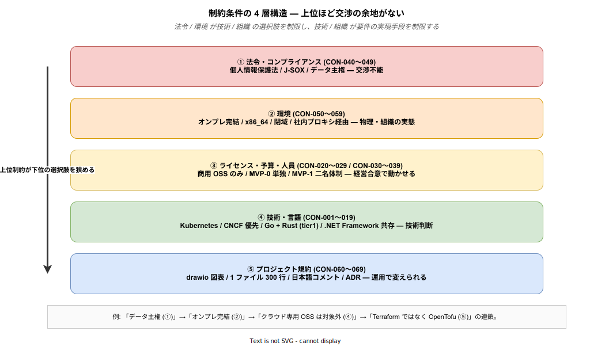

# 07. 制約条件 (CON-xxx)

本章では、k1s0 の設計・実装・運用において **守らなければならない制約** を Constraint (CON) として明示する。制約は要件ではなく「境界条件」であり、すべての要件・設計判断の上位に立つ。

制約条件が要件 (BR / FR / NFR) と根本的に違う点は、「達成すべき目標」ではなく「動かせない前提」であるところにある。法令・環境・予算・プロジェクト規約は、いくら技術的に魅力的な選択肢があっても越えられない線を引き、その線の内側でのみ要件の実現手段を選ぶ。制約を軽視して議論を始めると、後段で「実は法令上できない」「予算がつかない」と手戻りが発生する。制約を先に明確にしておくことで、要件・設計の議論が現実的なスコープに収まる。



図は 5 つのカテゴリが「上位ほど交渉不能」という順序で並んでいることを示す。法令 (①) は個別プロジェクトではどうにもならず、そこから連鎖的に環境制約 (②) が定まり、環境制約が予算・人員 (③) と技術選択肢 (④) を絞り、最後にプロジェクト規約 (⑤) が日々の運用ルールを固める。例えば「データ主権」という法令制約から「オンプレ完結」という環境制約が導かれ、さらに「クラウド専用 OSS は採用できない」という技術判断、「Terraform ではなく OpenTofu を使う」というツール選定へと連鎖していく。この連鎖を意識しないと「なぜ Terraform ではなく OpenTofu なのか」という末端の判断の根拠が見失われる。

---

## 1. 制約条件の読み方

### 1.1 フォーマット

```
### CON-xxx: (制約名)

| 項目 | 内容 |
|---|---|
| 種別 | 技術 / 組織 / 予算 / 法令 / 環境 |
| 由来 | 制約の出所 (規程 / 契約 / 業界慣習 など) |
| 影響 | この制約が設計・実装に与える影響 |

(本文)
```

### 1.2 ID 体系

| ID 範囲 | カテゴリ |
|---|---|
| CON-001 ～ CON-009 | 技術スタック制約 |
| CON-010 ～ CON-019 | 開発言語・既存資産制約 |
| CON-020 ～ CON-029 | ライセンス制約 |
| CON-030 ～ CON-039 | 予算・人員制約 |
| CON-040 ～ CON-049 | 法令・コンプライアンス制約 |
| CON-050 ～ CON-059 | 環境制約 (ネットワーク・ハードウェア) |
| CON-060 ～ CON-069 | ドキュメント・プロジェクト規約 |

---

## 2. 技術スタック制約 (CON-001 ～ CON-009)

技術スタック制約は、上位の法令・環境制約を受けて「この土台の上で k1s0 を組み立てる」と宣言する層である。Kubernetes を前提にするという選択は事実上の業界標準に従うものだが、その上に載せる OSS を CNCF Graduated / Incubating 優先とする (CON-002) のは、ベンダーロックイン回避 (BR-002) と 5 年後の継続性 (BR-007) という業務要件からの要請である。tier1 内部言語を Go + Rust に限定する (CON-003) のは別途 ADR-0002 で決定された事項で、Dapr ファサードは Go、自作領域は Rust という役割分担を持つ。

### CON-001: コンテナオーケストレーションは Kubernetes を利用する

**種別: 技術 / 由来: 業界デファクトスタンダード**

コンテナオーケストレーションは 2015 年前後に Docker Swarm / Mesos / Kubernetes が競合したが、2018 年以降は事実上 Kubernetes に収束した。現在 OSS で本番運用に耐える代替は存在しない。この制約は「Kubernetes が良いから採用する」のではなく、「他に選択肢がない」という現実的判断である。

影響: 全アプリは k8s Pod として動作する設計を前提にする。ローカル開発環境も k8s (kind / kubeadm-lite 等) で再現し、「本番は k8s、ローカルは docker-compose」のような乖離を作らない。Pod / Service / Ingress / ConfigMap の概念を前提にした設計になる。

---

### CON-002: OSS は CNCF 管理 / 中立財団管理を優先する

**種別: 技術 / ガバナンス / 由来: BR-002 ベンダーロックイン回避**

単一企業が所有する OSS は、その企業の買収・経営方針転換で突然ライセンス変更される。実例として Redis が 2024 年 BSL へ移行、HashiCorp Terraform が 2023 年 BSL へ移行、VMware が Broadcom 買収後にライセンス料 3〜10 倍値上げ、といった事例が近年続いている。CNCF Graduated / Incubating は中立財団管理で、プロジェクトごとに Technical Steering Committee があり、ライセンス変更には複数企業の合意が必要で突然の方針転換がしにくい。

影響: 採用候補 OSS は「CNCF Graduated > CNCF Incubating > その他中立財団 (LF / Apache Foundation) > 単一企業管理」の順に優先度をつける。単一企業管理の OSS を採用する場合は代替候補評価を ADR で義務化し、乗り換え経路を事前設計する。

---

### CON-003: tier1 内部実装は Go または Rust のみ

**種別: 技術 / 由来: ADR-0002**

Dapr ファサード部分は Go (Dapr 自体が Go 実装のため互換性が高い)、自作領域 (ZEN Engine 統合・ハッシュチェーン・性能クリティカル) は Rust という役割分担。

影響: tier1 内部では Python / Node.js / Java 等を使わない。言語ランタイム数を 2 に絞ることで、運用時のプロファイリング・メモリリーク調査・GC 特性把握が現実的な学習量に収まる。参照: [`../02_infra/00_ADR/ADR-0002-tier1-language-hybrid.md`](../02_infra/00_ADR/ADR-0002-tier1-language-hybrid.md)

---

### CON-004: Rust Edition は 2024 を利用する

**種別: 技術 / 由来: ADR-0001**

Rust 2024 Edition (1.85 以降) で安定化された async fn in trait、let-else の構文、2024 年の lint 仕様整理などを前提にする。2021 Edition 固定では記述が冗長になる箇所が散見される。

影響: 全 Rust クレートで `edition = "2024"` 必須。Rust 1.85 以上の toolchain を CI / 開発環境で揃える。参照: [`../02_infra/00_ADR/ADR-0001-use-rust-edition-2024.md`](../02_infra/00_ADR/ADR-0001-use-rust-edition-2024.md)

---

### CON-005: オンプレミス / 閉域ネットワーク環境で完結すること

**種別: 環境 / 由来: BR-004、JTC 情シスの典型環境**

JTC 情シスではインターネット直結を許可しない運用が多数派で、クラウド SaaS 利用自体が稟議の壁となる業種 (金融・公共・医療) もある。k1s0 はインターネット接続を前提にせず、社内 LAN / 閉域ネットワーク内で動作完結できる構成を取る。ただし完全にオフラインを要求するわけではなく、以下は許容する — 社内プロキシ経由での OSS / コンテナイメージ取得、社内 DNS / NTP / PKI との連携、社内ミラーレジストリ (Harbor replication) への OSS キャッシュ。

影響: クラウド固有 API (AWS SDK / GCP API 等) を前提にしない。外部 SaaS (Datadog / Sentry / GitHub Actions Cloud runner) への依存を避け、オンプレ代替 (Grafana / 自ホスト Runner) を選ぶ。インターネット接続前提の技術選定は Phase 0 承認段階でブロックされる可能性があるため、事前に回避する。

---

### CON-006: Dapr は tier1 内部のみで利用する

**種別: 技術 / アーキテクチャ / 由来: ADR-0005**

Dapr は単一ベンダー (Microsoft 発、CNCF Incubating) 管理で、将来ライセンス変更・経営方針転換のリスクがある。BR-002 / BR-007 の観点では「Dapr を tier2 / tier3 が直接叩く」設計は危険である。そこで Dapr は tier1 の薄いファサードの中に閉じ込め、tier2 / tier3 からは `k1s0.*` 公開 API 経由でしか呼べなくする。

影響: tier2 / tier3 の業務コードに Dapr SDK の import が混入しないよう、FR-101 の CI ガードで機械的に検知してブロックする。将来 Dapr を REST API 直接呼び出し等へ差し替える際、tier1 の実装だけを変えれば tier2 / tier3 は無改修で済む。参照: [`../02_infra/00_ADR/ADR-0005-dapr-adoption-and-encapsulation.md`](../02_infra/00_ADR/ADR-0005-dapr-adoption-and-encapsulation.md)

---

### CON-007: k8s クラスタは kubeadm で構築する (Phase 1)

**種別: 技術 / 由来: ADR-0004**

Phase 1 時点では商用 Kubernetes ディストリビューション (Rancher / OpenShift / Tanzu) は BR-001 のライセンス費ゼロに反する。kOps は AWS 依存が強くオンプレで使いづらい。結果、CNCF 公式の kubeadm が最も素直な選択となる。

影響: Phase 1 〜 Phase 3 の k8s ライフサイクル管理は kubeadm コマンド + Ansible 自動化で回す。Phase 5 で規模が拡大した段階で Cluster API 等の再評価を行う。参照: [`../02_infra/00_ADR/ADR-0004-kubeadm-adoption.md`](../02_infra/00_ADR/ADR-0004-kubeadm-adoption.md)

---

## 3. 開発言語・既存資産制約 (CON-010 ～ CON-019)

この層の制約は、JTC 情シスの既存資産 (.NET Framework) を抱えながら新プラットフォームに移行するという現実を反映している。既存資産ごと置き換える路線は政治的にも技術的にも破綻しやすい。

### CON-010: 既存 .NET Framework 資産を破壊しないこと

**種別: 組織 / 技術 / 由来: BR-005**

JTC 情シスが数十年かけて積み上げた .NET Framework 資産 (数百〜数千本規模) を一斉移行する計画は稟議段階で必ず否決される。k1s0 は「既存を壊さず並走させる」方針を採る。

影響: .NET Framework アプリは tier3 拡張ポイント (FR-080 / FR-081) として扱い、必要なら Pod 内サイドカーまたは API Gateway 経由で k1s0 に参加できる経路を残す。「いつまでに全部移行する」という強制スケジュールは設定しない。

---

### CON-011: tier2 / tier3 の言語を指定しないこと

**種別: 組織 / 由来: BR-006**

「Rust を使えるエンジニアしか雇えない」では採用市場で不利になる。tier2 / tier3 の言語は業務部門・子会社 SIer の選択肢として残す。

影響: tier1 は多言語クライアントライブラリ (FR-150: C# / Go / TypeScript / Java) を必ず提供する。言語ごとの方言を Acceptance Test で継続検証し、新言語追加時も既存言語の挙動差異を検知できるようにする。

---

### CON-012: 1 ファイルあたり 300 行以内

**種別: プロジェクト規約 / 由来: `CLAUDE.md`**

レビュー可能な粒度の上限。300 行を超えるとレビュアーが文脈を保持しきれず、見落としが増える。例外なし (docs は例外として許容)。

影響: ソースコード実装時は「クラス分割 / 関数分割 / ファイル分割」を 300 行上限で判断する。超過した場合は機能単位でファイル分割を強制する。

---

### CON-013: コードコメントは日本語必須

**種別: プロジェクト規約 / 由来: `CLAUDE.md`**

JTC 情シスの継続メンテナは英語読解の習熟度にばらつきがあり、5 年後のメンテナが英語コメントで詰まるリスクがある。プロジェクト規約で日本語コメントを必須化する。

影響: 全ソースコードで、各行の 1 行上に日本語コメントを記載。ファイル先頭に説明コメントを記載。CI で機械的な検出は困難だが、レビューで確認する。

---

## 4. ライセンス制約 (CON-020 ～ CON-029)

ライセンス制約は「どの OSS をどう使ってよいか」の境界を定める。商用ライセンス費ゼロ (BR-001) を掲げる以上、Apache-2.0 / MIT / MPL-2.0 等の商用利用可能ライセンスを基本とする。ただし AGPL-3.0 の MinIO など「社内利用に限定すれば無償で使えるが SaaS 提供すると義務が発生する」ライセンスは、利用形態の制限 (CON-021) と合わせて採用する。これは法務的な整合性の話であり、エンジニア判断のみで流せない領域であることに注意が必要である。

### CON-020: 採用 OSS は商用利用可能ライセンスであること

**種別: 法令 / ライセンス / 由来: BR-001**

BR-001 (ライセンス費ゼロ) を実現する前提。コピーレフト無 (MIT / BSD / Apache-2.0) またはコピーレフト弱 (MPL-2.0) を基本とする。GPL-3.0 / AGPL-3.0 などの強コピーレフトは、業務コード自体へソース開示義務が波及する可能性があるため、採用時は法務確認を経て ADR 化する。

影響: 新規 OSS 採用時の ADR テンプレートに「ライセンス確認」節を必須化する。JTC 情シスの法務部門が見て懸念を持ちにくい Apache-2.0 / MIT を第一選択とする。

---

### CON-021: MinIO の AGPL-3.0 利用形態を制限

**種別: ライセンス / 由来: MinIO のライセンス条文**

MinIO は 2021 年に Apache-2.0 から AGPL-3.0 に移行した。AGPL は「ネットワーク越しにサービス提供する場合に改変ソース開示義務が発生する」という強コピーレフトで、クラウドベンダーが自社の MinIO フォークを提供することを防ぐ目的で設計されている。

影響: k1s0 は社内利用 (監査ログバックアップ保管先など) に限定し、外部顧客向け SaaS として MinIO を組み込んだサービス提供はしない。社内利用のみであれば AGPL 義務は発生しない。Phase 5 で SaaS 化検討が出る場合は、MinIO を他の S3 互換 OSS (SeaweedFS / Garage 等) に差し替える経路を ADR で事前設計する。

---

### CON-022: 商用サポート契約は任意

**種別: 予算 / 由来: BR-001**

商用サポート契約は稟議・契約更新・価格交渉のたびに工数を食い、BR-001 の「稟議ハードル低減」価値を弱める。必須にはしない。

影響: 有償サポートがなくても機能する構成を保つ。代わりにコミュニティサポート (Slack / GitHub Issues) + 社内の ADR / Runbook で自立できる運用体制を作る。特定ベンダー (Red Hat OpenShift 等) の有償サポートなしでは動かない構成は採らない。必要に応じて個別判断として契約を結ぶ余地は残す。

---

## 5. 予算・人員制約 (CON-030 ～ CON-039)

予算・人員制約は、本プロジェクトにおける最大のリスク源である。MVP-0 が起案者単独・2 週間・VM 1 台という極端に小さな体制で始まること (CON-030) は、バス係数 1 問題 (RISK-001) を構造的に抱える。これを MVP-1 の 2 名体制 + VM × 3 (CON-031) で解消する計画だが、そのためには Phase 0 承認時に MVP-1 のハードウェア予算 (ASM-031) が合意されている必要がある。この制約チェーンが崩れると、リスクが顕在化するタイミングが Phase 進行に合わせて決まる。

### CON-030: MVP-0 は起案者単独・VM 1 台

**種別: 予算 / 人員 / 由来: [`../01_企画/07_ロードマップと体制/01_MVPスコープ.md`](../01_企画/07_ロードマップと体制/01_MVPスコープ.md)**

Phase 0 承認を得るには、承認前に動くものを示せる必要がある。このため MVP-0 は起案者 1 名が業務時間の一部で 2 週間以内に完成させる規模に限定する。スペックは 4 vCPU / 8 GB RAM / 100 GB SSD で、既存の開発用 VM の流用も可能にする。

影響: 2 週間・単独・VM 1 台で動かない機能は Phase 1b 以降に送る。この制約が BR-024 の「自動化 + 単独運用」や FR-140 の GitOps 初期化範囲、NFR-030 の可用性目標（Phase 1a は SLA 対象外、Phase 1b で tier1 API 99% / Backstage・CI 95%）という数値決定の起点になっている。バス係数 1 問題 (RISK-001) が構造的に発生する段階でもある。

---

### CON-031: MVP-1 は 2 名体制・VM × 3

**種別: 予算 / 人員 / 由来: 同上**

MVP-1 では起案者 + 協力者 1 名 (計 2 名) で、VM × 3 台を使って HA 構成のミニチュアを実現する。この体制拡張が Phase 0 承認時に確約されていないと MVP-1 に移行できない (ASM-002 の崩壊条件)。

スペック推奨: 16 vCPU / 32 GB RAM / 500 GB SSD × 3 台。k8s control-plane 兼 worker 1 台 + worker 2 台の構成で、k8s / Istio / Kafka / PostgreSQL の HA ミニチュアが動く規模。

影響: 2 名体制が成立することで、起案者が 1 週間休んでも協力者が最低限の運用を継続できるバス係数 2 の状態を作る。VM × 3 により、1 台停止時の挙動を実機で検証できるようになり、NFR-030 の 99.5% 可用性目標 (Phase 3 時点) への技術的準備が整う。

---

### CON-032: Phase 2 以降は 2〜3 名体制

**種別: 人員 / 由来: 同上**

Phase 2 以降も情シス側の恒常的人員は 2〜3 名を想定し、大規模開発組織を前提にしない。この体制規模に収まらない要件は優先度を見直す。

影響: 人数に頼らず自動化で回す運用設計が必須になる (NFR-041 の段階的自動化)。業務アプリ部分は子会社 SIer の tier2 / tier3 枠で開発する前提で、情シスは tier1 / infra 中心に回す。

---

### CON-033: 商用ライセンス購入は原則しない

**種別: 予算 / 由来: BR-001**

商用製品導入は稟議 (社内決裁プロセス) を通す必要があり、承認まで数週間〜数か月を要する。JTC 情シスの稟議プロセスは「新規ベンダーとの契約」を特に慎重に扱い、決裁者・法務・購買・情シス統括が順に関与するため、単純な金額比較以上のコストが発生する。OSS 代替があれば OSS を選ぶ判断基準は、この稟議コスト回避と BR-001 の両方が根拠。

影響: 商用製品導入は ADR と稟議の両方が必要なプロセスにする。OSS 代替が技術的に成立するなら OSS を優先し、OSS 採用の場合は ADR のみで導入可能にする (運用負荷は上がっても稟議コストはゼロ)。

---

## 6. 法令・コンプライアンス制約 (CON-040 ～ CON-049)

法令・コンプライアンス制約は、本書の中で最も交渉の余地がない層である。個人情報保護法や J-SOX は日本国内で業務を行う以上の前提であり、「遵守する」以外の選択肢を取れない。データ主権 (CON-043) は業種や契約によって追加されることがあり、金融・医療・公共領域では特に厳しくなる。技術的な実装手段 (監査ログ・アクセス制御・暗号化) は、すべてこれらの法令要件を満たすために設計されていることを忘れてはならない。

### CON-040: 個人情報保護法を遵守すること

**種別: 法令 / 由来: 日本国内法令 (2022 年改正)**

2022 年改正で罰則強化 (法人最大 1 億円) および本人通知義務の厳格化があり、漏洩時の経営インパクトが一段上がった。

影響: 個人情報を扱う業務アプリの「取得・利用・保管・第三者提供」の各局面で監査ログを取得し、事故時の本人通知対象を迅速に特定できる状態を作る (NFR-062 / NFR-080 と連動)。個人情報データベース自体には Keycloak ロールベースのアクセス制限を必須とする。

---

### CON-041: 内部統制 (J-SOX) への対応

**種別: 法令 / 由来: 金融商品取引法 (上場企業の場合)**

上場企業は内部統制報告書の提出が義務。IT 全般統制 (ITGC) の不備は監査法人から「開示すべき重要な不備」として指摘される可能性があり、有価証券報告書に記載されると株価・ブランドに直接影響する。

影響: アクセス管理 (RBAC) / 変更管理 (GitOps による Git 履歴) / 運用管理 (監査ログ) の 3 点をそれぞれ FR-012 / FR-140 / FR-030 で技術的に担保する。監査法人のヒアリングで「誰が / いつ / 何を変えたか」を画面上で即座に提示できる状態を常に保つ。

---

### CON-042: 業界固有の規制 (必要に応じて)

**種別: 法令 / 業界 / 由来: 業種により異なる**

金融では FISC 安全対策基準、医療では 3 省 2 ガイドライン、公共では政府情報システムのためのセキュリティ評価制度 (ISMAP) など、業種により追加要件が発生する。

影響: 導入先企業の業種を Phase 導入時に確認し、該当する業界固有規制を制約として追加する。k1s0 コアは「共通要件 + 業界固有を ADR で追加可能」な構造にする。

---

### CON-043: データ主権 (データの国内保管)

**種別: 法令 / 契約 / 由来: 業界慣習、公共セクター要求**

官公庁取引、個人情報を扱う業務、医療データ、金融データなどは国内保管が契約条件に含まれることが多い。CON-005 のオンプレ完結と表裏一体の制約。

影響: データを国外に出さない設計を徹底。バックアップ保管先 (MinIO) も国内 DC に限定。クラウド利用時も国内リージョン限定の SLA を確約できるベンダーのみ候補化する。Phase 1 はオンプレ完結のため自動的に満たされる。

---

## 7. 環境制約 (CON-050 ～ CON-059)

環境制約は JTC 情シスの典型的なハードウェア・ネットワーク環境を踏襲することで、導入時の環境特殊要件を最小化する。この制約が緩すぎると「このサーバでは動かない」というトラブルが発生しやすくなる。

### CON-050: 社内ネットワークの帯域は 1 ～ 10 Gbps

**種別: 環境 / 由来: JTC 典型環境**

サーバ間 LAN は 10 Gbps、クライアント側は 1 Gbps が JTC の標準。エンドユーザー端末側も有線 1 Gbps または Wi-Fi 5 (867 Mbps 前後) を前提にする。

影響: NFR-050 の「配信ポータル初回ロード 2 秒以内」は 1 Gbps 前提で測定する。Pod 間通信は 10 Gbps を活かして Kafka / PostgreSQL レプリケーションを回す。帯域前提での性能数値 (p99 50 ms 等) はこの環境で担保する。

---

### CON-051: 稼働時間は平日 8:00 ～ 20:00 が主

**種別: 環境 / 由来: 業務実態**

JTC の業務時間は平日 9:00〜18:00 を中心に、前後 1 時間の準備・残業を加えた 8:00〜20:00 帯が実稼働。夜間・週末は業務停止。

影響: メンテナンスウィンドウは平日夜間 22:00〜翌 6:00 に月 1 回設定 (NFR-032)。SLA 算定は業務時間帯を重視する (NFR-030 の「配信ポータル 95% (業務時間帯)」はこの制約に基づく)。

---

### CON-052: 外部サービスとの接続は社内プロキシ経由

**種別: 環境 / セキュリティ / 由来: 情シス標準**

JTC 情シスはセキュリティ上、インターネット直結を許さず、社内 Forward Proxy (Squid / Blue Coat 等) を経由させる運用が一般的。

影響: OSS 取得 (npm / Go modules / NuGet)、コンテナイメージ pull、OpenTelemetry 外部送信 (利用する場合) などは HTTPS_PROXY / HTTP_PROXY 環境変数への対応を必須化する。プロキシ認証 (Basic / NTLM) 対応が必要なケースもある。

---

### CON-053: ハードウェアは x86_64 を前提

**種別: 環境 / 由来: JTC 典型的なサーバハードウェア**

JTC のオンプレサーバは Intel Xeon / AMD EPYC 系 (x86_64) がほぼすべて。Arm サーバ (AWS Graviton、Ampere) は採用実績が極めて少ない。

影響: 全コンテナは linux/amd64 ビルド必須。multi-arch イメージ対応は Phase 5 以降に評価する。社員 PC 配信 (PWA / MSIX) は x86_64 Windows 10/11 を前提にする。

---

## 8. ドキュメント・プロジェクト規約 (CON-060 ～ CON-069)

ドキュメント規約はプロジェクト運営の一貫性を保つためのルールで、違反するとドキュメント品質・レビュー効率が急速に劣化する。

### CON-060: 図表は drawio で作成する

**種別: プロジェクト規約 / 由来: `CLAUDE.md`**

drawio は XML ソース + SVG 出力で、Git diff が取れて差分レビュー可能。Mermaid や PlantUML より柔軟性が高く、かつ OSS で無料。Lucidchart / Miro のような SaaS は CON-005 のオンプレ完結に反する。

影響: 全ドキュメント中の図は `.drawio` ファイルを md と同階層の `img/` に格納し、同時に `.svg` をエクスポートして md 内に埋め込む。drawio 未インストール環境でも SVG だけで閲覧可能にする。

---

### CON-061: ASCII アート図の禁止

**種別: プロジェクト規約 / 由来: `CLAUDE.md`**

ASCII アートは PR 作成者が編集するたびに整形が崩れ、レビューのノイズになる。drawio で描く方がメンテナンス性が高い。

影響: md 内にアスキー図を書かない。フローや関係図は drawio + svg で表現する。

---

### CON-062: drawio の設計規約遵守

**種別: プロジェクト規約 / 由来: `CLAUDE.md`**

drawio 内の見た目規約。GitHub ダークテーマ対応 (白背景)、白矢印禁止 (視認性)、矢印とボックスの重なり禁止 (レビュー時の意味把握)、SVG エクスポート時の白矩形配置などが含まれる。

影響: 図作成時に規約チェックを手動で実施。違反があれば PR レビューで差し戻す。

---

### CON-063: ADR で技術決定を記録する

**種別: プロジェクト規約 / 由来: `../00_format/ADR-xxxx.md`**

技術決定の「なぜ」を残さないと 5 年後のメンテナが前任者の意図を復元できない。ADR (Architecture Decision Record) は Context / Decision / Consequences の 3 節を必須とし、決定の背景と代替案も記録する。

影響: 重要技術決定 (OSS 採用、言語選定、アーキテクチャパターン) は必ず ADR を作成。`docs/02_infra/00_ADR/` に格納し、番号管理する。

---

### CON-064: 要件 ID は欠番も含めて再利用しない

**種別: プロジェクト規約 (本書) / 由来: `00_はじめに.md`**

要件 ID が再利用されると、設計書・テスト仕様書で過去に引用した ID が別物を指すようになり、トレーサビリティが破綻する。

影響: 要件が削除・廃止されても ID は欠番として残す。削除理由は該当要件箇所に「(削除: 理由)」として記録する。

---

## 9. 制約条件のサマリ

制約は「それが崩れたら何が止まるか」を意識すると優先度が見える。法令と環境が崩れるとプロジェクトが根幹から成立せず、予算・人員が崩れると Phase 計画が後ろ倒しになり、技術制約が緩むと 5 年後の継続性が揺らぐ。

| 区分 | 主な制約 | 崩れた時に何が止まるか |
|---|---|---|
| 技術 | Kubernetes / CNCF OSS 優先 / Go + Rust (tier1) / Rust Edition 2024 | BR-002 / BR-007 が崩れ、5 年後の継続性が揺らぐ |
| 環境 | オンプレ完結 / 閉域ネットワーク対応 / x86_64 / 1-10 Gbps LAN | BR-004 が崩れ、JTC 情シス環境で導入できない |
| 言語 | tier2/3 言語自由 / .NET Framework 共存 / コメント日本語必須 | BR-005 / BR-006 が崩れ、既存資産放棄の稟議が通らない |
| ライセンス | 商用可能 OSS のみ / MinIO AGPL は社内利用限定 | BR-001 が崩れ、ライセンス費ゼロの稟議前提が崩壊 |
| 予算・人員 | MVP-0 単独 / MVP-1 で 2 名 / Phase 2 以降で 2-3 名 | Phase 計画が後ろ倒し、RISK-001 (バス係数 1) が顕在化 |
| 法令 | 個人情報保護法 / J-SOX / データ主権 | 監査指摘・罰則・株価影響。交渉不能のライン |
| 規約 | 1 ファイル 300 行 / drawio 図表 / ADR 記録 | ドキュメント・コード品質が劣化、レビュー効率悪化 |

---

## 関連ドキュメント

- [`08_前提条件.md`](./08_前提条件.md) — 制約と対になる前提条件
- [`../01_企画/04_技術選定/`](../01_企画/04_技術選定/) — OSS 選定理由
- [`../02_infra/00_ADR/`](../02_infra/00_ADR/) — 確定済みの技術決定
- `../../CLAUDE.md` — プロジェクト共通規約
