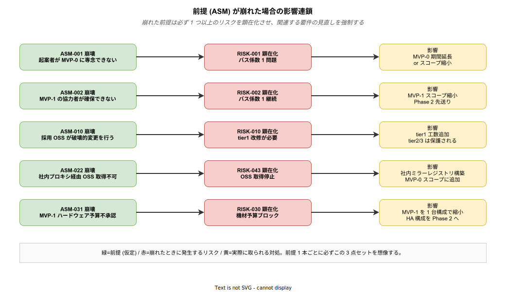

# 08. 前提条件 (ASM-xxx)

本章では、k1s0 の要件が **成立するために所与とする事実・仮定** を Assumption (ASM) として明示する。前提が崩れると要件の妥当性も揺らぐため、プロジェクト進行中に前提の検証を継続する必要がある。

前提条件は「暗黙に仮定していること」を明文化することで、計画の脆さを可視化する役割を持つ。制約条件 (07 章) が「守るべきルール」であるのに対し、前提は「成立するはずと期待している事実」であり、こちらは崩れる可能性がある。例えば「MVP-0 開始時に起案者が他の緊急対応に巻き込まれない」という前提は、書かなければ当然とされるが、実際には障害対応や別プロジェクトによって簡単に崩れる。前提を書き出すことで、崩れたときの対処を事前に用意できる。



図は 5 つの代表的な前提が崩れた場合に、どのリスクが顕在化し、どの対処を取るかの 3 点セットを示している。ここで重要なのは、前提ごとに **リスクと対処を事前にセットで定義している** 点である。ASM-001 (起案者専念) が崩れれば RISK-001 (バス係数 1) が顕在化し、MVP-0 期間延長またはスコープ縮小という対処を取る — これを事後に相談するのではなく、計画段階で合意しておくことで、崩れたときの混乱を減らせる。本章の各 ASM はこのパターンに沿って「検証方法」と「崩れた場合の影響」を明記している。

---

## 1. 前提条件の読み方

### 1.1 制約 (CON) との違い

| 区分 | 意味 |
|---|---|
| **制約 (CON)** | 守らなければならないルール (破ったら失敗) |
| **前提 (ASM)** | 要件を組み立てる土台となる仮定 (崩れたら要件を見直す) |

例: 「オンプレで動くこと」は制約 (CON-005)。「社内に VM 調達のリードタイムが 2 週間以内である」は前提 (ASM-xxx)。

### 1.2 フォーマット

```
### ASM-xxx: (前提名)

| 項目 | 内容 |
|---|---|
| 区分 | 組織 / 技術 / 環境 / 人員 / 市場 |
| 検証方法 | どのように前提の成立を確認するか |
| 崩れた場合の影響 | 何が見直しになるか |

(本文)
```

### 1.3 ID 体系

| ID 範囲 | カテゴリ |
|---|---|
| ASM-001 ～ ASM-009 | 組織・人員の前提 |
| ASM-010 ～ ASM-019 | 技術・OSS の前提 |
| ASM-020 ～ ASM-029 | 環境・インフラの前提 |
| ASM-030 ～ ASM-039 | 予算・ガバナンスの前提 |
| ASM-040 ～ ASM-049 | 業務・ステークホルダーの前提 |

---

## 2. 組織・人員の前提 (ASM-001 ～ ASM-009)

組織・人員の前提は、本プロジェクトで最も脆く、しかし最も影響の大きい領域である。起案者単独で 2 週間の MVP-0 を走らせる計画は、起案者の稼働が他案件で喰われれば即座に崩れる。MVP-0 デモ後に協力者を獲得するという設計 (ASM-002) も、挑戦者タイプ (森田ペルソナ) が組織内に存在する (ASM-003) ことを前提としており、この連鎖が 1 本でも切れると Phase 2 以降の計画が大きく狂う。

### ASM-001: Phase 0 承認後、起案者が MVP-0 に専念できる

**区分: 人員 / 検証方法: Phase 0 承認時に起案者の業務アサイン状況を確認**

MVP-0 の 2 週間は、起案者が専任で集中できる前提で設計されている。JTC 情シス部門は少人数で多数のサービスを抱えるため、1 名が別タスク (障害対応 / 監査対応 / ベンダーとの調整会議) に巻き込まれると週単位で稼働が消える。この前提を Phase 0 承認時に明示的に確認し、承認後の 2 週間は起案者の業務アサインから他案件を意図的に外す合意を取る必要がある。

崩れた場合: MVP-0 期間 (2 週間) を延長するか、MVP-0 スコープ (機能数 / 検証範囲) を削減する。最悪の場合、Phase 0 承認を得ても MVP-0 実施が次四半期に持ち越される。

---

### ASM-002: MVP-1 開始時に協力者 1 名をアサインできる

**区分: 人員 / 検証方法: MVP-0 デモ後に情シス管理職と候補者を特定**

MVP-0 デモを見た情シス管理職が「これなら投資価値がある」と判断した上で、情シス部門内または関係部門から 1 名を MVP-1 に専任または兼任でアサインする。協力者候補は「挑戦者タイプ (森田ペルソナ)」で、かつ k8s / OSS 基盤の学習意欲がある人物が望ましい。

崩れた場合: MVP-1 のスコープを縮小し、バス係数 1 のまま Phase 2 に進む。この状態が続くと RISK-001 が顕在化し、起案者の長期離脱 (退職 / 異動 / 病気) で全体が止まる。

---

### ASM-003: 挑戦者タイプ (森田ペルソナ) が組織内に存在する

**区分: 組織 / 検証方法: 起案前の組織ヒアリング**

企画段階で定義したペルソナ「森田 (30 代、新技術を積極的に学び、組織の停滞を打破したいと考える若手〜中堅)」に該当する人材が組織内に最低 1 名いることが前提。このタイプがいなければ tier1 の後継者育成が成立せず、5 年後の継続性 (BR-007) が崩れる。

崩れた場合: tier1 開発の後継者が育たず、起案者が抜けた後の保守が困難になる。外部 SIer への委託を検討することになるが、それは BR-002 (ベンダーロックイン回避) と矛盾する可能性がある。

---

### ASM-004: 決裁者 (情シス課長以上) が中立以上の姿勢である

**区分: 組織 / 検証方法: 企画書レビュー時の反応**

決裁者が「守護者タイプ (新技術導入に保守的)」で完全に否定的な姿勢だと、企画書をどれだけ磨いても Phase 0 承認は得られない。中立 (検討の余地あり) 以上の姿勢が最低ラインとなる。

崩れた場合: 予算・人員の確保が困難となり、Phase 0 で中止または大幅スコープ縮小。代替策として、決裁者を跨いだ上位層 (情シス部長・CIO) への直接訴求を検討する。

---

### ASM-005: 協力者は Kubernetes / OSS 基盤の基礎知識を持つか習得意欲がある

**区分: 人員 / 検証方法: 候補者インタビュー**

MVP-1 協力者が k8s の Pod / Service / Deployment の基本概念を理解していない、または学習意欲がない場合、オンボーディングに 数か月 を要する。MVP-1 の 2 か月スコープが成立しなくなる。

崩れた場合: MVP-1 スケジュールを 2〜3 か月延期するか、オンボーディング済みの別候補者に差し替える。

---

## 3. 技術・OSS の前提 (ASM-010 ～ ASM-019)

技術・OSS の前提は、採用 OSS が 5 年以上健全に存続することを仮定する。CNCF Graduated / Incubating は一定の継続性を期待できるが、単一企業所有の OSS (Dapr / ZEN Engine 等) は企業の方針転換やライセンス変更のリスクを抱える。ここでの前提崩壊は技術リスク (RISK-010 / RISK-011 / RISK-013) に直結するが、tier1 ファサード層で内部実装を隠蔽している (FR-131) ため、影響を tier1 の内側に封じ込める設計になっている。

### ASM-010: 採用 OSS は Phase 1 期間中に破壊的変更を行わない

**区分: 技術 / 検証方法: 各 OSS のリリース計画・メンテナンス状況を四半期ごとに確認**

対象 OSS: Kubernetes / Istio / Dapr / Keycloak / Kafka (Strimzi) / PostgreSQL / Grafana スタック / Backstage / Argo CD など。Phase 1 (1a + 1b で約 3 か月) の期間中に、これらが Major Bump や API 削除を行うと tier1 の改修工数が発生する。CNCF Graduated 級は年 1〜2 回の Major Bump が通例だが、Phase 1 期間と重なる確率は低い。

崩れた場合: tier1 の改修が必要になり、追加工数 2〜4 週間が発生。MVP-1 完了が延期する。

---

### ASM-011: CNCF Graduated / Incubating OSS は中長期 (5 年以上) 存続する

**区分: 技術 / 検証方法: CNCF プロジェクトステータスを四半期ごとに確認**

CNCF Graduated は「Kubernetes / Envoy / Istio / Prometheus / Argo / etcd / Linkerd / Vitess / Open Policy Agent」等の成熟プロジェクト群。これらは複数企業が貢献し、1 社の方針変更で突然終了する確率は極めて低い。CNCF Incubating は存続確率がやや下がるが、それでも Archive されるプロジェクトは年間数件 (全体の 5% 以下)。

崩れた場合: 代替 OSS への移行を検討。tier1 ファサードの内側で封じ込めてあるため、tier2 / tier3 への波及は最小化できる (FR-131 の設計効果)。

---

### ASM-012: Dapr Go SDK は stable で継続提供される

**区分: 技術 / 検証方法: Dapr コミュニティのリリースノート追跡**

Dapr は CNCF Incubating で Microsoft が主要貢献者。Microsoft の方針転換で Dapr の優先度が下がる可能性はゼロではない (Service Fabric の前例あり)。Dapr Go SDK は stable リリースで、セマンティックバージョニングを守っている現状。

崩れた場合: tier1 の Dapr ファサード実装を見直す。最悪、Dapr Runtime に REST API 直接呼び出しで代替するか、別の Service Mesh + Message Broker 組み合わせに切替。tier2 / tier3 からは見えない変更に抑えられる。

---

### ASM-013: ZEN Engine (Rust 製 BRE) が継続開発される

**区分: 技術 / 検証方法: GitHub のコミット頻度・Issue 対応状況を月次確認**

ZEN Engine は GoRules 社製の OSS 業務ルールエンジンで、Rust 実装のため tier1 自作領域に組み込みやすい。単一企業管理のため、GoRules の経営状況が悪化すれば開発停止リスクがある。

崩れた場合: 別 BRE (Drools / Camunda DMN) への切替検討。`k1s0.Decision` ファサードの内側での置換となるため、tier2 / tier3 への影響はない。

---

### ASM-014: 主要 OSS のセキュリティ脆弱性対応が迅速である

**区分: 技術 / 検証方法: CVE 公開から修正版リリースまでの所要時間を追跡**

Kubernetes / Istio / Keycloak 等の主要 OSS は、過去実績として Critical CVE 発見から 24〜72 時間で修正版リリースがされている (Log4Shell 時の各社対応など)。NFR-061 の「Critical 48 時間以内」はこの上流対応速度が前提になっている。

崩れた場合: 上流の対応を待てず、独自パッチ適用または代替 OSS への一時切替を検討。運用負荷が一時的に増大する。

---

## 4. 環境・インフラの前提 (ASM-020 ～ ASM-029)

環境・インフラの前提は、情シス部門の既存運用基盤 (DNS / NTP / PKI / プロキシ) が再利用可能であることを仮定する。これらが使えない場合、自前運用を追加する必要が生まれ、MVP-0 の 2 週間スコープがすぐに破綻する。特に社内プロキシ経由で OSS イメージ / パッケージを取得できること (ASM-022) は MVP-0 開始の必須条件で、Phase 0 承認前に必ず検証しておく。

### ASM-020: VM 調達のリードタイムが 2 週間以内

**区分: 環境 / 検証方法: 情シス運用フローを Phase 0 前に確認**

JTC 情シスの VM 調達 (既存仮想基盤上の払い出し) は通常 1〜2 週間。物理サーバ新規調達は 3〜6 か月かかる場合があるが、Phase 1 期間は既存仮想基盤の流用を想定しているため 2 週間以内を前提にする。

崩れた場合: MVP-0 / MVP-1 の開始タイミングが遅延。承認後すぐに着手できないため、Phase スケジュール全体が後ろ倒しになる。

---

### ASM-021: 社内 LAN の帯域が 1 Gbps 以上

**区分: 環境 / 検証方法: 既存環境のネットワーク計測**

CON-050 で規定する 1〜10 Gbps が実際に出ることを確認する必要がある。特にリモート拠点や古い LAN セグメントでは 100 Mbps しか出ないケースもある。

崩れた場合: NFR-050 (ポータル初回ロード 2 秒以内) の目標値見直し。配信アセットサイズの削減 (PWA キャッシュ積極活用) で緩和可能な場合もあるが、根本は LAN 増強を待つことになる。

---

### ASM-022: 社内プロキシ経由で OSS イメージ / パッケージが取得できる

**区分: 環境 / 検証方法: プロキシ経由での Docker Hub / GitHub / Helm Chart 取得を Phase 0 で実測**

MVP-0 の 2 週間では数十種類の OSS コンテナイメージ・パッケージを取得する必要がある。プロキシの許可ルール・認証方式 (Basic / NTLM / PAC) が想定と違うと、取得できない OSS が続発して MVP-0 スコープが破綻する。

崩れた場合: 社内ミラーレジストリ (Harbor replication) の構築作業を MVP-0 スコープに追加。これだけで 1 週間工数を食うため、MVP-0 本体のスコープを削る必要が出てくる。

---

### ASM-023: 社内 DNS / NTP / PKI が利用可能

**区分: 環境 / 検証方法: 情シス運用基盤の確認**

JTC 情シスには既存の DNS / NTP / PKI (社内 CA) が稼働している前提。k1s0 はこれらを既存基盤として利用し、自前で重複運用しない。

崩れた場合: 自前運用の DNS / NTP サーバを k8s クラスタ内に配置する追加作業が発生。NTP は意外とセットアップコストが低いが、社内 CA を自前運用するのは非推奨 (鍵管理の責務が重い)。

---

### ASM-024: ハードウェアリソースが MVP-0 / MVP-1 要件を満たす

**区分: 環境 / 検証方法: 既存機材のスペック確認**

要求スペック:
- MVP-0: 4 vCPU / 8 GB / 100 GB SSD × 1
- MVP-1: 16 vCPU / 32 GB / 500 GB SSD × 3

これらを新規調達せず、既存の開発用仮想基盤から払い出せることが理想。メモリが 16 GB しかない VM が標準の環境だと、MVP-1 スペックは新規購入扱いとなり予算プロセスが別途必要になる。

崩れた場合: Phase 1 スコープ縮小 (HA 構成を一部見送る)、または新規調達予算を確保する稟議追加。

---

## 5. 予算・ガバナンスの前提 (ASM-030 ～ ASM-039)

### ASM-030: MVP-0 に追加予算は不要

**区分: 予算 / 検証方法: 既存 VM 活用可否の確認**

MVP-0 は 4 vCPU / 8 GB の 1 台で完結するため、既存の開発用 VM の流用で追加予算ゼロが理想。これが成立しないと Phase 0 承認直後に更に予算稟議が必要になり、MVP-0 開始自体が 1〜3 か月遅れる。

崩れた場合: MVP-0 開始の稟議が必要になり、スケジュール全体が後ろ倒し。BR-001 のライセンス費ゼロの説得力も薄れる (「ライセンスはゼロでも VM 代がかかる」論に押し戻される可能性)。

---

### ASM-031: MVP-1 のハードウェア予算が承認される

**区分: 予算 / 検証方法: Phase 0 承認時に MVP-1 のスペック見積もりを提示**

MVP-1 の 16 vCPU × 3 台は、既存仮想基盤の余剰リソースで賄えれば追加予算ゼロだが、余剰がない場合は 1 台あたり数十万円 (VM 増設) 〜数百万円 (物理サーバ) の予算が必要。Phase 0 承認時にセット承認を得ておく。

崩れた場合: MVP-1 開始延期 (予算獲得まで 3〜6 か月)、または 2 台構成への規模縮小。HA 検証ができず NFR-030 の目標達成が遠のく。

---

### ASM-032: 商用サポート契約は必要に応じて個別判断可能

**区分: 予算 / 検証方法: 稟議フローの確認**

CON-033 で「商用サポートは原則不要」としているが、Phase 5 の全社展開で Kubernetes 本体サポートが必要になる等、例外局面で契約が必要になる可能性はある。この場合の稟議フローが使える前提。

崩れた場合: 緊急時に外部ベンダーに頼れない。自社対応能力が一層重要になり、ADR / Runbook の充実度が死活問題になる。

---

### ASM-033: OSS 採用は稟議不要

**区分: ガバナンス / 検証方法: 社内規程の確認**

JTC 情シスの多くは「商用製品は稟議必須、OSS は報告のみで可」という運用。k1s0 はこの前提で設計されており、OSS の追加採用が稟議待ちになると Phase 1 の 3 か月では間に合わない。

崩れた場合: 導入スピードが大幅に低下。各 OSS 採用で 2〜4 週間の遅延が積み重なる。

---

## 6. 業務・ステークホルダーの前提 (ASM-040 ～ ASM-049)

業務・ステークホルダーの前提は、MVP-1 でパイロット業務を実際に走らせる段階で特に重要になる。パイロット業務部門が協力的 (ASM-041) であり、運用チームが Grafana を受け入れる (ASM-042) ことが、技術的に正しいものを実地検証に持ち込む前提である。守護者タイプの抵抗が「対話可能な範囲」に収まる (ASM-043) という前提は、企画段階のペルソナヒアリングで早期に検証し、崩れる兆候があれば BR-005 (レガシー共存) の前倒しで対応する。

### ASM-040: パイロット業務を 1 件特定できる

**区分: 業務 / 検証方法: 要件定義担当・業務部門との事前調整**

推奨条件: 小規模 (10 人以内) / クリティカルでない (停止しても業務損失が限定的) / 既存システムと並行利用可能 (障害時のフォールバック経路がある) / データ量が中程度 (数百〜数千レコード)。条件を満たす業務が見つからなければパイロット検証が成立しない。

崩れた場合: MVP-1 で実業務検証ができず、Phase 2 以降の予算獲得で「本当に業務に使えるのか」という問いに答えられない。価値訴求が弱くなり、Phase 3 全社展開の稟議が通らない。

---

### ASM-041: パイロット業務部門が試行運用に協力的

**区分: ステークホルダー / 検証方法: 業務部門長とのヒアリング**

パイロット対象部門が「情シスの新基盤検証に付き合う余裕がない」状態だと、ユーザ側の試行運用が形骸化する。業務部門長が Phase 0 時点で「このタイミングなら協力できる」と合意していることが重要。

崩れた場合: パイロット業務の入れ替え。別部門で ASM-040 の条件を満たす候補を探し直す。

---

### ASM-042: 運用チームが観測基盤 (Grafana) 利用を受け入れる

**区分: 組織 / 検証方法: 運用リーダーと Phase 0 時点で調整**

既存運用が Zabbix / JP1 / 独自ツールなど別系統で回っていると、Grafana の新規導入に運用チームが抵抗する可能性がある。「今ある画面と別のを見ろと言われても困る」という現場の本音。

崩れた場合: Zabbix 等の既存ツールと並行運用を許容する。Grafana 側はあくまで k1s0 プラットフォーム自体の監視に限定し、業務アプリ監視は既存ツールに委ねる折衷案を取る。

---

### ASM-043: 守護者タイプの抵抗が「対話可能な範囲」である

**区分: 組織 / 検証方法: ペルソナヒアリング**

守護者タイプ (保守的・新技術に否定的) が組織にいるのは前提だが、「話が通じる範囲」に収まっていることが条件。完全に対話不能 (企画書すら読まない・会議で一方的に否定) だと、Phase 1 計画が進まない。

崩れた場合: レガシー共存 (BR-005) の優先度を上げ、Phase 1b 以前に前倒しで検証。「既存を壊さない」ことを行動で示すことで対話の糸口を作る。

---

### ASM-044: 監査担当の要求が現行法令水準である

**区分: ガバナンス / 検証方法: 監査部門との合意**

監査担当が J-SOX / 個人情報保護法の標準水準を求めていることが前提。これが「独自の超厳格要件 (例: 全データを暗号化してマスキング表示)」だと、追加実装が数人月単位で発生する。

崩れた場合: データマスキング、項目別暗号化、アクセス時の上長承認フローなど、追加コンプライアンス機能の開発が必要。Phase 計画の大幅見直しが発生する。

---

## 7. 前提条件の検証タイミング

前提は時間とともに崩れる可能性があるため、複数のタイミングで継続的に再検証する。一度 Phase 0 で「成立」と確認しても、四半期後には状況が変わっているかもしれない。

| タイミング | 確認内容 | 目的 |
|---|---|---|
| Phase 0 承認前 | 全前提の初期検証 | 承認可否の判断材料を揃える |
| Phase 1a → 1b 移行時 | 人員・環境前提 (ASM-001〜005, 020〜024) を再確認 | MVP-1 着手の可否判定 |
| 四半期レビュー | 技術前提 (ASM-010〜014) を確認 | OSS ステータス変化を早期検知 |
| インシデント発生時 | 該当前提が崩れていないか確認 | 再発防止要件の源泉を特定 |

前提が崩れた場合は、影響する要件を見直し、本書を改版する。改版履歴は README.md に記載する。

---

## 8. 前提条件のサマリ

優先度は「崩れた時の計画影響度」で判定する。高 = Phase 計画そのものが止まる、中 = Phase 内スコープの調整で済む、低 = ローカル変更で吸収可能。

| # | 前提 | 優先度 | 崩れた時の主影響 |
|---|---|---|---|
| ASM-001 | 起案者が MVP-0 に専念可能 | 高 | MVP-0 開始が 1〜3 か月遅延 |
| ASM-002 | MVP-1 で協力者 1 名確保 | 高 | バス係数 1 継続。RISK-001 顕在化 |
| ASM-004 | 決裁者が中立以上 | 高 | Phase 0 で中止または大幅スコープ縮小 |
| ASM-010 | OSS が Phase 1 期間中に破壊的変更しない | 中 | tier1 改修で 2〜4 週間追加工数 |
| ASM-020 | VM 調達 2 週間以内 | 中 | Phase スケジュール後ろ倒し |
| ASM-022 | 社内プロキシ経由で OSS 取得可 | 高 | MVP-0 スコープに Harbor 構築追加で本体スコープ圧縮 |
| ASM-031 | MVP-1 ハードウェア予算承認 | 高 | MVP-1 が 3〜6 か月延期または規模縮小 |
| ASM-040 | パイロット業務 1 件を特定可 | 中 | Phase 2 以降の価値訴求が弱くなる |

---

## 関連ドキュメント

- [`07_制約条件.md`](./07_制約条件.md) — 守るべきルール (前提と対になる)
- [`10_リスクと対応.md`](./10_リスクと対応.md) — 前提が崩れた場合の主要リスク
- [`../01_企画/07_ロードマップと体制/`](../01_企画/07_ロードマップと体制/) — 体制・フェーズ計画の詳細
