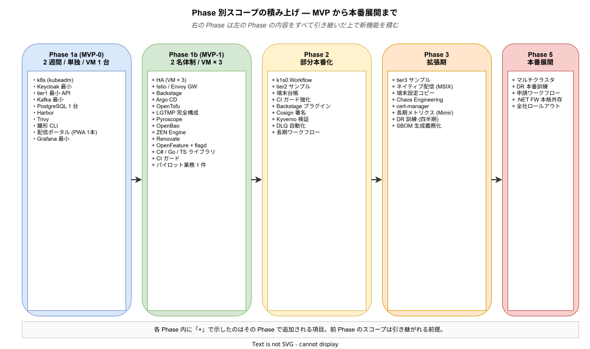

# 09. スコープ

本章では、k1s0 プロジェクトの **「何を作るか」「何を作らないか」** を明確に線引きする。本章で定めた境界の外側は「将来的に検討する可能性はあるが、本バージョンの要件定義書では扱わない」。

スコープ定義で最も重要なのは「OUT」を明示することである。IN の一覧だけを書くと「書かれていない = 対応するかもしれない」と解釈される余地が残り、後段で「当然あると思っていた」「それは対象外だと伝えたはず」という期待値ズレが発生する。本章では IN / OUT / CON (条件付き) の 3 区分に加え、Phase ごとに「この時点で何が使える / 使えないか」を明確にしてあり、スコープ外の項目については「なぜ対象外としたか」「どこに委ねているか」を必ず一言添える設計にしている。

図は 5 つの Phase が右へ進むほどスコープが積み上がる様子を可視化している。各列の「+」で始まる項目はその Phase で追加されるもので、前の Phase のスコープは引き継がれる。MVP-0 では意図的に最小構成にとどめ、MVP-1 でようやく HA 構成 / Backstage / Argo CD 等の本格的な運用基盤が入る。Phase 2 以降で業務ワークフローや端末設定コピーといった付加価値機能が順次展開され、Phase 5 で全社ロールアウト相当の構成に到達する。この順序を組み替えたい場合 (例: Phase 2 の機能を MVP-1 に前倒しする) は、必ず予算・人員前提 (ASM-031 / ASM-002) との整合を確認してから判断する。

---

## 1. スコープの表現方法

### 1.1 記載のフォーマット

| 項目 | 内容 |
|---|---|
| **IN (スコープ内)** | 本書の要件として実装・運用を約束する範囲 |
| **OUT (スコープ外)** | 本書の対象外 (将来検討 / 他製品に委ねる / 明確に対応しないもの) |
| **CON (条件付き)** | 条件を満たした場合にのみ対応する |

### 1.2 Phase 別の整理

本書は Phase 1 (MVP-0 + MVP-1) を主対象とする。Phase 2 以降は参考として方針のみ示す。

---

## 2. 機能スコープ

機能スコープは Phase 進行に沿って段階的に広がる。MVP-0 は「決裁者に見せるためのデモ」、MVP-1 は「パイロット業務を実運用できる最小セット」、Phase 2 以降は「全社展開に耐える品質への引き上げ」という性格を持ち、それぞれが前の Phase を土台にしている。以下 3 小節では各 Phase の IN / OUT を具体化する。

### 2.1 Phase 1a (MVP-0): デモ構成のスコープ

MVP-0 の目的は「決裁者 2〜3 名の前で 15 分のシナリオデモを実演し、追加予算 (Phase 1b 分 2〜3 人月) の承認を得ること」である。よって IN は「デモに不可欠な最小セット」に絞り、OUT は「デモでは見せる必要がなく、かつ MVP-1 で導入した方が技術的に素直なもの」を集めている。HA や GitOps は「デモでは価値が伝わらないのに工数は重い」という典型で、MVP-0 に入れると「デモは映えないのに開発が間に合わない」という最悪のパターンになる。

| 項目 | IN/OUT | この Phase に置いた理由 | 崩すと何が起きるか |
|---|---|---|---|
| Kubernetes (kubeadm, VM 1 台) | IN | 全 OSS の土台。これ無しにはデモが 1 行も動かない | デモ環境そのものが立たない |
| Keycloak SSO (最小構成) | IN | デモシナリオの冒頭「SSO で配信ポータルにログイン」が成立しない | 認証の説明に 5 分取られデモが時間切れ |
| tier1 Go ファサード (6 機能最小実装) | IN | 「Dapr を隠す」というコンセプト実証の核。ADR-0005 の成否を示す部分 | 「結局 Dapr が露出してる」と指摘され意思決定が揺らぐ |
| Dapr サイドカー | IN | tier1 の裏側として必須。単体では見せないがファサード動作に不可欠 | tier1 が空箱になる |
| Kafka (Strimzi) 最小構成 | IN | PubSub デモ (配信通知) で使用。Strimzi は Operator 化されており導入工数が 1 日程度 | PubSub デモができない |
| PostgreSQL (CloudNativePG 単一ノード) | IN | State ストアと配信ポータルのバックエンド。HA 無しなら 1 日で立つ | データ永続化のデモが不可 |
| Valkey | IN | キャッシュ層。Redis BSL 回避の実証も兼ねる (CON-002 根拠) | キャッシュ戦略の説明が抽象論に留まる |
| Harbor + Trivy | IN | コンテナ配信基盤。Trivy は「脆弱性対応していること」を示す最小装置 | 脆弱性対応方針の説得材料を失う |
| 雛形生成 CLI (Go / C#) | IN | tier2 開発者体験のデモ (2 分でサービスが立ち上がる) | 「tier1 を使うとどう楽になるか」が伝わらない |
| 配信ポータルデモ版 (PWA 1 本) | IN | エンドユーザー向け UX の唯一の可視化。BR-030 (3 クリック) の実証 | 業務側決裁者に価値が伝わらない |
| 最小 Grafana ダッシュボード | IN | 観測性の入口。LGTMP 完全構成は MVP-1 で | 「動いていることの証拠」が出せない |
| HA 構成 / Backstage / Argo CD / OpenTofu | OUT | HA は VM 3 台必要で環境調達が間に合わない。Backstage/Argo CD/OpenTofu は導入 10〜15 人日規模で MVP-0 の 2 週間には収まらない | MVP-0 期間が 2 週間 → 5 週間に膨張し、意思決定が 1 四半期遅れる |
| 業務ワークフロー (ZEN Engine) | OUT | 決定表のデモは「配信ポータルの配布対象判定」で代替可能。フル実装は MVP-1 | MVP-0 の守備範囲が広がり、tier1 コア実装の品質が落ちる |
| 端末設定コピー / 台帳管理 | OUT | Phase 3 機能で、MVP では不要な付加価値。端末周りは Intune 連携も要るため別 Phase | MVP の責務が曖昧になり「何を作っているか」が説明不能になる |
| Chaos Engineering / SLO 自動算出 | OUT | HA 構成が無いと意味が無い (落とすべきレプリカが無い) | 投資対効果が負になる |

### 2.2 Phase 1b (MVP-1): パイロット運用のスコープ

MVP-1 の目的は「情シス内 1 業務を 1 ヶ月本番相当で運用し、SLO・監査ログ・運用手順が機能することを示すこと」である。したがって IN は「パイロット業務を 1 件回すために欠かせないもの」、OUT は「パイロット 1 件では過剰 or 工数対効果が薄いもの」に分けている。判断軸は「この機能が無いと、パイロット運用の最中に事故るか？」— YES なら IN、NO なら Phase 2 以降。

| 項目 | IN/OUT | この Phase に置いた理由 | 崩すと何が起きるか |
|---|---|---|---|
| HA 構成 (VM × 3) | IN | 本番相当運用には単一障害点の排除が必須。NFR-031 (単一ノード障害で業務停止しない) の実装 | パイロット中に 1 台障害で業務停止 → 信頼失墜 |
| Istio (mTLS) | IN | サービス間通信暗号化。監査 / 社内ポリシー要件 (NFR-041) | 監査に「通信平文」を指摘されパイロット中止 |
| Envoy Gateway | IN | 外部入口の TLS 終端 / ルーティング。Istio Ingress Gateway より新しく軽量 | 外部公開の統制が取れず野良 Ingress が乱立 |
| Backstage | IN | tier2/3 開発者の入口 (Software Catalog)。DEV オンボーディング時間 (BR-010 関連) の要 | 新参加メンバーの立ち上げが 1 週間以上かかる |
| Argo CD (GitOps) | IN | 手動 kubectl apply での運用は監査ログが切れる。パイロット開始前に整備必須 | 変更経路が「誰が何をいつ」で追えず J-SOX 非対応 |
| OpenTofu (IaC) | IN | VM × 3 の再現性確保。Terraform BSL 回避の実装 (CON-002) | 障害復旧で手順再現に失敗 |
| LGTMP 完全構成 | IN | SLO 測定・インシデント調査の土台。Phase 1a の Grafana だけでは運用不可 | パイロット中のインシデントが「原因不明」で終わる |
| Pyroscope | IN | tier1 Go ファサードの CPU / メモリ特性を初期段階で握る。後で入れると過去データが無い | 性能劣化の検知が遅れ、Phase 2 で原因特定不能 |
| OpenBao | IN | シークレット平文管理は監査で一発アウト。Vault BSL 回避の実装 (CON-002) | 監査対応で Phase 1b 自体が差し戻し |
| ZEN Engine (`k1s0.Decision`) | IN | 業務ルールの「コードを書かずに変更」実証。tier3 価値の中核 | 「結局コード書くなら k1s0 いらない」論が出る |
| Renovate | IN | 依存更新の自動 PR。手動更新は 30+ OSS 相手に現実的でない | CVE 対応 (NFR-061) の 48〜72h ルールが守れない |
| OpenFeature + flagd | IN | Phase 2 以降の機能フラグ切り替えの下地。基盤のみで運用は軽い | Phase 2 の段階的リリースができない |
| 多言語クライアント (C#/Go/TS) | IN | tier2/3 開発者が tier1 を使うための窓口 | 開発者が Dapr を直接叩き tier1 が形骸化 |
| CI ガード (禁止 import 検知) | IN | Dapr 露出禁止ルール (ADR-0005) の強制。無いと設計が崩壊する | リリース 3 回目で tier2 が Dapr を直接 import しだす |
| パイロット業務 1 件 | IN | 「本番相当運用」の実体。無ければ MVP-1 は技術検証に留まる | 次予算承認の根拠データが出ない |
| `k1s0.Workflow` (Dapr Workflow + Temporal) | OUT | ワークフロー実装は 15〜20 人日。パイロット 1 件は決定表で回せる | MVP-1 期間が 1 四半期延伸 |
| レガシー .NET Framework 共存 (設計のみ IN、実装 OUT) | OUT | 設計検証は必要だが実装は Phase 4。旧環境ごと準備すると環境費が倍 | Phase 2+ で全社展開時に詰まる可能性があるため設計だけ残す |
| 端末設定コピー / 端末台帳 | OUT | 端末管理は Intune / 資産管理連携が必要で別 Phase 相応の工数 | MVP-1 範囲が拡散 |
| マルチクラスタ / DR | OUT | クラスタ 1 つの運用実績なしに DR 設計は不可能 | 実運用データ無しの DR 設計は机上の空論になる |
| Cosign + Kyverno 署名検証 | OUT | Harbor + Trivy で脆弱性は押さえる。署名検証は次の統制強化レイヤ | 過剰装備で運用が破綻するより、段階導入が安全 |
| Chaos Engineering (Litmus) | OUT | HA 構成の「平時動作」が先。カオスはその次 | 「まだ動いてないものを壊す」ことになる |

### 2.3 Phase 2 以降で対応予定の範囲 (参考)

Phase 2 以降は参考位置付けだが、「なぜこの Phase か」の順序には技術的依存関係がある。下表はその依存関係を明示し、前倒し議論が出た際の判断材料を提供する。

| Phase | 追加機能 | この Phase に置く理由 | 前倒し可否 |
|---|---|---|---|
| Phase 2 | `k1s0.Workflow` / tier2 サンプル拡充 / 端末台帳 / CI ガード強化 / Backstage プラグイン / Cosign 署名 | パイロット 1 件の運用実績 (MVP-1) を経て「ワークフローが必要な業務 2 件目」が見える段階。Cosign も tier2 配信実績が出てから | Workflow は MVP-1 内で最低限の雛形なら可。フル実装は不可 |
| Phase 3 | tier3 サンプル / ネイティブ配信 / 端末設定コピー / Chaos Engineering / cert-manager | tier2 が回り始めて初めて tier3 (業務アプリ) の要件が具体化する。端末設定コピーは Intune / SCCM 連携が先 | Chaos は Phase 2 に前倒し可。端末系は Intune 側の準備に依存 |
| Phase 4 | 申請ワークフロー / レガシー .NET Framework 本格共存 | 全社展開前に既存業務の取り込みを行う段階。Workflow (Phase 2) と tier3 (Phase 3) の両方が必要 | 不可 (依存関係が重い) |
| Phase 5 | マルチクラスタ / DR 訓練 / 本番展開 | 単一クラスタで 6〜12 ヶ月以上の安定稼働実績を積んでから拡張するのが業界標準 | 不可 (運用実績の積算が必要) |

---

## 3. 対象ユーザ層のスコープ

### 3.1 IN (想定する利用者)

- 情シス部門 (管理職・実務担当)
- tier1 / tier2 / tier3 開発者
- 運用担当 / SRE
- 要件定義担当 (業務側)
- エンドユーザー (業務担当)
- 監査担当 / コンプライアンス担当

### 3.2 OUT (想定しない利用者)

- **外部顧客向け SaaS の提供先** — k1s0 は社内向けプラットフォームであり、外部顧客に SaaS として提供しない。
- **一般消費者向けアプリの基盤** — B2C アプリは想定外。B2E (社員向け) / B2B (企業間業務) が中心。

---

## 4. 環境スコープ

### 4.1 IN

- オンプレミス (物理サーバ / VMware 上の VM) で動作
- 社内 LAN / 閉域ネットワーク
- Linux (x86_64) サーバ
- クライアントは Windows / macOS / (スマートフォン: PWA のみ)

### 4.2 OUT

- **パブリッククラウド (AWS / Azure / GCP) 前提の機能** — k8s 標準 API の範囲で動けば良く、マネージド k8s (EKS / AKS / GKE) 固有の機能は利用しない。ただし将来的な可搬性は CON-076 で確保する。
- **linux/arm64 対応** — x86_64 のみサポート。Phase 5 以降で再評価。

### 4.3 条件付き対応 (CON)

- **VMware Tanzu / OpenShift 等の商用 k8s ディストリビューション** — 社内に既存導入済みの場合は、整合性確認のうえ対応検討。既定は kubeadm。

---

## 5. セキュリティ / 法令スコープ

### 5.1 IN

- 個人情報保護法対応
- J-SOX (内部統制) 対応
- 監査ログの 365 日保持
- 権限剥奪の 24 時間以内反映
- Istio mTLS による通信暗号化
- 脆弱性スキャン (Trivy)

### 5.2 OUT (本書では扱わない)

- **PCI DSS / HIPAA / GDPR 等の業界・国際規制** — 導入先の業種で必要な場合は個別評価。
- **データマスキング / トークナイゼーション** — Phase 2 以降で個別検討。
- **WAF (Web Application Firewall) の実装** — 社内 WAF 基盤があればそれを活用。k1s0 は WAF 機能を内包しない。
- **EDR / アンチウイルス** — 端末側のセキュリティ製品は情シスの既存ツールに委ねる。

---

## 6. CI/CD / 配信スコープ

### 6.1 IN

- GitHub (または社内 Git) + GitHub Actions
- Argo CD (GitOps)
- Harbor (コンテナレジストリ)
- Renovate (依存更新自動化)
- Trivy (脆弱性スキャン)
- OpenTofu (IaC)
- Kustomize + Helm (マニフェスト管理)

### 6.2 OUT

- **Jenkins / GitLab CI / Tekton 等の代替 CI** — GitHub Actions に一本化。既存組織で利用中の場合は Phase 5 以降で整理。
- **Spinnaker / Flux CD** — Argo CD に一本化。
- **配信ネットワーク (CDN)** — オンプレ完結のため利用しない。

---

## 7. 観測性スコープ

### 7.1 IN

- Loki (ログ集約)
- Grafana (可視化)
- Grafana Tempo (分散トレース)
- Mimir (長期メトリクス, Phase 3 以降)
- Prometheus (メトリクス)
- Pyroscope (連続プロファイリング, Phase 1b)
- OpenTelemetry (送信側標準)

### 7.2 OUT

- **Zabbix / Nagios / Datadog / New Relic 等** — OSS LGTMP スタックで完結。
- **APM 商用製品** — Pyroscope + Tempo で代替。

### 7.3 条件付き対応

- **Zabbix との併存** — 既存運用がある場合、Phase 1b まで並行利用を許容。Phase 2 以降で一本化。

---

## 8. 対応しないもの (明示的スコープ外)

「明示的スコープ外」は本書の中で特に丁寧に扱う。書かれていない項目は「議論の俎上にも載っていない」だけだが、ここに並ぶ項目は「議論したうえで対応しないと決めた」ものである。両者の違いは次工程で大きな意味を持つ — 前者は後から要件追加の余地があるが、後者は要件追加する前に「決定を覆す」ステップが必要になる。

以下は k1s0 の役割外と位置付ける。誤解を避けるため明示する。各項目は「なぜ対象外としたか」「代わりに何に委ねているか」「将来覆す場合に何が必要か」をセットで示す。

| 項目 | 対象外とした理由 | 代わりに委ねる先 / 将来覆す条件 |
|---|---|---|
| ネットワーク機器の管理 | 情シスのネットワーク運用領域で、k1s0 の責務範囲を超える (スコープが数倍に膨らむ) | 既存ネットワークチームの Cisco / Juniper 運用。覆す場合は専門チームとの統合組織変更が前提 |
| メールサーバ / Groupware | Exchange / Microsoft 365 / Google Workspace が既に全社導入済み。重複投資は BR-001 に反する | 既存システム (Exchange / M365)。覆す条件は既存のライセンス切れ + 代替 OSS の成熟 |
| ファイルサーバ (SMB / NFS) | 用途が異なる (業務文書共有)。MinIO はオブジェクトストレージで API が違う | 既存 NAS (NetApp / EMC 等)。k1s0 が扱うのはアプリ間のオブジェクトストレージのみ |
| Active Directory / LDAP の置換 | AD は人事情報・端末認証の中心で、全社置換は組織横断プロジェクトが必要 | Keycloak は IdP として位置付け、既存 AD と OIDC / LDAP フェデレーションで連携 |
| Windows 端末管理 (Intune / SCCM 代替) | OS パッチ管理・BitLocker 等、端末 OS レベルは別製品領域 | Intune / SCCM / 資産管理ツールに委ねる。k1s0 は業務アプリ配信 (PWA / MSIX) に特化 |
| 電子帳簿保存法対応の完全実装 | 電帳法は税法要件でタイムスタンプ局連携等が必要。k1s0 汎用基盤のスコープ外 | 税務対応業務システムに委ねる。k1s0 の監査ログ (NFR-062) は基礎情報として活用可能 |
| 日本語 OCR / 機械学習プラットフォーム | OCR / ML は業務特化ドメインで、基盤共通機能に組み込むと肥大化する | 業務アプリの 1 つとして tier3 に実装する場合は可。基盤としては提供しない |

---

## 9. スコープ変更ルール

プロジェクト進行中にスコープ変更が必要になった場合、以下の手続きで管理する。

1. **起案**: 変更提案を起案者または担当者が作成
2. **影響分析**: 既存要件 (FR / NFR / BR) への影響、および工数・予算・期間への影響を評価
3. **承認**: 情シス管理職 + 関連ステークホルダーの合意
4. **本書の改版**: 該当セクションを更新し、版番号を上げる
5. **変更履歴に記載**: `README.md` の版管理に記録

MVP-0 / MVP-1 の期間中はスコープ追加に慎重であるべき。新機能は原則として Phase 2 以降に倒す。

---

## 10. スコープ内外の 1 枚サマリ

以下は本章全体を 1 枚に圧縮した対照表である。各行の OUT 側には「なぜその領域で先送り / 対象外としているか」を明記し、読み手が「後で要求を追加する場合に何が必要か」を判断できるようにしている。

| 領域 | IN (Phase 1b まで) | OUT (Phase 2+ または対象外) | OUT とした根拠 |
|---|---|---|---|
| 認証 | Keycloak OIDC SSO / RBAC | 生体認証 / IC カード | 端末ハードウェア依存。Intune / SCCM 連携前提で別 Phase |
| 通信 | Istio mTLS / Envoy Gateway | 独自プロトコル | 業界標準 (HTTP/2, gRPC) で要件充足。独自化は監査・学習コスト増 |
| データ | PostgreSQL / Valkey / Kafka / MinIO | Oracle / SQL Server | 商用 DB は BR-001 (OSS 優先 / ベンダーロックイン回避) に反する |
| 観測性 | LGTMP + Pyroscope | Datadog / Zabbix 一本化は先送り | 既存 Zabbix 運用との並行期間が必要。Phase 2 で段階移行 |
| CI/CD | GHA + Argo CD + Harbor + Renovate | Jenkins / GitLab CI | 一本化による運用負荷削減。既存組織利用時は Phase 5 以降で整理 |
| 開発者体験 | Backstage + 雛形 CLI + TechDocs | IDE 統合プラグイン (Phase 2+) | Backstage ベースで 8 割要件充足。IDE は開発者毎の好み差が大きく後回し |
| エンドユーザー体験 | 配信ポータル (最小版 → 完全版) | 端末設定コピー (Phase 3) | 端末 OS 管理 (Intune) との連携設計が先。MVP では PC 配布フロー自体が成立 |
| 業務ロジック | tier2 サンプル + ZEN Engine 決定表 | 本格ワークフロー (Phase 2+) | Workflow は Temporal 導入 15〜20 人日。パイロット 1 件は決定表で十分 |
| レガシー共存 | 設計のみ | 実装 (Phase 4+) | 旧 .NET Framework 環境の準備に環境費が倍かかる。実案件到来時に実装 |
| 災害復旧 | バックアップ / リストアの基本 | マルチクラスタ DR (Phase 5+) | 単一クラスタの安定稼働実績 6〜12 ヶ月が DR 設計の前提 |
| 端末管理 | — | Intune / SCCM 代替 (対象外) | 端末 OS パッチ・BitLocker は別製品領域。既存情シスツールに委ねる |
| 規制対応 | 個人情報保護法 / J-SOX | PCI DSS / HIPAA / GDPR (対象外) | 業種依存で全社共通化できない。適用業種ごとに個別評価 |

---

## 関連ドキュメント

- [`05_機能要件.md`](./05_機能要件.md) — IN となる機能の詳細
- [`06_非機能要件.md`](./06_非機能要件.md) — IN となる非機能要件の詳細
- [`../01_企画/07_ロードマップと体制/00_フェーズ計画.md`](../01_企画/07_ロードマップと体制/00_フェーズ計画.md) — Phase 別のスコープ計画
- [`../01_企画/07_ロードマップと体制/01_MVPスコープ.md`](../01_企画/07_ロードマップと体制/01_MVPスコープ.md) — MVP-0 / MVP-1 の詳細スコープ
