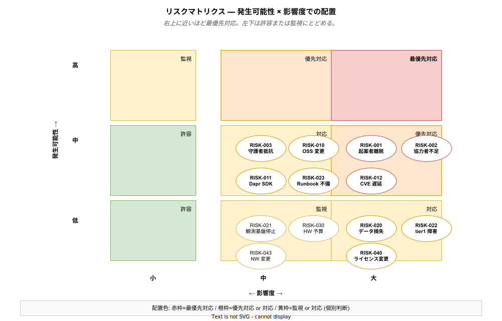

# 10. リスクと対応 (RISK-xxx)

本章では、k1s0 プロジェクトの **主要リスクとその対応方針** を Risk (RISK) として整理する。リスクは「発生したら困ること」であり、前提 ([`08_前提条件.md`](./08_前提条件.md)) が崩れた場合の備えでもある。

リスクは「起きるかどうかわからないが、起きたら何かをしなければならないもの」を、発生可能性と影響度の 2 軸で分類して管理する。本書では各リスクに「予防策 (起きる前にやること)」「軽減策 (起きてしまった時の被害を小さくすること)」「検知方法 (早期に気づくためのモニタリング)」の 3 点をセットで記載する。予防と軽減は別物で、両方を用意しておかないと「予防したけど失敗した時」に打つ手がない状態になる。



マトリクス上に配置することで「どのリスクに予算・時間を優先的に割くか」の判断が視覚的に可能になる。右上 (発生可能性=中〜高 × 影響度=大) に位置する RISK-001 (起案者離脱)・RISK-002 (協力者獲得失敗)・RISK-012 (CVE 対応遅延) は最優先対応リスクで、予防策への投資がここに集中する。中央帯の「対応」ゾーンは発生したら対処するが事前の過剰投資は避ける領域、左下の「許容 / 監視」ゾーンは起きても受け入れるまたは監視のみにとどめる領域である。本章の各リスクはこのマトリクス上の位置を前提に、対応の厚みが決められている。

---

## 1. リスク管理の読み方

### 1.1 フォーマット

```
### RISK-xxx: (リスク名)

| 項目 | 内容 |
|---|---|
| カテゴリ | 組織 / 技術 / 予算 / 外部 / 法令 |
| 発生可能性 | 高 / 中 / 低 |
| 影響度 | 大 / 中 / 小 |
| リスク値 | 可能性 × 影響度 |
| 予防策 | 発生を未然に防ぐ施策 |
| 軽減策 | 発生時の影響を抑える施策 |
| 検知方法 | 早期発見のためのモニタリング |
| 関連 ASM | 崩れると本リスクが顕在化する前提 |
```

### 1.2 リスク値の目安

| 可能性＼影響度 | 大 | 中 | 小 |
|---|---|---|---|
| 高 | 最優先対応 | 優先対応 | 監視 |
| 中 | 優先対応 | 対応 | 許容 |
| 低 | 対応 | 監視 | 許容 |

### 1.3 ID 体系

| ID 範囲 | カテゴリ |
|---|---|
| RISK-001 ～ RISK-009 | 組織・人員リスク |
| RISK-010 ～ RISK-019 | 技術リスク |
| RISK-020 ～ RISK-029 | 運用リスク |
| RISK-030 ～ RISK-039 | 予算・経営リスク |
| RISK-040 ～ RISK-049 | 外部・法令リスク |

---

## 2. 組織・人員リスク (RISK-001 ～ RISK-009)

組織・人員リスクは、技術リスクと違って「設計で完全には解決できない」という性質を持つ。バス係数 1 問題 (RISK-001) は MVP を 2 段階に分けて協力者獲得フェーズを構造的に挿入することで対処するが、それでも協力者が見つからないリスク (RISK-002) が残る。守護者タイプの抵抗 (RISK-003) や決裁者の態度変化 (RISK-004) は純粋な対話とコミュニケーションの領域で、「数値で示せる成果を定期的に提示する」ことが唯一の継続的な緩和策となる。

### RISK-001: 起案者離脱 (バス係数 1 問題)

**カテゴリ: 組織 / 可能性: 中 / 影響度: 大 / リスク値: 最優先対応 / 関連 ASM-001・ASM-002**

起案者 1 名が Phase 1a を走らせる構造のため、退職 / 異動 / 病気 / 別プロジェクト緊急アサインのいずれかで起案者が 2 週間以上離脱すると、プロジェクトが完全停止する。この「バス係数 1」という状態は設計上の欠陥ではなく、JTC 情シスの人員事情から発生する構造的制約である。一度発生すれば、その後の人員追加や引き継ぎには数か月単位の期間が必要で、Phase 計画全体が破綻する。過去の社内システム開発では、個人プロジェクトが起案者離脱で凍結され、数年後に別チームが再起案するまで事実上の空白期間が発生した事例が珍しくない。

予防策:
- MVP を 2 段階に分割し (MVP-0 → MVP-1)、MVP-0 後に協力者を獲得する構造を最初から計画に組み込む (ASM-002 に反映)
- MVP-0 期間中に TechDocs / ADR / Runbook の骨格を作り、「起案者の頭の中にしかない知識」を極小化する

軽減策:
- TechDocs に実装経緯・設計判断を逐次記録 (1 日の終わりに当日の判断を 1 段落書くルール)
- tier1 コードを公開リポジトリで管理し、Git history から復元可能な状態を保つ
- ADR で技術決定の「なぜ」を保存する

検知方法: 四半期ごとの体制モニタリング / TechDocs 更新頻度 (週 1 回以上が正常値)

---

### RISK-002: 協力者を獲得できない

**カテゴリ: 組織 / 可能性: 中 / 影響度: 大 / リスク値: 最優先対応 / 関連 ASM-002・ASM-003**

MVP-0 デモを成功させても、情シス管理職が「面白いけど人を付ける余裕はない」と判断する可能性がある。JTC 情シスは慢性的に人員不足で、既存業務の優先度が常に新規プロジェクトを上回る。この判断は論理的に正当で、デモの技術的完成度だけでは覆せない。必要なのは「協力者をアサインしないことの経営リスク (属人化継続 / 離脱時の保守不能)」を数値で示し、管理職が稟議に使える形に材料を揃えることである。

予防策:
- MVP-0 デモを「見栄えする 1 画面」に仕立てる。Backstage Software Catalog 画面・Grafana 統合ダッシュボード・1 クリックデプロイのスクリーン録画で「これがあれば日常業務が楽になる」を直感的に伝える
- 社内勉強会 (月 1 回程度) で k8s / OSS 基盤の価値を継続発信し、挑戦者タイプに事前認知を作る

軽減策:
- MVP-1 スコープの縮小 (FR-xxx を MUST → SHOULD に降格させ、1 名体制の継続を許容する)
- 外部技術顧問の採用検討 (月 数万円規模の時間単価契約で、週 2〜4 時間のレビュー相談に限定する形が現実的)

検知方法: MVP-0 デモ後 1 か月以内の協力者確定状況 / 管理職インタビュー

---

### RISK-003: 守護者タイプの強い抵抗

**カテゴリ: 組織 / 可能性: 中 / 影響度: 中 / リスク値: 対応 / 関連 ASM-043**

JTC 情シスには「既存を守る」役割を 10〜20 年担ってきた守護者タイプが必ず存在する。彼らの抵抗は感情的反発ではなく、過去に「新技術を試して失敗し、後始末に数年かかった」経験に根ざしている場合が多い。従って、正面から論破するのではなく「既存を壊さない設計」を行動で示すことで対話の糸口を作る必要がある。

予防策:
- 企画書で「レガシー共存」「強制移行しない」を第一級の価値として訴求する (BR-005 が MUST 扱いであることを強調)
- 既存 .NET Framework 資産のサイドカー共存方針 (FR-080 / FR-081) を早期に明文化

軽減策:
- 守護者タイプと対話する場 (1 時間の個別ヒアリング) を設け、不安を言語化・文書化する
- レガシー共存 (BR-005) を Phase 1b 以前に前倒しして実機デモを作る

検知方法: 企画書レビュー時の反応 / パイロット業務選定段階での反応 (特に「既存を残してほしい」という条件の出現頻度)

---

### RISK-004: 決裁者が反対に転じる

**カテゴリ: 組織 / 可能性: 低 / 影響度: 大 / リスク値: 対応 / 関連 ASM-004**

Phase 0 で承認を得た決裁者が、Phase 1b / Phase 2 の途中で方針転換することがある。理由は様々 — 経営方針変更 / 決裁者交代 / 別案件への予算集中 / 政治的事情。この事態は低頻度だが、発生すると全停止。対策は「数値で見える成果を毎 Phase 提示する」ことに尽きる。

予防策:
- 定期的な進捗報告 (月 1 回、A4 1 枚) で決裁者の認識とのズレを早期検知
- 金銭 (TCO 削減見込み) / 工数 (申請処理時間短縮) / リスク (バス係数解消度) の 3 軸で毎 Phase レビュー

軽減策:
- Phase 単位でスコープを縮小し、「ここまでなら投資価値が実証済み」と言える区切りを作る
- パイロット業務の成果を数値で提示 (従来比 70% 工数削減、など)

検知方法: 四半期レビューでの態度変化 / 報告会で質問内容が「継続承認の確認」から「中止検討」へ変わる兆候

---

## 3. 技術リスク (RISK-010 ～ RISK-019)

技術リスクは「採用した OSS や実装方針が想定通り動かなくなる」系のリスクで、tier1 ファサード (FR-131) が最大の防波堤となる。OSS 破壊的変更 (RISK-010) や Dapr SDK 停滞 (RISK-011) は tier1 内部に影響が閉じ込められ、tier2 / tier3 への波及は API バージョニング (FR-130) で最小化される。セキュリティ脆弱性対応遅延 (RISK-012) だけは最優先対応で、CVE 48 時間以内 (NFR-061) という非交渉ラインを Renovate (FR-141) と Trivy (FR-142) で機械化する。

### RISK-010: 採用 OSS の破壊的変更

**カテゴリ: 技術 / 可能性: 中 / 影響度: 中 / リスク値: 対応 / 関連 ASM-010・ASM-011**

Kubernetes / Istio / Keycloak / Kafka などは年 1〜2 回の Major Bump で API が破壊的に変わる。過去実例として、Istio が 1.15 で VirtualService の挙動を変更、Kubernetes が 1.22 で複数 API を削除、Keycloak が 18→19 で REST API の一部を再設計、といった事態が継続的に発生している。tier1 の ファサード設計 (FR-131) で tier2 / tier3 への波及は防げるが、tier1 自身の改修工数は避けられない。

予防策:
- CNCF Graduated / Incubating 優先 (CON-002) で破壊的変更の頻度・粗さを抑える
- tier1 ファサードで上位層影響を局所化 (FR-131)

軽減策:
- API バージョニング (FR-130) で tier2 / tier3 への影響を最小化、移行期間 6 か月を設定
- tier1 改修が想定を超える場合は、旧バージョン固定で Phase をスキップし次バージョンを待つ

検知方法: Renovate による更新 PR の内容確認 / 四半期ごとの OSS ステータスレビュー

---

### RISK-011: Dapr Go SDK の停滞 / 破壊的変更

**カテゴリ: 技術 / 可能性: 中 / 影響度: 中 / リスク値: 対応 / 関連 ASM-012**

Dapr は Microsoft 主導の CNCF Incubating で、Microsoft が優先度を下げた場合に SDK 開発が停滞するリスクがある。Go SDK は現在安定しているが、2026 年以降の継続性は保証されない。

予防策:
- Dapr ファサード層で内部実装を隠蔽 (FR-131) し、tier2 / tier3 から見えないようにする
- 代替として Dapr REST API 直接呼び出しの経路を設計段階で確保しておく

軽減策: tier1 内部を Rust 自作に置き換え、Dapr 依存を段階的に削減 (既に tier1 内部言語ハイブリッド方針 ADR-0002 で規定)

検知方法: Dapr コミュニティのリリース頻度 / Issue 対応状況を月次確認

---

### RISK-012: セキュリティ脆弱性の緊急対応遅延

**カテゴリ: 技術・運用 / 可能性: 中 / 影響度: 大 / リスク値: 最優先対応 / 関連 ASM-014**

Log4Shell (2021)、Spring4Shell (2022)、OpenSSL 3.0 脆弱性 (2022) などの Critical CVE は継続的に発生する。対応が遅れれば侵入 → 情報漏洩 → 個人情報保護法違反 → 経営責任 の連鎖が始まる。NFR-061 で Critical 48 時間以内を目標にしているが、検知・評価・パッチ適用・デプロイの各ステップで遅延が累積すると達成できない。

予防策:
- Renovate による自動更新 (FR-141) で修正版リリース直後に PR が上がる状態を作る
- Trivy による CI でのスキャン (FR-142) で既知 CVE が本番到達する前にブロック
- CVE 対応 48 時間以内のプロセス化 (NFR-061)

軽減策: パッチが間に合わない場合の一時的なワークアラウンド (NetworkPolicy で該当機能を遮断 / 該当エンドポイントを Envoy で 503 応答)

検知方法: Trivy / Renovate / OSS コミュニティ / JVN (JPCERT)・KEV (CISA) のフィード監視

なお、不正アクセスや情報漏洩等のセキュリティインシデント発生時の対応プロセスは NFR-068 で別途定義しており、封じ込め 1 時間以内・影響範囲特定 24 時間以内・個人情報保護委員会報告 3〜5 日以内の目標を設定している。

---

### RISK-013: tier1 の実装複雑度が想定を超える

**カテゴリ: 技術 / 可能性: 中 / 影響度: 中 / リスク値: 対応**

tier1 は 10 領域 (Auth / Log / Telemetry / State / PubSub / Audit / Decision / Workflow / Service.Invoke / Secrets) を単一 API で抽象化する設計のため、想定外の複雑度が発生しやすい。特に PubSub と Workflow は分散システム特有の冪等性・順序性の問題を内包し、MVP-0 の 2 週間では収まらない可能性がある。

予防策:
- MVP-0 / MVP-1 のスコープを機能数で厳格に制限 (MVP-0 は 6 領域、MVP-1 で 10 領域に拡張)
- Opinionated API (やり方を 1 通りに絞る) で実装分岐を減らす

軽減策: 実装できない API は「未実装」として明示し、tier2 / tier3 に迂回 (Dapr / Kafka 直接呼び出し) させない。迂回を許すと FR-131 の隠蔽が崩れる

検知方法: Phase 内の進捗が 50% を下回った時点で再評価し、スコープを絞る判断を即座に行う。スコープ縮小が事前準備不足 (ASM-004A) と合流した場合、デモ品質の低下を通じて RISK-026 (デモ失敗) に連鎖し、さらに Phase 0 承認不達から RISK-002 (予算・人員確保失敗) に波及するリスクチェーンを認識すること

---

### RISK-014: Rust 習熟度不足

**カテゴリ: 技術 / 可能性: 中 / 影響度: 中 / リスク値: 対応**

tier1 自作領域 (ZEN Engine 統合 / ハッシュチェーン / 性能クリティカル部) は Rust で書く方針だが、JTC 情シスで Rust 経験者は希少。起案者 1 名が Rust を習得しながら実装する場合、学習曲線の分だけ進捗が遅れる。

予防策:
- 自作領域は Rust、ファサードは Go と分離 (CON-003) することで、Rust を要求する範囲を最小化
- 必要に応じて部分的に Go でプロトタイプ後、性能が必要な箇所のみ Rust に書き直す段階的アプローチ

軽減策: Rust 部分の機能を Phase 2 以降に先送りし、Phase 1 は Go 中心で組む

---

### RISK-015: kubeadm クラスタのアップグレード失敗

**カテゴリ: 技術 / 可能性: 中 / 影響度: 大 / リスク値: 優先対応 / 関連 ASM-010**

k1s0 は kubeadm ベースのオンプレ Kubernetes を前提とする (ASM-010)。マネージド Kubernetes (EKS / GKE) と異なり、kubeadm のメジャーバージョンアップグレード (例: 1.30 → 1.31) はコントロールプレーン・ワーカーノードの順次手動アップグレードが必要で、手順ミスや互換性問題でクラスタが起動不能になるリスクがある。Kubernetes は年 3 回のマイナーリリースと N-2 サポートポリシーのため、最大でも約 14 か月以内にアップグレードが必須となる。

予防策:
- Phase 1b で検証環境を構築し、アップグレード手順を事前に検証する
- Ansible Playbook にアップグレード手順を自動化し、手動オペレーションミスを排除する
- アップグレード前に etcd スナップショットと全ノードの VM スナップショットを取得する

軽減策:
- etcd スナップショット + VM スナップショットからの復旧手順を Runbook 化し、リストア訓練を実施する
- アップグレード失敗時はスナップショットからロールバックし、原因究明後に再試行する

検知方法: `kubectl get nodes` のバージョン不一致検知 / アップグレード CronJob の成否監視 / Kubernetes EOL カレンダーの定期確認

---

### RISK-016: 構成ドリフト (GitOps の盲点)

**カテゴリ: 技術 / 可能性: 中 / 影響度: 中 / リスク値: 対応 / 関連 FR-140・NFR-041**

GitOps (FR-140) は「Git を唯一のソース・オブ・トゥルース」とする設計だが、GitOps の監視範囲外で構成が変化する経路が複数存在する。(1) Argo CD が管理しないリソース (CRD の自動生成リソース、Operator が動的に作成する ConfigMap 等) の変更、(2) Helm の `post-install` / `post-upgrade` フック内での動的生成、(3) Keycloak / Kafka の管理 UI 経由での設定変更、(4) kubeadm の直接操作 (`kubeadm init/join` が生成する静的 Pod マニフェスト)。これらの変更は Git に記録されず、「再構築した環境が本番と異なる」状態を生み出す。

予防策:
- GitOps 管理対象リソースの一覧を明示し、管理外リソースの変更手順を ADR で規定する
- Keycloak の設定は Realm Export / Import で Git 管理し、UI 経由の直接変更は Phase 2 以降禁止する
- Kafka のトピック設定は Strimzi の `KafkaTopic` CRD で宣言的に管理する

軽減策: 四半期ごとに「クリーンな環境を Git からのみ再構築し、本番との差分を検出する」ドリフト検知テストを実施する

検知方法: Argo CD の `OutOfSync` ステータスの常時監視 / 四半期ドリフト検知テスト / `kubectl diff` による定期比較

---

## 4. 運用リスク (RISK-020 ～ RISK-029)

運用リスクは「作ったものが運用段階で期待通りに動かない」系で、予防よりも軽減と検知が主戦場になる。データ損失 (RISK-020) はバックアップを取ること自体より「バックアップからリストアできること」を訓練で確認することが本質的な軽減策となる。tier1 障害による tier2 / tier3 全停止 (RISK-022) は、tier1 が全サービスの共通経路になる設計の代償で、グレースフルデグラデーション (NFR-033) を真剣に実装する動機はここにある。

### RISK-020: データ損失 (PostgreSQL / etcd)

**カテゴリ: 運用 / 可能性: 低 / 影響度: 大 / リスク値: 対応**

ストレージ障害やヒューマンエラー (DROP TABLE) でデータ損失が発生する可能性。業務データ損失は直接的な業務影響 (請求取消・再入力) + J-SOX 監査記録の欠損 + 顧客信頼の毀損の三重苦となる。バックアップを取ることより、「バックアップからリストアできること」を実地で確認することが本質的な軽減策。

予防策:
- CloudNativePG の WAL アーカイブで PITR (任意時点復旧) 可能にする
- etcd は 24 時間ごとスナップショット + GitOps による k8s 状態の宣言管理で復旧経路を二重化
- CronJob による自動バックアップ (NFR-071)

軽減策:
- MinIO への多重化保管 (プライマリ MinIO + オフサイトレプリカ)
- リストア訓練 (Phase 3 以降、四半期ごと)。実際に復旧できるかを定期検証する

検知方法: バックアップジョブの成功監視 (失敗で即時アラート) / リストア訓練で RTO が目標値内に収まるか測定

---

### RISK-021: 観測基盤 (Grafana / Loki) の停止で障害対応に支障

**カテゴリ: 運用 / 可能性: 低 / 影響度: 中 / リスク値: 監視**

観測基盤自身が落ちると、他サービスの障害原因が見えず対応が遅延する。ただし障害対応中に観測基盤が同時に落ちる確率は低く、事前対応を過剰に投資するより、代替手段を用意しておく方が費用対効果が高い。

予防策: 観測基盤自体も HA 構成 (Phase 3 以降) / 自己監視を別 Namespace で動かし、観測基盤障害を検知できるようにする

軽減策: `kubectl logs` / `kubectl describe` 等の k8s 標準ツールでの代替対応手順を Runbook 化

---

### RISK-022: tier1 障害による tier2 / tier3 全停止

**カテゴリ: 運用 / 可能性: 低 / 影響度: 大 / リスク値: 対応**

tier1 は全業務アプリの共通経路であるため、tier1 障害は全サービス停止に直結する。tier1 の HA 構成 (最低 2 Pod) を前提にするが、設定ミスや設計ミスで HA が機能しない状態を防ぐ必要がある。この構造的リスクがグレースフルデグラデーション (NFR-033) 投資の最大の動機。

予防策:
- tier1 HA (最低 2 レプリカ)
- PodDisruptionBudget による最低稼働保証 (ローリング更新時の全落ち防止)

軽減策:
- グレースフルデグラデーション (NFR-033) で依存 OSS が落ちても tier1 公開 API が部分機能で応答継続 (JWKS キャッシュ / Audit バッファ)
- Feature Flag で tier1 非依存モードに一時切替 (極端な場合の最終手段)

検知方法: SLO エラーバジェット逸脱アラート / tier1 Pod の Ready 数監視

---

### RISK-023: 運用手順 (Runbook) 不整備による属人化再発

**カテゴリ: 運用 / 可能性: 中 / 影響度: 中 / リスク値: 対応**

Runbook は書かれた時点で陳腐化が始まる。システム変更があるたびに更新しなければ、半年後には現実と乖離して「使えない文書」になる。情シスが従来抱えてきた属人化問題は、多くの場合「文書はあるが古い」という形で現れる。

予防策:
- アラート作成時に Runbook 必須 (FR-120) の CI ルール
- PR チェックリストに「影響する Runbook の更新有無」を含める

軽減策: Runbook 未整備のアラートは発火させない (アラート定義の PR 時点で Runbook 存在チェックを通す)

---

### RISK-024: データベーススキーマのロールバック失敗

**カテゴリ: 運用 / 可能性: 中 / 影響度: 中 / リスク値: 対応**

tier1 API のバージョンアップに伴って PostgreSQL スキーマが変更された場合、GitOps による k8s マニフェストのロールバック (git revert) だけではデータベーススキーマは旧状態に戻らない。スキーマ変更を伴うリリースでロールバックが必要になると、データ損失やサービス停止が発生する。

予防策:
- スキーマ変更は必ず前方互換 (additive-only) で行い、カラム削除・型変更は 2 フェーズに分ける (1. 新カラム追加 + 旧カラム残存、2. 旧カラム削除は次リリースで)
- マイグレーションスクリプトは `up` / `down` の両方を必ず実装し、CI でロールバックテストを走らせる

軽減策: スキーマ変更を含むリリースは Runbook に「ロールバック不可」を明記し、問題発生時は前方修正 (fix-forward) で対応する手順を整備

検知方法: CI でマイグレーションの `down` スクリプト存在チェック / リリースノートにスキーマ変更有無のフラグを必須化

---

### RISK-025: データ移行の困難化 (Phase 3〜5 全社展開時)

**カテゴリ: 運用・技術 / 可能性: 中 / 影響度: 大 / リスク値: 優先対応**

Phase 3〜5 での全社展開時に、既存システム (SQL Server / Oracle DB 等) から PostgreSQL へのデータ移行、既存認証基盤 (AD / LDAP) から Keycloak へのユーザ移行が必要になる。データ量・スキーマの複雑さ・業務停止許容時間の制約から、移行が全社展開の最大のボトルネックになりうる。

予防策:
- Phase 2 で移行ツール・手順の PoC を実施し、移行工数の見積もり精度を上げる
- Keycloak の LDAP / AD フェデレーション機能を Phase 1b で検証し、「段階的移行 (まず認証連携、後にフル移行)」の経路を確保する
- データ移行の対象範囲・優先順位を Phase 2 で業務部門と合意する

軽減策: 全データの一括移行ではなく、業務単位での段階移行 (Phase ごとに 1 部門ずつ) を採用し、リスクを分散する

検知方法: Phase 2 の移行 PoC 結果を基に、Phase 3 開始前に移行計画のフィージビリティをレビュー

---

### RISK-026: Phase 1a デモ失敗による協力者獲得不能

**カテゴリ: 運用・組織 / 可能性: 中 / 影響度: 大 / リスク値: 優先対応 / 関連 RISK-002, ASM-002**

Phase 1a (MVP-0) のデモは協力者獲得 (BR-002) の最大の説得材料であり、デモが「動かない」「何がすごいかわからない」状態で終わると、社内協力者が集まらず Phase 1b 以降の前提 (ASM-002: 2 名体制) が成立しない。JTC では「一度失敗した企画の再起」は非常に困難で、デモの失敗は「このプロジェクトは無理」というレッテル貼りに直結する。RISK-002 (協力者獲得失敗) の最大のトリガーがこのデモ失敗である。

予防策:
- デモシナリオを「ゼロから k8s クラスタ構築 → tier1 API 疎通 → 簡易業務アプリ動作」の 3 ステップに絞り、2 週間で確実に動作する範囲に限定する
- デモ環境は本番想定環境とは別に、確実に動く固定バージョンの環境を保持する
- デモ前にリハーサルを最低 2 回実施し、失敗パターンを洗い出す

軽減策:
- デモ当日に環境トラブルが発生した場合に備え、録画済みデモ動画をバックアップとして用意する
- デモ対象者を一度に多数集めず、少人数 (2〜3 名) に分けて複数回実施し、1 回の失敗の影響を限定する

検知方法: デモ後のアンケート (理解度・興味度) / デモ参加者からの協力申し出の有無を 1 週間以内に追跡

---

### RISK-027: 観測データのストレージ爆発

**カテゴリ: 運用 / 可能性: 中 / 影響度: 大 / リスク値: 対応 / 関連 NFR-044・FR-020・FR-021・FR-022**

ログ (Loki)・メトリクス (Mimir)・トレース (Tempo) の 3 点セットは、サービス数の増加に比例してストレージを消費する。Phase 1 (サービス 5〜10 本) では問題にならないが、Phase 3 (10〜20 サービス) で容量計画なしに運用すると、ディスクフル障害で観測性自体が失われる。観測性の喪失は「障害が起きても原因がわからない」状態を意味し、MTTR の目標 (NFR-033: 15〜30 分) が達成不能になる。

特に危険なのは以下のシナリオである。(1) tier2 開発者がデバッグ目的で `k1s0.Log.Debug` を大量出力し、ログ量が通常の 10 倍に膨張する。(2) メトリクスのカーディナリティ爆発 (ラベルにユーザ ID を入れる等) で Prometheus / Mimir のメモリと時系列数が急増する。(3) トレースのサンプリングレートを 100% に設定したまま本番運用し、Tempo のストレージが数日で枯渇する。

予防策:
- NFR-044 のストレージ容量見積もりを Phase 1b で策定し、四半期ごとに実績と比較する
- `k1s0.Log` のデフォルトレベルを Info に設定し、Debug の有効化は環境変数で制御する (本番 Debug は原則禁止)
- メトリクスのラベルルール (ユーザ ID / IP アドレス等の高カーディナリティ値をラベルに使用しない) を FR-100 の雛形と TechDocs に明記する
- トレースのサンプリングレートを Phase 1 で 10%、Phase 3 以降で 1〜5% に設定する

軽減策:
- Loki / Mimir / Tempo に保持期間を設定し、古いデータを自動削除する (NFR-044 の保持期間に準拠)
- ストレージ使用率 80% でアラートを発報し、90% で自動的にログレベルを Info 以上に強制する緊急措置を用意する

検知方法: Grafana ダッシュボードでストレージ使用量のトレンドを常時監視 / 使用率 80% / 90% のアラート設定

---

## 5. 予算・経営リスク (RISK-030 ～ RISK-039)

予算・経営リスクは、技術リスクと異なり「設計で解決できない」領域にある。Phase ごとに数値化した成果を継続提示することが唯一の緩和策で、失敗すると承認パスが切れて計画全体が停止する。

### RISK-030: MVP-1 ハードウェア予算が承認されない

**カテゴリ: 予算 / 可能性: 低 / 影響度: 中 / リスク値: 監視 / 関連 ASM-031**

MVP-1 の 16 vCPU × 3 台は、既存仮想基盤に余剰があれば追加予算ゼロだが、余剰がない場合は調達が必要になる。JTC の予算プロセスで追加予算を得るには四半期単位の計画が必要で、タイミングを外すと次期予算 (3〜6 か月後) まで待つ。

予防策: MVP-0 で TCO 削減効果を数値で提示 / 既存機材流用の可能性を事前調査

軽減策: MVP-1 を 1 台構成で縮小開始 (HA はなし)。HA 検証は Phase 2 以降に後ろ倒し

---

### RISK-031: Phase 2 以降の人員拡張が承認されない

**カテゴリ: 予算・組織 / 可能性: 中 / 影響度: 中 / リスク値: 対応**

Phase 2 以降で 2〜3 名体制を維持する承認が得られないリスク。JTC では人員増が最も通りにくい稟議で、「現状 2 名で回っているなら続けられるはず」という論理が常に反論として出る。これを防ぐには「2 名では Phase 3 以降のスコープを完遂できない」ことを運用負荷の数値で示す必要がある。

予防策:
- 各 Phase で業務価値を数値で示す (年間 数千時間の申請処理工数削減、など)
- 運用負荷を段階的に削減し、人員追加の必然性を実証 (「これ以上のスコープは現体制では吸収できない」)

軽減策: Phase 2 以降のスコープを大幅削減 / 外部ベンダー部分委託 (ただし CON-033 の稟議コストと対比して判断)

---

### RISK-032: TCO 予測が実績と乖離する

**カテゴリ: 予算 / 可能性: 中 / 影響度: 中 / リスク値: 対応**

Phase 0 で提示した TCO 削減見込みが、実績と大きく乖離する可能性。特に運用工数の見積は実運用が始まるまで精度が低い。乖離が大きいと決裁者の信頼を失い、Phase 3 以降の承認に影響する。

予防策: Phase 0 で試算の根拠を ADR として添付 / 四半期ごとに実績との乖離を確認し、早期に軌道修正

軽減策: 商用製品への移行案を並行評価可能な状態を保つ (乖離が大きい場合に「このまま OSS 継続 or 商用移行」の選択肢を提示できるようにする)

---

## 6. 外部・法令リスク (RISK-040 ～ RISK-049)

外部・法令リスクは、プロジェクト自身ではコントロールできない外部要因によって発生する。OSS ライセンス変更 (RISK-040) は Terraform → OpenTofu、Redis → Valkey という実例があり、低頻度だが発生すると対応範囲が大きい。単一企業管理の OSS を採用する際は、代替品を事前に評価しておくことが唯一の実効的な予防策となる。社内ネットワークポリシー変更 (RISK-043) は情シスの別チーム決定により突然発生する可能性があり、社内プロキシ / ミラーレジストリの整備を MVP-1 までに完了させる計画で備える。

### RISK-040: 採用 OSS のライセンス変更

**カテゴリ: 外部・ライセンス / 可能性: 低 / 影響度: 大 / リスク値: 対応**

単一企業所有の OSS は、経営判断で突然ライセンス変更される。実例 — HashiCorp Terraform が 2023 年 BSL 移行 → OpenTofu fork 誕生、Redis が 2024 年 SSPL+RSAL 移行 → Valkey fork 誕生、MongoDB が 2018 年 SSPL 移行、Elasticsearch が 2021 年 SSPL 移行。低頻度だが発生すると BR-001 (ライセンス費ゼロ) が崩壊する。k1s0 では単一企業所有 OSS の採用時に代替候補を事前評価してある (ADR 記録) ため、切替経路は確保されている。

予防策:
- CNCF / LF 管理 OSS を優先 (複数企業合意が必要なためライセンス変更が起きにくい)
- 単一企業所有の OSS は代替候補を事前評価し、ADR に記録

軽減策:
- 該当 OSS を代替品 (OpenTofu / Valkey 等の community fork) に置換
- ライセンス変更前のバージョンに固定し、自前 fork を準備

検知方法: OSS コミュニティの議論 / PR 監視 / 主要 CNCF プロジェクトの GitHub Discussions

---

### RISK-041: 採用 OSS の企業買収 / 撤退

**カテゴリ: 外部 / 可能性: 低 / 影響度: 中 / リスク値: 監視**

VMware が Broadcom に買収された 2023 年以降、Tanzu / vSphere のライセンス体系が 3〜10 倍に変更された事例。CNCF 中立管理の OSS はこのリスクが低いが、単一企業所有の補助 OSS が買収される可能性はある。

予防策: CNCF 中立管理を優先 / 補助 OSS は代替可能性を常に確保

軽減策: tier1 ファサード層で影響を局所化 (FR-131 の設計効果)

---

### RISK-042: 法令改正による対応必須機能の追加

**カテゴリ: 法令 / 可能性: 低 / 影響度: 中 / リスク値: 対応**

個人情報保護法や J-SOX 関連法令が改正され、新規機能 (例: データ可搬権、アクセス権申請フロー) が必須化される可能性。低頻度だが、法令遵守のため優先度 MUST 扱いで対応する必要がある。

予防策: 法令動向を監査担当と連携して監視 / 柔軟な RBAC・監査ログ設計で追加要件に耐えられるようにする

軽減策: 該当機能を優先度 MUST として要件追加し、他の SHOULD / COULD を先送り

---

### RISK-043: 社内ネットワークポリシー変更による外部 OSS 取得停止

**カテゴリ: 外部・環境 / 可能性: 低 / 影響度: 中 / リスク値: 監視 / 関連 ASM-022**

JTC 情シスのセキュリティポリシー変更 (別チーム決定) で、Docker Hub / GitHub / Helm Chart 外部取得が突然停止する可能性。インシデント後のリアクション、グループ全体ポリシー変更などが契機になる。

予防策: 社内プロキシ / ミラーレジストリの整備を Phase 1b までに完了

軽減策: Harbor の replication 機能で外部レジストリをミラー化済の状態を保ち、外部接続遮断後も継続運用可能にする

---

### RISK-044: GitHub / GitHub Actions の利用制限・障害

**カテゴリ: 外部・環境 / 可能性: 低 / 影響度: 中 / リスク値: 監視 / 関連 ASM-025**

k1s0 の CI/CD パイプラインは GitHub Actions に依存し (ASM-025)、ソースコード管理も GitHub で行う。GitHub の大規模障害 (年数回発生実績あり) や、社内セキュリティポリシー変更による外部 SaaS 利用制限が発生すると、開発・デプロイの両方が停止する。特に Phase 1a は起案者 1 名体制のため、CI/CD 停止が直接的に開発停止を意味する。

予防策:
- GitOps で Argo CD がクラスタ内の Git リポジトリ (またはキャッシュ) からデプロイできる構成にし、GitHub 障害時もデプロイ経路を維持する
- GitHub Actions のワークフローは Self-hosted Runner (社内) で実行し、外部接続依存を減らす
- コンテナイメージは Harbor にプッシュ済のものからデプロイするため、ビルド済イメージのデプロイは GitHub 非依存

軽減策:
- GitHub 障害時は手動 `kubectl apply` による緊急デプロイ手順を Runbook 化
- 長期的な GitHub 利用制限が発生した場合は Gitea (セルフホスト Git) への移行パスを Phase 2 で検証

検知方法: GitHub Status API の監視 / CI パイプライン実行時間の異常検知 / GitHub Actions の失敗率監視

---

## 7. リスクのサマリ

リスクの優先度は「発生可能性 × 影響度」で決まり、右上のマトリクスに位置するものほど予防策への投資を厚くする。特に最優先対応 3 件は、1 件でも顕在化するとプロジェクト全体が停止または重大遅延となるため、月次レビューで状況を継続確認する必要がある。

**最優先対応リスク** (可能性 × 影響度が最も大きい):

| ID | リスク | 優先対応の理由 | 顕在化時の影響規模 |
|---|---|---|---|
| RISK-001 | 起案者離脱 (バス係数 1) | MVP-0 単独スタートの構造的欠陥 | プロジェクト全停止。再起動まで数か月〜年単位 |
| RISK-002 | 協力者獲得失敗 | MVP-1 以降の前提 (ASM-002) が崩れる | バス係数 1 継続、Phase 3 全社展開の稟議が通らない |
| RISK-012 | 脆弱性対応遅延 | 法令・経営両面の影響 | 情報漏洩で数千万〜数億円規模の補償、有価証券報告書への重要な不備記載 |

**優先対応リスク** (可能性と影響度のどちらかが中以上):

| ID | リスク | 主な影響 |
|---|---|---|
| RISK-003 | 守護者タイプの強い抵抗 | パイロット業務選定難航、レガシー共存前倒し |
| RISK-010 | OSS 破壊的変更 | tier1 改修 2〜4 週間追加工数 |
| RISK-011 | Dapr Go SDK 停滞 | tier1 Dapr ファサード差し替え検討 |
| RISK-015 | kubeadm クラスタアップグレード失敗 | クラスタ起動不能、全サービス停止 |
| RISK-016 | 構成ドリフト (GitOps 盲点) | Git からの再構築と本番が乖離、復旧時に不一致発生 |
| RISK-020 | データ損失 | 業務データ損失 + J-SOX 監査記録欠損 |
| RISK-022 | tier1 障害の広域影響 | 全業務アプリ同時停止 |
| RISK-024 | DB スキーマロールバック失敗 | ロールバック不能で長時間停止 |
| RISK-025 | 全社展開時のデータ移行困難 | Phase 3〜5 の最大ボトルネック化 |
| RISK-026 | Phase 1a デモ失敗 | 協力者獲得不能、プロジェクト存続危機 |
| RISK-027 | 観測データのストレージ爆発 | 観測性喪失、障害時の原因特定不能、MTTR 目標達成不可 |
| RISK-031 | 人員拡張承認失敗 | Phase 2 以降スコープ大幅縮小 |
| RISK-040 | OSS ライセンス変更 | 代替品への切替工数 2〜4 週間、BR-001 の説得力低下 |
| RISK-044 | GitHub / GitHub Actions 利用制限 | 開発・デプロイ双方停止、Phase 1a で致命的 |

---

## 8. リスク管理プロセス

### 8.1 定例レビュー

| タイミング | 実施内容 |
|---|---|
| 月次 | 最優先リスクのステータス確認 |
| 四半期 | 全リスクの再評価 / 新規リスクの追加 |
| Phase 完了時 | 次 Phase のリスク再評価 |
| インシデント発生時 | 関連リスクの即時見直し |

### 8.2 エスカレーション

リスクが顕在化した場合のエスカレーション先:

| リスク種別 | 初動 | 1 次エスカレーション | 最終判断 |
|---|---|---|---|
| 技術リスク | tier1 開発者 | システム基盤チームリーダー | 情シス管理職 |
| 運用リスク | 運用担当 | 運用チームリーダー | 情シス管理職 |
| 予算・経営リスク | 情シス管理職 | 経営層 | 経営層 |
| 法令リスク | 監査担当 | 情シス管理職 / 法務 | 経営層 |

---

## 関連ドキュメント

- [`08_前提条件.md`](./08_前提条件.md) — 前提が崩れた場合の主要リスクの一覧
- [`../01_企画/企画書.md`](../01_企画/企画書.md) — 企画書 14 章「リスクと対処 (Build vs Buy)」
- [`../01_企画/01_背景と目的/03_新技術導入リスクへの回答.md`](../01_企画/01_背景と目的/03_新技術導入リスクへの回答.md) — 新技術導入の懸念への回答
- [`../01_企画/02_アーキテクチャ/05_障害復旧とバックアップ.md`](../01_企画/02_アーキテクチャ/05_障害復旧とバックアップ.md) — 運用リスクの設計的対応
