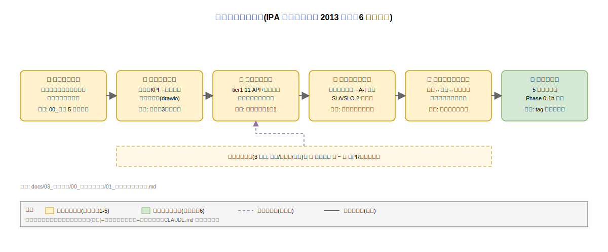

# 要件定義プロセス

本書は、k1s0 要件定義フェーズの進め方を定義する。IPA「共通フレーム 2013（SLCP-JCF2013）」の要件定義プロセス（アクティビティ 3.1.2 システム要件定義プロセス、3.2.2 ソフトウェア要件定義プロセス）を骨格に採用し、k1s0 がプラットフォーム製品であることによる読み替えを明記する。

## なぜプロセス定義が必要か

JTC 情シスの基盤刷新は、稟議通過までのリードタイムが長く、稟議の場で「要件が曖昧」「数値根拠がない」「検収条件が不明」と指摘されると、再レビューに数週間を要する。現行の企画書では 5 年 TCO と事業目的が提示済みだが、どの機能を Phase 1a までに提供し、どの非機能水準で検収するかが固まっていない状態である。

要件定義プロセスを IPA 共通フレーム 2013 に明示的に準拠させることで、稟議担当者・監査部門・運用部門の三者が共通の読み方で本書を解釈でき、レビューでの発散を防ぐ。また、後続の構想設計・基本設計フェーズで要件の解釈差異が発生した場合、本プロセスの「合意済みスコープ」に立ち返ることで判断を戻せる。プロセスが崩れると、個人の記憶ベースで設計判断が進み、3 年後の保守担当者が仕様根拠を追えなくなる。

## IPA 共通フレーム 2013 との対応

共通フレーム 2013 は、要件定義を「システム要件定義」と「ソフトウェア要件定義」の 2 階層で規定する。k1s0 はプラットフォーム製品であり、業務要件・システム要件・ソフトウェア要件の 3 階層をそれぞれ以下のように読み替える。

- **業務要件（3.1.1 相当）**: JTC 情シスが k1s0 を使って社内業務システムを開発・運用する活動を業務として扱う。10_業務要件/ で記述。
- **システム機能要件（3.1.2 相当）**: tier1 が公開する 11 API と、外部システム連携・情報モデルの要件。20_機能要件/ で記述。
- **非機能要件（3.1.2 非機能品質要件 + 3.2.2 相当）**: IPA 非機能要求グレード 2018 に準拠。30_非機能要件/ で記述。

共通フレーム 2013 のプロセス ID と本書カテゴリの完全対応は [90_付録/01_共通フレーム2013対応表.md](../90_付録/01_共通フレーム2013対応表.md) で追跡する。

## プラットフォーム製品としての読み替え

共通フレーム 2013 が主に想定する業務システムの「利用者 = 業務担当」に対し、k1s0 の一次利用者は **tier2/tier3 開発チーム**（社内アプリ開発者）である。二次利用者として JTC 情シス運用チーム（インシデント対応・キャパ管理・脆弱性対応）、三次利用者としてエンドユーザー（社内業務担当）が位置する。

この読み替えにより、業務要件の主語は「業務担当が k1s0 でどう仕事をするか」ではなく「tier2 開発者が k1s0 API で何時間短縮してアプリを作れるか」「情シス運用者が k1s0 の自己監視で何を知り得るか」となる。読み替えの具体は [10_業務要件/03_利用者と利用シナリオ.md](../10_業務要件/03_利用者と利用シナリオ.md) で展開する。

## プロセスフロー

要件定義フェーズは、以下の 6 ステップで進める。各ステップの成果物と完了基準を散文で定義し、検収判定の曖昧さを排除する。全体像は下図を参照。

**ステップ 1: プロセス準備**。本書とステークホルダー定義、前提と制約、用語集を先に固め、後続のすべての要件記述で使う語彙と判断軸を揃える。完了基準は、00_要件定義方針/ 配下 5 文書のレビュー承認。

**ステップ 2: 業務要件の抽出**。企画書の事業目的・KPI・体制を業務要件へ翻訳する。tier2/tier3 開発者が現状どのような不便を被っており、k1s0 導入後にどう変わるかを散文で展開し、業務フローを drawio で可視化する。完了基準は、利用者シナリオ 3 種（tier2 開発・tier3 配信・運用）が業務フローと対応付いていること。

**ステップ 3: 機能要件の抽出**。業務要件からシステム化範囲を決め、tier1 公開 API 11 件の機能要件と、外部連携・情報要件を記述する。各 API には機能概要・入出力・前提条件・受け入れ基準を含め、構想設計との対応表を必ず添える。完了基準は、構想設計「tier1 公開 API 一覧」全件に対し機能要件 ID が付与されていること。

**ステップ 4: 非機能要件の抽出**。IPA 非機能要求グレード 2018 の 6 大項目について、k1s0 の社会的影響度を踏まえたグレード判定（モデルシステム①〜③相当）を先に実施し、その結果を踏まえた水準で各項目を記述する。企画書の対外約束（SLA 稼働率 99%、API p99 < 500ms）を SLA 系数値、SRE 運用目標（SLO 稼働率 99.9%）を I_SLI_SLO 系数値として 2 層に分離して採番する。完了基準は、グレード判定 1 枚と 6 大項目＋I_SLI_SLO 文書の相互整合性レビュー通過。

**ステップ 5: トレーサビリティの整備**。すべての要件 ID に対し、企画ゴール・構想設計コンポーネントへの双方向リンクを張る。未対応要件（企画ゴールに対し要件が不足）や孤立要件（企画に根拠のない要件）はこの段階で検出し、追加または削除する。完了基準は、要件 ID 索引と 2 種のマトリクス文書が機械的に整合していること（要件 ID が全マトリクスに出現）。

**ステップ 6: 合意と凍結**。ステークホルダー（企画スポンサー、情シス部長、構想設計リード、運用リード、監査担当）のレビューを経て、Phase 0〜1b スコープの要件を凍結する。Phase 2 以降のスコープは参考扱いとし、フェーズ切り替え時に改訂プロセスを回す。完了基準は、凍結版の tag 付与と関係者署名（電子承認）。

## 改訂プロセス

凍結後の要件変更は、以下の 3 類型で取り扱う。類型判定を明示することで、軽微な修正に重い承認プロセスを課さず、逆に重大な変更を軽く扱う事故を防ぐ。

**軽微改訂（字句修正、誤記訂正、出典追加）**。要件の意味を変えない範囲の変更。著者単独で commit し、コミットログに `docs(req): minor - <file>` の prefix を付ける。ステークホルダー通知は不要。

**中規模改訂（数値調整、優先度変更、補助要件追加）**。凍結済み要件の数値を測定結果に基づき更新する、MUST/SHOULD の優先度を昇降する、既存要件を崩さない範囲で補助要件を追加する。PR ベースで構想設計リード + 運用リードの 2 名レビューを必須とする。影響マトリクスを PR 本文に添付し、下流設計への波及を明示する。

**重大改訂（スコープ増減、SLO 数値の外部コミット変更、優先度 MUST ↔ WON'T の反転）**。稟議資料に記載した外部約束に影響する変更。ステークホルダー全員のレビューと企画スポンサーの最終承認を要する。承認後は 80_トレーサビリティ/ 配下のマトリクスを全件再確認し、ADR-0000 台帳に改訂記録を残す。

## レビュー体制と承認権限

本書のレビューは以下 5 ロールで行う。役割の重複を許容するが、同一人物が起案と最終承認を兼ねることは禁ずる。

**企画スポンサー（情シス部長相当）**: 業務要件・機能要件の外部約束に対する最終承認権限を持つ。

**構想設計リード**: 機能要件と構想設計コンポーネントの整合性を担保する。下流設計への実装可能性を判定する。

**運用リード**: 非機能要件の実運用可能性（Runbook 整備、監視、オンコール体制）を判定する。90_付録 のグレード判定を主導する。

**監査担当**: セキュリティ・コンプライアンス要件（NFR-E-PRE-001、NFR-E-RSK-001〜002、NFR-E-AC-001〜005、NFR-E-ENC-001〜003、NFR-E-MON-001〜004、NFR-E-NW-001〜004、NFR-E-AV-001〜002、NFR-E-WEB-001〜002、NFR-E-SIR-001〜003、FR-T1-AUDIT-001〜003）の受入基準を判定する。OSS ライセンス義務・データ主権に関するレビューを担う。

**起案者**: 要件定義書の執筆と改訂作業を主担当する。レビュー指摘への一次応答と、マトリクスの機械的整合確認を行う。

## フェーズと本書のスコープ

本書が対象とするフェーズは Phase 0〜Phase 1b までを厳密スコープ、Phase 2〜Phase 5 は参考スコープとする。企画書ロードマップに記載の Phase 1c（MVP-1b 運用体制化）は Phase 1b に包含されるため厳密スコープで扱う。

厳密スコープでは、全要件に対し MUST/SHOULD/COULD/WON'T の優先度と検収方法を確定させる。参考スコープでは、現時点での方針のみを記載し、フェーズ切り替え時に改訂プロセスを経て厳密スコープへ昇格させる。スコープ境界を曖昧にすると、稟議時点で約束していない要件の実装に工数が吸われ、MVP-1b のパイロット合格が遅延する恐れがある。

## 合意済み記述方針

本書全体に適用する記述方針を以下に定める。これは [../../CLAUDE.md](../../CLAUDE.md) のドキュメント規約を要件定義に特化して具体化したものである。

- 各要件の本体は散文で記述し、「現状の痛み → 要件達成後の世界 → 要件が崩れた時の影響」を段落展開する。
- 表は章末のサマリ（要件 ID 一覧・優先度分布・Phase 達成度）に限定する。
- 優先度セルには判定理由を同居させる。例: 「MUST（稟議通過の前提。未達で Phase 0 承認不可）」。
- 数値セルには根拠を併記する。例: 「p99 < 500ms（業務ロジック 200 + Dapr 80 + OTel 20 + 監査 50 + NW/DB 150）」。
- 図表が必要な章には drawio 図を作成し、SVG を埋め込む。白背景矩形とレイヤ色分けを守る。
- OSS コンポーネント名は初出時に正式名（例: Valkey (Redis 互換フォーク)、OpenBao (HashiCorp Vault MPL 2.0 フォーク)）を書き、以降は略称でよい。
