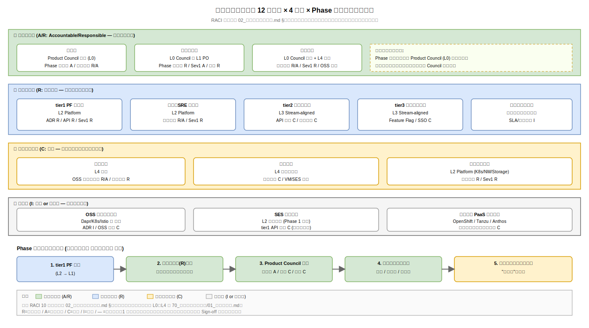

# ステークホルダー定義

本書は、k1s0 要件定義に対して利害関係を持つ組織・役割を網羅的に整理し、各者の関心事と要件合意プロセスへの関与点を定義する。ステークホルダー特定の漏れは、稟議直前の差し戻し、パイロット後の監査指摘、運用開始後の「聞いていない」紛争の主因となる。

## ステークホルダー特定の考え方

k1s0 は情シス部門の基盤であり、単に「情シス部長の承認を得ればよい」製品ではない。基盤として tier2/tier3 のアプリ開発者が日常的に利用し、運用チームが 24 時間監視し、監査部門が年次で点検し、経営層が 5 年 TCO で説明責任を負う。関心の粒度がそれぞれ異なるため、要件定義の各章で「誰の関心にどう応えるか」を事前に割り付けておかないと、レビューで関心外の論点まで巻き戻しが発生する。

本章では、現時点で想定する 12 のステークホルダーを 4 階層（意思決定 / 直接利用 / 支援・監督 / 外部）に分類し、各者の関心事・期待成果・要件定義への関与点を散文で記述する。階層ごとのレビュー順序とエスカレーションパスを明確にすることで、凍結レビューでの意見集約コストを下げる。

## 意思決定層

### 経営層（決裁者）

企画書で 5 年 TCO 3.68 億円、年額 2,349 万円の投資判断をする層である。関心は「稟議で約束した費用対効果が実際に出るか」「競合比（OpenShift 5.32 億円より 31% 安）が保たれるか」「撤退シナリオの退路確保」。要件定義書に対しては、非機能要件のうち可用性 SLO と 5 年 TCO に影響する項目（ライセンス義務、サポート体制）をピンポイントでレビューする。

直接の執筆指示を出す立場ではなく、企画スポンサー（情シス部長）経由で要求が届く。関与点は Phase 0 要件凍結時の最終承認と、中規模・重大改訂時の回付。

### 情シス部長（企画スポンサー）

k1s0 事業の直接推進者。関心は「部門予算と体制で本当に回せるか」「属人化を避けられるか」「.NET Framework 資産を抱えたまま新技術を入れられるか」。要件定義のすべての章に目を通し、特に 10_業務要件 の組織・体制と 30_非機能要件/C_運用保守性 のサポート体制節を精査する。

起案者にとって最大の内部顧客であり、要件の優先度判定で迷った際の仲裁役でもある。関与点は全フェーズのレビューと、重大改訂の承認権限。

### 監査部門（コンプライアンス責任者）

情報セキュリティ監査、内部統制（J-SOX）、個人情報保護法対応、ベンダー管理の責任を持つ。関心は「監査証跡が残るか」「OSS ライセンス義務を逸脱しないか」「秘密管理が説明可能か」「ベンダーロックインの逆側で OSS 撤退リスクを管理できるか」。

要件定義書では 30_非機能要件/E_セキュリティ、10_業務要件 の前提と制約、90_付録/02_非機能要求グレード判定 を集中的に確認する。関与点は Phase 0 凍結レビュー、年次監査時の参照、個人情報保護法令改正時の改訂要請。

## 直接利用層

### tier2 開発チーム（業務アプリ開発者）

JTC の社内業務システム（人事申請、経費精算、見積作成、在庫管理等）を k1s0 API を使って開発する層。従来は .NET Framework で個別に作り込んでいたが、k1s0 導入後は tier1 公開 API（State / PubSub / Workflow / Decision 等）を呼ぶだけでマイクロサービス化の恩恵を受けられる。

関心は「API が使いやすいか」「ドキュメントが整備されているか」「障害時に根本原因を自分で追えるか」「互換破壊による手戻りがないか」。20_機能要件 の tier1 API 仕様と 30_非機能要件/C_運用保守性 の API 互換方針を精読する。関与点は Phase 1b パイロット参加、API 仕様 PR のレビュー、利用フィードバック。

### tier3 アプリチーム（配信ポータル開発者）

エンドユーザー向けのアプリ配信ポータル、社内 UI、MAUI / React / C# アプリを開発する層。k1s0 API に加えて、tier1 が提供する認証統合（Keycloak OIDC）、Feature Flag、PubSub 経由のイベント通知を活用する。

関心は「SSO の手順が標準化されているか」「Feature Flag の切替がダッシュボードでできるか」「クライアント SDK が主要言語で揃うか」。20_機能要件/10_tier1_API要件/12_Feature_API.md（将来追加）と、将来作成される SDK ガイドラインを参照する。関与点は tier2 と同じ。

### tier1 プラットフォームチーム（基盤開発者）

k1s0 基盤そのものを開発・運用する層。Rust 2〜3 名 + Go 2〜3 名（Phase 2 体制）で、Dapr ファサード、自作 Rust サービス（ZEN Engine 統合、監査改ざん防止、PII マスキング）、インフラ自動化を担う。

関心は「実装可能か」「運用コストが合理的か」「人材確保が続くか」「OSS 更新追従が現実的か」。要件定義書の全章を執筆または精読し、特に 20_機能要件 と 30_非機能要件 の工数見積を担う。関与点は起案者の大部分がこの層に属する。

### 運用・SRE チーム（情シス内 SRE）

本番運用、オンコール、インシデント対応、キャパ管理、バックアップ / DR 訓練を担う層。Phase 1c 以降、2〜3 名体制で 8 × 5 オンコールを運用する想定。

関心は「Severity 1 インシデントの MTTR」「Runbook の充足率」「監視基盤自体の監視（Dead Man's Switch）」「オンコール負荷が個人に集中しないか」。30_非機能要件/A_可用性、C_運用保守性 を精読する。関与点は非機能要件の共同執筆と、Runbook 充足率（Phase 1b で 15/15 必達）の検収。

### エンドユーザー（社内業務担当）

tier3 アプリを日常業務で使う社員。関心は「いつものアプリが今日も動くか」「新機能が邪魔をしないか」「個人情報が漏れないか」。

k1s0 そのものを直接操作しないため、要件定義書への直接関与は限定的。ただし 30_非機能要件/A_可用性 の対外 SLA 稼働率 99%（24h 基準、月 7.2 時間以内）、D_移行性 の旧システム切替計画はエンドユーザー体感に直結するため、利用代表者（現場マネージャ）を 1 名以上レビューに含める。

## 支援・監督層

### 法務部門

OSS ライセンス（AGPL 6 本、MPL 2.0 2 本、Apache 2.0 多数）、ベンダー契約、個人情報保護法、下請法（SES 並走時）の解釈責任を持つ。関心は「AGPL の外部境界遮断が技術的に担保されているか」「ベンダー撤退時の再移行コスト」「国外ベンダーのサブプロセッサ条項」。

要件定義書では 10_業務要件 の前提と制約、30_非機能要件/E_セキュリティ、90_付録/02_非機能要求グレード判定 を確認する。関与点は Phase 0 凍結レビューと、新規 OSS 採択時の都度レビュー。

### 調達部門

VM 調達、SES 契約、中途採用、保守契約の実務を担う。関心は「VM 3 台分の調達枠が確保できるか」「Rust 人材 SES の単価相場」「Go 人材中途採用のリードタイム」。

要件定義書では 10_業務要件 の体制、30_非機能要件/F_システム環境・エコロジー の機材設置環境条件を確認する。関与点は Phase 1a 着手前の VM 調達要求の起票、Phase 1b 協力者アサイン時の契約締結。

### インフラ運用（Kubernetes / ネットワーク / ストレージ）

kubeadm HA クラスタ、Istio Ambient、MetalLB、Longhorn 等の基盤 OSS を実運用する層。tier1 プラットフォームチームとは責務境界があり、k8s 以下の面倒を見るのがこの層である。

関心は「VM 台数とスペック」「ネットワーク要件（L2/L3、VLAN、帯域）」「ストレージ IOPS」「バックアップ容量」。30_非機能要件/B_性能拡張性、F_システム環境・エコロジー、A_可用性 を精読する。関与点は非機能要件の共同執筆と、Phase 1a VM 調達要求のレビュー。

## 外部層

### OSS コミュニティ

Dapr、ZEN Engine、OpenBao、Istio、Kubernetes、CloudNativePG、Strimzi、Grafana、Loki、Tempo、Pyroscope、Valkey、flagd、Temporal、Argo CD などの上流コミュニティ。k1s0 は基本的にフォークせずに利用する方針で、機能要望・バグ報告はアップストリームで提起する。

関心は「過度な改変で孤立しないか」「コミュニティの持続性」。要件定義書に直接は登場しないが、30_非機能要件/C_運用保守性 のサポート体制節でコミュニティサポートの位置付けを記述する。関与点は要件定義書の記述には影響しないが、採択 OSS の廃止・フォーク発生時に反映義務が生じる。

### SES ベンダー

Rust 人材並走支援の SES ベンダー。関心は「契約期間」「スキル要件」「受入体制」。要件定義書では 10_業務要件 の組織・ロール節にのみ登場し、直接のレビュー対象ではない。

### 競合商用 PaaS ベンダー（撤退シナリオ対比）

OpenShift / Tanzu / GKE Anthos 等。k1s0 が機能不足・運用破綻した場合の退路先。関心の対象ではないが、要件定義書は「k1s0 を選ぶ理由」を常にこれら商用 PaaS との比較で論証する必要がある。30_非機能要件/C_運用保守性 のベンダー撤退リスク節と、90_付録 で比較エビデンスを保持する。

## 関与点サマリ

本章の記述から抽出したレビュー関与点を、要件定義プロセス（[01_要件定義プロセス.md](01_要件定義プロセス.md)）の 6 ステップに割り付けた一覧を以下に示す。表は本書内で唯一のサマリテーブルであり、ステップ × ステークホルダーのマトリクスとして運用する。

| ステップ | 意思決定層 | 直接利用層 | 支援・監督層 |
|---|---|---|---|
| 1. プロセス準備 | 情シス部長（承認） | tier1 チーム（起案） | — |
| 2. 業務要件抽出 | 情シス部長 | tier2/tier3/運用（全員） | エンドユーザー代表 |
| 3. 機能要件抽出 | 情シス部長 | tier1 チーム（起案）+ tier2/tier3（レビュー） | インフラ運用 |
| 4. 非機能要件抽出 | 情シス部長 + 監査 | 運用 SRE + tier1 | インフラ運用 + 法務 |
| 5. トレーサビリティ整備 | — | tier1 起案者 | — |
| 6. 合意と凍結 | 経営層（最終）+ 情シス部長 + 監査 | 運用 + tier2 代表 | 法務 + 調達 |

## エスカレーションパス

意見が割れた場合のエスカレーション順序を明示する。順序を誤ると「情シス部長が決めたはずが、後から経営層指示で覆る」「監査部門が凍結後に追加要件を持ち込む」といった事故が起きる。

通常の意見相違は起案者 → 構想設計リード → 運用リード の順で調整する。解決しない場合は情シス部長が仲裁する。外部コミット（SLO、TCO、セキュリティ水準）に関わる場合は情シス部長 → 経営層 にエスカレーションする。監査要件のみ、監査部門から情シス部長への直接エスカレーションを許容する。

## ステークホルダー × 体制階層 × RACI 統合マトリクス

本章（要件定義側）の 12 ステークホルダーと [70_プロジェクト管理/01_体制と役割.md](../../70_プロジェクト管理/01_体制と役割.md) の組織階層 L0〜L4・RACI を 1 つのマトリクスに統合する。二重管理で「誰が Sign-off 権限を持つか」が曖昧になる事故を根本から防ぐため、本マトリクスを **単一の真実源（single source of truth）** とし、70_/01_ の RACI 表は本表を章末サマリとして引用する構造に統一する。

階層分類と Phase ゲート承認フローの概観は下図を参照。

### 対応マトリクス

| ステークホルダー（本章）| 体制階層（70_/01_）| Phase ゲート承認 | 新規 ADR | tier1 API 追加 | 本番リリース（通常）| 本番リリース（重大）| Sev1 インシデント | 個人情報取扱い変更 | OSS ライセンス判断 | 予算超過 | レガシー撤退 |
|---|---|---|---|---|---|---|---|---|---|---|---|
| 経営層（決裁者）| L0 Product Council 議長 | **A** | I | I | I | **A** | I | **A** | C | **R/A** | **A** |
| 情シス部長（企画スポンサー）| L0 Product Council 兼 L1 プロダクトオーナー | **R** | C | **A** | I | **R** | **A** | **R** | I | **R** | **R** |
| 監査部門 | L0 Product Council 委員（情報セキュリティ委員長）+ L4 監査 | C | I | I | I | C | I | **R** | **R/A** | I | I |
| tier2 開発チーム | L3 Stream-aligned Team | I | C | C | I | C | I | C | I | I | C |
| tier3 アプリチーム | L3 Stream-aligned Team | I | C | C | I | C | I | C | I | I | C |
| tier1 プラットフォームチーム | L2 Platform Team（tier1 コア + データ基盤）| C | **R** | **R** | **R/A** | **R** | **R** | C | C | I | C |
| 運用・SRE チーム | L2 Platform Team（インフラ / SRE） | C | C | C | **R/A** | **R** | **R** | C | C | I | C |
| エンドユーザー | L3 Stream-aligned Team（代表 1 名）| I | I | I | I | I | I | I | I | I | I |
| 法務部門 | L4 法務 | C | I | I | I | C | I | C | **R/A** | I | I |
| 調達部門 | L4 財務・調達 | C | I | I | I | I | I | I | I | C | I |
| インフラ運用 | L2 Platform Team（インフラ / SRE） | C | C | C | **R** | **R** | **R** | I | I | I | C |
| OSS コミュニティ | 外部（体制外）| — | I（情報共有）| — | — | — | — | — | C（アップストリーム照会）| — | — |
| SES ベンダー | 外部（L2 並走支援、Phase 1 限定）| — | — | C（スキル相談）| — | — | — | — | — | — | — |
| 競合商用 PaaS ベンダー | 外部（撤退シナリオ対比）| — | — | — | — | — | — | — | — | — | C（退路先評価）|

- **R=実行責任 / A=最終責任 / C=相談 / I=共有 / —=関与なし**
- 1 ロールが複数階層に跨る場合（情シス部長 = L0 + L1、監査部門 = L0 + L4）は、本表で同じ行にまとめて Sign-off の一意性を確保する。
- 体制階層の詳細（各層の人数、週次同期、スキルマップ）は [70_プロジェクト管理/01_体制と役割.md](../../70_プロジェクト管理/01_体制と役割.md) を参照。RACI 表は本表を正とし、70_/01_ 側は本表の章末サマリ参照に置き換える。

### Phase ゲート承認フローの一意化

Phase 0/1a/1b/1c/2+ の各ゲート承認は以下の固定順序で進める。順序違反時はゲート未成立とみなす。

1. tier1 プラットフォームチーム（L2）がゲート判定資料を作成 → L1 プロダクトオーナーが取りまとめ
2. L1 プロダクトオーナー → 情シス部長（R）に起案、情シス部長がゲート判定資料を確認
3. 情シス部長が Product Council（L0）を招集、経営層（A）・監査部門（C）・法務（C）が合議
4. Product Council 議事録に「承認 / 条件付き承認 / 差戻し」を記録、L1 → L2 にフィードバック
5. 承認時は [80_トレーサビリティ/02_企画要件マトリクス.md](../../80_トレーサビリティ/02_企画要件マトリクス.md) の該当 Phase 行を「承認済」に更新

監査部門が凍結後に追加要件を持ち込んだ場合、本フローのステップ 3 を再実施する（Product Council 再招集）。情シス部長単独での追加要件受入は禁止とする。
