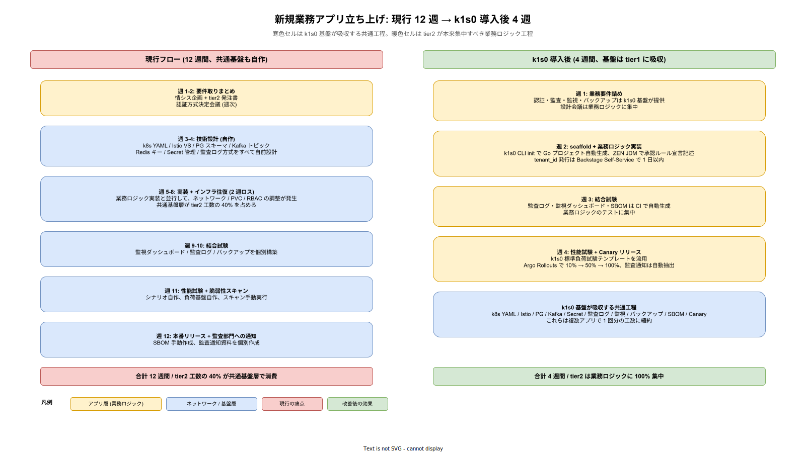
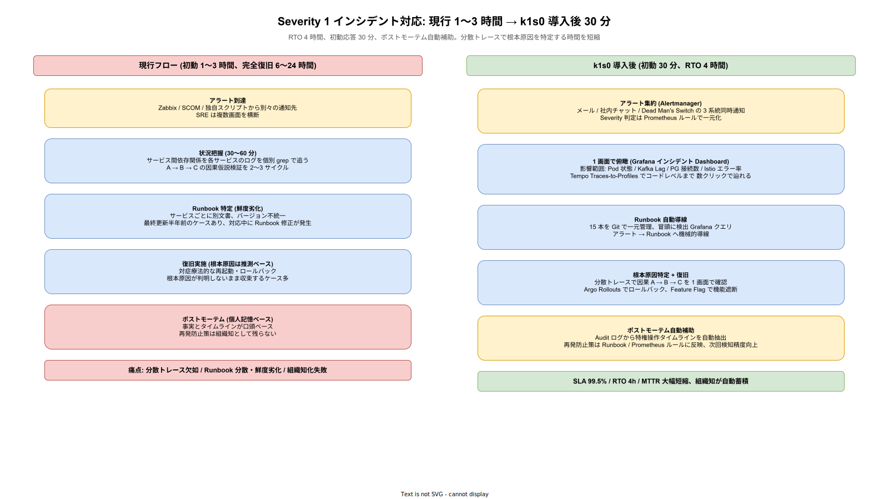
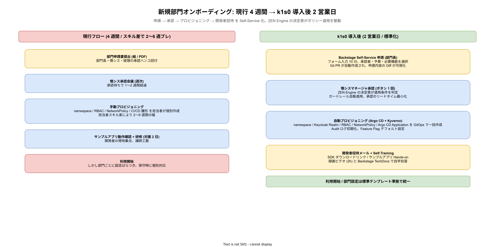
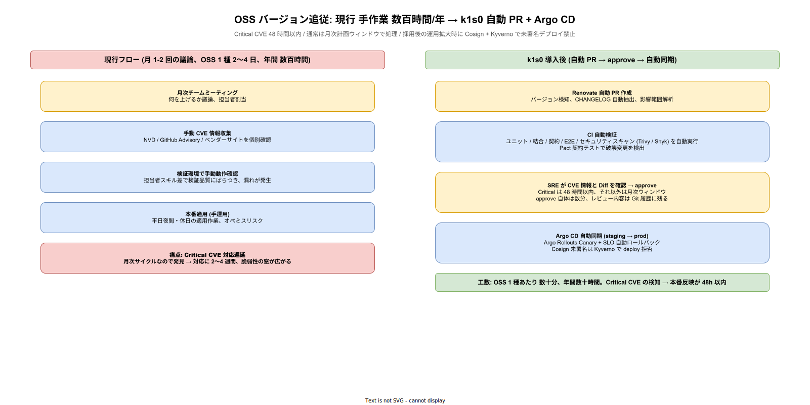

# 業務フロー

本書は、k1s0 が関わる主要業務のフローを散文と drawio 図で記述する。業務フローは現行（k1s0 導入前）と改善後（k1s0 導入後）の 2 バージョンを記述し、どの工程がどれだけ短縮・標準化されるかを可視化する。これにより機能要件の根拠（なぜこの API が必要か）と非機能要件の根拠（なぜこの SLO か）を業務的に説明できる状態をつくる。

## 記述方針

業務フローは「業務の開始 → 終了まで」の時系列で記述する。登場する役割（tier2 開発者、tier3 配信チーム、SRE、マネージャ、エンドユーザー）ごとに、どのタイミングで何を実施するかを散文で展開する。現行フローは「痛みがどこに発生しているか」、改善後フローは「どの工程が k1s0 のどの機能で置き換わるか」を明示する。

図は drawio で作成し、SVG で埋め込む。作図規約は [../../CLAUDE.md](../../CLAUDE.md) と [../../docs/00_format/drawio_layer_convention.md](../../../docs/00_format/drawio_layer_convention.md) に従い、アプリ層は暖色、ネットワーク層は寒色、インフラ層は中性灰、データ層は薄紫で 4 レイヤ分離する。

## 業務フロー 1: 新規業務アプリの立ち上げ

### 現行フロー（k1s0 導入前）

新規経費精算アプリを例に取る。プロジェクト起票から本稼働まで、現行では約 12 週間を要する。

第 1〜2 週は情シス企画が業務要件を取りまとめ、tier2 開発チームへの発注書を作成する。並行して、認証方式（既存 AD / LDAP との統合方式）の決定会議を週 1 回開催する。第 3〜4 週は tier2 が技術設計を作成する。k8s YAML、Istio VirtualService、PostgreSQL スキーマ、Kafka トピック、Redis キー設計、各種 Secret 管理、監査ログ方式を全て自前で設計する。第 5〜8 週は実装とインフラ構築を並行して行うが、インフラ担当との往復（ネットワーク設定、PVC サイズ、RBAC ポリシー）で 2 週間程度のリードタイムロスが発生する。第 9〜10 週は結合試験、第 11 週は性能試験と脆弱性スキャン、第 12 週は本番リリースと監査部門への事前通知。

この現行フローでは、tier2 開発者の工数の 40% が k8s YAML / 監視 / 認証統合 / 監査ログといった共通基盤層の実装に消費される。5 本の業務アプリを並行開発すれば、共通基盤層の実装工数は 5 倍に膨れ、部分的に共通化してもライブラリの互換性維持で別の工数が発生する。

### 改善後フロー（k1s0 導入後）

同じ経費精算アプリの立ち上げを、k1s0 導入後は約 4 週間に短縮する。

第 1 週は情シス企画と tier2 で業務要件を詰める。認証統合、監査、監視、バックアップは k1s0 基盤が提供するため、設計会議は業務ロジックに集中する。第 2 週は tier2 が `k1s0 CLI init` で Go プロジェクトを scaffold し、ZEN Engine の決定表で部門 × 金額による承認者ルールを宣言的に書く。k1s0 公開 API（State / PubSub / Workflow / Decision / Audit / Log / Telemetry）を呼ぶ業務ロジックを実装する。インフラ担当との往復は tenant_id の発行と Backstage へのサービス登録のみで、1 日で完了する。第 3 週は結合試験。監査ログ・監視ダッシュボード・SBOM は CI で自動生成される。第 4 週は性能試験（k1s0 標準負荷試験テンプレートを流用）と本番リリース（Argo Rollouts で Canary 10% → 50% → 100%）。監査部門への事前通知は SBOM・Audit ログ自動抽出で簡略化。

工程短縮の内訳は、共通基盤層の実装工数を tier2 から tier1 に吸い上げることによる。tier1 は複数アプリで同じ基盤を共有するため、5 本の業務アプリが並行開発されても共通基盤層の工数はほぼ一定で済む。

### 崩れた時の影響

改善後フローが期待水準で稼働しない場合、企画書で約束した「業務アプリ立ち上げ 3 か月 → 1 か月」の定量目標が破綻する。典型的な崩壊シナリオは以下 3 系統。

- **k1s0 SDK の使い勝手が悪く tier2 が自前 k8s YAML に逃げる**: tier2 開発者が「k1s0 経由だとデバッグが難しい」「ドキュメントが追いつかない」を理由に、従来の k8s YAML + 個別ライブラリ実装に回帰する。結果、共通基盤層の工数が従来の 40% 水準に戻り、5 本並行開発で 20 人月/年の超過工数が発生、企画書の人件費削減（年 6,900 万円）の内 2,000 万円分が目減りする。Phase 1b パイロット時点での SDK 満足度計測（DX-MET-003 NPS）で 50 未満が 2 四半期続いた場合、撤退判定トリガ（[../../01_企画/04_定量試算/撤退判定.md](../../01_企画/04_定量試算/撤退判定.md) と整合）となる。
- **tier1 API の障害で pilot 業務が停止**: SLO 違反（NFR-I-SLO-001 の 99.9% 未達）が月 43 分を超えた場合、パイロット業務の経費精算承認が滞り、月末締め業務が手作業オペレーションに退避する。月次 SLA 違反（NFR-A-CONT-001 の 99% 未達）まで発展すると BC-LGL-005 のペナルティ条項が発動し、課金割引 10% が発生する。
- **scaffold テンプレートが業務要件に追いつかず「6 か月目で詰まる」**: `k1s0 CLI init` のテンプレートが想定する業務パターン（経費精算・稟議・契約管理）から外れる業務（例: リアルタイム音声・動画処理、HFT 相当の低遅延要件）に対し、テンプレートが使えず個別設計に戻る。稟議通過時の「5 本中 2 本はテンプレート外」想定を超えて 50% 超がテンプレート外となれば、標準化効果が半減し ROI 試算の前提（[../../01_企画/04_定量試算/01_TCO5年試算.md](../../01_企画/04_定量試算/01_TCO5年試算.md)）を見直す必要が生じる。

これら 3 系統のいずれも、Phase 1b 終了時点の実測値で監視する（BR-PLATOPS-005 のゲート判定）。

### 業務フロー図

現行（左）と改善後（右）を対比配置し、現行側では共通基盤の自作工程を寒色、業務ロジックを暖色で明示した。改善後では共通基盤が tier1 に吸収されるため、tier2 の工程セルから寒色が消え、暖色（業務ロジック）が中心になる。

## 業務フロー 2: インシデント対応

### 現行フロー

Severity 1 インシデント（サービス全停止）を例に取る。現行では初動応答 1〜3 時間、完全復旧 6〜24 時間が典型。

アラートは Zabbix / SCOM / 独自スクリプトから別々の通知先に飛び、SRE は複数画面を横断して状況を把握する。サービス間の依存関係（A が落ちたのは B の応答が遅いから、B が遅いのは C の DB プールが枯渇しているから）を、各サービスのログを個別に grep して追う。根本原因の仮説検証を 2〜3 サイクル回す間に 1〜3 時間が経過する。Runbook はサービスごとに別文書でバージョンも不統一、最終更新が半年前というケースもある。復旧後のポストモーテムは個人の記憶ベースで書き、再発防止策が体系化されない。

痛点は 3 つ。分散トレースの欠如により根本原因特定が遅い。Runbook の分散と鮮度劣化。ポストモーテムが組織知として残らない。

### 改善後フロー

k1s0 導入後は初動応答 30 分以内、完全復旧 4 時間以内（RTO）を目標とする。

アラートは Prometheus Alertmanager に集約され、Severity 1 は社内 Alertmanager → メール / 社内チャット / Dead Man's Switch の 3 系統に同時通知される。SRE は Grafana の「インシデント対応」ダッシュボードを開くと、影響範囲（該当 namespace の Pod 状態、Kafka Consumer Lag、PostgreSQL 接続数、Istio Ambient のエラー率）が 1 画面で俯瞰できる。Grafana Tempo の Traces-to-Profiles 連携により、遅延しているリクエストの具体的なスパンとコードレベルの CPU 消費箇所まで数クリックで辿れる。

Runbook は 15 本を Git リポジトリで一元管理、各 Runbook の冒頭に「このシナリオを検出する Grafana クエリ」が記載されており、アラートから Runbook への導線が機械的に確立している。ポストモーテムはテンプレート化され、Audit ログから自動抽出した特権操作タイムラインが Appendix に自動添付される。再発防止策は Runbook または Prometheus Alertmanager のルールに反映され、次回以降の検知精度が向上する。

### 崩れた時の影響

改善後フローが期待水準で機能しない場合、RTO 4 時間（NFR-A-DR-001）と MTTR 4 時間以内（OR-INC-002）の約束が破綻する。想定される崩壊シナリオは以下 3 系統。

- **Runbook 鮮度劣化でオンコール SRE が対応不可**: Runbook 15 本のうち 3 本以上が 90 日超未更新（NFR-A-REC-002 の鮮度レビュー閾値）の状態で Severity 1 が発生すると、SRE は旧手順で対応を試みて失敗、復旧まで 8〜12 時間を要する。復旧遅延は BC-LGL-005 の SLA 違反（月 7.2 時間超過）に直結し、課金割引 10% のペナルティと年次継続投資判断での逆風となる。Runbook 鮮度違反の累積は情シスマネージャの週次レビュー KPI として扱い、3 本超過で Red 状態とする。
- **Grafana / Tempo の分散トレース連携が不整合で根本原因特定が従来並みに退行**: tier1 の OpenTelemetry 計測漏れ（FR-T1-TELEMETRY-001 未実装の API がある）、trace_id の伝搬失敗（TenantContext.correlation_id の interceptor バグ）等で「A が落ちたのは B が遅いから」の追跡が再び grep ベースに戻ると、初動 30 分目標が 1〜3 時間に退行する。Phase 1c 以降の MTTR 実測値（OR-INC-002）が目標の 150% を超過した月は、tier1 観測性の緊急改善タスクを起票する。
- **オンコール体制が bus factor 1 に陥り属人化**: OR-INC-003 の bus factor 2 以上を下回ると（担当 SRE 1 名の離職・長期休暇等で顕在化）、Severity 1 が発生した時間帯に唯一の対応者が不在の場合、初動がベンダー問い合わせ相当まで遅延する。Runbook 単独実行可能性（NFR-A-REC-001 の年 2 回訓練で検証）が継続して未達の場合、情シスマネージャは追加採用または外部支援契約の稟議を上申する必要がある。

MTTR・SLA 違反・bus factor の 3 指標が同時に赤になる状態は「運用崩壊モード」として扱い、Phase 降格（Phase 2 → Phase 1c 運用に戻す）または稟議 reopen の判定対象となる。

### 業務フロー図

現行の 5 段階（アラート → 状況把握 → Runbook 特定 → 復旧 → ポストモーテム）の各所に痛点があることを左半分で示し、改善後の同じ 5 段階が Alertmanager / Grafana / Tempo / Runbook Git / Audit 自動抽出で機械化されることを右半分で示した。

## 業務フロー 3: 新規利用部門オンボーディング

### 現行フロー

新規部門が社内 PaaS を利用開始する現行フロー（OpenShift 等を仮想的に想定）では、約 4 週間を要する。

部門からの申請書提出 → 情シス承認 → ネームスペース・RBAC・ネットワークポリシー設定 → CI/CD パイプライン雛形作成 → サンプルアプリでの動作確認 → 部門開発者への研修 の順。各工程は手作業またはスクリプトの部分自動化で、担当者のスキル差により 2〜6 週間の幅がある。

### 改善後フロー

k1s0 では約 2 営業日を目標とする。

部門からの申請（Backstage 上の Self-Service フォーム）→ 情シスマネージャの承認（ボタンクリック 1 回）→ Backstage プラグイン経由で ZEN Engine の決定表がポリシー適用（ネームスペース発行、Keycloak Realm 設定、Argo CD Application 作成、Audit ログ初期化）→ 部門開発者に招待メール送信（SDK ダウンロードリンクとサンプルアプリ起動手順同梱）。研修は録画ビデオ（2 時間）とサンプルアプリ Hands-on で自学自習可能とする。

### 崩れた時の影響

オンボーディングが 2 営業日を超えて従来水準（2〜6 週間）に回帰する場合、企画書 G7（パイロット → 横展開）の拡大計画が頓挫する。想定崩壊シナリオは以下。

- **Self-Service フォームの承認フローで ZEN Engine ポリシーが意図せず reject**: 部門属性と既存テナント属性の衝突（例: 同名ネームスペース、Keycloak Realm の OIDC Client ID 衝突）で自動プロビジョニングが失敗し、情シスへのエスカレーション待ちとなる。1 件あたり 3〜5 営業日の遅延が発生し、四半期あたり 10 件の新規部門オンボーディング計画が未達になる。ZEN Engine 決定表の網羅性は Phase 1c までに整備する必要があり（DX-FM-006 の targeting ルール網羅性 95% 以上）、未達時はマネージャ承認前に情シスレビュー工程を 1 段挟む代替フローに戻す。
- **招待メール後の Self-Training が定着せず部門開発者がヘルプデスクに流入**: 録画ビデオの更新が SDK リリースに追いつかない（古い API を教えている）、サンプルアプリが最新 tier1 API と非互換、等で部門開発者がヘルプデスクに個別問い合わせを行う。ヘルプデスク工数が週 20 時間を超えると SRE オンコール体制の負担となる。教育コンテンツの鮮度レビュー（BC-TRN-003）を四半期から月次に引き上げ、古いサンプルを CI で検出する仕組みに切り替える。
- **テナント境界分離の設定ミスで隣接テナントのデータ露出**: ZEN Engine ポリシー適用の誤り（Keycloak Realm 設定ミス、Kyverno ネットワークポリシー抜け）でテナント境界を越えたアクセスが発生した場合、NFR-E-AC-004（テナント分離）違反として Severity 1 インシデント、T+24h の個人情報保護委員会通知（NFR-G-PRV-003）に発展する。オンボーディング自動化は効率と安全性のトレードオフのため、四半期ごとに第三者によるテナント境界監査（NFR-H-AUD-001）を実施する。

オンボーディング所要時間が中央値で 2 営業日を超過した月が連続した場合、Backstage + ZEN Engine + Argo CD + Kyverno の自動化スタックを段階的に手動工程に戻し、安全側に倒す判定を情シスマネージャが行う。

### 業務フロー図

左の現行フローでは紙申請 → 承認会議 → 手動プロビジョニング → 対面研修の順で 4 週間、担当者スキル差で 2〜6 週のブレがある。右の改善後フローでは Backstage Self-Service → ZEN Engine ポリシー適用 → Argo CD + Kyverno 自動プロビジョニング → Self-Training の順で 2 営業日に短縮する。

## 業務フロー 4: OSS バージョン追従

### 現行フロー

OSS バージョン追従は現行では月 1〜2 回のチームミーティングで「何を上げるか」を議論し、担当者を割り当て、検証環境で動作確認、本番適用、の手順。1 つの OSS あたり 2〜4 日、年間 10〜20 種類の OSS で数百時間を要する。

### 改善後フロー

k1s0 では Renovate が自動 PR を作成し、SRE は CVE 情報と CHANGELOG を確認して approve するだけで Argo CD が staging → prod の順で同期する。Critical CVE は 48 時間以内に対応、それ以外は月次の計画ウィンドウでまとめて処理。Phase 2 以降は Cosign 署名 + Kyverno 強制で、署名のない OSS は deploy 自体が拒否される。

### 崩れた時の影響

改善後フローが機能しないと、NFR-E-MON-003（脆弱性対応 SLA）と BC-SC-006（脆弱性対応 SLA 遵守）の Critical CVE 48 時間以内が守れず、セキュリティ監査と法令遵守（個人情報保護法・業界ガイドライン）に違反する。想定崩壊シナリオは以下。

- **Renovate 自動 PR の誤検知・破壊的変更で本番障害**: OSS のメジャーバージョンアップ（例: Istio 1.x → 2.x の ztunnel API 破壊的変更）が含まれる PR を staging で気付かず prod に流れ、全 tier1 API が停止する。Phase 2 以降の Cosign 署名 + Kyverno 強制が有効でも、コミュニティ署名済の破壊的変更は防げない。staging 滞留時間（24〜72 時間）と E2E 回帰テストのカバレッジ（DX-TEST-001 の 80% 以上）を維持することが前提で、カバレッジが劣化した月は Renovate 自動同期を SRE 手動承認必須に降格する。
- **SRE approve 工数が溢れて Critical CVE が 48 時間枠を突破**: 依存 OSS が年間 200+ 種類に膨らむと、週 20〜30 件の Renovate PR が発生し、SRE approve が滞留する。Critical CVE（Log4Shell 級）が発生した週に他の大量 PR で approve キューが埋まっていると、Critical CVE の反映が 48 時間を超過する。BC-SC-006 の SLA 違反は監査部門への報告事項となり、次回監査で指摘を受ける。PR 優先度付けを Severity ベースに自動化し、Critical CVE は他 PR より先にレビュー順序を固定する運用が必要（Phase 1c までに整備）。
- **Cosign 署名検証が誤検知で全 deploy 拒否**: Kyverno ポリシーのバグ・署名キーのローテーション不整合・Rekor 透明性ログの一時障害で、正常な OSS deploy が一斉に拒否される事象が起きると、緊急 CVE 修正の反映も不可能になる。Kyverno ポリシーの bypass（emergency override）を Product Council 承認付きで準備し、かつ年 2 回の署名キーローテーション手順訓練を NFR-A-REC-001 に含める。

Critical CVE 48 時間超過の発生は月次レビューで情シスマネージャに報告、年 2 件以上発生した年度は OSS バージョン追従プロセスの再設計を稟議対象とする。

### 業務フロー図

左の現行フローでは月次ミーティング → 手動 CVE 収集 → 検証 → 手運用本番適用で Critical CVE 対応に 2〜4 週間かかる。右の改善後フローでは Renovate 自動 PR → CI 自動検証 → SRE approve → Argo CD 自動同期で Critical は 48 時間以内に反映する。

## フロー記述の運用ルール

本書に記述するフローは、1 フローあたり「現行」「改善後」「崩れた時の影響」「フロー図」の 4 セクションを必ず備える。フロー図だけで済ませる or 散文だけで済ませることは禁ずる。「崩れた時」は要件定義書規約（[../../CLAUDE.md](../../CLAUDE.md) 「要件ドキュメントの記述」節）の「現状 → 要件達成後の世界 → 崩れた時の影響」の 3 部構成のうち最重要パートであり、省略不可。各崩壊シナリオには想定影響（工数・金額・SLA 違反・監査リスク）と是正契機（KPI 閾値・降格判定）を具体化する。

フロー追加・改訂時は、関連する業務要件 ID（`BR-PLATUSE-*`、`BR-PLATOPS-*`、`BR-PLATGOV-*`）を散文中に括弧書きで残す。例: 「k1s0 Audit API で全操作を記録（BR-PLATGOV-004）」。これにより 80_トレーサビリティ/01_要件ID索引.md の逆引きで、要件 → フロー への導線を維持する。

現行フローの記述は「負けた側のストーリー」を書きがちで誇張しやすい。事実ベースで、1 プロジェクトの実工数（人月換算）を企画書 [../../01_企画/04_定量試算/](../../01_企画/04_定量試算/) の数値と整合させる。脚色は避ける。
