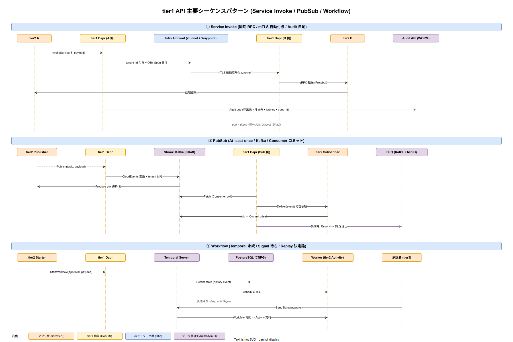

# tier1 API シーケンス

本書は tier1 公開 11 API のうち、tier2/tier3 から呼出される典型的な 3 パターン（同期 RPC / 非同期 PubSub / 永続 Workflow）を時系列シーケンスで記述する。各 API の個別契約は [40_tier1_API契約IDL/](40_tier1_API契約IDL/) を参照し、本書ではそれらが実際にどう連携し、どこで観測性・監査・テナント境界が付与されるかを図解する。

## なぜシーケンス図が必要か

tier1 API の単体契約（Protobuf IDL）を見ても、呼出元 → Dapr ファサード → サービスメッシュ → バックエンド → データ層 のどこで mTLS が張られ、どこで tenant_id が付与され、どこで Audit ログが非同期に書かれ、どこで SLO タイムアウトが効くかは読み取れない。tier2 開発者が「API が遅い」と言ったとき、その原因が Dapr ファサード側なのか、Istio Ambient の Waypoint なのか、バックエンドの PostgreSQL なのかを切り分けるには、シーケンス全体を俯瞰する図が必要になる。

また、FMEA（[40_運用ライフサイクル/06_FMEA分析.md](../40_運用ライフサイクル/06_FMEA分析.md)）で特定した故障モードが、シーケンスのどの段階で顕在化するかを対応付ける起点になる。

## 3 パターン俯瞰図

図は上から順に、① 同期 RPC（Service Invoke）、② 非同期 PubSub、③ 永続 Workflow の 3 パターンを並べて描いている。色は図解レイヤ規約に従い、アプリ層を暖色、tier1 抽象を淡い暖色、ネットワーク層（Istio Ambient）を寒色、データ層（PG / Kafka / MinIO）を薄紫で区別している。

## パターン ① Service Invoke（同期 RPC）

tier2 A が tier2 B に業務ロジックを呼び出す最も基本的なケース。tier2 側のコードからは単一の `InvokeService(B, payload)` に見えるが、内部では以下の 7 段階を経る。

1. **tier1 Dapr (A 側)**: 呼出元 SDK が受けとり、tenant_id を Context から取り出して gRPC メタデータに自動付与する。OpenTelemetry Span を発行してトレース親 ID を継承する
2. **Istio Ambient ztunnel**: L4 で mTLS 透過暗号化、SPIFFE ID ベースの peer 認証
3. **Istio Ambient Waypoint**: L7 ポリシー（RBAC、Rate Limit）を適用
4. **tier1 Dapr (B 側)**: 受信、tenant_id を Context に戻す
5. **tier2 B**: 業務ロジック実行
6. **逆向きに応答**: 同じ経路で返る
7. **Audit 非同期記録**: 呼出元・呼出先・latency・trace_id を Audit API に WORM 書込み（tier2 コードから見えない）

FR-T1-INVOKE-001 の SLO は同一 AZ で p99 < 50ms、跨 AZ で p99 < 200ms。逸脱時はエラーバジェット消費率を Fast burn アラートで検知する。

## パターン ② PubSub（非同期 At-least-once）

tier2 A がイベントを発行し、tier2 B が別のワーカーで受信するケース。**At-least-once** 配送のため、Subscriber 側は **冪等性** を前提に実装する必要がある。図の 7 段階は以下。

1. **Publish**: tier2 A が `Publish(topic, payload)` を呼び、tier1 Dapr が CloudEvents エンベロープに tenant_id・trace_id を付与
2. **Produce**: Kafka（Strimzi）に送信、RF=3 で Broker 3 台に書込み確定 ack
3. **Fetch**: Subscriber 側の tier1 Dapr が Kafka Consumer として Fetch ループ
4. **Deliver**: tier2 Subscriber に HTTP/gRPC で配送
5. **Ack**: Subscriber が成功を返すと offset commit
6. **失敗時**: N 回リトライ後、DLQ（Dead Letter Queue）に送出、MinIO に原メッセージを退避
7. **DLQ 監視**: DLQ 滞留件数を Prometheus で監視、閾値超過でアラート

DLQ に送られたメッセージは運用者が Grafana 上で内容を確認し、原因を Runbook（[40_運用ライフサイクル/](../40_運用ライフサイクル/) 参照）に従って是正、必要なら再投入する。FR-T1-PUBSUB-001 の SLO は Publish p99 < 100ms、Deliver lag p95 < 10 秒。

## パターン ③ Workflow（Temporal 永続）

承認フロー（部門長承認 → 経理確認 → 金額限度チェック）のような長時間実行ワークフローのケース。プロセス再起動やホスト障害でも進行状態が失われず、承認待ちで数日〜数週間 sleep しても問題なく再開する。図の 6 段階は以下。

1. **StartWorkflow**: tier2 Starter が `StartWorkflow(approval, payload)` を呼ぶ
2. **Persist state**: Temporal Server が workflow 定義と初期イベントを PostgreSQL に history event として書込み
3. **Schedule Task**: Worker（tier2 側の Activity 実装を持つ Pod）にタスクを割り当て、Activity を実行
4. **Signal 待ちで sleep**: 承認者のアクション待ちで Workflow が sleep、リソース解放
5. **SendSignal**: 承認者が Backstage UI 経由で `SendSignal(approve)` を送る
6. **Workflow 再開**: Temporal が history から状態を復元（**Replay**）、次の Activity を実行

Replay の Determinism 違反（実行環境ごとに異なる結果を返すコード）が最大の落とし穴で、`time.Now()` / ランダム / 外部 API 直接呼出は禁止。FMEA RPN 135（ADR-RULE-002）で特定された最優先リスクであり、CI/CD で Replay テストを必須化する。

## 例外系のパターン

上記 3 パターンは正常系を示した。例外系は別途以下を押さえる。

- **タイムアウト**: tier1 Dapr 側で一律 30 秒、tier2 側で個別設定可。超過時は gRPC UNAVAILABLE を返し、呼出元はサーキットブレーカ（Istio で有効化）を発動
- **Retry**: Service Invoke は idempotent でない限り自動リトライしない（呼出元責任）。PubSub は At-least-once のため Subscriber 側で自動リトライ N 回。Workflow は Activity 単位で Temporal がリトライポリシーを管理
- **mTLS 失敗**: SPIFFE ID 照合失敗で即 UNAUTHENTICATED、Audit API に異常記録

## 関連ドキュメント

- [40_tier1_API契約IDL/](40_tier1_API契約IDL/): 各 API の Protobuf 契約
- [30_非機能要件/I_SLI_SLO_エラーバジェット.md](../30_非機能要件/I_SLI_SLO_エラーバジェット.md): SLO と測定点
- [40_運用ライフサイクル/06_FMEA分析.md](../40_運用ライフサイクル/06_FMEA分析.md): 各段階の故障モード
- ADR-0001（Istio Ambient）、ADR-DATA-002（Kafka）、ADR-RULE-002（Temporal）
