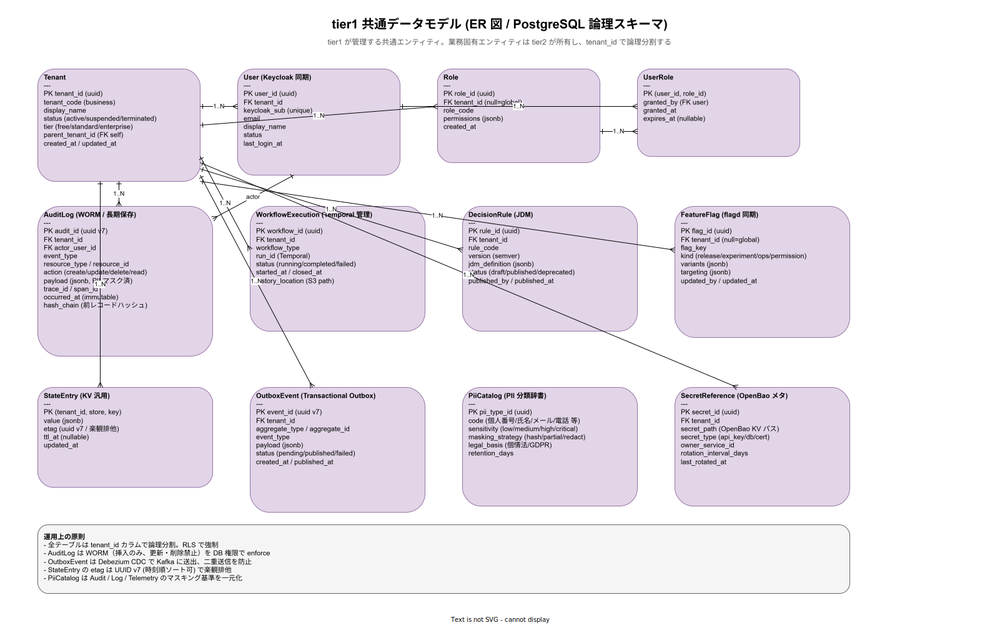

# tier1 共通データモデル

本書は tier1 公開 11 API が管理する **共通エンティティ** の論理データモデルを定義する。業務固有エンティティ（経費伝票、案件、顧客マスタ等）は tier2 が所有し、本書には含まない。tier1 共通モデルは全テナントの全業務で共有され、`tenant_id` カラムによる論理分割（Row Level Security = RLS）でテナント境界を強制する。

## なぜ共通モデルを定義するか

マイクロサービスは「サービスごとにデータを所有」が原則だが、PaaS の基盤層（認証・監査・特徴量・ワークフロー・状態管理）は **全サービス共通** であり、その論理モデルを文書化しないと tier2 開発者が同じ概念を違う名前で再発明する。また、監査部門・情報システム監査・個人情報保護委員会からの問合せ（「このデータはどのテーブルで管理されていますか」「保管期間はいくつですか」）に即答するには、tier1 レベルで論理モデルが統一されている必要がある。

本書は論理設計レベルで、物理実装（インデックス、パーティション、シャード設計）は [40_運用ライフサイクル/](../40_運用ライフサイクル/) のストレージ設計で扱う。

## ER 図

図は以下の 10 エンティティを示している。テナント境界・ユーザー認可の基本 4 エンティティを最上段に、実行状態系 4 エンティティを中段に、汎用共通系 3 エンティティを下段に配置した。全エンティティは `tenant_id` 外部キーを持つ（Role と FeatureFlag は `null` 可でグローバル定義可能）。

## エンティティ説明

### Tenant

テナントは JTC 社内の部門、子会社、あるいは将来の外販先として想定する契約単位。`tenant_code` は人間可読の業務キー（`"finance-2024"` など）、`tenant_id` は UUID v4 でシステム的キー。`parent_tenant_id` で親子階層を表現し、企業グループの構造を反映できる。`tier` は課金階層（free / standard / enterprise）で、Feature Flag の targeting に使う。

### User（Keycloak 同期）

User は Keycloak の User と 1:1 で対応し、`keycloak_sub` が Keycloak 側のユーザー識別子の unique 参照。本テーブルは Keycloak からの変更を CDC（Change Data Capture）で追従するため、原本は Keycloak 側にあり、tier1 側は読取り副本の位置付け。`last_login_at` はプロビジョニング後の休眠アカウント検出に使う。

### Role / UserRole

Role は `(tenant_id, role_code)` でスコープされる権限グループ。`permissions` は jsonb で、具体的な API アクション権限を柔軟に格納する（例: `{"audit.read": true, "feature_flag.write": false}`）。UserRole で User と Role を多対多に結び、`granted_by` で誰が付与したかを記録、`expires_at` で時限権限を表現。期限切れは Temporal Workflow で日次に検知して自動剥奪する。

### AuditLog（WORM）

AuditLog は全 tier1 API の呼出、特権操作、設定変更を記録する **WORM**（Write Once Read Many）テーブル。DB 権限で `INSERT` のみ許可し `UPDATE` / `DELETE` を禁止する。`hash_chain` は前レコードのハッシュを連鎖させ、改竄検出を可能にする（ブロックチェーン的）。長期保存（1 年以上）のため、古いレコードは定期的に MinIO にエクスポートして PostgreSQL 側は hot データのみ保持する。`payload` には PII マスク済みの操作内容が入り、マスキング基準は PiiCatalog に従う。

### WorkflowExecution（Temporal 管理）

Temporal Server が管理する workflow 実行の軽量メタデータ。詳細な history event は Temporal 側の PostgreSQL に保管され、本テーブルは tier1 側からの問合せ用インデックス的役割。`history_location` で MinIO にアーカイブされた完了ワークフローの履歴 S3 パスを保持する（完了後 90 日で PostgreSQL から MinIO に退避）。

### DecisionRule（JDM）

ZEN Engine が評価する JDM（JSON Decision Model）ルール定義。`version` は semver で履歴管理し、`status` で draft / published / deprecated を区別する。`published` 状態のルールのみが本番評価に使われる。`published_by` / `published_at` は監査証跡。ゴールデンケーステストが CI/CD で必須化されており、failure では `status=published` への遷移が拒否される。

### FeatureFlag（flagd 同期）

OpenFeature / flagd と同期される Feature Flag。`kind` で release（機能段階リリース）/ experiment（A/B テスト）/ ops（運用切替）/ permission（権限ゲート）の 4 種別を区別する（ADR-FM-001）。`variants` は複数バリアント（例: `{"blue": {"config": "v1"}, "green": {"config": "v2"}}`）、`targeting` は評価ルール（例: `{"percentage": 10, "tenant_tier": "enterprise"}`）。

### StateEntry（KV 汎用）

tier1 State API が提供する汎用 KV ストア。複合主キー `(tenant_id, store, key)` でテナントとストア名を分離し、`etag` は UUID v7（時刻順ソート可能）で楽観排他を実現する。`ttl_at` で自動削除時刻を指定可能、null なら永続。業務固有の構造化データは tier2 が自身の PostgreSQL スキーマに持つべきで、StateEntry は session, cache, 一時的な集約状態などに限定する。

### OutboxEvent（Transactional Outbox）

同一 DB トランザクション内で業務状態と一緒にイベントを書き込み、後段で Debezium CDC が Kafka に送出する Outbox パターン。これにより「DB 書込みは成功、イベント発行は失敗」の二重書込み問題を排除する。`status` は pending → published の遷移、failed は手運用で再処理する。

### PiiCatalog

PII（Personally Identifiable Information）のカタログ。`code` で種類（個人番号 / 氏名 / メール / 電話 / 住所等）、`sensitivity` で機密度、`masking_strategy` でマスキング方式（hash / partial / redact）を定義する。`legal_basis` で根拠法令（個情法 2022、GDPR、各国個情法）を記録し、`retention_days` で保管期間上限を定める。Audit / Log / Telemetry の全マスキング判断はこのカタログを参照する一元化基準。

### SecretReference（OpenBao メタ）

OpenBao（ADR-SEC-002）に保管される Secret のメタ情報。本テーブルに Secret 値は **保管しない**（OpenBao 側が唯一のソース）。`secret_path` で OpenBao の KV パスを参照し、`rotation_interval_days` でローテーション周期を宣言する。期限切れは Temporal Workflow で検知してローテーション依頼を owner_service_id に自動発行する。

## 運用原則

図の下部にも示した通り、全エンティティの運用には以下の原則を適用する。

- **RLS 強制**: 全テーブルに `tenant_id` カラムを置き、PostgreSQL の Row Level Security ポリシーで tenant 境界を DB レイヤで強制する。アプリコードの bug でテナント越え参照が発生しても防ぐ
- **WORM 強制**: AuditLog は DB 権限で挿入のみ許可。改竄検出は hash_chain で追加防御
- **Outbox パターン**: 業務状態と Kafka 発行の二重書込み問題を排除、Debezium CDC で送出
- **UUID v7**: StateEntry の etag、AuditLog / OutboxEvent の主キーは UUID v7（時刻順ソート可）を採用し、監査ログの時系列検索とインデックス効率を両立
- **PiiCatalog 一元化**: マスキング判断は必ずカタログ経由、散在する if/switch 文を排除

## 物理実装への接続

本書は論理設計レベル。物理実装（CloudNativePG のクラスタ構成、シャード方針、パーティション設計、インデックス戦略）は以下で扱う。

- [ADR-DATA-001-cloudnativepg.md](../../02_構想設計/adr/ADR-DATA-001-cloudnativepg.md): PostgreSQL Operator
- [40_運用ライフサイクル/07_負荷試験とキャパシティ.md](../40_運用ライフサイクル/07_負荷試験とキャパシティ.md): 容量設計
- 将来: 04_概要設計/ 配下で物理 ER と DDL を定義する

## 関連ドキュメント

- [30_情報要件.md](30_情報要件.md): 情報管理全体方針
- [40_tier1_API契約IDL/](40_tier1_API契約IDL/): API IDL 定義
- ADR-DATA-001（PG）、ADR-SEC-002（OpenBao）、ADR-FM-001（flagd）、ADR-RULE-001（ZEN）、ADR-RULE-002（Temporal）
