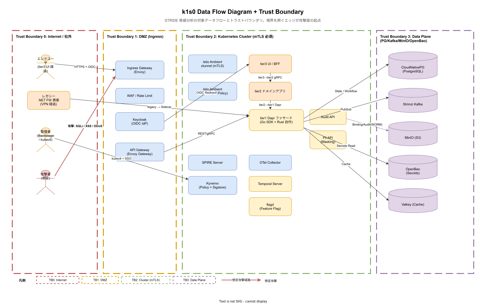

# E. 脅威モデリング（STRIDE + DFD + Attack Tree）

本書はセキュリティ要件（[E_セキュリティ.md](E_セキュリティ.md)）の根拠となる脅威分析を STRIDE モデルで体系化する。データフロー図（DFD）でトラストバウンダリを可視化し、境界を跨ぐエッジごとに脅威カテゴリを当て、各脅威に対する緩和策を要件 ID と紐付ける。Attack Tree では代表的な攻撃シナリオを分解し、最弱リンクを特定する。

## なぜ脅威モデリングが必要か

セキュリティ要件は「ISO 27001 に準拠」「TLS 1.3 を採用」といった手段の宣言に陥りやすいが、**なぜその手段が必要か** を辿ると脅威モデルに行き着く。脅威モデルがないまま要件を書くと、1）必要以上の実装（過剰防御）、2）本来必要な対策の漏れ、3）監査や脆弱性診断の質疑で根拠を説明できない、の 3 つが発生する。

本書は **Microsoft STRIDE**（Spoofing / Tampering / Repudiation / Information Disclosure / Denial of Service / Elevation of Privilege）を分類軸に採用する。STRIDE は Threat Modeling 分野の業界標準で、Adam Shostack の Threat Modeling: Designing for Security でも一次軸として使われる。

## DFD とトラストバウンダリ



図は k1s0 の主要データフローを 4 つの Trust Boundary（TB）で区切っている。

- **TB0: Internet / 社外**: 外部ユーザ、レガシー資産、管理者、攻撃者の起点
- **TB1: DMZ**: Ingress Gateway、WAF、Keycloak、API Gateway を配置。外部トラフィックの最初の境界
- **TB2: Kubernetes Cluster**: tier1/tier2/tier3、Istio Ambient、SPIRE、OTel、Temporal、flagd 等の実行面。mTLS 必須
- **TB3: Data Plane**: PostgreSQL、Kafka、MinIO、OpenBao、Valkey 等の永続層

境界を跨ぐエッジが攻撃面になるため、各エッジに対して STRIDE 6 カテゴリを網羅的に評価する。

## STRIDE 脅威分析

以下は主要なエッジごとの脅威と緩和策。要件 ID（NFR-E-\*）は [E_セキュリティ.md](E_セキュリティ.md) を参照。

### T0 → T1: 外部ユーザ → Ingress Gateway

- **S (Spoofing)**: 正規ユーザへのなりすまし。緩和: Keycloak OIDC、MFA（NFR-E-AC-005）、セッション短寿命化（NFR-E-AC-001）
- **T (Tampering)**: HTTPS 中間者改竄。緩和: TLS 1.3、HSTS、証明書ピン（NFR-E-ENC-001）
- **R (Repudiation)**: 操作の否認。緩和: Audit WORM（NFR-E-MON-001）
- **I (Information Disclosure)**: セッション情報漏洩。緩和: HttpOnly/Secure Cookie、SameSite=Strict（NFR-E-WEB-001 OWASP 対策）
- **D (DoS)**: L7 DDoS、Slowloris 等。緩和: Envoy Rate Limit、Cloudflare 等の前段保護（NFR-E-NW-004）
- **E (Elevation)**: 認証後の権限昇格。緩和: OIDC claims 検証、tier1 で tenant_id 強制付与（NFR-E-AC-003）

### T0 → T1: レガシー .NET 資産 → Sidecar/API Gateway

- **S**: VPN クライアント偽装。緩和: SPIFFE ID mTLS、Workload Identity（NFR-E-AC-003 / ADR-SEC-003）
- **T**: 転送データ改竄。緩和: mTLS、MAC 検証（NFR-E-ENC-001）
- **I**: 平文転送漏洩。緩和: IPSec + mTLS、TLS 1.3 必須（NFR-E-ENC-001）
- **D**: レガシー起因の大量同時接続。緩和: API Gateway 接続数上限、Circuit Breaker（NFR-E-NW-004）

### T0 → T1: 管理者 → Backstage / kubectl

- **S**: 管理者アカウント盗用。緩和: ハードウェアトークン MFA（NFR-E-AC-005）、特権 SSO、短寿命トークン
- **T**: kubectl 操作の改竄。緩和: kubectl context ログ、Kyverno admission control（NFR-E-AV-001）
- **R**: 特権操作の否認。緩和: kube-apiserver audit ログ、Audit API WORM 転送（NFR-E-MON-001）
- **I**: etcd 秘匿情報閲覧。緩和: etcd 暗号化（NFR-E-ENC-002）、管理者権限最小化（NFR-E-AC-002 RBAC）
- **E**: サービスアカウント経由の cluster-admin 奪取。緩和: SPIRE/SPIFFE、RBAC 最小権限（NFR-E-AC-002）、Kyverno ポリシー

### T1 → T2: Ingress/Gateway → tier3/tier2

- **S**: 内部サービスなりすまし。緩和: SPIFFE ID + mTLS（NFR-E-AC-003 / ADR-SEC-003）
- **T**: リクエスト Body 改竄。緩和: mTLS（NFR-E-ENC-001）、業務レベル署名（重要決定はデジタル署名）
- **I**: gRPC メタデータ漏洩。緩和: Pod 間 mTLS、ログマスキング（NFR-E-ENC-003）
- **D**: 内部サービスの過剰呼出。緩和: Istio Rate Limit、Circuit Breaker（NFR-E-NW-004）

### T2 → T2: tier3 → tier2 → tier1 Dapr

- **S**: 不正 Pod が SPIFFE ID 詐称。緩和: SPIRE Agent + Node Attestor（k8s_sat / k8s_psat）
- **T**: 内部 gRPC 改竄。緩和: mTLS 必須（ztunnel、NFR-E-ENC-001）
- **R**: tier2 操作の否認。緩和: Audit API 自動書込（trace_id 付与、NFR-E-MON-001）
- **I**: トレース / ログの PII 漏洩。緩和: Pii API Masking（NFR-E-ENC-003 / ADR-0001 / G_データ保護とプライバシー.md）
- **E**: tier1 API 権限昇格。緩和: Dapr Access Control、tier1 で tenant_id 強制（NFR-E-AC-003）

### T2 → T3: tier1 Dapr → PG / Kafka / MinIO / OpenBao / Valkey

- **S**: Dapr 偽装による DB アクセス。緩和: SPIFFE ID mTLS、DB 側で Client Cert 検証（NFR-E-AC-003）
- **T**: DB 書込み改竄。緩和: PG RLS、AuditLog hash_chain（改竄検出、NFR-E-MON-001）
- **R**: データ削除の否認。緩和: AuditLog WORM、hash_chain、WAL アーカイブ（NFR-E-MON-001）
- **I**: DB dump 漏洩。緩和: 保存時暗号化（NFR-E-ENC-002: TDE、MinIO SSE-KMS、OpenBao Transit）
- **D**: 大量クエリで DB 枯渇。緩和: Connection Pool 上限、Slow Query 検知（NFR-E-NW-004）
- **E**: DBA 権限の不正利用。緩和: OpenBao Dynamic Secret（短寿命 DB ロール、NFR-E-AC-004）、特権操作 Audit（NFR-E-MON-001）

## tier1 公開 11 API 別 STRIDE 評価マトリクス

前節の DFD 境界別 STRIDE 分析は「どこに境界があるか」を軸とした網羅評価だが、運用・監査の現場では「特定 API の脅威を全方位から点検したい」場面が多い。そのため tier1 公開 11 API それぞれに対して S/T/R/I/D/E の 6 カテゴリを網羅評価する API 軸マトリクスを本節で追加する。ペネトレーションテストのスコープ策定（[C_運用保守性.md](C_運用保守性.md) NFR-E-RSK-002）と監査証跡レビュー時のチェックリストとして使用する。

各セルは「**想定脅威 → 緩和策（要件 ID）**」形式で記述する。緩和策の根拠は前節の境界別分析と整合している。緩和未決（U-）がある場合は「U-NNN 参照」と明示する。

### Service Invoke API

| 軸 | 想定脅威 | 緩和策（要件 ID）|
|---|---|---|
| S | 呼出元サービスの偽装で他テナントリソースに到達 | SPIFFE ID + mTLS（NFR-E-AC-003 / ADR-SEC-003）、Workload Identity 必須 |
| T | リクエスト Body 改竄、リトライ時のペイロード差し替え | mTLS 必須（NFR-E-ENC-001）、idempotency key 検証（[00_tier1_API共通規約.md](../20_機能要件/10_tier1_API要件/00_tier1_API共通規約.md)）|
| R | 呼出し履歴の否認 | Audit API 自動書込み（NFR-E-MON-001）、trace_id 付与 |
| I | gRPC メタデータ経由の認可トークン漏洩 | Pod 間 mTLS、ヘッダマスキング（NFR-E-ENC-003）|
| D | 無制限リトライによる内部 DoS | Dapr Resiliency（タイムアウト 5s、リトライ 3 回、指数バックオフ）、Circuit Breaker（NFR-E-NW-004）|
| E | tenant_id 詐称による越境呼出し | tier1 ファサードで JWT から tenant_id を強制上書き（NFR-E-AC-003、三層防御 L1）|

### State API

| 軸 | 想定脅威 | 緩和策（要件 ID）|
|---|---|---|
| S | 他テナント Pod による Key 窃取 | SPIFFE ID + key プレフィックスのテナント自動付与（三層防御 L2）|
| T | ETag 無視による Lost Update | ETag 必須、衝突時 CONFLICT 返却（NFR-I-SLO-002 Correctness 100%）|
| R | データ書き換えの否認 | AuditLog hash_chain（NFR-E-MON-001）、Valkey/PostgreSQL WAL アーカイブ |
| I | PostgreSQL dump・Valkey snapshot 漏洩 | TDE（NFR-E-ENC-002）、MinIO SSE-KMS、バックアップ暗号化 |
| D | 大量 Key による Valkey メモリ枯渇・PostgreSQL 接続枯渇 | Per-tenant Key 数上限、Connection Pool 上限、Slow Query 検知（NFR-E-NW-004）|
| E | RLS 回避による全テナントデータ読取り | PostgreSQL Row-Level Security（RLS）、三層防御 L3（Audit で参照拒否）|

### PubSub API

| 軸 | 想定脅威 | 緩和策（要件 ID）|
|---|---|---|
| S | Topic に別テナント名義で発行 | SPIFFE ID + Topic 名のテナント自動プレフィックス、Kafka ACL（NFR-E-AC-003）|
| T | Consumer 側でメッセージ改竄 | Producer 側 MAC 付与、Schema Registry による型検証 |
| R | 発行履歴の否認 | Kafka の producerId + Audit API 自動書込み（NFR-E-MON-001）|
| I | Topic 内メッセージの他テナント閲覧 | Kafka ACL、Topic 名テナント分離、Consumer SPIFFE ID 検証 |
| D | Topic フラッディング | Per-tenant Publish rate 上限、Broker Quota 設定（NFR-E-NW-004）|
| E | Admin API 経由の Topic 乗っ取り | Kafka Admin Client の SPIFFE ID 限定、Kyverno で Topic 作成 API 制限 |

### Secrets API

| 軸 | 想定脅威 | 緩和策（要件 ID）|
|---|---|---|
| S | OpenBao 偽装による偽 Secret 配布 | SPIFFE ID + mTLS、Root CA ピン（NFR-E-AC-003）|
| T | Secret 値の改竄（中間者）| TLS 1.3、OpenBao Transit による署名（NFR-E-ENC-001）|
| R | Secret 参照履歴の否認 | OpenBao Audit log、Audit API 転送（NFR-E-MON-001）|
| I | Secret 平文ログ混入・環境変数漏洩 | Secret は環境変数禁止、ログマスキング必須（NFR-E-ENC-003、Kyverno で環境変数参照を拒否）|
| D | 大量 Secret 取得による OpenBao 枯渇 | OpenBao 側 rate limit、tier1 側キャッシュ（TTL 内）|
| E | 他テナント Secret への横展開 | OpenBao の namespace/policy 分離、tier1 で tenant_id 強制 |

### Binding API

| 軸 | 想定脅威 | 緩和策（要件 ID）|
|---|---|---|
| S | 外部 SMTP/HTTP エンドポイント偽装 | 宛先 URL の allowlist（Kyverno）、TLS 証明書検証必須 |
| T | 送信メッセージ・受信コールバックの改竄 | TLS 必須、MAC / HMAC 付与（NFR-E-ENC-001）|
| R | 送信履歴の否認 | Audit API 自動書込み、Outbox パターンでイベント永続化（NFR-E-MON-001）|
| I | 外部宛先漏洩（MinIO public bucket、誤送信メール）| Kyverno で Public bucket 拒否、SMTP 宛先 allowlist |
| D | 外部エンドポイント応答遅延による tier1 スレッド枯渇 | Circuit Breaker、タイムアウト必須、Bulkhead パターン（NFR-E-NW-004）|
| E | Binding 経由の内部サービス到達（SSRF）| 宛先 URL の allowlist、Egress Gateway 経由必須（NFR-E-NW-003）|

### Workflow API

| 軸 | 想定脅威 | 緩和策（要件 ID）|
|---|---|---|
| S | Workflow starter の偽装 | SPIFFE ID + mTLS、Keycloak トークン検証 |
| T | Workflow 状態の改竄（Temporal 履歴書換え）| Temporal History Event の改竄不可設計、PostgreSQL WAL アーカイブ |
| R | Workflow 起動・失敗の否認 | Audit API に WorkflowExecution 全 event 転送（NFR-E-MON-001）、hash_chain |
| I | Workflow 入力引数の PII 漏洩 | Pii API で自動マスキング、Temporal Payload Encryption（NFR-E-ENC-003）|
| D | 無限ループ Workflow による Worker 枯渇 | 実行時間上限、Child Workflow 数上限、Determinism linter（NFR-I-SLO-006）|
| E | Workflow 経由の特権呼出し | Workflow 内からの tier1 API 呼出しは tenant_id 強制継承（NFR-E-AC-003）|

### Log API

| 軸 | 想定脅威 | 緩和策（要件 ID）|
|---|---|---|
| S | Log Producer 偽装による他テナントログ混入 | SPIFFE ID + mTLS、tier1 ファサードで tenant_id 自動付与 |
| T | Loki 格納後のログ改竄 | Loki 側 immutable 設定、MinIO Object Lock（WORM）|
| R | ログ欠損による操作否認 | Dead Man's Switch（NFR-A-CONT-001 / FR-T1-TELEMETRY-003）|
| I | ログ内 PII 漏洩 | Pii API マスキング、log field allowlist（NFR-E-ENC-003）|
| D | Log フラッディング（ログ爆発）| Per-tenant ingest rate 上限、サンプリング、ドロップ許容率 < 0.01%（NFR-I-SLO-007）|
| E | Loki 検索権限を悪用した他テナント閲覧 | Grafana Org 分離、Loki LogQL の tenant 強制フィルタ |

### Telemetry API

| 軸 | 想定脅威 | 緩和策（要件 ID）|
|---|---|---|
| S | Trace span の偽装注入 | SPIFFE ID + mTLS、OTel Collector で SPIFFE ID と tenant_id の整合性検証 |
| T | Span attributes の改竄 | Collector で attributes 検証、不正値は reject |
| R | メトリクス欠損による監視の否認 | Dead Man's Switch、Prometheus recording rule の 2 重化 |
| I | Trace attributes 経由の PII 漏洩 | Kyverno / CI で attributes に PII が含まれないことを検証（NFR-E-ENC-003）|
| D | Span フラッディング | サンプリング（Tail-based）、Per-tenant rate 上限（NFR-I-SLO-008）|
| E | Grafana 管理 UI からの権限昇格 | Grafana RBAC、viewer / editor / admin の最小化 |

### Decision API

| 軸 | 想定脅威 | 緩和策（要件 ID）|
|---|---|---|
| S | 偽 JDM ルールの流入 | ルール配布は Git 管理、ADR-RULE-001 に従い署名検証（Sigstore）|
| T | 実行中ルールの改竄（in-process メモリ書換え）| コンテナ immutable、eBPF による実行バイナリ検証 |
| R | ルール評価結果の否認 | Audit API に evaluation 全件（input hash + output + rule version）を自動書込み |
| I | ルール評価入力に含まれる PII 漏洩 | Pii API マスキング、span attributes に生値記録禁止 |
| D | 複雑ツリー無限評価による CPU 枯渇 | 評価時間上限（p99 < 1ms / 複雑時 < 5ms）、再帰深度上限（NFR-I-SLO-009）|
| E | JDM に `time.Now` / random 等の非決定要素注入で内部状態参照 | JDM Schema validator で禁止関数リストを強制（ADR-RULE-001）|

### Audit-Pii API

| 軸 | 想定脅威 | 緩和策（要件 ID）|
|---|---|---|
| S | 偽 Audit Producer による改竄済みログ流入 | SPIFFE ID + mTLS、tier1 ファサード経由のみ受付 |
| T | hash_chain 断絶（中間挿入・削除）| SHA-256 hash_chain、Kafka パーティション単位で前 hash 必須検証（FR-T1-AUDIT-001: パーティションキーは tenant_id）|
| R | 監査ログ自体の改竄（WORM 破り）| MinIO Object Lock（Compliance mode）、retention 7 年（NFR-E-MON-001）|
| I | Audit ログ経由の PII 漏洩 | Pii API で書込前に強制マスキング（一方向ハッシュ、HMAC 禁止で再識別不能）|
| D | Audit event バースト時の Kafka 枯渇 | Per-tenant ingest rate 上限、Audit は優先度最高で Kafka 容量確保 |
| E | Audit 権限を悪用した閲覧範囲拡大 | Audit 閲覧は監査部門ロール限定、Grafana RBAC、閲覧履歴も Audit に記録 |

### Feature API

| 軸 | 想定脅威 | 緩和策（要件 ID）|
|---|---|---|
| S | flagd Producer 偽装による偽 Flag 配布 | SPIFFE ID + mTLS、Flag 定義は Git 管理 + Sigstore 署名 |
| T | Flag 評価時の variants 書換え | flagd コンテナ immutable、local cache の整合性検証 |
| R | Flag 評価履歴の否認 | Audit API に evaluation 書込み（who/when/flag/variant/reason）|
| I | targeting rule 経由の属性漏洩（例: user email をログ出力）| targeting に PII 使用禁止、CI で attributes 検査 |
| D | 大量評価による flagd 枯渇 | local cache（LRU）、Per-tenant rate 上限（NFR-I-SLO-011）|
| E | permission 種別 Flag の誤設定による権限昇格 | permission 種別の変更は PR レビュー必須 + Product Council 承認（本マトリクス参照）|

### API 軸マトリクスの運用

- 本マトリクスは新規 API 追加時に **必須レビュー項目** とする。L2 Platform Team の ADR 起案時に 6 セルすべてを埋めることをゲート条件とする。
- 空セル・`TBD`・`後日対応` の記載は不可。決まっていない場合は未決事項（U-NNN）を [03_前提と制約.md](../00_要件定義方針/03_前提と制約.md) に採番し、決着期限を明示する。
- ペネトレーションテスト（NFR-E-RSK-002）のスコープ策定時、本マトリクスから「緩和策が実装済みか」を 1 API ごとにチェックし、未実装の脅威から優先的にテスト対象とする。

## Attack Tree: 「個人情報 1 万件を持ち出し」

代表的な攻撃シナリオを分解し、最弱リンクを特定する例。

```text
Goal: 個人情報 1 万件持ち出し
├── A1: 正規ユーザ権限で SELECT
│   ├── A1-1: 管理者アカウント盗用（フィッシング）
│   │   └── 緩和: MFA、短寿命セッション、異常ログイン検知
│   └── A1-2: Insider による業務目的外閲覧
│       └── 緩和: Audit WORM、DLP、定期監査
├── A2: DB 直接接続（内部）
│   ├── A2-1: Pod 侵害後に DB 接続情報入手
│   │   └── 緩和: OpenBao Dynamic Secret、Secret は環境変数禁止
│   └── A2-2: etcd 漏洩から Secret 入手
│       └── 緩和: etcd 暗号化、etcd アクセス最小権限
├── A3: バックアップ窃取
│   ├── A3-1: MinIO バケット誤公開
│   │   └── 緩和: MinIO ポリシー IaC 管理、Public 拒否 Kyverno ポリシー
│   └── A3-2: WAL アーカイブ保管先侵害
│       └── 緩和: MinIO 側暗号化、WORM モード
└── A4: サプライチェーン侵害
    ├── A4-1: 悪意ある依存ライブラリ
    │   └── 緩和: SBOM、Sigstore 署名、Kyverno で未署名拒否
    └── A4-2: 悪意あるコンテナイメージ
        └── 緩和: Cosign 署名必須、Trivy スキャン、Base Image 限定
```

最弱リンクは A1-1（管理者アカウント盗用）と A4-1（依存ライブラリ侵害）。MFA 強制とサプライチェーン防御（Sigstore + Kyverno）を最優先で投資対象とする。

## 脅威分析の運用サイクル

脅威モデルは設計時に一度書いて終わりではない。以下のサイクルで継続更新する。

- **設計変更時**: 新しいコンポーネント追加、データフロー変更時に DFD を更新し、STRIDE 再評価
- **四半期レビュー**: TB 境界の妥当性、緩和策の実装状況を SRE + セキュリティチームで棚卸し
- **インシデント後**: 実際のインシデントが脅威モデルに含まれていたかを照合、含まれていなければモデル更新
- **ペネトレーションテスト前**: スコープ策定の入力として DFD と Attack Tree を提供

## 関連ドキュメント

- [E_セキュリティ.md](E_セキュリティ.md): 要件本体（NFR-E-\*）
- [G_データ保護とプライバシー.md](G_データ保護とプライバシー.md): PII Masking、法令根拠
- [H_アーティファクト完全性とコンプライアンス.md](H_アーティファクト完全性とコンプライアンス.md): SBOM、Sigstore、Kyverno
- [40_運用ライフサイクル/06_FMEA分析.md](../40_運用ライフサイクル/06_FMEA分析.md): 故障モード（セキュリティ起因を含む）
- ADR-SEC-001（Keycloak）、ADR-SEC-002（OpenBao）、ADR-SEC-003（SPIFFE/SPIRE）、ADR-CICD-003（Kyverno）
- Microsoft STRIDE Threat Modeling 資料
- Adam Shostack "Threat Modeling: Designing for Security"
