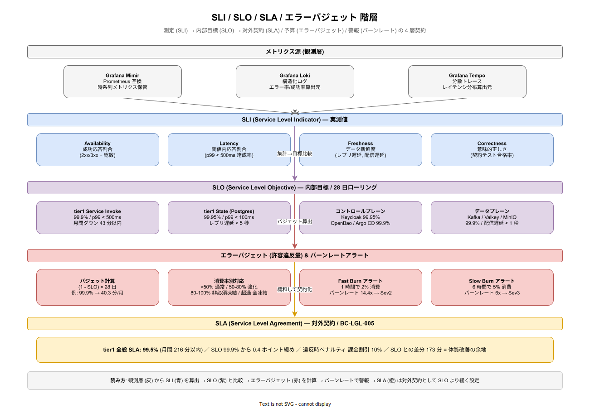

# I. SLI / SLO / エラーバジェット

本書は k1s0 プラットフォームのサービスレベル指標（SLI）、サービスレベル目標（SLO）、エラーバジェット運用を定義する。A 可用性・B 性能拡張の各要件は「稼働率 99.9%」「p99 < 500ms」といった目標値を述べるが、本書はそれらを SRE プラクティスに則って「何を測るか・どう測るか・超過したら何をするか」のオペレーショナブルな契約に翻訳する。

## 本書の位置付け

SLO は単なる目標値ではなく、「この値を割った時にどう行動するか」の運用契約である。稟議書で「稼働率 99.9%」と宣言しても、それを測定する指標（SLI）、SLI の計算ウィンドウ、違反時の対応が定まっていなければ、実運用では形骸化する。本書は A 可用性・B 性能拡張・E セキュリティ・G データ保護の目標値を SLI/SLO/エラーバジェットの枠組みで再整理し、チーム間の責任境界を明確にする。

SLO 設定は Google SRE 書籍群および DORA State of DevOps Report の Elite 基準を参照する。tier1 API 群はプラットフォームのコアのため、Elite 水準（99.9% 以上・p99 < 500ms・デプロイ失敗率 < 15%）を目指す。

## 4 層契約の全体像

観測層のメトリクス源から SLI を計算し、SLI を SLO と比較してエラーバジェット消費を追跡、バーンレートでアラート、SLA は SLO より緩い値を対外契約として設定する。この 4 層の関係を以下の図に示す。

矢印は情報の流れ（観測 → 集計 → 比較 → 契約化）を示す。左右の並びはレイヤ内でのカテゴリ並列（Availability/Latency/Freshness/Correctness の 4 SLI など）。色は責務領域を分離する（観測＝灰、SLI＝青、SLO＝紫、エラーバジェット＝赤、SLA＝橙）。

## SLI（Service Level Indicator）の定義

SLI は「ユーザーが体験するサービス品質」を数値で表す指標。k1s0 では以下の 4 種類を基本とする。

- **Availability SLI**: 総リクエスト中の成功応答の割合（2xx/3xx/認可拒否を除く 4xx は成功扱い、5xx のみ失敗）
- **Latency SLI**: 指定応答時間以内に応答した割合（例: p99 < 500ms を満たした割合）
- **Freshness SLI**: データの新鮮度（バックアップ完了からの経過時間、イベント配信遅延など）
- **Correctness SLI**: 意味的に正しい応答を返した割合（契約テスト合格率、ルール評価の一致率など）

SLI は Prometheus 互換メトリクス（Grafana Mimir 集約）から計算する。tier1 ファサード層でメトリクス発行は一元化され、tier2/tier3 は Telemetry API 経由で自動的に SLI 対象になる。

## SLO（Service Level Objective）の設定

k1s0 の主要コンポーネント別に SLO を定める。SLO は複数の SLI の組合せで定義され、ローリング 28 日ウィンドウで評価する。

### tier1 Service Invoke API

- 目標稼働率: 99.9%（月間ダウンタイム 43 分以内）
- 目標レイテンシ: p50 < 50ms、p95 < 200ms、p99 < 500ms
- 測定ウィンドウ: 28 日ローリング
- エラー分類: mTLS 検証失敗、ルーティング失敗、タイムアウト、upstream 5xx を失敗に計上

### tier1 State API（Valkey / PostgreSQL）

- 目標稼働率: 99.95%（月間 22 分以内、データ層は厳しく）
- 目標レイテンシ: Valkey p99 < 10ms、PostgreSQL p99 < 100ms
- 目標 Freshness: レプリケーション遅延 < 5 秒（PostgreSQL Streaming Replication）
- データ整合性: ETag 不一致による書込衝突検出率 100%（衝突は CONFLICT を返す）

### tier1 PubSub API（Kafka）

- 目標稼働率: 99.9%
- 目標 Publish レイテンシ: p99 < 100ms（ブローカー書込完了まで）
- 目標配信遅延: p99 < 1 秒（Publish から Subscriber 受信まで）
- 目標 At-least-once 保証: メッセージ損失率 < 0.001%（2 週間に 1 件以下相当）

### tier1 Workflow API（Temporal）

- 目標稼働率: 99.9%
- 目標開始レイテンシ: Start から running まで p99 < 2 秒
- 目標 Determinism: Replay 不一致 0%（非決定コード混入時は CI/CD で検出）
- 目標永続性: Workflow 状態の耐久性 99.999%（年間 5 分の状態損失以内）

### tier1 Decision API（ZEN Engine）

- 目標稼働率: 99.9%
- 目標レイテンシ: p99 < 50ms（シンプルなルール）、p99 < 200ms（複雑なツリー）
- 目標 Correctness: 同一入力・同一ルールバージョンで 100% 同一出力

### tier1 Log / Telemetry API

- 目標稼働率: 99.9%
- 目標 Ingest レイテンシ: p99 < 1 秒（受信から Loki/Mimir 検索可能まで）
- 目標損失率: < 0.01%（バックプレッシャ時のドロップ許容）

### tier1 Secrets / Audit / Pii / Feature API

- 目標稼働率: 99.9%
- Secrets レイテンシ: p99 < 50ms（OpenBao キャッシュあり）
- Audit 永続化: 受付から WORM 永続化まで p99 < 5 秒、損失 0%
- Feature 評価レイテンシ: p99 < 10ms（flagd ローカルキャッシュ）

### データ平面（Kubernetes / Istio / Longhorn / MetalLB）

- Kubernetes API Server: 99.95%、kubectl 応答 p99 < 500ms
- Istio Ambient データプレーン: ztunnel 転送レイテンシ増加 p99 < 5ms
- Longhorn ストレージ: IOPS 低下時 < 20%、復旧 RTO < 10 分
- MetalLB: VIP フェイルオーバー < 30 秒

### コントロールプレーン（Keycloak / OpenBao / Argo CD）

- Keycloak 認証: 99.95%（SSO 経路の稼働率）、トークン発行 p99 < 200ms
- OpenBao: 99.9%、シークレット取得 p99 < 100ms
- Argo CD Sync: Git push から apply 完了まで p99 < 2 分

## エラーバジェット

エラーバジェットは「許容される違反時間」。例えば稼働率目標 99.9%（月間）の場合、月間 43 分までのダウンタイムが許容される。これを超過しない限り新機能リリースは許可され、超過したらリリース凍結して信頼性改善に集中する。

### バジェット計算方式

- 月次バジェット = (1 - SLO 目標稼働率) × 28 日
- 例: SLO = 99.9%、バジェット = 0.1% × 40,320 分 = 40.3 分/月
- バジェット消費は Availability・Latency・Correctness の合算で計算
- 消費率は Grafana ダッシュボードで常時可視化

### バジェット消費時の対応

- **消費 50% 未満**: 通常運用、新機能リリース継続
- **消費 50〜80%**: 注意レベル、リリース前レビューを強化、カナリア拡張
- **消費 80〜100%**: 警告レベル、非クリティカル機能のリリース凍結、信頼性タスクを優先
- **消費 100% 超過**: バーンダウン期間、全リリース凍結、インシデントレビュー必須、ポストモーテム実施

バジェット超過時の凍結解除は Product Council の決裁を要する。凍結中でもセキュリティ修正と信頼性改善は優先的にリリース可能。

### バジェット回復

ローリング 28 日ウィンドウなので時間経過で自動回復する。ただし回復を待たずに信頼性改善を実施することで、体質的な改善を図る。ポストモーテム（OR-INC-004）で root cause を特定し、再発防止策を次四半期の OKR に組み込む。

## マルチバーンレートアラート

SLO 違反は早期検知のためマルチバーンレートで監視する。Google SRE Workbook の推奨に従い以下 2 段階を設定する。

- **Fast burn**: 1 時間で月間バジェットの 2% を消費（バーンレート 14.4x）→ 即時ページング、Sev2 起票
- **Slow burn**: 6 時間で月間バジェットの 5% を消費（バーンレート 6x）→ 30 分以内のレビュー、Sev3 起票

バーンレートは以下の式で計算する: `実際のエラー率 / (1 - SLO 目標)`。Fast burn は致命的障害を短時間検出、Slow burn は慢性的劣化を検出する。

## SLA との関係

対外（テナントとの契約）SLA は SLO より低く設定する（SLO 99.9% → SLA 99.5% のように 0.4 ポイント緩める）。SLO は内部目標、SLA は対外約束で違反時にペナルティ（課金割引 10%）が発生する契約条項。BC-LGL-005（責任分界）で具体条項を定める。

- **tier1 全般 SLA**: 99.5%（月間 216 分以内）
- **tier1 全般 SLO**: 99.9%（月間 43 分以内）
- **マージン**: 173 分（体質改善の余地）

SLA は BC-LGL-005 の契約書で明文化、SLO はプラットフォームチーム内の運用指針とする。

## ダッシュボードと可視化

全 SLO を Grafana の共通ダッシュボードで可視化する。ダッシュボードは以下の構成を含む。

- **SLO 概要**: 全主要 SLO の現在稼働率・バジェット消費率
- **バーンレート**: Fast/Slow burn の直近 1h/6h/24h 値
- **違反履歴**: 過去 90 日の違反イベントとポストモーテムリンク
- **コンポーネント別ドリルダウン**: クリックで詳細メトリクス画面へ

ダッシュボードはテナント向けにはステータスページ（NFR-H-TRN-001）経由で簡易版を公開、内部向けは詳細版を常時監視する。

## 要件 ID

- **NFR-I-SLI-001**: 全 tier1 API で Availability/Latency/Freshness/Correctness の 4 SLI を計測（MUST）
- **NFR-I-SLO-001**: tier1 Service Invoke は 99.9% 稼働率・p99 < 500ms を SLO として設定（MUST）
- **NFR-I-SLO-002**: tier1 State は 99.95% 稼働率・レプリ遅延 < 5 秒を SLO として設定（MUST）
- **NFR-I-SLO-003**: コントロールプレーン（Keycloak/OpenBao/Argo CD）の個別 SLO を設定（MUST）
- **NFR-I-EB-001**: エラーバジェット消費率をリアルタイム可視化（MUST、Phase 1b）
- **NFR-I-EB-002**: バジェット超過時のリリース凍結プロセスを整備（MUST、Phase 1c）
- **NFR-I-EB-003**: マルチバーンレートアラート（Fast/Slow）を設定（SHOULD、Phase 1b）
- **NFR-I-SLA-001**: 対外 SLA は SLO より 0.4 ポイント緩い設定で BC-LGL-005 に明文化（MUST）

## メンテナンス

SLO は四半期ごとに Product Council でレビュー、ビジネス要求と技術的可能性の変化に応じて調整する。SLO を緩める場合は BC-LGL-005 の SLA と連動して見直し、テナント通知を要する。新規コンポーネント追加時は SLO 設定を PR の必須項目とする。
