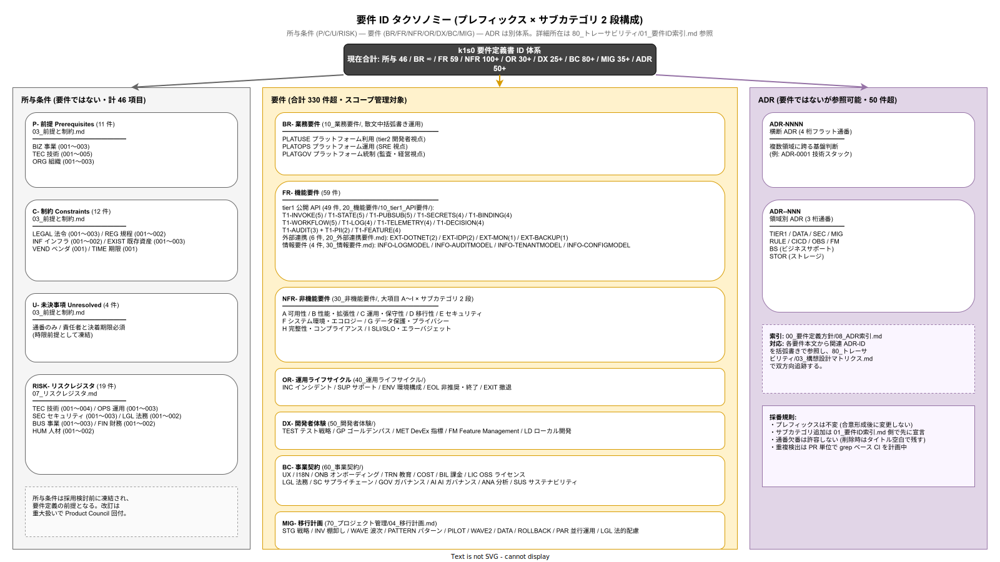

# 01. 要件 ID 索引

本書は k1s0 要件定義書に登録された全要件 ID を集約した索引である。本索引は「実在する ID のみを列挙する単一の真実源」として機能し、参照元ファイルに亡霊 ID（定義のない ID への参照）が紛れ込むことを検出する基礎となる。

## 本書の位置付け

要件が 300 以上に達すると、重複登録や ID 衝突、Phase スコープ漏れが人手では追えなくなる。本索引は全要件を単一リストに集約することで、カテゴリ横断の検索、特定 Phase スコープの抽出、亡霊 ID 検出のベースラインとなる。Phase / 優先度の詳細は各領域ファイル（20_機能要件/02_機能一覧.md、30_非機能要件/各章サマリ、60_事業契約/各章サマリ 等）側のサマリ表で管理し、本索引は「どの ID が存在するか・どこで定義されているか」のみに責務を集中する。

## 要件 ID プレフィックス体系

要件は以下のプレフィックスで分類する。プレフィックス以外のサブカテゴリ（ハイフン 2 段目）も本表で全て列挙する。サブカテゴリ記載のないプレフィックスは、単一領域として扱う。全体の俯瞰は下図を参照。



### 所与条件（要件ではない）

- **P-**: 前提（Prerequisites）。サブカテゴリ: `BIZ`（事業）/ `TEC`（技術）/ `ORG`（組織）
- **C-**: 制約（Constraints）。サブカテゴリ: `LEGAL`（法令）/ `REG`（規程）/ `INF`（インフラ）/ `EXIST`（既存資産）/ `VEND`（ベンダ）/ `TIME`（期限）
- **U-**: 未決事項（Unresolved）。責任者と決着期限を持つ時限前提（通番のみ、サブカテゴリなし）
- **RISK-**: リスクレジスタ項目。サブカテゴリ: `TEC`（技術）/ `OPS`（運用）/ `SEC`（セキュリティ）/ `LGL`（法務）/ `BUS`（事業）/ `FIN`（財務）/ `HUM`（人材）

### 要件

- **BR-**: 業務要件（Business Requirement）。サブカテゴリ: `PLATUSE`（プラットフォーム利用）/ `PLATOPS`（プラットフォーム運用）/ `PLATGOV`（プラットフォーム統制）。10_業務要件/ では散文中で括弧書き参照する方式を採用（本索引では領域のみ記載）
- **FR-**: 機能要件（Functional Requirement）。サブカテゴリ: `T1-INVOKE` / `T1-STATE` / `T1-PUBSUB` / `T1-SECRETS` / `T1-BINDING` / `T1-WORKFLOW` / `T1-LOG` / `T1-TELEMETRY` / `T1-DECISION` / `T1-AUDIT` / `T1-PII` / `T1-FEATURE` / `EXT-DOTNET` / `EXT-IDP` / `EXT-MON` / `EXT-BACKUP` / `INFO-LOGMODEL` / `INFO-AUDITMODEL` / `INFO-TENANTMODEL` / `INFO-CONFIGMODEL`
- **NFR-**: 非機能要件（Non-Functional Requirement）。大項目 A〜I ×サブカテゴリの 2 段構成
- **OR-**: 運用ライフサイクル要件（Operations）。サブカテゴリ: `INC`（インシデント）/ `SUP`（サポート）/ `ENV`（環境構成）/ `EOL`（非推奨・終了）/ `EXIT`（撤退）
- **DX-**: 開発者体験要件（Developer Experience）。サブカテゴリ: `TEST`（テスト戦略）/ `GP`（ゴールデンパス）/ `MET`（DevEx 指標）/ `FM`（Feature Management）/ `LD`（ローカル開発）
- **BC-**: 事業契約要件（Business Contract）。サブカテゴリ: `UX` / `I18N` / `ONB`（オンボーディング）/ `TRN`（教育）/ `COST` / `BIL`（課金）/ `LIC`（OSS ライセンス）/ `LGL`（法務）/ `SC`（サプライチェーン）/ `GOV`（ガバナンス）/ `AI`（AI ガバナンス）/ `ANA`（分析）/ `SUS`（サステナビリティ）
- **MIG-**: 移行計画要件（Migration）。サブカテゴリ: `STG`（戦略）/ `INV`（棚卸し）/ `WAVE`（波次）/ `PATTERN`（パターン）/ `PILOT`（パイロット）/ `WAVE2` / `DATA`（データ移行）/ `ROLLBACK`（撤退）/ `PAR`（並行運用）/ `LGL`（法的配慮）

### ADR（要件ではないが参照可能）

- **ADR-NNNN**: 横断 ADR（4 桁フラット通番）— 複数領域に跨る基盤判断
- **ADR-\<DOMAIN\>-NNN**: 領域別 ADR。DOMAIN: `TIER1` / `DATA` / `SEC` / `MIG` / `RULE` / `CICD` / `OBS` / `FM` / `BS` / `STOR`

ADR の詳細は [../00_要件定義方針/08_ADR索引.md](../00_要件定義方針/08_ADR索引.md) を参照。

## 所在ファイル一覧

### 前提・制約・未決・リスク（所与条件）

| 領域 | ID | 所在 |
|---|---|---|
| P-BIZ | 001〜003（3 件） | [../00_要件定義方針/03_前提と制約.md](../00_要件定義方針/03_前提と制約.md) |
| P-TEC | 001〜005（5 件） | 同上 |
| P-ORG | 001〜003（3 件） | 同上 |
| C-LEGAL | 001〜003（3 件） | 同上 |
| C-REG | 001〜002（2 件） | 同上 |
| C-INF | 001〜002（2 件） | 同上 |
| C-EXIST | 001〜003（3 件） | 同上 |
| C-VEND | 001（1 件） | 同上 |
| C-TIME | 001（1 件） | 同上 |
| U | 001〜004（4 件） | 同上 |
| RISK-TEC | 001〜004（4 件） | [../00_要件定義方針/07_リスクレジスタ.md](../00_要件定義方針/07_リスクレジスタ.md) |
| RISK-OPS | 001〜003（3 件） | 同上 |
| RISK-SEC | 001〜003（3 件） | 同上 |
| RISK-LGL | 001〜002（2 件） | 同上 |
| RISK-BUS | 001〜003（3 件） | 同上 |
| RISK-FIN | 001〜002（2 件） | 同上 |
| RISK-HUM | 001〜002（2 件） | 同上 |

所与条件合計: 46 項目（P 11 / C 12 / U 4 / RISK 19）。

### 業務要件（BR-）

業務要件は 10_業務要件/ で散文中に括弧書き参照（例: 「k1s0 Audit API で全操作を記録（BR-PLATGOV-004）」）で運用する。本索引では領域と所在のみを記録し、個別 ID の列挙は [../10_業務要件/](../10_業務要件/) の `grep -rn "BR-" 10_業務要件/` で機械抽出する。

| 領域 | 想定サブカテゴリ | 所在 |
|---|---|---|
| BR-PLATUSE | プラットフォーム利用（tier2 開発者視点） | [../10_業務要件/03_利用者と利用シナリオ.md](../10_業務要件/03_利用者と利用シナリオ.md)、[../10_業務要件/04_業務フロー.md](../10_業務要件/04_業務フロー.md) |
| BR-PLATOPS | プラットフォーム運用（SRE 視点） | 同上 |
| BR-PLATGOV | プラットフォーム統制（監査・経営視点） | 同上 |

### 機能要件（FR-）

tier1 公開 API（49 件）:

| ID 範囲 | タイトル骨子 | 所在 |
|---|---|---|
| FR-T1-INVOKE-001〜005（5 件） | Service Invoke API | [../20_機能要件/10_tier1_API要件/01_Service_Invoke_API.md](../20_機能要件/10_tier1_API要件/01_Service_Invoke_API.md) |
| FR-T1-STATE-001〜005（5 件） | State API | [../20_機能要件/10_tier1_API要件/02_State_API.md](../20_機能要件/10_tier1_API要件/02_State_API.md) |
| FR-T1-PUBSUB-001〜005（5 件） | PubSub API | [../20_機能要件/10_tier1_API要件/03_PubSub_API.md](../20_機能要件/10_tier1_API要件/03_PubSub_API.md) |
| FR-T1-SECRETS-001〜004（4 件） | Secrets API | [../20_機能要件/10_tier1_API要件/04_Secrets_API.md](../20_機能要件/10_tier1_API要件/04_Secrets_API.md) |
| FR-T1-BINDING-001〜004（4 件） | Binding API | [../20_機能要件/10_tier1_API要件/05_Binding_API.md](../20_機能要件/10_tier1_API要件/05_Binding_API.md) |
| FR-T1-WORKFLOW-001〜005（5 件） | Workflow API | [../20_機能要件/10_tier1_API要件/06_Workflow_API.md](../20_機能要件/10_tier1_API要件/06_Workflow_API.md) |
| FR-T1-LOG-001〜004（4 件） | Log API | [../20_機能要件/10_tier1_API要件/07_Log_API.md](../20_機能要件/10_tier1_API要件/07_Log_API.md) |
| FR-T1-TELEMETRY-001〜004（4 件） | Telemetry API | [../20_機能要件/10_tier1_API要件/08_Telemetry_API.md](../20_機能要件/10_tier1_API要件/08_Telemetry_API.md) |
| FR-T1-DECISION-001〜004（4 件） | Decision API | [../20_機能要件/10_tier1_API要件/09_Decision_API.md](../20_機能要件/10_tier1_API要件/09_Decision_API.md) |
| FR-T1-AUDIT-001〜003（3 件）、FR-T1-PII-001〜002（2 件） | Audit / Pii API | [../20_機能要件/10_tier1_API要件/10_Audit_Pii_API.md](../20_機能要件/10_tier1_API要件/10_Audit_Pii_API.md) |
| FR-T1-FEATURE-001〜004（4 件） | Feature API | [../20_機能要件/10_tier1_API要件/11_Feature_API.md](../20_機能要件/10_tier1_API要件/11_Feature_API.md) |

外部連携（6 件）: FR-EXT-DOTNET-001〜002、FR-EXT-IDP-001〜002、FR-EXT-MON-001、FR-EXT-BACKUP-001 → [../20_機能要件/20_外部連携要件.md](../20_機能要件/20_外部連携要件.md)

情報要件（4 件）: FR-INFO-LOGMODEL-001、FR-INFO-AUDITMODEL-001、FR-INFO-TENANTMODEL-001、FR-INFO-CONFIGMODEL-001 → [../20_機能要件/30_情報要件.md](../20_機能要件/30_情報要件.md)

機能要件合計: 59 項目。

### 非機能要件（NFR-）

| 領域 | サブカテゴリ × 件数 | 計 | 所在 |
|---|---|---|---|
| NFR-A 可用性 | CONT 3 / FT 4 / DR 4 / REC 2 | 13 | [../30_非機能要件/A_可用性.md](../30_非機能要件/A_可用性.md) |
| NFR-B 性能・拡張性 | WL 2 / PERF 7 / RES 3 / QA 2 | 14 | [../30_非機能要件/B_性能拡張性.md](../30_非機能要件/B_性能拡張性.md) |
| NFR-C 運用・保守性 | NOP 4 / MNT 3 / IR 2 / ENV 2 / SUP 3 / MGMT 3 | 17 | [../30_非機能要件/C_運用保守性.md](../30_非機能要件/C_運用保守性.md) |
| NFR-D 移行性 | TIM 2 / MTH 3 / OBJ 3 / PLN 3 | 11 | [../30_非機能要件/D_移行性.md](../30_非機能要件/D_移行性.md) |
| NFR-E セキュリティ | PRE 1 / RSK 2 / AC 5 / ENC 3 / MON 4 / NW 4 / AV 2 / WEB 2 / SIR 3 | 26 | [../30_非機能要件/E_セキュリティ.md](../30_非機能要件/E_セキュリティ.md)（脅威モデルは [E_脅威モデリング_STRIDE.md](../30_非機能要件/E_脅威モデリング_STRIDE.md)） |
| NFR-F システム環境・エコロジー | SYS 3 / CHR 3 / STD 2 / FAC 2 / ECO 3 | 13 | [../30_非機能要件/F_システム環境エコロジー.md](../30_非機能要件/F_システム環境エコロジー.md) |
| NFR-G データ保護・プライバシー | CLS 2 / ENC 3 / AC 2 / RES 1 / LIF 2 / PRV 3 / DES 2 | 15 | [../30_非機能要件/G_データ保護とプライバシー.md](../30_非機能要件/G_データ保護とプライバシー.md) |
| NFR-H アーティファクト完整性・コンプライアンス | INT 4 / KEY 1 / COMP 4 / AUD 2 / TRN 1 | 12 | [../30_非機能要件/H_アーティファクト完全性とコンプライアンス.md](../30_非機能要件/H_アーティファクト完全性とコンプライアンス.md) |
| NFR-I SLI / SLO / エラーバジェット | SLI 1 / SLO 3 / EB 3 / SLA 1 | 8 | [../30_非機能要件/I_SLI_SLO_エラーバジェット.md](../30_非機能要件/I_SLI_SLO_エラーバジェット.md) |

非機能要件合計: 129 項目。NFR-E に亡霊サブカテゴリ（`LIC` / `SAFE` / `IR`）が過去に混入していたため、E_セキュリティ.md のサブカテゴリは上記 9 種（PRE / RSK / AC / ENC / MON / NW / AV / WEB / SIR）のみが正規。新規参照時は必ず本表で検証すること。

### 運用ライフサイクル（OR-）

| ID 範囲 | 所在 |
|---|---|
| OR-INC-001〜007（7 件） | [../40_運用ライフサイクル/01_インシデント対応詳細.md](../40_運用ライフサイクル/01_インシデント対応詳細.md) |
| OR-SUP-001〜006（6 件） | [../40_運用ライフサイクル/02_サポート階層.md](../40_運用ライフサイクル/02_サポート階層.md) |
| OR-ENV-001〜006（6 件） | [../40_運用ライフサイクル/03_環境構成管理.md](../40_運用ライフサイクル/03_環境構成管理.md) |
| OR-EOL-001〜006（6 件） | [../40_運用ライフサイクル/04_非推奨とEOL.md](../40_運用ライフサイクル/04_非推奨とEOL.md) |
| OR-EXIT-001〜006（6 件） | [../40_運用ライフサイクル/05_撤退戦略.md](../40_運用ライフサイクル/05_撤退戦略.md) |

運用要件合計: 31 項目。

### 開発者体験（DX-）

| ID 範囲 | 所在 |
|---|---|
| DX-TEST-001〜008（8 件） | [../50_開発者体験/01_テスト戦略.md](../50_開発者体験/01_テスト戦略.md) |
| DX-GP-001〜006（6 件） | [../50_開発者体験/02_ゴールデンパス.md](../50_開発者体験/02_ゴールデンパス.md) |
| DX-MET-001〜006（6 件） | [../50_開発者体験/03_DevEx指標.md](../50_開発者体験/03_DevEx指標.md) |
| DX-FM-001〜007（7 件） | [../50_開発者体験/04_Feature_Management.md](../50_開発者体験/04_Feature_Management.md) |
| DX-LD-001〜007（7 件） | [../50_開発者体験/05_ローカル開発環境.md](../50_開発者体験/05_ローカル開発環境.md) |

開発者体験合計: 34 項目。

### 事業契約（BC-）

| ID 範囲 | 所在 |
|---|---|
| BC-UX-001〜005（5 件） | [../60_事業契約/01_UX方針.md](../60_事業契約/01_UX方針.md) |
| BC-I18N-001〜006（6 件） | [../60_事業契約/02_国際化_i18n_l10n.md](../60_事業契約/02_国際化_i18n_l10n.md) |
| BC-ONB-001〜006（6 件） | [../60_事業契約/03_テナントオンボーディング.md](../60_事業契約/03_テナントオンボーディング.md) |
| BC-TRN-001〜006（6 件） | [../60_事業契約/04_教育とトレーニング.md](../60_事業契約/04_教育とトレーニング.md) |
| BC-COST-001〜006（6 件） | [../60_事業契約/05_コスト管理.md](../60_事業契約/05_コスト管理.md) |
| BC-BIL-001a / 001b / 002〜006（7 件） | [../60_事業契約/06_課金メータリング.md](../60_事業契約/06_課金メータリング.md) |
| BC-LIC-001〜007（7 件） | [../60_事業契約/07_OSSライセンス義務.md](../60_事業契約/07_OSSライセンス義務.md) |
| BC-LGL-001〜007（7 件） | [../60_事業契約/08_法務契約.md](../60_事業契約/08_法務契約.md) |
| BC-SC-001〜007（7 件） | [../60_事業契約/09_サプライチェーン管理.md](../60_事業契約/09_サプライチェーン管理.md) |
| BC-GOV-001〜007（7 件） | [../60_事業契約/10_ガバナンス.md](../60_事業契約/10_ガバナンス.md) |
| BC-AI-001〜007（7 件） | [../60_事業契約/11_AIガバナンス.md](../60_事業契約/11_AIガバナンス.md) |
| BC-ANA-001〜006（6 件） | [../60_事業契約/12_分析とレポーティング.md](../60_事業契約/12_分析とレポーティング.md) |
| BC-SUS-001〜007（7 件） | [../60_事業契約/13_サステナビリティ.md](../60_事業契約/13_サステナビリティ.md) |

事業契約合計: 84 項目（BC-BIL の Phase × 優先度分離により 001 → 001a + 001b の 2 項目扱い）。

### 移行計画（MIG-）

| ID | 所在 |
|---|---|
| MIG-STG-001、MIG-INV-001、MIG-WAVE-001、MIG-PATTERN-001、MIG-PILOT-001、MIG-WAVE2-001、MIG-DATA-001、MIG-ROLLBACK-001、MIG-PAR-001、MIG-LGL-001（計 10 件） | [../70_プロジェクト管理/05_移行計画.md](../70_プロジェクト管理/05_移行計画.md) |

70_プロジェクト管理 のうち 05_移行計画 のみ要件 ID 付与領域。01_体制と役割 / 02_WBSと工程表 / 03_QA計画 / 04_テスト計画 は計画書・手続書として扱い、要件 ID は付与しない。

## 要件数サマリ

領域別の総件数は以下のとおり（亡霊 ID を除外した実在 ID ベース）。

| 領域 | 件数 |
|---|---|
| 業務要件（BR-） | 散文中括弧書き参照（個別カウントは grep で取得） |
| 機能要件（FR-） | 59 |
| 非機能要件（NFR-） | 129 |
| 運用（OR-） | 31 |
| 開発者体験（DX-） | 34 |
| 事業契約（BC-） | 84 |
| 移行計画（MIG-） | 10 |
| **要件小計** | **347**（業務要件を除く） |
| 所与条件（P- / C- / U- / RISK-） | 43 |

所与条件を含めた総計は約 390 件規模。

## 優先度分布（目安）

プラットフォームの性格上、MUST の比率が高くなる。正確な集計は各領域ファイルのサマリ表から機械抽出する（下記「索引メンテナンス」節参照）。

- **MUST**: 約 60%（法令遵守、稟議約束 SLO、運用継続性）
- **SHOULD**: 約 30%（品質向上、効率化、標準整合）
- **COULD**: 約 8%（将来拡張、高度な最適化）
- **WON'T**: 約 2%（明示的に対象外）

## Phase 別スコープ（目安）

- **Phase 1a（MVP-0）**: 全要件の約 15%（基礎要件、ADR、テンプレート）
- **Phase 1b（MVP-1a）**: 約 35%（パイロット要件、tier1 API 公開 11 本、基本運用）
- **Phase 1c（MVP-1b）**: 約 25%（運用体制確立、DevEx、監査対応）
- **Phase 2**: 約 15%（テナント拡大、A/B、カオス、FinOps）
- **Phase 3+**: 約 10%（マルチクラスタ、DR、ESG）

## 亡霊 ID 検出のベースライン

参照元（構想設計マトリクス、ADR 索引、グレード判定、他要件ファイルのクロスリファレンス等）に本索引で定義されていない ID が現れた場合、それは亡霊 ID である。検出には「定義方式」の差異を考慮する必要があり、本プロジェクトでは 3 通りの定義方式を併用している。

- **ヘッダ定義**: `## FR-T1-INVOKE-001: タイトル` 形式。tier1 API・非機能要件・事業契約など大半の要件はこの方式。
- **箇条書き定義**: `- **OR-FMEA-001**: 本文（優先度、Phase）` 形式。NFR-I-SLI/SLO/EB/SLA、OR-FMEA、OR-CAP、OR-LOAD など、短文完結で羅列性が高い要件群はこの方式を採用。
- **散文括弧書き定義**: 本文内で `（BR-PLATUSE-001）` の形式で明示。BR-PLATUSE/OPS/GOV は業務背景散文と不可分なため、04_業務フロー.md:99 のガイダンスに従いこの方式を採用。

検出手順は以下のとおり。

1. 全ファイルから要件 ID 風の文字列を抽出（参照側集合）。
2. ヘッダ定義 + 箇条書き定義 + 散文括弧書き定義の和集合を定義側集合として算出。
3. 参照側 − 定義側 の差分が亡霊 ID。

過去に検出された亡霊 ID（2026-04 時点で是正済み）:

- `NFR-E-LIC-001` / `NFR-E-SAFE-001`: E セキュリティに存在せず。ライセンス遵守は BC-LIC-001〜005 に移管。
- `NFR-E-IR-003`: 正しくは NFR-E-SIR-003（README 例文の誤り）。
- `NFR-A-CONT-002` を「レプリケーション RPO」として参照: 実体は OpenBao degrade 稼働。正しくは NFR-A-DR-002（PostgreSQL RPO）または NFR-A-FT-003（PostgreSQL フェイルオーバー）。再発防止として [A_可用性.md](../30_非機能要件/A_可用性.md) 冒頭の「A カテゴリ定義（CONT / FT / DR / REC の区分）」で ID 採番時の判断フローを明文化済み。
- `NFR-C-MGMT-004` / `OR-ENV-007`: 実体なし（最大通番は MGMT-003 / ENV-006）。
- `FR-INFO-001 以下`: FR-INFO には 4 種のモデル別 ID のみ存在（LOGMODEL / AUDITMODEL / TENANTMODEL / CONFIGMODEL）。
- `BC-BIL-001〜006` の範囲表記: BC-BIL-001 は 001a（基本 4 メトリック、Phase 1c MUST）と 001b（API/イベントメトリック、Phase 2 SHOULD）に分割済み。正しくは `BC-BIL-001a/001b/002〜006`。

## 索引メンテナンス

要件の追加・変更・削除時は本索引の更新を PR に含める。索引が最新でなければ要件 ID の参照整合性が崩れる。四半期ごとに Product Council で索引のレビューを実施し、重複・欠落・矛盾を解消する。

機械集計を将来的に CI 化する場合、以下のスクリプトを参考にする。

```bash
# 定義側集合: ヘッダ定義 + 箇条書き定義（- **ID**: …）+ 散文括弧書き定義（（ID））
{
  grep -rnhE "^#+\s+(BR|FR|NFR|OR|DX|BC|MIG|RISK|P|C|U)-[A-Z0-9]+-[0-9]+[a-z]?" docs/03_要件定義/ \
    | grep -oE "(BR|FR|NFR|OR|DX|BC|MIG|RISK|P|C|U)-[A-Z0-9]+-[0-9]+[a-z]?"
  grep -rnhE "^- \*\*(BR|FR|NFR|OR|DX|BC|MIG|RISK|P|C|U)-[A-Z0-9]+-[0-9]+[a-z]?\*\*" docs/03_要件定義/ \
    | grep -oE "(BR|FR|NFR|OR|DX|BC|MIG|RISK|P|C|U)-[A-Z0-9]+-[0-9]+[a-z]?"
  grep -rnhE "（(BR|FR|NFR|OR|DX|BC|MIG|RISK|P|C|U)-[A-Z0-9]+-[0-9]+[a-z]?）" docs/03_要件定義/ \
    | grep -oE "(BR|FR|NFR|OR|DX|BC|MIG|RISK|P|C|U)-[A-Z0-9]+-[0-9]+[a-z]?"
} | sort -u > /tmp/defined.txt

# 参照側集合: 境界を強化（NFR-C-NOP-001 を C-NOP-001 と誤検知しないため、直前が英字でないことを要求）
grep -rnhoE "(^|[^A-Za-z0-9_-])((BR|FR|NFR|OR|DX|BC|MIG|RISK|P|C|U)-[A-Z0-9]+-[0-9]+[a-z]?)" docs/03_要件定義/ \
  | grep -oE "(BR|FR|NFR|OR|DX|BC|MIG|RISK|P|C|U)-[A-Z0-9]+-[0-9]+[a-z]?" \
  | sort -u > /tmp/referenced.txt

# 亡霊 ID（参照 − 定義）
comm -23 /tmp/referenced.txt /tmp/defined.txt
```

ADR 番号（ADR-NNNN / ADR-DOMAIN-NNN）は要件 ID ではないため本スクリプトから除外している。CI で上記差分が空でなければビルド失敗とする運用を推奨。
