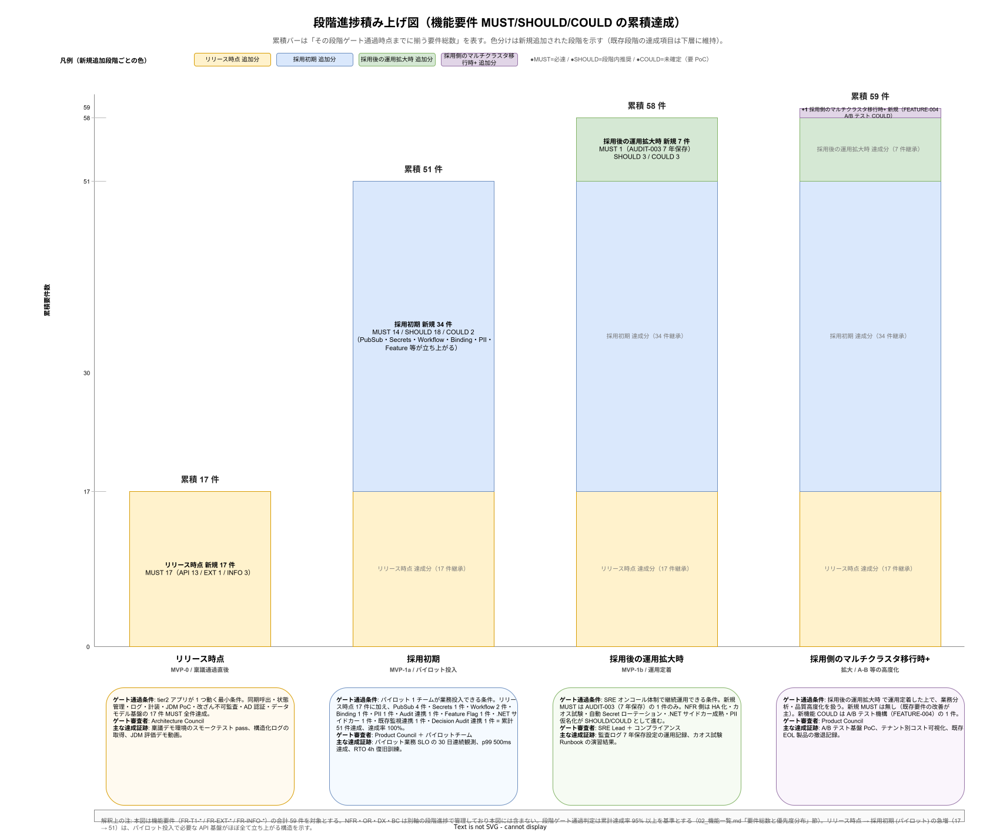

# 02. 企画要件マトリクス

本書は [../../01_企画/](../../01_企画/) で合意された事業ゴールと、要件定義書に記述した各要件との対応関係を明示する。「企画書のこのゴールは、どの要件で実現されるのか」「この要件を外すと、どの企画ゴールが危殆化するのか」の双方向トレースを可能にする。

## 本書の位置付け

企画書で合意した「OSS 積み上げで商用 PaaS 依存を脱する」「既存 .NET 資産と共存する」といった大目標は、要件定義段階で分解されて初めて実装可能になる。本書は大目標がどう分解されたかの履歴として、稟議後の軌道修正や追加投資判断の根拠となる。

## 企画書の事業ゴール（概要）

企画書（[../../01_企画/企画書.md](../../01_企画/企画書.md)）と ロードマップ（[../../01_企画/03_ロードマップと体制/](../../01_企画/03_ロードマップと体制/)）から抽出した主要ゴールを以下に整理する。

### G1: OSS 積み上げでベンダーロックイン回避

JTC の情報システム部門がクラウドマネージドサービスや商用 PaaS に過度依存せず、撤退可能性を保持する。

### G2: 既存 .NET Framework 資産との共存

全量書き換えを要求せず、既存業務アプリと新規 k1s0 アプリを並行稼働させる。

### G3: tier1 による 11 公開 API

Dapr Building Block を軸に、tier1 が State/PubSub/Workflow/Decision/Feature など 11 本の API を公開する。

### G4: 三層構造で責務分離

tier1（プラットフォーム）、tier2（ドメイン）、tier3（UI/アプリ）の責務分離と言語不可視性。

### G5: オンプレ・閉域・VM ベース

JTC データ主権と社内規程に適合する環境で完結する。

### G6: 5 年 TCO 3.68 億円（中規模）、年次 2,349 万円削減

商用 PaaS 採用比較での運用コスト削減と、定量的な ROI 実証。

### G7: パイロット合格によるスケール展開

Phase 1b でパイロット 1 本稼働、Phase 1c で運用体制確立、Phase 2 以降で横展開。

### G8: 法令・規程遵守と監査可能性

個人情報保護法、J-SOX、社内セキュリティ規程への整合と、外部監査対応。

### G9: ESG・サステナビリティへの寄与

電力効率、CO2 可視化、OSS コミュニティ貢献、人材持続性。

## 3 階層トレース構造（ゴール → BR → FR/NFR）

企画ゴールと機能要件の間には、業務要件（BR-\*）という中間層が存在する。ゴールは抽象的な事業目標（例: G3「tier1 11 公開 API」）、BR は業務側から見た必要性（例: BR-PLATUSE-001「tier2 開発者が Dapr 実装詳細を意識せず API 呼び出せる」）、FR/NFR は実装側の機能・非機能要件である。この 3 階層の対応が取れていないと、要件削除時に「業務影響の有無」が判定できず、要件追加時に「どの業務ゴールから来たのか」が追跡できない。BR × FR の詳細対応は [05_業務機能マトリクス.md](05_業務機能マトリクス.md) を参照。

各ゴールに対応する BR 群を以下に列挙する（本リストは BR 側の記述を一次ソースとし、四半期ごとに整合性を検証）。

| ゴール | 主要 BR | BR の概要 |
|---|---|---|
| G1 OSS 積み上げ | BR-PLATGOV-003, BR-PLATOPS-007 | 商用 PaaS ロックイン回避、撤退可能性保持 |
| G2 .NET 共存 | BR-PLATUSE-003 | .NET Framework 資産の段階的移行 |
| G3 tier1 11 公開 API | BR-PLATUSE-001, 002, 004, 005, 006, 007 | tier2 開発者体験、業務プロセス疎結合化、ルール駆動 |
| G4 三層構造 | BR-PLATGOV-002, BR-PLATUSE-002 | 責務分離、言語不可視性 |
| G5 オンプレ閉域 VM | BR-PLATGOV-001, BR-PLATOPS-007 | データ主権、既存インフラ共存 |
| G6 TCO 削減 | BR-PLATOPS-001, BR-PLATOPS-005 | 運用自動化、SLO 達成基盤 |
| G7 パイロット → 横展開 | BR-PLATOPS-002, BR-PLATOPS-003, BR-PLATOPS-006 | 運用安定性、定期処理統一、段階ロールアウト |
| G8 法令・監査 | BR-PLATGOV-004, BR-PLATGOV-001 | 監査証跡、テナント分離 |
| G9 ESG | （BC-SUS-\*が主、BR 側は未確定） | サステナビリティ寄与 |

## ゴール → 要件マトリクス

### G1: OSS 積み上げでベンダーロックイン回避

| 要件 ID | 要件タイトル |
|---|---|
| NFR-F-SYS-001 | オンプレミス完結 |
| BC-LIC-001〜007 | OSS ライセンス義務管理 |
| BC-SC-004 | 依存 OSS 調達経路 |
| OR-EOL-004 | OSS EOL 対応 |
| OR-EXIT-002 | 代替選択肢事前準備 |
| OR-EXIT-004 | ロックイン棚卸し |
| ADR-SEC-002 | OpenBao 採用（Vault BUSL 回避） |
| ADR-DATA-004 | Valkey 採用（Redis RSAL 回避） |

### G2: 既存 .NET Framework 資産との共存

| 要件 ID | 要件タイトル |
|---|---|
| NFR-D-MTH-001 | .NET Framework 共存方式 |
| FR-EXT-DOTNET-001 | サイドカー方式 |
| FR-EXT-DOTNET-002 | API Gateway 方式 |
| NFR-D-OBJ-001 | 既存監査ログの集約 |
| NFR-D-OBJ-002 | 既存メトリクス集約 |
| ADR-MIG-001 | サイドカー方式 ADR |
| ADR-MIG-002 | API Gateway 方式 ADR |

### G3: tier1 11 公開 API

| 要件 ID | 要件タイトル |
|---|---|
| FR-T1-INVOKE-001〜005 | Service Invoke API |
| FR-T1-STATE-001〜005 | State API |
| FR-T1-PUBSUB-001〜005 | PubSub API |
| FR-T1-SECRETS-001〜004 | Secrets API |
| FR-T1-BINDING-001〜004 | Binding API |
| FR-T1-WORKFLOW-001〜005 | Workflow API |
| FR-T1-LOG-001〜004 | Log API |
| FR-T1-TELEMETRY-001〜004 | Telemetry API |
| FR-T1-DECISION-001〜004 | Decision API |
| FR-T1-AUDIT-001〜003 / FR-T1-PII-001〜002 | Audit / PII API |
| FR-T1-FEATURE-001〜004 | Feature API |

### G4: 三層構造と責務分離

| 要件 ID | 要件タイトル |
|---|---|
| ADR-TIER1-001 | Go + Rust ハイブリッド |
| ADR-TIER1-002 | 内部通信 Protobuf gRPC |
| ADR-TIER1-003 | tier2/tier3 から言語不可視 |
| BC-GOV-004 | 役割責任（RACI） |
| BC-LGL-005 | 責任分界（社内 SLA） |

### G5: オンプレ・閉域・VM ベース

| 要件 ID | 要件タイトル |
|---|---|
| NFR-F-SYS-001 | オンプレミス完結 |
| NFR-F-SYS-002 | 閉域ネットワーク |
| NFR-F-SYS-003 | VM ベース |
| NFR-F-CHR-001〜003 | リソース・ストレージ・ネットワーク要件 |
| NFR-G-RES-001 | 国内保管 |

### G6: TCO 削減と ROI

| 要件 ID | 要件タイトル |
|---|---|
| BC-COST-001〜006 | コスト管理 |
| BC-BIL-001a / 001b / 002〜006 | 課金メータリング |
| NFR-B-RES-001 以下 | リソース拡張性 |
| DX-MET-001 | DORA Four Keys |

### G7: パイロット → スケール

| 要件 ID | 要件タイトル |
|---|---|
| NFR-D-PLN-001 | パイロット合格基準 |
| NFR-D-PLN-002 | リハーサル実施 |
| NFR-D-PLN-003 | 撤退計画 |
| NFR-D-TIM-001 | フェーズ別移行スケジュール |
| BC-ONB-001〜006 | テナントオンボーディング |
| BC-GOV-003 | ステージゲート |
| OR-EXIT-001 | 撤退判断基準 |

### G8: 法令遵守と監査可能性

| 要件 ID | 要件タイトル |
|---|---|
| NFR-E-PRE-001、NFR-E-RSK-001〜002、NFR-E-AC-001〜005、NFR-E-ENC-001〜003、NFR-E-MON-001〜004、NFR-E-NW-001〜004、NFR-E-AV-001〜002、NFR-E-WEB-001〜002、NFR-E-SIR-001〜003 | セキュリティ |
| NFR-G-CLS-001〜002、NFR-G-ENC-001〜003、NFR-G-AC-001〜002、NFR-G-RES-001、NFR-G-LIF-001〜002、NFR-G-PRV-001〜003、NFR-G-DES-001〜002、NFR-G-INT-001〜003 | データ保護とプライバシー |
| NFR-H-COMP-001〜004 | 法令・業界標準対応 |
| NFR-H-AUD-001〜002 | 監査ログ完整性・外部監査対応 |
| BC-LGL-001〜007 | 法務契約 |
| OR-INC-005 | 個人情報保護法対応通知 |

### G9: ESG・サステナビリティ

| 要件 ID | 要件タイトル |
|---|---|
| NFR-F-ECO-001〜003 | 電力効率・データサニタイズ・カーボン |
| BC-SUS-001〜007 | サステナビリティ |

## Phase 進捗の累積可視化

ゴール → 要件のマッピングが「何を作るか」を示すのに対し、本節は「いつ揃うか」の時間軸を示す。Phase 1a → 1b → 1c → 2+ の各ゲート通過時点で機能要件 MUST/SHOULD/COULD が累積でどこまで達成されるかを可視化することで、稟議審査において「Phase 1a で稟議通過直後に何が動いているか」「Phase 1b パイロット時点で何が揃っているか」を一目で説明可能にする。

図の読み方は次のとおりである。Phase 1a の累積 17 件は MVP-0 として「tier2 アプリが 1 つ動く」最小条件を成立させる。Phase 1b で 34 件が一気に追加され累積 51 件となるのは、パイロット業務投入に必要な PubSub・Secrets・Workflow・Binding・PII・Feature Flag といった API 基盤群が同時期に立ち上がる構造を反映する。Phase 1c で追加される MUST は AUDIT-003（7 年保存）の 1 件のみで、機能要件としてはほぼ完成し、以降は NFR 側の HA 化・カオス試験が中心となる。Phase 2+ は機能要件としては A/B テストの 1 件のみが COULD として残り、業務分析・品質高度化が主となる。

Phase ゲート通過判定は累積に対する達成率 95% 以上を基準とする（[../20_機能要件/02_機能一覧.md](../20_機能要件/02_機能一覧.md) 「要件総数と優先度分布」節）。本図と [../20_機能要件/02_機能一覧.md](../20_機能要件/02_機能一覧.md) は同じ集計を別視点で表現したもので、本図のバー高さと同節の累積件数は常に一致させる運用とする。

## 逆方向トレース（要件 → ゴール）

各要件ドキュメントの中で、関連ゴールへの参照を付与することを推奨する。ゴール ID（G1〜G9）は不変とし、新規ゴール追加時は既存 ID を変更しない。
