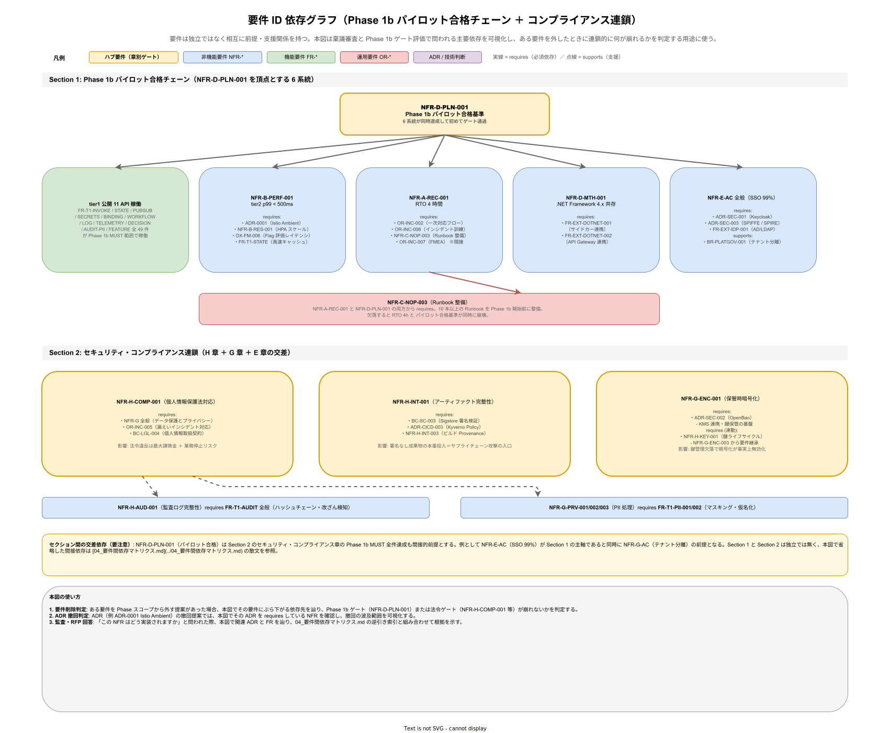

# 04. 要件間依存マトリクス

本書は k1s0 要件定義書内の要件どうしの依存関係を整理する。ある要件の達成が他の要件の前提となる場合、その依存を明示的に記録することで、変更時の影響分析と スコープ判断を機械的に行えるようにする。

## 本書の位置付け

要件は独立ではなく相互に参照・前提・矛盾する。例えば「RTO 4 時間」を達成するには「Runbook 整備」「オンコール体制」「バックアップ自動化」の複数要件が前提となる。本書はこのネットワーク構造を明示することで、リリース時点 でどの要件を先行させるべきか、ある要件を外すと何が危殆化するかを分析可能にする。

## 依存関係のタイプ

要件間依存は以下のタイプで表現する。

- **requires（必須依存）**: A requires B は「A を達成するには B が必須」
- **supports（支援依存）**: A supports B は「A は B の達成を助ける」（必須ではない）
- **conflicts（対立）**: A conflicts B は「A と B を同時満足は困難」
- **supersedes（置換）**: A supersedes B は「A は B の後継、旧要件 B は非推奨」

## 主要依存関係の構造図

下図は本書で散文・箇条書きで列挙する依存の中核部分（リリース時点 パイロット合格チェーン ＋ セキュリティ・コンプライアンス連鎖）を、要件 ID とその requires 関係で可視化したものである。本図を起点に詳細を散文で確認する読み方を推奨する。

Section 1 は NFR-D-PLN-001（パイロット合格基準）を頂点とし、6 系統が同時に達成されないとパイロット合格が成立しない構造を示す。NFR-A-REC-002（Runbook 充足率）が NFR-A-DR-001 と NFR-D-PLN-001 の両方から requires されるため、Runbook 不整備は RTO 4h 達成とパイロット合格基準の双方を同時に崩壊させる重大依存点である。Section 2 はセキュリティ・コンプライアンス連鎖で、NFR-H-COMP-001（個人情報保護法対応）が NFR-G-ENC-001〜003、NFR-G-AC-001〜002、NFR-G-PRV-001〜003 を requires しており、データ保護要件が実質的に法令対応の前提となる構造を示す。本図に表現しきれない詳細依存は本書の以降の節で散文展開する。

## 主要依存関係

### 可用性関連

- NFR-A-DR-001（RTO 4h）requires OR-INC-002（一次対応フロー）
- NFR-A-REC-001（復旧訓練）requires OR-INC-006（訓練）
- NFR-A-REC-002（Runbook 充足率）requires OR-INC-003（bus factor 2）
- NFR-A-DR-002（RPO 数秒）requires ADR-DATA-001（CloudNativePG レプリケーション）
- NFR-A-DR-002 requires NFR-C-NOP-002（自動バックアップ）

### パフォーマンス関連

- NFR-B-PERF-001（p99 < 500ms）requires ADR-0001（Istio Ambient）
- NFR-B-PERF-001 requires NFR-B-RES-001（HPA スケール）
- NFR-B-PERF-001 requires DX-FM-006（Flag 評価レイテンシ）
- NFR-B-PERF-001 supports DX-MET-004（CI/CD 時間）
- NFR-B-PERF-001 requires FR-T1-STATE-001〜004（高速キャッシュ設計）

### セキュリティ関連

- NFR-E-AC-001〜005 requires ADR-SEC-001（Keycloak）
- NFR-E-AC-001〜005 requires ADR-SEC-003（SPIFFE）
- NFR-G-ENC-001 requires ADR-SEC-002（OpenBao）
- NFR-G-ENC-003 requires NFR-H-KEY-001（鍵ライフサイクル）
- NFR-H-INT-001 requires BC-SC-003（Sigstore）
- NFR-H-INT-001 requires ADR-CICD-003（Kyverno）
- OR-INC-005 requires NFR-G-PRV-003（漏えい通知）
- OR-INC-005 requires BC-LGL-004（個人情報取扱）

### 運用関連

- OR-INC-002 requires OR-INC-007（FMEA）
- OR-INC-002 requires OR-SUP-003（セルフサービスドキュメント：Runbook 含む）
- OR-INC-004（ポストモーテム）supports BC-ANA-004（障害トレンド分析）
- OR-EOL-001（SemVer）requires DX-TEST-004（契約テスト）
- OR-EOL-003（移行支援）requires OR-EOL-006（互換性マトリクス）
- OR-ENV-002（GitOps）requires ADR-CICD-001（Argo CD）
- OR-ENV-003（環境昇格）requires OR-ENV-006（バリデーション）

### 開発者体験関連

- DX-GP-001（Backstage Template）requires ADR-BS-001
- DX-GP-001 supports BC-ONB-005（教育とサンプル）
- DX-LD-003（tier1 API モック）requires DX-TEST-002（単体テスト）
- DX-MET-001（DORA）requires BC-ANA-002（KPI 定義）
- DX-FM-004（段階ロールアウト）requires ADR-CICD-002（Argo Rollouts）
- DX-FM-004 supports NFR-D-MTH-002（段階リリース）

### 事業契約関連

- BC-ONB-003（自動プロビジョニング）requires OR-ENV-002（GitOps）
- BC-ONB-003 requires NFR-E-AC-002（RBAC 自動化）
- BC-COST-004（テナント別コスト）requires BC-BIL-001a（メータリング基盤・基本 4 メトリック）
- BC-LIC-004（AGPL 分離）requires ADR-0003
- BC-LIC-004 requires BC-LIC-002（SBOM）
- BC-SC-001（SLSA）requires BC-SC-003（Sigstore）
- BC-SC-001 requires NFR-H-INT-003（ビルド Provenance）
- BC-AI-003（AI 生成コード検証）requires DX-TEST-007（セキュリティテスト）

### 移行関連

- NFR-D-PLN-001（パイロット合格基準）requires NFR-B-PERF-001
- NFR-D-PLN-001 requires NFR-A-DR-001（RTO 4h）
- NFR-D-PLN-001 requires NFR-A-REC-002（Runbook 10+）
- NFR-D-PLN-001 requires 20_機能要件/02_機能一覧.md の リリース時点 MUST 群
- NFR-D-PLN-003（撤退計画）requires OR-EXIT-002（代替選択肢）

### コンプライアンス関連

- NFR-H-COMP-001（個人情報保護法）requires NFR-G-ENC-001〜003、NFR-G-AC-001〜002、NFR-G-PRV-001〜003、NFR-G-LIF-001〜002
- NFR-H-COMP-001 requires OR-INC-005
- NFR-H-COMP-001 requires BC-LGL-004
- NFR-H-AUD-001（監査ログ完整性）requires FR-T1-AUDIT-001〜003
- NFR-H-AUD-002（外部監査対応）requires BC-ANA-006（監査レポート）

## リリース時点 パイロット合格に向けた依存チェーン

NFR-D-PLN-001 のパイロット合格を達成するための依存要件を展開する。

1. **tier1 公開 API 11 本稼働**: 20_機能要件/02_機能一覧.md の リリース時点 MUST 群
2. **NFR-B-PERF-001 達成**: Istio Ambient、リソース設計、キャッシュ、監視
3. **NFR-A-DR-001 / NFR-A-REC-002 達成**: RTO 4h、Runbook、オンコール、訓練、FMEA
4. **運用体制**: OR-INC-001〜007、OR-SUP-001〜006、OR-ENV-001〜006 の リリース時点 項目
5. **.NET 共存検証**: NFR-D-MTH-001、FR-EXT-DOTNET-001〜002
6. **SSO 成功率**: FR-EXT-IDP-001〜002、NFR-E-AC-001〜003、ADR-SEC-001（Keycloak）

これらは全て直接または間接に NFR-D-PLN-001 に依存している。リリース時点 スコープから漏れた要件があると、パイロット合格基準が崩れる。

## 対立と優先順位

一部の要件間には緊張関係がある。

- **NFR-B-PERF-001（低レイテンシ）vs NFR-E-ENC-003（アプリ層暗号化）**: 暗号化はレイテンシを増やす。対応: フィールドレベル暗号化で最小化、キャッシュで緩和。
- **DX-GP-003（10 分ルール）vs NFR-E-AC-001〜005（厳格な認可）**: セキュリティが強いと初期セットアップが遅くなる。対応: 開発環境は緩め、staging/prod で厳格化。
- **OR-EOL-001（SemVer 厳守）vs BC-ONB-001（Express 種別セルフサービス）**: 破壊的変更を慎重に扱うと機能追加ペースが遅くなる。対応: Feature Flag で段階公開。

対立項目は Product Council で優先順位を都度判断、ADR として記録する。

## 主要 NFR → 実装 FR 逆引き索引

非機能要件がどの機能要件によって実現されるかを逆引きできる形で示す。この索引は「NFR を外すと何が壊れるか」「FR を追加する時どの NFR が関連するか」の両方向分析で利用する。全 NFR の網羅ではなく、採用検討通過・リリース時点 パイロットに影響の大きい主要 NFR のみ対象とする。

### 可用性・性能

| NFR | 実装する FR | 実現手段 |
|---|---|---|
| NFR-A-CONT-001（対外 SLA 99%） | FR-T1-INVOKE-001、FR-T1-STATE-001、FR-T1-PUBSUB-001、FR-T1-WORKFLOW-001 | tier1 ファサードの HA 構成、自動フェイルオーバー、Runbook 整備 |
| NFR-A-DR-001（RTO 4h） | FR-T1-LOG-001、FR-T1-TELEMETRY-002、FR-T1-AUDIT-002 | 障害検知と原因特定の構造化（ログ/トレース/監査連鎖） |
| NFR-B-PERF-001（tier2 p99 < 500ms） | FR-T1-INVOKE-001、FR-T1-STATE-001 | Istio Ambient、キャッシュ設計、コネクションプーリング |
| NFR-B-PERF-004（Decision p99 < 1ms） | FR-T1-DECISION-001、FR-T1-DECISION-004 | ZEN Engine in-process 評価、ホットリロード |
| NFR-B-PERF-006（計装 10ms 以内） | FR-T1-TELEMETRY-001〜003、FR-T1-LOG-001 | OpenTelemetry SDK の非同期送信、Collector バッファリング |

### セキュリティ

| NFR | 実装する FR | 実現手段 |
|---|---|---|
| NFR-E-AC-001（JWT 認証強制） | FR-T1-INVOKE-005、FR-T1-STATE-003、FR-T1-PUBSUB-005 | tier1 ファサードでの JWT 検証、認証トークン伝搬 |
| NFR-E-AC-003（tenant_id 検証） | FR-T1-INVOKE-005、FR-T1-STATE-003、FR-T1-PUBSUB-005、FR-T1-LOG-003 | metadata への自動挿入、越境拒否 |
| NFR-E-ENC-003（PII マスキング・仮名化） | FR-T1-PII-001、FR-T1-LOG-001、FR-T1-DECISION-003 | `pii:true` 属性の自動マスキング |
| NFR-E-MON-001（特権操作 Audit） | FR-T1-AUDIT-001〜003 | ハッシュチェーン記録、改ざん検知、7 年保存 |
| NFR-E-SIR-002（漏えい報告義務） | FR-T1-PII-001、FR-T1-AUDIT-001 | マスキング強制と監査証跡による影響範囲特定 |

### 運用・統制

| NFR | 実装する FR | 実現手段 |
|---|---|---|
| NFR-C-NOP-001（監視と可視化） | FR-T1-PUBSUB-003、FR-T1-PUBSUB-004、FR-T1-TELEMETRY-001 | Kafka Consumer Lag メトリクス、DLQ 監視 |
| NFR-A-REC-002（Runbook 充足率） | FR-T1-WORKFLOW-003、FR-T1-AUDIT-002 | 再現可能な復旧手順、自動化可能な箇所の識別 |
| NFR-H-AUD-001（監査ログ完整性） | FR-T1-AUDIT-001〜003 | SHA-256 ハッシュチェーン、MinIO Object Lock |
| NFR-H-COMP-001（個人情報保護法） | FR-T1-PII-001〜002、FR-T1-AUDIT-001、FR-T1-LOG-003 | マスキング・仮名化・Audit・tenant_id 強制の多層防御 |

### 逆引き索引の使い方

**NFR を外す判断時**: 例として NFR-B-PERF-001 を リリース時点 から外す提案があった場合、本索引から FR-T1-INVOKE-001 / FR-T1-STATE-001 の品質基準セクションを確認し、「500ms 未達でも tier2 業務継続が可能か」を Product Council で判断する。

**新規 FR 追加時**: 例として 採用後の運用拡大時 で新規 API（例: Graph API）を追加する際、本索引の NFR 列を全件確認し、該当する NFR に新 FR を追加する必要があるかを点検する。抜け漏れがあれば新 FR の品質基準で補足する。

**監査・RFP 対応時**: 「この NFR はどう実装されていますか」と問われた際、本索引の FR 列と「実現手段」列をそのまま回答できる。

## メンテナンス

新規要件追加時に本書を更新する。要件間依存の記述は「A requires B」の形式で、1 行ずつ追記する。四半期ごとに Product Council で全依存関係をレビュー、循環依存や過剰依存を検出して整理する。逆引き索引は主要 NFR 単位で年 2 回棚卸しする。
