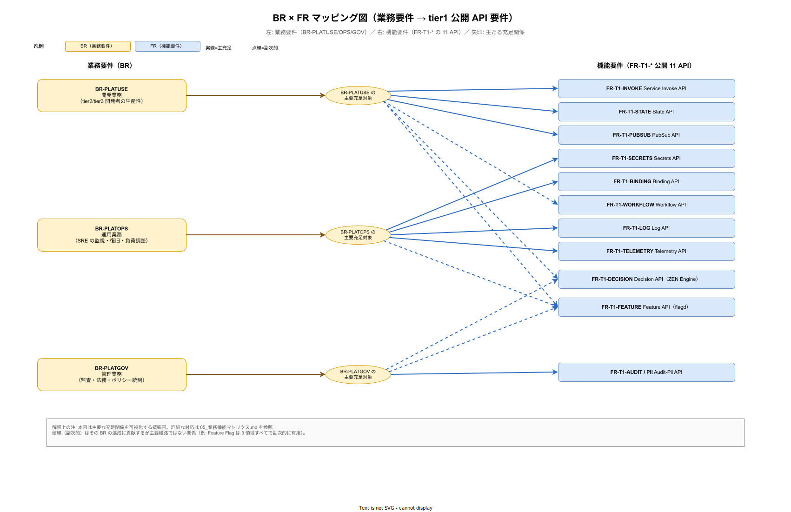

# 05. 業務要件 × 機能要件マトリクス

本書は業務要件（BR-\*）と機能要件（FR-\*）・非機能要件（NFR-\*）の対応関係を可視化する。[02_企画要件マトリクス.md](02_企画要件マトリクス.md) がゴール（G1〜G9）と要件の対応を扱うのに対し、本書は中間層の BR を介した詳細マッピングを提供する。「この業務要件は本当に機能要件から実装されるのか」「この機能要件は本当に業務ニーズから導出されたのか」の双方向検証を可能にする。

## 本書の位置付け

要件削除時に「この機能を削除して業務影響があるか」を判定するには、機能要件から業務要件への逆リンクが必要である。同時に、新規機能要件を追加する際に「この機能はどの業務ニーズから来たのか」を明示しないと、エンジニアリング都合で要件が肥大化する。本マトリクスはこの逆リンクを索引として機械検証可能な形で提供する。

BR-\* は [10_業務要件/](../10_業務要件/) で散文中に括弧書き参照の形式で記述されている（例:「tier2 開発者は Dapr の実装詳細を意識せず API を呼べる（BR-PLATUSE-001）」）。本書はその散文を要件ごとに集約し、FR/NFR との双方向関係を明示する。

## BR 一覧と概要

業務要件は以下の 3 サブカテゴリに分類される。

- **BR-PLATUSE-\***: プラットフォーム利用（tier2 開発者視点の業務ニーズ）
- **BR-PLATOPS-\***: プラットフォーム運用（SRE・運用担当視点の業務ニーズ）
- **BR-PLATGOV-\***: プラットフォーム統制（監査・経営・セキュリティ視点の業務ニーズ）

下図は 3 サブカテゴリの BR と tier1 公開 11 API（FR-T1-\*）の主要な充足関係を可視化したものである。後述の表セルに展開された対応関係を、構造として一望することで「業務要件 1 件あたり何本の API が動員されるか」「ある API を外したときに直接影響を受ける BR はどれか」を素早く把握できる。



実線は主たる充足関係、点線はその BR の達成に貢献するが主要経路ではない副次的関係を示す。例として Feature Flag（FR-T1-FEATURE-001〜004）は 3 領域すべてで副次的に利用される横串性質を持ち、Audit / PII API（FR-T1-AUDIT-001〜003、FR-T1-PII-001〜002）は PLATGOV からの主充足である一方で PLATOPS の障害調査でも活用される。詳細な対応行は次節以降の表で確認する。

### BR-PLATUSE-\*（プラットフォーム利用）

| BR ID | 業務ニーズ | 対応 FR | 対応 NFR |
|---|---|---|---|
| BR-PLATUSE-001 | tier2 開発者が Dapr の実装詳細（AppID・metadata ヘッダ等）を意識せず API を呼び出せること。接続管理・プール設定・認証等の重複実装を撲滅する | FR-T1-INVOKE-001、FR-T1-STATE-001〜002 | NFR-C-NOP-001、DX-GP-001 |
| BR-PLATUSE-002 | 認証・トレース・テナント分離が透過的に行われ、tier2 開発者がサービス開発に集中できること | FR-T1-INVOKE-003、FR-T1-INVOKE-005、FR-T1-LOG-002〜003、FR-T1-TELEMETRY-001〜002 | NFR-E-AC-001、NFR-E-AC-003、NFR-B-PERF-006 |
| BR-PLATUSE-003 | .NET Framework 4.x 資産との共存を、全量書き換え無しで実現できること | FR-T1-INVOKE-002、FR-EXT-DOTNET-001〜002 | NFR-D-MTH-001、NFR-D-OBJ-001〜002 |
| BR-PLATUSE-004 | 業務プロセスの疎結合化により、tier2 アプリ同士が独立してリリース可能であること | FR-T1-PUBSUB-001〜003 | NFR-A-CONT-003、NFR-B-RES-003 |
| BR-PLATUSE-005 | tier2 の外部通知・ファイル保管が統一インタフェースで提供されること | FR-T1-BINDING-001〜003 | NFR-E-NW-003（allowlist） |
| BR-PLATUSE-006 | 業務プロセス（稟議・督促・遅延処理）の長期実行と状態保持が、Pod 再起動で失われないこと | FR-T1-WORKFLOW-001〜005 | NFR-A-FT-003、NFR-I-SLO-006 |
| BR-PLATUSE-007 | ビジネスルールの変更がコードデプロイ無しに迅速に反映されること | FR-T1-DECISION-001〜002、FR-T1-DECISION-004 | NFR-B-PERF-004、NFR-C-MGMT-001 |

### BR-PLATOPS-\*（プラットフォーム運用）

| BR ID | 業務ニーズ | 対応 FR | 対応 NFR |
|---|---|---|---|
| BR-PLATOPS-001 | 監視・計装基盤が統一され、Consumer/API サーバ等のスケールアウトが自動化されること | FR-T1-TELEMETRY-003、FR-T1-PUBSUB-003 | NFR-B-RES-001、NFR-B-RES-003、NFR-C-NOP-001 |
| BR-PLATOPS-002 | 障害時の迅速な切戻が可能であり、障害の連鎖伝播が構造的に防止されること | FR-T1-INVOKE-004、FR-T1-FEATURE-001、FR-T1-FEATURE-003 | NFR-A-CONT-003、NFR-A-FT-001 |
| BR-PLATOPS-003 | 定期処理・設定管理が統一 UI で可視化され、属人的運用を撲滅すること | FR-T1-BINDING-004、FR-T1-DECISION-004 | NFR-C-MGMT-001〜003 |
| BR-PLATOPS-004 | 障害調査で「いつ誰が何を呼んだか」が数分で追跡可能であること | FR-T1-LOG-001〜002、FR-T1-LOG-004、FR-T1-TELEMETRY-002、FR-T1-TELEMETRY-004 | NFR-C-IR-001〜002 |
| BR-PLATOPS-005 | SLO 達成判定の基準データが Phase 1a から継続的に記録されること | FR-T1-TELEMETRY-001〜003 | NFR-I-SLI-001、NFR-I-SLO-001〜003 |
| BR-PLATOPS-006 | 新機能の段階ロールアウトと障害時の即時切戻が可能であること | FR-T1-FEATURE-001〜002、FR-T1-FEATURE-004 | DX-FM-001〜007 |
| BR-PLATOPS-007 | 既存 IAM（AD/LDAP）・監視・バックアップ基盤との共存運用が可能であること | FR-EXT-IDP-001〜002、FR-EXT-MON-001、FR-EXT-BACKUP-001 | NFR-D-OBJ-001〜003 |

### BR-PLATGOV-\*（プラットフォーム統制）

| BR ID | 業務ニーズ | 対応 FR | 対応 NFR |
|---|---|---|---|
| BR-PLATGOV-001 | テナント越境アクセスが構造的に防止され、検出時は即座にブロックされること | FR-T1-STATE-001、FR-T1-PUBSUB-005、FR-T1-LOG-003、FR-INFO-TENANTMODEL-001 | NFR-E-AC-003、NFR-G-AC-001〜002 |
| BR-PLATGOV-002 | データモデル・ルール評価の一貫性が確保され、後付けでの整合性補正を不要にすること | FR-T1-STATE-005、FR-T1-DECISION-002、FR-T1-WORKFLOW-002〜003、FR-INFO-LOGMODEL-001、FR-INFO-AUDITMODEL-001、FR-INFO-CONFIGMODEL-001 | NFR-D-OBJ-003 |
| BR-PLATGOV-003 | Secret 直書きコードが撲滅され、漏えい時のレピュテーションリスクが最小化されること | FR-T1-SECRETS-001〜003、FR-T1-PII-001〜002 | NFR-E-ENC-001〜003、NFR-G-PRV-001〜003 |
| BR-PLATGOV-004 | 全業務操作に改ざん不可能な監査証跡が付き、個人情報保護法・J-SOX 監査で即時提出可能であること | FR-T1-AUDIT-001〜003、FR-T1-DECISION-003、FR-T1-SECRETS-004、FR-T1-BINDING-001 | NFR-H-AUD-001〜002、NFR-G-LIF-001〜002 |

## BR 側散文の参照方式

上表の各 BR は [10_業務要件/](../10_業務要件/) の散文の中で初出時に「業務ニーズ（BR-XXXX-NNN）」の形式で定義される。散文定義を一次ソースとし、本書はそれを集約した索引として機能する。散文と本書が乖離した場合は散文を優先するが、本書の更新漏れが発生しないよう、四半期ごとに `grep` で一致検証する運用とする。

```bash
# BR 定義の抽出（散文括弧書き）
grep -rnhoE "（BR-(PLATUSE|PLATOPS|PLATGOV)-[0-9]+）" docs/03_要件定義/10_業務要件/ \
  | sort -u
```

## 逆方向トレースの運用

各 FR/NFR の詳細ファイル（例: [../20_機能要件/10_tier1_API要件/01_Service_Invoke_API.md](../20_機能要件/10_tier1_API要件/01_Service_Invoke_API.md)）の冒頭に「業務根拠」セクションを設け、対応する BR を明示する運用とする。[../20_機能要件/02_機能一覧.md](../20_機能要件/02_機能一覧.md) の「業務根拠」列も本書と整合させる。要件追加時の PR レビューで、BR 側への反映漏れを検出する。

## 不足 BR の検出

[../20_機能要件/02_機能一覧.md](../20_機能要件/02_機能一覧.md) の業務根拠列で未確定や仮置きが発生した FR は、本節で不足として検出する。現行版では未確定項目は存在しない。今後不足が発生した場合は、次回 Product Council レビューで BR 側の追記または FR 側の優先度見直しを判定する。

## メンテナンス

本書は要件追加・削除時に必ず更新する。BR 追加時は該当サブカテゴリの表に行を追加、FR/NFR 追加時は該当する BR 行の「対応 FR」「対応 NFR」列を更新する。四半期ごとに以下の網羅性チェックを実施する。

- 全 FR が少なくとも 1 つの BR から参照されているか（孤児 FR の検出）
- 全 BR が少なくとも 1 つの FR/NFR で実装されているか（実装されない BR の検出）
- 本書と散文定義の BR ID 集合が一致しているか（定義漏れ・索引漏れの検出）
