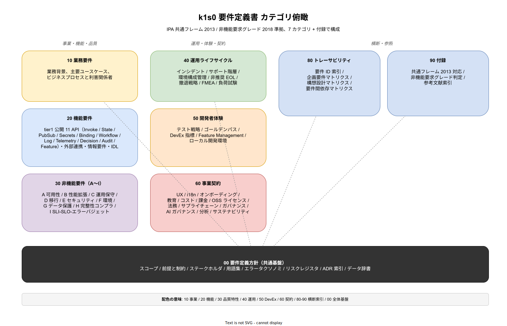

# k1s0 要件定義書

本ドキュメントは k1s0 プラットフォーム開発における要件定義書である。企画書（[../01_企画/](../01_企画/)）で合意された事業目的と、構想設計（[../02_構想設計/](../02_構想設計/)）で決定した技術骨格を受け、IPA（独立行政法人 情報処理推進機構）が提示する標準プロセスに準拠して「何を作るか」を定義する。

## 本書の位置付け

k1s0 は日本大手企業（採用側組織）の情報システム部門向けに、オンプレミス完結・OSS 積み上げで構築するマイクロサービス基盤である。tier1 が State/PubSub/Workflow/RuleEngine などの 11 API を公開し、tier2 のドメインロジックと tier3 のアプリ配信ポータルを支える三層構造をとる。既存 .NET Framework 資産と共存しつつ、ベンダーロックインを回避することが事業目的である。

要件定義書は、この事業目的を満たすために「tier1 がどこまでの機能を提供するのか」「非機能としてどの水準を約束するのか」「誰がどのように検収するのか」を、採用検討通過後に着手する構想設計・基本設計・詳細設計の上流基準として固定化する。数値や条件に曖昧さを残すと、後続段階で判断が発散し、結果として OpenShift などの商用 PaaS に舞い戻る圧力が生じる。本書は、その発散を防ぐための契約文書である。

## IPA 準拠の方針

本書は以下 2 つの IPA 基準を骨格として採用する。

- **共通フレーム 2013（SLCP-JCF2013）**: ソフトウェアライフサイクルプロセスの業界標準。要件定義プロセス（業務要件 → システム機能要件 → 非機能要件）の章立てをこの基準に合わせる。
- **非機能要求グレード 2018**: システム基盤の非機能要件を「可用性／性能・拡張性／運用・保守性／移行性／セキュリティ／システム環境・エコロジー」の 6 大項目・約 230 小項目で構造化した IPA 公式資料。30_非機能要件/ 配下の章立てはこのグレードに準拠する。

k1s0 はプラットフォーム製品であり、IPA が主に想定する業務システムとは性格が異なる。そのため「業務要件」は *tier2/tier3 開発チームが k1s0 基盤を使って業務システムを構築する* という開発業務を主語として読み替える。読み替えの具体は [00_要件定義方針/01_要件定義プロセス.md](00_要件定義方針/01_要件定義プロセス.md) に記述する。

## ドキュメント構造

10 カテゴリ構造で要件を分類する。番号帯は共通フレーム 2013 の要件定義プロセスと対応付け、読み順は番号順で完結するよう設計した。カテゴリの俯瞰は以下の図に示す。



カテゴリは「事業・機能・品質」（左列: 10/20/30）、「運用・体験・契約」（中列: 40/50/60）、「横断・参照」（右列: 80/90）、「共通基盤」（底部: 00）の 4 グループに読み替えられる。00 は全カテゴリから参照される前提・制約・用語集・エラータクソノミ等を集める共通基盤であり、他カテゴリを読む前にまず目を通すべき層。80 と 90 は要件本体ではなく、索引とトレーサビリティを担う支援層である。

```text
03_要件定義/
├── README.md                           # 本書
├── 00_要件定義方針/                    # 要件定義プロセスの定義・横断基盤
├── 10_業務要件/                        # k1s0 が支える業務の定義
├── 20_機能要件/                        # 機能要件（tier1 11 API を含む）
├── 30_非機能要件/                      # IPA 非機能要求グレード 6 大項目 + 拡張
├── 40_運用ライフサイクル/              # インシデント・サポート・EOL・撤退
├── 50_開発者体験/                      # テスト戦略・devex・Feature Management
├── 60_事業契約/                        # UX・i18n・コスト・ライセンス・ガバナンス
├── 70_プロジェクト管理/                # 体制・WBS・QA・テスト・移行計画
├── 80_トレーサビリティ/                # 企画・構想設計との紐付け
└── 90_付録/                            # IPA 対応表・参考文献
```

### 00_要件定義方針

要件定義作業そのものをどう進めるかの手続論を記述する。プロセス図、ステークホルダー、前提と制約、用語集、要件 ID 体系とトレーサビリティ方針を格納する。本カテゴリは要件本体ではなく「要件をどう記述・合意・検収するか」のメタ文書である。

### 10_業務要件

k1s0 を使って解決する業務を記述する。採用側組織の情シスが社内業務システムを開発・運用する活動を「業務」として捉え、登場人物、現状の痛み、k1s0 導入後の業務プロセス、業務フロー、関連する組織とロールを散文で展開する。機能の仕様には踏み込まず、なぜその機能が必要かの根拠を提供する層である。

### 20_機能要件

k1s0 が提供する機能の要件を記述する。まずシステム化範囲（やる／やらない）を確定し、全機能一覧をインデックス化し、tier1 が公開する 11 API を 1 API 1 ファイルで詳述する。外部連携（レガシー .NET Framework、外部 IdP 等）と情報要件（論理データモデル）を併せて格納する。

### 30_非機能要件

IPA 非機能要求グレード 2018 に準拠した 6 大項目（A 可用性／B 性能・拡張性／C 運用・保守性／D 移行性／E セキュリティ／F システム環境・エコロジー）で記述する。各大項目 1 ファイルを基本とし、300 行を超える項目は中項目単位のサブフォルダに分割する。社会的影響度に応じたグレード判定（モデルシステム①〜③相当）は 90_付録/02_非機能要求グレード判定.md に集約する。

### 40_運用ライフサイクル

稼働後の運用プロセスを定義する。障害検知からリカバリまでのインシデント対応手順、利用者からの問い合わせを受け止めるサポート階層、機能やコンポーネントの非推奨化と廃止、失敗時の撤退戦略、環境別の設定管理方針を格納する。本カテゴリは「稼働後にどう回すか」の契約であり、情シス運用部門が最終合意する。

### 50_開発者体験

tier2/tier3 開発チームが k1s0 基盤を利用して業務アプリを構築する際の生産性基準を定義する。テスト戦略（単体・結合・E2E・契約・カオス）、開発者体験（Backstage / Golden Path / セルフサービス）、Feature Management 運用、ローカル開発環境と CI/CD 連携を格納する。本カテゴリは「開発者にとってどれだけ楽か」の約束であり、tier2/tier3 のリードエンジニアが合意する。

### 60_事業契約

事業運営・契約・ガバナンスに関わる非技術要件を定義する。UX 方針、国際化、テナントオンボーディング、教育・トレーニング、コスト管理、OSS ライセンス義務、課金メータリング、法務契約、サプライチェーン、ガバナンス、AI ガバナンス、分析、サステナビリティを格納する。本カテゴリは経営層・法務・調達・CSR 部門が合意する。

### 70_プロジェクト管理

プロジェクトの遂行に関わる計画・体制・品質保証・移行計画を記述する。体制と役割（RACI）、WBS と工程表、QA 計画、テスト計画、移行計画を格納する。本カテゴリは「何を作るか」ではなく「どう作るか・誰が作るか・どう品質を担保するか・どう本番に載せるか」を規定し、リリース時点 採用検討通過後の実行段階で継続参照される。PMO・PM・QA・移行チームが合意する。

### 80_トレーサビリティ

上流（企画）と下流（構想設計・基本設計以降）への紐付けを一元管理する。要件 ID 索引、企画ゴールとの対応マトリクス、構想設計コンポーネントとの対応マトリクスを格納する。要件追加・変更が発生した際はこのカテゴリで影響範囲を追跡する。

### 90_付録

IPA 共通フレーム 2013 プロセスとの対応表、非機能要求グレードの判定根拠、参考文献を格納する。監査対応や採用検討説明時にエビデンスとして参照する。

## 読み順と利用シーン

本書は初学者が通読する場合と、申請・監査・設計レビューで特定箇所を参照する場合の 2 種類の利用シーンを想定する。

通読する場合は 00 → 10 → 20 → 30 → 40 → 50 → 60 → 70 → 80 → 90 の順に読むことで、プロセス定義 → 業務 → 機能 → 非機能 → 運用 → 開発体験 → 事業契約 → プロジェクト管理 → トレーサビリティ → エビデンスと、IPA 共通フレーム 2013 の要件定義活動をなぞる構造になっている。部分参照する場合は、以下を目安に該当カテゴリへ飛ぶ。

- **採用検討資料に添付する機能範囲の証跡**: 20_機能要件/01_システム化範囲.md と 02_機能一覧.md
- **SLA 交渉・SLO 策定**: 30_非機能要件/A_可用性.md と B_性能拡張性.md
- **情報セキュリティ監査対応**: 30_非機能要件/E_セキュリティ.md と 90_付録/02_非機能要求グレード判定.md
- **構想設計・基本設計着手時の上流参照**: 80_トレーサビリティ/03_構想設計マトリクス.md
- **運用契約・サポート体制合意**: 40_運用ライフサイクル/ 配下一式
- **開発チーム合意・DevEx 基準**: 50_開発者体験/ 配下一式
- **法務・調達・CSR 合意**: 60_事業契約/ 配下一式
- **PM・QA・移行計画**: 70_プロジェクト管理/ 配下一式

## 要件 ID 体系

全要件は一意の要件 ID を付与し、企画・構想設計・後続設計工程と双方向トレースを可能にする。ID 体系の詳細は [00_要件定義方針/05_要件トレーサビリティ方針.md](00_要件定義方針/05_要件トレーサビリティ方針.md) を参照。本書内の記述例は以下。

- `FR-T1-STATE-001`: 機能要件（Functional Requirement）/ tier1 / State API / 通番
- `NFR-A-CONT-001`: 非機能要件（Non-Functional Requirement）/ 可用性 / 継続性 / 通番
- `NFR-E-SIR-003`: 非機能要件 / セキュリティ / セキュリティインシデント対応 / 通番
- `BR-PLATOPS-002`: 業務要件（Business Requirement）/ プラットフォーム運用 / 通番

## 改訂と合意プロセス

本書は段階ごとに版を刻む。リリース時点（採用検討時点）では 採用初期/1a/1b スコープに関する要件のみを合意対象とし、採用後の運用拡大時に関する要件は参考値扱いで記述する。主要な変更（スコープ追加・SLO 数値変更・優先度昇降）はステークホルダーとの合意ログを残し、影響を受ける構想設計 ADR と連動させる。改訂ルールの詳細は [00_要件定義方針/01_要件定義プロセス.md](00_要件定義方針/01_要件定義プロセス.md) の改訂フロー節に記述する。
