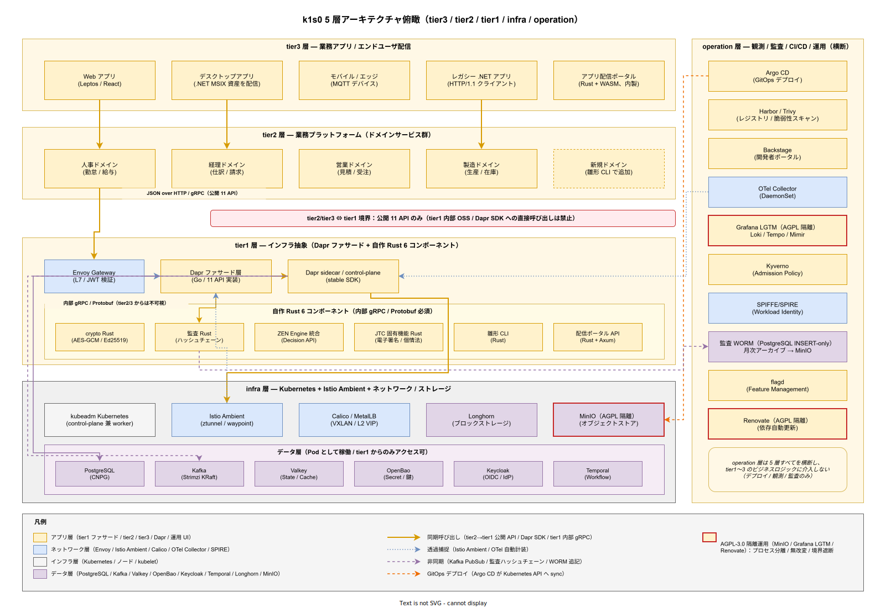

# 02. ソフトウェア方式設計（全体分担）

本ファイルは IPA 共通フレーム 2013 の **6.4.3.2 ソフトウェア方式設計** に対応する。k1s0 を構成するソフトウェアを「自社開発」「OSS 採用（セルフマネージド）」「パッケージ利用（非採用）」の 3 区分に分け、各コンポーネントの責務と担当境界を確定する。

## 本ファイルの位置付け

プラットフォーム製品では「どのコードを自社で書き、どの OSS を持ち込み、どこに商用パッケージの SaaS を組み合わせるか」という分担設計が、その後の保守体制・ライセンス制約・運用工数を 10 年単位で固定する。分担が曖昧なまま実装に入ると、「同じ機能を OSS と自作で二重に持つ」「OSS の制限に気づかず自社コードが肥大化する」といった事故が発生し、運用 採用側の小規模運用で約束した工数が破綻する。

本ファイルはこれを上流で防ぐため、tier1 / tier2 / tier3 / infra / operation の 5 層 × 機能領域（ネットワーク / 計算 / ストレージ / 観測 / CI/CD / セキュリティ / 認証）のマトリクスに対して、各セルの**ソフトウェア種別と担当**を一意に確定する。構想設計 [../../02_構想設計/03_技術選定/](../../02_構想設計/03_技術選定/) で ADR として採用が確定した OSS 集合を、方式設計書本体として再整理する役割に徹する。

方式の選定根拠（なぜ Valkey か、なぜ Istio Ambient か、なぜ ZEN Engine か）は構想設計 ADR に既に記述されているため、本ファイルでは**何を採用したか**と**どの層の誰が保守するか**のみを記述する。

## ソフトウェア 3 区分の定義

k1s0 を構成するソフトウェアは以下 3 区分に大別される。区分の判定基準を事前に固定することで、新規コンポーネント追加時の分類揺れを防ぐ。

**自社開発**: k1s0 プロジェクトチームが Git リポジトリで管理し、ソースコードから成果物をビルド・配布するコンポーネント。tier1 の Dapr ファサード層（Go）、tier1 の自作 Rust 領域（crypto / 監査ハッシュチェーン / ZEN Engine 統合 / 採用側組織の固有機能）、雛形 CLI（Rust）、アプリ配信ポータル（Rust + WebAssembly フロントエンド）の 4 つが該当する。

**OSS 採用（セルフマネージド）**: 既存 OSS をそのままバイナリまたはコンテナイメージで取り込み、k1s0 クラスタ内で稼働させるコンポーネント。自社で改変せず、アップストリームのリリースサイクルに追従する。Dapr / Istio Ambient / Apache Kafka（Strimzi Operator）/ PostgreSQL（CloudNativePG）/ Valkey / MinIO / Longhorn / OpenBao / Keycloak / Argo CD / Harbor / Trivy / Grafana LGTM / OTel Collector / flagd / ZEN Engine（ライブラリとして Rust 領域にリンク）/ Temporal / Kyverno / Renovate / SPIFFE/SPIRE / Backstage / MetalLB が該当する。

**パッケージ利用（非採用）**: 本プロジェクトでは採用しない。クラウドマネージド SaaS（AWS RDS / Azure Managed PostgreSQL / Confluent Cloud / Auth0 等）、有償パッケージ（Oracle DB / Splunk / ServiceNow 等）はすべて不採用とする。これは企画書の差別化戦略「オンプレミス完結 / OSS 積み上げ」および原則 10「オンプレ完結を前提とする」に基づく厳格な方針であり、採用後の運用拡大時も維持する。

## 5 層 × 機能領域マトリクス

k1s0 の全ソフトウェアを **5 層（infra / tier1 / tier2 / tier3 / operation）× 7 機能領域（ネットワーク / 計算 / ストレージ / 観測 / CI/CD / セキュリティ / 認証）** のマトリクスで俯瞰する。マトリクスを読む前に、5 層の定義と 7 領域の定義を確認する。

5 層の定義は構想設計 [../../02_構想設計/01_アーキテクチャ/](../../02_構想設計/01_アーキテクチャ/) で確定済み。infra 層は Kubernetes / OS / ネットワーク / ストレージを担当、tier1 層は k1s0 公開 11 API と内部 OSS を担当、tier2 層は各事業ドメインのマイクロサービス群、tier3 層はエンドユーザ向けアプリと配信ポータル、operation 層は横断的運用コンポーネント（Argo CD / Backstage / Keycloak 管理 / 監視ダッシュボード）を担当する。

### 5 層の俯瞰図

表に落とす前に、5 層の物理的な積層関係と依存方向を俯瞰する。k1s0 の最大の特徴は「tier2 / tier3 からは tier1 の内部言語・内部 OSS が一切見えない」点にある。tier2 が Valkey のクライアントライブラリを直接 import することも、Kafka のトピック名を直接知ることも、Dapr SDK を直接呼ぶことも、すべて設計上禁止である。この不可視境界を視覚的に強制するのが下図の「赤破線の境界ボックス」である。

依存方向は常に上から下への単方向で、tier3 → tier2 → tier1 → infra → データ層 という縦の流れで完結する。逆方向（infra が tier2 を知る、tier1 が tier3 の URL を知る）は存在しない。operation 層だけは 5 層を横断して「デプロイする」「観測する」「監査する」責務を持つが、ビジネスロジックには介入しない。この「横断はするが介入しない」性質も、右側に縦長レーンとして分離表示することで視覚化している。

内部通信プロトコルの差異も読み取れるようにしてある。tier2 / tier3 から tier1 への入口は JSON over HTTP（もしくは公開 gRPC）という「外向けの、バージョン互換が長期保証される安定 API」である一方、tier1 内部の Dapr ファサード層（Go）から自作 Rust 6 コンポーネントへの呼び出しは Protobuf gRPC という「高速で型付けが厳密な、内部専用のプロトコル」である。後者はいつでも互換を壊して再設計できる。AGPL-3.0 OSS（MinIO / Grafana LGTM / Renovate）は赤枠二重線で隔離を明示し、Kubernetes Pod 単位でプロセス分離されていることを示す。

7 機能領域は、Kubernetes のリソース分類および CNCF ランドスケープの分類に準拠する。各層が各領域に対して持つ責務は、以下のマトリクスで一意に定義される。

**設計項目 DS-SYS-SW-001 5 層 × 7 領域責務マトリクス**

| 層 \ 領域 | ネットワーク | 計算 | ストレージ | 観測 | CI/CD | セキュリティ | 認証 |
|-----------|-------------|------|-----------|------|-------|-------------|------|
| infra | Calico / MetalLB / CoreDNS / HAProxy+keepalived | kubeadm / containerd / kubelet | Longhorn / MinIO | kube-state-metrics / node-exporter | (N/A) | Kyverno / Trivy / SPIFFE/SPIRE | cert-manager（mTLS 証明書） |
| tier1 | Istio Ambient（ztunnel）/ Envoy Gateway | Dapr sidecar / Dapr control-plane / 自作 Rust プロセス | Valkey / Kafka / PostgreSQL / OpenBao | OTel Collector（tier1 送信側） | (N/A) | tier1 JWT 検証 / ハッシュチェーン監査 / 暗号処理 Rust | Keycloak（IdP として参照） |
| tier2 | (Istio Ambient 自動捕捉のみ) | tier2 マイクロサービス（各事業ドメイン） | (tier1 API 経由のみ) | (自動計装のみ) | Argo CD 経由デプロイ | (tier1 強制のみ) | (tier1 JWT 検証結果を信頼) |
| tier3 | (Istio Ambient 自動捕捉のみ) | tier3 エンドユーザアプリ | (tier1 API 経由のみ) | (自動計装のみ) | アプリ配信ポータル経由配信 | (tier1 強制のみ) | (Keycloak SSO) |
| operation | (Envoy Gateway 経由アクセス) | Argo CD / Backstage / Grafana / Keycloak 管理 UI | (Longhorn / MinIO 経由のみ) | Grafana LGTM（Loki / Tempo / Mimir） | GitHub Actions / Argo CD / Harbor / Trivy / Renovate | OpenBao 管理 UI / Keycloak 管理 UI | Keycloak（自身を運用） |

各セルの「(N/A)」は該当領域が当該層の責務範囲外であることを示す。たとえば tier2 / tier3 の CI/CD は自身が実行主体ではなく、operation 層の Argo CD とアプリ配信ポータルから配信される側であるため (N/A) とする。

## 自社開発コンポーネントの詳細分担

自社開発は 4 コンポーネントに限定する。この数を必要以上に増やさないことが、運用 採用側の小規模運用を成立させる鍵である。各コンポーネントの責務・言語・保守チーム・ライセンスを以下で確定する。

**設計項目 DS-SYS-SW-002 自社開発コンポーネント**

- **tier1 Dapr ファサード層（Go）**: Dapr Go SDK を薄くラップし、tier1 公開 11 API（Service Invoke / State / PubSub / Secrets / Binding / Workflow / Log / Telemetry / Decision / Audit-Pii / Feature）の gRPC / HTTP エンドポイントを提供する。JWT 検証・監査ログ記録・OTel トレース付与を横断的に実施する。保守チーム: k1s0 基盤チーム。ライセンス: Apache 2.0（予定）。
- **tier1 自作 Rust 領域**: Rust で実装する領域。ZEN Engine 統合（Decision API の評価実行）、crypto 処理（AES-GCM / Ed25519 / HKDF）、監査ハッシュチェーン（SHA-256 による改ざん防止）、採用側組織の固有機能（日本の電子署名法対応 / 個人情報保護法対応）。Dapr ファサード層から Protobuf gRPC で呼び出される。保守チーム: k1s0 基盤チーム。ライセンス: Apache 2.0（予定）。
- **雛形 CLI（Rust）**: tier2 / tier3 開発者が新規サービスをブートストラップする CLI。`k1s0 init service --template tier2` で事業ドメインサービスの雛形を生成、`k1s0 init app --template tier3` でエンドユーザアプリの雛形を生成する。Backstage テンプレートと連動し、Backstage の CUI 版として機能する。保守チーム: k1s0 基盤チーム（DevEx 担当）。ライセンス: Apache 2.0（予定）。
- **アプリ配信ポータル（Rust + WebAssembly）**: tier3 エンドユーザアプリを配信する内製ポータル。.NET 資産の ClickOnce / MSIX を配信対象として扱い、既存 .NET アプリの共存と段階的移行を支援する。フロントエンドは Leptos（Rust + WASM）、バックエンドは Axum（Rust）。保守チーム: k1s0 基盤チーム（配信担当）。ライセンス: Apache 2.0（予定）。

これら 4 コンポーネント以外の機能は、原則として OSS 採用に寄せる。たとえば「ワークフロー実行」「メトリクス収集」「ログ転送」は自作せず、Dapr Workflow / Temporal / Prometheus / Loki に寄せる。自作コードの行数を最小化することで、保守負荷と脆弱性面積を下げる。

## OSS 採用コンポーネントの詳細分担

k1s0 が採用する OSS は、構想設計の ADR で既に決定済みである。本節では、各 OSS の採用 ADR 番号、担当層、保守チーム、ライセンス、導入段階を一覧化する。

**設計項目 DS-SYS-SW-003 OSS 採用一覧**

導入段階は [企画書.md](../../01_企画/企画書.md)（リリース時点スコープと開発工数試算）の積算を正本とする。採用初期（リリース時点、1 FTE / 10 週間 / VM 1 台）で導入できる OSS は最小限に絞り、HA / 可観測性 / サプライチェーン保護はリリース時点で本格実装済みとし、運用拡大に応じて段階的に活性化する。

| OSS | 担当層 | ADR | ライセンス | 導入段階 |
|-----|-------|-----|-----------|------------|
| Kubernetes（kubeadm 1 ノード） | infra | (既定) | Apache 2.0 | リリース時点 |
| containerd | infra | (既定) | Apache 2.0 | リリース時点 |
| Kustomize | operation | (既定) | Apache 2.0 | リリース時点 |
| Helm | operation | (既定) | Apache 2.0 | リリース時点 |
| Dapr Control Plane | tier1 | (既定) | Apache 2.0 | リリース時点 |
| PostgreSQL（単一インスタンス、Keycloak 用） | tier1 | ADR-DATA-001 | PostgreSQL License | リリース時点 |
| Keycloak（単一インスタンス） | operation | ADR-SEC-001 | Apache 2.0 | リリース時点 |
| Kubernetes（kubeadm 3 ノード HA） | infra | (既定) | Apache 2.0 | リリース時点 |
| kubespray | infra | (既定) | Apache 2.0 | リリース時点 |
| OpenTofu | operation | (既定) | MPL-2.0 | リリース時点 |
| Calico | infra | (既定) | Apache 2.0 | リリース時点 |
| MetalLB | infra | (既定) | Apache 2.0 | リリース時点 |
| kube-vip | infra | (既定) | Apache 2.0 | リリース時点 |
| CoreDNS | infra | (既定) | Apache 2.0 | リリース時点 |
| Longhorn | infra | ADR-STOR-001 | Apache 2.0 | リリース時点 |
| CloudNativePG（プライマリ + レプリカ） | tier1 | ADR-DATA-001 | Apache 2.0 | リリース時点 |
| CloudNativePG Pooler（PgBouncer） | tier1 | ADR-DATA-001 | Apache 2.0 | リリース時点 |
| Keycloak HA（2 レプリカ） | operation | ADR-SEC-001 | Apache 2.0 | リリース時点 |
| Argo CD | operation | ADR-CICD-002 | Apache 2.0 | リリース時点 |
| GHA self-hosted runner（actions-runner-controller） | operation | ADR-CICD-004 | Apache 2.0 | リリース時点 |
| Prometheus | operation | ADR-OBS-001 | Apache 2.0 | リリース時点 |
| Grafana | operation | ADR-OBS-001 | AGPL-3.0（隔離運用）| リリース時点 |
| OTel Collector（Agent / DaemonSet） | operation | ADR-OBS-002 | Apache 2.0 | リリース時点 |
| kube-state-metrics | operation | (既定) | Apache 2.0 | リリース時点 |
| cert-manager | infra | (既定) | Apache 2.0 | リリース時点 |
| Tilt | operation | (既定) | Apache 2.0 | リリース時点 |
| Renovate | operation | (既定) | AGPL-3.0（隔離運用）| リリース時点 |
| Testcontainers | operation | (既定) | MIT | リリース時点 |
| Buf | operation | (既定) | Apache 2.0 | リリース時点 |
| Kubeshark | operation | (既定) | Apache 2.0 | リリース時点 |
| Headlamp | operation | (既定) | Apache 2.0 | リリース時点 |
| Harbor | operation | ADR-CICD-001 | Apache 2.0 | リリース時点 |
| Trivy | operation | ADR-CICD-003 | Apache 2.0 | リリース時点 |
| Loki | operation | ADR-OBS-001 | AGPL-3.0（隔離運用）| リリース時点 |
| Sealed Secrets | operation | (既定) | Apache 2.0 | リリース時点 |
| OpenBao（HA 3 Pod Raft + KV Engine） | tier1 | ADR-SEC-002 | MPL-2.0 | リリース時点 |
| Kyverno | operation | (既定) | Apache 2.0 | リリース時点 |
| MinIO | infra | ADR-STOR-002 | AGPL-3.0（隔離運用）| リリース時点 |
| Velero | operation | (既定) | Apache 2.0 | リリース時点 |
| External Secrets Operator | operation | (既定) | Apache 2.0 | リリース時点 |
| Syft + Grype | operation | (既定) | Apache 2.0 | リリース時点 |
| Istio Ambient（ztunnel + waypoint proxy） | tier1 / infra | ADR-0001 | Apache 2.0 | 採用後の運用拡大時 |
| Envoy Gateway | tier1 | (既定) | Apache 2.0 | 採用後の運用拡大時 |
| Apache Kafka（Strimzi Operator） | tier1 | ADR-DATA-002 | Apache 2.0 | 採用後の運用拡大時 |
| Valkey | tier1 | ADR-DATA-003 | BSD 3-Clause | 採用後の運用拡大時 |
| ZEN Engine | tier1（自作 Rust 領域内） | ADR-RULE-001 | MIT | 採用後の運用拡大時 |
| flagd（OpenFeature） | tier1 / operation | ADR-FM-001 | Apache 2.0 | 採用後の運用拡大時 |
| Grafana Tempo | operation | ADR-OBS-001 | AGPL-3.0（隔離運用）| 採用後の運用拡大時 |
| Grafana Pyroscope | operation | ADR-OBS-001 | AGPL-3.0（隔離運用）| 採用後の運用拡大時 |
| Grafana Mimir | operation | ADR-OBS-001 | Apache 2.0 | 採用後の運用拡大時 |
| Backstage | operation | (既定) | Apache 2.0 | 採用後の運用拡大時 |
| Temporal | tier1 | (既定) | MIT | 採用後の運用拡大時 |
| SPIFFE/SPIRE | infra | ADR-SEC-003 | Apache 2.0 | 採用後の運用拡大時 |
| Cosign | operation | (既定) | Apache 2.0 | 採用後の運用拡大時 |
| Apicurio Registry | tier1 | (既定) | Apache 2.0 | 採用後の運用拡大時 |
| Argo Rollouts | operation | (既定) | Apache 2.0 | 採用後の運用拡大時 |
| Argo Events | operation | (既定) | Apache 2.0 | 採用後の運用拡大時 |
| KEDA | operation | (既定) | Apache 2.0 | 採用後の運用拡大時 |
| Litmus（Chaos Engineering） | operation | (既定) | Apache 2.0 | 採用後の運用拡大時 |

表中の AGPL-3.0 OSS（MinIO / Grafana / Loki / Tempo / Pyroscope / Renovate）は、原則 8「AGPL OSS は 運用蓄積後で隔離運用」に従い、プロセス分離 / ライブラリリンクなし / 無改変利用 / 外部境界遮断 / 監査ログ可検証性 の 5 原則を満たす形で運用する。詳細は [../75_事業運用方式設計/07_OSSライセンス運用方式.md](../75_事業運用方式設計/07_OSSライセンス運用方式.md) で定義する。リリース時点 は AGPL OSS を完全不使用とすることで、デモ時点で「AGPL を開発者 PC に持ち込まずに価値を証明できる」ことを担保する。

## パッケージ利用（不採用）の明示

k1s0 では以下のカテゴリのパッケージ・SaaS を **明示的に不採用** とする。不採用の明示は、採用後の運用拡大時に営業サイドや他部門から「◯◯ を入れられないか」という要望が来た際の一次判断資料となる。

**設計項目 DS-SYS-SW-004 不採用パッケージ・SaaS 一覧**

- **マネージド Kubernetes**: AWS EKS / Azure AKS / Google GKE / OpenShift 等。理由: オンプレ完結原則、ベンダーロックイン回避。
- **マネージド DB**: AWS RDS / Azure SQL Database / Google Cloud SQL 等。理由: オンプレ完結原則、データ主権。
- **マネージド Kafka**: Confluent Cloud / AWS MSK / Azure Event Hubs 等。理由: オンプレ完結原則。
- **マネージド認証**: Auth0 / Okta / Azure AD B2C（SaaS）等。理由: オンプレ完結原則、Keycloak で代替。ただし既存社内 Active Directory との LDAP 連携は Keycloak 経由で実施する。
- **マネージド観測**: Datadog / New Relic / Dynatrace / Splunk Cloud 等。理由: オンプレ完結原則、Grafana LGTM で代替。
- **商用 RDBMS**: Oracle Database / Microsoft SQL Server（基幹）/ IBM DB2 等。理由: ライセンス費用および ADR-DATA-001 で PostgreSQL 採用済。
- **商用 APM**: AppDynamics / Dynatrace 等。理由: Grafana Tempo / Pyroscope で代替。
- **商用チケット**: ServiceNow / Jira Service Management 等。理由: リリース時点は GitHub Issues、採用後の運用拡大時 で Backstage + 既存社内チケットシステム連携。

不採用の例外は原則として認めないが、採用側組織の既存資産として既に導入済の商用パッケージ（Active Directory / 社内 PKI / 社内 DNS / 社内 NTP / 社内バックアップテープ装置）については**既存資産連携**として活用する。これは新規のベンダーロックインを生まないため、不採用原則の例外として許容する。

## 層別の保守責任体制

5 層の保守責任は以下のチームに分割する。この分割は企画書と構想設計で確定しており、本ファイルで再確認する。採用初期は 1 名体制（起案者のみ）で全層を兼務、運用蓄積後の 採用初期は 採用側の小規模運用となり 1 名が infra + tier1 + operation、もう 1 名が DevEx + ドキュメント + サポートを兼務する想定である。体制の 段階依存は [../../01_企画/企画書.md](../../01_企画/企画書.md) の通り。

**設計項目 DS-SYS-SW-005 層別保守責任**

- **infra 層**: k1s0 基盤チーム（採用初期は起案者本人が兼務）。kubeadm / Calico / MetalLB / Longhorn / MinIO の運用を担当。
- **tier1 層**: k1s0 基盤チーム。自社開発部分（Go + Rust）と OSS 部分（Dapr / Kafka / PostgreSQL / Valkey / OpenBao / ZEN Engine）の両方を保守。
- **tier2 層**: 各事業ドメインチーム。tier1 公開 API を消費する側であり、k1s0 基盤チームの責務範囲外。tier2 チームからのサポート要求は operation 層の Backstage 経由で受付。
- **tier3 層**: アプリ開発チームおよびエンドユーザ組織。tier3 アプリの保守責任は各アプリオーナーが負う。
- **operation 層**: k1s0 運用チーム（採用初期は起案者 + 協力者 1 名）。Argo CD / Harbor / Trivy / Grafana / Keycloak / Backstage の運用を担当。

## 責務境界の明示的定義

層間の責務境界を曖昧にすると「障害が発生したが誰が一次対応するか分からない」状態が発生する。これを防ぐため、主要な責務境界を以下で明示する。

**設計項目 DS-SYS-SW-006 tier1 ⇔ tier2 境界**

tier1 は tier2 に対して **公開 11 API（gRPC / HTTP）** のみをインタフェースとする。tier2 から Dapr SDK を直接呼ぶことは禁止（原則 3）。tier2 が tier1 の内部 OSS（Valkey / Kafka / PostgreSQL / OpenBao）に直接接続することも禁止。tier1 の改版で内部 OSS を差し替えても tier2 の改修は不要、という構造を維持する。

境界検証は CI で実施し、tier2 コードの Git リポジトリに対して `grep -r "dapr.io/dapr-client-go"` や `grep -r "valkey-go"` が検出された場合は PR を拒否する（詳細は [../70_開発者体験方式設計/01_CI_CD方式.md](../70_開発者体験方式設計/01_CI_CD方式.md) 参照）。

**設計項目 DS-SYS-SW-007 tier1 ⇔ infra 境界**

tier1 は infra 層に対して **Kubernetes CRD / ConfigMap / Secret の抽象** のみを依存として持つ。tier1 は直接 Longhorn や MetalLB の API を叩かない。tier1 が必要とするストレージは Kubernetes PVC で抽象化され、ネットワークは Service / Ingress で抽象化される。

この境界により、採用後の運用拡大時 で infra 層の OSS（例: Longhorn → OpenEBS）を入れ替えても tier1 の改修は不要となる。

**設計項目 DS-SYS-SW-008 operation ⇔ その他層 境界**

operation 層の Argo CD / Backstage / Grafana / Keycloak は、各層の Git リポジトリ・メトリクス・ログを**読み取り**、必要に応じてデプロイを**書き込み**する権限を持つ。ただし、tier1 / tier2 / tier3 のビジネスロジックに operation 層から介入することは禁止。operation 層は「デプロイする」「見る」のみで、「実行する」責任は各層の Pod に閉じる。

## 採用段階別ソフトウェア導入タイムライン

本ファイルの設計項目は リリース時点〜2 で段階的に導入される。採用初期で全 OSS を一度に導入すると 採用側の小規模運用では追随できないため、段階を切って順次拡大する。

**設計項目 DS-SYS-SW-009 採用段階別導入計画**

- **リリース時点（採用初期、2.5 人月 / 10 週間 / 1 FTE 集中）**: kubeadm 1 ノード / containerd / Kustomize / Helm / Dapr Control Plane / PostgreSQL 単一（Keycloak 用）/ Keycloak 単一インスタンス。自社開発は tier1 Go ファサードの `k1s0.Log` のみ（残 10 API はスタブ）+ 雛形生成 CLI の最小テンプレート 1 パターン + 自製アプリ配信ポータル（SSO + 一覧 + 起動リンク）+ サンプル Web アプリ 1 本。Istio Ambient / Envoy Gateway / Kafka / Valkey / tier1 自作 Rust 領域 / ZEN Engine / Longhorn / MinIO / Harbor / Trivy / Grafana LGTM / Argo CD / GHA runner / OpenTofu / Backstage / SPIFFE/SPIRE / Kyverno / OpenBao / HA 構成 / AGPL OSS 全般は**未導入**。VM 1 台（4 vCPU / 16 GB / 100 GB SSD）。
- **リリース時点（採用初期、6.8 人月 / 3.4 か月 / 2 FTE）**: 上記 + kubeadm 3 ノード HA（kubespray + OpenTofu）/ Calico / MetalLB / kube-vip / CoreDNS / Longhorn / CloudNativePG（プライマリ + レプリカ）+ Pooler（PgBouncer）/ Keycloak HA（2 レプリカ）/ Argo CD / GHA self-hosted runner / Prometheus / Grafana / OTel Collector Agent / kube-state-metrics / cert-manager / Tilt / Renovate / Testcontainers / Buf / Kubeshark / Headlamp。tier1 Go は `k1s0.Log` + `k1s0.Telemetry` 実装、残 9 API はスタブ継続。VM 3 台（4 vCPU / 16 GB / 200 GB SSD）。
- **リリース時点（採用初期、4.4 人月 / 2.2 か月 / 2 FTE）**: 上記 + Harbor / Trivy / Loki / Sealed Secrets / OpenBao（HA 3 Pod Raft + KV Engine）/ Kyverno（PSS Restricted + イメージソース制限 + `:latest` 禁止）/ MinIO（S3 互換、単一インスタンス）/ Velero / External Secrets Operator / Syft + Grype（SBOM 生成）。CI/CD パイプライン完成 + バックアップ手順 + フルリストア訓練 + 運用 Runbook + アラート設定 + Chaos 初期訓練（手動フェイルオーバー）。VM 3 台（同一）。
- **採用後の運用拡大時（基盤拡張、リリース時点以降継続）**: 上記 + Istio Ambient + Envoy Gateway / Kafka（Strimzi）/ Valkey / tier1 自作 Rust 領域（crypto / 監査ハッシュチェーン / ZEN Engine 統合 / 採用側組織の固有機能）/ Grafana Tempo + Pyroscope + Mimir / Backstage（Service Catalog + Software Templates + TechDocs）/ Temporal / SPIFFE/SPIRE / Cosign / flagd（OpenFeature）/ Apicurio Registry / Argo Rollouts / Argo Events / KEDA / Litmus。tier1 残 9 API の本格実装、マルチ NUMA Decision、マルチ DC 対応。VM 6 台以上（8 vCPU / 16 GB 〜）。

## 対応要件一覧

本ファイルは以下の要件 ID を方式設計で充足する。

- **NFR-A-CONT/FT/DR/REC**（可用性全 13 要件）: DS-SYS-SW-001 / DS-SYS-SW-003 / DS-SYS-SW-005 / DS-SYS-SW-009
- **NFR-B-WL/PERF/RES/QA**（性能・拡張全 14 要件）: DS-SYS-SW-001 / DS-SYS-SW-003 / DS-SYS-SW-009
- **NFR-F-SYS/CHR/STD/FAC/ECO**（システム環境・エコロジー全 13 要件）: DS-SYS-SW-001 / DS-SYS-SW-003 / DS-SYS-SW-004 / DS-SYS-SW-009
- **C-INF-001**（既存 採用側組織のデータセンター資産活用）: DS-SYS-SW-004
- **C-INF-002**（既存 VM 基盤活用）: DS-SYS-SW-004
- **P-TEC-001**（オンプレミス完結）: DS-SYS-SW-003 / DS-SYS-SW-004
- **P-TEC-002**（kubeadm Kubernetes）: DS-SYS-SW-001 / DS-SYS-SW-003
- **P-TEC-003**（Longhorn / MinIO ストレージ）: DS-SYS-SW-001 / DS-SYS-SW-003
- **P-TEC-004**（MetalLB / Calico ネットワーク）: DS-SYS-SW-001 / DS-SYS-SW-003
- **P-TEC-005**（既存社内 LAN / DNS / NTP 活用）: DS-SYS-SW-001 / DS-SYS-SW-004

対応要件一覧の集約は [../80_トレーサビリティ/02_要件から設計へのマトリクス.md](../80_トレーサビリティ/02_要件から設計へのマトリクス.md) に反映する。
