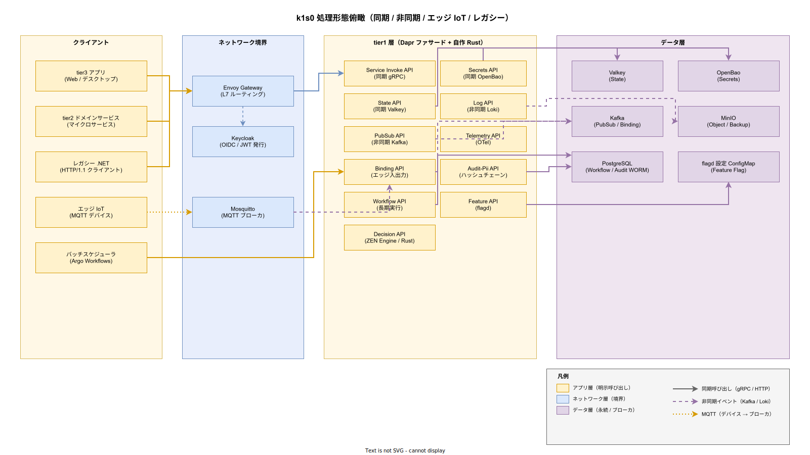

# 03. システム処理方式設計

本ファイルは IPA 共通フレーム 2013 の **6.4.3.3 システム処理方式設計** に対応する。k1s0 が採用する処理形態（同期 / 非同期 / ワークフロー / バッチ）の使い分け、主要な処理経路、観測・監査・認証の並行フローを方式として確定する。

## 本ファイルの位置付け

プラットフォーム基盤は、単一の処理方式で全ユースケースを覆うことはできない。ミリ秒単位の応答を要するインタラクティブ呼び出し、数秒の遅延を許容する大量バックグラウンド処理、数分〜数時間かかる長期ワークフロー、エッジデバイスからの瞬間的バースト、夜間に走るバッチ——これらすべてを「とりあえず同期 gRPC」で扱おうとすると、レイテンシ要件とスループット要件の両方を満たせない。

本ファイルは、k1s0 が提供する 11 の tier1 API がどの処理形態で呼ばれるか、どのバックエンドで処理されるか、観測・監査・認証がどのように並行で動くかを方式として固定化する。これにより tier2 / tier3 の設計者が「どの API をどう使えば SLO を満たせるか」を判断する根拠を提供する。個別 API の詳細仕様は [../20_ソフトウェア方式設計/02_外部インタフェース方式設計/06_API別詳細方式/](../20_ソフトウェア方式設計/02_外部インタフェース方式設計/06_API別詳細方式/) に委ね、本ファイルはシステム全体の処理方式の俯瞰に徹する。

全体像の俯瞰図を以下に示す。アプリ層（tier3 / tier2 / レガシー / エッジ）からの入り口、tier1 の 11 API、データ層の永続/メッセージング配置を一枚で把握できる構成とする。

## 処理形態の分類

k1s0 が扱う処理形態を 5 分類に整理する。分類を事前に固定することで、新規ユースケース追加時の方式選定に迷いを生じさせない。

**同期 gRPC / HTTP**: 呼び出し元が応答を待って次の処理を進める形態。tier2 → tier1 の Service Invoke API、tier2 → tier1 State API（Get / Set）、tier2 → tier1 Secrets API（Get）、tier2 → tier1 Decision API（評価）、tier2 → tier1 Feature API（フラグ評価）が該当する。p99 500ms 以内の SLO を死守するため、同期形態の処理時間は積算で管理する。

**非同期 PubSub**: 呼び出し元が即座に応答を受け取り、実処理は別 Pod が Kafka 経由で後追い実行する形態。tier2 → tier1 PubSub API（Publish）、tier2 → tier1 Binding API（Output）、tier2 → tier1 Log API、tier2 → tier1 Audit-Pii API が該当する。Producer 側の p99 は 50ms、Consumer 側の処理完了までは秒〜分単位を許容する。

**ワークフロー（長期実行）**: 複数ステップを状態として永続化しながら進める形態。tier2 → tier1 Workflow API が該当する。リリース時点では Dapr Workflow を採用し、採用後の運用拡大時 で Temporal 併用。1 ワークフロー実行の最大長は 30 日を想定し、途中経過は PostgreSQL に永続化する。

**バッチ処理**: スケジュールされたまとまった処理を一括実行する形態。Argo Workflows をバッチスケジューラとして採用し、深夜帯（02:00〜04:00 JST）に Longhorn スナップショット / barman cloud バックアップ / 監査ログ月次アーカイブ / 脆弱性スキャンを実行する。tier1 API を呼ぶ必要がある場合は Binding API 経由でトリガする。

**エッジ IoT 捕捉**: MQTT デバイスからの非同期データを Mosquitto MQTT ブローカ経由で受け取り、Kafka Connect または Dapr Binding で Kafka にブリッジする形態。デバイス側のパケット損失を許容しつつ、ブローカ以降の処理は非同期 PubSub と同一方式に合流させる。

**設計項目 DS-SYS-PROC-001 処理形態分類と tier1 API の対応**

- 同期 gRPC / HTTP: Service Invoke / State / Secrets / Decision / Feature（5 API）
- 非同期 PubSub: PubSub / Binding / Log / Audit-Pii（4 API）
- ワークフロー: Workflow（1 API）
- バッチ: Argo Workflows（tier1 API 外）から Binding API 経由でトリガ
- エッジ IoT: Binding API（MQTT 入力→Kafka 出力）

各 API の具体プロトコルと引数仕様は [../20_ソフトウェア方式設計/02_外部インタフェース方式設計/01_tier1_11API方式概要.md](../20_ソフトウェア方式設計/02_外部インタフェース方式設計/01_tier1_11API方式概要.md) で定義する。

## 同期処理方式

同期形態の処理経路は **「呼び出し元 → Envoy Gateway → tier1 公開 API（Go ファサード）→ Dapr sidecar → データ層」** の 4 段階で構成する。各段階のレイテンシ予算（企画で合意した p99 500ms 以内の積算内訳）を以下で明示する。

**設計項目 DS-SYS-PROC-002 同期 API レイテンシ予算**

- Envoy Gateway（JWT 検証含む）: 20ms
- tier1 Go ファサード（引数バリデーション / 認可判定 / 監査ログ記録）: 80ms
- Dapr sidecar（SDK アダプタ / コンポーネント解決）: 80ms
- データ層アクセス（Valkey / PostgreSQL / OpenBao）: 150ms
- ネットワーク往復（Pod 間 x 2）: 20ms
- OTel / 監査の並行処理（主経路をブロックしない）: 0ms（並行のため積算外）
- その他オーバーヘッド: 50ms
- tier2 ビジネスロジック（Service Invoke の場合の相手 tier2 処理時間）: 100ms
- 合計積算: 500ms

**設計項目 DS-SYS-PROC-003 同期 API の timeout とリトライ**

- tier1 Go ファサード → Dapr sidecar: 400ms タイムアウト、リトライなし
- Dapr sidecar → データ層: 300ms タイムアウト、リトライ 2 回（指数バックオフ 50ms / 100ms / 200ms）
- Envoy Gateway → tier1 Go ファサード: 500ms タイムアウト、リトライなし
- 呼び出し元（tier2） → Envoy Gateway: 600ms タイムアウト、リトライ 1 回（100ms）

タイムアウト値は上流が下流よりも長くなる「ピラミッド構造」を維持する。下流でタイムアウトが発生しても上流で握って適切なエラーを返せるようにする（詳細は [../40_制御方式設計/03_リトライとサーキットブレーカー方式.md](../40_制御方式設計/03_リトライとサーキットブレーカー方式.md)）。

**設計項目 DS-SYS-PROC-004 State API の Valkey 直接経路**

State API（Get / Set / Delete）は Valkey への単純なアクセスであり、Dapr sidecar の経由がオーバーヘッドになる場合がある。リリース時点で は Dapr sidecar 経由を標準とし / p99 10ms SLO を満たせない場合に限り、tier1 Go ファサードから valkey-go クライアントで直接 Valkey Cluster に接続する代替経路を併設する。ただし、この場合も外部 API としては `k1s0.State` を維持し、内部実装のみ差し替える（原則 3）。

## 非同期処理方式

非同期形態の処理経路は **「呼び出し元 → Envoy Gateway → tier1 公開 API（Go ファサード）→ Dapr sidecar → Kafka」** で Publish 側が完結し、**「Kafka → Dapr Subscription → tier2 Consumer」** が後追い実行される。Publish 側と Consume 側が独立に動作することで、Producer のレイテンシと Consumer のスループットを独立に最適化できる。

**設計項目 DS-SYS-PROC-005 PubSub Publish の p99 50ms 予算**

- Envoy Gateway: 10ms
- tier1 Go ファサード（引数バリデーション / CloudEvents エンベロープ付与）: 15ms
- Dapr sidecar → Kafka Produce（acks=all, min.insync.replicas=2）: 20ms
- ネットワーク往復: 5ms
- 合計: 50ms

**設計項目 DS-SYS-PROC-006 Consumer 側のスループット設計**

- 1 Kafka パーティションあたり Consumer 1 スレッドが担当、パーティション数 = Consumer レプリカ数
- トピック初期パーティション数: 3（Kafka 3 ブローカに 1 パーティションずつ）
- 目標スループット: 1,000 msg/sec per partition × 3 partition = 3,000 msg/sec per topic
- Consumer 処理時間の p99 目標: 1,000ms（非同期のため許容）
- Consumer リトライ: 指数バックオフ最大 5 回、その後 Dead Letter Topic に退避（DLT プレフィックス `dlt.`）

**設計項目 DS-SYS-PROC-007 バインディング（Binding）方式**

- Input Binding: MQTT / Cron / File / Kafka からの入力を tier2 Consumer に配信
- Output Binding: tier2 から外部 SMTP / HTTP Webhook / Kafka / MQTT へ送信
- Input / Output の共通エンベロープは CloudEvents 1.0 仕様に準拠
- リリース時点で MQTT Input のみサポート / Output と Cron / File を追加

## ワークフロー処理方式

ワークフロー形態は「1 回の呼び出しが数分〜数日続く」処理に適用する。状態を呼び出し元メモリに保持せず、永続化（PostgreSQL）に委ねることで、Pod 再起動や Node 障害に強い。リリース時点では Dapr Workflow を採用し、採用後の運用拡大時 で Temporal を併用して複雑な業務ワークフローに対応する。

**設計項目 DS-SYS-PROC-008 Dapr Workflow 方式（リリース時点）**

- 状態ストア: PostgreSQL `workflows` スキーマ（専用 DB `k1s0_workflows`）
- 実行エンジン: Dapr Runtime 内蔵の Workflow Engine
- Worker Pod: tier2 に配置（Dapr sidecar がトリガ）
- 最大実行時間: 30 日（タイムアウトで強制終了、DLQ に記録）
- ステップ粒度: アクティビティ 1 回 = tier1 API 1 回 or tier2 関数 1 回
- 冪等性: 各アクティビティは冪等キー必須（[../40_制御方式設計/02_冪等性設計方式.md](../40_制御方式設計/02_冪等性設計方式.md) 参照）

**設計項目 DS-SYS-PROC-009 Temporal 併用方式（採用後の運用拡大時）**

採用後の運用拡大時 では、30 日を超える長期ワークフロー（年次契約更新 / 多段承認フローなど）に対して Temporal を併用する。Temporal は専用の Cluster を立てるため、リリース時点では導入せず 採用後の運用拡大時 で追加する。Temporal Cluster は Kafka + PostgreSQL の構成で 3 ノードにデプロイし、k1s0 クラスタと同一 Kubernetes 上で動作させる。

## バッチ処理方式

バッチ形態は、深夜帯に実行される大量データ処理・バックアップ・レポート生成を担当する。Argo Workflows をバッチスケジューラとして採用し、CronJob 相当の定時起動 + DAG 型ステップ依存を表現する。リリース時点 では単純な CronJob で代替し、運用蓄積後で Argo Workflows を導入する。

**設計項目 DS-SYS-PROC-010 標準バッチジョブ一覧**

- 02:00 JST: Longhorn ボリュームスナップショット（全 PVC 対象）
- 02:30 JST: PostgreSQL バックアップ（barman cloud、WAL ローテーション）
- 03:00 JST: Kafka ログセグメントアーカイブ（MinIO へ退避）
- 03:30 JST: 監査ログ月次アーカイブ（当月分を WORM バケットへ）
- 04:00 JST: Trivy 脆弱性スキャン全イメージ
- 04:30 JST: 使用量メトリクス集計（課金メータリング連携）

## エッジ IoT 処理経路

採用側組織の情シス部門のユースケースでは、工場 / 物流センターに設置された IoT デバイスからのデータ取り込みが想定される。MQTT は帯域と電力制約のあるデバイス側で事実上の標準であり、Mosquitto MQTT ブローカを tier1 の手前に置いて、Kafka への変換ブリッジを Binding API で実装する。

**設計項目 DS-SYS-PROC-011 エッジ IoT 経路**

- デバイス: MQTT 3.1.1 または 5.0 クライアント、TLS 1.3 + クライアント証明書認証
- ブローカ: Mosquitto（HA は eclipse-mosquitto StatefulSet × 2）
- 変換: Dapr MQTT Binding（Kafka Connect を使わず Dapr で完結）
- Kafka トピック: `edge.{device_type}.{event_type}` 命名規則
- デバイス認証: クライアント証明書、発行は OpenBao PKI Secrets Engine
- バックプレッシャ: ブローカ側 in-flight 1,000 msg まで、超過時は QoS 0 メッセージを破棄

## レガシー .NET からのアクセス経路

採用側組織の既存 .NET Framework 資産は 10 年以上稼働しており、即座の移行は不可能である。tier1 API は **HTTP/1.1 互換のエンドポイント** を Envoy Gateway で提供し、.NET 側は既存の HttpWebRequest / HttpClient で呼び出せる形を維持する。gRPC-Web は .NET Framework での対応が弱いため、リリース時点では HTTP/JSON REST 互換レイヤのみを提供する。

**設計項目 DS-SYS-PROC-012 レガシー .NET 連携**

- プロトコル: HTTP/1.1 + JSON（Envoy Gateway の grpc_json_transcoder フィルタで gRPC に変換）
- 認証: OAuth 2.0 Client Credentials Flow（クライアント ID / シークレットは Active Directory 統合済 Keycloak で発行）
- 文字コード: UTF-8 強制（既存 .NET は Shift-JIS が混在するため Gateway で変換）
- タイムアウト: 既存 .NET 側の HttpClient.Timeout 標準値 100 秒に合わせ、Envoy 側は 60 秒で打ち切り
- リトライ: .NET 側には推奨せず、Gateway 側で 1 回のみ実施（冪等操作のみ）

## 観測・監査・認証の並行フロー

tier1 API 呼び出し 1 回に対して、主経路（呼び出し元 → データ層）とは別に **観測経路**（OTel → Loki / Tempo / Mimir）と **監査経路**（ハッシュチェーン → PostgreSQL WORM）が並行で動く。3 経路の独立性を保つため、観測と監査は主経路をブロックしない非同期送信とする。

**設計項目 DS-SYS-PROC-013 認証フロー（全 API 強制検証）**

- 入口: Envoy Gateway の ext_authz フィルタで Keycloak から発行された JWT を検証
- 検証項目: 署名（RS256）/ 有効期限 / issuer / audience / scope
- 検証失敗: HTTP 401 を即座に返却、tier1 Go ファサードには到達しない
- tier1 Go ファサードでは第二段階の認可判定（Role / Tenant スコープ）を実施
- JWT 検証キャッシュ: Valkey に 60 秒 TTL でキャッシュ、ジャーナル障害時の Keycloak 負荷軽減

**設計項目 DS-SYS-PROC-014 観測データフロー**

- アプリ層からの OTel SDK 自動計装 → OTel Collector（DaemonSet）
- Collector → Loki（ログ）/ Tempo（トレース）/ Mimir（メトリクス）を並列送信
- trace_id はアプリ層の ingress で払い出し、tier1 / tier2 / tier3 を通じて伝播
- 観測送信のサンプリング: リリース時点 は 100%、運用蓄積後は ingress で 10% tail-based sampling

**設計項目 DS-SYS-PROC-015 監査フロー（ハッシュチェーン WORM）**

- tier1 Go ファサード → tier1 自作 Rust（監査サービス）に Protobuf gRPC で記録依頼
- Rust 側: 直前ログの hash_chain_prev を取得 → 本ログの SHA-256 計算 → `hash_chain_curr` を生成
- PostgreSQL 監査 WORM 専用 DB へ INSERT（UPDATE / DELETE はロールで拒否）
- 月次で MinIO の WORM バケット（Object Lock Compliance モード）へアーカイブ
- 検証: ハッシュチェーン整合性チェッカを月次で実行（[../30_共通機能方式設計/04_監査証跡方式.md](../30_共通機能方式設計/04_監査証跡方式.md)）

## 並行処理の SLO 分解

主経路の p99 500ms と、観測・監査の並行処理の SLO は独立に管理する。主経路が 500ms を超過する場合、観測 / 監査のどちらが遅いかを trace_id で切り分ける。

**設計項目 DS-SYS-PROC-016 並行経路の SLO**

- 主経路 p99: 500ms（tier2 ビジネスロジック 100ms を含む）
- 観測経路 p99（OTel 送信完了まで）: 300ms、ただし主経路をブロックしない
- 監査経路 p99（WORM PostgreSQL INSERT まで）: 200ms、主経路と直列だが並行スレッドで隠蔽
- Decision API の ZEN Engine 評価 p99: 1ms（Rust 同一プロセス内）
- PubSub Publish p99: 50ms
- State Get p99: 10ms

## 採用段階別処理方式の導入段階

本ファイルの設計項目は リリース時点〜採用後の運用拡大時 で段階的に導入される。採用初期で全処理方式を同時に稼働させると採用側の小規模運用で追従できないため、シンプルな方式から順次拡大する。

**設計項目 DS-SYS-PROC-017 採用段階別導入**

- リリース時点: 同期 gRPC / HTTP、非同期 PubSub の最小、認証フロー、観測（OTel 送信のみ、可視化未完）。レガシー連携の HTTP 互換、バッチは CronJob で代替。
- リリース時点: 非同期 PubSub の全機能、Binding（MQTT 入力）、Workflow（Dapr Workflow）、観測フル（Grafana LGTM）、監査ハッシュチェーン、Argo Workflows バッチ。
- リリース時点: 監査 WORM の MinIO アーカイブ、認証の tail-based sampling、Kafka の MirrorMaker2 骨子。
- 採用後の運用拡大時: Istio Ambient、Temporal 併用、SPIFFE/SPIRE による mTLS 化。

## 対応要件一覧

本ファイルは以下の要件 ID を方式設計で充足する。

- **FR-T1-INVOKE-001〜005**（Service Invoke API）: DS-SYS-PROC-001 / DS-SYS-PROC-002 / DS-SYS-PROC-003
- **FR-T1-STATE-001〜005**（State API）: DS-SYS-PROC-001 / DS-SYS-PROC-004
- **FR-T1-PUBSUB-001〜005**（PubSub API）: DS-SYS-PROC-005 / DS-SYS-PROC-006
- **FR-T1-BINDING-001〜004**（Binding API）: DS-SYS-PROC-007 / DS-SYS-PROC-011
- **FR-T1-WORKFLOW-001〜005**（Workflow API）: DS-SYS-PROC-008 / DS-SYS-PROC-009
- **FR-T1-SECRETS-001〜004**（Secrets API）: DS-SYS-PROC-002
- **FR-T1-DECISION-001〜004**（Decision API）: DS-SYS-PROC-001 / DS-SYS-PROC-016
- **FR-T1-LOG-001〜004 / FR-T1-TELEMETRY-001〜004**（Log / Telemetry API）: DS-SYS-PROC-014
- **FR-T1-AUDIT-001〜003 / FR-T1-PII-001〜002**（Audit-Pii API）: DS-SYS-PROC-015 / DS-SYS-PROC-016
- **FR-T1-FEATURE-001〜004**（Feature API）: DS-SYS-PROC-001
- **NFR-A-CONT/FT/DR/REC**（可用性全 13 要件）: DS-SYS-PROC-003 / DS-SYS-PROC-006 / DS-SYS-PROC-008
- **NFR-B-WL/PERF/RES/QA**（性能・拡張全 14 要件）: DS-SYS-PROC-002 / DS-SYS-PROC-005 / DS-SYS-PROC-006 / DS-SYS-PROC-016
- **NFR-F-SYS/CHR/STD/FAC/ECO**（環境・エコロジー全 13 要件）: DS-SYS-PROC-017
- **C-INF-001 / C-EXIST-001〜003**（レガシー共存）: DS-SYS-PROC-012
- **P-TEC-001〜005**（オンプレ技術スタック）: DS-SYS-PROC-017

対応要件一覧の集約は [../80_トレーサビリティ/02_要件から設計へのマトリクス.md](../80_トレーサビリティ/02_要件から設計へのマトリクス.md) に反映する。
