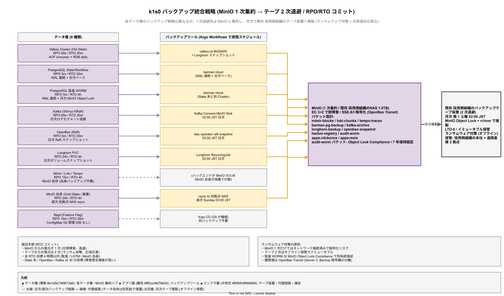

# 04. データベース方式設計

本ファイルは IPA 共通フレーム 2013 の **6.4.3.4 データベース方式設計** に対応する。k1s0 を構成する永続化・メッセージング・シークレット・観測・オブジェクトストアの各データ層の全体方式を確定する。

## 本ファイルの位置付け

プラットフォーム基盤における「データベース」は単一の RDBMS を指さない。k1s0 では State Store（Valkey Cluster / 一部 PostgreSQL）、PubSub ブローカ（Kafka）、Workflow 状態（PostgreSQL）、Secret Store（OpenBao）、監査専用 DB（PostgreSQL WORM）、メトリクス TSDB（Mimir）、ログストア（Loki）、トレースストア（Tempo）、オブジェクトストア（MinIO）の 9 種類のデータ層が並列に存在する。各層は異なる性能特性・一貫性要件・保持期間・RPO/RTO を持ち、単一方式では扱えない。

本ファイルは、9 種類のデータ層の全体方式（どの OSS を採用するか / 何を何個並べるか / どのバックアップ戦略か / RPO/RTO の数値はいくらか）を確定する。**論理 ER / テーブル一覧 / インデックス設計**は次章 [../20_ソフトウェア方式設計/04_データベース最上位設計/](../20_ソフトウェア方式設計/04_データベース最上位設計/) の担当範囲であり、本ファイルと二重記載を避けるため明示的に分担する。本章は「物理配置 / 冗長化 / バックアップ / 復旧」を扱い、次章は「論理スキーマ / インデックス / データ保持と廃棄」を扱う。

構想設計 ADR-DATA-001（PostgreSQL 採用）/ ADR-DATA-002（Kafka 採用）/ ADR-DATA-003（Valkey 採用）/ ADR-DATA-004（MinIO 採用）/ ADR-SEC-002（OpenBao 採用）/ ADR-STOR-001（Longhorn 採用）/ ADR-STOR-002（MinIO 採用）/ ADR-OBS-001（Grafana LGTM 採用）で OSS 選定の根拠は確定している。本章は選定結果を方式として固定する役割に徹する。

## データ層の全体分類

k1s0 のデータ層を、担当する tier1 API / 保持するデータ種別 / 一貫性要件 / RPO/RTO 要件の 4 軸で分類する。分類の軸を事前に固定することで、新規データ層追加時の方式選定に迷いを生じさせない。

**設計項目 DS-SYS-DB-001 データ層全体分類**

| データ層 | OSS | tier1 API | 主な用途 | 一貫性 | RPO | RTO |
|---------|-----|-----------|---------|--------|-----|-----|
| State Store（Hot） | Valkey Cluster | State | セッション / キャッシュ / カウンタ | 結果整合 | 60 秒 | 30 分 |
| State Store（Warm） | PostgreSQL（CloudNativePG） | State（一部） | 中期保持データ | 強整合（SERIALIZABLE） | 5 分 | 30 分 |
| State Store（Cold） | MinIO | State（一部） | 長期保管 / BLOB | 結果整合 | 24 時間 | 4 時間 |
| PubSub | Kafka（Strimzi） | PubSub / Binding | イベントストリーム | at-least-once | 60 秒 | 30 分 |
| Workflow | PostgreSQL | Workflow | ワークフロー状態 | 強整合 | 5 分 | 30 分 |
| Secret Store | OpenBao | Secrets | 機密情報 | 強整合（Raft） | 5 分 | 30 分 |
| 監査 | PostgreSQL 監査 WORM | Audit-Pii | 改ざん防止ログ | 強整合 + WORM | 5 分 | 4 時間 |
| メトリクス | Mimir | Telemetry | 時系列メトリクス | 結果整合 | 15 分 | 4 時間 |
| ログ | Loki | Log | 構造化ログ | 結果整合 | 15 分 | 4 時間 |
| トレース | Tempo | Telemetry | 分散トレース | 結果整合 | 15 分 | 4 時間 |
| オブジェクト | MinIO | Binding（間接） | バックアップ / イメージ / アーカイブ | 結果整合 | 24 時間 | 4 時間 |
| Feature Flag | ConfigMap / flagd | Feature | 動的設定 | 結果整合 | 15 分 | 30 分 |

RPO（Recovery Point Objective）は「障害発生から何秒/分/時間前までのデータを失う可能性があるか」、RTO（Recovery Time Objective）は「障害発生から何分/時間で復旧するか」を意味する。RPO/RTO の数値は要件定義書 NFR-A-001〜013 と整合させている。

各データ層の OSS 採用根拠は構想設計 ADR で確定済みだが、本表の読み解きを助けるため概要を添える。RDB 層（State Warm / Workflow / 監査）で PostgreSQL / CloudNativePG を採る根拠は ADR-DATA-001 が示すとおり、MVCC による SERIALIZABLE 強整合と WAL 連続バックアップによる秒オーダー PITR、JTC 既存 DBA 知見の流用可能性（年 2,000 万円のライセンス費削減）の 3 点で、商用 DB（Oracle / SQL Server）は年次費用と DBA 依存度の面で却下している。メッセージング層で Kafka（Strimzi）を採る根拠は ADR-DATA-002 のとおり、at-least-once 配送と順序保証付きパーティショニング、KRaft モードによる ZooKeeper 削減（運用コンポーネント数半減）が決め手で、NATS / RabbitMQ は順序保証とスケール容量で不足する。キャッシュ層で Valkey Cluster を採る根拠は ADR-DATA-003 のとおり、Redis プロトコル互換により tier2 アプリの既存ライブラリ資産がそのまま利用でき、Linux Foundation 傘下 BSD-3 への移行で将来のライセンス変更リスクを回避できる点。オブジェクト層で MinIO を採る根拠は ADR-DATA-004 と ADR-STOR-002 のとおり、S3 API 互換で既存 NAS 1.5TB と Object Lock Compliance モードによる WORM 要件（NFR-H-COMP-003）を単一 OSS で満たせる点。これらの採用根拠は 36 行目以降の各節で詳細化する。

## State Store 方式

State Store は tier2 / tier3 アプリがセッション・キャッシュ・カウンタ・ドメインオブジェクトを保存する汎用的な Key-Value ストアである。アクセスパターンの温度差（Hot / Warm / Cold）が大きく、単一のストアでは性能とコストを両立できないため、3 階層で構成する。

**設計項目 DS-SYS-DB-002 Valkey Cluster 方式（Hot）**

- 用途: セッション / 短期キャッシュ / レート制限カウンタ / JWT 検証キャッシュ
- 構成: Valkey 8.x Cluster、3 シャード × 各 2 レプリカ = 6 Pod（3 ノードに分散配置）
- 永続化: AOF（appendonly yes, appendfsync everysec）+ RDB（daily）
- 最大容量: Pod あたりメモリ 2GB × 6 Pod = 12GB、実効使用容量 8GB 見積
- TTL ポリシー: デフォルト 24 時間、明示的 TTL 指定可能、maxmemory-policy allkeys-lru
- レプリカ同期: 非同期レプリケーション（レイテンシ優先）
- バックアップ: RDB ファイルを日次で Longhorn スナップショット → MinIO へ退避
- 復旧手順: Longhorn ボリュームスナップショットから復元、または MinIO から RDB 取得して再インポート

**設計項目 DS-SYS-DB-003 PostgreSQL（Warm）方式**

- 用途: State 中期保持 / Workflow 状態 / アプリ固有のドメインデータ（tier2 選択可）
- 構成: CloudNativePG Cluster、Primary 1 + Standby 2（計 3 Pod、3 ノードに分散）
- バージョン: PostgreSQL 16.x
- レプリケーション: Streaming Replication、synchronous（min.syncstandby=1）
- 最大容量: 各 Pod 20GB PVC × 3 = 60GB、実効使用容量 40GB 見積
- バックアップ: barman cloud で WAL 連続バックアップ + 日次ベースバックアップ、MinIO へ退避
- PITR 粒度: 秒オーダー（WAL 連続取得）
- 暗号化: pg_crypto + TDE（ファイルシステム層 LUKS）
- データベース分離: `k1s0_state` / `k1s0_workflows` / `k1s0_audit` / `k1s0_tenant_*` を論理分離

**設計項目 DS-SYS-DB-004 MinIO オブジェクト State（Cold）方式**

- 用途: 1 週間以上アクセスのない大容量 State（例: 月次レポート / 履歴画像）
- 構成: MinIO StatefulSet 4 Pod、EC 3+2（3 ノードに分散）
- 最大容量: 1.5 TB（既存 NAS 1.5 TB 活用）
- tier1 State API の内部で自動 Hot→Warm→Cold 階層化（Phase 2 で実装、Phase 1 は Hot のみ）
- バックアップ: 週次で別拠点 NAS への rsync レプリケーション

## PubSub（Kafka）方式

PubSub はイベント駆動アーキテクチャの中核で、tier2 間の非同期連携 / エッジ IoT イベント / 監査イベントの配送を担当する。Phase 1 では ZooKeeper フリーの KRaft モードで 3 ブローカを立ち上げ、Phase 2 で MirrorMaker2 による DC 間レプリケーションを追加する。

**設計項目 DS-SYS-DB-005 Kafka 基本方式**

- OSS: Apache Kafka 3.8（Strimzi Operator 0.42 で管理）
- モード: KRaft（ZooKeeper 不使用）
- 構成: 3 ブローカ（3 ノードに 1 ブローカずつ）、3 コントローラ（各ブローカに兼任）
- デフォルト設定: acks=all / min.insync.replicas=2 / replication.factor=3
- トピック数上限目安: 100（Phase 1）、1,000（Phase 2）
- パーティション数標準: 3（トピック作成時の Dapr デフォルト）
- 保持期間: デフォルト 7 日、最大 30 日（個別設定可）
- 最大スループット目標: 10,000 msg/sec / cluster（Phase 1b）、50,000 msg/sec（Phase 2）

**設計項目 DS-SYS-DB-006 Kafka バックアップと DR**

- ログセグメント: 深夜 03:00 JST に日次で MinIO アーカイブ（`kafka-archive/` バケット）
- メタデータ: Kafka 内部トピック `__cluster_metadata` を含めて MinIO 退避
- MirrorMaker2（Phase 2）: 第 2 DC Kafka へのトピックレプリケーション、RPO 60 秒目標
- 復旧手順: MinIO からログセグメント復元 → Kafka StatefulSet 再起動、RTO 30 分目標

**設計項目 DS-SYS-DB-007 PVC と配置の詳細**

- Kafka PVC: Longhorn、レプリカ 3、各 Pod 20GB（計 60GB、実効 20GB）
- ログセグメントサイズ: 1GB、retention.bytes は topic 別に設定
- Anti-Affinity: podAntiAffinity により Kafka ブローカ 3 が別 Node に分散

## Secret Store（OpenBao）方式

OpenBao は HashiCorp Vault の OSS フォーク（MPL-2.0）で、API・CLI・シークレットエンジンが Vault と互換である。tier1 Secrets API の裏側として全ての機密情報（DB パスワード / API トークン / PKI 証明書 / 暗号鍵）を格納する。

**設計項目 DS-SYS-DB-008 OpenBao 基本方式**

- OSS: OpenBao 2.x（MPL-2.0）
- ストレージバックエンド: Integrated Storage（Raft）、3 ノードクラスタ
- シャーディング: 単一クラスタ（Phase 1〜2）、Enterprise Replication は使用しない
- 暗号化: AES-256-GCM（マスターキーは Shamir Secret Sharing で 5 分割、3 しきい値）
- アンシール方式: Auto Unseal は Phase 1 で使わず、Manual Unseal（2 名運用で鍵を分担保管）
- シークレットエンジン: KV v2 / Transit（暗号鍵管理）/ PKI（クライアント証明書発行）/ Database（動的 DB クレデンシャル）

**設計項目 DS-SYS-DB-009 OpenBao バックアップと復旧**

- Raft スナップショット: 日次 02:00 JST 自動取得 → MinIO 退避
- スナップショットサイズ: 数 MB 〜 数十 MB（シークレット件数に依存）
- 復旧手順: MinIO からスナップショット取得 → `bao operator raft snapshot restore` で復元、RTO 30 分目標
- PVC: Longhorn、レプリカ 3、各 Pod 5GB（計 15GB、実効 5GB）

## 監査専用 DB 方式

監査ログは改ざん防止が法的に要求される（J-SOX / 電帳法）。State 系 PostgreSQL とは別インスタンスで専用 DB を立て、INSERT のみ許可 / UPDATE / DELETE を PostgreSQL ロールで禁止する WORM（Write Once Read Many）構成を取る。

**設計項目 DS-SYS-DB-010 監査専用 PostgreSQL 方式**

- OSS: PostgreSQL 16.x（CloudNativePG、別 Cluster として起動）
- 構成: Primary 1 + Standby 2（State 系と別の 3 Pod、同じ 3 ノードに分散）
- 容量: 各 Pod 40GB PVC × 3 = 120GB、実効使用容量 40GB 見積
- スキーマ: `audit` スキーマ配下に `events` テーブル（詳細は [../20_ソフトウェア方式設計/04_データベース最上位設計/02_最上位テーブル一覧.md](../20_ソフトウェア方式設計/04_データベース最上位設計/02_最上位テーブル一覧.md)）
- ロール権限: `auditor_insert_role` のみ INSERT 許可、UPDATE / DELETE / TRUNCATE 不許可
- ハッシュチェーン: `hash_chain_prev` / `hash_chain_curr` カラム（SHA-256 を hex 格納）
- バックアップ: barman cloud で WAL 連続 + 日次ベースバックアップ
- アーカイブ: 月次で MinIO WORM バケット（Object Lock Compliance モード、7 年保持）

**設計項目 DS-SYS-DB-011 監査 DB の分離根拠**

State 系 PostgreSQL と監査 PostgreSQL を同一 Cluster にまとめる案も検討したが、以下の理由で別 Cluster とする。(1) 誤って監査テーブルに UPDATE / DELETE を発行するリスクを DB レベルで排除、(2) 監査ログの保存期間が 7 年と長いため、State 系の日次バックアップローテーションと分離したい、(3) 監査 DB のアクセス監査を別系統で取ることで、監査 DB 自体の監査が成立する。

## 観測データストア（Mimir / Loki / Tempo）方式

Grafana LGTM スタックは 3 種類の観測データ（Metrics / Logs / Traces）を別々の OSS で扱う。3 者は共通のバックエンド（MinIO）にデータを保存するため、オブジェクトストア 1 個を 3 系統で共有する設計となる。

**設計項目 DS-SYS-DB-012 Mimir（メトリクス TSDB）方式**

- OSS: Grafana Mimir 2.13（Apache 2.0）
- 構成: Ingester 3 / Store Gateway 3 / Distributor 2 / Querier 2 / Compactor 1（Pod 数合計 11）
- バックエンド: MinIO（`mimir-blocks/` バケット）
- 保持期間: Phase 1 は 30 日、Phase 2 で 365 日
- Ingester の PVC: Longhorn 各 10GB（WAL 用）
- スクレイプソース: OTel Collector → Mimir remote write
- クエリ集約: Grafana からの PromQL

**設計項目 DS-SYS-DB-013 Loki（ログストア）方式**

- OSS: Grafana Loki 3.x（AGPL-3.0、ADR-0003 5 原則に従い隔離運用）
- 構成: Ingester 3 / Querier 2 / Distributor 2 / Compactor 1（Pod 数合計 8）
- バックエンド: MinIO（`loki-chunks/` バケット）
- 保持期間: Phase 1 は 30 日、Phase 2 で 90 日
- ラベル戦略: `app` / `namespace` / `pod` / `container` / `trace_id`
- 監査ログは Loki に流さない（監査は専用 PostgreSQL WORM が一次ストア）

**設計項目 DS-SYS-DB-014 Tempo（トレースストア）方式**

- OSS: Grafana Tempo 2.5（AGPL-3.0、ADR-0003 5 原則に従い隔離運用）
- 構成: Ingester 3 / Querier 2 / Distributor 2 / Compactor 1（Pod 数合計 8）
- バックエンド: MinIO（`tempo-traces/` バケット）
- 保持期間: Phase 1 は 14 日、Phase 2 で 30 日
- サンプリング: Phase 1a は 100%、Phase 1b 以降は tail-based 10%
- trace_id 相関: Loki ログに `trace_id` ラベルで紐付け、Grafana でワンクリック遷移

## オブジェクトストア（MinIO）方式

MinIO は、観測データ（Mimir / Loki / Tempo のバックエンド）、バックアップ（barman cloud / Longhorn / OpenBao）、コンテナイメージ（Harbor）、監査アーカイブ、アプリ配信ポータル配信物（ClickOnce / MSIX）を格納する汎用オブジェクトストアである。

**設計項目 DS-SYS-DB-015 MinIO 共通方式**

- OSS: MinIO RELEASE.2025-01-xx（AGPL-3.0、ADR-0003 5 原則に従い隔離運用）
- 構成: StatefulSet 4 Pod、EC 3+2（3 ノードに分散、1 ノード 4 Pod までは許容）
- 容量: 既存 NAS 1.5 TB
- バケット設計: `mimir-blocks` / `loki-chunks` / `tempo-traces` / `barman-pg-backup` / `kafka-archive` / `longhorn-backup` / `openbao-snapshot` / `harbor-registry` / `audit-worm` / `apps-clickonce` / `apps-msix`
- 暗号化: SSE-S3（サーバ側暗号化）、鍵は OpenBao Transit エンジン
- ILM（Information Lifecycle Management）: 30 日で Standard → Glacier 風 tiering（Phase 2）
- WORM: `audit-worm` バケットは Object Lock Compliance モード、7 年保持固定

## Feature Flag ストア（flagd）方式

Feature Flag は、Argo CD 経由で ConfigMap として配布する方式とし、専用 DB を持たない。flagd は ConfigMap を監視して動的に評価し、変更は 1 秒以内に反映される。

**設計項目 DS-SYS-DB-016 flagd 方式**

- OSS: flagd v0.11+（Apache 2.0、OpenFeature Foundation）
- 構成: Deployment 2 Pod（HA）、ConfigMap `flagd-flags` を同期
- 更新手順: Git PR → Argo CD → ConfigMap 更新 → flagd 自動リロード
- 評価: tier1 Feature API が gRPC で flagd に問い合わせ、p99 5ms 目標
- ローカル評価: Phase 2 で in-process モード（Provider 経由）検討

## バックアップ統合戦略

各データ層のバックアップは異なる戦略を取るが、**最終的な退避先は MinIO に集約** し、さらに月次で**既存 JTC バックアップテープ装置**に複製する 2 段階方式を取る。これによりランサムウェア対策（イミュータブルなテープ保管）と、日常的な復旧のしやすさ（MinIO からの高速復元）を両立する。

9 種類のデータ層が別々のバックアップツール（barman cloud / Raft snapshot / Kafka Connect / Longhorn RecurringJob / rsync）で動作しながら、全てが MinIO 1 個に収束し、さらに月次でテープへ複製されるという 2 段階構造は、表だけでは読み手が全体の流れを組み立てにくい。下図は「データ層 → バックアップツール → MinIO 1 次集約 → テープ 2 次退避」の流れを一枚に整理し、どの層がどの RPO/RTO でどの経路を辿るかを俯瞰できるようにしたものである。監査 WORM が MinIO Object Lock Compliance で 7 年固定保持される別系統扱いである点、flagd / LGTM は自身のバックアップを持たず上位層（Git / MinIO）で代替する点も同時に読み取れる。

**設計項目 DS-SYS-DB-017 バックアップ統合方式**

| データ層 | 1 次バックアップ（MinIO） | 2 次バックアップ（テープ） | 頻度 |
|---------|------------------------|---------------------------|------|
| Valkey | RDB ファイル（daily） | 月次 | 日次 |
| PostgreSQL（State / Workflow） | barman cloud（WAL 連続 + 日次ベース） | 月次 | 連続 |
| PostgreSQL（監査） | barman cloud + WORM バケット | 月次 | 連続 |
| Kafka | ログセグメント（daily） | 月次 | 日次 |
| OpenBao | Raft スナップショット（daily） | 月次 | 日次 |
| MinIO（自身） | 別拠点 NAS rsync（weekly） | 月次 | 週次 |
| Longhorn PVC | ボリュームスナップショット → MinIO（daily） | 月次 | 日次 |

**設計項目 DS-SYS-DB-018 RPO/RTO コミット**

- PostgreSQL（監査含む）: RPO 5 分 / RTO 30 分（WAL 連続バックアップ）
- Kafka: RPO 60 秒（acks=all）/ RTO 30 分
- Valkey: RPO 60 秒（AOF everysec）/ RTO 30 分
- OpenBao: RPO 5 分 / RTO 30 分
- MinIO: Phase 1c 24 時間 / Phase 2 レプリケーション後 1 時間 / RTO 4 時間（Phase 1c は別拠点 NAS への週次 rsync のみのため 24h が下限、Phase 2 でサイト間非同期レプリケーションを有効化して 1h まで短縮する）
- Mimir / Loki / Tempo: RPO 15 分 / RTO 4 時間（MinIO 依存）
- Longhorn: RPO 24 時間（daily snapshot）/ RTO 4 時間

## 障害時の縮退挙動

各データ層で 1 ノード障害・2 ノード障害の際の挙動を表で整理し、SRE Runbook と連動させる。

**設計項目 DS-SYS-DB-019 データ層障害時挙動**

| データ層 | 1 ノード障害 | 2 ノード障害 |
|---------|------------|------------|
| Valkey | Cluster が残存 2 シャードで継続、Read/Write 可 | Shard fail、対象 Shard キーは利用不可 |
| PostgreSQL（State） | 同期 Standby が残 1、Primary 自動 failover 可 | Read Only 縮退 |
| PostgreSQL（監査） | 同上 | 同上 |
| Kafka | ISR=2 継続、acks=all で Read/Write 可 | Producer 停止、Consumer のみ可 |
| OpenBao | Raft クォーラム成立、Read/Write 可 | Raft クォーラム喪失、Read Only |
| MinIO | EC で継続、Read/Write 可 | Read Only 縮退 |
| Longhorn | レプリカ 3 中 1 喪失、Read/Write 可 | レプリカ 3 中 2 喪失、Read Only |
| Mimir / Loki / Tempo | Ingester 3 中 1 喪失、書き込み継続 | 書き込みスロットル、クエリ可 |

## フェーズ別データ層導入段階

**設計項目 DS-SYS-DB-020 フェーズ別導入**

- Phase 1a（VM 1 台）: PostgreSQL single / Valkey single / OpenBao single / MinIO standalone / ConfigMap ベース flagd。Kafka / Mimir / Loki / Tempo は未導入（Log API は stdout、Telemetry API は Prometheus のみ）。
- Phase 1b（VM 3 台）: PostgreSQL HA / Valkey Cluster / OpenBao Raft 3 / MinIO EC 3+2 / Kafka 3 ブローカ / Longhorn / Mimir / Loki / Tempo 追加。
- Phase 1c（VM 3 台）: 監査専用 PostgreSQL 追加、WORM バケット有効化、テープ 2 次バックアップ、月次ハッシュチェーン検証。
- Phase 2: MirrorMaker2 で DC 間 Kafka レプリケーション、MinIO site-to-site、PostgreSQL 遠隔 Standby、Temporal クラスタ追加。

## 対応要件一覧

本ファイルは以下の要件 ID を方式設計で充足する。

- **FR-STATE-001〜005**（State API）: DS-SYS-DB-002 / DS-SYS-DB-003 / DS-SYS-DB-004
- **FR-PUBSUB-001〜005**（PubSub API）: DS-SYS-DB-005 / DS-SYS-DB-006 / DS-SYS-DB-007
- **FR-SECRETS-001〜005**（Secrets API）: DS-SYS-DB-008 / DS-SYS-DB-009
- **FR-WORKFLOW-001〜005**（Workflow API）: DS-SYS-DB-003
- **FR-AUDIT-001〜005**（Audit-Pii API）: DS-SYS-DB-010 / DS-SYS-DB-011
- **FR-LOG-001〜005**（Log API）: DS-SYS-DB-013
- **FR-TEL-001〜005**（Telemetry API）: DS-SYS-DB-012 / DS-SYS-DB-014
- **FR-FEAT-001〜005**（Feature API）: DS-SYS-DB-016
- **NFR-A-001〜013**（可用性）: DS-SYS-DB-017 / DS-SYS-DB-018 / DS-SYS-DB-019
- **NFR-B-001〜014**（性能・拡張）: DS-SYS-DB-002 / DS-SYS-DB-005 / DS-SYS-DB-012
- **NFR-F-001〜013**（環境・エコロジー）: DS-SYS-DB-015 / DS-SYS-DB-020
- **C-INF-001**（既存 JTC 資産活用）: DS-SYS-DB-015 / DS-SYS-DB-017
- **P-TEC-001〜005**（オンプレ技術スタック）: DS-SYS-DB-001 / DS-SYS-DB-020

対応要件一覧の集約は [../80_トレーサビリティ/02_要件から設計へのマトリクス.md](../80_トレーサビリティ/02_要件から設計へのマトリクス.md) に反映する。
