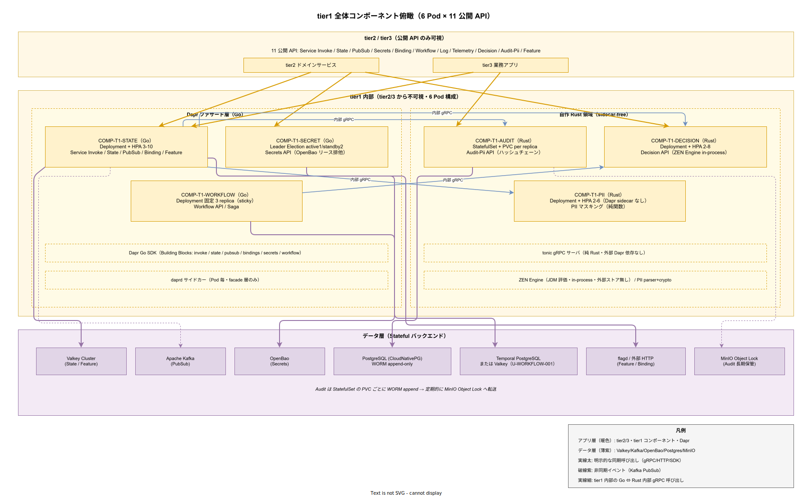

# 01. tier1 全体コンポーネント俯瞰

本ファイルは IPA 共通フレーム 2013 の **ソフトウェア方式設計プロセス 7.1.2.1（ソフトウェア構造とコンポーネントの方式設計）** に対応する。tier1 ソフトウェアを構成する 6 コンポーネント（COMP-T1-STATE / COMP-T1-SECRET / COMP-T1-AUDIT / COMP-T1-DECISION / COMP-T1-PII / COMP-T1-WORKFLOW）の全体配置、相互関係、失敗ドメイン分離、データアフィニティ境界、tier2 / tier3 からの見え方を方式として固定化する。

## 本ファイルの位置付け

構想設計書 [../../../02_構想設計/02_tier1設計/01_設計の核/03_内部コンポーネント分割.md](../../../02_構想設計/02_tier1設計/01_設計の核/03_内部コンポーネント分割.md) は「なぜ 6 Pod なのか」の分割 5 原則と、各コンポーネントが充足する要件 ID・駆動する ADR を既に確定している。本ファイルはこの分割結論を設計書本体として受け継ぎ、6 コンポーネントが k1s0 ランタイム上でどう配置され、どう相互作用し、どうスケールするかを方式として固定化する。個別コンポーネントの内部モジュール詳細は [02_Daprファサード層コンポーネント.md](02_Daprファサード層コンポーネント.md) と [03_自作Rust領域コンポーネント.md](03_自作Rust領域コンポーネント.md) に委ね、本ファイルは俯瞰視点のみを扱う。

リリース時点（リリース時点）では、この俯瞰図が正しく読み取れないと、後続の詳細設計段階で「どのコンポーネントが何を担当するか」の議論が収束しない。逆にここで配置・責務境界・失敗ドメインの 3 軸が明確になっていれば、各コンポーネントの詳細設計は独立に並行進行できる。本ファイルは並行進行の起点となる共通土台を提供することを目的とする。

## 現状整理と全体像

k1s0 の tier1 は tier2 / tier3 から見ると 11 公開 API（Service Invoke / State / PubSub / Secrets / Binding / Workflow / Log / Telemetry / Decision / Audit-Pii / Feature）として単一のプラットフォームに見える。しかし内部では 6 Pod に分割され、それぞれが異なる言語・異なる運用形態・異なる失敗ドメインで稼働する。外から見ると 1 面、内から見ると 6 面という非対称性こそが、本章の俯瞰で最初に読み取られるべき構造である。

図は 3 レーン構造で読む。最上段は tier2 / tier3 の公開 API 境界（アプリ層）、中段は tier1 内部 6 Pod（アプリ層、Dapr ファサード 3 Pod と自作 Rust 3 Pod の 2 ブロック）、最下段は Stateful バックエンド（データ層）である。公開 API は中段の 6 Pod に射影され、11 API × 6 Pod の収容マトリクスは [04_コンポーネント責務一覧.md](04_コンポーネント責務一覧.md) に詳述する。

## 設計 ID 一覧

本ファイルで採番する設計 ID は `DS-SW-COMP-001` 〜 `DS-SW-COMP-019` の 19 件である。採番順は「俯瞰構造 → 運用形態 → 失敗ドメイン → データアフィニティ → 可視性契約」の順に並べる。通番は [03_設計ID体系とトレーサビリティ.md](../../00_設計方針/03_設計ID体系とトレーサビリティ.md) の連続採番ルールに従い、02〜06 のファイルで `DS-SW-COMP-020` 以降に継続する。

## DS-SW-COMP-001 tier1 を 6 コンポーネントに分割する方式

tier1 は COMP-T1-STATE / COMP-T1-SECRET / COMP-T1-AUDIT / COMP-T1-DECISION / COMP-T1-PII / COMP-T1-WORKFLOW の 6 コンポーネントに分割する。分割根拠は構想設計 ADR-TIER1-001 および ADR-TIER1-002 で確定しており、データアフィニティ・言語境界・失敗ドメイン・スケール特性・順序保証の 5 原則の合流点として導出される。分割数を 5 以下に統合すると失敗ドメインが混在し SLO 維持が困難になり、7 以上に細分化すると リリース時点 の 採用側の小規模運用では運用工数が破綻する。本設計 ID は分割数 6 を不変として固定し、変更には新規 ADR の起票を要する。

**確定段階**: リリース時点。**対応要件**: FR-T1-\* 全 49 件（6 コンポーネントに分配）、NFR-A-CONT-003、NFR-A-FT-001。**参照**: 構想設計 ADR-TIER1-001（Go+Rust ハイブリッド）、ADR-TIER1-002（Protobuf gRPC）。

## DS-SW-COMP-002 公開 API と内部コンポーネントの収容マトリクス

11 公開 API は 6 コンポーネントに n:1 で収容される。Service Invoke / State / PubSub / Binding / Feature の 5 API を COMP-T1-STATE に、Secrets API を COMP-T1-SECRET に、Workflow API を COMP-T1-WORKFLOW に、Decision API を COMP-T1-DECISION に、Audit-Pii API を COMP-T1-AUDIT（監査永続化）と COMP-T1-PII（PII マスキング）に分割して、Log API と Telemetry API は tier1 SDK 内で構造化ログ / OTel span を生成し tier1 アプリ層に専用 Pod を置かず OpenTelemetry Collector（インフラ層 DaemonSet）に配送する。この収容マトリクスは要件定義 [../../../03_要件定義/20_機能要件/10_tier1_API要件/00_tier1_API共通規約.md](../../../03_要件定義/20_機能要件/10_tier1_API要件/00_tier1_API共通規約.md) の収容マトリクスと 1:1 で一致させ、乖離が発生した場合は両方を同 PR で改訂する。

**確定段階**: リリース時点。**対応要件**: FR-T1-INVOKE-\*、FR-T1-STATE-\*、FR-T1-PUBSUB-\*、FR-T1-SECRETS-\*、FR-T1-BINDING-\*、FR-T1-WORKFLOW-\*、FR-T1-LOG-\*、FR-T1-TELEMETRY-\*、FR-T1-DECISION-\*、FR-T1-AUDIT-\*、FR-T1-PII-\*、FR-T1-FEATURE-\*。

## DS-SW-COMP-003 ファサード層と自作層の二分構造

tier1 内部は Dapr ファサード層（Go、3 コンポーネント）と自作 Rust 領域（3 コンポーネント）に二分する。ファサード層は Dapr Building Block を薄くラップして OSS バックエンドに到達するパスを提供し、自作層は Dapr が提供しない業務固有ロジック（ハッシュチェーン・JDM 評価・PII マスキング）を純 Rust で実装する。両層の境界は Protobuf gRPC のみで通信する（[../03_内部インタフェース方式設計/03_Go_Rust間言語境界方式.md](../03_内部インタフェース方式設計/03_Go_Rust間言語境界方式.md) 参照）。両層を統合すると Dapr Go SDK の ABI 破壊が Rust コードにも波及し、逆に細分化すると言語横断の型不整合が増える。二分構造は「Dapr Go SDK が stable」「自作部分は Rust で性能・安全性を確保」という構想設計 ADR-TIER1-001 の帰結である。

**確定段階**: リリース時点。**対応要件**: NFR-E-ENC-001、NFR-B-PERF-004、NFR-B-PERF-006。**参照**: 構想設計 ADR-TIER1-001。

## DS-SW-COMP-004 tier2/3 から見た単一プラットフォーム像

tier2 / tier3 は tier1 を 11 公開 API を持つ単一プラットフォームとして認識する。内部が 6 Pod に分割されていることは契約としては不可視であり、tier2 / tier3 のクライアントライブラリ・ドキュメント・SDK にも「COMP-T1-STATE」などの内部 ID は一切出現しない。この可視性契約は設計原則 3（内部実装は tier2 / tier3 に不可視、[02_設計原則と制約.md](../../00_設計方針/02_設計原則と制約.md) 原則 3）を具体化するもので、内部 Pod 再編（将来的な Pod 統合・分割）を tier2 / tier3 の改修なしに実行できる前提を担保する。内部 ID は Backstage ポータルと Runbook・監視ダッシュボードでのみ参照され、契約層には出さない。

**確定段階**: リリース時点。**対応要件**: NFR-C-NOP-001、NFR-C-NOP-002、DX-GP-\*。**参照**: 構想設計 [../../../02_構想設計/02_tier1設計/01_設計の核/01_Dapr隠蔽方針.md](../../../02_構想設計/02_tier1設計/01_設計の核/01_Dapr隠蔽方針.md)。

## DS-SW-COMP-005 COMP-T1-STATE の運用形態

COMP-T1-STATE は Deployment + HPA（最小 3 / 最大 10 replica）で稼働する。CPU 平均 60% を閾値として scale-out し、リクエスト数ベースの HPA（KEDA `http-add-on`）を リリース時点 で併用する。Stateless であるため、Pod 障害時は Kubernetes が即時 reschedule することで Pod 単位 RTO 30 秒以内を達成する。Valkey Cluster は Client-Side Sharding の接続維持コストを避けるため connection pool を Pod 単位で 10 本に固定し、Pod 起動時のウォーム接続で p99 10ms 以内（NFR-B-PERF-002 State Get）を満たす。HPA 上限 10 は 採用後の運用拡大時 の規模拡張時に再評価する（制約 6 の 150 RPS 中規模想定 × 3 倍安全係数）。

**確定段階**: リリース時点（最小 3 replica 開始 / HPA 有効化）。**対応要件**: NFR-B-PERF-002、NFR-B-WL-001、NFR-A-FT-001。

## DS-SW-COMP-006 COMP-T1-SECRET の運用形態

COMP-T1-SECRET は Deployment + Leader Election（active 1 / standby 2）で稼働する。OpenBao の動的 Secret リースをファサード側で排他管理する要件（FR-T1-SECRETS-002）を満たすため、HPA によるマルチアクティブ構成を禁ずる。Leader Election は Kubernetes `coordination.k8s.io/v1` Lease を用い、active Pod 死亡時 standby Pod が 10 秒以内に昇格する。standby 2 台は Leader 切替時の可用性窓を短くするための冗長であり、通常時はリース発行を受けない。OpenBao との接続は active のみが保持し、リース延長 / 取消 API を集約する。standby で発生した呼び出しは Leader への内部転送（tier1 内部 gRPC）で処理する。

**確定段階**: リリース時点。**対応要件**: FR-T1-SECRETS-\*、NFR-A-CONT-002、NFR-E-ENC-001、NFR-H-KEY-001。

## DS-SW-COMP-007 COMP-T1-AUDIT の運用形態

COMP-T1-AUDIT は StatefulSet + PVC per replica で稼働する。replica 数は リリース時点 で 3 replica、採用後の運用拡大時 で 5 replica まで拡張可能とする。StatefulSet を選択する理由は 2 つで、まず replica 固有の識別子（audit-0 / audit-1 / audit-2）がハッシュチェーン `previous_hash → event_hash` の書込順序保証に必要であり、さらに各 replica の PVC が独立した WORM append 先を持つことで書込中断後の再開が壊れない。replica 間の書込順序はテナント単位のパーティショニング（`tenant_id → replica_index` の stable hashing）で事前に分散させ、replica 内では単一ライタ保証を維持する。7 年保管は PostgreSQL CloudNativePG の partitioned table で実現し、四半期ごとに MinIO Object Lock へアーカイブ転送する。

**確定段階**: リリース時点（3 replica / WORM 完成）、採用後の運用拡大時（5 replica 拡張）。**対応要件**: FR-T1-AUDIT-\*、NFR-C-NOP-003、NFR-A-FT-001、NFR-H-INT-001。**参照**: 構想設計 ADR-DATA-001（CloudNativePG）、ADR-DATA-003（MinIO Object Lock）。

## DS-SW-COMP-008 COMP-T1-DECISION の運用形態

COMP-T1-DECISION は Deployment + HPA（最小 2 / 最大 8 replica）で稼働する。ZEN Engine は in-process で評価し、テナント別 JDM ルールセットを Pod メモリに warm cache（LRU・最大 512 MiB、LRU エントリ 10,000 件）する。Pod 起動時は Control API 経由で起動直後に主要ルールのプリロードを行い、cold cache 時の p99 超過を避ける。HPA 上限 8 は 採用後の運用拡大時 の業務ルール拡大時に再評価する（想定 RPS 500、p99 1ms 以内目標）。ZEN Engine のバージョン更新は Pod 再起動で吸収し、ルールセット更新は Control API の atomic swap で反映する（詳細は [../../30_共通機能方式設計/](../../30_共通機能方式設計/) 参照）。

**確定段階**: リリース時点。**対応要件**: FR-T1-DECISION-\*、NFR-B-PERF-004。**参照**: 構想設計 ADR-RULE-001。

## DS-SW-COMP-009 COMP-T1-PII の運用形態

COMP-T1-PII は Deployment + HPA（最小 2 / 最大 6 replica）で稼働する。Dapr サイドカーを持たず、Pod 構成は「アプリコンテナ + Istio ztunnel の透過捕捉のみ」で最小化する。Dapr サイドカー不要の根拠は、PII マスキングが副作用なしの純関数で外部ストアに依存せず、Dapr Building Block のいずれも使用しないためである（[../../../02_構想設計/02_tier1設計/01_設計の核/01_Dapr隠蔽方針.md](../../../02_構想設計/02_tier1設計/01_設計の核/01_Dapr隠蔽方針.md) 第 4 章の sidecar-free 条件に合致）。Pod 起動時間は 500ms 以内、メモリフットプリント 64 MiB 以下を目標とし、計装オーバヘッド（NFR-B-PERF-006）への寄与を 1ms 未満に抑える。

**確定段階**: リリース時点。**対応要件**: FR-T1-PII-\*、NFR-B-PERF-006、NFR-G-ENC-\*。

## DS-SW-COMP-010 COMP-T1-WORKFLOW の運用形態

COMP-T1-WORKFLOW は Deployment 固定 3 replica（sticky task queue）で稼働する。HPA ではなく固定 replica を選択する理由は、Temporal または Dapr Workflow の worker pool がタスク粒度での sticky execution を要求するためであり、HPA によるスケール追加は sticky 割当を崩し補償トランザクションの遅延を引き起こす。U-WORKFLOW-001（Dapr Workflow / Temporal の採否）が リリース時点 中に決着するまでは両方の SDK を Pluggable 構造で保持し、決着後に片方を実装切替する（[../../40_制御方式設計/](../../40_制御方式設計/) 参照）。replica 3 は リリース時点 の 採用側の小規模運用想定での最小冗長であり、1 台退避でも 2 台で継続可能とする。

**確定段階**: リリース時点 中に確定。**対応要件**: FR-T1-WORKFLOW-\*、NFR-A-CONT-\*。**参照**: 構想設計 ADR-RULE-002、未決事項 U-WORKFLOW-001。

## DS-SW-COMP-011 失敗ドメインの分離方式

6 コンポーネントは失敗ドメインを 3 分類に整理する。第一は Stateless + HPA（COMP-T1-STATE、COMP-T1-DECISION、COMP-T1-PII）で、Pod 死亡が即 replica 追加で吸収され RTO 秒オーダーで回復する。第二は Leader Election（COMP-T1-SECRET）で、active 死亡時 standby 昇格に 10 秒以内を要し、切替中は Secrets 発行が degrade する（既発行リースは有効）。第三は StatefulSet（COMP-T1-AUDIT）と固定 replica（COMP-T1-WORKFLOW）で、Pod 死亡は同一 identity の再作成で回復し、PVC/task queue の整合性を壊さないが RTO は 1〜3 分まで許容する。この 3 分類は NFR-A-CONT-003（バックエンド障害の影響限定）と NFR-A-FT-001（単一 Pod 復旧）を両立させるための方式として固定する。

**確定段階**: リリース時点（設計 / 実装）。**対応要件**: NFR-A-CONT-001、NFR-A-CONT-002、NFR-A-CONT-003、NFR-A-FT-001。

## DS-SW-COMP-012 データアフィニティ境界

各コンポーネントは 1 つの主要バックエンドに対する強結合を持つ。COMP-T1-STATE は Valkey Cluster（State）+ Kafka（PubSub）+ 外部 HTTP（Binding）+ flagd（Feature）の 4 バックエンドを扱うが、いずれも Stateless な読み書きでありコンポーネント側に永続状態は持たない。COMP-T1-SECRET は OpenBao、COMP-T1-AUDIT は PostgreSQL WORM + MinIO Object Lock、COMP-T1-DECISION は in-process ZEN（外部ストアなし）、COMP-T1-PII はバックエンドなし、COMP-T1-WORKFLOW は Temporal PostgreSQL または Valkey（U-WORKFLOW-001 で確定）。1 コンポーネントに 1 主要バックエンドを原則とし、越境アクセス（例: AUDIT が Valkey に書く）は禁止する。越境が必要な場合は内部 gRPC 経由で該当コンポーネントに委譲する（例: AUDIT が Feature 判定を STATE に問い合わせる）。

**確定段階**: リリース時点。**対応要件**: NFR-A-CONT-003、FR-INFO-AUDITMODEL-001。

## DS-SW-COMP-013 コンポーネント間相互関係

コンポーネント間の内部呼び出しは「facade → rust」と「rust → rust」の 2 方向のみ許可する。具体的には COMP-T1-STATE → COMP-T1-DECISION / COMP-T1-PII / COMP-T1-AUDIT、COMP-T1-WORKFLOW → COMP-T1-DECISION / COMP-T1-AUDIT、COMP-T1-DECISION → COMP-T1-PII、COMP-T1-PII → COMP-T1-AUDIT を許可する。逆方向（rust → facade）と facade 間呼び出し（STATE → SECRET など）は禁止する。理由は、facade 層は公開 API ごとに独立したエンドポイントを持ち、facade 間通信を許すと API ごとの失敗ドメインが融解するためである。facade 間で共通処理が必要な場合は rust 層に共通コンポーネントを置くか、tier2 側のコンポジション（BFF）で実現する。

**確定段階**: リリース時点。**対応要件**: NFR-A-CONT-003、NFR-E-AC-001〜005。**参照**: [05_モジュール依存関係.md](05_モジュール依存関係.md)。

## DS-SW-COMP-014 スケール戦略の選定理由

各コンポーネントのスケール戦略は以下の理由で選定する。COMP-T1-STATE の HPA 3-10 は、中規模想定 150 RPS（NFR-B-WL-001）を 3 倍安全係数で 450 RPS まで吸収する容量として 10 replica 上限を設定。COMP-T1-SECRET の Leader Election は、OpenBao リース排他要件から HPA を排除。COMP-T1-AUDIT の StatefulSet 3 replica は、リリース時点 の中規模書込負荷（推定 30 event/s）を 3 パーティションで分散しつつ順序保証を維持。COMP-T1-DECISION の HPA 2-8 は、p99 1ms を守るための in-process cache 効率を最大化するため下限 2、上限 8 は想定 500 RPS × 2 倍。COMP-T1-PII の HPA 2-6 は純関数で軽量なため下限 2、Decision より少ない 6 上限で十分。COMP-T1-WORKFLOW 固定 3 replica は sticky task queue の前提。

**確定段階**: リリース時点（選定 / HPA 有効化）、採用後の運用拡大時（上限拡張）。**対応要件**: NFR-B-WL-\*、NFR-B-PERF-\*。

## DS-SW-COMP-015 コンポーネント起動順序と依存関係

Pod 起動順序は「自作 Rust 領域 → Dapr ファサード層」の順を推奨する。理由は、facade 層が起動直後に rust 層への内部 gRPC を発行する可能性があり（例: STATE の起動時ヘルスチェックが DECISION の起動確認を兼ねる）、rust 層が未起動だと初期リクエストが一時的に失敗するためである。Kubernetes の起動制御は `initContainer` で rust 層の gRPC ヘルスエンドポイントをポーリングさせる。全停止時の復旧シナリオでは、先に AUDIT / DECISION / PII が ready、続いて STATE / SECRET / WORKFLOW が ready となり、全 6 Pod ready までの RTO 目標は 2 分以内とする。

**確定段階**: リリース時点。**対応要件**: NFR-A-FT-001、NFR-A-REC-001。

## DS-SW-COMP-016 Pod 起動時リソース要求

各 Pod の resource request / limit は以下で固定する。COMP-T1-STATE: request 500m CPU / 512Mi、limit 2 CPU / 2Gi。COMP-T1-SECRET: request 300m CPU / 512Mi、limit 1 CPU / 1Gi。COMP-T1-AUDIT: request 500m CPU / 1Gi、limit 2 CPU / 4Gi（WORM append 用 I/O バッファ）。COMP-T1-DECISION: request 1 CPU / 1Gi、limit 4 CPU / 2Gi（ZEN warm cache）。COMP-T1-PII: request 200m CPU / 256Mi、limit 1 CPU / 512Mi。COMP-T1-WORKFLOW: request 500m CPU / 1Gi、limit 2 CPU / 2Gi。各値は構想設計の想定負荷（NFR-B-WL-001 中規模）から逆算した初期値であり、リリース時点 の負荷試験結果で再校正する。

**確定段階**: リリース時点（初期値 / 負荷試験再校正）。**対応要件**: NFR-B-CAP-\*、NFR-F-ENV-\*。

## DS-SW-COMP-017 PodDisruptionBudget と Node 親和性

全コンポーネントで PodDisruptionBudget を minAvailable ベースで設定する。COMP-T1-STATE / COMP-T1-DECISION / COMP-T1-PII は minAvailable 2（HPA 下限と同期）。COMP-T1-SECRET は minAvailable 2（active 1 + standby 1 以上維持）。COMP-T1-AUDIT は minAvailable 2（3 replica のうち 1 台退避許容）。COMP-T1-WORKFLOW は minAvailable 2（3 replica 固定のうち 1 台退避）。ノード親和性は `topologySpreadConstraints` で hostname 単位の均等分散を必須とし、3 ノード構成（リリース時点 VM 3 台）で全 replica が同一ノードに集中することを禁ずる。採用後の運用拡大時 の複数 Zone 対応では zone 単位の分散を追加する。

**確定段階**: リリース時点。**対応要件**: NFR-A-CONT-001、NFR-A-FT-001。

## DS-SW-COMP-018 観測可能性の最小単位

全コンポーネントは Pod 単位で観測可能にする。具体的には Prometheus metric の `k1s0_component` ラベルを `t1-state` / `t1-secret` / `t1-audit` / `t1-decision` / `t1-pii` / `t1-workflow` に固定し、OpenTelemetry span の `service.name` を同値にする。ダッシュボード・アラート・SLO レポートは全てこの命名を前提とする。内部命名と公開 API 名称の不整合を避けるため、ダッシュボード上では両方を併記する（例: "COMP-T1-STATE（State / PubSub / Binding / Service Invoke / Feature API）"）。観測命名の変更は運用影響が大きいため、変更時は ADR 起票と Runbook 一斉更新を要する。

**確定段階**: リリース時点。**対応要件**: NFR-D-MON-\*、NFR-D-TRACE-\*、DX-MET-\*。

## DS-SW-COMP-019 段階進展に応じた再評価条件

本俯瞰図の再評価は以下 4 条件で発火する。第一に U-WORKFLOW-001 の決着で COMP-T1-WORKFLOW のバックエンドが単一記述に確定した時点。第二に Dapr Rust SDK が stable に到達し ADR-TIER1-001 の言語境界が再引きされた場合、COMP-T1-STATE / COMP-T1-SECRET の Rust 統合可能性を検討する。第三に Feature API のバックエンドが flagd から別 OSS に切替となった場合、COMP-T1-STATE 同居から COMP-T1-FEATURE 独立 Pod への分離判定を走らせる。第四に tier1 内部 Pod 数が 10 を超える規模拡張で、原則 5 つの合流構造が変質した場合。いずれも 段階終了レトロスペクティブで定量チェックし、該当時は本ファイルと [../../../02_構想設計/02_tier1設計/01_設計の核/03_内部コンポーネント分割.md](../../../02_構想設計/02_tier1設計/01_設計の核/03_内部コンポーネント分割.md) を同時改訂する。

**確定段階**: リリース時点（条件列挙）、各段階 終了時（発火判定）。**対応要件**: 間接対応（設計の長期運用性）。

## 章末サマリ

本章が採番した 19 件の設計 ID は「物理トポロジー（COMP-T1-\* の 6 Pod 配置）」「運用形態（Deployment + HPA / Leader Election / StatefulSet / 固定 replica の選定）」「不変条件（失敗ドメイン分離・データアフィニティ境界・相互関係規約）」「長期運用性（段階進展に応じた再評価条件）」の 4 分野に整理される。本ファイルはそれぞれの分野で方式を確定させ、02〜06 の詳細設計ファイルと [../../30_共通機能方式設計/](../../30_共通機能方式設計/) 以降の横断設計が、この 19 件の上に独立に積み上がる構造を担保する。

19 件で閉じる理由は、tier1 が「Dapr ファサード層（Go、3 Pod）+ 自作 Rust 領域（3 Pod）」の二分構造として運用上 6 Pod に収束するためである。各 Pod の設計判断（運用形態・スケール戦略・リソース要求・PodDisruptionBudget・観測命名）が 3〜4 件ずつ、6 Pod 合計で 19 件に収まる。これ以上細分化すると俯瞰視点が失われるため、Pod 内モジュール境界など詳細は 02〜03（ファサード層 / 自作層の内部コンポーネント）に委ね、リリース時点 実装開始後に必要となる追加の設計判断は `DS-SW-COMP-020` 以降で継続採番する。

読み方は以下の 段階別区分で俯瞰する。採用検討時点で確定させる構造論は COMP-001（分割数 6）・002（収容マトリクス）・003（二分構造）・004（単一プラットフォーム像）・011（失敗ドメイン 3 分類）・012（データアフィニティ境界）・013（相互関係規約）・014（スケール戦略選定理由）・019（再評価条件）の 9 件であり、これらが採用検討の前提条件となる。採用初期 で確定する運用形態は COMP-005〜010（各 Pod の replica 数・HPA 有効化）・015（起動順序）・016（リソース要求）・017（PDB と親和性）・018（観測命名）の 10 件であり、採用検討時点では「確定見通し」レベルで示し、実装時の負荷試験結果で再校正する。

以下の設計 ID が本ファイルで確定される。

| 設計 ID | 内容 | 確定段階 | 主要対応要件 |
|---|---|---|---|
| DS-SW-COMP-001 | tier1 を 6 コンポーネントに分割 | リリース時点 | FR-T1-\* 全体、NFR-A-CONT-003 |
| DS-SW-COMP-002 | 11 公開 API と 6 Pod の収容マトリクス | リリース時点 | FR-T1-\* 全体 |
| DS-SW-COMP-003 | ファサード層と自作層の二分構造 | リリース時点 | NFR-E-ENC-001、NFR-B-PERF-004 |
| DS-SW-COMP-004 | tier2/3 から見た単一プラットフォーム像 | リリース時点 | NFR-C-NOP-001、DX-GP-\* |
| DS-SW-COMP-005 | COMP-T1-STATE の運用形態（HPA 3-10） | 採用初期 | NFR-B-PERF-002、NFR-B-WL-001 |
| DS-SW-COMP-006 | COMP-T1-SECRET の運用形態（Leader Election） | リリース時点 | FR-T1-SECRETS-\*、NFR-H-KEY-001 |
| DS-SW-COMP-007 | COMP-T1-AUDIT の運用形態（StatefulSet） | 採用初期/2 | FR-T1-AUDIT-\*、NFR-C-NOP-003 |
| DS-SW-COMP-008 | COMP-T1-DECISION の運用形態（HPA 2-8） | リリース時点 | FR-T1-DECISION-\*、NFR-B-PERF-004 |
| DS-SW-COMP-009 | COMP-T1-PII の運用形態（sidecar-free） | リリース時点 | FR-T1-PII-\*、NFR-B-PERF-006 |
| DS-SW-COMP-010 | COMP-T1-WORKFLOW の運用形態（固定 3） | リリース時点 | FR-T1-WORKFLOW-\*、NFR-A-CONT-\* |
| DS-SW-COMP-011 | 失敗ドメインの 3 分類 | 採用初期 | NFR-A-CONT-\*、NFR-A-FT-001 |
| DS-SW-COMP-012 | データアフィニティ境界 | リリース時点 | NFR-A-CONT-003 |
| DS-SW-COMP-013 | コンポーネント間相互関係の規約 | リリース時点 | NFR-E-AC-001〜005 |
| DS-SW-COMP-014 | スケール戦略の選定理由 | 採用初期/2 | NFR-B-WL-\*、NFR-B-PERF-\* |
| DS-SW-COMP-015 | 起動順序と依存関係 | リリース時点 | NFR-A-FT-001 |
| DS-SW-COMP-016 | Pod 起動時リソース要求 | 採用初期 | NFR-B-CAP-\* |
| DS-SW-COMP-017 | PodDisruptionBudget と Node 親和性 | リリース時点 | NFR-A-CONT-001 |
| DS-SW-COMP-018 | Pod 単位の観測命名 | リリース時点 | NFR-D-MON-\* |
| DS-SW-COMP-019 | 段階進展に応じた再評価条件 | 各段階 | 間接対応 |

19 件の間には横断的な依存関係があり、単独で独立に扱えるものではない。失敗ドメイン分離方式（COMP-011）とデータアフィニティ境界（COMP-012）は全 6 Pod の運用形態（COMP-005〜010）が成立するための前提であり、これらが崩れると「Stateless + HPA」「Leader Election」「StatefulSet」「固定 replica」の選定根拠が同時に失効する。相互関係規約（COMP-013）は facade → rust / rust → rust の 2 方向のみを許可する内部 gRPC 方式（[../03_内部インタフェース方式設計/](../03_内部インタフェース方式設計/)）と不可分であり、規約が緩むと facade 間通信による失敗ドメイン融解が発生して COMP-011 の 3 分類が成り立たない。したがって 011〜013 の 3 件は 005〜010 の 6 件よりも優先して リリース時点 で確定させる必要があり、採用検討後の詳細設計段階でも最初に凍結すべき不変条件として扱う。

## 対応要件一覧

本ファイルは tier1 6 コンポーネントの全体俯瞰を方式設計書として確定するものであり、以下の要件 ID と対応する。

- FR-T1-\* 全 49 件（Service Invoke / State / PubSub / Secrets / Binding / Workflow / Log / Telemetry / Decision / Audit / PII / Feature の公開 API）
- NFR-A-CONT-001（SLA 稼働率 99%）、NFR-A-CONT-002（degrade 稼働）、NFR-A-CONT-003（バックエンド障害影響限定）、NFR-A-FT-001（単一 Pod 復旧）、NFR-A-REC-001（再開）
- NFR-B-PERF-001（tier1 API p99 500ms）、NFR-B-PERF-002（スループット 150 RPS）、NFR-B-PERF-003（State Get p99 10ms）、NFR-B-PERF-004（Decision p99 1ms）、NFR-B-PERF-006（計装オーバヘッド 10ms）、NFR-B-WL-001（規模別 RPS）、NFR-B-CAP-\*
- NFR-C-NOP-001（採用側の小規模運用）、NFR-C-NOP-002（可視性）、NFR-C-NOP-003（7 年保管）
- NFR-D-MON-\*、NFR-D-TRACE-\*、NFR-E-AC-001〜005、NFR-E-ENC-001、NFR-F-ENV-\*、NFR-G-ENC-\*、NFR-H-INT-001、NFR-H-KEY-001
- DX-GP-\*、DX-MET-\*

構想設計 ADR-TIER1-001（Go+Rust ハイブリッド）、ADR-TIER1-002（Protobuf gRPC）、ADR-DATA-001（CloudNativePG）、ADR-DATA-003（MinIO Object Lock）、ADR-RULE-001（ZEN Engine）、ADR-RULE-002（Workflow）、ADR-SEC-002（OpenBao）と双方向トレース関係を維持する。
