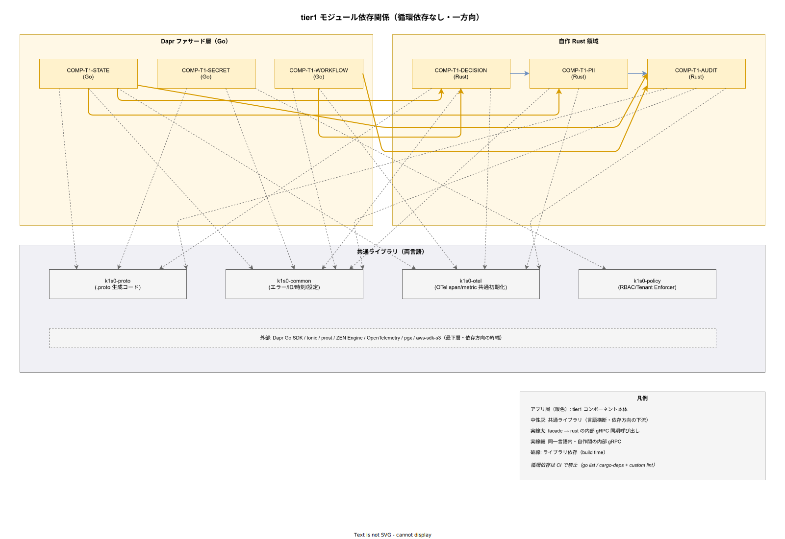

# 05. モジュール依存関係

本ファイルは IPA 共通フレーム 2013 の **ソフトウェア方式設計プロセス 7.1.2.1** に対応し、tier1 6 コンポーネント間の依存グラフ、循環依存の排除方式、依存方向ルール、共通ライブラリ（`k1s0-common` / `k1s0-proto` / `k1s0-otel` / `k1s0-policy`）の位置付け、パッケージ公開範囲を方式として固定化する。

## 本ファイルの位置付け

[04_コンポーネント責務一覧.md](04_コンポーネント責務一覧.md) で各コンポーネントの責務が確定した前提の下、本ファイルはコンポーネント間の呼び出し関係と依存方向を設計として固定化する。依存関係の誤設計は運用で「ある Pod を更新したら別 Pod がビルドできない」「循環依存で再リリース不能」といった事態を招くため、ソースコードレベルの依存グラフを明示的に管理する必要がある。

本ファイルは 2 つの依存軸を扱う。第 1 軸は runtime の内部 gRPC 呼び出し（コンポーネント間の runtime 依存）、第 2 軸は build-time のライブラリ import（crate / go.mod の静的依存）。この 2 軸が独立して健全に保たれていることが、Phase 1a〜1c の 2 名運用と Phase 2 の拡張を両立させる前提である。

## 設計 ID 一覧と採番方針

本ファイルで採番する設計 ID は `DS-SW-COMP-100` 〜 `DS-SW-COMP-119` の 20 件である。通番は [04_コンポーネント責務一覧.md](04_コンポーネント責務一覧.md) の DS-SW-COMP-099 から連続し、[06_パッケージ構成_Rust_Go.md](06_パッケージ構成_Rust_Go.md) で DS-SW-COMP-120 に継続する。

## 全体依存グラフ

6 コンポーネント + 共通ライブラリ 4 個の依存関係を下図に示す。矢印の向きは「A が B に依存する」で、実線太はランタイム gRPC 呼び出し、破線は build-time ライブラリ依存である。

図の読み方は 3 層で整理する。最上段の 6 コンポーネント（アプリ層、暖色）は Pod 単位で稼働する。中段の 4 共通ライブラリ（中性灰）は全 Pod から build-time に取り込まれる静的依存。最下段の外部 SDK（破線）は共通ライブラリが更に依存する外部ライブラリで、k1s0 の依存方向の終端を成す。コンポーネント間の実線太（facade → rust）は内部 gRPC であり、逆方向（rust → facade）と facade 間は禁止される。

## 依存方向の基本ルール

k1s0 は依存方向を 4 ルールで厳守する。ルール違反は CI で自動検出し、違反コミットはマージ禁止とする。

### DS-SW-COMP-100 facade 層間の相互呼び出し禁止

COMP-T1-STATE / COMP-T1-SECRET / COMP-T1-WORKFLOW の 3 facade Pod は、相互に内部 gRPC 呼び出しをしてはならない。例えば STATE が SECRET を呼ぶ（State 保存時に Secret を取得してキー暗号化する等）ことは禁止する。理由は facade 層の各 Pod が独立したスケール戦略・失敗ドメインを持ち、相互呼び出しが発生すると 1 Pod の障害が他 facade に波及するためである。共通処理が必要な場合は (a) 自作層（rust）に共通コンポーネントを配置して facade から呼ぶ、(b) tier2 側で BFF（Backend For Frontend）として合成する、のいずれかで解決する。

**確定フェーズ**: Phase 0。**対応要件**: NFR-A-CONT-003、NFR-E-AC-001〜005。

### DS-SW-COMP-101 自作層から facade 層への呼び出し禁止

COMP-T1-AUDIT / COMP-T1-DECISION / COMP-T1-PII の 3 rust Pod は、facade 3 Pod（STATE / SECRET / WORKFLOW）を呼び出してはならない。理由は facade 層は「公開 API を受ける役割」であり、自作層から呼ぶと API 契約に対して内部からの呼び出しが混ざり観測・監査・認可が混乱する。また循環依存の温床となる（facade → rust → facade）。自作層が tier1 内部でバックエンドにアクセスしたい場合は、自作層が直接 Valkey / Kafka / PG などに接続するか（AUDIT は PG に直接接続）、新たな rust コンポーネントを追加する。

**確定フェーズ**: Phase 0。**対応要件**: NFR-A-CONT-003、NFR-C-NOP-001。

### DS-SW-COMP-102 facade → rust の単方向依存

facade 3 Pod から rust 3 Pod への呼び出しは許可する。具体的には STATE → DECISION / PII / AUDIT、WORKFLOW → DECISION / AUDIT が主要パスである。SECRET は原則自作層を呼ばない（Secret 処理自体が ZEN 評価・PII マスキング・監査の発動と独立）が、Audit 発火だけは Kafka publish 経由で全 facade から AUDIT に非同期流入する（この経路は gRPC ではないので依存グラフ外）。依存方向は facade → rust のみを許可することで、facade 層のリリースが rust 層の再リリースを必要としない構造を維持する。

**確定フェーズ**: Phase 0。**対応要件**: NFR-A-CONT-003、DX-CICD-\*。

### DS-SW-COMP-103 rust → rust の依存は限定的に許可

自作層内部の rust → rust 呼び出しは「DECISION → PII」「PII → AUDIT」の 2 経路のみ許可する。DECISION → PII は判定結果に含まれる PII をマスクする用途、PII → AUDIT は PII マスキング処理の監査記録を残す用途である。逆方向（AUDIT → PII、PII → DECISION、AUDIT → DECISION）は禁止する。これらの経路を禁止する理由は AUDIT が downstream の Pod を呼ぶと書込パスが複雑化し、hash chain の連続性保証が壊れるためである。

**確定フェーズ**: Phase 0。**対応要件**: NFR-A-CONT-003、NFR-H-INT-001。

## 循環依存の排除方式

循環依存は runtime / build-time のいずれでも発生してはならない。以下の 3 手段で循環を構造的に排除する。

### DS-SW-COMP-104 有向非循環グラフ（DAG）の制約

コンポーネント依存グラフは必ず DAG とし、閉路を含んではならない。DAG 制約は CI でグラフ検査ツール（`go-cleanarch` + 自作 rust 解析ツール）で自動検証し、違反時は CI を fail させる。閉路検出時の推奨解決は「共通ロジックを新たな下位コンポーネント（または共通ライブラリ）に抽出する」「1 方向を非同期イベントに変換する（Kafka publish で逆依存を断つ）」の 2 択。どちらを選ぶかは影響範囲と緊急度で判断する。

**確定フェーズ**: Phase 0（ルール）、Phase 1a（CI 組込）。**対応要件**: NFR-C-NOP-001、DX-CICD-\*。

### DS-SW-COMP-105 Audit イベントの非同期化による循環回避

全 facade / rust コンポーネントは AUDIT に対して非同期 Kafka publish で監査イベントを送る。これは「AUDIT が facade / rust を呼ぶことを禁止」（DS-SW-COMP-101）のルールを崩さずに監査イベントを流入させる手段である。同期 gRPC で AUDIT を呼ぶと、例えば DECISION が AUDIT を呼び、AUDIT が PII を呼び、PII が DECISION を呼ぶと循環が発生する。非同期 Kafka に分離することで循環を構造的に排除し、かつ p99 レイテンシを保護する。

**確定フェーズ**: Phase 0（方式）、Phase 1b（実装）。**対応要件**: NFR-B-PERF-001、NFR-H-INT-001。

### DS-SW-COMP-106 共通ライブラリは Pod を呼ばない

共通ライブラリ（`k1s0-common` / `k1s0-proto` / `k1s0-otel` / `k1s0-policy`）は Pod（コンポーネント）を呼び出してはならない。理由は共通ライブラリが Pod を呼ぶと、その Pod の build に共通ライブラリ自身が必要となり循環する。共通ライブラリは外部 SDK と型定義のみを依存として持ち、runtime の network 呼び出しを行わない pure な library として実装する。例外として `k1s0-otel` は OpenTelemetry Collector に OTLP 送信するが、これは特定 Pod ではなくインフラ層 DaemonSet なので依存グラフ外とする。

**確定フェーズ**: Phase 0。**対応要件**: DX-CICD-\*、NFR-C-NOP-002。

## 共通ライブラリの位置付け

共通ライブラリは全 Pod から import される中央集権的な型・ユーティリティであり、その粒度と公開範囲は厳密に管理する。粒度を細かくしすぎると依存管理が爆発し、粗くしすぎると不要な import が増えて Pod 肥大化する。

### DS-SW-COMP-107 k1s0-proto の役割

`k1s0-proto` は tier1 内部 gRPC の Protobuf 自動生成コードを集約するライブラリである。Go 版は `src/tier1/go/internal/proto/` 配下に `protoc-gen-go` + `protoc-gen-go-grpc` で生成し、Rust 版は `src/tier1/rust/crates/proto-gen/` 配下に `tonic-build` で生成する。`.proto` ファイル本体は `src/tier1/contracts/` に一元配置し、CI で両言語版を生成する（詳細は [06_パッケージ構成_Rust_Go.md](06_パッケージ構成_Rust_Go.md) 参照）。このライブラリは全 facade / rust Pod から import される必須依存であり、変更は契約変更とほぼ同義のため PR レビューを厳格化する。

**確定フェーズ**: Phase 1a。**対応要件**: ADR-TIER1-002（Protobuf）、NFR-C-NOP-002。

### DS-SW-COMP-108 k1s0-common の役割

`k1s0-common` はエラー型・ID 生成・時刻ユーティリティ・設定ロード・tenant_id 抽出など、業務非依存の横断ユーティリティを集約する。Go 版は `src/tier1/go/internal/common/` 配下、Rust 版は `src/tier1/rust/crates/common/` 配下に置く。両言語版は API 名称を可能な限り揃え、例えば `NewTenantID()`（Go）と `new_tenant_id()`（Rust）のように、snake_case / camelCase の命名規約のみが言語差となる。機能追加は両言語同時に行い、片言語のみ先行させない。

**確定フェーズ**: Phase 1a。**対応要件**: DX-GP-\*、NFR-C-NOP-002。

### DS-SW-COMP-109 k1s0-otel の役割

`k1s0-otel` は OpenTelemetry の初期化・span 生成ユーティリティ・metric 命名規約を集約する。Go 版は `go.opentelemetry.io/otel` SDK + Prometheus exporter をラップし、Rust 版は `tracing` + `tracing-opentelemetry` + `opentelemetry-otlp` + `prometheus` crate をラップする。全 Pod は Pod 起動時に `k1s0_otel::init(pod_name, namespace)` で初期化し、以降の metric / trace 生成は統一された API で行う。命名規約（`k1s0_request_duration_seconds` 等）は本ライブラリで強制する。

**確定フェーズ**: Phase 1a。**対応要件**: FR-T1-TELEMETRY-\*、NFR-D-MON-\*、NFR-D-TRACE-\*。

### DS-SW-COMP-110 k1s0-policy の役割

`k1s0-policy` は JWT 検証・Tenant 境界確認・OPA Rego 評価・Rate Limit・冪等性キー管理のユーティリティを集約する。facade 層の Policy Enforcer モジュールから import され、rust 層の各 Pod も tonic Interceptor で同じ policy を適用する。policy.rego の実体は ConfigMap で配布され、library は rego 評価エンジンを内包する（OPA SDK）。Phase 1a では JWT + Tenant のみ、Phase 1b で RBAC / Rate Limit、Phase 1c で冪等性を追加する。

**確定フェーズ**: Phase 1a/1b/1c。**対応要件**: NFR-E-AC-001〜005、DX-GP-\*。

## パッケージ公開範囲

Go / Rust それぞれで package / crate の公開範囲を制約する。過剰に公開すると外部改修が内部実装を破壊するリスクが高まる。

### DS-SW-COMP-111 Go パッケージの公開範囲

Go は `internal/` ディレクトリ機構で public / internal を分離する。各 Pod の実装は `src/tier1/go/cmd/<pod>/internal/` 配下に置き、外部から import 禁止を Go compiler で強制する。唯一の公開 API は `src/tier1/go/pkg/` 配下に限定し、これは tier2 / tier3 用のクライアントライブラリ（Phase 1b で別リポジトリ化）にのみ使う。共通ライブラリ（`k1s0-common` / `k1s0-proto` / `k1s0-otel` / `k1s0-policy`）は `src/tier1/go/internal/common/`, `internal/proto/`, `internal/otel/`, `internal/policy/` 配下に置き、tier1 内部のみから import 可能とする。

**確定フェーズ**: Phase 1a。**対応要件**: NFR-C-NOP-002、DX-CICD-\*。

### DS-SW-COMP-112 Rust crate の公開範囲

Rust は crate 可視性で public / private を制御する。各 Pod の実装 crate は `src/tier1/rust/crates/audit/`, `decision/`, `pii/` に配置し、crate 名は `k1s0-audit` 等とするが Cargo workspace 内でのみ参照される（`crates-io` への publish は禁止）。共通 crate（`k1s0-common`, `k1s0-proto`, `k1s0-otel`, `k1s0-policy`）は Cargo workspace の `members` に含めて workspace 内 crate として参照し、`cargo publish` の対象外とする。`pub` 修飾子は最小限にし、internal 関数は `pub(crate)` で制限する。

**確定フェーズ**: Phase 1a。**対応要件**: NFR-C-NOP-002、DX-CICD-\*。

## 依存管理の CI 検査

依存関係の健全性は開発速度に直結するため、CI で自動検査する。

### DS-SW-COMP-113 Go 依存検査方式

Go の依存検査は 3 ツールで実施する。`go mod tidy` で `go.mod` 整合性を確認、`go-cleanarch` でアーキテクチャレイヤ（cmd → internal の一方向）を確認、自作スクリプト（`tools/check-deps.sh`）でコンポーネント間の依存ルール（DS-SW-COMP-100 〜 103）を確認する。PR ごとに全チェックを pass しないとマージ禁止とし、`CODEOWNERS` で tier1 アーキテクトのレビュー必須とする。

**確定フェーズ**: Phase 1a。**対応要件**: DX-CICD-\*、NFR-C-NOP-001。

### DS-SW-COMP-114 Rust 依存検査方式

Rust の依存検査は `cargo deny check bans`（禁止 crate 検査）、`cargo tree` + 自作スクリプト（circular detection）、`cargo audit`（脆弱性）の 3 層で実施する。`Cargo.toml` の `[workspace.dependencies]` で全 crate のバージョンを集約し、crate ごとの不整合を排除する。外部 crate の新規追加は ADR 起票を要し、ライセンス（`cargo deny check licenses`）と脆弱性（`cargo audit`）の両方で pass する必要がある。

**確定フェーズ**: Phase 1a。**対応要件**: DX-CICD-\*、NFR-E-ENC-001、NFR-F-ENV-\*。

### DS-SW-COMP-115 Protobuf 破壊的変更検査

`.proto` ファイルの破壊的変更は `buf breaking` で検出し、CI で fail させる。`.proto` 変更を含む PR は自動的に `k1s0-proto` の再生成と Go / Rust 両言語版の更新を要し、`k1s0-proto` 利用側 Pod の rebuild も連動させる（Argo CD の dependency graph）。`v1` の deprecation は別 ADR で 6 か月の並行期間を設け、その間は `v1` と `v2` を並列 serving する（詳細は [../03_内部インタフェース方式設計/01_内部gRPC契約方式.md](../03_内部インタフェース方式設計/01_内部gRPC契約方式.md) 参照）。

**確定フェーズ**: Phase 1a。**対応要件**: ADR-TIER1-002、DX-CICD-\*。

## 依存グラフの運用

### DS-SW-COMP-116 依存グラフの可視化と更新

依存グラフは本ファイルの drawio 図（[../img/モジュール依存関係.drawio](../img/モジュール依存関係.drawio)）で管理し、変更時は drawio + svg の両方を PR に含める。グラフの実体は CI 生成の `dependency-graph.json`（`go mod graph` + `cargo tree` + 自作解析）で提供し、Backstage の Software Catalog と連携して可視化する。drawio と自動生成グラフが乖離した場合は drawio を手動更新する（drawio は「意図された依存」、自動生成は「実装された依存」で、前者が source of truth）。

**確定フェーズ**: Phase 1c。**対応要件**: DX-BS-\*、NFR-C-NOP-002。

### DS-SW-COMP-117 新規コンポーネント追加時の依存審査

新規 rust / go コンポーネント追加は ADR 起票を要し、以下 4 点を審査する。(1) 依存方向が DS-SW-COMP-100 〜 103 に合致するか、(2) 共通ライブラリ（`k1s0-common` 等）のみ使用し他 Pod を runtime 依存としないか、(3) 既存コンポーネントの責務と重複しないか（[04_コンポーネント責務一覧.md](04_コンポーネント責務一覧.md) 参照）、(4) Phase 1a〜1c の 2 名運用を壊さないか。新 Pod 追加は Phase 2 以降で原則解禁するが、Phase 1b/1c でも上記条件を満たせば例外承認できる。

**確定フェーズ**: Phase 0（ルール）、各 Phase（新 Pod 審査）。**対応要件**: NFR-C-NOP-001、DS-SW-COMP-019（再評価条件）。

### DS-SW-COMP-118 deprecation 時の依存整理

Pod・API・共通ライブラリ関数の deprecation は以下の手順で行う。(1) 非推奨化を `@deprecated` アノテーションで宣言、(2) 利用側 Pod を特定して移行計画を発行、(3) 並行期間 6 か月で新旧両対応、(4) 並行期間終了後に削除。この 4 段階は `k1s0-common` のユーティリティ関数・内部 gRPC メソッド・Dapr Component 共通で適用する。deprecation 期間中の監視は Prometheus counter `k1s0_deprecated_call_total{api, version}` で実施する。

**確定フェーズ**: Phase 1c。**対応要件**: DX-BS-\*、DX-CICD-\*、NFR-C-NOP-002。

### DS-SW-COMP-119 外部 OSS バージョン更新の依存影響

Dapr Go SDK / tonic / prost / ZEN Engine / Kafka client / PG driver などの外部 OSS バージョン更新は、依存グラフを揺さぶる可能性がある。更新手順は Renovate（Phase 1b 以降）で自動 PR 化し、CI で全 Pod のビルド + unit test + integration test を実行して影響を可視化する。重大な破壊的変更（major version）は ADR 起票、マイナー/パッチは自動マージ（test pass 前提）とする。バージョン更新の頻度は週次（セキュリティパッチ）+ 月次（機能更新）を基準とする。

**確定フェーズ**: Phase 1b/1c。**対応要件**: DX-CICD-\*、NFR-C-NOP-002、NFR-E-ENC-001。

## 章末サマリ

### 設計 ID 一覧

| 設計 ID | 内容 | 確定フェーズ |
|---|---|---|
| DS-SW-COMP-100 | facade 層間の相互呼び出し禁止 | Phase 0 |
| DS-SW-COMP-101 | 自作層から facade 層への呼び出し禁止 | Phase 0 |
| DS-SW-COMP-102 | facade → rust の単方向依存 | Phase 0 |
| DS-SW-COMP-103 | rust → rust の依存は限定的に許可 | Phase 0 |
| DS-SW-COMP-104 | DAG 制約の CI 検査 | Phase 0/1a |
| DS-SW-COMP-105 | Audit イベントの非同期化 | Phase 0/1b |
| DS-SW-COMP-106 | 共通ライブラリは Pod を呼ばない | Phase 0 |
| DS-SW-COMP-107 | k1s0-proto の役割 | Phase 1a |
| DS-SW-COMP-108 | k1s0-common の役割 | Phase 1a |
| DS-SW-COMP-109 | k1s0-otel の役割 | Phase 1a |
| DS-SW-COMP-110 | k1s0-policy の役割 | Phase 1a/1b/1c |
| DS-SW-COMP-111 | Go パッケージの公開範囲 | Phase 1a |
| DS-SW-COMP-112 | Rust crate の公開範囲 | Phase 1a |
| DS-SW-COMP-113 | Go 依存検査方式 | Phase 1a |
| DS-SW-COMP-114 | Rust 依存検査方式 | Phase 1a |
| DS-SW-COMP-115 | Protobuf 破壊的変更検査 | Phase 1a |
| DS-SW-COMP-116 | 依存グラフの可視化と更新 | Phase 1c |
| DS-SW-COMP-117 | 新規コンポーネント追加時の依存審査 | Phase 0/各 Phase |
| DS-SW-COMP-118 | deprecation 時の依存整理 | Phase 1c |
| DS-SW-COMP-119 | 外部 OSS バージョン更新の依存影響 | Phase 1b/1c |

## 対応要件一覧

- NFR-A-CONT-003（バックエンド障害影響限定）、NFR-C-NOP-001（2 名運用）、NFR-C-NOP-002（可視性）
- NFR-D-MON-\*、NFR-D-TRACE-\*、NFR-E-AC-001〜005、NFR-E-ENC-001、NFR-F-ENV-\*、NFR-H-INT-001
- FR-T1-TELEMETRY-\*、DX-GP-\*、DX-CICD-\*、DX-BS-\*
- DS-SW-COMP-019（再評価条件への波及）

構想設計 ADR-TIER1-001（Go+Rust ハイブリッド）、ADR-TIER1-002（Protobuf）と双方向トレースする。
