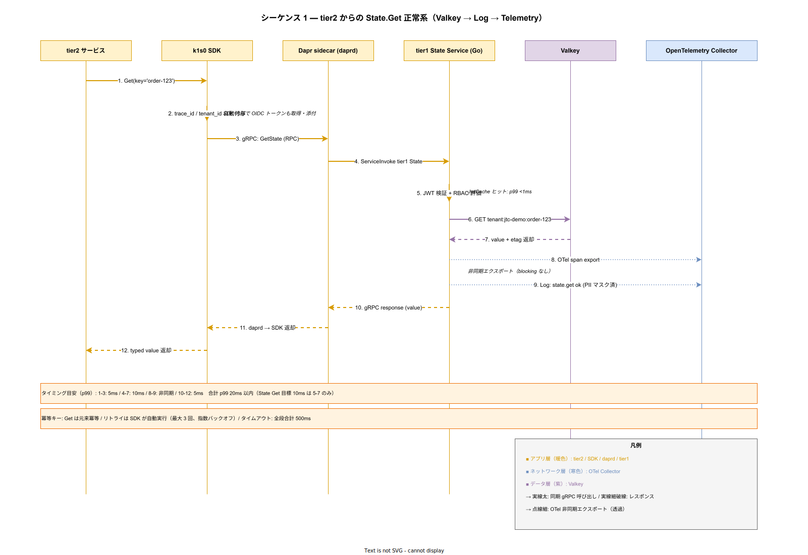
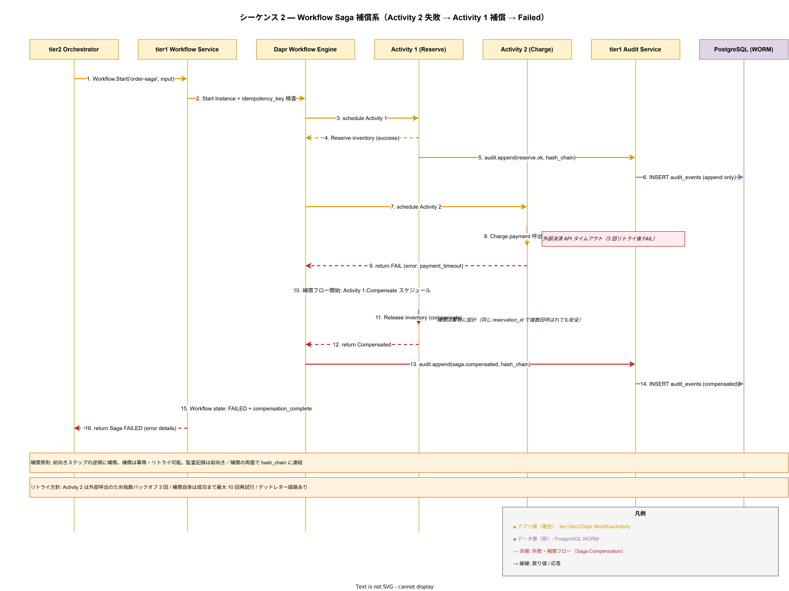
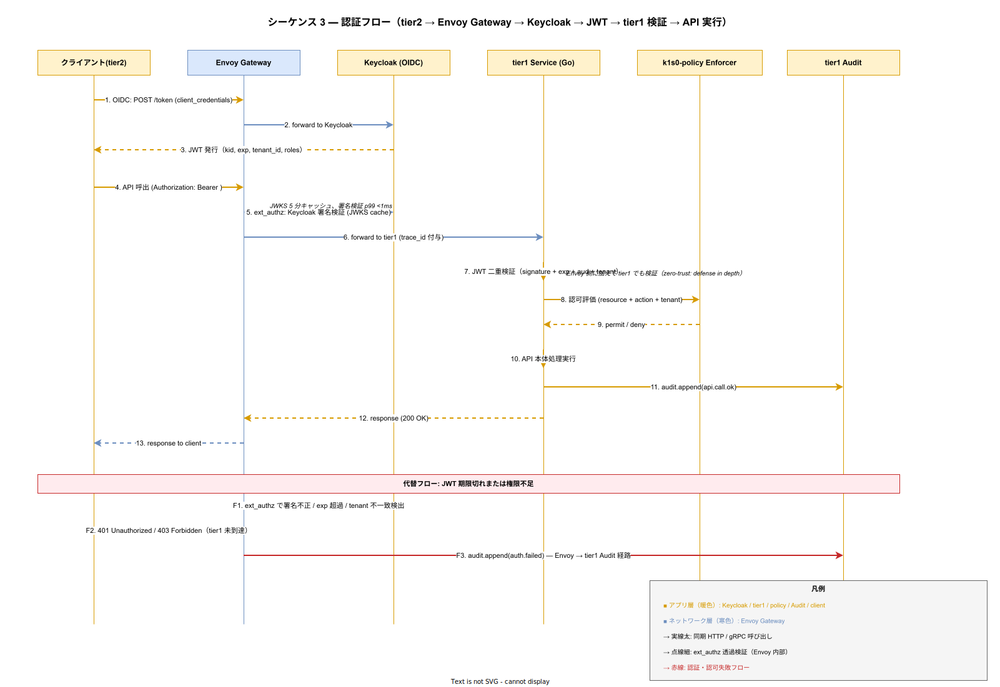

# 08. API シーケンス方式

本ファイルは IPA 共通フレーム 2013 の **7.1.2 ソフトウェア方式設計プロセス** の補遺として、tier1 公開 API の横断協調動作を時間軸シーケンスで方式化する。API 単体仕様は [02_外部インタフェース方式設計/06_API別詳細方式/](02_外部インタフェース方式設計/06_API別詳細方式/) で確定しており、本章はその集合が協調動作する際の流れ・タイムアウト・リトライ・冪等キー・補償経路を、代表 5 シナリオのシーケンス図を軸として方式確定する。

## 本ファイルの位置付け

API 単体の契約は個別 API 仕様書で記述できるが、複数 API が絡む協調動作（State.Set に伴う Audit 記録、Workflow.Start に伴う Activity 連携、Decision 評価後の Log / Telemetry 記録、認証フロー横断など）を個別 API 仕様の集合として表現すると、全体像が読み手に見えなくなる。結果、実装時に「Audit は誰がどのタイミングで記録するのか」「Workflow 補償はどの経路で走るのか」「認証失敗は Envoy と tier1 のどちらで止めるのか」の判断が分散し、実装者ごとに解釈が揺れる。

本章はこのギャップを埋め、**横断協調動作を単一の図で示す**。シーケンス図はコードの詳細化ではなく、責務境界・順序制約・タイムアウト / リトライ仕様・補償制御の連結表現である。Phase 0 稟議時点では代表 5 シナリオを固定し、Phase 1a デモで実コード寸法に合わせた微修正、Phase 1b 以降でシナリオを追加する。

個別 API 単体仕様との分担を明示する。本章は「複数 API が連動する流れ」を対象とし、単一 API の要求応答・エラーコード・バリデーション規則は個別 API 仕様側の責務とする。両者は同じ挙動を異なる視点から記述するため、記述が食い違った場合は個別 API 仕様を優先する。

## 代表シナリオ 5 件の選定基準

代表シナリオは以下 5 件とする。選定基準は「稟議時点で Phase 1b までに実装する必要があり、複数 API の横断協調が顕在化するもの」である。

1. **正常系**: tier2 → State.Get → Valkey → Log → Telemetry の基本往復。tier1 の最頻パスであり、全設計の土台。
2. **Saga 正常系**: tier2 → Workflow.Start → Activity 1 → Activity 2 → Complete。長時間処理の非同期協調。
3. **Saga 補償系**: Activity 2 失敗 → Compensate Activity 1 → Failed。障害時の回復経路。
4. **異常系**: Decision 評価失敗 → Fallback → Log Warning → tier2 へエラー返却。ZEN Engine ルール不整合時の対処。
5. **認証フロー**: tier2 → Envoy Gateway → Keycloak → JWT → tier1 検証 → API 実行。セキュリティ横断路。

本章は図 3 枚（シナリオ 1 / 3 / 5）を drawio で作成し、シナリオ 2 / 4 は散文で補う構成とする。図化を 3 枚に絞る理由は、Saga 正常系はシナリオ 3 の前段として既に含まれており、異常系は正常系の分岐として読み替え可能なためである。図 3 枚で全 5 シナリオの要点が読者に伝わる設計とする。

## 設計項目 DS-SW-SEQ-001 シナリオ 1 — State.Get 正常系

tier2 サービスが k1s0 SDK 経由で State.Get を呼び出し、Valkey から値を取得してクライアントに返すまでの最頻パスである。tier1 が保証する「認証の透過性」「trace_id 自動伝搬」「PII マスキング付きログ」「非同期 Telemetry」が全て登場する代表シーケンスとなる。

シーケンスの要点は以下である。第一に、tier2 は SDK への 1 行呼び出しのみで、認証ヘッダ・tenant_id・trace_id を意識しない。これらは SDK 内部で自動付与される。第二に、Dapr sidecar（daprd）は tier1 State Service への gRPC 呼出を仲介するが、tier2 から見ると daprd の存在は透過的である。第三に、tier1 State Service は JWT 検証と RBAC 評価を実施した後に Valkey へ照会する。JWT 検証は JwtCache ヒット時 p99 1ms 未満の設計で、全体の p99 10ms 目標を阻害しない。第四に、OpenTelemetry への span export と構造化ログ出力は非同期で、ブロッキングなしで応答を返す。

タイムアウト仕様は、SDK → daprd 間 200ms、daprd → tier1 間 300ms、tier1 → Valkey 間 50ms、Valkey 単体の応答 10ms を目標値とする。合計で 500ms 以内のタイムアウト予算を守る設計である。リトライは SDK 側で最大 3 回の指数バックオフ（100ms / 300ms / 900ms）とし、tier1 側では Valkey 接続エラー時のみ 1 回だけ再試行する。二重リトライ（SDK と tier1 の両方）が重なって障害を増幅しないよう、tier1 は幂等でないリトライを抑制する。

冪等キーは、Get 操作は本質的に冪等のため特別指定不要とする。Set 操作は SDK が自動生成する UUID を `Idempotency-Key` ヘッダで送信し、tier1 側で 24 時間のデデュプ窓を維持する。

## 設計項目 DS-SW-SEQ-002 シナリオ 2 — Saga 正常系（Workflow.Start → Activity 1 → Activity 2 → Complete）

tier2 オーケストレータが Workflow.Start を呼び、3 ステップの DAG が完走するパスである。シナリオ 3（補償系）の前段として同じ絵に含まれるため、本章では散文で要点のみを記述する。図は [シナリオ 3](#設計項目-ds-sw-seq-003-シナリオ-3--saga-補償系activity-2-失敗--activity-1-補償--failed) 参照。

要点は以下である。Workflow.Start 呼出時、tier1 Workflow Service は idempotency_key を検証し、重複起動を抑止する。Dapr Workflow Engine が instance を起動し、Activity 1（Reserve）をスケジュールする。Activity 1 完了後に Audit.Append で監査イベントを WORM 領域に追記し、hash_chain_prev / hash_chain_curr で改ざん検知可能な鎖を構成する。Activity 2（Charge）が成功するとさらに Audit を追記し、最終状態 COMPLETED で Workflow が終了する。

長時間処理の方式制約として、Activity 単体で 60 秒を超える処理は Activity 側で中間進捗を emit する設計とし、Dapr Workflow Engine の heartbeat 切れを防ぐ。Activity のタイムアウトは 5 分を上限とし、それを超える処理は Activity を分割する。Workflow 全体のタイムアウトは 24 時間を上限とし、それ以上は Temporal 採用時（Phase 2）に拡張する。

## 設計項目 DS-SW-SEQ-003 シナリオ 3 — Saga 補償系（Activity 2 失敗 → Activity 1 補償 → Failed）

Saga の中核となる補償経路である。Activity 2 が外部決済 API のタイムアウトで失敗し、Activity 1（Reserve）の補償を起動して在庫予約を解放し、Workflow 全体を FAILED で終了する。データ整合性を損なわずに部分失敗から回復する経路を方式として確定する。

補償方針の要点は以下である。第一に、補償は前向きステップの逆順に起動する。Reserve → Charge の順序で進んだ場合、Charge 失敗時は Reserve の補償（Release）を先に実施する。第二に、補償は冪等性を必須とする。同じ reservation_id で Release を複数回呼んでも副作用を生まない実装を Activity 側に要求する。冪等性がない補償は運用で再試行できず、障害時に手作業修復を必要とするためリスクが大きい。第三に、Audit は前向き／補償の双方で hash_chain に連結する。これにより、監査者は「いつ Reserve が成功し、いつ Charge が失敗し、いつ Release が補償されたか」を改ざん不可能な連鎖として確認できる。

リトライ方針は、Activity 2 の外部呼出に対して指数バックオフ 3 回を自動実行し、全て失敗した場合に補償フローへ遷移する。補償フロー自体は最大 10 回の再試行を行い、全て失敗した場合はデッドレター経路に振り分けて運用者による手動対応に委ねる。デッドレター経路は Kafka の `saga.compensation.deadletter` トピックで実装する。

Workflow 状態機械は Pending / Running / Compensating / Completed / Failed の 5 状態とし、Failed に至る経路は「補償完了後の Failed」と「補償も失敗した Failed」の 2 サブ状態を持つ。後者は運用アラートの重要度を上げる。

## 設計項目 DS-SW-SEQ-004 シナリオ 4 — Decision 評価失敗 → Fallback

Decision.Evaluate が ZEN Engine でルール評価に失敗した場合の分岐処理である。Decision の失敗はルール不整合・入力データ形式違反・外部データソース取得失敗 の 3 種類があり、それぞれで挙動が異なる。図化は省略し、散文で要点を記述する。

要点は以下である。ルール不整合（ZEN Engine がルール解析時に構文エラーを返す）の場合、tier1 は 500 Internal Server Error を返し、Log に `decision.rule_parse_error` を warning 以上の重大度で出力する。同時に Audit.Append で運用監査対象イベントを記録する。tier2 には構造化エラー（code=DECISION_RULE_ERROR）を返し、tier2 側で retry を抑制させる。

入力データ形式違反の場合、tier1 は 400 Bad Request を返し、Log に `decision.input_validation_error` を出力する。これはクライアント側の入力バグのため Audit は info レベルで記録する。tier2 は retry せず、呼出元にエラー伝播する。

外部データソース取得失敗（Decision が他の tier1 API を参照する場合）は、Fallback ルールが定義されていれば Fallback 結果を返し、定義されていなければエラーを返す。Fallback ルール自体も ZEN Engine で評価し、結果は通常経路と区別可能なメタデータ（`fallback=true`）を付けて返す。これにより tier2 側は Fallback 経由の結果を認識して保守的な判断を行える。

リトライ方針は、Decision 評価自体の retry は禁止する。ZEN Engine はルール評価が決定的で、retry しても結果は変わらないためである。外部データソース取得失敗のみ指数バックオフ 2 回を許可する。

## 設計項目 DS-SW-SEQ-005 シナリオ 5 — 認証フロー横断

tier2 が API を呼ぶ際の認証と認可の全経路を示す。Envoy Gateway での ext_authz 検証、tier1 での二重検証、Audit 記録の組合せが方式として確定する。

重要な方式決定は以下 3 点である。

第一に、JWT 検証は Envoy Gateway と tier1 の両方で実施する二重検証方式を採用する。単一検証で足りるという議論もあるが、ゼロトラスト原則（Defense in Depth）を実装レベルで担保する必要があり、Envoy が破壊されても tier1 側で防衛する構造を維持する。性能面の懸念は、Envoy 側の JWKS キャッシュと tier1 側の JwtCache（両方 5 分 TTL）で p99 1ms 以内に抑える。

第二に、認可評価は tier1 内の k1s0-policy Enforcer コンポーネントで集中的に行う。tier1 の各 API サービス（State / PubSub / Decision 等）は認可評価を自前で持たず、policy Enforcer に gRPC で問い合わせる。これにより、認可ルール変更時の影響を policy コンポーネントに局所化できる。

第三に、認証・認可失敗時は tier1 未到達で Envoy が 401 / 403 を即時返却する。同時に Envoy → tier1 Audit への非同期経路で失敗イベントを記録する。失敗イベントが欠落しないよう、Envoy 側で at-least-once 配送を担保し、Audit 側で重複排除する。

代替フローとして、JWT なしの呼出は 401、署名不正・exp 超過・aud 不一致は 401、tenant 不一致や role 不足は 403 を返す。エラーコード体系は RFC 7807（Problem Details for HTTP APIs）に準拠する。

## 設計項目 DS-SW-SEQ-006 タイムアウト・リトライ・冪等キーの横断方針

複数シナリオで共通する方針を本節で統合する。シナリオ個別の記述との整合は [#設計項目-DS-SW-SEQ-001-シナリオ-1--state-get-正常系](#設計項目-ds-sw-seq-001-シナリオ-1--stateget-正常系) 以下を参照。

タイムアウト予算は全 API 共通で 500ms を上限とする。これは企画で約束した p99 500ms を守る積算予算である。内訳は業務処理 200ms + Dapr 80ms + OTel 20ms + 監査 50ms + NW/DB 150ms とし、各セグメントで予算を超過した場合はその時点で打ち切って適切なエラーを返す。

リトライは SDK 側で指数バックオフ 3 回を標準とする。tier1 側のリトライは幂等性が保証される呼出（Get / Query 系）のみ 1 回許可し、Write / Modify 系は tier1 でリトライしない。二重リトライ（SDK と tier1 の両方）で障害を増幅しない設計である。

冪等キーは、Write 系 API（State.Set / PubSub.Publish / Workflow.Start / Secrets.Rotate / Decision.Evaluate 付随書込 / Feature.Change）で必須とする。SDK が UUID を自動生成し、`Idempotency-Key` ヘッダで tier1 に送る。tier1 は 24 時間のデデュプ窓で同一キーの重複処理を抑止する。

Read 系 API（State.Get / Secrets.Get / Decision.Evaluate 読取のみ / Feature.Status）は冪等キー不要とする。Read 自体が副作用を持たないためである。ただし、Read の結果が後続の Write の根拠となる場合、クライアント側で etag によるオプティミスティック並行制御を推奨する。

## 設計項目 DS-SW-SEQ-007 Audit 連動の共通方式

5 シナリオの全てで Audit が登場するため、共通方式を本節で集約する。

Audit 呼出は tier1 内部の自動フックとし、tier2 から明示的に呼び出す必要はない。tier1 の各 API サービスは、自身の処理完了時に Audit.Append を内部 gRPC で呼ぶ。これにより、tier2 の実装ミスで Audit が漏れるリスクを構造的に排除する。

Audit イベントのスキーマは、event_id（UUID）、timestamp（ナノ秒精度）、tenant_id、user_id（PII マスク前の内部 ID）、action（API 名と操作種別）、resource_id、result（ok / error）、hash_chain_prev、hash_chain_curr、metadata（JSONB）の 10 フィールドとする。hash_chain_curr は SHA-256(hash_chain_prev || event_id || timestamp || action || resource_id || result || metadata) で計算し、WORM テーブルへの INSERT と同時に確定する。

PII の扱いは、Audit テーブルに格納する user_id は内部 UUID（Keycloak の sub）のみとし、氏名・メール・住所などの個人情報は格納しない。監査者が必要時のみ Keycloak 経由で逆引きし、逆引き操作自体も Audit に記録する。

Audit 書込の失敗処理は、Audit.Append が失敗しても本体 API は成功として応答する。ただし Audit 失敗はアラート対象とし、Loki に Error ログを出力する。Audit が恒久的に失敗する場合は k1s0-policy の仕組みで Write 系 API を一時停止する緊急モードを Phase 1c で実装する。

## 設計項目 DS-SW-SEQ-008 Telemetry 連動の共通方式

5 シナリオの全てで Telemetry（OpenTelemetry）が登場するため、共通方式を本節で集約する。

Telemetry は OpenTelemetry Collector を経由して Mimir（メトリクス）・Tempo（トレース）・Loki（ログ）に分配する。Collector は tier1 Pod ごとに sidecar として配置せず、Node ごとの DaemonSet として配置する。これは sidecar 過多による Pod 密度低下を回避するためである。

trace_id は tier2 SDK が自動生成し、各 API 呼出で W3C Trace Context 形式の HTTP / gRPC ヘッダに付与する。tier1 各サービスは受信した trace_id を継承し、内部の span を子 span として連結する。これにより 1 本の tier2 → tier1 → Valkey までの呼出が 1 trace で可視化される。

span の sampling は、tier1 公開 API のルート span は 100% sampling、内部呼出の子 span は親の sampling 判定を継承する。これは「失敗した呼出のトレースが抜ける」を防ぐためである。高 QPS 時のストレージ逼迫は Phase 1c で tail-based sampling（失敗のみ残し成功は 1% sampling）に切替検討する。

Telemetry 書込の失敗処理は、Collector への送信が失敗しても本体 API は成功として応答する。Collector 側は in-memory キューで最大 5 分の滞留を許容し、backpressure 時は Loki / Tempo の書込優先度を下げてメトリクスを優先する。

## 設計項目 DS-SW-SEQ-009 Phase 別シナリオ拡張

代表 5 シナリオは Phase 進行に応じて以下の順で拡張する。

- **Phase 0（稟議時点）**: 5 シナリオの骨子・図 3 枚を確定。実コード呼出は Phase 1a 以降。
- **Phase 1a（MVP-0）**: 実コード呼出に合わせた微修正。PubSub Publish / Consume の追加図 1 枚。
- **Phase 1b（MVP-1a）**: Secrets Lease Rotation の図 1 枚、Feature Flag 評価の図 1 枚、Binding 外部連携の図 1 枚を追加。
- **Phase 1c（MVP-1b）**: 監査 hash_chain 整合性異常検知時の図 1 枚、災害復旧時のフェイルオーバー図 1 枚を追加。
- **Phase 2 以降**: Istio Ambient 採用時の mTLS 加入、Temporal 採用時の Workflow 表現差分を追加。

各 Phase でシナリオ拡張時は、[../80_トレーサビリティ/02_要件から設計へのマトリクス.md](../80_トレーサビリティ/02_要件から設計へのマトリクス.md) を同時に更新し、要件 ID と設計 ID の対応を維持する。

## 設計項目 DS-SW-SEQ-010 個別 API 単体仕様との整合確認

本章の各シナリオと、個別 API 単体仕様（[02_外部インタフェース方式設計/06_API別詳細方式/](02_外部インタフェース方式設計/06_API別詳細方式/)）の整合を、Phase 1a 着手前にチェックリストで確認する。

- [ ] シナリオ 1 の State.Get の応答仕様が `04_State_API方式.md` と一致
- [ ] シナリオ 2 / 3 の Workflow.Start / Activity 応答仕様が `06_Workflow_API方式.md` と一致
- [ ] シナリオ 4 の Decision.Evaluate エラー仕様が `09_Decision_API方式.md` と一致
- [ ] シナリオ 5 の認証フローが `03_認証認可インタフェース方式.md` および `00_API共通規約方式.md` と一致
- [ ] Audit / Telemetry の共通方式が `10_Audit_Pii_API方式.md` / `08_Telemetry_API方式.md` と一致
- [ ] タイムアウト・リトライ・冪等キーの数値が `00_API共通規約方式.md` と一致

整合不一致が発見された場合、原則として個別 API 単体仕様を優先し、本章を是正する。ただし、シナリオ視点から個別仕様の不整合が発覚した場合は、個別仕様側にも是正を依頼する。

## 対応要件一覧

本ファイルで採番した設計 ID（`DS-SW-SEQ-001` 〜 `DS-SW-SEQ-010`）と、充足する要件 ID を以下に列挙する。

- `DS-SW-SEQ-001`（State.Get 正常系）: `FR-T1-STATE-001` / `FR-T1-STATE-002` / `FR-T1-LOG-001` / `FR-T1-TEL-001` / `NFR-PERF-002`
- `DS-SW-SEQ-002`（Saga 正常系）: `FR-T1-WF-001` / `FR-T1-WF-002` / `FR-T1-AUD-001`
- `DS-SW-SEQ-003`（Saga 補償系）: `FR-T1-WF-003` / `FR-T1-WF-004` / `FR-T1-AUD-002` / `NFR-AVL-002`
- `DS-SW-SEQ-004`（Decision 失敗 Fallback）: `FR-T1-DEC-001` / `FR-T1-DEC-003` / `FR-T1-LOG-002`
- `DS-SW-SEQ-005`（認証フロー横断）: `FR-T1-AUTH-001` / `FR-T1-AUTHZ-001` / `NFR-SEC-001` / `NFR-SEC-002`
- `DS-SW-SEQ-006`（タイムアウト・リトライ・冪等キー共通方針）: `NFR-PERF-001` / `NFR-AVL-001` / 制約 6（非機能数値コミット）
- `DS-SW-SEQ-007`（Audit 連動共通方式）: `FR-T1-AUD-001` ～ `FR-T1-AUD-006` / `NFR-COMP-001`
- `DS-SW-SEQ-008`（Telemetry 連動共通方式）: `FR-T1-TEL-001` / `FR-T1-TEL-002` / `NFR-OBS-001` / `NFR-OBS-002`
- `DS-SW-SEQ-009`（Phase 別シナリオ拡張）: 間接対応（Phase 進行管理）
- `DS-SW-SEQ-010`（個別 API 単体仕様整合）: 間接対応（整合性担保）
