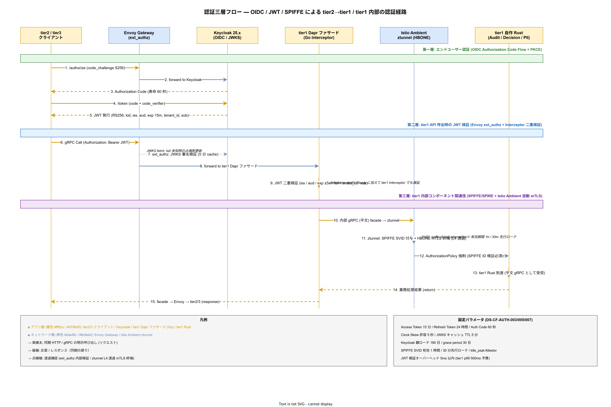

# 01. 認証方式設計

本ファイルは k1s0 tier1 公開 API 11 種および tier1 内部コンポーネント間通信のすべてに適用される認証方式を確定させる。認証は認可の前提となる最初のゲートであり、ここで破綻するとゼロトラスト方針・監査証跡・テナント分離のすべてが無効化される。本章は認証の実装方式をパラメータ単位まで固定化し、以降の各コンポーネント設計および制御方式設計の前提として参照される。

## 本ファイルの位置付け

採用側組織の情シス向けオンプレ基盤である k1s0 は、tier2 / tier3 開発者に「認証の実装を自分で書かない」ことを約束している。企画書の核心思想「tier1 は tier2 を楽にするために存在する」を実現するには、認証の実装を tier1 側で吸収し、tier2 / tier3 は `tenant_id` / `user_id` を受け取る前提で業務ロジックのみを書けば良い状態を作る必要がある。本ファイルはそのための実装契約を定義する。

認証方式は構想設計 ADR-SEC-001（Keycloak 採用）、ADR-SEC-003（SPIFFE/SPIRE 採用）で大枠が確定しているため、本章は具体的なフロー・パラメータ・失敗時挙動・監査連携までを詳細化する。監査対応時には本章のみを読めば tier1 の認証方式を説明できる水準で自己完結させる。

## 認証の全体像

k1s0 の認証は三層構造を取る。第一層はエンドユーザー（ヒト）認証であり、Envoy Gateway を入口として Keycloak の OIDC Authorization Code Flow with PKCE を実行し JWT を発行する。第二層は tier1 API 呼び出し時の JWT 検証であり、tier1 各コンポーネントの gRPC Interceptor で署名・クレーム・有効期限を検証する。第三層は tier1 内部コンポーネント間通信の認証であり、SPIFFE/SPIRE が発行する X.509 SVID を Istio Ambient mTLS が自動的に検証する。

この三層分離により、ヒト認証の実装詳細（OIDC プロバイダの種類・MFA の有無・SSO フェデレーション）が変化しても内部通信の認証には影響せず、逆に内部通信方式が変化してもエンドユーザー体験には影響しない。認証の構造変更コストを最小化する設計である。

この図を配置する理由は、認証三層が散文の階層列挙だけでは把握しづらく、「どの層の認証が、どのコンポーネント間で、どのプロトコルとタイムボックスで動くか」を時系列で追わない限り正しい実装イメージが湧かないためである。シーケンス図として各主体のライフラインを縦線で引き、通信ごとに水平矢印を配置することで、認可コード取得（60 秒寿命）から JWT 発行（15 分寿命）、JWKS 署名検証（5 分キャッシュ）、Interceptor 二重検証、Istio Ambient ztunnel による SPIFFE SVID 付与と HBONE mTLS 終端までの通信ステップを 15 手順として可視化する。

図の読み方は、画面上段の 3 色の帯で責務レイヤを区分した上で、上から下へ時系列に番号付き矢印を追うことである。暖色のライフライン（tier2/3 クライアント・Keycloak・tier1 Dapr ファサード・tier1 Rust）はアプリ層として明示呼び出しを受け持つ主体を示し、寒色のライフライン（Envoy Gateway・ztunnel）はネットワーク層として透過的に働く主体を示す。緑帯は第一層の OIDC フロー、青帯は第二層の JWT 検証、紫帯は第三層の SPIFFE/SPIRE mTLS フローである。右端に固定パラメータ（Access Token 15 分・JWKS 5 分キャッシュ・SVID 1 時間など）を添えており、具体値が散文のどの段落に対応するか即座に突き合わせられる。

この図が示す最重要な関係性は、第二層の JWT 検証が Envoy の ext_authz と tier1 Interceptor の 2 段で行われる defense in depth 構造と、第三層では tier1 Rust コンポーネント自身が mTLS を意識せず「平文 gRPC を話すだけ」で ztunnel が L4 透過的に SPIFFE ID 検証と暗号化を担う構造である。この 2 つの構造がセットで成立することで、アプリケーションコードは認証の実装負荷から解放されつつ、ゼロトラストの多層防御が維持される。

## エンドユーザー認証（第一層）

### Keycloak の採用と構成

エンドユーザー認証は Keycloak 25.x（LTS）を採用し、OIDC 1.0 および SAML 2.0 を同時提供する。OIDC は tier3 SPA および tier3 モバイルアプリ向け、SAML 2.0 は 採用側組織の既存基幹システムからの SP Initiated SSO 向けに提供する。Keycloak は 運用蓄積後で HA 構成（Keycloak Cluster 3 ノード + PostgreSQL バックエンド）とし、リリース時点 は単一 Pod とする。

Keycloak の Realm は `k1s0-platform` を 1 つ設け、テナントは Realm Role で分離する（構想設計で Realm per Tenant ではなく Role per Tenant を選択済み、理由は Realm 数が増えるほど運用 採用側の小規模運用の限界を超えるため）。ユーザープロビジョニングは SCIM 2.0 で行い、採用側組織の既存 Active Directory / LDAP からの自動同期を 採用後の運用拡大時 で確定する（採用初期 は手動プロビジョニング）。

### OIDC 認可コードフロー with PKCE

tier3 クライアントは Authorization Code Flow with PKCE（RFC 7636）を必須とする。Implicit Flow および Resource Owner Password Credentials Grant は全面禁止する。PKCE の `code_verifier` は長さ 43 〜 128 文字、`code_challenge_method` は `S256` のみ許可する。

認可コードの寿命は 60 秒、Access Token の寿命は 15 分、Refresh Token の寿命は 24 時間とする。Access Token の短寿命化は、漏洩時の影響範囲を時間的に限定するためであり、15 分という値は業界事例（Google Cloud IAM の既定 60 分を短縮、AWS IAM Access Token の既定 12 時間を大幅短縮）を参考に、リフレッシュ頻度と漏洩リスクのバランスから選定している。

Refresh Token は Redis ベースのブラックリスト機構で失効制御する。ログアウト時・パスワード変更時・管理者強制失効時に Refresh Token の `jti` クレームをブラックリストに登録し、TTL は元の Refresh Token 有効期限と同じ 24 時間とする。これにより Refresh Token の事実上即時失効を実現する。

### MFA と段階的強化

リリース時点 は Keycloak 標準のパスワード認証のみ / で TOTP（RFC 6238）を管理者ロール向けに有効化、採用後の運用拡大時 で一般ユーザーにも TOTP を展開し、WebAuthn（FIDO2）を管理者向けに追加する。多要素認証のポリシーは Keycloak の Authentication Flow で宣言的に定義し、Git 管理下の JSON で管理する。

## JWT 検証（第二層）

### 検証項目と許容アルゴリズム

tier1 各 API の gRPC Interceptor は、受信した JWT に対し以下の項目を全て検証する。検証に失敗した JWT は即座に 401 Unauthenticated で拒否し、認証失敗の監査ログを COMP-T1-AUDIT に記録する。

- 署名アルゴリズム: RS256 のみ許可。HS256 / none / ES256 は拒否する（RS256 は Keycloak 既定で、公開鍵検証と非対称性の両立が可能なため採用）。
- `iss` クレーム: `https://keycloak.k1s0.internal/realms/k1s0-platform` の完全一致。
- `aud` クレーム: `k1s0-tier1-api` が含まれること。複数 aud の場合は `k1s0-tier1-api` が含まれれば可。
- `exp` クレーム: 現在時刻より未来（NTP 同期後の UTC）、ただし 5 秒の clock skew を許容。
- `nbf` クレーム: 現在時刻より過去、同様に 5 秒 skew を許容。
- `tenant_id` カスタムクレーム: 文字列、正規表現 `^[a-z0-9-]{3,32}$` に合致。
- `sub` クレーム: 文字列、UUIDv4 形式。

### JWKS キャッシュと鍵ローテーション

署名検証用の公開鍵は Keycloak の JWKS エンドポイント（`/realms/k1s0-platform/protocol/openid-connect/certs`）から取得する。tier1 各コンポーネントは起動時に JWKS を取得し、インメモリにキャッシュする。キャッシュ TTL は 5 分、強制リフレッシュは `kid` が未知の場合に発動する。

Keycloak の鍵ローテーション周期は 180 日とし、ローテーション時は新旧両鍵が 30 日間併存する grace period を設ける。tier1 側は `kid` による鍵選択を実装し、ローテーション中も切れ目なく検証できる状態を維持する。

### 検証性能要件

JWT 検証のオーバーヘッドは tier1 API p99 500ms 予算のうち 5ms 以内に収める。実装は Go 側 `github.com/golang-jwt/jwt/v5`、Rust 側 `jsonwebtoken` crate を採用し、いずれも署名検証を 1 トランザクションあたり 1 回のみ実行するよう Interceptor で集約する。内部 gRPC 経由での検証結果伝搬は、認証済みコンテキストを `x-k1s0-auth-context` metadata で受け渡す。

## サービス間認証（第三層）

### SPIFFE/SPIRE ワークロード ID

tier1 内部コンポーネント間の認証は SPIFFE 1.0 仕様に準拠する X.509 SVID を用いる。SPIRE Server を Kubernetes 内に Deploy し、各 Worker ノードに SPIRE Agent を DaemonSet として配置する。Workload Attestation は Kubernetes Attestor Plugin（`k8s_psat`）で ServiceAccount + Pod Label を組み合わせて行う。

各 tier1 コンポーネントは SPIFFE ID を `spiffe://k1s0.internal/tier1/<component>` 形式で保持する。たとえば COMP-T1-STATE は `spiffe://k1s0.internal/tier1/state`、COMP-T1-AUDIT は `spiffe://k1s0.internal/tier1/audit` となる。SVID の有効期限は 1 時間、ローテーションは自動で 30 分周期（有効期限の半分で先行更新）とする。

### Istio Ambient mTLS の自動化

サービス間 TLS は Istio Ambient の ztunnel が L4 レベルで自動適用する。tier1 Pod は Sidecar を持たず、ztunnel が HBONE プロトコルで mTLS を終端する。アプリケーションコードは平文 gRPC を話すだけで、ネットワーク経路は自動で mTLS 化される。

Istio AuthorizationPolicy で「tier1 内部 gRPC は SPIFFE ID 検証必須」というルールを宣言的に強制する。ポリシーは Git 管理下 YAML で、Argo CD 経由で各クラスタに適用する。設定変更は全て PR レビュー必須とし、監査証跡に残す。

## 認証失敗時の挙動

### 失敗分類と HTTP / gRPC マッピング

認証失敗は以下の 5 分類とし、各分類で HTTP ステータス / gRPC コード / ログレベル / 監査記録の有無を固定する。分類を曖昧にすると、運用者が「どのエラーがクリティカルか」を判別できず、セキュリティインシデントと通常エラーが混在してしまう。

| 分類 | HTTP | gRPC | ログレベル | 監査記録 |
| --- | --- | --- | --- | --- |
| JWT 未提示 | 401 | UNAUTHENTICATED | warn | 有（`auth.missing_token`） |
| JWT 署名不正 | 401 | UNAUTHENTICATED | error | 有（`auth.invalid_signature`） |
| JWT 期限切れ | 401 | UNAUTHENTICATED | info | 有（`auth.expired`） |
| クレーム不整合 | 401 | UNAUTHENTICATED | warn | 有（`auth.claim_mismatch`） |
| Keycloak 到達不可 | 503 | UNAVAILABLE | error | 有（`auth.provider_down`） |

上表はエラー分類の索引である。実装上は tier1 共通 Interceptor が例外型 `AuthError` を発し、gRPC trailer の `grpc-status-details-bin` に `K1s0Error`（[07_エラーハンドリングとメッセージ方式.md](07_エラーハンドリングとメッセージ方式.md) 参照）を詰めて返却する。レスポンスボディに詳細理由を露出することは禁止する（セキュリティ上、失敗理由の切り分けを攻撃者に与えないため）。

### 一時ロックアウト

同一 `sub` / 同一 IP に対して 5 分間で 10 回以上の認証失敗が発生した場合、当該主体を 15 分間一時ロックアウトする。ロックアウト状態は Redis の `k1s0:auth:lockout:` キーで TTL 15 分保持する。ロックアウト中の認証試行は即座に 429 Too Many Requests で拒否し、監査ログに `auth.lockout_active` を記録する。

ロックアウト閾値の 5 分 10 回は、自動ボットによる総当たり（typical 100 req/s）を実質的に遮断しつつ、正当ユーザーのタイポ連打（典型的に 3〜5 回以下）を誤検知しない範囲で選定した。採用後の運用拡大時 で Keycloak Adaptive Authentication を有効化し、IP / デバイス / 地理情報による動的ロックアウト閾値調整を導入する計画である。

## 設計 ID 一覧

以降、本章で採番する設計 ID を列挙する。各 ID の詳細は上記各節の該当記述を参照する。

- **DS-CF-AUTH-001**: Keycloak 25.x LTS を OIDC/SAML プロバイダとして採用し、Realm per Platform × Role per Tenant 方式で運用する。確定段階 リリース時点。
- **DS-CF-AUTH-002**: OIDC Authorization Code Flow with PKCE（S256）を tier3 クライアント認証の唯一のフローとして採用する。確定段階 リリース時点。
- **DS-CF-AUTH-003**: Access Token 寿命 15 分、Refresh Token 寿命 24 時間、Authorization Code 寿命 60 秒、Clock Skew 5 秒を固定パラメータとする。確定段階 リリース時点。
- **DS-CF-AUTH-004**: tier1 全 API の gRPC Interceptor で JWT 検証（署名 RS256 / iss / aud / exp / nbf / tenant_id / sub）を必須化する。確定段階 リリース時点。
- **DS-CF-AUTH-005**: JWKS キャッシュ TTL 5 分、Keycloak 鍵ローテーション 180 日、grace period 30 日を固定する。確定段階 リリース時点。
- **DS-CF-AUTH-006**: SPIFFE/SPIRE による X.509 SVID を tier1 内部通信の ID とし、Istio Ambient ztunnel で自動 mTLS 化する。確定段階 リリース時点。
- **DS-CF-AUTH-007**: SVID 有効期限 1 時間、先行ローテーション 30 分周期を固定する。確定段階 リリース時点。
- **DS-CF-AUTH-008**: Refresh Token のブラックリスト機構を Redis で実装し、ログアウト / パスワード変更 / 管理者失効で即時失効を実現する。確定段階 リリース時点。
- **DS-CF-AUTH-009**: MFA を リリース時点 で管理者 TOTP、採用後の運用拡大時 で一般ユーザー TOTP と管理者 WebAuthn に段階展開する。確定段階 リリース時点 / 採用後の運用拡大時。
- **DS-CF-AUTH-010**: 認証失敗 5 分類のマッピングと、一時ロックアウト閾値 5 分 10 回・ロックアウト期間 15 分を固定する。確定段階 リリース時点。
- **DS-CF-AUTH-011**: 採用側組織の既存 Active Directory / LDAP との SAML 2.0 Federation を 採用後の運用拡大時 で確定する。採用初期 は手動プロビジョニング + SCIM 2.0 準備。確定段階 採用後の運用拡大時。

## 対応要件一覧

本章は以下の要件 ID に直接対応する。各要件の詳細は [../../03_要件定義/30_非機能要件/E_セキュリティ.md](../../03_要件定義/30_非機能要件/) および機能要件側の認証関連エントリを参照する。

- **NFR-E-AC-001** 〜 **NFR-E-AC-008**: エンドユーザー認証方式、MFA、パスワードポリシー、セッション管理、フェデレーション。
- **NFR-E-AC-009** 〜 **NFR-E-AC-012**: サービス間認証、ワークロード ID、mTLS 強制。
- **NFR-E-AC-013**（部分）: JWT クレーム `tenant_id` / `sub` の検証要件は認可章と重複するが、検証ロジックは本章に帰属。
- **NFR-H-AUD-003**: 認証成功・失敗の監査証跡要件、[04_監査証跡方式.md](04_監査証跡方式.md) に詳細方式を委譲。
- **FR-T1-AUDIT-001**: tier1 Audit API の入力元として本章の認証失敗イベントが使われる。

関連する構想設計 ADR は ADR-SEC-001（Keycloak）、ADR-SEC-003（SPIFFE/SPIRE）、ADR-TIER1-001（Go/Rust ハイブリッド）、ADR-0001（tier 一方向依存）である。
