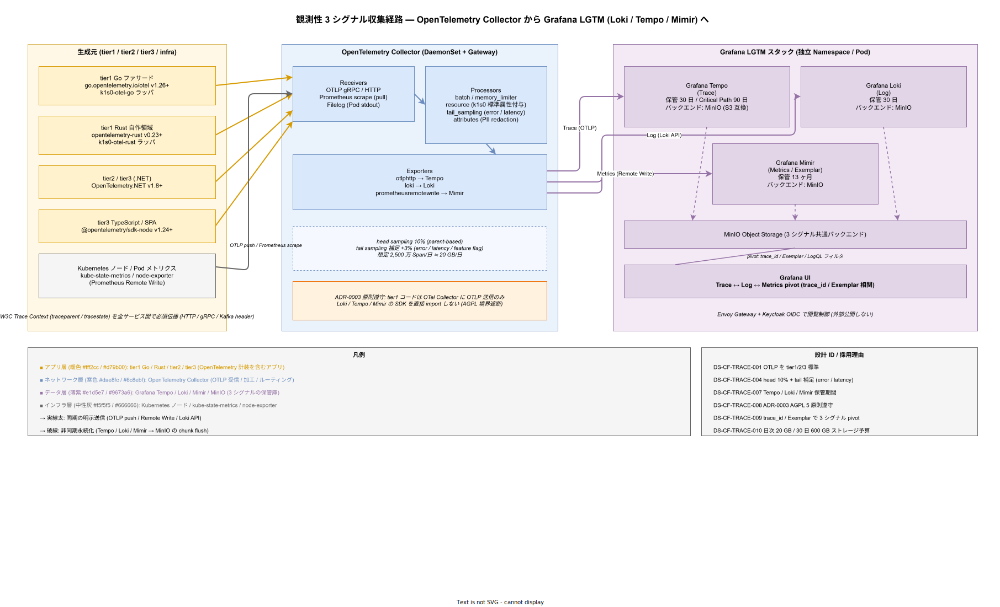

# 05. 分散トレーシング方式

本ファイルは tier1 / tier2 / tier3 を跨いだリクエストの流れを可視化する分散トレーシングの計装方式・サンプリング戦略・バックエンド構成・保管期間を確定させる。マイクロサービス基盤において分散トレーシングが無いと、p99 レイテンシ 500ms の予算超過が発生した際に「どの Span がボトルネックか」を特定できない。本章はその観測性を構造的に実現する方式を定める。

## 本ファイルの位置付け

JTC 情シスが従来抱えていた問題は「サービス A を呼び出したら遅かった、でも A 内部のどこで遅かったか分からない」というブラックボックス状態である。分散トレーシングはこの問題を、API ごとの Span ツリーを可視化することで解消する。企画書で約束した「障害原因特定時間の短縮」（MTTR 短縮）の主要実現手段である。

構想設計 ADR-OBS-001 で Grafana Tempo を採用、ADR-OBS-002 で OTel Collector を中継層に採用することが確定している。本章はこれらを前提に、計装ライブラリの選定・サンプリング戦略・標準属性・ログ相関を具体化する。

## 観測性 3 シグナルの全体像

分散トレーシングは単独で存在するのではなく、ログ（Loki）・メトリクス（Mimir）とセットで「観測性 3 シグナル」として扱う。3 シグナルが共通の OpenTelemetry Collector を経由し、同一 trace_id で相関できる構造を取るからこそ、Grafana 上で Trace ↔ Log ↔ Metrics の pivot が一気通貫に成立する。本章は分散トレーシングを主題としつつも、全体像の文脈なしに Tempo 単独の設計を語るのは片手落ちになるため、まず 3 シグナル全体の収集経路を俯瞰する。

この図を配置する理由は、「tier1 / tier2 / tier3 の各言語 SDK がどのように OTel Collector に集約され、どの Exporter でどのバックエンドに分配され、最終的に MinIO を共通ストレージとして Grafana から pivot 可能になるか」というデータフロー全体を、散文列挙ではなく 1 枚で把握できるようにするためである。OTel Collector が Receivers / Processors / Exporters の 3 段パイプラインで各シグナルを処理し、ADR-0003 の AGPL 境界遮断原則（tier1 は OTel Collector に OTLP 送信するのみで AGPL ライブラリを直接 import しない）を中継層として実現している構造が、散文だけでは掴みづらい。

図の読み方は、左から右へ「生成元（アプリ層の暖色と Kubernetes インフラ層の中性灰）→ OTel Collector（ネットワーク層の寒色）→ Grafana LGTM（データ層の薄紫）」の 3 ブロックで追うことである。左ブロックは OpenTelemetry SDK を持つアプリとインフラメトリクス源、中央ブロックは OTLP 受信・属性付与・サンプリング・PII redaction を担う Collector、右ブロックは Tempo / Loki / Mimir が共通 MinIO にチャンクを非同期 flush し、Grafana UI で trace_id と Exemplar を介して 3 シグナルを相互参照する構造である。右下の設計 ID 欄は、図の各要素が本章のどの DS-CF-TRACE-XXX に対応するかの索引となる。

この図が示す最重要な関係性は、「アプリは OTel Collector に OTLP を送るだけ、AGPL の Tempo/Loki/Mimir SDK には一切触れない」という ADR-0003 遵守の構造と、「3 シグナルが共通 MinIO を裏に置きながら、trace_id と Exemplar の 2 つのリンクキーで相互 pivot できる」という MTTR 短縮の実現構造である。前者が崩れると AGPL の感染リスクが tier1 コードに波及し、後者が崩れると「遅い Trace は見えるがその時のログが引けない」という観測性の断絶が起きる。両方セットで成立させる前提で以降の詳細方式を定める。

## 計装方式

### OpenTelemetry Protocol（OTLP）の採用

tier1 / tier2 / tier3 は全言語で OpenTelemetry 準拠の計装を必須とする。プロトコルは OTLP（HTTP/protobuf もしくは gRPC）とし、OTel Collector を受信点として tier1 内部で集約する。OTLP 以外の独自プロトコル（Jaeger Thrift、Zipkin JSON）は tier1 内部では禁止し、必要な場合は OTel Collector の Receiver で変換する。

### 言語別 SDK の採用

各言語で以下の OpenTelemetry 公式 SDK を採用する。カスタム実装は禁止し、互換性と保守性を SDK に委ねる。

- **Go**: `go.opentelemetry.io/otel` v1.26+（tier1 Dapr ファサード層）
- **Rust**: `opentelemetry-rust` v0.23+（tier1 自作領域、COMP-T1-AUDIT / DECISION / PII）
- **C#**: `OpenTelemetry.NET` v1.8+（tier2 / tier3 C# アプリ）
- **TypeScript**: `@opentelemetry/api` + `@opentelemetry/sdk-node` v1.24+（tier3 Node.js / SPA）

k1s0 は各言語向けに `k1s0-otel-<lang>` ラッパを提供し、初期化時に Trace Provider / Resource / Exporter / Sampler を一括設定する。開発者は初期化 1 行を呼ぶだけで標準計装が有効になる状態を作る。

### W3C Trace Context の伝播

サービス間 HTTP / gRPC 呼び出しでは W3C Trace Context（`traceparent` / `tracestate`）ヘッダを必須とする。これは OpenTelemetry SDK が自動注入 / 自動抽出するため、開発者は明示的な処理を書く必要はない。PubSub（Kafka）経由のイベントについても W3C Trace Context をメッセージヘッダに含める。

Trace ID は 128bit（32 桁 hex）、Span ID は 64bit（16 桁 hex）。k1s0 の tier1 内部では全 Span が同一 Trace ID を共有し、クロス tier の相関を可能にする。

## サンプリング戦略

### ハイブリッドサンプリング

全 Span を保存すると、中規模 150 RPS × 平均 Span 数 15/リクエスト = 2,250 Span/sec となり、30 日保管時で約 6 兆 Span、ストレージコストが許容範囲を超える。このため parent-based + tail-based のハイブリッドサンプリングを採用する。

**Parent-based head sampling**: ルート Span で 10% を採用決定する。一度採用された Trace は、同一 Trace 内の全 Span が記録される（ルート非採用なら全 Span 非採用）。これにより Trace の整合性（途中切れの無い状態）を担保する。

**Tail-based sampling**: OTel Collector に tailsampling processor を配置し、以下条件の Trace は 100% 採用する（head サンプリングで落ちても拾い上げる）。

- エラー Span を含む Trace（`error.code` 属性あり）
- レイテンシが閾値超過（tier1 API 500ms 超過、Decision API 5ms 超過、State Get 50ms 超過）
- Feature Flag `trace.full_capture` が該当テナントで有効

Tail-based のバッファ期間は 30 秒。30 秒を超えて Span が到着した Trace は head 判定のまま扱う（遅延耐性は運用で受容）。

### サンプリング結果の数値見積

head 10% + tail 補足（想定 3%）で有効サンプリング率は約 13%。日次保存 Span 数 = 2,250 × 86,400 × 0.13 = 約 2,500 万 Span/日。Span 平均サイズ 0.8 KB（属性込み）で日次約 20 GB、30 日で 600 GB。これが Tempo のストレージ予算基準となる。

## 標準属性セット

### k1s0 標準属性

全 Span は以下の k1s0 標準属性を設定する。これは OpenTelemetry Semantic Conventions に加えて、k1s0 運用で必須となる属性群である。属性不足は Trace 分析時に「どのテナントのどの API か」を特定できず分析不能となるため、必須化する。

- **k1s0.tenant_id**: テナント識別子。
- **k1s0.tier**: `tier1` / `tier2` / `tier3` / `infra` のいずれか。
- **k1s0.api**: tier1 API 名（例: `State.Get`）。tier2 / tier3 では該当 API 呼び出し時のみ。
- **k1s0.version**: サービスのセマンティックバージョン。
- **k1s0.env**: `dev` / `stg` / `prod`。
- **error.code**: エラー発生時のみ、`K1s0Error` のコード。
- **error.type**: エラー分類（`input` / `authn` / `authz` / `internal` / `external`）。

### カーディナリティ制御

Tempo は高カーディナリティ属性をうまく捌けないため、以下は属性として設定しない（ログ / メトリクスへ回す）。

- `resource_id` の生値（UUID 等）: ログには残すが Span 属性には入れない。
- `user_id`（JWT sub）: 同上。
- 動的計算値（タイムスタンプを文字列化した値、乱数等）。

これらは Span Event（別データ系統）として記録することで、Trace からログへの pivot 時に参照する。

## バックエンド構成

### Phase 1a のバックエンド

Phase 1a は AGPL OSS（Tempo）を採用しないため、Jaeger All-in-One（Apache 2.0）をスタンドアロン運用する。Jaeger All-in-One は単一プロセスで受信・格納・UI を提供し、単一 VM 構成の Phase 1a と相性が良い。ストレージは Jaeger 内蔵の badger DB、保管期間は 7 日とする。

### Phase 1b 以降のバックエンド

Phase 1b で Grafana Tempo に移行する。Tempo は AGPL OSS のため ADR-0003 の 5 原則を満たす構造で運用する。

- プロセス分離: Tempo は独立 Pod として稼働、tier1 プロセスとは別 Namespace。
- ライブラリリンクなし: tier1 コードは OTel Collector に OTLP で送るのみ、Tempo SDK を直接 import しない。
- 無改変利用: Tempo 公式 Docker イメージをそのまま使用、パッチ適用時は ADR 起票。
- 外部境界遮断: Tempo Query API は Envoy Gateway + Keycloak OIDC でアクセス制御、外部公開しない。
- 監査ログ可検証性: Tempo Query 操作を OTel Collector 経由で監査ログに送る。

ストレージバックエンドは MinIO（S3 互換）を用い、保管期間 30 日をデフォルトとする。Critical Path（SEV1/SEV2 発生経路、決済系）のみ 90 日保管する。90 日延長は Tempo の retention per tenant で制御する。

## ログとの相関

### trace_id 埋め込み

本章の Span Trace ID は、[03_ログ出力方式.md](03_ログ出力方式.md) の必須フィールド `trace_id` と一致する。OpenTelemetry SDK が自動的に同一 Context を参照し、同一 Trace 内のログ出力はすべて同じ trace_id を持つ。

Grafana で Trace 画面からログへ pivot（`Logs for this span` ボタン）すると、Loki の LogQL に `trace_id="xxx"` フィルタを自動付与して遷移する。逆方向（ログから Trace へ）も同様で、Loki のログエントリから Tempo Trace へワンクリック遷移できる。この相関が MTTR 短縮の実質的な主要手段となる。

### メトリクスとの相関（Exemplar）

Prometheus / Mimir の Exemplar 機能で、メトリクスから代表 Span Trace ID への pivot を実現する。p99 レイテンシが上昇した時点のメトリクスポイントをクリックし、該当 Trace を開く操作を想定する。[06_メトリクス収集方式.md](06_メトリクス収集方式.md) 側でも Exemplar 有効化を明記する。

## 設計 ID 一覧

- **DS-CF-TRACE-001**: OpenTelemetry Protocol（OTLP）を tier1 / tier2 / tier3 の標準計装プロトコルとして採用する。独自プロトコル禁止。確定フェーズ Phase 1a。
- **DS-CF-TRACE-002**: 言語別 SDK は公式 OpenTelemetry を採用し、`k1s0-otel-<lang>` ラッパで初期化を標準化する。Go v1.26+ / Rust v0.23+ / C# v1.8+ / TS v1.24+。確定フェーズ Phase 1a。
- **DS-CF-TRACE-003**: W3C Trace Context（traceparent / tracestate）をサービス間必須ヘッダとし、Kafka メッセージヘッダにも含める。確定フェーズ Phase 1a。
- **DS-CF-TRACE-004**: サンプリングは parent-based head 10% + tail-based（error / latency / feature-flag で 100% 補足）のハイブリッド、tail バッファ 30 秒。確定フェーズ Phase 1b。
- **DS-CF-TRACE-005**: k1s0 標準属性 7 項目（tenant_id / tier / api / version / env / error.code / error.type）を全 Span で設定する。確定フェーズ Phase 1a。
- **DS-CF-TRACE-006**: 高カーディナリティ値（resource_id 生値 / user_id / 動的値）は Span 属性に入れず、Span Event またはログ側で保持する。確定フェーズ Phase 1a。
- **DS-CF-TRACE-007**: Phase 1a は Jaeger All-in-One（保管 7 日 / badger DB）、Phase 1b 以降は Grafana Tempo（保管 30 日 / Critical Path 90 日 / MinIO バックエンド）。確定フェーズ Phase 1a / Phase 1b。
- **DS-CF-TRACE-008**: AGPL OSS（Tempo / MinIO）は ADR-0003 の 5 原則（プロセス分離 / 非リンク / 無改変 / 境界遮断 / 監査可検証性）を満たす構造で運用する。確定フェーズ Phase 1b。
- **DS-CF-TRACE-009**: trace_id はログの必須フィールドと一致し、Grafana で Trace ↔ Log ↔ Metrics の pivot を実現する。Exemplar を有効化する。確定フェーズ Phase 1b。
- **DS-CF-TRACE-010**: 想定 Span 量は中規模 150 RPS で日次 2,500 万 Span（圧縮後 20 GB / 日）、30 日保管で 600 GB をストレージ予算とする。確定フェーズ Phase 1c。

## 対応要件一覧

- **FR-T1-TELEMETRY-001** 〜 **FR-T1-TELEMETRY-004**: tier1 Telemetry API 機能要件。
- **NFR-C-OBS-001** 〜 **NFR-C-OBS-004**: 観測性、MTTR、相関分析。
- **NFR-B-PERF-001**: p99 レイテンシ監視と分析（tier1 API p99 500ms の達成状況を Trace で裏取り）。
- **NFR-E-SIR-012**: セキュリティインシデント分析時の Trace 利用。

構想設計 ADR は ADR-OBS-001（Grafana LGTM）、ADR-OBS-002（OTel Collector）、ADR-0003（AGPL 分離）である。ログとの連携は [03_ログ出力方式.md](03_ログ出力方式.md)、メトリクスは [06_メトリクス収集方式.md](06_メトリクス収集方式.md)、tier1 内部 API シーケンスは [../20_ソフトウェア方式設計/08_APIシーケンス方式.md](../20_ソフトウェア方式設計/08_APIシーケンス方式.md) を参照する。
