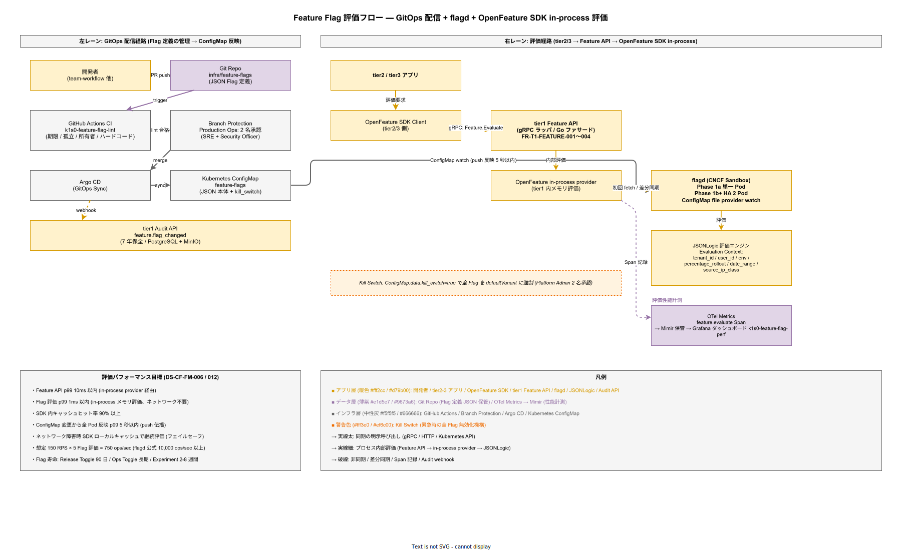

# 09. FeatureManagement 方式

本ファイルは k1s0 全体で利用する Feature Flag（機能フラグ）の評価エンジン、フラグ定義の管理経路、評価条件、パフォーマンス要件、フラグ寿命管理、Kill Switch 機構を確定させる。Feature Flag は機能の段階的リリース・運用時スイッチ・A/B テスト・テナント別先行公開を実現するための運用上の基本ツールであり、不在だと「機能を prod に出して不具合が出たら即ロールバック（Deploy 取り消し）」しか選択肢が無く、運用 2 名体制ではリスクが許容範囲を超える。

## 本ファイルの位置付け

JTC 情シスのリリース運用では、機能リリース = システム停止を伴うデプロイ、という硬直運用が典型的である。k1s0 は Feature Flag を基盤機能として全開発者に提供することで、「デプロイは頻繁、機能公開はフラグで段階的」という運用に移行する。これにより Mean Time To Recovery が短縮され、運用 2 名体制でも耐える設計に到達する。

構想設計 ADR-FM-001 で flagd（CNCF Sandbox、OpenFeature 準拠）を採用することが確定している。本章は flagd 運用の具体パラメータとフラグライフサイクル管理を固定化する。

## flagd の採用と構成

### 採用理由

flagd を採用する理由は、OpenFeature 標準に準拠しているためベンダロックインが無いこと、Single Binary で軽量稼働し運用 2 名体制に適合すること、CNCF Sandbox プロジェクトでエンタープライズ事例（Dynatrace 他）が蓄積されていること、の 3 点である。LaunchDarkly 等の SaaS は閉域運用前提の k1s0 方針（設計原則 10）と不適合のため採用しない。

### Phase 別構成

Phase 1a は flagd スタンドアロン（単一 Pod、JSON ファイル直読み）で起動し、Phase 1b 以降で GitOps 化（Git → Argo CD → ConfigMap → flagd watch）、Phase 2 で GUI エディタ（flagd-ui または自作 Backstage プラグイン）を導入する計画である。

Phase 1a は flagd プロセス 1 つで全フラグ評価を捌く。中規模 150 RPS × 1 リクエスト平均 5 フラグ評価 = 750 ops/sec は flagd 単一インスタンスで余裕に対応できる（flagd 公式ベンチ 10,000 ops/sec 以上）。Phase 1b 以降は HA 構成（flagd 2 Pod + Kubernetes Service）とする。

## Feature Flag の 4 種類

k1s0 では Feature Flag を以下 4 種類に分類する。分類することで、フラグの寿命・レビュー頻度・責任主体が機械的に決まり、フラグの「放置」（使わなくなったフラグがコード内に残り続ける）を防ぐ。

### Release Toggle（リリーストグル）

新機能を段階的に有効化するためのフラグ。デプロイと機能公開を分離し、prod にコードを入れた後 Feature Flag で一部ユーザーにのみ公開、問題が無ければ全体公開、問題があれば即フラグ OFF でロールバックする。

寿命は 90 日以内とし、90 日経過後は「フラグ削除 + コード path 削除」が義務化される。90 日超過フラグは静的チェック（CI）で検出され、PR がブロックされる（後述）。

### Ops Toggle（運用トグル）

運用時のスイッチ。障害時のフォールバック経路の切替、負荷時の機能縮退、メンテナンス時の書き込み停止などに用いる。寿命は長期（数年単位）を許容するが、定期レビュー（年次）で必要性を確認する。

### Experiment Toggle（実験トグル）

A/B テスト用のフラグ。ユーザーセグメント別に異なる挙動を提供し、メトリクスで比較する。寿命は実験期間（典型 2〜8 週間）で終了し、結果確定後に削除または Release Toggle に昇格する。

### Permission Toggle（権限トグル）

特定ユーザー / テナント向けに先行機能を提供するフラグ。早期採用者（Early Adopter）への公開、内部向けドッグフーディング、デモ用の特殊機能有効化など。寿命は中期（数か月〜1 年）、所有者が変わる場合は Release Toggle か Ops Toggle に再分類する。

## フラグ定義の管理

Feature Flag の運用で最も事故が起きやすいのは「誰がどの Flag を何時どう変えたか」の記録と、「変更が本番に到達するまでの経路」が分散して見えない状態である。k1s0 では Git 管理と GitOps 配信経路を一元化し、同時に tier2/3 アプリから tier1 Feature API を経由して flagd の in-process 評価に至るまでの評価経路も 1 つの図で俯瞰する。配信経路と評価経路は別レーンで並走するが、交点の ConfigMap と flagd で結合するため、片方だけ読んでも運用イメージが完結しない。



この図を配置する理由は、Feature Flag の「配信」と「評価」という性質の異なる 2 つの経路が本章の複数節（フラグ定義の管理・評価エンジン・tier1 Feature API・監査とガバナンス）に散在しており、読者が各節を往復しないと全体構造を再構築できない状態を解消するためである。左レーンに Git → CI → Branch Protection → Argo CD → ConfigMap → Audit API の配信経路を、右レーンに tier2/3 アプリ → OpenFeature SDK → tier1 Feature API → in-process provider → flagd → JSONLogic の評価経路を置き、両レーンが ConfigMap watch（push 反映 5 秒以内）と OTel Metrics 計測で接続される構造を示す。

図の読み方は、まず左レーン（インフラ層の中性灰を中心に GitHub Actions・Branch Protection・Argo CD・ConfigMap の GitOps 基盤が並ぶ）を上から下に辿ってフラグ定義の変更が本番に到達するまでの経路を確認し、次に右レーン（アプリ層の暖色でアプリと SDK と flagd が並ぶ）を左から右に辿って評価リクエストが in-process で完結することを確認する。左下の性能目標ボックスは「p99 10ms / キャッシュヒット率 90% / push 伝播 5 秒」など評価経路の SLO を集約し、図中の矢印ラベルと対応する。オレンジの Kill Switch 警告ボックスは、通常評価経路をバイパスして全 Flag を defaultVariant に強制する緊急機構の境界を明示する。

この図が示す最重要な関係性は 3 点ある。第一に、Flag 評価がネットワークを介さず tier1 Feature API プロセス内の in-process provider で完結するため、Flag 評価が tier1 API p99 500ms 予算をほぼ消費しない構造になっている。第二に、ConfigMap 変更が Argo CD 経由で flagd に watch で push 反映され、かつ同時に Audit API に webhook として 7 年保全の監査証跡を残す構造になっており、「Flag 変更したが監査に残っていない」整合ずれが構造的に検出可能である。第三に、Kill Switch は評価経路の外側から ConfigMap を上書きすることで全 Flag を即時 default に戻す独立系統として配置されており、通常の評価経路に障害があっても機能縮退を保証する。

```json
{
  "flags": {
    "enable-new-workflow-ui": {
      "type": "release",
      "owner": "team-workflow",
      "created_at": "2026-04-15",
      "expires_at": "2026-07-14",
      "state": "ENABLED",
      "variants": { "on": true, "off": false },
      "defaultVariant": "off",
      "targeting": {
        "if": [
          { "in": ["tenant-a", {"var": "tenant_id"}] }, "on",
          "off"
        ]
      }
    }
  }
}
```

ファイルは Argo CD が Kubernetes ConfigMap にマッピングし、flagd は ConfigMap を file provider で watch する。ConfigMap 更新から flagd 反映までの遅延は p99 10 秒以内とする。

### レビューとロールアウト

フラグ変更は PR レビュー必須とし、以下のレビュー観点を CI で機械検査する。

- 寿命期限（`expires_at`）が適切に設定されているか（Release Toggle は 90 日以内）
- 所有者（`owner`）が Github Team として実在するか
- Evaluation Context（`tenant_id` / `user_id` / `env` 等）の使用が正規化されているか
- 変更差分がプロダクション影響ある場合、Security Officer のレビュー承認があるか

## 評価エンジンと評価条件

### 評価条件の構文

targeting rule は JSONLogic 構文を採用する。flagd は JSONLogic を内蔵評価しており、追加依存なく利用できる。評価可能な変数（Evaluation Context）は以下に限定する。

- `tenant_id`（string）
- `user_id`（string）
- `env`（`dev` / `stg` / `prod`）
- `percentage_rollout`（0-100 の整数、hash(user_id) % 100 で判定）
- `date_range`（`from` / `to`、unix timestamp）
- `source_ip_class`（`office` / `vpn` / `external`）

これらの組合せで、「prod 環境 × tenant-a × 50% 段階公開」「2026-06-01 から 2026-06-30 の期間限定」のようなルールを宣言的に書ける。

### 評価性能

flag 評価の p99 レイテンシは 1 ミリ秒以内を目標とする。flagd は in-process キャッシュを持ち、OpenFeature SDK が各言語に提供する in-process provider と組み合わせることで、アプリケーション側のメモリ内評価（ネットワーク不要）を実現する。初回起動時に flagd から fetch、以降は ConfigMap 更新時の差分同期のみ行う。

この in-process 評価により、tier1 API の p99 500ms 予算にフラグ評価が占める比率は 0.2% 以下となり、無視可能水準に収まる。

## Kill Switch 機構

### 緊急全 Flag 無効化

セキュリティインシデント発生時や壊滅的バグ検知時に、全 Feature Flag を即時 default variant に戻す「Kill Switch」機構を提供する。Kill Switch は Platform Admin ロールのみが起動可能で、起動には 2 名承認（Platform Admin 2 名の同意）を必須とする。

起動手順は以下。

1. Platform Admin A が `kubectl patch configmap feature-flags -p '{"data":{"kill_switch":"true"}}'` を実行。
2. flagd は kill_switch が true の場合、全 Flag を defaultVariant で評価する（targeting を無視）。
3. 監査ログに `feature.kill_switch_activated` を記録、Security Officer と全 Platform Admin に Slack 通知。
4. 解除は Platform Admin B が ConfigMap を戻し、Platform Admin A が承認。

Kill Switch 起動から全 Pod 反映までの時間は 10 秒以内を目標とする（flagd watch 反映 + OpenFeature in-process キャッシュ更新）。

### 単一 Flag の緊急 OFF

Kill Switch まで行かない場合、単一 Flag を`state: DISABLED` に更新して PR マージ → Argo CD 反映で無効化する。緊急時は PR レビューを 1 名承認に短縮でき、Security Officer の事後レビューで正当性を確認する運用とする。

## フラグ寿命管理

### CI による静的チェック

Feature Flag の「放置」を防ぐため、CI で以下を機械検出する。

- **期限切れ Release Toggle**: `expires_at` を超過している Release Toggle は CI fail。
- **孤立 Flag**: コード内で参照されなくなった flag は CI 警告。
- **ハードコード参照**: Flag キー名のハードコード（文字列リテラル直書き）は CI 警告、定数化を促す。
- **所有者不在**: `owner` Github Team が存在しない場合 CI fail。

静的チェックは `k1s0-feature-flag-lint` として内製し、monorepo のフック or GitHub Actions で全 PR に適用する。

### 削除の標準フロー

Flag を削除する際は以下の順で進める。これを守らないと、コード削除 vs Flag 削除の順序で障害が発生する（コード先削除なら Flag 評価で例外、Flag 先削除ならデフォルト挙動で想定外）。

1. コードから flag 参照を削除（defaultVariant 側を残す）。
2. PR マージ、prod 反映。
3. 1 週間以上経過を確認（rollback 余地の確保）。
4. Flag 定義を JSON から削除。
5. PR マージ、ConfigMap 更新。

## tier1 Feature API との関係

tier1 Feature API（FR-T1-FEATURE-001〜004）は、OpenFeature SDK を tier1 gRPC API でラップし、tier2 / tier3 へ提供する。tier2 / tier3 開発者は Feature API クライアントを呼ぶだけで、flagd の存在を意識せずに Feature Flag を評価できる。内部では in-process provider で flagd に接続する。

tier1 Feature API の詳細は [../20_ソフトウェア方式設計/02_外部インタフェース方式設計/06_API別詳細方式/11_Feature_API方式.md](../20_ソフトウェア方式設計/02_外部インタフェース方式設計/06_API別詳細方式/) を参照する（ファイル名は該当ディレクトリの並びに従う）。本章は flagd 運用と Flag ライフサイクルに限定して扱う。

## A/B テスト基盤

Release Toggle / Ops Toggle に加えて、Experiment Toggle を運用する A/B テスト基盤を整備する。属人的な実装で A/B テストを回すと、割当アルゴリズムや統計解釈の再現性が担保できず、意思決定の根拠が揺らぐ。k1s0 では割当 / メトリクス / 統計判定 / 実験登録 / 偏り検査の 5 要素を OSS で共通化し、どの開発チームが実施しても同じ品質の実験になる運用にする。

### 割当と一貫性

A/B 割当は `hash(experiment_id + user_id) % 100` のシード固定ハッシュで行う。これにより、同一ユーザーは同一実験では常に同じグループに割り当てられ、セッションを跨いだ実験結果の揺れを防ぐ。flagd の `percentage_rollout` 評価を拡張する形で実装し、OpenFeature SDK 側には追加 API を露出しない（Evaluation Context で `experiment_id` を追加するのみ）。

### メトリクス統合

グループ別の KPI は OpenTelemetry Metrics で計測する。実験 ID をラベル `experiment_id` で全メトリクスに付与し、Mimir 側で `sum by (experiment_id, variant) (rate(k1s0_business_metric[5m]))` でグループ間比較を可能にする。Backstage に「実験ダッシュボード」プラグインを配置し、実験期間中のリアルタイム KPI 差分を共有する。

### 統計的有意性

実験の開始前に、仮説 / 比較メトリクス / 最小サンプルサイズ / 実験期間を必須記載で Backstage に登録する。最小サンプルサイズは `k1s0-experiment-calculator`（内製 CLI）で事前計算する（有意水準 α=0.05、検出力 1-β=0.80、想定効果量から算出）。実験終了後は p-value < 0.05 と最小サンプルサイズ達成を両立した場合のみ「有意」と判定する。どちらかが未達の場合は「継続」「中止」「設計見直し」の 3 択を Product Council で判断する。

### 偏り検査（A/A テスト）

本実験前に、同一処理を 2 グループに割り当てる A/A テストを 1 週間実施する。A/A の KPI に 5% 以上の差が出た場合、割当ハッシュの偏りまたはメトリクス集計の欠陥を疑い、修正後に本実験を開始する。この予防的検査により、「有意差が出たが実は割当バグ」の誤判定を避ける。

## Flag 評価パフォーマンス

flag 評価のレイテンシが業務 API の p99 予算を侵食すると、プラットフォーム全体の性能が劣化する。k1s0 では in-process 評価を前提とした性能目標を明確化し、継続的に計測・可視化・改善する。

**設計項目 DS-CF-FM-012 評価パフォーマンス目標と計測**

評価性能の目標値は、tier1 Feature API の p99 10ms 以内（in-process provider 経由）、SDK 内キャッシュヒット率 90% 以上、flagd ConfigMap 変更から全 Pod 反映までの push 伝播時間 5 秒以内（p99）とする。計測は OpenTelemetry Span で Feature Flag 評価を `feature.evaluate` Span として記録し、Mimir に保存後 Grafana ダッシュボード `k1s0-feature-flag-perf` で可視化する。目標を 3 か月連続達成できない場合、キャッシュ TTL・flagd レプリカ数・Evaluation Context サイズのいずれかを改善対象として Jira チケットを自動起票する。ネットワーク障害時は SDK ローカルキャッシュで継続評価するフェイルセーフ動作を標準実装とし、flagd 接続不能になっても業務が止まらない構造を担保する。確定フェーズは Phase 1c。

## 監査とガバナンス

Flag 変更は本番挙動を即座に変える強力な操作であり、監査証跡と承認フローを欠くと「誰が変えたか分からない」状態で本番事故の原因特定が困難になる。変更ログ・承認フロー・アクセス制御の 3 軸でガバナンスを構造化する。

**設計項目 DS-CF-FM-013 変更ログと 7 年監査保全**

flagd の設定 JSON 変更は全て Git commit で記録されるため、Git log が一次監査証跡となる。これに加え、Argo CD Sync 実行時に tier1 Audit API（FR-T1-AUDIT-001）へ Webhook を発火し、「誰が・いつ・どの Flag を・どの状態に・どの PR で変更したか」を構造化監査ログに記録する。保持期間は 7 年（電帳法・J-SOX に整合）、記録先は PostgreSQL + MinIO の 3 層冗長とし、Object Lock で改ざん防止を担保する。Backstage の Flag 履歴プラグインは Git commit と Audit API の両方を突合表示し、「Git log では `production` 環境の Flag 変更が Audit API に記録されていない」ような整合ずれを検出する。

**設計項目 DS-CF-FM-014 Production Ops Flag 2 名承認フロー**

Production 環境の Ops Toggle 変更は GitHub Branch Protection で `production-ops-flags-approvers` チーム 2 名の承認を必須とする。チームは SRE（起案者または協力者）と Security Officer の少なくとも 1 名ずつを含む構成とし、単一ロールの単独承認を構造的に排除する。Release / Experiment Toggle の変更は開発チーム権限（1 名承認）で許容し、Permission Toggle は管理者権限（Platform Admin 1 名承認）で扱う。ロール別の権限境界は Keycloak realm の role と GitHub Team を 1:1 マッピングし、Backstage で常時可視化する。

**設計項目 DS-CF-FM-015 ロールバック記録と四半期監査レビュー**

Flag による機能無効化（Kill Switch 含む）は、通常の変更と同様に監査 API に `feature.rollback` イベントとして記録する。緊急オフの場合も、事後 24 時間以内に PR を起票し、Git log + Audit API の両方で痕跡を残すことを運用ルール化する。四半期ごとに Product Council で Flag 変更監査レビューを開催し、過去 3 か月の Production 変更件数・緊急オフ件数・未解決の期限切れ Release Toggle 件数をレビューする。監査レビューの指摘事項は Backstage の検索可能インデックスに追加し、次回レビューで追跡する。確定フェーズは Phase 1c。

## 設計 ID 一覧

- **DS-CF-FM-001**: flagd（CNCF Sandbox、OpenFeature 準拠）を Feature Flag 評価エンジンとして採用、Phase 1a スタンドアロン → Phase 1b HA → Phase 2 GUI 段階導入。確定フェーズ Phase 1a / Phase 1b / Phase 2。
- **DS-CF-FM-002**: Feature Flag を 4 種類（Release / Ops / Experiment / Permission）に分類、各種別に寿命と責任主体を紐付けする。確定フェーズ Phase 1a。
- **DS-CF-FM-003**: Release Toggle の寿命は 90 日以内、CI で `expires_at` 超過を検出して PR ブロックする。確定フェーズ Phase 1b。
- **DS-CF-FM-004**: Flag 定義は Git 管理（`infra/feature-flags`）+ Argo CD + ConfigMap 反映、ConfigMap → flagd 反映遅延 p99 10 秒以内。確定フェーズ Phase 1b。
- **DS-CF-FM-005**: 評価条件は JSONLogic、Evaluation Context 6 種（tenant_id / user_id / env / percentage_rollout / date_range / source_ip_class）に限定。確定フェーズ Phase 1a。
- **DS-CF-FM-006**: Flag 評価 p99 1 ミリ秒以内、in-process provider でネットワーク不要評価を実現。確定フェーズ Phase 1a。
- **DS-CF-FM-007**: Kill Switch は Platform Admin 2 名承認必須、起動から反映 10 秒以内、監査記録 + Slack 通知必須。確定フェーズ Phase 1c。
- **DS-CF-FM-008**: CI 静的チェック `k1s0-feature-flag-lint` で期限切れ / 孤立 / ハードコード / 所有者不在を検出、全 PR に適用。確定フェーズ Phase 1b。
- **DS-CF-FM-009**: Flag 削除は 5 段階標準フロー（コード削除 → prod 反映 → 1 週間経過確認 → Flag 削除 → ConfigMap 更新）を遵守する。確定フェーズ Phase 1b。
- **DS-CF-FM-010**: tier1 Feature API は OpenFeature SDK を gRPC ラップして提供、tier2 / tier3 は flagd を意識せず Feature Flag 評価可能。確定フェーズ Phase 1b。
- **DS-CF-FM-011**: A/B テスト基盤（一貫ハッシュ割当 / OTel Metrics 統合 / 統計有意性判定 / Backstage 実験登録 / A/A 偏り検査）を整備、SHOULD 優先度で Phase 2 以降に稼働。確定フェーズ Phase 2。
- **DS-CF-FM-012**: 評価パフォーマンス目標（p99 10ms、キャッシュヒット率 90%、push 伝播 5 秒）と計測ダッシュボード `k1s0-feature-flag-perf`、ネットワーク障害時フェイルセーフ。確定フェーズ Phase 1c。
- **DS-CF-FM-013**: Flag 変更の監査ログ 7 年保全、Git log + tier1 Audit API + PostgreSQL/MinIO の 3 層記録、整合ずれ検出ダッシュボード。確定フェーズ Phase 1c。
- **DS-CF-FM-014**: Production Ops Flag 2 名承認フロー（SRE + Security Officer）、Release / Experiment / Permission Toggle の権限境界定義。確定フェーズ Phase 1c。
- **DS-CF-FM-015**: Flag ロールバック記録と四半期監査レビューサイクル、Kill Switch 発動も同様の監査対象。確定フェーズ Phase 1c。

## 対応要件一覧

- **FR-T1-FEATURE-001** 〜 **FR-T1-FEATURE-004**: tier1 Feature API の評価 / リスト / 設定 / 変更機能。
- **NFR-C-OPS-005**: 段階的リリース手段の提供。
- **NFR-A-AVL-004**: 障害時の機能縮退機構（Ops Toggle）。
- **NFR-D-DEVX-003**: 開発者体験、Feature Flag を使った安全なリリース運用。
- **NFR-H-AUD-004**: Flag 変更の監査証跡。
- **DX-FM-005**: A/B テスト基盤（DS-CF-FM-011）。
- **DX-FM-006**: Flag 評価パフォーマンス（DS-CF-FM-012）。
- **DX-FM-007**: 監査とガバナンス（DS-CF-FM-013 / DS-CF-FM-014 / DS-CF-FM-015）。

構想設計 ADR は ADR-FM-001（flagd 採用）、ADR-TIER1-002（Protobuf gRPC 必須）である。Kill Switch 運用は [../55_運用ライフサイクル方式設計/](../55_運用ライフサイクル方式設計/) の Runbook と連動し、CI 静的チェックは [../70_開発者体験方式設計/](../70_開発者体験方式設計/) の CI/CD 方式と連動する。監査との連携は [04_監査証跡方式.md](04_監査証跡方式.md)、認可との連携は [02_認可と権限モデル方式.md](02_認可と権限モデル方式.md) を参照する。
