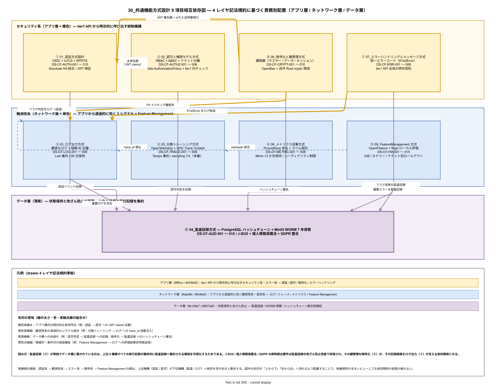

# 30. 共通機能方式設計

本カテゴリは tier1 全 API にまたがる横断機能を方式として固定化する。IPA 共通フレーム 2013 の明示アクティビティではないが、プラットフォーム製品として「どの API でも同じ認証・同じログ・同じエラーコード」を保証するため独立章として設ける。

## 本カテゴリの位置付け

tier1 は 11 API を公開するプラットフォームであり、各 API が独自に認証・ログ・エラーハンドリングを実装することは品質・運用・監査のいずれから見ても許されない。本章は全コンポーネントに共通して適用される横断方式を一元管理し、[../20_ソフトウェア方式設計/](../20_ソフトウェア方式設計/) の各コンポーネントが本章の方式を引用する形で設計を確定させる。

構想設計書（[../../02_構想設計/01_アーキテクチャ/03_セキュリティ/](../../02_構想設計/01_アーキテクチャ/03_セキュリティ/) 等）で採用が決まったセキュリティモデル・ゼロトラスト方針・観測性方針を前提に、本章は具体的な実装方式（プロトコル・フォーマット・ローテーション周期・保持期間）を固定化する。

## 9 項目の相互依存関係

本カテゴリの 9 機構は独立に実装されるのではなく、認証 → 認可 → 監査の意思決定経路と、トレース → ログ → メトリクスの観測性経路、暗号化 → 認証 / 監査 の鍵供給経路が相互に絡む。設計レビューでは「監査証跡を変更したいが、認証側の JWT claims 変更との順序関係はどうか」「Feature Management の評価結果をログに乗せる際、トレース ID は伝搬するのか」といった依存関係の問いが頻出するため、9 ファイルの責務レイヤと依存方向を 1 枚で示した相互依存図を以下に配置する。

図の読み方は 4 レイヤ記法規約 [`docs/00_format/drawio_layer_convention.md`](../../00_format/drawio_layer_convention.md) に準拠している。アプリ層（暖色 / 上段）には tier1 API から明示的に呼び出す認証 / 認可 / 暗号化 / エラーハンドリングを配置し、ネットワーク層（寒色 / 中段）にはアプリから透過的に効くログ / トレース / メトリクス / Feature Management を配置する。データ層（薄紫 / 下段）には監査証跡を単独で配置し、上位 8 機構の実行記録が最終的に集約される構造を可視化している。

特に重要な依存は 3 経路ある。第一に、暗号化（⑧）から認証（①）への JWT 署名鍵 + mTLS 証明書発行の経路で、暗号化を変更すると認証の検証ロジックに即時影響する。第二に、認証（①）から認可（②）への JWT claims 伝搬経路で、claims スキーマ変更は認可の RBAC / ABAC 判定式に直結する。第三に、監査証跡（④）への 6 系統からの収束経路で、認証イベント・認可判定・重要ログ・重要エラー・暗号ハッシュチェーン・Feature Flag 変更がすべて監査証跡に集約される。これら 3 経路の整合性は CI の双方向参照チェックで継続検証する。

執筆順は認証系 → 観測性系 → エラー系 → 暗号系 → Feature Management の順とする根拠も図に表れている。上位機構（認証 / 認可）が下位機構（監査 / ログ）へ依存を流す向きと、図中の矢印が「上から下」「左から右」へ流れる向きが整合しており、執筆順序のままレビューしても依存関係の前提が崩れない構造になっている。

## 格納予定ドキュメント

9 ファイルを格納する。執筆順は認証系 → 観測性系 → エラー系 → 暗号系 → Feature Management の順を推奨する。

- `01_認証方式設計.md` — OIDC / mTLS / SPIFFE の採用方式、ID 発行者・検証者・フェデレーション方針を記述する。要件 ID `NFR-E-AC-001〜005`（認証・認可）と対応する。
- `02_認可と権限モデル方式.md` — RBAC / ABAC の採用方針、テナント分離モデル、権限チェックの実装層（Istio AuthorizationPolicy / tier1 内チェック）を記述する。
- `03_ログ出力方式.md` — 構造化ログのスキーマ、相関 ID 伝播、集約先、ログレベル運用ルールを記述する。要件 ID `NFR-C-LOG-*` と対応する。
- `04_監査証跡方式.md` — 改ざん防止、保全期間、証跡粒度、法令要求（個人情報保護法 / SOX など）との対応を記述する。要件 ID `NFR-H-AUD-*` と対応する。
- `05_分散トレーシング方式.md` — OpenTelemetry 採用方式、サンプリング戦略、トレース ID とログ相関 ID の関係を記述する。
- `06_メトリクス収集方式.md` — Prometheus メトリクス命名規約、ラベル設計、カーディナリティ制限、集約方針を記述する。
- `07_エラーハンドリングとメッセージ方式.md` — 統一エラーコード体系（`tier1.<domain>.<code>` 形式）、多言語メッセージ、クライアント提示メッセージと運用者向け詳細ログの分離方針を記述する。
- `08_暗号化と鍵管理方式.md` — 鍵階層（マスター鍵 / データ鍵 / セッション鍵）、ローテーション周期、HSM 連携、KMS 方式を記述する。自作 Rust crypto 領域（構想設計で決定済み）の責務境界も含む。
- `09_FeatureManagement方式.md` — フラグ評価方式、ロールアウト戦略（カナリー / パーセンテージ / テナント指定）、フラグの廃止ライフサイクルを記述する。

## 執筆方針

- 各方式は「どの要件 ID に対応するか」を冒頭に明示する。
- 構想設計 ADR で確定済みの方針は参照のみとし、本章では具体パラメータ（周期・保持期間・閾値）を採番する。
- 方式 ID は `DS-CF-<サブカテゴリ>-<通番>` を用いる（例: `DS-CF-AUTH-001`）。
- 認証・認可・暗号に関する方式は、セキュリティ監査対応時に単独で読めるよう自己完結的に記述する。他章への参照で逃げないこと。

## 他カテゴリとの関係

- **上流**: [../../03_要件定義/30_非機能要件/E_セキュリティ.md](../../03_要件定義/30_非機能要件/) および `C_運用保守性`、`H_完整性コンプライアンス` が主要入力。
- **横断**: 本章の方式は [../20_ソフトウェア方式設計/](../20_ソフトウェア方式設計/) の全コンポーネントに引用される。コンポーネント設計は本章と照合しながら確定する。
- **下流**: 詳細設計フェーズ（未着手）で、本章の方式を前提に各コンポーネントの実装詳細が決定される。
