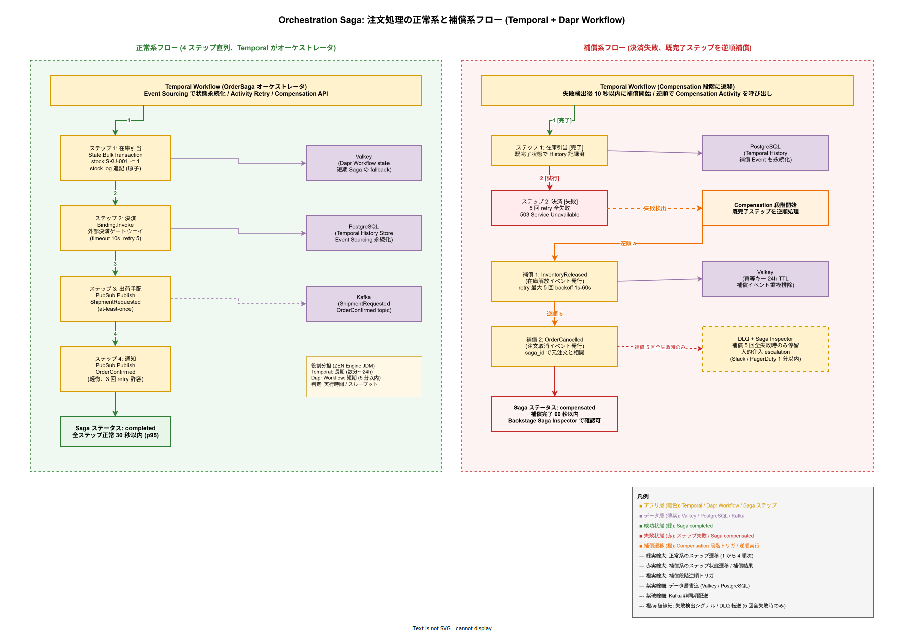

# 01. トランザクションと Saga 方式

本ファイルは k1s0 tier1 が提供するトランザクション境界の方式を固定化する。ローカル ACID トランザクション（単一 State Store 内の原子操作）と、分散トランザクション（複数バックエンドに跨がる業務フロー）の 2 つを対象とし、それぞれの実装方式・補償アクション・失敗時の escalation を具体数値と共に定義する。

## 本章の位置付け

tier1 は State・PubSub・Binding・Workflow・Secrets といった性質の異なるバックエンドを束ね、tier2 / tier3 の業務フローをまたがせる。複数のバックエンドへの書き込みが途中で失敗した場合、どこまで巻き戻すか・どう整合性を回復するかを各 API で独自設計すると、tier2 開発者はバックエンド毎の失敗モードを把握しなければならず、企画書で約束した「複雑性を tier1 で吸収する」原則（[../00_設計方針/02_設計原則と制約.md](../00_設計方針/02_設計原則と制約.md) 原則 1）が崩れる。

本章は分散整合性モデルとして **2PC を採用しない**判断を固定化し、代わりに Saga パターン（補償トランザクション）による最終整合性を採用することを確定させる。2PC は XA リソースマネージャを必要とし、k1s0 が採用する Valkey・Kafka・OpenBao のいずれもプロダクション運用可能な XA 実装を持たないため、構造的に採用が不可能である。

分散トランザクションの具体形として Temporal Orchestration Saga（長期業務フロー）と Kafka Choreography Saga（疎結合イベント連鎖）を併用し、Dapr Workflow は短期 Saga のフォールバックに位置付ける。この 3 者の使い分けは [05_ワークフロー振り分け方式.md](05_ワークフロー振り分け方式.md) で決定表化する。

## 設計方針

分散処理での一貫性を追求すると性能と可用性が犠牲になる。k1s0 は CAP 定理上「AP（可用性優先）+ 最終整合性」を基本とし、ACID が必要な局所ユースケース（例: 注文番号の採番、在庫数の更新）のみを State API の `BulkTransaction` で局所的に原子化する。広域では Saga で補償し、補償不能な失敗は DLQ + 人的 ACK UI で停留させる。

設計判断の軸は以下 4 点である。

- 一貫性要件（強整合 vs 最終整合）はユースケース単位で明示する。tier2 開発者が API 呼び出し時点で把握できるよう、公開 API ドキュメントに一貫性モデルを明記する。
- 整合性が崩れた場合の業務影響は重大度で分類し、重大（例: 決済二重化）は補償必須・軽微（例: 通知漏れ）はリトライ + 監査ログで許容、とする。
- 補償アクションは必ずビジネス逆操作として定義する（例: `SeatReserved` の逆は `SeatCancelled`、DB 行削除ではない）。これは監査証跡の整合性を保つために必要である。
- Saga の停留（補償不能）は運用者の人的介入を必須とする。自動復旧を盲信せず、監査可能性を優先する。

## ACID トランザクション: State BulkTransaction

### 対象ユースケース

tier1 State API は単一テナント・単一 State Store 内で複数キーの原子更新を `BulkTransaction` として提供する。主ユースケースは以下 3 パターンである。

- カウンタ更新 + ログ記録（例: 在庫 `stock:SKU-001` のデクリメントと在庫履歴 `stock:SKU-001:log` の追記を 1 トランザクションに束ねる）
- 親子関係のある 2 キーの同時書き込み（例: 注文ヘッダ `order:{id}` と注文明細 `order:{id}:items` の同時登録）
- 楽観的ロックを伴う更新（ETag 不一致時は全操作ロールバック）

### 方式

Valkey バックエンドでは `MULTI` / `EXEC` コマンドで原子実行する。最大 10 操作の制約は Valkey の Lua スクリプト化による実装上の上限であり、パイプライン内の操作数が 10 を超える場合はクライアント側で複数 BulkTransaction に分割する（ACID 境界は個々のバッチ内のみ）。PostgreSQL バックエンドでは単一 `BEGIN; ... COMMIT;` トランザクションに集約する。

楽観的ロックは ETag ヘッダで実現する。Valkey は `WATCH` 機構、PostgreSQL は `version` カラムの CAS 更新で実装する。ETag 不一致時はトランザクション全体を abort し、クライアントへ `409 Conflict` と最新 ETag を返却する。クライアントはリトライ戦略（[03_リトライとサーキットブレーカー方式.md](03_リトライとサーキットブレーカー方式.md)）に従い、最大 3 回まで再取得 → 再試行する。

### 数値仕様

- 単一 BulkTransaction 内の最大操作数: **10 操作**
- 単一 BulkTransaction のタイムアウト: **200ms**（[06_タイムアウトとバックプレッシャ方式.md](06_タイムアウトとバックプレッシャ方式.md) の State 層タイムアウトに準拠）
- ETag 不一致時の再試行上限: **3 回**（exponential backoff base 50ms、max 400ms、full jitter）
- トランザクション内部エラー時の部分適用: **禁止**（全操作 abort）

これらは要件 NFR-B-PERF-003（State Get p99 10ms）と NFR-A-FT-002（部分失敗の非許容）から導出される。10 操作という上限は、Valkey の MULTI/EXEC ベンチマーク（1 操作あたり約 20ms 想定）で合計 200ms を超えない範囲を逆算して設定した。

### 設計 ID

- `DS-CTRL-SAGA-001`: State BulkTransaction の原子性保証方式（Valkey MULTI / PostgreSQL transaction）。確定段階: リリース時点。
- `DS-CTRL-SAGA-002`: 楽観的ロック（ETag）による競合検出方式。確定段階: リリース時点。
- `DS-CTRL-SAGA-003`: BulkTransaction 操作数上限 10 とタイムアウト 200ms の数値根拠。確定段階: リリース時点。

## 分散トランザクション: Saga パターン

### 2PC を採用しない根拠

2PC（2-Phase Commit）は全参加リソースが XA 準拠のトランザクションマネージャを持つことを前提とする。k1s0 の採用 OSS のうち、Valkey は MULTI/EXEC の範囲外で XA をサポートしない、Kafka は XA トランザクションを持たず Kafka Transactions（exactly-once semantics）は独自プロトコル、OpenBao も XA を提供しない。仮に全てを PostgreSQL に集約しても、tier1 の Dapr Component モデルは State Store / PubSub / Secrets / Binding を個別に抽象化しているため、Dapr Building Block 越しに XA を通すことは不可能である。

加えて、2PC はプリペア段階で全リソースのロック保持を要求する。1 つのリソースがネットワーク分断で応答不能になると、他の全リソースもロック保持のまま応答を待ち続け、可用性が連鎖崩壊する。採用側組織の情シス基盤としては採用検討合意の SLA 99%（月 7.2h 許容）を破る構造的リスクがあり、2PC は採用不可と判断する。

### Saga の 2 形態

Saga は補償可能なローカルトランザクションの列として業務フローを表現する。k1s0 は以下 2 形態を状況に応じて使い分ける。

- **Orchestration Saga**: 中央コーディネータ（Temporal Workflow / Dapr Workflow）が各ステップを順次呼び出し、失敗時に補償アクティビティを逆順に実行する。ステップ間の遷移ロジックが中央に集中するため、可視性・デバッグ容易性が高い。数十ステップ以上の複雑な業務フローや、ステップ間に条件分岐が多いケースで採用する。
- **Choreography Saga**: 各サービスが自ステップ完了イベントを Kafka に発行し、次サービスが購読して自身のステップを実行する。中央コーディネータが不要で疎結合性が高いが、全体フローの可視化が難しく、デバッグ時にイベントを時系列で辿る必要がある。ステップ数が少なく（3〜5 ステップ）、サービス間の自律性を優先したいケースで採用する。

両者の使い分けは業務ドメインの性質で決める。業務担当者が「この処理はどう進むか」を説明できる必要があるドメイン（注文・決済・経理）は Orchestration、バックグラウンドの事務処理（通知・監査・統計集計）は Choreography を基本とする。

### Orchestration Saga の実装方式

長期業務フロー（数分〜数週間、例: 承認ワークフロー、定期バッチ連鎖）は **Temporal** で実装する。Temporal は Event Sourcing による Workflow 状態永続化・Activity 失敗時の自動リトライ・Compensation API による補償定義を備える。ADR-RULE-002 で リリース時点 確定済み。

短期業務フロー（数秒〜数分、例: 単一注文処理、単一申請承認）は **Dapr Workflow** で実装する。Dapr Workflow は tier1 内部で Valkey をバックエンドとして稼働し、Temporal 相当の機能を軽量に提供する。振り分けの詳細は [05_ワークフロー振り分け方式.md](05_ワークフロー振り分け方式.md) の決定表による。

補償アクティビティは Temporal の `Compensation` API、Dapr Workflow の `Compensation` 関数で定義する。失敗時は、コーディネータが既に完了したステップのリストを取得し、逆順に各ステップの補償アクティビティを呼び出す。補償自体が失敗した場合は最大 5 回まで再試行し、全て失敗した場合は DLQ（Saga 停留キュー）へ転送して人的介入を要求する。

### Choreography Saga の実装方式

Kafka トピックを介したイベント連鎖で実装する。各サービスは「入力イベントを購読 → 自処理 → 出力イベント発行」という 1 つのループを持ち、出力イベントが次サービスの入力になる。トピック名は `<tenant>.<domain>.<event>.v<version>` 形式で統一する（[04_非同期メッセージング方式.md](04_非同期メッセージング方式.md)）。

補償は逆方向の補償イベント（例: `OrderPlaced` に対して `OrderCancelled`）を発行することで表現する。補償イベント自体も通常の Kafka 配送（at-least-once）で扱い、受信側は冪等（[02_冪等性設計方式.md](02_冪等性設計方式.md)）で重複排除する。

Choreography では全体フローの可視性が課題となる。これを補うため、各サービスは Saga 相関 ID（`saga_id`）をイベントヘッダに付与し、Backstage プラグインで相関 ID 検索により全体フローをタイムライン表示できるようにする（採用後の運用拡大時）。

### 補償アクションの設計原則

補償アクションは「逆操作」であって「削除」ではない。監査証跡を保持するため、DB 行の物理削除や Kafka メッセージの削除は禁止する。以下 3 ルールで補償を定義する。

- 補償は業務イベントとして発行する（例: `SeatReserved` → `SeatCancelled`、`PaymentCaptured` → `PaymentRefunded`）。
- 補償イベントは元イベントと相関 ID で紐付ける。監査側は元イベント・補償イベントの対を 1 つの業務トランザクションとして集計できるようにする。
- 補償が失敗する可能性のあるアクション（例: 既に出荷済みの商品の在庫戻し）は、補償前に「補償可能判定」を実施し、不可の場合は即座に DLQ へ転送する。

### 数値仕様

- Orchestration Saga の最大ステップ数: **20 ステップ**（Temporal Workflow 1 実行あたりの History Event 上限と運用 Runbook の見通しから設定）
- 補償の最大再試行回数: **5 回**（exponential backoff base 1s、max 60s、full jitter）
- Saga タイムアウト: Temporal は業務フロー個別設定（デフォルト **24h**）、Dapr Workflow は **5 分**上限
- Saga 停留判定: 補償 5 回全失敗後、DLQ 転送まで **10 秒**以内
- Saga 相関 ID: UUIDv7、**全イベントヘッダ**に付与必須

### 設計 ID

- `DS-CTRL-SAGA-004`: Saga パターン採用と 2PC 不採用の判断根拠。確定段階: リリース時点。
- `DS-CTRL-SAGA-005`: Orchestration Saga（Temporal / Dapr Workflow）の実装方式。確定段階: リリース時点 / 採用後の運用拡大時。
- `DS-CTRL-SAGA-006`: Choreography Saga（Kafka イベント連鎖）の実装方式。確定段階: リリース時点。
- `DS-CTRL-SAGA-007`: 補償アクションの業務逆操作ルール。確定段階: リリース時点。
- `DS-CTRL-SAGA-008`: Saga 相関 ID（UUIDv7）伝播方式。確定段階: リリース時点。

## Saga 停留と手動介入

### 停留の定義と検出

Saga 停留とは「補償アクションが規定回数（5 回）以上失敗し、自動復旧が不可能となった状態」を指す。停留を放置すると業務データが不整合のまま残るため、即座に検出し人的介入へ escalation する必要がある。

検出は以下 3 チャネルで多重化する。

- Temporal / Dapr Workflow は補償失敗イベントを Prometheus メトリクス（`saga_compensation_failed_total`）として emit する。Grafana Alert で 1 件発生即時通知（Slack + PagerDuty）する。
- Choreography Saga は DLQ（`<topic>.dlq`）への転送を `kafka_dlq_messages_total` で監視し、閾値 1 件でアラートする。
- 監査ログ側で `saga_status=stalled` のレコードを検出し、日次レポートで起案者に通知する。

### 手動介入 UI

Backstage プラグインとして「Saga Inspector」を 採用後の運用拡大時 で提供する。停留中 Saga の一覧、各ステップの実行状態、補償試行履歴、エラーメッセージを表示し、運用者が以下 3 アクションを選択できるようにする。

- **補償再試行**: 失敗した補償アクティビティを手動で再実行する。Temporal / Dapr Workflow の Signal API 経由で補償アクティビティを呼び出す。
- **強制完了**: 業務判断で「この Saga は完了扱いとする」と決定する。補償を放棄し、Saga ステータスを `terminated` に遷移させる。監査ログへ操作者・理由を必須記録する。
- **強制ロールバック**: 全ステップを無効化し、業務データをイベント駆動で手動復旧する前提の Saga 終了。監査ログへ記録、ロールバック対象イベントを運用チームの担当へ回送する。

強制完了と強制ロールバックは Keycloak Role `saga-operator` を持つユーザのみ実行可能とし、操作ログは 7 年間保持する（[../30_共通機能方式設計/04_監査証跡方式.md](../30_共通機能方式設計/04_監査証跡方式.md) 参照）。

### 数値仕様

- 停留検出の SLO: 補償 5 回目失敗から **1 分以内**に Slack / PagerDuty 通知
- 手動介入操作のログ保持: **7 年**（J-SOX 要件、電帳法と同水準）
- Saga Inspector UI 応答: **2 秒以内**（Backstage Plugin 側の対応 SLO）

### 設計 ID

- `DS-CTRL-SAGA-009`: Saga 停留検出と escalation 方式。確定段階: リリース時点。
- `DS-CTRL-SAGA-010`: Saga Inspector（Backstage プラグイン）の手動介入 UI。確定段階: 採用後の運用拡大時。

## 具体例: 注文処理 Saga

### フロー概要

上図は、注文処理 Saga の正常系 4 ステップ（左レーン・緑背景）と、決済失敗時の補償系フロー（右レーン・赤背景）を同一キャンバス上で対比表示したものである。対比することで「なぜ逆順補償になるのか」「補償イベントはどこで発行されるのか」「補償結果はどのデータ層に永続化されるのか」を一枚で把握できるようにしている。

正常系は Temporal Workflow がオーケストレータとして在庫引当 → 決済 → 出荷手配 → 通知の 4 ステップを順次呼び出し、Event Sourcing で状態を PostgreSQL（Temporal History Store）に、短期 Saga fallback として Dapr Workflow を使う場合は Valkey に永続化する。出荷手配ステップのみ Kafka 経由の非同期配送であり、破線で区別している。全ステップ完了で Saga ステータスが `completed` に遷移し、目標は 30 秒以内（p95）である。

補償系では、在庫引当ステップは完了済みだが決済ステップが 5 回 retry を全失敗したケースを描いている。Temporal は失敗検出から 10 秒以内に Compensation 段階に遷移し、既完了ステップを逆順（ここでは在庫引当 1 つ）で補償する。補償は業務イベントの逆操作（`InventoryReleased` → `OrderCancelled`）として発行し、Valkey の冪等キーストアで重複排除する。補償が 60 秒以内に完了すれば `compensated` ステータスに遷移し、Backstage Saga Inspector で可視化される。補償自体が 5 回全失敗した場合のみ DLQ + 人的介入 escalation（Slack / PagerDuty 1 分以内）へと分岐する。この 2 段構え（自動補償 → 人的介入）により、補償不能なビジネス状態が自動復旧を盲信する形で放置されることを構造的に防いでいる。

tier2 の注文ドメインサービスが注文処理を Orchestration Saga として Temporal で実行するケースを考える。ステップは以下 4 つである。

1. **在庫引当**: State API `BulkTransaction` で在庫数デクリメント + 引当ログ追記。補償は `InventoryReleased` 発行 + 在庫数戻し。
2. **決済**: Binding API で外部決済ゲートウェイ呼び出し。補償は返金 API 呼び出し。
3. **出荷手配**: PubSub API で `ShipmentRequested` トピックへ発行。補償は `ShipmentCancelled` 発行。
4. **通知**: PubSub API で `OrderConfirmed` トピックへ発行。補償は `OrderCanceledNotice` 発行（軽微、失敗時はリトライ 3 回で許容）。

### 失敗パターンと挙動

決済ステップで一時的エラー（ゲートウェイ 503）が発生した場合、Temporal の Activity 内でリトライポリシー（exponential backoff base 1s、max 30s、attempts 5）により自動再試行する。全回失敗した場合、Temporal は Saga を Compensation 段階に遷移させ、既完了の「在庫引当」の補償（`InventoryReleased`）を実行する。補償自体が失敗した場合は 5 回再試行し、最終失敗で DLQ + アラート通知する。

出荷手配ステップで永続的エラー（ショップ閉鎖など）が発生した場合、Temporal は補償を逆順に実行する: 決済の返金 → 在庫戻し → 通知の `OrderCanceledNotice` 発行。補償成功時は Saga ステータス `compensated` に遷移し、業務担当者は Backstage の Saga Inspector で確認できる。

通知ステップのみ失敗した場合、補償は軽微として許容し、リトライ 3 回後も失敗した場合は `saga_status=completed_with_warning` として記録、監査ログに残す（業務担当者への通知は別チャネルで実施）。

### 数値仕様

- 注文処理 Saga 全体の目標完了時間: **30 秒以内**（p95）
- 決済ステップの Activity タイムアウト: **10 秒**、リトライ 5 回で合計最大 **60 秒**
- 補償段階全体の目標完了時間: **60 秒以内**（業務データ復旧の許容時間）

### 設計 ID

- `DS-CTRL-SAGA-011`: 注文処理 Saga の参照実装仕様（tier2 開発者向けサンプル）。確定段階: リリース時点。

## 対応要件一覧

本章は以下の要件 ID を充足する。

- **FR-T1-WORKFLOW-001〜005**: tier1 Workflow API の Start / Query / Signal / Terminate / Purge の 5 操作。Orchestration Saga の基盤として機能する。
- **FR-T1-PUBSUB-001〜005**: tier1 PubSub API の Publish / Subscribe / BulkPublish / DLQ / Schema 検証。Choreography Saga のイベント連鎖基盤として機能する。
- **NFR-A-FT-001**: 部分失敗時の自動補償成立。Saga + 補償アクションで実現。
- **NFR-A-FT-002**: 補償失敗時の人的介入 escalation。DLQ + Saga Inspector で実現。
- **NFR-A-REC-001**: RPO 秒オーダー。Saga 相関 ID + 監査ログで業務データ復旧可能性を担保。
- **NFR-A-REC-002**: RTO 4h。停留検出から人的介入完了までの運用時間を 4h 以内に収める運用設計と連動。

関連する構想設計 ADR は ADR-RULE-002（Temporal 長期ワークフロー リリース時点 確定）、ADR-DATA-002（Kafka Strimzi、at-least-once）である。本章で採番した設計 ID は `DS-CTRL-SAGA-001`〜`DS-CTRL-SAGA-011` の 11 件。詳細な要件 ↔ 設計対応は [../80_トレーサビリティ/02_要件から設計へのマトリクス.md](../80_トレーサビリティ/02_要件から設計へのマトリクス.md) で管理する。
