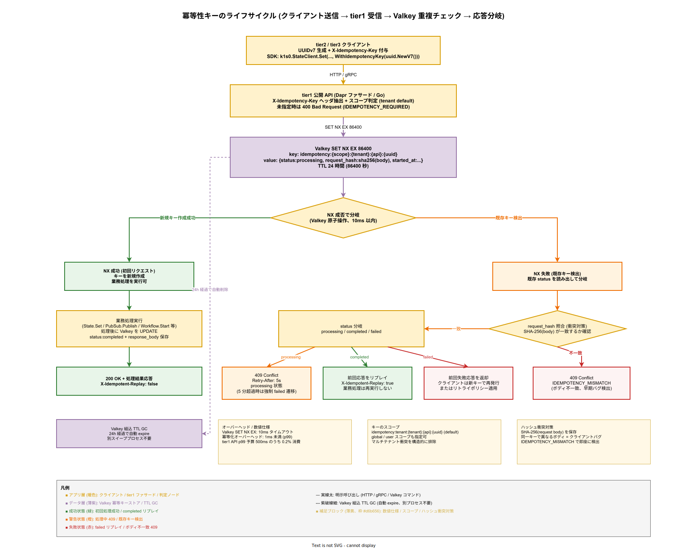

# 02. 冪等性設計方式

本ファイルは k1s0 tier1 API が全エンドポイントで満たすべき冪等性の方式を固定化する。クライアント再送・ネットワーク再試行・Saga 補償の再実行など、同一操作が複数回到達する前提で設計することで、業務データの二重適用を構造的に防ぐ。

## 本章の位置付け

分散システムでは「送ったリクエストが届いたのかわからない」状態が常態である。ネットワーク断、Pod 再起動、gRPC タイムアウト、Kafka の at-least-once 配送、Saga の補償再試行——全てクライアント側の見かけは「応答が返ってこない」であり、リトライするしかない。このリトライを安全に許容するには、サーバ側が同一操作を何度受けても結果を変えない性質（冪等性）を全 API で保証する必要がある。

tier1 が冪等性を提供しないと、tier2 / tier3 開発者は各サービスで自前の重複検知を実装することになり、企画書で約束した「複雑性を tier1 で吸収する」原則（[../00_設計方針/02_設計原則と制約.md](../00_設計方針/02_設計原則と制約.md) 原則 1）が崩れる。本章は tier1 の 11 API 全てで冪等性を強制し、tier2 開発者はヘッダを付けるだけで自動的に重複排除されるゴールデンパスを固定化する。

冪等性は本章だけで完結せず、[01_トランザクションとSaga方式.md](01_トランザクションとSaga方式.md)（補償イベントの重複排除）、[03_リトライとサーキットブレーカー方式.md](03_リトライとサーキットブレーカー方式.md)（リトライ時の再送）、[04_非同期メッセージング方式.md](04_非同期メッセージング方式.md)（at-least-once 受信の重複排除）と密接に連動する。

## 設計方針

冪等性の実現方式は「自然冪等」「冪等キー方式」「バージョン CAS 方式」の 3 系統がある。k1s0 は以下の使い分けを採用する。

- 副作用なし API（GET 系: `State.Get`、`Secrets.Get`、`Decision.Evaluate`）: **自然冪等**。実装追加不要。
- 副作用あり API（Write 系: `State.Set`、`PubSub.Publish`、`Workflow.Start`、`Binding.Invoke` など）: **冪等キー方式**。`X-Idempotency-Key` ヘッダ必須。
- 楽観的ロック API（`State.Set` の ETag 付き、`State.BulkTransaction`）: **バージョン CAS 方式**。冪等キーと ETag を併用。

冪等キー方式は Stripe API などの業界標準プラクティスに準拠し、UUIDv7 を推奨する。UUIDv7 は時系列順ソート可能で、Valkey 上の冪等キーストアの GC 設計（TTL 24h + 古いキーから順に expire）と親和性が高い。

設計判断の軸は以下 4 点である。

- **冪等性は API 契約の一部とする**: 公開 API ドキュメントに「冪等性保証」節を必須で設け、tier2 開発者が開発初期から意識できるようにする。
- **重複検知ウィンドウは 24 時間**: 業務上のリトライ期間（典型的な Saga タイムアウト、Kafka Consumer の最大 lag）をカバーする。延長は業務要件次第で拡張可能とする。
- **処理途中（in-progress）状態を明示**: 二重実行の防止と、クライアント側のリトライ意思決定を両立させる。
- **冪等キー未指定時の挙動を厳格化**: 一部 API（Write 系）ではヘッダ未指定を `400 Bad Request` で拒否し、開発者に冪等キーの使用を強制する。

## 冪等キーのスキーマ

### ヘッダ定義

全 tier1 公開 API は HTTP / gRPC 呼び出し時に以下のヘッダ（メタデータ）を受け付ける。

- **`X-Idempotency-Key`**: クライアント生成の一意キー。**UUIDv7 推奨**（時系列ソート可能）、UUIDv4 / ULID も許容。最大長 128 バイト、ASCII 印字可能文字のみ。
- **`X-Idempotency-Scope`**: （任意）冪等スコープ。デフォルトは `tenant`（テナント内一意）、`global` や `user` も指定可能。複数テナントで同一キーが衝突しないよう、デフォルトはテナント分離とする。

キーの生成責任はクライアント（tier2 / tier3）側に置く。サーバ側生成は原則採用しない（クライアントが応答を取りこぼした場合に再送用キーを復元できないため）。

### Valkey 上のスキーマ

冪等キーと処理結果は Valkey に以下のキー書式で保存する。

```
idempotency:{scope}:{tenant}:{api}:{key}
```

例: `idempotency:tenant:acme:State.Set:01J5ABCDE...`（UUIDv7）。値は以下 JSON 構造で保持する。

```json
{
  "status": "processing | completed | failed",
  "request_hash": "sha256(request body)",
  "response_body": "<serialized response>",
  "response_status": 200,
  "started_at": "2026-04-12T10:00:00Z",
  "completed_at": "2026-04-12T10:00:01Z"
}
```

`request_hash` は同一キーで異なるリクエストが来た場合を検出するために保存する（通常は誤用であり、`409 Conflict` で拒否する）。

### TTL と GC

冪等キーは TTL **24 時間**で自動 expire する。業務上のリトライ期間（典型的な Saga の最大実行時間 24h、Kafka Consumer の最大 lag 目標 1h）をカバーする。

GC は Valkey 組み込みの TTL 機構（`EXPIRE` コマンド）に委ね、別プロセスでのスイープは不要とする。Phase 2 以降、ストレージ容量の増大に応じて 12h に短縮、または業務要件に応じて 48h に拡張する選択肢を持つ。

### 設計 ID

- `DS-CTRL-IDEM-001`: 冪等キーのヘッダ仕様（`X-Idempotency-Key` / `X-Idempotency-Scope`、UUIDv7 推奨）。確定フェーズ: Phase 1b。
- `DS-CTRL-IDEM-002`: Valkey 上の冪等キーストアスキーマ。確定フェーズ: Phase 1b。
- `DS-CTRL-IDEM-003`: 冪等キー TTL 24 時間の数値根拠。確定フェーズ: Phase 1b。

## 処理フロー



上図は、冪等性キーがクライアント生成から Valkey 上での TTL expire まで、ライフサイクルのどの段階でどう扱われるかを示した全体像である。初回リクエスト（左レーン・緑）と再送リクエスト（右レーン・橙〜赤）を同時に描き、両ケースで tier1 が返す応答が `status:completed` / `processing` / `failed` の 3 状態でどう分岐するかを可視化している。

クライアントは UUIDv7 を生成して `X-Idempotency-Key` ヘッダで付与する。tier1 公開 API（Dapr ファサード / Go）がヘッダを抽出し、未指定時は `400 Bad Request` + `IDEMPOTENCY_REQUIRED` で即座に拒否する。キー存在時は Valkey へ `SET NX EX 86400` を投げ、10ms 以内に原子的に「新規キー作成」か「既存キー検出」かを決する。NX 成功時は業務処理を実行し、完了後に `status:completed` と `response_body` を Valkey に書き戻してから `200 OK` を返す。NX 失敗時は既存キーの `request_hash` を SHA-256 で照合し、不一致なら `IDEMPOTENCY_MISMATCH`（クライアントバグの早期検出）、一致なら `processing` / `completed` / `failed` の 3 状態に応じて `409 Retry-After` / リプレイ応答 / 失敗応答を返す。

24 時間の TTL は Valkey 組込の `EXPIRE` に委譲し、別スイーププロセスを不要にしている（図左下への紫破線）。業務上のリトライ期間（Saga 最大 24h、Kafka Consumer 最大 lag 1h 目標）をカバーする数値であり、Phase 2 以降はストレージ容量や業務要件次第で 12h〜48h に調整する余地を残している。冪等化オーバーヘッドは Valkey ヒット時で 1ms 未満、tier1 API の p99 予算 500ms のうち 0.2% 程度しか消費しない設計である。

### 初回リクエスト

クライアントが `X-Idempotency-Key: K` 付きでリクエストを送ると、tier1 API は以下の順序で処理する。

1. Valkey に `SET idempotency:...:K {status:processing} NX EX 86400` を実行する。`NX` により既存キーが存在する場合は失敗し、既存処理の応答待機へ分岐する。
2. `NX` 成功時（初回）: 本来の業務処理を実行する。
3. 業務処理成功時: Valkey のキー値を `{status:completed, response_body:..., response_status:200}` に更新する（TTL は維持）。
4. 業務処理失敗時（5xx / 一時的エラー）: Valkey のキー値を `{status:failed}` に更新する。TTL 経過後、再試行可能。

### 再送リクエスト（重複検知）

同一キーで 2 回目以降のリクエストが到達した場合、手順 1 の `NX` が失敗し、tier1 API は既存のキー値を読み出して以下に分岐する。

- `status=processing`: 処理中のため、クライアントへ `409 Conflict` + `Retry-After: 5` を返却する。クライアントは 5 秒後に再試行する（エクスポネンシャルバックオフ、最大 3 回）。
- `status=completed`: 前回の応答（`response_body` / `response_status`）をそのまま返却する。業務処理は再実行しない。`X-Idempotent-Replay: true` ヘッダを付与し、クライアントに再送識別を提供する。
- `status=failed`: 過去の失敗応答を返却する。クライアントは新しい冪等キーで再発行するか、リトライポリシーに従う。

### リクエストボディの不一致検知

同一キーで異なるリクエストボディが来た場合、`request_hash` の照合で検出する。不一致時は `409 Conflict` + エラーコード `IDEMPOTENCY_MISMATCH` を返却する。これは「クライアントが古いキーを使いまわしてしまった」等のバグを早期検出するための安全弁である。

### 数値仕様

- 冪等キーロック取得のタイムアウト: **10ms**（Valkey `SET NX EX` 1 往復に相当）
- `processing` 状態での最大滞留時間: **5 分**（この間は `409`、5 分超過で強制 failed 遷移）
- 冪等化オーバーヘッド: **1ms 未満**（Valkey ヒット時、tier1 API p99 500ms の予算内）

### 設計 ID

- `DS-CTRL-IDEM-004`: 冪等キーの初回・再送処理フロー。確定フェーズ: Phase 1b。
- `DS-CTRL-IDEM-005`: `processing` 状態の表現と `409 in-progress` 応答仕様。確定フェーズ: Phase 1b。
- `DS-CTRL-IDEM-006`: リクエストボディ不一致検知（`IDEMPOTENCY_MISMATCH`）。確定フェーズ: Phase 1b。

## API 別の冪等化戦略

### State API

`State.Get` は副作用なし、自然冪等。冪等キー不要。

`State.Set` は冪等キー必須。`X-Idempotency-Key` が付与されていない場合、`400 Bad Request` + エラーコード `IDEMPOTENCY_REQUIRED` を返却する。加えて、ETag 付きの楽観的ロック更新では、ETag 不一致時のリトライを防ぐため、冪等キーを使って「再試行して ETag が更新されたか」を判定する設計とする。

`State.BulkTransaction` は最も厳密な冪等化が必要で、10 操作の一括実行が全て 1 つの冪等キー配下で完結する。途中で一部操作が失敗した場合、既述の ACID 原則に従い全操作 abort、冪等キーストアは `status=failed` を保持する。

### PubSub API

`PubSub.Publish` は at-least-once 配送のため、受信側での重複排除が必須となる。tier1 側では Publish 時に冪等キー（`X-Idempotency-Key` → Kafka メッセージヘッダ `idempotency_key`）を自動付与し、受信側は CloudEvents `id` フィールドまたは `idempotency_key` ヘッダで重複排除する。

`PubSub.BulkPublish` も同様にバッチ全体に 1 つの冪等キーを付与し、各メッセージには連番を組み合わせた派生キー（`{bulk_key}:{index}`）を自動付与する。

### Workflow API

`Workflow.Start` は Workflow インスタンス ID を冪等キーとして扱う。同一 Workflow ID での重複 Start は既存実行を返す（`409 Conflict` ではなく既存 instance 情報）。Temporal / Dapr Workflow のネイティブ機能に従うため、追加の冪等化実装は不要。

`Workflow.Signal` は Signal 名 + Signal ID の組で冪等化する。Temporal は Signal を at-least-once で配送するため、受信側で冪等化する必要がある。

### Binding API（外部連携）

`Binding.Invoke`（外部 HTTP / SMTP / SFTP 呼び出し）は外部システム側の冪等性に依存する。tier1 側は冪等キーを外部システムへ中継（HTTP ヘッダ転送）し、外部システムが冪等対応していれば二重実行を防ぐ。非対応システムには警告ログを記録し、業務設計側で「補償可能な業務逆操作」を用意する責任を tier2 開発者へ移譲する。

### Secrets / Feature API

`Secrets.Get` / `Feature.Evaluate` は副作用なし、自然冪等。冪等キー不要。

### Decision API

`Decision.Evaluate` は副作用なし（ZEN Engine は pure function）。自然冪等。冪等キー不要。p99 1ms の目標を崩さないため、冪等キーストア参照による遅延を避ける。

### 設計 ID

- `DS-CTRL-IDEM-007`: tier1 11 API の冪等化戦略マトリクス。確定フェーズ: Phase 1b。
- `DS-CTRL-IDEM-008`: PubSub at-least-once + 受信側冪等による exactly-once 実効。確定フェーズ: Phase 1b。
- `DS-CTRL-IDEM-009`: Binding API での外部システム冪等性の扱い。確定フェーズ: Phase 1b。

## PubSub 受信側冪等の実装

### 受信側冪等の原則

Kafka は at-least-once 配送のため、受信側（Consumer）が重複メッセージを処理しない責任を持つ。k1s0 は以下 2 方式を提供する。

- **tier1 自動冪等化**: Consumer が tier1 PubSub SDK 経由でサブスクライブする場合、SDK 側で CloudEvents `id` を Valkey に記録し、既処理ならスキップする。tier2 開発者は実装不要。
- **アプリ側冪等化**: 業務ロジックが DB 書き込みを伴う場合、業務トランザクション内で `processed_event_ids` テーブルに event_id を insert し、重複は PK 違反で弾く。tier2 開発者が実装する。

デフォルトは tier1 自動冪等化とし、業務要件で DB トランザクション境界内の冪等化が必要な場合にアプリ側冪等化に切り替える。

### Kafka トピックレベルの冪等化

Kafka Producer の `enable.idempotence=true` を tier1 PubSub 実装で有効化し、同一 Producer の同一パーティションへの重複書き込みを Kafka ブローカーが自動検知する。これは tier1 内部の Kafka 書き込み層での冪等化であり、エンドツーエンドの冪等性とは別レイヤである。

### Exactly-once 実効

tier1 PubSub SDK による自動冪等化を採用した場合、ユーザ観点では exactly-once と見なせる。厳密には「at-least-once + 冪等排除」による exactly-once effect であり、Kafka Transactions（exactly-once semantics）は採用しない。Kafka Transactions は Producer / Consumer 両端で sticky assignment を要求し、Dapr PubSub Building Block との相性が悪いため Phase 2 まで見送る。

### 設計 ID

- `DS-CTRL-IDEM-010`: PubSub 受信側冪等化の 2 方式（tier1 自動 / アプリ側）。確定フェーズ: Phase 1b。
- `DS-CTRL-IDEM-011`: Kafka Producer `enable.idempotence` 有効化。確定フェーズ: Phase 1b。

## Workflow Task の冪等性

### Temporal の組込み冪等化

Temporal Workflow Task は Workflow ID + Run ID + Task Queue で一意化され、同一 Task の重複実行は Temporal Server 側で排除される。Activity Task も Activity Type + Activity ID で一意化され、Activity 実装者は冪等化を意識する必要がある（Temporal 公式も「Activity は冪等に書くこと」を推奨）。

k1s0 では Activity 実装テンプレート（tier2 開発者向けゴールデンパス）に冪等化コードを組み込み、冪等キーを Activity 入力に含める規約とする。

### Dapr Workflow の組込み冪等化

Dapr Workflow は Activity を冪等に書くことを前提とし、Temporal と同様の扱いとなる。Dapr Workflow の内部 State Store（Valkey）に Workflow 状態を永続化するため、Pod 再起動後も Workflow が途中から再開できるが、Activity の冪等性は実装者の責任である。

### 設計 ID

- `DS-CTRL-IDEM-012`: Temporal / Dapr Workflow の Activity 冪等化テンプレート。確定フェーズ: Phase 1b。

## tier2 開発者向けゴールデンパス

### 10 分で理解できるドキュメント

tier2 / tier3 開発者が冪等性を 10 分で習得できる簡潔なドキュメントを Backstage の Tech Docs に配置する。主要項目は以下 5 つである。

- 「なぜ冪等キーが必要か」の 1 段落要約（クライアント再送が必ず発生する前提を明示）
- `X-Idempotency-Key` の付け方の 5 行コード例（Go / Rust / TypeScript）
- UUIDv7 の生成方法（ライブラリ指定: Go `google/uuid v7`、Rust `uuid v7`、TS `uuid v7`）
- 重複時の 409 応答ハンドリング（再送推奨 vs キー再発行）
- よくある間違い（キーの使いまわし、スコープ誤用、ボディ変更）

Phase 1b の tier1 GA 時点で公開する。Tech Docs の更新は PR レビュー時に冪等性 API 変更と必ずセットで行う（CI ゲート）。

### サンプルコード

`k1s0.StateClient.Set(ctx, key, value, WithIdempotencyKey(uuid.Must(uuid.NewV7())))` のような SDK 呼び出しをテンプレート化する。冪等キー生成と付与を 1 行で完結させ、開発者が忘れない設計とする。

### 設計 ID

- `DS-CTRL-IDEM-013`: 冪等性ゴールデンパスドキュメント（Backstage Tech Docs）。確定フェーズ: Phase 1b。
- `DS-CTRL-IDEM-014`: tier1 SDK の冪等キー付与ヘルパー API。確定フェーズ: Phase 1b。

## 対応要件一覧

本章は以下の要件 ID を充足する。

- **FR-T1-INVOKE-001〜005**: Service Invocation の冪等化。`X-Idempotency-Key` により全 RPC 呼び出しで重複排除。
- **FR-T1-PUBSUB-001**: PubSub Publish の冪等化。受信側自動冪等により at-least-once + 実質 exactly-once。
- **FR-T1-PUBSUB-002**: PubSub Subscribe 受信側の重複排除。
- **FR-T1-WORKFLOW-001**: Workflow.Start の冪等化。Workflow ID 一意性により実現。
- **NFR-A-FT-003**: 再送時の業務データ二重適用防止。冪等キー + Valkey ストアで実現。
- **NFR-B-PERF-001**: tier1 API p99 500ms。冪等化オーバーヘッド 1ms 未満で予算内に収まる。

関連する構想設計 ADR は ADR-DATA-002（Kafka Strimzi、at-least-once）、ADR-DATA-004（Valkey）である。本章で採番した設計 ID は `DS-CTRL-IDEM-001`〜`DS-CTRL-IDEM-014` の 14 件。詳細な要件 ↔ 設計対応は [../80_トレーサビリティ/02_要件から設計へのマトリクス.md](../80_トレーサビリティ/02_要件から設計へのマトリクス.md) で管理する。
