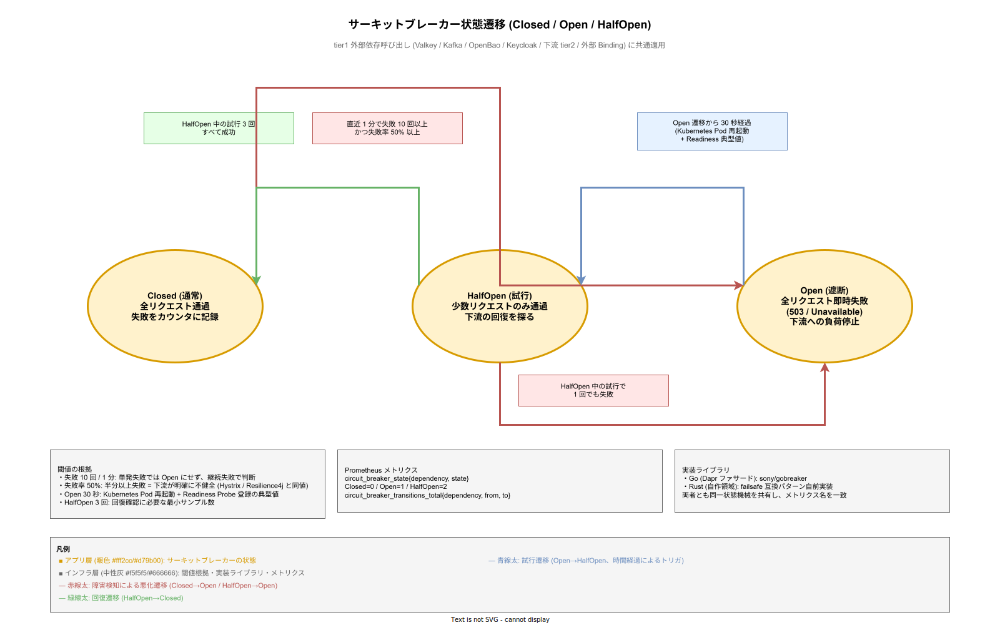

# 03. リトライとサーキットブレーカー方式

本ファイルは k1s0 tier1 が一時的障害から自動回復する仕組み、および障害連鎖を防ぐ遮断機構の方式を固定化する。リトライ戦略（指数バックオフ + ジッター）とサーキットブレーカー（Closed / Open / HalfOpen）は全 tier1 コンポーネントで統一された数値と挙動で動作させる。

## 本章の位置付け

ネットワーク分断・一時的過負荷・デプロイ中の Pod 再起動といった一時的障害は分散システムで不可避である。適切なリトライで多くは自動回復するが、設計の誤りは以下 2 種類の深刻な問題を引き起こす。

- **リトライストーム**: 全クライアントが同じタイミングで再試行すると、回復中のサーバへ瞬間的な負荷集中が発生し、再度落ちて連鎖停止する。
- **無駄なリトライ**: 永続的エラー（権限不足、スキーマ違反）をリトライしても成功しないが、リトライ負荷はサーバへ到達して全体性能を劣化させる。

本章は上記 2 問題を構造的に防ぐため、リトライ対象の明確な分類、指数バックオフ + jitter の数値統一、サーキットブレーカーによる早期遮断、Bulkhead による依存分離、Fallback による代替応答——を全コンポーネントで共通化する。

tier1 内部のリトライは本章で扱うが、tier1 外（Istio Ambient によるメッシュ層）でもリトライ可能である。二重リトライを避けるため、メッシュ側のリトライは明示的に disable とし、tier1 側で一元管理する方針をとる。

## 設計方針

リトライとサーキットブレーカーは独立して動作するが設計判断は連動する。以下 4 原則を全コンポーネントで共有する。

- **リトライ対象を明確に分類する**: 一時的エラー（5xx / タイムアウト / ネットワーク断）のみリトライ、永続的エラー（4xx / 認証失敗 / 制約違反）はリトライしない。判定は HTTP ステータス + gRPC status code で統一する。
- **指数バックオフ + full jitter を採用する**: 全クライアントの再試行タイミングを確率的に分散させ、リトライストームを防ぐ。基底 100ms、最大 30s、試行 5 回を tier1 デフォルトとする。
- **サーキットブレーカーで早期遮断する**: 失敗連続 10 回で Open に遷移し、30 秒間は全リクエストを即座に失敗させる。下流の回復時間を確保する。
- **Bulkhead で依存を分離する**: 外部依存（Valkey / Kafka / OpenBao / Keycloak / 下流 tier2）ごとに接続プールを分離し、1 依存の障害が他依存へ波及するのを防ぐ。

## リトライ戦略

### リトライ対象の分類

リトライするかどうかは以下の表で決定する。判定は tier1 内の共通ライブラリ `tier1/retry/classifier` で実装し、Go / Rust 両言語で同じ判定結果を返すテストを CI で強制する。

| エラー種別 | HTTP | gRPC | リトライ | 根拠 |
|---|---|---|---|---|
| 一時的サーバエラー | 500 / 502 / 503 / 504 | Unavailable / DeadlineExceeded / ResourceExhausted | 有 | 回復可能な可能性が高い |
| レート制限 | 429 | ResourceExhausted | 有（`Retry-After` 尊重） | バックオフ後に成功見込み |
| ネットワーク断 | - | Unavailable / 接続拒否 | 有 | 一時的障害の典型 |
| タイムアウト | 408 / なし | DeadlineExceeded | 有（上位コンテキストで判断） | 下流が遅いだけで正常動作中 |
| 認証失敗 | 401 | Unauthenticated | 無 | 再試行しても同じ結果 |
| 認可失敗 | 403 | PermissionDenied | 無 | 再試行しても同じ結果 |
| リソース不在 | 404 | NotFound | 無 | 存在しないものは何回試しても不在 |
| バリデーション違反 | 400 / 422 | InvalidArgument | 無 | クライアントのバグ、再試行無意味 |
| 冪等キー競合 | 409 | AlreadyExists / Aborted | 条件付き | `processing` 状態なら待機再試行、`completed` は既存応答 |
| 永続的制約違反 | 409 / 412 | FailedPrecondition | 無 | 業務データ側の問題 |

429 のリトライは `Retry-After` ヘッダの値を尊重し、指数バックオフと併用する（ヘッダ指定値 > 算出 backoff ならヘッダ優先）。

### 指数バックオフ + full jitter

リトライ間隔は以下の式で算出する（AWS Architecture Blog の「Exponential Backoff And Jitter」で推奨される full jitter 方式）。

```
interval = random(0, min(cap, base * 2^attempt))
```

- `base` = **100ms**（初期間隔、tier1 API p99 500ms の 1/5）
- `cap` = **30s**（上限、1 リクエストのクライアント許容待ち時間を考慮）
- `attempt` = 0〜4（5 回試行で最大合計 約 63s）
- `random` は `[0, interval]` の一様分布

full jitter は「linear backoff は同期的にリトライが集中するリスクあり」「equal jitter より full jitter の方が分散効果高い」という実証結果に基づく選択である。

### 最大試行回数

- tier1 公開 API → バックエンド: **5 回**（初回 + 再試行 4 回、合計 最大 約 63 秒）
- tier1 内部: **3 回**（初回 + 再試行 2 回、合計 最大 約 2.5 秒）
- PubSub Consumer: **3 回** → DLQ 転送
- Binding 外部連携: **5 回**（外部 API の一時的エラーをカバー）

試行回数はユースケース別に調整可能とし、SDK オプション `WithRetries(n)` で上書き可能とする。デフォルトは上記値。

### 数値根拠

5 回試行の合計最大時間 = 100ms + 200ms + 400ms + 800ms + 1.6s ≈ 3.1s（jitter なしの最短合計、cap 到達なし）、各段で jitter 最大 (= 指数値) が発生した場合 = 100ms + 200ms + 400ms + 800ms + 1.6s + 3.2s + 6.4s + ... = cap 30s 上限で頭打ち。実効的に 約 60 秒でタイムアウトし、API 全体のクライアント許容時間（数分）内に収まる設計である。

### 設計 ID

- `DS-CTRL-RETRY-001`: リトライ対象の分類（HTTP / gRPC エラー判定）。確定段階: リリース時点。
- `DS-CTRL-RETRY-002`: 指数バックオフ + full jitter の数値仕様（base 100ms、cap 30s、attempts 5）。確定段階: リリース時点。
- `DS-CTRL-RETRY-003`: 最大試行回数のユースケース別デフォルト。確定段階: リリース時点。
- `DS-CTRL-RETRY-004`: 429 `Retry-After` ヘッダ尊重方式。確定段階: リリース時点。

## サーキットブレーカー

### 状態遷移

サーキットブレーカーは 3 状態を持つ。3 状態間の遷移トリガは「失敗の継続」「時間の経過」「回復の確認」の 3 種類で、それぞれが異なる条件・異なる目的を持つ。単に状態名と閾値を列挙するだけでは、どの遷移がどの局面で発火するかの時間軸の理解が欠落しやすいため、以下の状態遷移図で可視化する。赤線が障害検知による悪化遷移、青線が時間経過による試行遷移、緑線が回復遷移という色分けで読むと、「障害は赤で入り、時間で青に動き、回復で緑に戻る」という運用上の意味が一目で把握できる。



- **Closed**（通常）: すべてのリクエストを下流へ通す。失敗を内部カウンタに記録。
- **Open**（遮断）: 下流障害と判断し、全リクエストを即座に失敗（`503 ServiceUnavailable` / `Unavailable` gRPC）させる。下流への負荷を停止。
- **HalfOpen**（試行）: Open から一定時間後、少数のリクエストのみ通して下流の回復を探る。

状態遷移の閾値は以下の通り。

- Closed → Open: **直近 1 分間で失敗 10 回以上** かつ 失敗率 50% 以上
- Open → HalfOpen: **Open 遷移から 30 秒後**
- HalfOpen → Closed: HalfOpen 中の試行 3 回すべて成功
- HalfOpen → Open: HalfOpen 中の試行で 1 回でも失敗

### 実装ライブラリ

- **Go（Dapr ファサード層）**: `sony/gobreaker` を採用する。成熟・メンテナンス継続・シンプル API。
- **Rust（自作領域）**: `failsafe-rs` 互換パターンを自前実装する（Rust エコシステムでデファクトがないため）。

両実装は同じ状態機械を共有し、内部テレメトリも同じメトリクス名で emit する（Prometheus: `circuit_breaker_state`、`circuit_breaker_failures_total`）。

### 対象コンポーネント

k1s0 tier1 内で以下の外部依存呼び出し全てにサーキットブレーカーを適用する。

- Valkey クライアント（State / Secrets キャッシュ）
- Kafka Producer / Consumer
- OpenBao クライアント（Secrets）
- Keycloak クライアント（認証）
- 下流 tier2 サービス呼び出し（Service Invocation）
- 外部 HTTP / SMTP / SFTP（Binding）

各依存ごとに独立したサーキットブレーカーを持つ（後述の Bulkhead と組み合わせて依存分離）。

### 数値根拠

10 回 / 1 分という閾値は「単発の失敗では Open にしない、継続的失敗で判断する」バランス点である。失敗率 50% は「半分以上失敗していれば下流は明確に不健全」という直感的閾値で、他のオープンソース実装（Hystrix / Resilience4j）のデフォルトと一致する。30 秒の HalfOpen 待機は、Kubernetes Pod の再起動 + 起動完了時間（Readiness Probe 経由で Service 登録）の典型値を参考にした。

### 設計 ID

- `DS-CTRL-RETRY-005`: サーキットブレーカー状態機械（Closed / Open / HalfOpen）。確定段階: リリース時点。
- `DS-CTRL-RETRY-006`: サーキットブレーカー閾値（失敗 10 回 / 1 分 / 失敗率 50%、Open 30 秒）。確定段階: リリース時点。
- `DS-CTRL-RETRY-007`: 実装ライブラリ選定（Go: `sony/gobreaker`、Rust: `failsafe` 互換自前実装）。確定段階: リリース時点。

## Bulkhead（依存分離）

### 方式

Bulkhead パターンは「1 つの依存の障害が他の依存の通信リソースを食いつぶさない」ための分離手法である。k1s0 は依存先ごとに独立した接続プール・Goroutine プール・Rust async task pool を割り当てる。

- Valkey プール: 最大 50 接続、キュー長 100
- Kafka プール: Producer 最大 10 接続、Consumer は 1 トピック 1 接続
- OpenBao プール: 最大 20 接続（Secrets 参照は相対的に低頻度）
- Keycloak プール: 最大 20 接続（認証はキャッシュヒット前提で低頻度）
- 下流 tier2 呼び出しプール: サービス別に最大 30 接続

プール上限到達時は即座に `429 Too Many Requests` を返す（キューで待機させない）。待機キューは下流障害時に溢れて OOM を起こすリスクがあるため採用しない。

### リトライ・サーキットブレーカーとの連動

Bulkhead プール上限到達による拒否は「一時的過負荷」と判定し、リトライ対象（`ResourceExhausted`）とする。ただし、サーキットブレーカー側では Bulkhead 拒否を失敗カウントに含めない（下流の健全性とは別の問題のため）。

### 設計 ID

- `DS-CTRL-RETRY-008`: Bulkhead パターンの依存先別プール分離。確定段階: リリース時点。
- `DS-CTRL-RETRY-009`: プール上限到達時の `429` 即時応答方式。確定段階: リリース時点。

## Istio Ambient vs Dapr のリトライ責務

### 二重リトライの回避

Istio Ambient（waypoint proxy）はデフォルトで接続失敗時のリトライを行う機能を持つ。Dapr も内部でリトライを実行する。両者が同時にリトライすると、1 回のクライアント呼び出しが下流へ「Istio リトライ 数回 × Dapr リトライ 数回」倍増して到達し、障害時にリクエスト数が爆発する。

k1s0 は以下方針で責務を分離する。

- **tier1 内部（tier1 API → Dapr → バックエンド OSS）**: Dapr 側で一元的にリトライ。Istio Ambient のリトライは **disable**。
- **tier1 外部（クライアント → tier1 API）**: クライアント（tier2 / tier3）が自前リトライ。Istio / tier1 API 側はリトライしない（べき等キーで重複排除可能なため）。
- **tier2 → tier2 横通信**: 構想設計で禁止（tier 間一方向依存のみ許可）、ただし同 tier2 ドメイン内はクライアント側リトライ。

Istio Ambient のリトライ設定は各 waypoint proxy の `VirtualService` / `HTTPRoute` で `retries.attempts: 0` を明示設定する。

### コンテキスト伝搬

リトライ時の重複排除には冪等キー（[02_冪等性設計方式.md](02_冪等性設計方式.md)）が必須である。リトライ実装は gRPC / HTTP コンテキストから `X-Idempotency-Key` を取得し、全再試行で同一キーを維持する。

### 設計 ID

- `DS-CTRL-RETRY-010`: Istio Ambient リトライ disable（tier1 との二重回避）。確定段階: リリース時点。
- `DS-CTRL-RETRY-011`: リトライ時の冪等キー維持ルール。確定段階: リリース時点。

## Fallback（代替応答）

### Feature Flag 連動

一部の API では下流障害時に「デフォルト応答」を返すフォールバックを提供する。採用可否は Feature Flag（[../30_共通機能方式設計/09_FeatureManagement方式.md](../30_共通機能方式設計/09_FeatureManagement方式.md)）で切替可能とする。

代表例は以下の 2 つである。

- **Decision API**: ZEN Engine 評価が不可の場合、デフォルト ruleset（業務で合意した安全側の判定、例: アクセス拒否 / 承認必要）を返す。Feature Flag `decision.fallback.enabled` で制御。
- **Feature API**: Feature Flag サービス（flagd）障害時、キャッシュ値を返す。キャッシュも不在の場合はデフォルト値。

State / PubSub / Workflow などデータ整合性に関わる API ではフォールバックを提供しない（誤った応答は業務データ汚染に繋がるため）。

### 数値仕様

- Fallback 発動の判定タイムアウト: 下流呼び出し失敗 または タイムアウト 2 秒以内
- Fallback 応答のレイテンシ: **5ms 以内**（キャッシュヒット相当）
- Fallback 応答には `X-Fallback-Reason` ヘッダを付与してクライアントに明示

### 設計 ID

- `DS-CTRL-RETRY-012`: Fallback 対応 API の選定基準と Feature Flag 連動。確定段階: リリース時点。
- `DS-CTRL-RETRY-013`: Fallback 応答の `X-Fallback-Reason` ヘッダ仕様。確定段階: リリース時点。

## 観測性

### メトリクス

Prometheus メトリクスで以下を emit する。

- `retry_attempts_total{api, attempt}`: リトライ発生回数、試行番号別
- `retry_success_total{api, final_attempt}`: リトライで最終的に成功した回数
- `retry_backoff_duration_seconds{api}`: バックオフ待機時間（Histogram、bucket 100ms 起点）
- `circuit_breaker_state{dependency, state}`: 各依存のサーキット状態（Closed=0 / Open=1 / HalfOpen=2）
- `circuit_breaker_transitions_total{dependency, from, to}`: 状態遷移回数
- `bulkhead_pool_used{dependency}`: プール使用中接続数
- `bulkhead_pool_rejections_total{dependency}`: プール上限による拒否回数

### アラート

Grafana Alert で以下を通知する。

- サーキット Open 遷移: 発生即時に Slack 通知
- サーキット Open が 5 分継続: PagerDuty 通知（下流長時間障害の兆候）
- リトライ成功率 < 50%（5 分平均）: Slack 通知（永続的エラーが混入している兆候）
- Bulkhead プール上限到達が 1 分に 10 回以上: Slack 通知

### 設計 ID

- `DS-CTRL-RETRY-014`: リトライ・サーキットブレーカー観測メトリクス。確定段階: リリース時点。
- `DS-CTRL-RETRY-015`: Grafana アラートルール。確定段階: リリース時点。

## 対応要件一覧

本章は以下の要件 ID を充足する。

- **FR-T1-INVOKE-001〜005**: Service Invocation のリトライとサーキット保護。全 RPC で本章の仕様に準拠。
- **FR-T1-PUBSUB-001〜005**: PubSub Publish / Subscribe のリトライ、失敗 3 回で DLQ 転送。
- **NFR-A-FT-001**: 一時的障害からの自動回復。リトライ + サーキット + Bulkhead で実現。
- **NFR-A-FT-004**: 障害連鎖防止。サーキットブレーカー + Bulkhead で依存分離。
- **NFR-B-PERF-001**: tier1 API p99 500ms。リトライ基底 100ms + cap 30s の範囲で応答破綻を防止。
- **NFR-A-REC-002**: RTO 4h。下流回復中のフォールバック応答で業務継続性を担保。

関連する構想設計 ADR は ADR-DATA-002（Kafka Strimzi）、ADR-DATA-004（Valkey）、ADR-TIER1-001（Go / Rust 分担）。本章で採番した設計 ID は `DS-CTRL-RETRY-001`〜`DS-CTRL-RETRY-015` の 15 件。詳細な要件 ↔ 設計対応は [../80_トレーサビリティ/02_要件から設計へのマトリクス.md](../80_トレーサビリティ/02_要件から設計へのマトリクス.md) で管理する。
