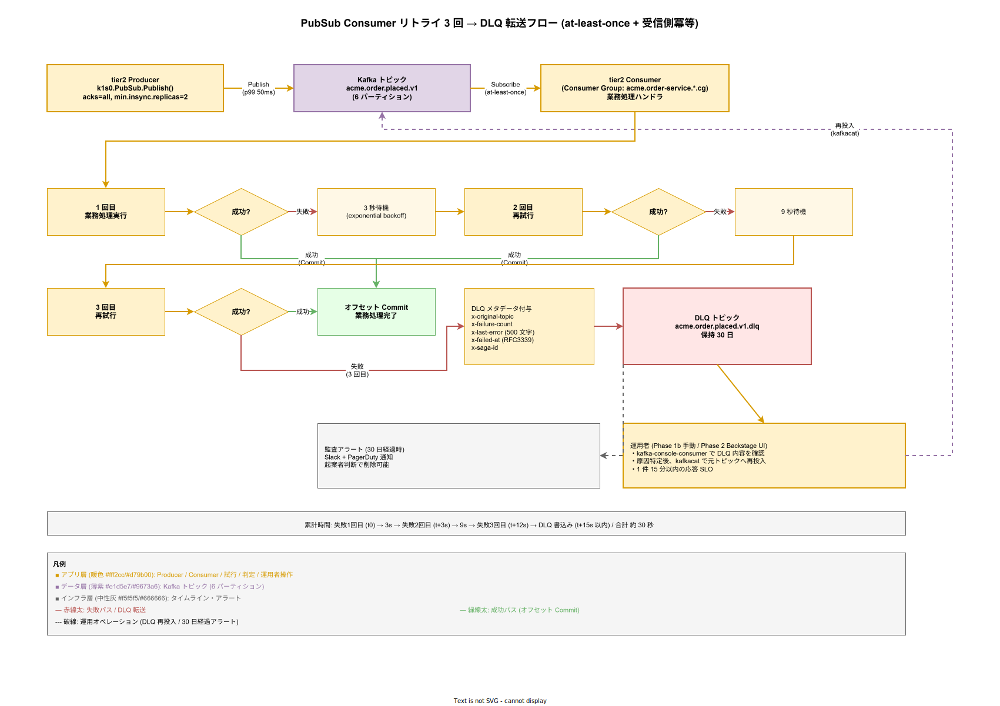

# 04. 非同期メッセージング方式

本ファイルは k1s0 tier1 が提供する PubSub API の裏側で動作する非同期メッセージング基盤の方式を固定化する。配送保証・トピック命名・パーティション戦略・Consumer Group・DLQ・スキーマ進化・マルチ DC 複製をひとつの整合した運用モデルに束ねる。

## 本章の位置付け

非同期メッセージングは Choreography Saga（[01_トランザクションとSaga方式.md](01_トランザクションとSaga方式.md)）と tier1 PubSub API の基礎であり、業務フローの疎結合化・スループット確保・バックグラウンド処理の前提となる。ここで採用する基盤の選定・配送保証・名前空間設計が甘いと、Phase 1b で顕在化する問題（トピック命名の混乱、Consumer Lag の放置、DLQ 運用の不在）が Phase 2 の拡張で修正不能な技術的負債に化ける。

本章は構想設計 ADR-DATA-002 で確定した Apache Kafka（Strimzi Operator、KRaft モード）採用を前提とし、Phase 1a の暫定基盤 NATS JetStream から Phase 1b での Kafka 切替移行、Phase 2 の Avro + Schema Registry 導入、Phase 3 の MirrorMaker2 によるマルチ DC DR までを通した設計を 1 章にまとめる。

tier1 PubSub API は内部で Dapr PubSub Building Block を経由して Kafka に到達する。tier2 / tier3 から見れば「k1s0.PubSub.Publish」と「k1s0.PubSub.Subscribe」の 2 つの API しか存在せず、Kafka 固有の概念（トピック、パーティション、オフセット）は tier1 内に閉じ込める。これは原則 3「内部実装は tier2 / tier3 に不可視」の具体化である。

## 設計方針

メッセージング基盤の設計は以下 5 原則で統一する。

- **at-least-once 配送を標準化**: exactly-once は Kafka Transactions で実装可能だが Dapr PubSub との相性・運用複雑度から採用しない。受信側冪等（[02_冪等性設計方式.md](02_冪等性設計方式.md)）で実効的 exactly-once を実現する。
- **トピック命名でテナント分離を強制**: `<tenant>.<domain>.<event>.v<version>` 形式を必須とし、ネームスペース違反は CI で弾く。
- **パーティション戦略はビジネスキー基準**: ビジネス上の一意識別子（注文 ID、ユーザ ID）でパーティショニングし、関連イベントの順序保証を確保する。
- **DLQ は必ず設置し人的介入を運用に組込む**: 失敗 3 回で自動転送し、再処理は別プロセスで運用者のオペレーションとして実行する。
- **スキーマは後方互換性を契約として固定**: Phase 1b は Protobuf（JSON エンコード）、Phase 2 で Avro + Schema Registry。Breaking change は tier1 の API バージョニングと連動。

## 基盤選定

### Apache Kafka（Strimzi Operator、KRaft）

Phase 1b 以降の本番基盤として Apache Kafka を採用する。運用は Strimzi Operator（Kubernetes Operator）で行い、ZooKeeper を廃した KRaft モードで構築する。採用根拠は構想設計 ADR-DATA-002 に記録済み。

- **ZooKeeper 廃止**: 運用コンポーネント 1 つ削減、2 名運用体制（原則 9）に適合
- **Strimzi の成熟**: Red Hat 系コミュニティ中心の継続開発、Kubernetes ネイティブ運用
- **オンプレ適合性**: クラウドマネージド依存なし（原則 10）
- **Phase 1b でのスループット要件**: PubSub Publish p99 50ms 以内、1000 msg/s を想定する

ノード構成は Phase 1b で 3 ノード（Broker）の HA 構成、Phase 2 以降で 5 ノードへ拡張可能とする。KRaft Controller は Broker と同居（combined mode）で Phase 1b を運用、Phase 2 で Controller 専用ノード分離を検討する。

### NATS JetStream（Phase 1a のみ）

Phase 1a（MVP-0、VM 1 台）では Kafka 運用が単独起案者に重すぎるため、NATS JetStream を暫定採用する。NATS は単一プロセスで永続化付き PubSub を提供し、運用オーバーヘッドが小さい。Dapr PubSub Building Block で NATS を抽象化するため、tier2 / tier3 のコードは Phase 1b での Kafka 切替時に変更不要である。

Phase 1a → 1b の切替は「Dapr Component YAML の `type: pubsub.jetstream` を `pubsub.kafka` に差し替える」だけで完了する。Choreography Saga の業務データは Phase 1a では長期保持を前提とせず、切替前に完了させる運用で対応する。

### Phase 切替時のメッセージ保証

- Phase 1a: NATS JetStream、at-least-once 配送、保持 24h
- Phase 1b 切替: Kafka、at-least-once 配送、保持 7 日（デフォルト）
- Phase 2 以降: Kafka、at-least-once、トピック別保持期間設定、Schema Registry 追加

### 設計 ID

- `DS-CTRL-MSG-001`: 基盤選定（Phase 1a NATS JetStream → Phase 1b Kafka 切替）。確定フェーズ: Phase 0 / Phase 1b。
- `DS-CTRL-MSG-002`: Kafka Strimzi + KRaft モード採用（ZooKeeper 非採用）。確定フェーズ: Phase 1b。
- `DS-CTRL-MSG-003`: Phase 1a → 1b 切替の tier2 / tier3 透過性保証。確定フェーズ: Phase 1b。

## トピック命名規則

### 書式

全トピック名は以下書式で統一する。

```
<tenant>.<domain>.<event>.v<version>
```

- `tenant`: テナント識別子（小文字英数字 + ハイフン、最大 20 文字）。例: `acme`、`contoso-corp`。
- `domain`: 業務ドメイン（小文字英字、最大 20 文字）。例: `order`、`inventory`、`billing`。
- `event`: イベント種別（小文字英字、過去形推奨）。例: `placed`、`shipped`、`cancelled`。
- `version`: スキーマバージョン（`v1`、`v2`...）。非後方互換変更で増加させる。

具体例: `acme.order.placed.v1`、`contoso-corp.billing.invoice-issued.v2`。

### 分離要件

テナント分離は tier1 公開 API の契約で強制する。`PubSub.Publish` のトピック引数はテナント識別子を含む必要があり、API Gateway 層で呼び出し元テナントと一致することを検証する。異なるテナントのトピックへの Publish / Subscribe は `403 Forbidden` で拒否する。

### 予約名

- `*.dlq`: Dead Letter Queue（後述）、tier1 が自動生成
- `*.retry`: リトライ中継トピック（採用時）
- `_k1s0.*`: tier1 内部制御用（例: `_k1s0.health`、`_k1s0.config`）、tier2 / tier3 からのアクセス禁止

### CI 検証

トピック命名規則違反は CI（GHA）で `buf lint` 相当の静的検証として弾く。`.proto` で定義した PubSub Schema に `(k1s0.pubsub.topic) = "..."` アノテーションを付け、CI 時に書式マッチを走らせる。

### 設計 ID

- `DS-CTRL-MSG-004`: トピック命名規則 `<tenant>.<domain>.<event>.v<version>`。確定フェーズ: Phase 1b。
- `DS-CTRL-MSG-005`: テナント分離の API Gateway 層強制。確定フェーズ: Phase 1b。
- `DS-CTRL-MSG-006`: 予約トピック名（`*.dlq` / `*.retry` / `_k1s0.*`）。確定フェーズ: Phase 1b。

## パーティション戦略

### 目的と選択肢

Kafka のパーティションは並列処理単位であり、メッセージの順序保証は同一パーティション内でのみ成立する。パーティション戦略の選択は以下 2 種類である。

- **キー指定あり**（ハッシュパーティショニング）: 指定キーの hash 値でパーティションを決定。同一キーのメッセージは必ず同一パーティションへ着き、順序保証が得られる。
- **キー指定なし**（ラウンドロビン）: パーティション間で均等分散。順序保証なし、最大スループット。

### 推奨パターン

業務ドメインが「1 エンティティの状態変化の順序」を必要とする場合（注文状態遷移、在庫更新）は、エンティティ ID をキーとする。業務ドメインが順序不要（ログ集計、通知）の場合はキーなしでラウンドロビン。

tier1 PubSub API は `Publish` の引数に `key` を任意で受け、指定時はハッシュパーティショニング、未指定時はラウンドロビンにルーティングする。

### パーティション数

- Phase 1b 初期: **1 トピックあたり 6 パーティション**（3 Broker × 2、Consumer 並列度 6 まで対応）
- Phase 2 以降: 負荷計測に基づき個別調整（トピック別に 3〜12 パーティションを想定）

パーティション数の変更は既存データの順序保証を崩すため（hash 再計算）、プロダクション後の変更は避ける。Phase 1b で 6 を選んだのは「初期負荷に対して余裕を持ちつつ、運用複雑度を抑える」バランス点である。

### 数値仕様

- 1 パーティション当たりの目標スループット: **100 msg/s**（Phase 1b、メッセージサイズ 1KB 想定）
- 1 トピック当たりの最大パーティション数: **12**（Phase 2）
- パーティション数の Phase 間変更禁止（既存トピック）、新バージョン（v2）トピックとして作り直す運用

### 設計 ID

- `DS-CTRL-MSG-007`: パーティション戦略（キー指定 / ラウンドロビン）の選択ルール。確定フェーズ: Phase 1b。
- `DS-CTRL-MSG-008`: 初期パーティション数 6 の数値根拠。確定フェーズ: Phase 1b。

## Consumer Group

### 原則

Consumer Group は「同一トピックを並列処理するコンシューマ群」を束ねる概念で、Kafka ではオフセット管理の単位となる。k1s0 は以下原則で統一する。

- **1 アプリ 1 Consumer Group**: tier2 のアプリ単位で独立した Group ID を発行し、複数アプリが同一トピックを別用途で購読できるようにする。
- **Group ID 命名**: `<tenant>.<app>.<topic>.cg` 形式。例: `acme.order-service.acme.order.placed.v1.cg`。
- **パーティション ↔ Consumer 割当**: Kafka デフォルトの Range / RoundRobin、Phase 2 以降で Sticky Assignor を検討（リバランス影響緩和）。

### Lag モニタリング

Consumer Lag（未処理メッセージ数）は業務処理の遅延指標として最重要である。Prometheus でのメトリクス収集は以下の通り。

- `kafka_consumergroup_lag{group, topic, partition}`: パーティションごとの Lag
- `kafka_consumergroup_lag_seconds{group, topic}`: Lag 時間換算（最古未処理メッセージのタイムスタンプ差）

Grafana Alert で以下を通知する。

- Lag > 1000 メッセージ が 5 分継続: Slack 通知（Consumer 処理能力不足の兆候）
- Lag > 10000 メッセージ が 1 分継続: PagerDuty 通知（緊急対応）
- Lag 時間 > 60 秒 が 5 分継続: Slack 通知（リアルタイム性要件違反）

### 設計 ID

- `DS-CTRL-MSG-009`: Consumer Group 命名と 1 アプリ 1 Group 原則。確定フェーズ: Phase 1b。
- `DS-CTRL-MSG-010`: Consumer Lag モニタリング閾値。確定フェーズ: Phase 1b。

## 配送保証と DLQ

### at-least-once 配送

tier1 PubSub API は at-least-once 配送を標準化する。Producer 側は `acks=all`（全 ISR が書込み完了を返却してから成功）、Consumer 側は「業務処理完了後にオフセットコミット」で確実性を担保する。

重複メッセージは発生する前提とし、受信側冪等（[02_冪等性設計方式.md](02_冪等性設計方式.md)）で排除する。

### DLQ（Dead Letter Queue）

Consumer 側で業務処理が失敗した場合、以下のフローで DLQ へ転送する。DLQ 転送は「3 回失敗したら諦めて運用者送り」という単純な規則に見えるが、実際は「失敗 → 待機 → 再試行 → 判定」を 3 サイクル繰り返す時系列プロセスで、メッセージ本体に加えて失敗理由・Saga 相関 ID などのメタデータを変換する加工工程も含む。時間軸と分岐を散文だけで追うのは負荷が高いため、以下のフロー図で「成功パス（緑）と失敗パス（赤）がどの時点で分岐し、DLQ に入った後どう運用者が再投入するか」を一枚で俯瞰できる形に整理する。



1. 最初の失敗 → 3 秒後に再試行
2. 2 回目の失敗 → 9 秒後に再試行（exponential backoff）
3. 3 回目の失敗 → **DLQ（`<topic>.dlq`）へ転送**

DLQ トピックは自動生成され、元メッセージのペイロードに加えて以下メタデータを付与する。

- `x-original-topic`: 元トピック名
- `x-failure-count`: 失敗回数
- `x-last-error`: 最終エラーメッセージ（500 文字まで）
- `x-failed-at`: 失敗タイムスタンプ（RFC3339）
- `x-saga-id`: Saga 相関 ID（存在する場合）

### DLQ 再処理運用

DLQ メッセージの再処理は別プロセス（運用チーム管理）で行う。Phase 1b では手動オペレーション、Phase 2 で Backstage プラグインによる UI 再処理を提供する。

- **手動再処理**: 運用者が `kafka-console-consumer` で DLQ を確認し、原因を特定後に kafkacat で元トピックへ再投入
- **自動再処理（Phase 2）**: Backstage UI から「選択メッセージの再投入」「特定期間の一括再投入」を実行可能

DLQ の保持期間は **30 日**。30 日を超えても再処理されない場合は監査アラートで通知し、起案者判断で削除可能とする。

### 数値仕様

- DLQ 転送までの試行回数: **3 回**
- DLQ 転送までのタイムアウト合計: **約 30 秒**（3s + 9s + 15s + DLQ 書込み 3s）
- DLQ 保持期間: **30 日**
- DLQ メッセージ再処理 SLO: Phase 1b 手動、1 件あたり 15 分以内（運用者応答時間）

### 設計 ID

- `DS-CTRL-MSG-011`: at-least-once 配送と Producer `acks=all` 設定。確定フェーズ: Phase 1b。
- `DS-CTRL-MSG-012`: DLQ 転送ルール（3 回失敗）とメタデータ仕様。確定フェーズ: Phase 1b。
- `DS-CTRL-MSG-013`: DLQ 再処理運用（Phase 1b 手動、Phase 2 UI）。確定フェーズ: Phase 1b / Phase 2。
- `DS-CTRL-MSG-014`: DLQ 保持期間 30 日。確定フェーズ: Phase 1b。

## スキーマ進化

### Phase 1b: Protobuf JSON

Phase 1b は Protobuf 定義（`.proto`）を JSON エンコードで Kafka に載せる。スキーマ契約は `src/tier1/contracts/pubsub/` 配下に一元管理し、buf CLI で `buf breaking` を CI 検証する。

- 後方互換変更（新フィールド追加 with default）: 同バージョン継続使用可能
- 非後方互換変更（フィールド削除 / 型変更）: トピックバージョン増加（v1 → v2）、新旧並行運用期間を設ける

### Phase 2: Avro + Schema Registry

Phase 2 で Confluent 互換の Apicurio Registry（または CloudEvents Schema Registry）を導入し、Avro スキーマ管理に移行する。Avro はメッセージサイズが小さく（Protobuf 比較で 20-30% 減）、スキーマ進化ルールが厳密。

Phase 1b → Phase 2 の移行は段階的に行う。既存 Protobuf トピックは継続使用し、新規トピックは Avro で作成する。Phase 2 中盤で主要トピックの Avro 移行を計画する。

### CloudEvents 準拠

全メッセージは CloudEvents 仕様（v1.0）に準拠する。必須フィールドは以下。

- `id`: メッセージ一意 ID（UUIDv7 推奨）、受信側冪等化のキー
- `source`: 発行元（URI 形式、例: `//k1s0/tier2/order-service`）
- `type`: イベント種別（トピック名と連動）
- `time`: 発行タイムスタンプ（RFC3339）
- `datacontenttype`: ペイロード MIME タイプ（`application/json` / `application/avro`）

### 設計 ID

- `DS-CTRL-MSG-015`: Phase 1b の Protobuf JSON エンコード方式。確定フェーズ: Phase 1b。
- `DS-CTRL-MSG-016`: Phase 2 の Avro + Schema Registry 移行方式。確定フェーズ: Phase 2。
- `DS-CTRL-MSG-017`: CloudEvents v1.0 準拠。確定フェーズ: Phase 1b。

## マルチ DC DR（Phase 3）

### MirrorMaker2

Phase 3 でマルチ DC DR を実現するため、Kafka MirrorMaker2 を導入する。構成は Active-Passive で、Primary DC から Secondary DC へ非同期複製する。

- 複製遅延目標: **10 秒以内**（RPO 秒オーダー要件に対応）
- 切替操作: Secondary DC を Active に昇格、Producer / Consumer の DNS / 設定変更（Runbook 化）
- 切戻し: Secondary → Primary の逆方向複製、整合性検証後に戻す

Phase 3 の MirrorMaker2 は運用複雑度が高いため、Phase 2 までは DR 非対応（単一 DC 運用）、Phase 3 での段階的導入とする。

### 設計 ID

- `DS-CTRL-MSG-018`: MirrorMaker2 によるマルチ DC DR（Phase 3）。確定フェーズ: Phase 3。

## 対応要件一覧

本章は以下の要件 ID を充足する。

- **FR-T1-PUBSUB-001**: PubSub Publish。Kafka 基盤 + at-least-once 配送で実現。
- **FR-T1-PUBSUB-002**: PubSub Subscribe。Consumer Group + Lag モニタリングで実現。
- **FR-T1-PUBSUB-003**: PubSub BulkPublish。バッチ書込みで実現（パーティション単位にバッチ化）。
- **FR-T1-PUBSUB-004**: DLQ 運用。3 回失敗 + DLQ 転送で実現。
- **FR-T1-PUBSUB-005**: Schema 検証。Phase 1b Protobuf、Phase 2 Avro で実現。
- **NFR-A-FT-001**: 一時的障害からの自動回復。at-least-once 配送 + 受信側冪等。
- **NFR-A-REC-001**: RPO 秒オーダー。Phase 3 MirrorMaker2 で 10 秒以内の複製遅延。
- **NFR-B-PERF-002**: PubSub Publish p99 50ms。Kafka の低レイテンシ構成で実現。

関連する構想設計 ADR は ADR-DATA-002（Kafka Strimzi、at-least-once 確定）。本章で採番した設計 ID は `DS-CTRL-MSG-001`〜`DS-CTRL-MSG-018` の 18 件。詳細な要件 ↔ 設計対応は [../80_トレーサビリティ/02_要件から設計へのマトリクス.md](../80_トレーサビリティ/02_要件から設計へのマトリクス.md) で管理する。
