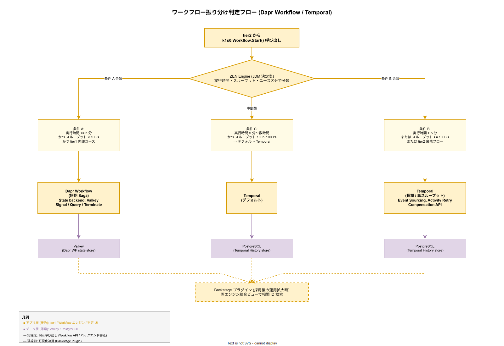

# 05. ワークフロー振り分け方式

本ファイルは k1s0 tier1 が内包する 2 種類のワークフローエンジン（Dapr Workflow と Temporal）の使い分けの方式を固定化する。tier2 開発者からは `k1s0.Workflow.Start()` という単一 API のみが見えるが、内部では ZEN Engine による決定評価で適切なバックエンドへ振り分けられる。

## 本章の位置付け

構想設計で「短期フローは Dapr Workflow、長期フローは Temporal」という原則が ADR-RULE-002 で確定している。しかし「短期・長期の境界をどう判定するか」「両者の運用コストをどう抑えるか」「業務フローの実装コードはどう書くか」といった具体は概要設計で定める必要がある。本章はこれら 3 点を 1 つの判定フロー・運用モデル・開発体験として固定化する。

2 エンジン併用は運用複雑度を招くが、ADR-RULE-002 での判断根拠は明確である。Dapr Workflow は tier1 内部の State Store（Valkey）を活用する軽量運用で、短期 Saga（数分以内）に最適。Temporal は Event Sourcing + Activity Retry + Compensation API の成熟した機能セットで、長期業務フロー（数時間〜数週間）・高スループット（1000/s 以上）・複雑な補償ロジックに最適。両者の長所を使い分けることで、tier2 開発者は業務フローの性質に応じた最適な基盤を選択できる。

ただし「2 エンジン併用」は運用工数の増加を招く。[../../01_企画/04_定量試算/03_運用工数試算.md](../../01_企画/04_定量試算/03_運用工数試算.md) で合意した年 0.5 人月の増分を本章の運用設計で吸収する。これを超える複雑化は本章の判定ロジックを簡素化することで対処する。

## 設計方針

### 透明 API と内部振り分け

tier2 / tier3 開発者は `k1s0.Workflow.Start()` / `k1s0.Workflow.Signal()` / `k1s0.Workflow.Query()` / `k1s0.Workflow.Terminate()` / `k1s0.Workflow.Purge()` の 5 メソッドのみを呼び出す。引数として Workflow 種別（`workflow_type`）を渡し、tier1 内部で振り分ける。開発者は Dapr Workflow / Temporal の違いを意識しない。

これは原則 1「tier1 は複雑性を吸収する」と原則 3「内部実装は tier2 / tier3 に不可視」の具体化である。Dapr Workflow API・Temporal SDK の呼び出しは tier1 内部に閉じ込め、tier2 / tier3 へは一切漏らさない。

### 振り分けロジックの決定表化

振り分けロジックはハードコードせず、ZEN Engine の JDM（JSON Decision Model）形式の決定表として記述する。これにより振り分け基準の変更が設定ファイル更新だけで完結し、tier1 コードの再デプロイを必要としない。決定表は Feature Management（[../30_共通機能方式設計/09_FeatureManagement方式.md](../30_共通機能方式設計/09_FeatureManagement方式.md)）で段階的にロールアウトする。

### 実装コードの移植性

tier2 開発者が書く業務フロー定義（Activity 実装、Signal 処理、Compensation 処理）は Dapr Workflow / Temporal のどちらでも実行できる移植性を確保する。tier1 側でアダプタ層を設け、同一の業務フロー定義ファイル（`*.workflow.ts` / `*.workflow.go`）を両エンジンで解釈できるようにする。

具体的には、tier1 が提供する Workflow DSL（決定表による宣言的定義 + Activity 関数定義）を、Dapr Workflow / Temporal それぞれのランタイムに変換する内部トランスパイラを実装する。Phase 1b で Dapr Workflow のみ対応、Phase 2 で Temporal 対応を追加する。

## 振り分け判定フロー

### 判定軸

振り分けは以下 3 軸の評価結果を組合わせて決定する。

- **実行時間**: 業務フロー全体の想定実行時間。5 分以下 / 5 分〜数時間 / 数時間〜数週間 の 3 段階で分類する。
- **スループット**: tier2 アプリが発行する `Workflow.Start` の秒間頻度（RPS）。100/s 未満 / 100〜1000/s / 1000/s 以上 の 3 段階で分類する。
- **ユース区分**: tier1 内部用途（tier1 API の背後処理、例: 非同期監査バッチ）か、tier2 業務フロー（注文処理、承認ワークフロー）かを 2 値で分類する。

判定軸の値は tier2 開発者が Workflow 登録時に申告する。`k1s0.Workflow.Register(workflow_type, expected_duration, expected_throughput, use_kind)` という API で申告値を tier1 に登録し、以降の `Start` 呼び出しで自動振り分けする。

### 決定表の構造

ZEN Engine の JDM 形式で以下の決定テーブルを記述する。

```yaml
# k1s0-workflow-routing.jdm.yaml
inputs:
  - name: expected_duration_sec
    type: number
  - name: expected_throughput_rps
    type: number
  - name: use_kind
    type: string  # "tier1_internal" | "tier2_business"

output:
  name: engine
  type: string  # "dapr_workflow" | "temporal"

rules:
  - condition:
      expected_duration_sec <= 300
      AND expected_throughput_rps < 100
      AND use_kind == "tier1_internal"
    engine: dapr_workflow
  - condition:
      expected_duration_sec > 300
      OR expected_throughput_rps >= 1000
      OR use_kind == "tier2_business"
    engine: temporal
  - default:
    engine: temporal  # 判定不能時はデフォルト Temporal
```

デフォルトを Temporal にする根拠は以下 2 点である。第一に Temporal の方が機能完備（Compensation API / 長期実行）であり、迷った場合に安全側へ倒せる。第二に Dapr Workflow は tier1 内部の State Store 資源（Valkey）を消費するため、誤って高スループット業務が流れ込むと tier1 全体の State レイヤを圧迫するリスクがある。

### 判定フロー図

下図は `k1s0.Workflow.Start()` 呼び出しから ZEN Engine 判定を経て Dapr Workflow または Temporal に振り分けられる一連のフローを示す。



### 数値仕様

- 判定オーバーヘッド: **1ms 以内**（ZEN Engine p99 1ms 要件に準拠、ADR-RULE-001）
- 判定結果のキャッシュ: Valkey 上に `workflow_type` 単位で 1 時間キャッシュ、決定表更新時はキャッシュ無効化
- 申告値の再評価: 運用監視で実測値との乖離が 2 倍以上発生した場合、アラート通知し tier2 開発者へ見直しを促す

### 設計 ID

- `DS-CTRL-WF-001`: 振り分け判定軸（実行時間・スループット・ユース区分）。確定フェーズ: Phase 1b。
- `DS-CTRL-WF-002`: ZEN Engine JDM 形式の決定表による振り分けロジック。確定フェーズ: Phase 1b。
- `DS-CTRL-WF-003`: デフォルト Temporal とする判断根拠。確定フェーズ: Phase 1b。
- `DS-CTRL-WF-004`: 判定オーバーヘッド 1ms 以内の数値根拠。確定フェーズ: Phase 1b。

## Dapr Workflow を使う条件

### 採用基準

Dapr Workflow を採用するのは以下 3 条件をすべて満たす場合である。

- 想定実行時間が **5 分以内**（典型的な Saga 1 回分）
- 想定スループットが **100/s 未満**（低〜中頻度）
- tier1 内部ユース（tier1 API の背後処理）

典型ユースケースは以下 3 パターン。

- **tier1 API の非同期後処理**: 例えば State.Set の書込み完了後に監査ログを非同期で Kafka へ発行する処理。
- **短期 Saga**: 単一業務トランザクション（在庫引当 → 決済 → 通知）で数秒〜数分で完結するフロー。
- **tier1 内部のバッチ処理**: 日次集計、Valkey のキャッシュウォーマーなど tier1 運用で自走する処理。

### 実装構成

- ランタイム: Dapr Workflow（daprd に組込み、Phase 1b で stable 化想定）
- State Backend: **Valkey**（Dapr State Store Building Block 経由）
- 実行環境: tier1 Go サイドカー内
- スケーリング: tier1 Pod の水平スケーリングに従う（Workflow 実行は tier1 Pod で分散）

### 制約

- 1 Workflow インスタンスの最大実行時間: **30 分**（超過時は強制 Terminate）
- 1 Workflow インスタンスの最大ステップ数: **100 ステップ**
- 1 Workflow インスタンスの最大状態サイズ: **1MB**（Valkey への書込み制約）

### 設計 ID

- `DS-CTRL-WF-005`: Dapr Workflow 採用基準（5 分 / 100 RPS / tier1 内部）。確定フェーズ: Phase 1b。
- `DS-CTRL-WF-006`: Dapr Workflow の Valkey バックエンド構成と制約値。確定フェーズ: Phase 1b。

## Temporal を使う条件

### 採用基準

Temporal を採用するのは以下いずれかを満たす場合である。

- 想定実行時間が **5 分超**（長期業務フロー）
- 想定スループットが **1000/s 以上**（高頻度）
- tier2 業務フロー（ドメインサービスが起動する業務プロセス）
- 複雑な Compensation ロジック（3 段階以上の補償チェーン）
- Signal / Query の多用（人手承認を介する長期ワークフロー）

典型ユースケースは以下 3 パターン。

- **承認ワークフロー**: 稟議・発注・契約承認など、人手介入 + 複数段階の状態遷移を持つフロー。数日〜数週間規模。
- **大規模バッチ処理**: 月次決算・年次レポート集計など、数万〜数百万レコードを段階的に処理するフロー。
- **複雑な Saga**: 注文処理（在庫 → 決済 → 出荷 → 配送 → 通知 → 返品対応）など 5 ステップ以上の補償を持つフロー。

### 実装構成

- ランタイム: Temporal Server（Phase 2 確定、ADR-RULE-002）
- History Store: **PostgreSQL**（CloudNativePG クラスタ）
- Visibility Store: PostgreSQL（Phase 2 初期）、Phase 3 で OpenSearch 移行検討
- 実行環境: Temporal Workers（tier1 Rust サイドカー内に組込み）
- スケーリング: Temporal Worker Pod の水平スケーリング（Task Queue 単位で負荷分散）

### 制約

- 1 Workflow インスタンスの最大実行時間: **無制限**（Temporal のサポート範囲、実運用では 1 年以内を推奨）
- 1 Workflow インスタンスの最大 History Event 数: **51200**（Temporal のデフォルト上限、ContinueAsNew で延長可能）
- 1 Activity の最大実行時間: **24 時間**（タイムアウト超過時は再試行 or 失敗判定）

### 設計 ID

- `DS-CTRL-WF-007`: Temporal 採用基準（5 分超 / 1000 RPS / tier2 業務フロー）。確定フェーズ: Phase 2。
- `DS-CTRL-WF-008`: Temporal の PostgreSQL バックエンド構成と制約値。確定フェーズ: Phase 2。

## 2 エンジン併用のコスト

### 運用工数の見積

2 エンジン併用は運用工数を増加させる。企画書 [../../01_企画/04_定量試算/03_運用工数試算.md](../../01_企画/04_定量試算/03_運用工数試算.md) では以下の増分を計上している。

- **年 0.5 人月**（約 80 時間）の増分
  - Temporal Server のバージョン更新 + 動作検証: 年 2 回 × 16 時間 = 32 時間
  - Dapr Workflow / Temporal の障害切り分け: 月平均 2 時間 × 12 月 = 24 時間
  - 両エンジンの動作差異による tier2 問合せ対応: 月平均 1.5 時間 × 12 月 = 18 時間
  - 決定表の見直しと段階的ロールアウト: 四半期 1.5 時間 × 4 = 6 時間

この 0.5 人月を超える場合、本章の振り分けロジックを簡素化（例: 境界値を単純化、判定軸を削減）する。運用工数の増加は 2 名運用原則（原則 9）の破綻リスクに直結する。

### 障害時の切り分け Runbook

2 エンジン併用で最も難しい運用タスクは「Workflow の振る舞いが期待と異なるとき、どのエンジンが原因か」の切り分けである。以下の切り分け手順を Runbook 化する。

1. **振り分け先の確認**: `k1s0-workflow-cli lookup <workflow_id>` で判定結果を取得、Dapr / Temporal のどちらに振り分けられたかを確認。
2. **エンジン個別ログ確認**: Dapr Workflow は Valkey + tier1 Go ログ、Temporal は Temporal Server ログ + tier1 Rust ログ、それぞれの観測点へアクセス。
3. **決定表の再評価**: 実行時スループット・実行時間の実測値を確認し、決定表の適用が妥当か判定。
4. **エスカレーション**: 切り分け不能時は Temporal 側へエスカレーションする。

Runbook は Backstage の Tech Docs に配置し、新規協力者の 2 週間キャッチアップで習得可能な粒度とする（原則 9）。

### 設計 ID

- `DS-CTRL-WF-009`: 2 エンジン併用の運用工数見積（年 0.5 人月）。確定フェーズ: Phase 2。
- `DS-CTRL-WF-010`: 障害切り分け Runbook。確定フェーズ: Phase 2。

## 移植性と切替可能性

### 業務フロー定義の互換性

tier2 開発者が書く業務フロー定義は、両エンジンのどちらでも実行できる互換レイヤ上で動作する。以下 3 要素を tier1 が提供する。

- **Workflow DSL**: TypeScript / Go で書ける宣言的 DSL（`defineWorkflow({ steps: [...] })`）。内部で Dapr Workflow / Temporal の API に変換される。
- **Activity SDK**: tier2 開発者が Activity 関数を書く薄い SDK。冪等キー処理・リトライ・ログ送出を共通化。
- **Signal / Query SDK**: 長期ワークフローでの人手介入を受け付ける API。両エンジンで同じシグネチャ。

### 実行バックエンドの切替

Workflow 定義はそのままで、決定表を更新することで実行バックエンドを切替可能とする。切替時の移行パターンは以下の 2 種類である。

- **段階的切替**: 決定表で「新規インスタンスは Temporal、既存は Dapr Workflow で継続」と設定。全既存インスタンス完了後に決定表を更新。
- **強制切替**: 既存インスタンスを `Terminate` + 新エンジンで `Restart`。Saga 状態の永続化により、業務データは保持。

切替テストは Phase 2 の受け入れテストで検証する。同一業務フロー定義を Dapr Workflow / Temporal で実行し、結果の同一性を確認する。

### 設計 ID

- `DS-CTRL-WF-011`: Workflow DSL とバックエンド切替可能性。確定フェーズ: Phase 2。
- `DS-CTRL-WF-012`: 既存インスタンス保持のままエンジン切替する段階的移行パターン。確定フェーズ: Phase 2。

## 可視化（Phase 2）

### Backstage プラグイン

Phase 2 で両エンジン統合ビューを提供する Backstage プラグインを開発する。機能は以下 4 つ。

- **Workflow 一覧**: 両エンジンの実行中・完了・失敗 Workflow を統合表示。フィルタ（tenant / domain / status）。
- **タイムライン表示**: 単一 Workflow のステップ実行履歴を時系列で可視化。Signal 発火・Compensation 実行もマーク。
- **Saga 相関 ID 検索**: 複数 Workflow / Choreography Saga の関連インスタンスを相関 ID 一括表示。
- **手動介入 UI**: [01_トランザクションとSaga方式.md](01_トランザクションとSaga方式.md) の Saga Inspector と統合した運用 UI。

### 設計 ID

- `DS-CTRL-WF-013`: Backstage プラグインによる両エンジン統合ビュー。確定フェーズ: Phase 2。

## 対応要件一覧

本章は以下の要件 ID を充足する。

- **FR-T1-WORKFLOW-001**: Workflow Start API。Dapr / Temporal 透過振り分けで実現。
- **FR-T1-WORKFLOW-002**: Workflow Query API。両エンジンで統一シグネチャ。
- **FR-T1-WORKFLOW-003**: Workflow Signal API。両エンジンで at-least-once 配送。
- **FR-T1-WORKFLOW-004**: Workflow Terminate API。両エンジンで即時終了 + 補償トリガ。
- **FR-T1-WORKFLOW-005**: Workflow Purge API。完了済みインスタンスのクリーンアップ。
- **NFR-A-FT-001**: 一時的障害からの自動回復。両エンジンともに Activity Retry + 状態永続化。
- **NFR-B-PERF-001**: tier1 API p99 500ms。振り分け判定 1ms 以内で達成。
- **NFR-A-REC-001**: RPO 秒オーダー。両エンジンのバックエンド（Valkey / PostgreSQL）のレプリケーションで担保。

関連する構想設計 ADR は ADR-RULE-001（ZEN Engine 決定評価 p99 1ms）、ADR-RULE-002（Temporal 長期ワークフロー Phase 1b 確定）、ADR-DATA-004（Valkey）。本章で採番した設計 ID は `DS-CTRL-WF-001`〜`DS-CTRL-WF-013` の 13 件。詳細な要件 ↔ 設計対応は [../80_トレーサビリティ/02_要件から設計へのマトリクス.md](../80_トレーサビリティ/02_要件から設計へのマトリクス.md) で管理する。
