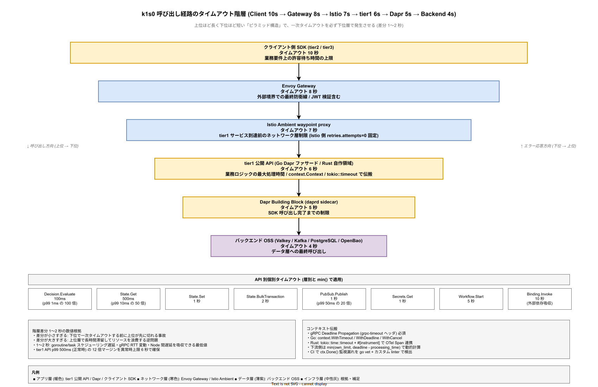

# 06. タイムアウトとバックプレッシャ方式

本ファイルは k1s0 tier1 の呼び出し経路全体におけるタイムアウト階層、コンテキスト伝搬、バックプレッシャ機構、Rate Limit、Load Shedding の方式を固定化する。tier1 API p99 500ms という企画コミットを、階層的なタイムアウト設計と過負荷時の秩序ある劣化戦略によって構造的に満たす。

## 本章の位置付け

タイムアウト設計の失敗は、直接的には「上位層が一次タイムアウトするよりも前に下位層が応答してしまい、二重タイムアウトで応答レイテンシが読めなくなる」形で表面化する。さらに深刻なのは「タイムアウト後も下流処理が走り続け、リソースを浪費する」問題で、コンテキスト伝搬の欠落によってクライアントが既に諦めたリクエストを tier1 が処理し続けるパターンである。

本章は上記 2 問題を構造的に防ぐため、クライアント → Envoy Gateway → Istio → tier1 API → Dapr → バックエンドの階層ごとにタイムアウト値を厳密に配分し、上位ほど長く下位ほど短くする規律を固定化する。コンテキスト伝搬は gRPC Deadline Propagation と Go `context.Context` / Rust `tokio::timeout` で実現し、下流側は「上位の残り時間」を把握して処理可能性を自己判定する。

バックプレッシャと Rate Limit は過負荷時の秩序維持機構である。1 テナントの突発負荷が他テナントへ波及することを Envoy Gateway の Rate Limit で防ぎ、全体負荷の高騰時は優先度の低い API（ログ・テレメトリ）を Load Shedding で切り捨てることで、優先度の高い API（State / Decision）の応答性能を守る。

## 設計方針

タイムアウト・バックプレッシャ設計は以下 5 原則で統一する。

- **上位は下位より 1〜2 秒長く**: 一次タイムアウトを必ず下位層で発生させ、上位層での多重タイムアウトを回避する。
- **コンテキスト伝搬必須**: gRPC Deadline Propagation を全 tier1 内部通信で有効化、Go `context.Context` / Rust `tokio::timeout` を全ハンドラで受け渡す。
- **バックプレッシャは早期に伝達**: 下流の過負荷を上流へ即座に伝播し、サーキットブレーカーと連動して遮断する。
- **Rate Limit はテナント別**: 1 テナントの突発負荷が他テナントへ波及しない設計とする。
- **Load Shedding は優先度主導**: 優先度の低い API を先に切り捨て、業務クリティカルな API の応答性能を守る。

## タイムアウト階層

### 階層設計の基本

クライアント → tier1 → バックエンド OSS の全経路は以下の階層で構成される。各層のタイムアウトは上位ほど長く下位ほど短くする。これは「下位層で一次タイムアウトが必ず先に発生し、上位層では下位のエラー応答を受けて判断できる」規律を構造化するためである。

6 層構成のピラミッド構造は、下図のとおり上位から下位へ徐々に幅の狭まる階層として可視化できる。層ごとに異なるレイヤ責務（アプリ層: tier1・Dapr / ネットワーク層: Envoy・Istio / データ層: バックエンド OSS）も色で分離することで、「層が違えばタイムアウトの性格も違う」という読み替えを視覚的に補助する。

| 層 | タイムアウト | 役割 |
|---|---|---|
| クライアント側 SDK | **10 秒** | 業務要件上の許容待ち時間の上限 |
| Envoy Gateway | **8 秒** | 外部境界での最終防衛線 |
| Istio Ambient（waypoint） | **7 秒** | tier1 サービス到達前のネットワーク層制限 |
| tier1 公開 API（Go / Rust） | **6 秒** | 業務ロジックの最大処理時間 |
| Dapr Building Block | **5 秒** | Dapr の SDK 呼び出し完了までの制限 |
| バックエンド OSS 呼び出し | **4 秒** | Valkey / Kafka / PostgreSQL への最終呼び出し |

各層の差分は 1〜2 秒とする。差分が小さすぎると「下位で一次タイムアウトする前に上位が先に切れる」事故が発生する。差分が大きすぎると「上位層でリクエストが長時間滞留してリソースを浪費する」逆問題が発生する。1〜2 秒は Go / Rust の goroutine / task スケジューリング遅延、gRPC パケットの RTT 変動、Kubernetes ノード間遅延を吸収できる最低値である。

### 数値根拠

tier1 API p99 500ms（企画コミット、[../00_設計方針/02_設計原則と制約.md](../00_設計方針/02_設計原則と制約.md) 制約 6）は「正常時」の目標値であり、タイムアウト 6 秒は「正常範囲を超えた異常時」の上限として 12 倍の余裕を見る。これは 99.9%ile 以上の異常状況でも業務継続性を失わないためのマージン設計である。

バックエンド呼び出しの 4 秒上限は以下の積算で導出した。

- Valkey 往復: 通常 5ms、タイムアウト時 2 秒以内（Valkey の slow command の上限想定）
- PostgreSQL 往復: 通常 20ms、タイムアウト時 3 秒以内（複雑クエリの許容時間）
- Kafka Publish: 通常 10ms、タイムアウト時 2 秒以内（`linger.ms` 1ms + ack 待ち）
- 外部 Binding（HTTP）: 通常 100ms、タイムアウト時 4 秒以内（SLA 合意の上限）

### API 別の個別タイムアウト

上記の層別タイムアウトに加え、API 種別ごとの個別タイムアウトも設定する。これは「短いのが自明な API（Decision 評価 p99 1ms）は短めに、長いのが妥当な API（Workflow Start）は長めに」設定することで、異常検知の感度を上げるためである。

- **Decision.Evaluate**: 100ms（p99 1ms の 100 倍上限）
- **State.Get**: 500ms（p99 10ms の 50 倍）
- **State.Set**: 1 秒
- **State.BulkTransaction**: 2 秒（[01_トランザクションとSaga方式.md](01_トランザクションとSaga方式.md) 参照）
- **PubSub.Publish**: 1 秒（p99 50ms の 20 倍）
- **Secrets.Get**: 1 秒
- **Workflow.Start**: 5 秒（振り分け判定 + エンジン側起動）
- **Binding.Invoke**: 10 秒（外部依存の応答時間を吸収）

層別タイムアウトと API 別タイムアウトは `min(layer, api)` で適用する。

### 設計 ID

- `DS-CTRL-TO-001`: タイムアウト階層構造（Client 10s → Gateway 8s → Istio 7s → tier1 6s → Dapr 5s → Backend 4s）。確定フェーズ: Phase 1b。
- `DS-CTRL-TO-002`: 層間タイムアウト差分 1〜2 秒の数値根拠。確定フェーズ: Phase 1b。
- `DS-CTRL-TO-003`: API 別個別タイムアウト一覧。確定フェーズ: Phase 1b。

## コンテキスト伝搬

### gRPC Deadline Propagation

tier1 内部の gRPC 通信はすべて Deadline Propagation を有効化する。クライアントが gRPC metadata `grpc-timeout: 6000m` を付与すると、サーバ側は残り時間を `context.Deadline()`（Go）または `tokio::time::Instant`（Rust）として受け取り、下流呼び出しへ伝播する。

下流側は「上位の残り時間」から自分のタイムアウト上限を `min(own_limit, deadline - processing_time)` で動的に計算する。これにより、上位のリクエストが既にタイムアウトしている状況で下流が処理を継続する無駄を防ぐ。

### Go context.Context

Go の Dapr ファサード層は全ハンドラで `context.Context` を第 1 引数として受け取り、関数呼び出しチェーン全体に渡す。以下 3 パターンを使い分ける。

- `context.WithTimeout(parent, duration)`: 新規タイムアウト設定
- `context.WithDeadline(parent, time)`: 絶対時刻でのデッドライン設定（gRPC deadline からの変換）
- `context.WithCancel(parent)`: 明示的キャンセル（例: Saga Terminate 操作）

`Ctx.Done()` 監視を忘れたコードは CI の静的検証（`go vet` + カスタム linter）で検出する。全 handler に `ctx.Done()` 監視を強制する。

### Rust tokio::timeout

Rust の自作領域（ZEN Engine 統合 / crypto）は `tokio::time::timeout(duration, future)` で同様のコンテキスト伝搬を実現する。非同期関数シグネチャに `#[instrument]` 属性を付け、OTel Span と連携してタイムアウト情報を分散トレースに記録する。

Rust 側は Go 側との言語境界（Protobuf gRPC）で deadline を受け渡し、同じ精度のタイムアウト制御を実現する。

### 設計 ID

- `DS-CTRL-TO-004`: gRPC Deadline Propagation の全 tier1 内部通信での必須化。確定フェーズ: Phase 1b。
- `DS-CTRL-TO-005`: Go `context.Context` / Rust `tokio::timeout` の受け渡し規約。確定フェーズ: Phase 1b。
- `DS-CTRL-TO-006`: CI による `ctx.Done()` 監視漏れの静的検証。確定フェーズ: Phase 1b。

## バックプレッシャ

### gRPC Flow Control

gRPC は HTTP/2 の Flow Control を基盤としてバックプレッシャを提供する。tier1 内部通信は gRPC streaming API を活用し、以下の設定で適切なバックプレッシャを効かせる。

- **Window size**: 64KB（gRPC デフォルト、Phase 2 で調整可能）
- **Max concurrent streams**: 100（サーバ側の上限）
- **Keepalive**: 30 秒間隔、タイムアウト 10 秒

受信側バッファが満杯の場合、gRPC は送信側に WINDOW_UPDATE を遅延させることで送信速度を調整する。Go / Rust 両言語の gRPC ライブラリが標準サポート。

### Kafka Consumer Pause/Resume

Kafka Consumer は業務処理が追い付かない場合、`pause(partitions)` で特定パーティションの受信を停止し、処理が回復したら `resume(partitions)` で再開する。Consumer Lag が閾値（5000 メッセージ）を超えた場合に自動 pause を発動する。

- pause 発動閾値: Lag 5000 メッセージ
- resume 発動閾値: Lag 1000 メッセージ以下に減少
- pause 中のハートビート維持: Kafka の `max.poll.interval.ms` を超えない範囲で定期 poll（空メッセージで session 維持）

### Valkey Connection Limit

Valkey クライアントは接続プール上限（[03_リトライとサーキットブレーカー方式.md](03_リトライとサーキットブレーカー方式.md) Bulkhead 参照）に到達した場合、新規リクエストを即座に `429 Too Many Requests` で拒否する。待機キューで滞留させる方式は採用しない（OOM リスクと遅延蓄積を避けるため）。

### 設計 ID

- `DS-CTRL-TO-007`: gRPC Flow Control 設定値（window 64KB、streams 100、keepalive 30s）。確定フェーズ: Phase 1b。
- `DS-CTRL-TO-008`: Kafka Consumer Pause/Resume 閾値（pause 5000 / resume 1000）。確定フェーズ: Phase 1b。
- `DS-CTRL-TO-009`: Valkey 接続プール上限到達時の即時 429 応答。確定フェーズ: Phase 1b。

## Rate Limit（テナント別）

### Envoy Gateway での実装

Envoy Gateway の Rate Limit Service（RLS）を tier1 の外部境界で有効化し、テナント別の秒間リクエスト上限を設定する。

- メトリクス: `k1s0_tenant_rps{tenant}`（Prometheus に emit）
- デフォルト上限: **1000 RPS/tenant**（Phase 1b 初期値）
- 超過時の応答: `429 Too Many Requests` + `Retry-After: 5` ヘッダ
- バースト許容: トークンバケット方式、バースト 1.5 倍（1500 RPS）まで瞬間許容

### テナント別カスタム上限

Enterprise テナントの業務要件に応じて、Feature Management 連動で上限を変更可能とする。

- Small テナント: 100 RPS
- Medium テナント: 1000 RPS（デフォルト）
- Large テナント: 10000 RPS（要個別契約）

上限変更は Backstage の Admin UI から起案、承認後に自動反映する。直接の Kubernetes ConfigMap 変更は禁止（監査証跡を残すため）。

### テナント間の分離

あるテナントが自テナント上限に達しても、他テナントの処理には影響しない。Envoy の Rate Limit は key ごとに独立したトークンバケットを持つため、構造的に分離される。

### 設計 ID

- `DS-CTRL-TO-010`: Envoy Gateway による Rate Limit（デフォルト 1000 RPS/tenant、バースト 1.5 倍）。確定フェーズ: Phase 1b。
- `DS-CTRL-TO-011`: テナント別カスタム上限の Backstage 承認フロー。確定フェーズ: Phase 2。

## Load Shedding（過負荷時の優先度制御）

### 過負荷検知

tier1 全体の過負荷状況は以下 2 指標で検知する。

- **tier1 API 全体の p99 レイテンシ > 400ms（30 秒継続）**: p99 500ms SLO に近づいたら即 Shed 開始
- **tier1 Pod の CPU 使用率 > 80%（30 秒継続）**: リソース枯渇の兆候

検知は Prometheus + Grafana Alert で実施し、アラート受信と同時に Feature Flag `load_shedding.enabled=true` を自動設定する。

### 優先度別の API 分類

Load Shedding は優先度の低い API を先に切り捨てる設計とする。優先度は業務クリティカル性で分類する。

- **P0（必須維持）**: State / Secrets / Decision / Workflow の実行
- **P1（負荷上昇時維持）**: PubSub / Binding / Invoke
- **P2（Shedding 対象）**: Log / Telemetry / Audit の非同期書込み

Shedding モードでは P2 API を即座に `503 Service Unavailable` + `Retry-After: 60` で拒否する。クライアントは 60 秒後に再送すればよく、業務処理には影響しない（非同期書込みのため）。

### 段階的 Shedding

Shedding は段階的に発動する。

1. **Stage 1**（p99 400ms 30s 継続）: P2 API を 50% で Shed（確率的 drop）
2. **Stage 2**（p99 450ms 30s 継続）: P2 API を 100% で Shed、P1 API を 25% で Shed
3. **Stage 3**（p99 480ms 30s 継続）: P2 100% + P1 50% + PagerDuty 通知

Stage 3 で P0 API のみに絞ってもレイテンシが回復しない場合、tier1 Pod の水平スケールアウトを KEDA 経由で自動発動する（Phase 2）。

### Shedding 解除

Shedding は以下条件で自動解除する。

- p99 レイテンシ < 300ms（5 分継続）
- CPU 使用率 < 60%（5 分継続）

解除もステージ順に逆順で実施する（Stage 3 → 2 → 1 → 解除）。急激な解除による再過負荷を避ける。

### 設計 ID

- `DS-CTRL-TO-012`: Load Shedding 過負荷検知閾値（p99 400ms 30s、CPU 80% 30s）。確定フェーズ: Phase 2。
- `DS-CTRL-TO-013`: 優先度別 API 分類（P0 / P1 / P2）。確定フェーズ: Phase 2。
- `DS-CTRL-TO-014`: 段階的 Shedding（Stage 1-3）の発動と解除ロジック。確定フェーズ: Phase 2。

## 観測性

### メトリクス

Prometheus メトリクスで以下を emit する。

- `tier1_api_timeout_total{api, layer}`: 層別タイムアウト発生回数
- `tier1_api_latency_seconds{api, quantile}`: API 別レイテンシ分布
- `tier1_context_cancellation_total{api, reason}`: コンテキストキャンセル発生回数（deadline / client_cancel）
- `grpc_flow_control_blocked_seconds_total`: gRPC Flow Control によるブロック時間
- `kafka_consumer_paused{group, topic}`: Consumer pause 状態（0 / 1）
- `envoy_rate_limited_total{tenant}`: Rate Limit 発動回数
- `tier1_load_shedding_stage{tenant}`: 現在の Shedding ステージ

### アラート

- 層別タイムアウト発生 100 件 / 分超: Slack 通知
- Rate Limit 発動 > 1000 件 / 分: Slack 通知（容量計画の見直し）
- Load Shedding Stage 3 到達: PagerDuty 通知（緊急対応）

### 設計 ID

- `DS-CTRL-TO-015`: タイムアウト・バックプレッシャ観測メトリクス。確定フェーズ: Phase 1b。
- `DS-CTRL-TO-016`: Grafana アラートルール。確定フェーズ: Phase 1b。

## 対応要件一覧

本章は以下の要件 ID を充足する。

- **FR-T1-INVOKE-001〜005**: Service Invocation の階層的タイムアウト制御。全 RPC で本章の数値に準拠。
- **FR-T1-PUBSUB-001**: PubSub Publish p99 50ms。層別タイムアウト + Kafka Producer 設定で実現。
- **FR-T1-PUBSUB-002**: PubSub Consumer バックプレッシャ（Pause/Resume）。
- **NFR-A-FT-001**: 一時的障害からの自動回復。タイムアウト + リトライ + サーキットブレーカーの連動。
- **NFR-A-FT-004**: 障害連鎖防止。Load Shedding + Rate Limit でテナント間分離。
- **NFR-B-PERF-001**: tier1 API p99 500ms。階層タイムアウト設計で構造的に担保。
- **NFR-B-PERF-003**: State Get p99 10ms。API 別タイムアウト 500ms 上限。
- **NFR-B-PERF-004**: Decision Evaluate p99 1ms。API 別タイムアウト 100ms 上限。
- **NFR-B-PERF-005**: PubSub Publish p99 50ms。API 別タイムアウト 1 秒上限。
- **NFR-B-PERF-006**: 計装オーバヘッド 10ms。計装経路のタイムアウト制御で性能劣化要因化を抑止。
- **NFR-A-FT-004**: 障害連鎖防止・テナント間隔離。Load Shedding + Envoy Rate Limit で秩序ある劣化を実現。
- **NFR-B-RES-001**: tier1 API サーバの水平拡張。KEDA + Load Shedding 連動でスケールアウト。

関連する構想設計 ADR は ADR-RULE-001（ZEN Engine 決定評価 p99 1ms）、ADR-DATA-002（Kafka Strimzi）、ADR-DATA-004（Valkey）。本章で採番した設計 ID は `DS-CTRL-TO-001`〜`DS-CTRL-TO-016` の 16 件。詳細な要件 ↔ 設計対応は [../80_トレーサビリティ/02_要件から設計へのマトリクス.md](../80_トレーサビリティ/02_要件から設計へのマトリクス.md) で管理する。
