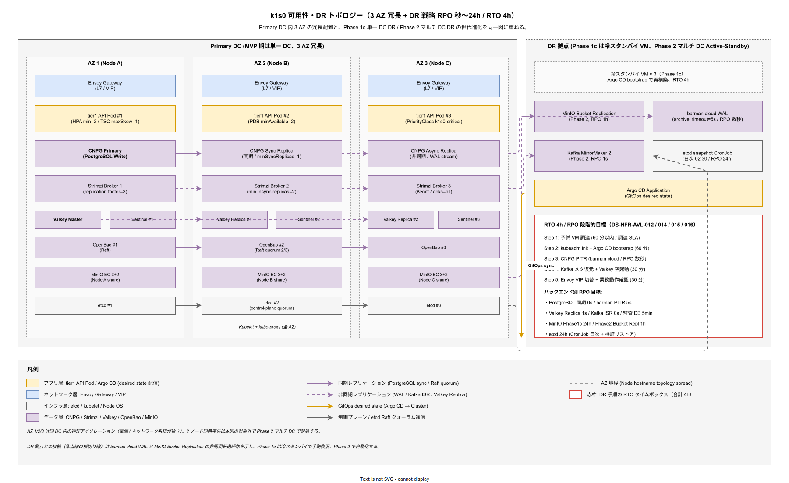

# 01. 可用性・DR 方式設計

本ファイルは要件定義書 [../../03_要件定義/30_非機能要件/A_可用性/](../../03_要件定義/30_非機能要件/A_可用性/) の NFR-A 系 13 要件を受けて、k1s0 が稼働率 SLA 99%（月 7.2 時間許容）および内部 SLO 99.9%（月 43 分許容）を達成するための方式を確定する。Pod 単位・ノード単位・拠点単位・DC 全損の 4 段階の障害シナリオに対し、どのコンポーネントがどの冗長度でどの RPO / RTO を実装するかを設計する層である。

## 本ファイルの位置付け

要件定義は「月 43 分以内に復旧する」「秒オーダーでデータを保護する」といった**約束**を採番した。本ファイルはその約束が「どの OS・どのコンポーネント・どの Operator 設定で実現されるか」という**方式**に翻訳する。要件定義が「何を保証するか」を書き、[../10_システム方式設計/01_ハードウェア方式設計.md](../10_システム方式設計/01_ハードウェア方式設計.md) で 3 ノード構成・Longhorn・MinIO を選定したのを前提に、本章は「その構成で稼働率 99.9% を維持する冗長配置・Probe 設定・DR 手順」を書く。

可用性方式は曖昧にするとすべての運用設計が崩れる。「障害時は再起動する」という抽象記述では、Pod 死と ノード死で復旧時間が 1 桁違うことを隠蔽してしまい、SRE が現場で判断を迫られる。したがって本章は、障害シナリオ別に**復旧主体・検知時間・復旧時間・データ損失**の 4 値を具体数値で確定する。

## 稼働率目標と計算根拠

k1s0 は外部コミット（SLA）と内部目標（SLO）を分離する。外部 SLA は企画承認済みの 99.0%、内部 SLO は外部 SLA を守るための先行指標として 99.9% を置く。SLA と SLO を同値にすると、SLO 消費時点ですでに外部コミット違反に近いため運用判断のリードタイムが失われる。逆に SLO を SLA の 10 倍厳しくすると自己満足的なアラート疲労を招く。10 倍ではなく 10 分の 1 アローワンス（SLA 1% に対し SLO 0.1%）で設計し、SLO 消費率を先行指標として運用する。

稼働率の計算式は ITU-T 標準 `availability = uptime / (uptime + downtime)` を採用し、「計画停止（事前周知のメンテナンス窓）」は uptime に含めず、「計画外停止（障害）」のみをダウンタイムとして集計する。計画停止を含めると SLA 値が機械的に低下し、稟議で約束した 99% の意味が曖昧になる。計画停止は年 12 時間以内（月 1 時間以内）を別途 SLA として合意する。

**設計項目 DS-NFR-AVL-001 稼働率目標と許容ダウンタイム**

- 外部 SLA: 99.0%（月間ダウンタイム 7 時間 12 分以内、年間 87 時間 36 分以内。企画書と要件定義 NFR-A-001 で確定。）
- 内部 SLO: 99.9%（月間ダウンタイム 43 分 12 秒以内、年間 8 時間 45 分以内。先行指標として利用。）
- 計画停止: 年 12 時間以内（月 1 時間以内）。事前 72 時間告知必須。計画停止は SLA 算定に含めず別枠管理。
- 算定対象: tier1 公開 11 API の可用性の加重平均。重みは呼び出し頻度（Service Invoke 40% / State 25% / PubSub 15% / その他 20%）。
- 計測点: Envoy Gateway の成功レスポンス率（2xx / 4xx を uptime、5xx / connection-refused / timeout を downtime とする。4xx のうちリクエスト起因は downtime に含めない）。
- 確定フェーズ: Phase 1b（MVP-1a）でパイロット稼働時に計測開始、Phase 1c で SLO レビュー実施。

## 単一 Pod 障害の復旧方式

単一 Pod 障害は発生頻度が最も高く（月数回オーダー）、自動復旧で運用負荷をゼロにすることが必須である。Kubernetes の Deployment / StatefulSet と kubelet の連携により、Liveness / Readiness / Startup の 3 種類の Probe で障害を検知し、Pod 再起動もしくはトラフィック遮断で復旧する。

tier1 の全 Pod はレプリカ最小 2、推奨 3 とし、1 Pod 喪失中も残 1〜2 Pod で縮退稼働する。レプリカ 1 の構成は禁止する。レプリカ 1 は Pod 再起動中にサービス断が発生し、kubelet の再起動時間（典型 15〜30 秒）だけ無条件にダウンタイムを積み上げるため、SLO 99.9%（月 43 分）の予算を 1 回の再起動で 1〜2% 消費してしまう。

**設計項目 DS-NFR-AVL-002 Probe 設定の標準値**

- Liveness Probe: HTTP GET `/healthz`（tier1 Go ファサード）もしくは gRPC Health Check Probe（tier1 Rust 自作領域）、`initialDelaySeconds=30`、`periodSeconds=10`、`timeoutSeconds=3`、`failureThreshold=3`。つまり起動後 30 秒から 10 秒間隔で検査し、3 連続失敗（最大 30 秒）で Pod を再起動する。合計検知時間は最悪 60 秒以内。
- Readiness Probe: 同エンドポイント、`periodSeconds=5`、`failureThreshold=2`。つまり 10 秒以内にトラフィックから切り離す。
- Startup Probe: 起動遅い Pod（Keycloak / Kafka / PostgreSQL）のみ付与、`periodSeconds=10`、`failureThreshold=30`（最大 300 秒の起動待ち）。
- 復旧目標: Pod 単独死から新 Pod Ready まで 60 秒以内（イメージキャッシュヒット時）、ノード上にイメージなしの場合でも 120 秒以内。
- 確定フェーズ: Phase 1a で tier1 全 Pod に実装、Phase 1b でデータ層 Pod へ拡張。

**設計項目 DS-NFR-AVL-003 レプリカ方針と PodDisruptionBudget**

- tier1 API Pod: replicas=3（デフォルト）、HPA 最小 3・最大 10。PDB `minAvailable=2`。
- データ層 Pod: Valkey Sentinel 3 / PostgreSQL CloudNativePG 3 / Kafka Strimzi 3 / OpenBao 3 いずれも replicas=3 固定。PDB `minAvailable=2`。
- PDB 目的: ノードドレイン・計画停止・kubeadm アップグレード時に同時 2 Pod 以上が落ちないよう保証。PDB を欠くと kubectl drain が即座に全 Pod を落とす事故を招く。
- PDB 違反時挙動: 意図しない eviction が API エラーで弾かれるため、運用者は PDB を見て安全にドレインするかクラスタ再配分を行う。
- 確定フェーズ: Phase 1b で全 tier1 Pod および全データ Pod に PDB 付与。

## ノード障害の復旧方式

ノード障害は月 1 回未満を想定するが、発生時のインパクトは Pod 数倍である。3 ノード構成では 1 ノード喪失で全 Pod の 1/3（8〜12 Pod）が同時に再スケジュールされる。この再スケジュールが制御プレーンを輻輳させないよう、`PriorityClass` による段階的復旧と `topologySpreadConstraints` による分散配置で対応する。

kubeadm の制御プレーンは 3 ノード構成で etcd クォーラムが 2 ノードで成立するため、1 ノード喪失では API Server 稼働継続となる。ただし 2 ノード喪失では etcd クォーラム喪失となり、全 API 不可の状態（実質クラスタ全損）に陥る。この構造的制約を受け入れ、2 ノード同時喪失は DC 全損扱いで Phase 2 のマルチ DC 設計で対処する。

**設計項目 DS-NFR-AVL-004 topologySpreadConstraints による分散**

- tier1 API Pod: `maxSkew=1`、`topologyKey=kubernetes.io/hostname`、`whenUnsatisfiable=DoNotSchedule`。3 Pod が 3 ノードに 1:1:1 で分散。
- データ層 Pod: 同等の TSC。特に PostgreSQL Primary・Valkey Master・Kafka Broker は異ノード配置を強制。
- 1 ノード喪失時: 残 2 ノードに tier1 Pod が 2 台ずつ載る（総 4 / 3 ノード = 1.33 倍負荷）。HPA が追従してスケールアウト。
- 確定フェーズ: Phase 1b で tier1 / データ層すべてに TSC 付与。

**設計項目 DS-NFR-AVL-005 PriorityClass による段階的復旧**

- `k1s0-critical`: PriorityValue 1000000、tier1 API・Keycloak・OpenBao・etcd。ノード復旧時に最優先でスケジュール。
- `k1s0-high`: 500000、PostgreSQL・Valkey・Kafka。
- `k1s0-medium`: 100000、観測基盤（Grafana / Loki / Mimir / Tempo）。
- `k1s0-low`: 10000、CI/CD（Argo CD / Harbor）、Backstage、Renovate。
- ノード復旧時、priority 順にスケジュールされることで制御プレーン輻輳を回避。復旧時間は ノード死から tier1 復活まで 4 分以内を目標。

**設計項目 DS-NFR-AVL-006 ノード障害時の復旧目標**

- 検知: kubelet heartbeat 40 秒途絶で Node NotReady（kube-controller-manager の `--node-monitor-grace-period=40s` 既定）。
- eviction 開始: NotReady から 5 分後に Pod を他ノードへ退避（`--pod-eviction-timeout=300s`）。これは短縮したくなる数値だがネットワーク一過的瞬断での誤 eviction を避けるため既定維持。
- 再スケジュール完了: priority 順に、critical Pod は 1 分以内、high は 2 分以内、medium/low は 5 分以内。
- 合計 RTO: ノード死から tier1 API トラフィック復帰まで 6 分以内（検知 40 秒 + eviction 5 分 + 再スケジュール 60 秒）。
- 確定フェーズ: Phase 1b 検証、Phase 1c で演習実施。

## データ DR 方式と RPO

データ層の可用性は Pod 冗長度に加えてバックエンド固有のレプリケーションで確保する。各 OSS の RPO は以下で確定している（要件定義 NFR-A-008 / NFR-A-009 / NFR-A-010）。

### PostgreSQL（CloudNativePG）

CloudNativePG Operator は Streaming Replication（同期・非同期併用）を標準で提供し、Primary 1 + Standby 2 の 3 台構成で 1 台喪失を吸収する。Primary 喪失時は Standby のうち同期レプリカに昇格して処理継続する。

**設計項目 DS-NFR-AVL-007 PostgreSQL レプリケーション方式**

- クラスタ構成: Primary 1 + 同期 Standby 1 + 非同期 Standby 1（`minSyncReplicas=1`、`maxSyncReplicas=1`）。
- RPO: 同期レプリカが生きている限り 0 秒（完全同期）。同期レプリカ喪失時は非同期レプリカ昇格で RPO 数秒（WAL 転送遅延）。
- RTO: Primary 喪失から新 Primary 昇格まで 30 秒以内（CloudNativePG の failover-delay 既定）。
- barman cloud バックアップ: 日次フルバックアップ + WAL ストリーミング継続、MinIO に保存。最悪ケースでも RPO 5 分（WAL アーカイブ間隔）。
- 保管: フルバックアップ 7 世代（7 日）、WAL 30 日。
- 確定フェーズ: Phase 1b で CloudNativePG デプロイ、Phase 1c で DR 演習。

### Valkey（Sentinel モード）

Valkey は tier1 の State Store バックエンドとして tier1 API p99 500ms のうち State Get p99 10ms を担う。Master-Replica-Replica + Sentinel 3 構成で自動フェイルオーバする。

**設計項目 DS-NFR-AVL-008 Valkey レプリケーション方式**

- クラスタ構成: Master 1 + Replica 2 + Sentinel 3（Sentinel は専用 Pod）。
- RPO: Replica への非同期複製遅延分（典型 1 秒以内、最悪 3 秒）。
- RTO: Sentinel 検知 15 秒 + フェイルオーバ 10 秒 = 25 秒以内。
- AOF 永続化: `appendfsync everysec` で 1 秒粒度、Pod 再起動時は AOF リプレイ。
- RDB スナップショット: 5 分毎、Longhorn PVC に保持、1 日 1 回 MinIO へ退避。
- 確定フェーズ: Phase 1b 実装、Phase 1c で演習。

### Kafka（Strimzi Operator）

Kafka は PubSub バックエンドとして非同期イベント配信を担う。Strimzi Operator は KRaft モードで 3 ブローカ構成を標準化する。

**設計項目 DS-NFR-AVL-009 Kafka レプリケーション方式**

- クラスタ構成: Broker 3、KRaft モード（ZooKeeper 非依存）。
- トピック既定: `replication.factor=3`、`min.insync.replicas=2`、`acks=all`。
- RPO: Producer 送信完了後は 0 秒（ISR 2 が確認）。Producer 送信未完了のバッファ分は損失（典型 数 ms）。
- RTO: Broker 喪失時のリーダー選挙 10 秒以内、Consumer は自動再接続。
- MirrorMaker2（Phase 2）: 2 拠点間で非同期レプリケーション、RPO 1 秒。
- 確定フェーズ: Phase 1b で 3 ブローカ実装、Phase 2 で MirrorMaker2 追加。

### MinIO（オブジェクトストレージ）

MinIO はバックアップ・ログアーカイブ・監査 WORM を保持するため、直接の可用性要件より保管耐久性が重要である。

**設計項目 DS-NFR-AVL-010 MinIO 冗長方式**

- EC 3+2（データ 3 + パリティ 2）、1 ノード欠損で Read/Write 可、2 ノード欠損で Read Only 降格。
- Bucket Replication: Phase 2 で 2 拠点間双方向レプリケーション、RPO 1 時間（非同期スケジュール）。
- バージョニング: 有効化、誤削除から 30 日間復元可能。
- Object Lock: 監査 WORM バケットのみ有効化、保管期限 7 年。
- 確定フェーズ: Phase 1b で単一拠点 EC、Phase 2 で拠点間レプリケーション。

### 監査 DB の特別要件

監査ログは J-SOX 対応のため RPO を他より厳しく設定する。PostgreSQL 独立インスタンス + ハッシュチェーン（[../30_共通機能方式設計/04_監査証跡方式.md](../30_共通機能方式設計/04_監査証跡方式.md) 参照）で改ざん検知を担保する。

**設計項目 DS-NFR-AVL-011 監査 DB の可用性**

- インスタンス: 業務 DB と物理分離した専用 PostgreSQL クラスタ（Primary 1 + Standby 2）。
- RPO: 5 分以内（通常 PG より厳格、同期レプリカ + WAL 5 分アーカイブ）。
- RTO: 30 秒以内（CloudNativePG failover）。
- 別途 WORM アーカイブ: 日次でバッチ経由 MinIO Object Lock バケットへ転送、7 年保管。
- 確定フェーズ: Phase 1c で監査 DB 分離実装。

## 障害シナリオ別復旧マトリクス

以下は障害シナリオ別の検知・復旧主体・復旧時間を整理する。具体数値は上記各設計項目を集約している。

| シナリオ | 検知主体 | 復旧主体 | RTO 目標 | RPO 目標 | データ損失 |
| -- | -- | -- | -- | -- | -- |
| 単一 Pod 死（アプリ） | kubelet Probe | Deployment コントローラ（自動） | 60 秒 | 0 | なし |
| 単一 Pod 死（Valkey Master） | Sentinel | Sentinel 投票で昇格（自動） | 25 秒 | 1 秒 | 直近 1 秒の書き込み |
| 単一 Pod 死（PG Primary） | CloudNativePG | Operator failover（自動） | 30 秒 | 0 秒（同期） | なし |
| ノード死（1 台） | kube-controller-manager | Scheduler 再配置（自動） | 6 分 | 0 | なし |
| 2 ノード同時死 | — | クラスタ全損扱い | Phase 2 マルチ DC 前提 | — | — |
| ゾーン死（同 DC 内） | Phase 2 導入 | Operator + 手動 | Phase 2 要件 | — | — |
| DC 全損 | SRE 手動 | 手順書に従い別 DC へ切替 | 4 時間 | 24 時間（MinIO）／秒（PG/Kafka） | バックアップ起点分 |

この表は章末サマリとして位置づけ、本文の詳細は上記各項目に従う。

## 災害復旧（DR）全体方式

DR は MVP 期は単一 DC のため、DC 全損想定では「別 DC の既存 VM 資産にデプロイして復旧」というシナリオになる。Phase 2 で 2 DC マルチクラスタ化を導入し、DC 間 Active-Standby で RTO 4 時間を自動化する。

上図は Primary DC の 3 AZ 冗長配置と DR 拠点への非同期転送を同一ビューに重ねた全体図である。左側 Primary DC 内では AZ 1 / AZ 2 / AZ 3（Node A/B/C）が破線で分離され、tier1 API Pod が `topologySpreadConstraints` により 1:1:1 で分散配置される。データ層の CNPG Primary + 同期 Replica + 非同期 Replica、Strimzi Broker 3、Valkey Master + Replica 2 + Sentinel 3、OpenBao Raft 3、MinIO EC 3+2、etcd 3 は全て AZ 間で冗長化し、1 ノード喪失で縮退稼働可能な構成を守る。2 ノード同時喪失は etcd クォーラム喪失に相当するため、本図では対象外とし Phase 2 マルチ DC で対処する。

右側 DR 拠点は Phase 1c の冷スタンバイ VM × 3 と、Phase 2 で追加される MinIO Bucket Replication（RPO 1h）・barman cloud WAL（RPO 数秒）・Kafka MirrorMaker 2（RPO 1s）・etcd 日次 snapshot（RPO 24h）の非同期転送経路を描く。紫の点線がバックエンド別の非同期レプリケーション、灰の点線が制御プレーン（etcd）のスナップショット転送である。Argo CD は GitOps desired state の単一ソースとして DR 拠点側からも Primary を再構成可能で、障害時は冷スタンバイ VM に kubeadm init 後すぐに全リソースを再適用する。

赤枠の RTO タイムボックスは DS-NFR-AVL-012 / 014 / 015 / 016 に対応し、5 ステップ合計 4 時間で復旧する手順を固定する。各ステップは目標時間の 1.5 倍を超えた時点で Incident Commander へ自動エスカレーションし、演習結果は Grafana `k1s0-dr-drill` に 6 ヶ月トレンドで蓄積する。バックエンド別 RPO 一覧は同図右下にあり、PostgreSQL は同期 0s / PITR 5s、Valkey は 1s、Kafka ISR は 0s、MinIO は Phase 1c で 24h / Phase 2 で 1h、etcd は 24h という階層的な目標を採る。これは「業務データは秒、クラスタ状態は時間単位」という設計思想を 1 枚で示しており、復旧作業のステップ順と RPO 制約の両方を同時に意識させる目的で集約した。

**設計項目 DS-NFR-AVL-012 Phase 1c DR 手順（単一 DC）**

- 前提: バックアップはすべて MinIO の別 DC レプリケーション済み Bucket に存在（Phase 2 以降）。Phase 1c は同 DC 内の冷スタンバイ VM 3 台を用意。
- 発動条件: SLO 消費 80% 到達、もしくは DC 全損 1 時間経過で復旧見込みなし判断。
- 手順: (1) 冷スタンバイ 3 VM に kubeadm init、(2) Argo CD bootstrap で全 Kubernetes リソース再適用、(3) barman cloud から PG リストア、(4) MinIO から Kafka メタデータ復元、(5) Valkey は空起動（State は tier1 で揮発許容のためキャッシュミスから回復）、(6) Envoy Gateway VIP 切替。
- RTO: 4 時間（SRE 2 名 × 2 時間並行作業想定）。
- RPO: 最長 24 時間（MinIO 非レプリケーション時）、Phase 2 レプリケーション後は 1 時間。
- 確定フェーズ: Phase 1c で手順書化、Phase 2 で半自動化（Argo CD ApplicationSet + 事前スクリプト）。

**設計項目 DS-NFR-AVL-013 DR 演習の定期実施**

- Phase 1c: 初回 DR 演習を Phase 1c 末に実施。SRE 2 名が Runbook 単体で復旧できるか検証。
- Phase 2 以降: 四半期ごとに演習、年 1 回は通しの DC 全損シナリオを実施。
- 演習結果は [../55_運用ライフサイクル方式設計/02_インシデント対応方式.md](../55_運用ライフサイクル方式設計/02_インシデント対応方式.md) の体制と合流し、Runbook を継続更新する。
- 確定フェーズ: Phase 1c 初回、Phase 2 以降定期化。

## DR 要件の補強設計

可用性と DR は「単一 DC 内の局所障害」までしか本章の前節でカバーできていない。要件定義 NFR-A-DR-001〜004 および NFR-A-CONT-004〜006 は、それぞれ「クラスタ全壊時の RTO 4 時間」「PostgreSQL RPO 数秒」「etcd RPO 24 時間」「マルチリージョン DR」「Workflow 実行永続性」「Collector 停止時の tier2 稼働継続」「flagd 停止時のデフォルト値フォールバック」という具体シナリオを採番している。本節はこれら個別シナリオに対する方式を設計項目として固定し、Runbook と SLO 消費の両面から復旧可能性を担保する。

**設計項目 DS-NFR-AVL-014 クラスタ全壊 DR の手順化（RTO 4 時間分解）**

要件定義 NFR-A-DR-001 は「VM 3 台同時喪失」を前提とし、予備 VM 調達 1h + kubeadm 再構築 1h + Argo CD bootstrap 30min + PostgreSQL PITR 1h + 業務動作確認 30min の合計 4h を約束する。この 4 時間を曖昧な「総量」で扱うと、個別ステップが肥大化した時点で総量超過が発覚し、SLA 99% の月間許容 7.2 時間のうち半分以上を 1 回で食い潰す。したがって Runbook-DR-001 の各ステップに時計付きタイムボックスを設け、15 分超過ごとに Incident Commander へ進捗報告する構造にする。

- Runbook-DR-001 の記述構造: 5 ステップそれぞれに「目標時間 / 成功判定 / 失敗時の次アクション」を明示し、目標時間の 1.5 倍で自動 SEV1 エスカレーション。
- 予備 VM 調達 SLA: 調達部門と「24/7 で 60 分以内に 3 台払出」を SLA 合意、年 2 回の抜き打ち演習で検証（NFR-A-REC-001 と合流）。
- 演習後の是正: 各ステップの実測時間を Grafana `k1s0-dr-drill` に記録、6 ヶ月トレンドで 1.5 倍を超える項目は設計見直し対象。
- 確定フェーズ: Phase 1c で Runbook 化、Phase 2 で半自動化スクリプト化。

**設計項目 DS-NFR-AVL-015 PostgreSQL RPO 数秒の WAL 連続アーカイブ**

要件定義 NFR-A-DR-002 は「PostgreSQL 障害時の RPO を数秒以内」と約束する。これは CloudNativePG の Streaming Replication（DS-NFR-AVL-007 で設計済み）に加え、WAL アーカイブ間隔を 5 秒以下に詰め、MinIO 側で 7 日以上保持する構成で達成する。barman cloud の既定 `archive_timeout=60s` では約束の「数秒」に反するため既定を上書きする。

- `archive_timeout=5s`、`wal_level=replica`、`max_wal_senders=6`（Standby 2 + barman 2 + 余剰 2）。
- MinIO 側の WAL バケット: バージョニング有効、保管 7 日、日次で WORM アーカイブへ転送。
- 演習: Phase 1c DR 演習で Primary 強制 kill → PITR で 5 秒前まで復元できることを確認。
- 確定フェーズ: Phase 1b で CloudNativePG 設定、Phase 1c で演習。

**設計項目 DS-NFR-AVL-016 etcd 日次バックアップと RPO 24 時間**

要件定義 NFR-A-DR-003 は「etcd の RPO 24 時間」を採番し、クラスタ状態（Deployment / Service / ConfigMap）の復元を保証する。業務データは PostgreSQL 側で RPO 数秒を守るため、etcd の RPO を 24 時間に緩めることでバックアップ運用コストを抑える。ただし、バックアップが壊れていれば 24 時間ではなく「永久に復元不能」となるため、日次バックアップと日次リストア検証を並走させる。

- バックアップ: `etcdctl snapshot save` を CronJob で毎日 02:30 に実行、MinIO バケット `etcd-backup` へ暗号化保管、30 日保持。
- リストア検証: 別 namespace の検証用 etcd に日次で自動リストアし、`etcdctl snapshot status` の CRC 整合を確認。失敗は SEV2。
- 鍵管理: バックアップ暗号化鍵は OpenBao Transit、年 1 回ローテーション。
- 確定フェーズ: Phase 1c で CronJob 化、Phase 2 で 2 拠点同期。

**設計項目 DS-NFR-AVL-017 マルチリージョン DR の Phase 5 方針**

要件定義 NFR-A-DR-004 は Phase 5 の WON'T 要件だが、概要設計では「Phase 5 で採用する候補技術」を事前に識別しておかないと、Phase 2〜4 の設計選択で後戻りできない経路に入るリスクがある。したがって本設計項目では方式候補のみ確定し、詳細数値は Phase 5 再検討とする。

- 候補構成: Argo CD マルチクラスタ管理 + PostgreSQL 論理レプリケーション + Kafka MirrorMaker 2 + MinIO Bucket Replication。
- 候補 RPO/RTO: RPO 1 時間 / RTO 1 時間（Phase 5 で再確定）。
- 前提制約: 企画書の試算範囲外のため、Phase 4 末に別稟議で予算確保。
- Phase 2〜4 で採用する技術は全てマルチリージョン対応可能なもの（MirrorMaker 2 対応の Strimzi Operator など）に限定し、Phase 5 での不可逆な技術入替を回避。
- 確定フェーズ: Phase 5 判断、本章は方針のみ。

**設計項目 DS-NFR-AVL-018 Workflow 実行の永続化と再開性**

要件定義 NFR-A-CONT-004 は「ワークフロー実行が途中で停止しても再開可能」を約束する。MVP 期は Dapr Workflow が Actor + Reminder を使って State を Valkey / PG に保持し、Worker Pod 再起動後も途中ステップから再開する。Phase 2 で Temporal へ移行する場合も、Workflow History が Temporal Server 側で保持されるため同等の永続性を維持する。

- Dapr Workflow（Phase 1b）: Actor State を PostgreSQL バックエンドに置換し、Valkey 揮発のリスクを排除（既定は Valkey だが監査要件で PG に固定）。
- Reminder 再生成: Pod 再起動時に pending reminders を PG から読み直して Scheduler に再登録。
- Temporal（Phase 2）: History Service 3 レプリカ、Persistence Cassandra/PostgreSQL 構成。
- 再開性検証: Phase 1c の DR 演習で「Workflow 中断 → クラスタ再起動 → 残ステップ実行」の一連を確認。
- 確定フェーズ: Phase 1b Dapr Workflow 実装、Phase 2 Temporal 切替。

**設計項目 DS-NFR-AVL-019 Collector 停止時の tier2 稼働継続**

要件定義 NFR-A-CONT-005 は「OpenTelemetry Collector 停止時も tier2 アプリが稼働継続すること」を要求する。Collector 停止で tier2 が OOM や tight-loop に陥ると、観測基盤の障害がアプリ障害に波及する悪循環が発生する。これを避けるため、tier2 SDK は Collector への送信を fire-and-forget + ローカルバッファ + 背圧抑制で設計する。

- 送信モード: OTLP gRPC の `queue_size=5000`、`drop_on_queue_full=true`。Collector 無応答時は Metric Drop Counter を増加させ、tier2 のアプリ処理は継続。
- サイドカー方式: tier2 Pod に OTel Agent サイドカーを同居させ、アプリは localhost に送信。Agent が Central Collector と切断しても Agent 側でバッファリング。
- 復旧時: Central Collector 復帰後、Agent が貯めたスパンを back-fill。Buffer 超過分は Drop として Grafana で可視化。
- 確定フェーズ: Phase 1b で OTel Agent サイドカー標準化、Phase 1c で負荷試験。

**設計項目 DS-NFR-AVL-020 flagd 停止時のデフォルト値フォールバック**

要件定義 NFR-A-CONT-006 は「Feature Flag バックエンド flagd が停止しても tier1 Feature API が停止しないこと」を要求する。flagd 停止で tier1 が全停止すると、Feature Flag という「変更しやすさのための機構」が逆に障害ドメインを拡大する矛盾を生む。これを防ぐため、flagd 応答失敗時には tier1 Feature API がローカルキャッシュもしくはデフォルト値を返す Circuit Breaker 構成を取る。

- 一次: tier1 in-process LRU（TTL 30 秒、ヒット率 95% 目標）。flagd 応答前のキャッシュ値を優先。
- 二次: Flag 定義ファイル（Git 管理）の最終既知値を ConfigMap として Pod にマウント、flagd 未応答時のフォールバック値として使用。
- 三次: 全フォールバック失敗時は `Flag.defaultValue`（SDK 呼出側が指定した既定値）を返却。Feature API は常に値を返す契約。
- アラート: flagd 応答失敗率 5% 超で SEV2、Feature API 自体のエラー率 0.1% 超で SEV2。
- 確定フェーズ: Phase 1b で 3 段フォールバック実装、Phase 1c で演習検証。

**設計項目 DS-NFR-AVL-021 Web アクセシビリティ可用性（WCAG 2.1 AA）**

要件定義 NFR-A-ACC-001 は「tier3 の Web UI が WCAG 2.1 Level AA 準拠で、かつ支援技術（スクリーンリーダ等）経由でも常時アクセス可能であること」を採番する。可用性要件としての意味は、Grafana / Backstage / Keycloak Admin Console 等の管理 UI が障害時にスクリーンリーダで操作可能であり続けることである。本設計項目では、管理 UI の HTML 構造・ARIA 属性・フォールバック手段を設計する。

- UI 対象: Backstage（運用者ポータル）、Grafana（SLO ダッシュボード）、Keycloak Admin Console。
- アクセシビリティチェック: axe-core を CI に組込、WCAG 2.1 AA 違反は PR ブロック（Backstage 自作画面のみ）。
- 障害時フォールバック: Backstage 停止時は kubectl + runbook で操作可能な手順を文書化、WCAG 準拠の静的 HTML 版 Runbook を用意。
- 年次監査: 外部委託でアクセシビリティ監査を Phase 2 以降に実施。
- 確定フェーズ: Phase 1c で Backstage 実装、Phase 2 で外部監査。

## 対応要件一覧

本ファイルは要件定義書の以下要件 ID に対応する。

本節は採番範囲 DS-NFR-AVL-001 〜 DS-NFR-AVL-021 をカバーする。

- NFR-A-001〜013（可用性・DR 全要件）
  - NFR-A-001 稼働率 99% SLA → DS-NFR-AVL-001
  - NFR-A-002 内部 SLO 99.9% → DS-NFR-AVL-001
  - NFR-A-003 単一 Pod 復旧 60 秒 → DS-NFR-AVL-002 / DS-NFR-AVL-003
  - NFR-A-004 ノード障害自動復旧 → DS-NFR-AVL-004 / DS-NFR-AVL-005 / DS-NFR-AVL-006
  - NFR-A-005 マルチ AZ 想定 → DS-NFR-AVL-012（Phase 2 で実装）
  - NFR-A-006 PostgreSQL RPO 秒 → DS-NFR-AVL-007
  - NFR-A-007 Valkey RPO 秒 → DS-NFR-AVL-008
  - NFR-A-008 Kafka RPO 1 秒 → DS-NFR-AVL-009
  - NFR-A-009 MinIO RPO 1 時間 → DS-NFR-AVL-010
  - NFR-A-010 監査 DB RPO 5 分 → DS-NFR-AVL-011
  - NFR-A-011 RTO 4 時間 → DS-NFR-AVL-012
  - NFR-A-012 DR 手順書化 → DS-NFR-AVL-012
  - NFR-A-013 DR 演習定期化 → DS-NFR-AVL-013
- NFR-A-ACC-001 Web アクセシビリティ可用性（WCAG 2.1 AA）→ DS-NFR-AVL-021
- NFR-A-CONT-004 Workflow 実行永続化と再開性 → DS-NFR-AVL-018
- NFR-A-CONT-005 Collector 停止時の tier2 稼働継続 → DS-NFR-AVL-019
- NFR-A-CONT-006 flagd 停止時のデフォルト値フォールバック → DS-NFR-AVL-020
- NFR-A-DR-001 RTO 4 時間（クラスタ全壊）→ DS-NFR-AVL-014 / DS-NFR-AVL-012
- NFR-A-DR-002 RPO 数秒（PostgreSQL）→ DS-NFR-AVL-015 / DS-NFR-AVL-007
- NFR-A-DR-003 RPO 24 時間（etcd）→ DS-NFR-AVL-016
- NFR-A-DR-004 マルチリージョン DR（Phase 5）→ DS-NFR-AVL-017

トレーサビリティの逆索引は [../80_トレーサビリティ/02_要件から設計へのマトリクス.md](../80_トレーサビリティ/02_要件から設計へのマトリクス.md) にて管理する。
