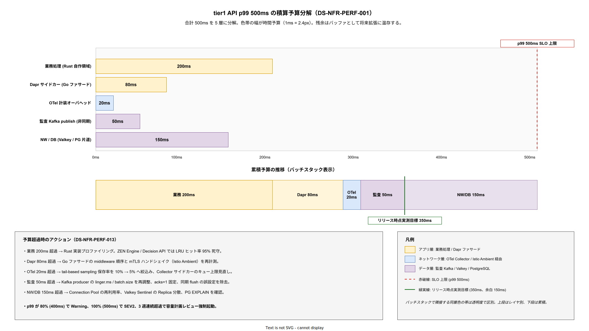

# 02. 性能と拡張性方式設計

本ファイルは要件定義書 [../../03_要件定義/30_非機能要件/B_性能拡張/](../../03_要件定義/30_非機能要件/B_性能拡張/) の NFR-B 系 14 要件を受けて、tier1 公開 API の p99 レイテンシ 500ms 以内、定常 RPS 50〜500、ピーク 3 倍のバーストを処理する方式を確定する。個別 API ごとの目標値、水平スケール方針、キャッシュ戦略、負荷試験計画までを設計する層である。

## 本ファイルの位置付け

要件定義は「tier1 API p99 500ms」「Decision 評価 p99 1ms」といった**数値コミット**を採番した。本ファイルはその数値コミットが「どの構成要素にどれだけ配分されるか」「数値超過時にどのスケール動作が走るか」という**方式**に翻訳する。積算分解を明示しないと、実装フェーズで「tier1 全体は 500ms だから各層は適当に速ければ良い」という設計崩壊が起きる。したがって本章は、500ms という合計値を層ごとの数値に分解し、どの層が遅延予算をどれだけ持つかを確定する。

性能方式は可用性方式と表裏の関係にある。レプリカを増やせば可用性が上がるが同時にリソース競合でレイテンシが悪化する。逆にキャッシュヒット率を上げればレイテンシは下がるがキャッシュ無効化の複雑性で可用性が落ちる。このトレードオフを具体数値で固定するのが本章の役割である。

## p99 500ms の積算分解

tier1 公開 API の p99 500ms を構成要素ごとに分解する。分解は要件定義 NFR-B-001 で確定している積算モデルをそのまま採用する。これは「業務処理 + Dapr ファサード + OTel 計装 + 監査書込 + NW・DB」の 5 層モデルである。

**設計項目 DS-NFR-PERF-001 p99 レイテンシ積算モデル**

- 業務処理（tier1 Rust 自作領域）: 200ms 以内
- Dapr サイドカー経由（Go ファサード）: 80ms 以内
- OTel 計装オーバーヘッド: 20ms 以内
- 監査ログ書込（非同期 Kafka publish）: 50ms 以内
- NW・DB アクセス（Valkey / PostgreSQL 片道）: 150ms 以内
- 合計: 500ms 以内

この積算は余白を含む上限値であり、MVP 期の実測目標は p99 350ms 程度を想定する。余白は将来の機能追加（監査強化・暗号化追加）で予算消費しても SLA を割らないためのバッファとして確保する。OTel 計装は tail-based sampling でトレース保存率を 10% に制限することで p99 貢献を 20ms 以下に抑える。監査書込は Kafka への fire-and-forget（acks=0 ではなく acks=1、ブロッキングはしない）で 50ms 以内に収める。

上図は 500ms の総予算を 5 層に分解したウォーターフォール（上段）と、累積スタック（下段）である。上段では各層を横軸の時間で色帯として描き、1ms あたり 2.4px に正規化した。業務処理と Dapr ファサードをアプリ層（暖色）、OTel 計装をネットワーク層（寒色）、監査と NW/DB をデータ層（薄紫）で配色し、CLAUDE.md の 4 レイヤ記法に従う。この色分けにより、どの層が予算を食っているかが視覚的に判定できる。たとえば MVP 運用中に p99 が 400ms に達した場合、色帯のどれが膨らんでいるかを Grafana で重ね合わせ、対応を該当層の担当（Rust 実装・Go ファサード・OTel・Kafka・DB）に即座に割り当てられる。

下段のスタックには赤破線で SLO 上限 500ms、緑実線で MVP 実測目標 350ms を重ねる。実測目標 350ms は業務処理 + Dapr + OTel + 監査までの累積に相当し、NW/DB 150ms のバッファを温存した状態で運用開始する。バッファを先に使い切ると将来の暗号化追加や監査強化のたびに SLA 再合意が必要になるため、MVP 期は意図的に 150ms の余白を残す設計である。図下部の超過時アクション一覧は DS-NFR-PERF-013 と一対一に対応し、Grafana アラートの通知先ラベルにも同じ層名を使う。

## 個別 API の p99 目標

11 API のうち特に厳しい目標を持つものは Decision（p99 1ms）、State Get（p99 10ms）、PubSub Publish（p99 50ms）、Workflow Start（p99 500ms）である。これらは要件定義 NFR-B-002〜005 で確定しており、積算モデルのサブセットとして以下で方式化する。

**設計項目 DS-NFR-PERF-002 Decision API の方式**

- 目標: p99 1ms（評価のみ、tier1 内で完結）。
- 実装: ZEN Engine（Rust 製）を tier1 自作領域に in-process 組み込み。Dapr 経由せず Rust gRPC で直呼び。
- キャッシュ: JDM ルールは in-process LRU で TTL 30 秒、ヒット率 95% 以上を目標。
- 入出力サイズ上限: 入力 32 KB / 出力 32 KB（超過は 400 エラー）。
- 確定フェーズ: Phase 1b で ZEN Engine 統合、Phase 1c で p99 1ms 達成確認。

**設計項目 DS-NFR-PERF-003 State Get API の方式**

- 目標: p99 10ms（Valkey アクセス）。
- 実装: Dapr State Building Block → Valkey（Sentinel 経由）。tier1 Go ファサードから Dapr サイドカー（同 Pod）経由で Valkey にアクセス。
- キャッシュ階層: Valkey が一次キャッシュ、PostgreSQL が永続ストア二次。Valkey ミス時のみ PG フォールバック（frequent access pattern の場合のみ tier1 で Valkey に再保存）。
- 接続プール: tier1 Pod あたり Valkey 接続 50 本。接続確立は Startup 時に warm up。
- 確定フェーズ: Phase 1a で基本実装、Phase 1b で負荷試験。

**設計項目 DS-NFR-PERF-004 PubSub Publish API の方式**

- 目標: p99 50ms（Publisher から Kafka ブローカ ack まで）。
- 実装: Dapr PubSub Building Block → Kafka。`acks=1`（leader が受領した時点で ack、follower 複製待たない）で p99 50ms を達成。
- `acks=all` 設定は PubSub の Durable モード（監査ログ等）専用とし、通常業務イベントは `acks=1`。
- バッチング: Producer 側 `linger.ms=5`、`batch.size=16384`。
- 確定フェーズ: Phase 1b で Strimzi デプロイ後検証。

**設計項目 DS-NFR-PERF-005 Workflow Start API の方式**

- 目標: p99 500ms（ワークフロー起動登録まで。実行完了ではない）。
- 実装: Phase 1b まで Dapr Workflow、Phase 2 で Temporal へ切替。
- Dapr Workflow: Actor ベース、State は Valkey。起動 = Actor state 書き込み + Reminder 登録の 2 ステップで 500ms 以内。
- Temporal（Phase 2）: Start Workflow Execution は gRPC 1 往復、p99 100ms 以内に改善見込み。
- 確定フェーズ: Phase 1b Dapr、Phase 2 Temporal 移行。

## 定常負荷とピーク負荷の想定

企画書の試算に基づき、規模別 RPS と API 構成比を以下で確定する。要件定義 NFR-B-006 と整合する。

**設計項目 DS-NFR-PERF-006 規模別負荷想定**

- 小規模（1 テナント、同時ユーザ 100 名）: 定常 50 RPS、ピーク 150 RPS（3 倍バースト、典型は始業時 09:00）。
- 中規模（5 テナント、同時ユーザ 500 名）: 定常 150 RPS、ピーク 450 RPS。
- 大規模（20 テナント、同時ユーザ 2000 名）: 定常 500 RPS、ピーク 1500 RPS。
- API 構成比（定常時）: Service Invoke 40% / State Get 25% / State Set 10% / PubSub Publish 15% / Decision 5% / その他 5%。
- バーストパターン: 始業 09:00 / 昼休み明け 13:00 / 退勤前 17:30 に 3 倍ピーク 15 分継続。
- 確定フェーズ: Phase 1b で中規模想定、Phase 2 で大規模対応検証。

## 水平スケール方針

HPA（Horizontal Pod Autoscaler）を主体とし、VPA（Vertical Pod Autoscaler）は HPA と同時使用時のレプリカ振動（リソース要求変更 → Pod 再作成 → HPA が別判断）を避けるため OFF とする。垂直スケールはリリース時の静的調整のみで運用し、稼働中の自動垂直スケールは行わない。

**設計項目 DS-NFR-PERF-007 HPA 設定標準**

- 対象: tier1 全 API Pod（Go ファサード + Rust 自作領域を同一 Deployment とする）。
- 最小レプリカ: 3（可用性要件 DS-NFR-AVL-003 と整合）。
- 最大レプリカ: 10（中規模時）、Phase 2 で大規模時は 20 に拡張。
- トリガー: CPU 70% 平均（主）+ カスタムメトリクス `k1s0_api_requests_per_pod`（副、100 RPS / Pod 超過でスケール）。
- ウォームアップ: 新 Pod Ready 後 30 秒間はトラフィック 50% 割合で段階投入（Istio Ambient の warmup destination rule）。
- クールダウン: スケールダウンは 5 分の安定期間、スケールアップは即時。
- 確定フェーズ: Phase 1b で実装、Phase 1c で負荷試験で係数調整。

**設計項目 DS-NFR-PERF-008 データ層のスケール方針**

- PostgreSQL: 水平スケール不可（Primary 1）。垂直スケールで vCPU / メモリ増強。Phase 2 で読み取り専用 Standby へのクエリ振り分け導入検討。
- Valkey: Sentinel 3 固定。読み取りは Replica 分散（Dapr が対応済み）。
- Kafka: Broker 3 → Phase 2 で 6 に拡張可能。パーティション数を事前に多めに設計（各トピック 12 パーティション）。
- OpenBao: Raft 3 固定。書き込み集中時は Phase 2 で ReadReplica 検討。

**設計項目 DS-NFR-PERF-009 VPA 運用方針**

- 稼働中の自動垂直スケール: OFF。
- VPA Recommender の使用: 観測専用で有効化、週次で tier1 Pod のリソース要求値見直し PR を自動作成（GitOps）。
- この方式により Pod リソース要求値は Git 管理下の静的設定で管理され、GitOps 経路を通して変更される。手動 kubectl edit での変更は Kyverno で拒否する。
- 確定フェーズ: Phase 1b で Recommender 導入。

## キャッシュ戦略

tier1 API 内でのキャッシュは 3 階層を持つ。(1) Pod 内 in-process LRU キャッシュ（Decision JDM ルール用）、(2) Valkey 分散キャッシュ（State Store として Dapr 経由、tier1 共通）、(3) PostgreSQL 永続ストア（二次）。

**設計項目 DS-NFR-PERF-010 3 階層キャッシュ方針**

- L1 (in-process LRU): Decision ルール JDM、Feature Flag 評価、Keycloak OIDC 公開鍵キャッシュ。TTL 30 秒、最大エントリ 1000。
- L2 (Valkey): Session、認可 Subject 情報、State API の任意データ。TTL はユースケース依存、既定 300 秒。
- L3 (PostgreSQL): 永続化対象（監査ログ別 DB、業務マスタ）。
- 無効化戦略: L1 は TTL のみ（Pub/Sub 無効化を避け単純化）、L2 は Dapr の Delete 操作 + 明示 TTL。
- ヒット率監視: 各階層のヒット率を Prometheus メトリクス化、L1 は 95% / L2 は 80% を目標。
- 確定フェーズ: Phase 1b で 3 階層確立。

**設計項目 DS-NFR-PERF-011 Cache Stampede 対策**

- L2 Valkey のキー同時ミス集中を避けるため、key 単位の lock（Dapr Distributed Lock Building Block 未使用のため tier1 内で Redis SET NX 実装）。
- lock 取得失敗時は最大 100ms 待機して再試行、2 回失敗で PG フォールバック。
- 確定フェーズ: Phase 1c で性能試験時に実装必要性を判定、Phase 2 で本格実装。

## 負荷試験計画

性能要件の合格判定は実測で行う。負荷試験は k6（Grafana Labs 製、Go 製 OSS）を採用し、CI/CD の一環として週次・月次・四半期で実施する。

**設計項目 DS-NFR-PERF-012 負荷試験サイクル**

- 週次定点試験: 定常 150 RPS を 10 分間印加、p99 が目標の 90%（450ms）を超過したら Slack 通知。CI/CD パイプラインから夜間自動実行。
- 月次フル試験: 定常 150 RPS を 1 時間、ピーク 450 RPS を 15 分印加。p99 / エラー率 / リソース使用率を記録。
- 四半期容量試験: 大規模想定 500 RPS を 1 時間、1500 RPS を 15 分印加、Phase 2 以降実施。
- 試験環境: 本番同等構成の専用環境（3 ノード k8s）を Argo CD で動的デプロイ。
- 試験結果: Grafana ダッシュボード `k1s0-perf-trend` で週次・月次推移を可視化。
- 確定フェーズ: Phase 1b で週次・月次導入、Phase 2 で四半期導入。

**設計項目 DS-NFR-PERF-013 性能劣化時のアクション**

- p99 が目標の 80%（400ms）超過: Warning アラート、SRE がレビュー。
- p99 が目標の 100%（500ms）超過: SEV2 アラート、関連リリースのロールバック候補化。
- 3 回連続週次で閾値超過: 容量計画レビューを強制起動、[06_キャパシティ計画.md](06_キャパシティ計画.md) の閾値見直し。
- 確定フェーズ: Phase 1b 実装。

## 拡張性の長期方針

MVP 期（Phase 1a〜1c）は中規模想定（150 RPS 定常）で設計し、大規模化（500 RPS 以上）は Phase 2 以降で対応する。この段階的拡張方針は企画の Phase 区切りと整合しており、初期投資を抑えつつ成長余地を確保する。

**設計項目 DS-NFR-PERF-014 Phase 別性能容量**

- Phase 1a: VM 1 台、単一 Pod 評価のみ、50 RPS 上限。
- Phase 1b: VM 3 台、tier1 HPA min 3 max 10、中規模 150 RPS 定常 / 450 RPS ピーク。
- Phase 1c: 同上構成で 6 ヶ月運用、SLO 達成度評価後に Phase 2 設計開始。
- Phase 2: worker 専用ノード 3 台追加（計 6 台）、HPA max 20、大規模 500 RPS 定常 / 1500 RPS ピーク対応。
- Phase 3: マルチ DC、2000+ RPS 対応（構想のみ、詳細は Phase 2 完了後に再検討）。

## 業務時間帯トラフィック分布とワークロード整合

要件定義 NFR-B-WL-002 は「業務時間帯（平日 8:00〜20:00 JST）にトラフィックの 95% が集中、深夜・週末 5% 以下」と採番している。性能試験とキャパシティ計画が「1 日平均 RPS」で設計されると、実際のピーク 12 時間ウィンドウでの消費を読み誤る。本節では業務時間帯を前提にスケール判断と計画停止窓を設計する。

**設計項目 DS-NFR-PERF-015 業務時間帯を前提とした HPA スケール係数**

- 業務時間帯（平日 08:00〜20:00）: HPA の `--horizontal-pod-autoscaler-downscale-stabilization=300s`（5 分）を維持、急なスケールダウンを抑制し突発再上昇に備える。
- 業務時間外（夜間 22:00〜06:00）: `downscale-stabilization=60s` に短縮、余剰 Pod の早期返却でリソース効率化。time-window-based で Cronjob から HPA アノテーションを上書き。
- 週末: 平日の 30% 上限でキャップ、HPA max を平日値の 30% に限定して過剰確保を防ぐ。
- 計画停止窓: 深夜 02:00〜06:00 のみ許可、業務時間帯は ChangeManagement 承認なしでは禁止。
- バッチ処理との共存: [../30_共通機能方式設計/](../30_共通機能方式設計/) のバッチ Job は cron で 02:00〜06:00 に限定、業務時間帯への重畳を禁止。
- 確定フェーズ: Phase 1b で時間帯別スケール実装、Phase 1c で係数調整。

## リソース拡張性の補強設計

要件定義 NFR-B-RES-001〜003 は「tier1 API 水平拡張」「データ層の垂直・水平拡張」「Workflow 並列実行の水平拡張」を個別要件として採番している。DS-NFR-PERF-007 / 008 で基本は設計済みだが、「5 倍負荷スパイクでの自動拡縮動作」「Read Replica 振り分け」「KEDA による Consumer Lag 連動」という個別方式が未確定のため、本節で補強する。

**設計項目 DS-NFR-PERF-016 tier1 API の 5 倍負荷スパイク対応**

要件定義 NFR-B-RES-001 は「負荷スパイク試験（定常の 5 倍）で自動拡縮の動作確認」を受け入れ基準とする。HPA の既定動作は CPU 70% 超過検知後 15 秒評価 + Pod 起動 30 秒で合計 45 秒かかるため、5 倍スパイクでは 45 秒間の p99 悪化を許容せざるを得ない。この間のリクエストを損失させないため、Envoy Gateway 側のキューイング + KEDA の Prometheus メトリクス連動を組み合わせる。

- KEDA scaler: Prometheus `k1s0_api_requests_per_second` をソースに、100 RPS/Pod で スケールアウト、30 RPS/Pod でスケールイン。HPA より早く反応。
- Envoy Gateway キューイング: `max_pending_requests=1000` でバーストを一時キュー化、Pod 追加投入まで 5xx エラーを防ぐ。
- ウォームアップ: Istio Ambient の warmupDurationSecs=30 で新 Pod への段階投入、コールドスタート時のエラーを抑止。
- 5 倍試験: Phase 1c で定常 150 RPS → 750 RPS への瞬間上昇を k6 で再現、p99 が 500ms × 1.5 倍（750ms）以内に収まることを確認。
- 確定フェーズ: Phase 1b で KEDA、Phase 1c で 5 倍試験。

**設計項目 DS-NFR-PERF-017 データ層拡張ポリシーの明文化**

要件定義 NFR-B-RES-002 は Valkey / PostgreSQL / MinIO それぞれの拡張手順を Runbook 化することを求める。拡張判断の閾値と手順が曖昧だと、SRE が「増やすか増やさないか」で 数時間の議論を費やし、その間にボトルネックが進行する。本項では各バックエンドの拡張トリガと Runbook を確定する。

- Valkey: メモリ使用率 70% 超で垂直スケール（Pod resource limit 引上げ）、4 時間以内に Runbook-CAP-001 で対応。Phase 3 で Cluster モード水平化を判定。
- PostgreSQL: CPU 70% 超で垂直スケール、読み取り主体ワークロードは Standby への振り分けで水平化（Dapr の State コンポーネント設定で `read_preference=standby`）。
- MinIO: 容量 70% 超でノード追加（EC 3+2 → 4+2）、データ再バランスは MinIO mc admin rebalance で実施。
- 増設後の監視: Grafana `k1s0-capacity-trend` で 30 日トレンドを提示、SRE が月次でキャパシティレビュー。
- 確定フェーズ: Phase 1b で Runbook-CAP-001〜003 整備、Phase 1c で演習。

**設計項目 DS-NFR-PERF-018 Workflow 並列実行の KEDA 連動拡張**

要件定義 NFR-B-RES-003 は「Workflow 並列実行を HPA + Kafka Consumer Lag ベースで水平拡張」を要求する。HPA 単体では CPU ベースでしか判断できず、Consumer Lag が膨らんでも CPU が低い場合（IO バウンド）にスケールしない不具合が発生する。KEDA で Kafka Lag を主メトリクスに昇格させる。

- KEDA scaler: `kafka.lagThreshold=100`（パーティション毎 100 メッセージ遅延で +1 Pod）。
- 対象 Worker: Dapr Workflow Worker（Phase 1b）、Temporal Worker（Phase 2）。
- スケール上限: min 3 / max 20（Phase 1b）、Phase 2 で max 50 に拡張。
- 可視化: Grafana `k1s0-workflow-lag` で全トピックの Lag をリアルタイム表示、Lag 累積率が 1 時間で 100% 増なら SEV2。
- 確定フェーズ: Phase 1b で KEDA 導入、Phase 1c で Lag 連動検証。

## 性能品質保証の追加方式

要件定義 NFR-B-QA-001 は「Phase 1b の性能試験」、NFR-B-QA-002 は「定期性能退行検知」を採番する。DS-NFR-PERF-012 / 013 で試験サイクルは設計済みだが、「基準値の合意プロセス」と「10% 退行検知の自動 PR ブロック」の方式が未確定のため、本節で補強する。

**設計項目 DS-NFR-PERF-019 Phase 1b 性能試験の KPI 検収基準**

要件定義 NFR-B-QA-001 は「Phase 1b 性能試験を MVP-1a/1b の KPI 検収に組み込む」を要求する。曖昧な「試験を実施した」ではなく、検収可否の判定値と査読可能な成果物を確定する。

- 試験ツール: k6（標準テンプレートを [50_開発者体験/](../../03_要件定義/50_開発者体験/) のゴールデンパスに配置）。
- 合格基準: 中規模 150 RPS 定常負荷で p99 < 500ms を 1 週間連続維持、p99 / 層別 p99（DS-NFR-PERF-001 の積算）・エラー率 < 0.1%・CPU < 70%・メモリ < 70%。
- 成果物: k6 結果 JSON / Grafana スクリーンショット / Backstage 試験結果エントリ / ADR-PERF-001（Phase 1b 性能試験結果）。
- 不合格時: MVP-1b 検収をブロック、層別再配分 ADR を新規発行。
- 確定フェーズ: Phase 1b 実施、検収は Product Council 承認。

**設計項目 DS-NFR-PERF-020 CI ベンチマークでの 10% 退行検知**

要件定義 NFR-B-QA-002 は「CI に軽量ベンチマーク、基準値から 10% 以上の退行で PR ブロック」を要求する。基準値の確定手順と退行検出の自動化手順、例外解除フローを設計する。

- ベンチマーク対象: tier1 公開 11 API のうち Decision / State Get / PubSub Publish の 3 API。他は月次負荷試験で代替。
- 基準値: Phase 1b 性能試験結果の p99 値を初期基準、3 ヶ月ローリングの p99 を更新基準。
- 実行: GitHub Actions で PR 毎に 10 分実行、k6 smoke test レベル（50 RPS × 2 分）。
- 判定: 対象 API の p99 が基準値の 110% を超える場合 PR ブロック、Slack 通知。
- 例外解除: Product Council 承認コメント + ADR 追加で基準値を更新し PR 承認可。
- 確定フェーズ: Phase 1c で CI 組込、Phase 2 で対象 API 拡張。

## 対応要件一覧

本ファイルは要件定義書の以下要件 ID に対応する。

本節は採番範囲 DS-NFR-PERF-001 〜 DS-NFR-PERF-020 をカバーする。

- NFR-B-001 tier1 API p99 500ms → DS-NFR-PERF-001
- NFR-B-002 Decision p99 1ms → DS-NFR-PERF-002
- NFR-B-003 State Get p99 10ms → DS-NFR-PERF-003
- NFR-B-004 PubSub Publish p99 50ms → DS-NFR-PERF-004
- NFR-B-005 Workflow Start p99 500ms → DS-NFR-PERF-005
- NFR-B-006 規模別 RPS → DS-NFR-PERF-006
- NFR-B-007 水平スケール方針 → DS-NFR-PERF-007
- NFR-B-008 データ層スケール → DS-NFR-PERF-008
- NFR-B-009 VPA 運用方針 → DS-NFR-PERF-009
- NFR-B-010 キャッシュ階層 → DS-NFR-PERF-010
- NFR-B-011 Cache Stampede → DS-NFR-PERF-011
- NFR-B-012 負荷試験サイクル → DS-NFR-PERF-012
- NFR-B-013 性能劣化アクション → DS-NFR-PERF-013
- NFR-B-014 Phase 別容量 → DS-NFR-PERF-014
- NFR-B-WL-002 業務時間帯トラフィック分布 → DS-NFR-PERF-015
- NFR-B-RES-001 tier1 API 水平拡張 → DS-NFR-PERF-016 / DS-NFR-PERF-007
- NFR-B-RES-002 データ層垂直・水平拡張 → DS-NFR-PERF-017 / DS-NFR-PERF-008
- NFR-B-RES-003 Workflow 並列水平拡張 → DS-NFR-PERF-018
- NFR-B-QA-001 Phase 1b 性能試験 → DS-NFR-PERF-019 / DS-NFR-PERF-012
- NFR-B-QA-002 定期性能退行検知 → DS-NFR-PERF-020 / DS-NFR-PERF-013

逆引きは [../80_トレーサビリティ/02_要件から設計へのマトリクス.md](../80_トレーサビリティ/02_要件から設計へのマトリクス.md) を参照する。
