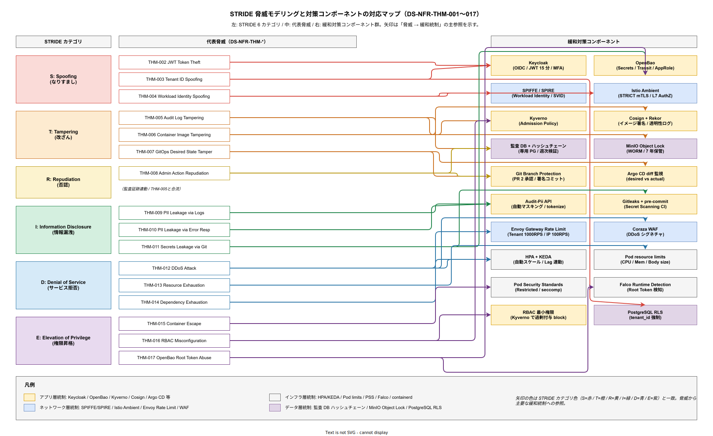

# 10. 脅威モデリング方式設計

本ファイルは要件定義書の脅威モデリング関連要件を受けて、STRIDE 分類に沿って tier1 公開 11 API を評価し、主要脅威と緩和策のマッピングを確定する。[05_セキュリティ方式設計.md](05_セキュリティ方式設計.md) が「何で守るか（統制）」を書くのに対し、本章は「何から守るか（脅威）」を書く。両者の組み合わせで脅威 → 統制の対応関係が完結する。

## 本ファイルの位置付け

統制だけ並べても、それが何の脅威に対する対策かを明示しないと、設計・運用で重要度判断を誤る。「mTLS を入れているから安全」ではなく「中間者攻撃（Tampering）に対して mTLS が有効」という脅威ベース思考で設計の妥当性を検証する。本章は脅威を STRIDE で網羅し、各脅威に対して統制を 1 対多でマップする。

脅威モデルは本段階で固定化せず、四半期ごとに更新する。新しい攻撃手法、段階進行による範囲拡大、過去のインシデントからの学習で脅威リストを継続進化させる。

## STRIDE 分類

Microsoft が提唱する STRIDE は、脅威を 6 つに分類する。(S) Spoofing なりすまし、(T) Tampering 改ざん、(R) Repudiation 否認、(I) Information disclosure 情報漏洩、(D) Denial of service サービス拒否、(E) Elevation of privilege 権限昇格、の 6 分類である。各分類には対応する基本統制が存在する（認証 / 完整性 / 監査 / 暗号化 / 可用性 / 認可）。

**設計項目 DS-NFR-THM-001 STRIDE 分類と基本統制の対応**

業界では脅威モデリングを導入せず「セキュリティ製品を買ったから安全」という統制中心の思考に陥り、未想定脅威に対する対応漏れで大規模インシデントを招く例が後を絶たない。本設計では Microsoft 提唱の STRIDE 6 分類（S/T/R/I/D/E）を基本統制（Keycloak / mTLS / 監査ログ / 暗号化 / HPA / Kyverno）に 1 対多でマップし、四半期ごとに脅威リストを更新する。崩れた場合は未想定脅威による 1 インシデントあたり平均 1〜3 億円の損害（IBM 2023 年調査）+ 個人情報保護法 + J-SOX の二重指摘で、経営層の説明責任が発動する。

- Spoofing → 認証（Keycloak OIDC / SPIFFE）。
- Tampering → 完整性（mTLS / ハッシュチェーン / Cosign 署名）。
- Repudiation → 監査（監査ログ / WORM アーカイブ）。
- Information disclosure → 暗号化・認可（at-rest/in-transit 暗号 / RBAC / PII マスキング）。
- Denial of service → 可用性（Rate Limit / HPA / PDB / DR）。
- Elevation of privilege → 認可（最小権限 / Kyverno / Pod Security Standards）。

本章の以降では、各 STRIDE カテゴリごとに tier1 の主要脅威を具体化し、緩和策をマップする。

上図は STRIDE 6 カテゴリ（S/T/R/I/D/E）、代表脅威（DS-NFR-THM-002〜017 の 16 項目）、緩和対策コンポーネント群の 3 列を 1 枚にマップしたものである。左列の STRIDE カテゴリには各分類の色（S=赤・T=橙・R=黄・I=緑・D=青・E=紫）を与え、それぞれの脅威ボックスと矢印にも同色を伝搬させた。これにより、脅威モデルレビュー会議で「この統制は何の脅威に対するものか」を逆引きする際、色の一致で即座に所属カテゴリを判定できる。従来の表形式では STRIDE と統制の関連が文字列での照合になり、四半期レビュー（DS-NFR-THM-018）のたびに突合作業で時間を浪費していたが、本マップで色と矢印に視覚的負荷を委譲することで関係構造の把握コストを抑える。

右列の緩和対策コンポーネントは CLAUDE.md の 4 レイヤ記法に従って配色した。Keycloak / OpenBao / Kyverno / Cosign+Rekor / Argo CD などアプリから明示的に呼び出す統制は暖色、SPIFFE/SPIRE / Istio Ambient / Envoy Rate Limit / Coraza WAF など Pod から透過的に効くネットワーク統制は寒色、HPA/KEDA / Pod limits / Pod Security Standards / Falco などインフラ層で強制する統制は中性灰、監査 DB ハッシュチェーン / MinIO Object Lock / PostgreSQL RLS などデータ層で永続的に守る統制は薄紫とする。この色分けにより、「新規統制を入れる際、どの層で効かせるか」という設計議論がレイヤ境界を跨がずに整理される。

脅威から統制への矢印は 1 対多が基本である。たとえば THM-002 JWT Token Theft は Keycloak の短命トークン + OIDC で第一線を張り、THM-003 Tenant ID Spoofing は Keycloak（tenant_id を JWT claim に閉じ込める）と PostgreSQL RLS（WHERE 句強制）で二重防御する。THM-005 Audit Log Tampering はハッシュチェーンで改ざん検知し、転送後は MinIO Object Lock の WORM で物理的に書き換え不能にする。逆向きの「統制 → 脅威」索引として使う場合も色の同一性で再逆引きできるため、NFR-E-RSK/NFR-E-SIR 系の相互参照（本章末尾）でも同じ図を引用する想定である。残存リスクは図の対象外だが、各 DS-NFR-THM 項の散文で明示されている。

## Spoofing（なりすまし）

**設計項目 DS-NFR-THM-002 JWT Token Theft**

業界では JWT トークン有効期限を 24 時間に設定している企業が多く、一度盗まれると攻撃者が丸一日テナントデータを引き抜く被害事例が Verizon DBIR で年間数千件報告されている。本設計では短命トークン 15 分 + Refresh Token ローテーション + 同一トークン別 IP 検知で被害時間を 1/96 に限定し、PII / 重要業務は MFA 追加要求する（DS-NFR-SEC-007 連動）。崩れた場合は攻撃者が 15 分以内の横展開で PII 数万件を流出させ、個人情報保護法 72 時間報告義務 + 平均損害賠償 1 件数千万円の集団訴訟リスクに直結する。

- 脅威: 攻撃者が正規ユーザの JWT アクセストークンを盗み、tier1 API にアクセスする。
- 攻撃経路: (1) クライアント端末のマルウェア、(2) 中間者攻撃、(3) ログ出力から漏洩。
- 影響範囲: 当該ユーザの権限で API アクセス可能、被害は 15 分（トークン有効期限）に限定。
- 緩和策:
  - 短命トークン 15 分（DS-NFR-SEC-007）で被害時間を限定。
  - Refresh Token ローテーション（使用のたびに新発行）で盗難時の継続使用を検知。
  - クライアント IP / UA の異常検知（同一トークンが別 IP から使用された場合 SEV2）。
  - PII / 重要業務は MFA 追加要求。
- 残存リスク: 15 分以内に行われる横展開攻撃は完全防止困難。監査ログから追跡可能。

**設計項目 DS-NFR-THM-003 Tenant ID Spoofing**

業界のマルチテナント SaaS で tenant_id をリクエストパラメータから取得する設計がテナント境界突破の主要原因となっており、OWASP API Security Top 10 2023 でも BOLA（Broken Object Level Authorization）として 1 位に挙がる脅威である。本設計では tenant_id を JWT claim に閉じ込めてリクエストパラメータ取得を禁止し、tier1 で `JWT.tenant_id != request.tenant_id` の場合 403 + PostgreSQL Row Level Security の WHERE 句強制で二重防御する。崩れた場合は全テナント PII 一括漏洩という最悪シナリオで、個人情報保護法 + GDPR 最大罰金 + テナント全数との契約解除 + 事業継続困難という三重崩壊につながる。

- 脅威: 攻撃者がリクエストの `tenant_id` を書き換え、他テナントのデータにアクセスする。
- 攻撃経路: API リクエストの tenant_id パラメータ改ざん、Header 差し替え。
- 影響範囲: テナント境界の突破、多テナント前提設計の破綻。
- 緩和策:
  - tenant_id は JWT claim に格納、リクエストパラメータからは取得しない。
  - tier1 で `JWT.tenant_id != request.tenant_id` の場合 403。
  - データ層クエリは全て tenant_id を WHERE 句強制、Row Level Security（PostgreSQL RLS）で二重に防御。
- 残存リスク: JWT 発行元 Keycloak 自体の侵害。Keycloak 自体の堅牢化で対応。

**設計項目 DS-NFR-THM-004 Workload Identity Spoofing**

業界では Pod 間認証に固定 API キーを使う設計が多く、キー漏洩時に攻撃者が偽装 Pod からデータ層にアクセスする横展開被害が報告される。本設計では Istio Ambient STRICT mTLS で非 SVID 通信を拒否 + SPIRE Workload Attestor で Pod の namespace / serviceaccount / image hash を検証 + Kyverno で Cosign 署名済みイメージのみ起動許可する三層防御を構築する。崩れた場合はクラスタ内の攻撃者が全データ層を舐める横展開被害で、個人情報保護法上の安全管理措置違反 + J-SOX 統制違反 + GDPR 売上 4% 罰金を同時に負う。

- 脅威: 攻撃者が偽装 Pod を起動し、SPIFFE SVID の代わりに自己署名証明書で tier1 データ層にアクセス。
- 緩和策:
  - Istio Ambient の STRICT mTLS モードで非 SVID 通信を拒否。
  - SPIRE の Workload Attestor が Pod の namespace / serviceaccount / image hash を検証、未登録 Pod には SVID 発行しない。
  - Kyverno で Cosign 署名済みイメージのみ起動許可。
- 残存リスク: SPIRE Server 自体の侵害。SPIRE Server は別 namespace + 最小権限で保護。

## Tampering（改ざん）

**設計項目 DS-NFR-THM-005 Audit Log Tampering**

業界では監査ログを単純 append-only ファイルで保管する設計が多く、内部犯行者が事後に証跡を改ざん / 削除する事例が年数件発覚する。本設計では監査ログハッシュチェーン（DS-NFR-COMP-005）で改ざん検知 + 監査 DB 分離 + 日次 WORM バケット（MinIO Object Lock）転送で構造的に書き換え不能化する。崩れた場合は J-SOX 監査ログ完整性「有効でない」判定 + 金商法 193 条の 3 違反 + 内部不正の事後追跡不能で損害賠償訴訟に敗訴するダブルリスクに直面する。残存リスクの 24 時間窓は 採用後の運用拡大時 で 1 時間に短縮する。

- 脅威: 攻撃者が自分の不正行為の痕跡を隠すため監査ログを改ざんまたは削除する。
- 緩和策:
  - 監査ログ ハッシュチェーン（DS-NFR-COMP-005）で改ざん検知、週次検証。
  - 監査 DB は業務 DB と分離、専用認証で書き込み専用アカウント以外は接続不可。
  - 日次で WORM バケット（MinIO Object Lock）に転送、転送後は書き換え不可。
  - 転送前の監査 DB への攻撃は ハッシュチェーンで検知、転送後への攻撃は Object Lock で防止。
- 残存リスク: 転送直前の最大 24 時間分の監査ログ。この窓を 採用後の運用拡大時 で 1 時間に短縮検討。

**設計項目 DS-NFR-THM-006 Container Image Tampering**

業界ではサプライチェーン攻撃（SolarWinds / 3CX 型）が年々増加し、Gartner 予測では 2025 年までに全企業の 45% が少なくとも 1 度は被害を受けるとされる。本設計では Cosign イメージ署名 + Kyverno で未署名イメージの起動拒否 + Rekor 透明性ログで署名履歴を改ざん不可化 + CI/CD の OIDC 経由署名（個人鍵不使用）で構造的に防御する。崩れた場合は悪意コードが本番で実行され全テナント PII が流出、SolarWinds 事例の平均損害 1 社あたり 1,200 万ドル相当 + Cosign 署名検証回避による SLSA Level 降格で J-SOX + 個人情報保護法の二重指摘を受ける。

- 脅威: Harbor にアップロードされたイメージが改ざんされ、悪意のあるコードが本番で実行される。
- 緩和策:
  - Cosign イメージ署名（DS-NFR-SEC-010）、Kyverno で未署名イメージの起動を拒否。
  - Rekor 透明性ログで署名の履歴を改ざん不可に記録。
  - 全イメージは CI/CD（GitHub Actions）の OIDC 経由で署名、個人鍵を使わない。
- 残存リスク: CI/CD 自体の侵害。GitHub Actions の secrets 管理と branch protection で対応。

**設計項目 DS-NFR-THM-007 GitOps Desired State Tampering**

業界では main ブランチ保護の不備で直接 push を許容しており、Argo CD 経由の本番流入を防げない構造的弱点が GitOps 採用企業で多発している。本設計では force-push 禁止 + PR 必須 + 2 承認 + CI パス + 承認者 MFA + コミット署名必須 + Argo CD の desired state と actual state の常時 diff 監視で多層防御する。崩れた場合は悪意コード本番流入で全テナント影響 + J-SOX 変更統制「有効でない」判定 + 会社法 435 条違反 + 監査法人意見不表明で上場維持に影響するという経営レベルの危機に直結する。

- 脅威: 攻撃者が Git リポジトリに不正変更をプッシュし、Argo CD 経由で本番に反映させる。
- 緩和策:
  - main ブランチ保護: force-push 禁止、PR 必須、2 承認必須、CI パス必須。
  - PR 承認者の MFA 必須。
  - コミット署名必須（GitHub で verified only 強制）。
  - Argo CD desired state と actual state の diff を常時監視、想定外変更で SEV2。
- 残存リスク: 複数名以上の承認者が結託するケース。SoD + 監査ログでの事後検知で対応。

## Repudiation（否認）

**設計項目 DS-NFR-THM-008 Administrator Action Repudiation**

業界では管理者操作の証跡を Slack メモや個人メールに頼り、後の監査で「誰がやったか分からない」事態が J-SOX 監査の定番指摘となっている。本設計では全操作を GitOps 経由で Git コミット履歴化 + コミット署名 + 緊急 Runbook 実行も Slack 通知で並行証跡 + Kubernetes Audit Log で kubectl 操作記録 + ハッシュチェーン + WORM で事後改ざん不可化する。崩れた場合は J-SOX 運用統制「有効でない」判定 + 内部不正の責任特定不能で損害賠償回収困難 + 金商法 193 条の 3 違反で、複合的な法令対応コストが発生する。

- 脅威: SRE / SecOps が自分の実施した操作を後から否認する（誤操作や不正行為の責任回避）。
- 緩和策:
  - 全操作が GitOps 経由で Git コミット履歴化、コミット署名で個人特定。
  - 緊急時の Runbook 実行も実行者・時刻を記録、Slack 通知で並行証跡。
  - Kubernetes Audit Log で kubectl 操作も記録。
  - ハッシュチェーン + WORM で事後改ざん不可。
- 残存リスク: 代理操作の責任境界。ペア作業原則と署名で最小化。

## Information Disclosure（情報漏洩）

**設計項目 DS-NFR-THM-009 PII Leakage via Logs**

業界ではアプリログへの PII 混入が漏えい事故の主要原因の 1 つであり、IPA「情報セキュリティ 10 大脅威」でも内部不正由来の漏えいが毎年 5 位以内に入る。本設計では Audit-Pii API の自動マスキング（DS-NFR-PRV-003）で出力前にマスク + ログ構造化 JSON で PII フィールド自動検出 + マスキング + Loki RBAC 制限で SecOps のみ検索可能と三段で防御する。崩れた場合は Loki ログからの PII 流出で個人情報保護法 2022 改正の 72 時間速報義務発動 + GDPR 72 時間通知義務 + テナント契約上の損害賠償（平均数千万円）が同時発動する。

- 脅威: tier1 のアプリケーションログに PII が誤って出力され、Loki から漏洩する。
- 緩和策:
  - Audit-Pii API の自動マスキング（DS-NFR-PRV-003）で出力前にマスク。
  - ログフィールドの構造化（JSON）+ PII フィールドの自動検出 + マスキング。
  - Loki アクセスは RBAC で限定、PII を含むログの検索は SecOps のみ。
- 残存リスク: エラーメッセージ内の PII（例外スタックトレース）。全エラーメッセージをサニタイザ通過で対応。

**設計項目 DS-NFR-THM-010 PII Leakage via Error Response**

業界ではスタックトレース + SQL クエリ文字列 + DB 内容をそのままレスポンスで返す実装が多く、OWASP API Security Top 10 でも情報漏洩項目として毎年警告される。本設計では全エラーレスポンスを `{code, message, request_id}` 形式に標準化 + 内部詳細は非返却 + SRE が request_id で内部参照 + Kyverno で stdout/stderr の PII 漏洩検知（静的検査 + ランタイム）で構造的に抑制する。崩れた場合は攻撃者の情報収集により本格攻撃へのステップとなり、個人情報保護法違反 + テナント離反 + ブランド毀損で間接損害が年 3,280 万円削減効果を大きく相殺する。

- 脅威: tier1 API が想定外のエラー時に詳細情報（DB 内容・スタックトレース）を含むエラーレスポンスを返し、攻撃者が情報収集する。
- 緩和策:
  - 全エラーレスポンスを tier1 で標準化、`{code, message, request_id}` 形式のみ返却、内部詳細は返さない。
  - エラーログは内部監視に残し、外部には request_id のみ提示、SRE が request_id で内部情報参照。
  - Kyverno で stdout/stderr への PII 漏洩検知（CI 時静的検査 + ランタイム抽出）。
- 残存リスク: 新規実装箇所でのガード漏れ。ゴールデンパスとコードレビュー必須化で対応。

**設計項目 DS-NFR-THM-011 Secrets Leakage via Git**

GitHub 上でのシークレット誤コミットは業界全体で年間 1,000 万件超（GitGuardian 2023 調査）発生し、攻撃者がスキャナで数分以内に検出・悪用する環境にある。本設計では Gitleaks 等の secret scanning を CI で自動実行 + PR block + pre-commit hook で push 前検出 + GitHub Secret Scanning で過去 push 検出 + OpenBao 集約によるローテーション容易化で多層防御する。崩れた場合はクラウドリソース悪用（請求爆弾）+ DB パスワード流出による全データ漏洩 + 個人情報保護法違反 + 72 時間報告義務発動で、1 事故あたり数千万〜数億円の損害につながる。

- 脅威: 開発者がシークレット（DB パスワード、API キー）を誤って Git にコミットする。
- 緩和策:
  - Gitleaks 等の secret scanning が CI で自動実行、検知で PR block。
  - pre-commit hook で push 前に検出。
  - GitHub Secret Scanning（github.com 上）で過去 push の検出も。
  - 検知時は該当シークレットの即時ローテーション（OpenBao に集約済みのためローテーション容易）。
- 残存リスク: 過去にコミットされた既存リポジトリ。初期スキャンで一斉検出、対応済み。

## Denial of Service（サービス拒否）

**設計項目 DS-NFR-THM-012 DDoS Attack**

業界では Cloudflare 2023 DDoS Report によればアプリケーション層 DDoS は前年比 65% 増であり、Rate Limit が未設定の API は数分で飽和する脅威環境にある。本設計では Envoy Gateway の Rate Limit（テナント 1000 RPS / IP 100 RPS）+ Coraza WAF で異常パターン block + HPA で最大 10 Pod 自動スケール + 採用初期は 採用側組織の社内 LAN 経由のみでインターネット直結回避する多層防御を採る。崩れた場合は SLA 99% 違反（月 7.2 時間以上の停止）+ 月次 SLO 未達の SLA 賠償条項発動 + テナント契約解除で年 3,280 万円削減効果が崩壊する。

- 脅威: 外部からの大量リクエストで Envoy Gateway や tier1 Pod を飽和させる。
- 緩和策:
  - Envoy Gateway の Rate Limit: テナントあたり 1000 RPS、IP あたり 100 RPS。
  - WAF（Coraza）で異常リクエストパターン（DDoS 用シグネチャ）を block。
  - HPA で tier1 Pod を最大 10 まで自動スケール（中規模）、ピーク吸収。
  - 外部公開 API はインターネット直結を避け、採用側組織の社内 LAN 経由のみ（採用初期）。
- 残存リスク: 大規模 L3/L4 DDoS は上位 NW で対応（採用側組織の既存 WAN の DDoS 対策サービスに依存）。

**設計項目 DS-NFR-THM-013 Resource Exhaustion（Pod 内）**

業界ではリクエストボディサイズ無制限 + タイムアウトなしの API 実装が散見され、攻撃者が数 MB のペイロードや無限ループ誘発で Pod を枯渇させる事例が報告される。本設計ではリクエストボディ 1MB 上限（超過は 413）+ 各 API 30 秒タイムアウト（超過は 504）+ Pod resource limit + Decision API 入力 32KB 上限 + ZEN Engine 実行 100ms タイムアウト（Decision p99 1ms 目標と整合）で多重制限する。崩れた場合は Pod 全枯渇で tier1 全停止 + SLA 99% 違反 + 他テナントへの影響で集団訴訟リスクが発生する。

- 脅威: 攻撃者が大きなリクエストボディや無限ループを誘発し、tier1 Pod のリソースを枯渇させる。
- 緩和策:
  - リクエストボディサイズ上限 1 MB、超過は 413。
  - タイムアウト設定: 各 API に 30 秒上限、超過は 504。
  - Pod resource limit で 1 Pod が他 Pod の CPU/メモリを奪わない。
  - Decision API の入力サイズは 32 KB 上限、ZEN Engine の実行時間も 100ms タイムアウト。
- 残存リスク: 正規ユーザの操作ミスでの DoS。Synthetic で検知、SRE 対応。

**設計項目 DS-NFR-THM-014 Dependency Exhaustion**

データ層（PostgreSQL / Kafka / Valkey）は tier1 Pod よりスケール困難であり、業界ではデータ層飽和で全サービス停止に至るカスケード障害が報告される。本設計では tier1 Connection Pool で下流アクセス数を制限 + Saga / Retry パターンでバックプレッシャ伝播 + Valkey / Kafka の max connections 設定で下流側でも過剰保護する（40_制御方式設計と連携）。崩れた場合はデータ層飽和によるカスケード障害で tier1 全停止 + 復旧に数時間を要して SLA 99% 違反 + テナント契約上の賠償条項発動で、1 回の障害で年間 SLO クレジット予算を食い潰す。

- 脅威: tier1 が依存する OSS（Valkey / PostgreSQL / Kafka）への大量リクエストで、データ層を飽和させる。
- 緩和策:
  - tier1 の Connection Pool で下流アクセス数を制限。
  - Saga / Retry パターンでバックプレッシャ伝播（[../40_制御方式設計/](../40_制御方式設計/) 参照）。
  - Valkey / Kafka の max connections 設定で下流側でも過剰保護。
- 残存リスク: バースト的な正規トラフィックでも発生しうる。容量計画で事前予測。

## Elevation of Privilege（権限昇格）

**設計項目 DS-NFR-THM-015 Container Escape**

業界では Dirty Pipe / runc CVE-2024-21626 等のコンテナエスケープ脆弱性が年 1〜2 件発見され、未対応ノードでは攻撃者が root 権限を奪取する事例が報告される。本設計では Pod Security Standards Restricted で runAsNonRoot / readOnlyRootFilesystem 強制 + seccomp / AppArmor プロファイル（リリース時点 標準化）+ containerd + runc の Renovate 自動更新で構造的に防ぐ。崩れた場合はホストノード乗っ取りから全 Pod 侵害 + 全テナント PII 流出 + 個人情報保護法違反 + J-SOX 統制違反の複合被害となり、1 事故で経営危機レベルの損害に発展する。

- 脅威: コンテナ内部の脆弱性を悪用して、ホストノードの root 権限を奪取する。
- 緩和策:
  - Pod Security Standards Restricted で runAsNonRoot / readOnlyRootFilesystem 強制。
  - seccomp / AppArmor プロファイル、リリース時点 で標準化。
  - containerd + runc の定期アップデート、Renovate 経由。
  - gVisor / Kata Container はオーバヘッド大のため 採用初期は不採用、採用後の運用拡大時 再評価。
- 残存リスク: 0-day カーネル脆弱性。ノード隔離とネットワークセグメンテーションで被害限定。

**設計項目 DS-NFR-THM-016 RBAC Misconfiguration**

業界では Kubernetes RBAC の設定ミスで cluster-admin 相当の権限が一般ユーザに付与される事例が Popeye / kube-bench 等のスキャンで頻繁に検出される。本設計では Kyverno ポリシーで RBAC 過剰付与（cluster-admin / wildcard verbs）を block + 四半期 RBAC 棚卸しで最小権限違反を検出 + 新規 RoleBinding 作成時の SRE 承認必須（Backstage 経由）で構造的に統制する。崩れた場合は一般ユーザによるクラスタ全権取得で全テナント侵害 + 個人情報保護法違反 + J-SOX アクセス統制「有効でない」判定を同時に受け、事業存続に関わる法令指摘が複合する。

- 脅威: RBAC の設定ミスで一般ユーザに管理者権限が付与される。
- 緩和策:
  - Kyverno ポリシーで RBAC 過剰付与（cluster-admin / wildcard verbs）を block。
  - RBAC レビュー: 四半期ごとに Syft / Popeye 等で全 RBAC を棚卸し、最小権限違反を検出。
  - 新規 RoleBinding 作成時は SRE 承認必須（Backstage 経由）。
- 残存リスク: Legacy 権限の残存。四半期レビューで順次クリーンアップ。

**設計項目 DS-NFR-THM-017 OpenBao Root Token Abuse**

HashiCorp Vault / OpenBao の root トークンが窃取されると全シークレット（DB パスワード、KMS 鍵、外部 API キー）が一括漏洩し、業界でも内部犯行による同類事案が報告されている。本設計では root トークンを初期セットアップ時のみ使用 + 運用時は AppRole / OIDC の最小権限ロール + Falco で root トークン使用を即時 SEV1 検知 + 全操作を OpenBao 監査ログ + WORM アーカイブ + Shamir 5 名分散（3 名 unseal）で構造的に抑制する。崩れた場合は全テナントの全シークレット漏洩という最悪シナリオで、個人情報保護法 + 金商法 + GDPR の三重指摘 + 事業継続困難に直結する。

- 脅威: 攻撃者が OpenBao の root トークンを取得し、全シークレットを読み出す。
- 緩和策:
  - Root トークンは初期セットアップ時のみ使用、運用時は AppRole / OIDC による最小権限ロール。
  - Root トークン使用を Falco で検知、即時 SEV1。
  - OpenBao の監査ログで全操作を記録、WORM アーカイブ。
  - Seal / Unseal の鍵シェア（Shamir）は 5 名分散、3 名で unseal。
- 残存リスク: Unseal キー複数の同時漏洩。物理分散保管（金庫等）で対応。

## 脅威モデルの運用

**設計項目 DS-NFR-THM-018 脅威モデル作成・更新プロセス**

業界では脅威モデルを一度作って放置する運用が多く、新規攻撃手法（サプライチェーン攻撃、SSRF 変種、プロンプトインジェクション等）への対応が常に後手に回る。本設計では リリース時点 第 3 四半期に MS TMT もしくは IriusRisk で初回作成 + 四半期ごと更新 + SecOps 主導 + SRE + Dev レビュー + Product Council 承認 + STRIDE 分類 + CVSS で定量評価する運用を標準化する。崩れた場合は未想定脅威による 1 インシデント平均 1〜3 億円の損害 + 監査法人による内部統制評価の格下げで、長期的な経営信用を毀損する。

- 初回作成: リリース時点 第 3 四半期、MS TMT（Microsoft Threat Modeling Tool）もしくは IriusRisk で作成。
- 更新頻度: 四半期ごと。新 API 追加、新規攻撃手法、過去インシデントを反映。
- 担当: SecOps 主導、SRE + Dev レビュー、Product Council 承認。
- 成果物: 脅威一覧（STRIDE 分類 + CVSS）、緩和策マップ、残存リスク一覧。
- 確定段階: リリース時点 初回、運用蓄積後定期化。

**設計項目 DS-NFR-THM-019 ペネトレーションテスト**

業界では内部テストのみで脆弱性検出を行い、外部視点の盲点を放置して後の外部攻撃で初めて露呈する事例が多い。本設計では リリース時点 初回 + 以降年 1 回を第三者機関に委託（予算年 300 万円）し、tier1 公開 API / Envoy Gateway / Keycloak / Grafana をスコープとして Critical / High を 30 日以内に修正する運用で脅威モデルに反映する。崩れた場合は外部攻撃者に先に脆弱性を見つけられて侵害被害 + 個人情報保護法の安全管理措置義務違反 + J-SOX 監査時の「ペネトレーションテスト未実施」指摘で、複合的な監査リスクが発生する。

- 頻度: リリース時点 で初回、以降年 1 回。
- 委託先: 第三者機関（外部）、予算 年 300 万円。
- スコープ: tier1 公開 API、Envoy Gateway、Keycloak、Grafana 等外部公開部分。
- 結果反映: 検出脆弱性を脅威モデルに反映、Critical / High は 30 日以内修正。
- 確定段階: リリース時点 初回、継続。

**設計項目 DS-NFR-THM-020 バグバウンティ（採用側のマルチクラスタ移行時）**

業界では 採用側のマルチクラスタ移行時 の外部公開時にバグバウンティ未整備で脆弱性報告窓口が機能せず、研究者が公開掲示板に直接投稿して 0-day 化する事例が頻発する。本設計では 採用側のマルチクラスタ移行時 の外部公開と同時に HackerOne / Bugcrowd 等のプラットフォームで Critical 100 万円 / High 30 万円 / Medium 10 万円 / Low 3 万円の報奨金ポリシーを導入、スコープは公開 API のみに限定する。崩れた場合は研究者による公開 0-day 化 + 攻撃者の即時悪用 + 個人情報保護法 72 時間報告義務発動 + SLA 99% 違反で、採用側のマルチクラスタ移行時 事業拡大計画に致命的な信用毀損を招く。

- 採用側のマルチクラスタ移行時 の外部公開時に検討。HackerOne / Bugcrowd 等のプラットフォーム利用。
- 報奨金: Critical 100 万円、High 30 万円、Medium 10 万円、Low 3 万円。
- 受付スコープ: 公開 API のみ。
- 確定段階: 採用側のマルチクラスタ移行時。

## 対応要件一覧

本ファイルは要件定義書の以下要件 ID に対応する。

- NFR-E-WEB-001 OWASP Top 10 対策 → DS-NFR-THM-002〜017 のうち Web / API 関連脅威（JWT Token Theft / Tenant Spoofing / PII Leakage via Error Response / DDoS 等）。
- NFR-E-RSK-002 ペネトレーションテスト → DS-NFR-THM-019。
- NFR-H-INT-001 監査ログ改ざん耐性 → DS-NFR-THM-005。
- NFR-E-ENC-003 PII マスキング・仮名化 → DS-NFR-THM-009 / DS-NFR-THM-010（ログ経路・エラー応答経路双方のマスキングで充足）。
- NFR-G-PRV-001 PII マスキング（プライバシー観点）→ DS-NFR-THM-009 / DS-NFR-THM-010。
- NFR-E-AC-004 Secret 取得の最小権限（シークレット管理）→ DS-NFR-THM-011 / DS-NFR-THM-017。
- NFR-A-CONT-001 / NFR-A-FT-001〜004（DoS 耐性を支える可用性要件）→ DS-NFR-THM-012〜014。
- NFR-E-AC-002 RBAC / NFR-E-AC-003 tenant_id クレーム検証（Pod Security / 最小権限の強制）→ DS-NFR-THM-015 / DS-NFR-THM-016。
- NFR-E-AC-001 JWT 認証強制 → DS-NFR-THM-002 / DS-NFR-THM-003。
- NFR-E-RSK-001（脅威モデリング運用）→ DS-NFR-THM-001 / DS-NFR-THM-018 / DS-NFR-THM-020。

### NFR-E-RSK / NFR-E-SIR 系の相互参照

要件定義のサブカテゴリ ID である NFR-E-RSK-*および NFR-E-SIR-* は、統制側（[05_セキュリティ方式設計.md](05_セキュリティ方式設計.md)）と脅威側（本章）の両面で扱う必要がある。統制側に DS-NFR-SEC-042〜047 を採番し、脅威側は以下の既存項目で相互参照する。脅威を識別した上で「どの統制で緩和するか」を明示するため、本節は一方向（脅威 → 統制）のみならず逆向き（統制 → 脅威）の参照にも使える索引として機能する。

- NFR-E-RSK-001 脅威モデリング → DS-NFR-THM-001（STRIDE 分類）/ DS-NFR-THM-018（脅威モデル作成・更新プロセス）/ 統制側 DS-NFR-SEC-043。
- NFR-E-RSK-002 ペネトレーションテスト → DS-NFR-THM-019（脅威検出側としてのペンテスト）/ 統制側 DS-NFR-SEC-020 / DS-NFR-SEC-044。
- NFR-E-SIR-001 インシデント対応 Runbook → 脅威側は本章全脅威の緩和策に該当、統制側 DS-NFR-SEC-045。本章で識別した 20 の脅威（DS-NFR-THM-002〜017）それぞれに対し Severity 別 Runbook を紐付けることで、脅威 → 対応手順の一貫性を確保。
- NFR-E-SIR-002 漏えい等報告義務対応 → DS-NFR-THM-009 / DS-NFR-THM-010（PII Leakage 脅威）の発生時手順、統制側 DS-NFR-SEC-046。72 時間速報・30 日確報のフローは Runbook-SEC-LEAK-001 で運用。
- NFR-E-SIR-003 フォレンジック証跡保全 → DS-NFR-THM-005（Audit Log Tampering）/ DS-NFR-THM-007（GitOps Tampering）/ DS-NFR-THM-008（Administrator Action Repudiation）で識別した脅威の事後対応として機能、統制側 DS-NFR-SEC-047。SEV1 発生時の 90 日保全と MinIO Object Lock は脅威モデルで「改ざん不能な証跡」を実装する要件と一致。

脅威識別（本章）と統制設計（05 章）の双方向マップを維持することで、新規脅威の追加時に統制の補強が必要か、また新規統制導入時に想定脅威が網羅されているかを相互チェックできる。四半期脅威モデルレビュー（DS-NFR-THM-018）と統制側レビュー（DS-NFR-SEC-042 の年次レビュー）を同期させ、ずれが生じた場合は ADR で是正記録を残す。

逆引きは [../80_トレーサビリティ/02_要件から設計へのマトリクス.md](../80_トレーサビリティ/02_要件から設計へのマトリクス.md) を参照する。統制側は [05_セキュリティ方式設計.md](05_セキュリティ方式設計.md) と連動する。
