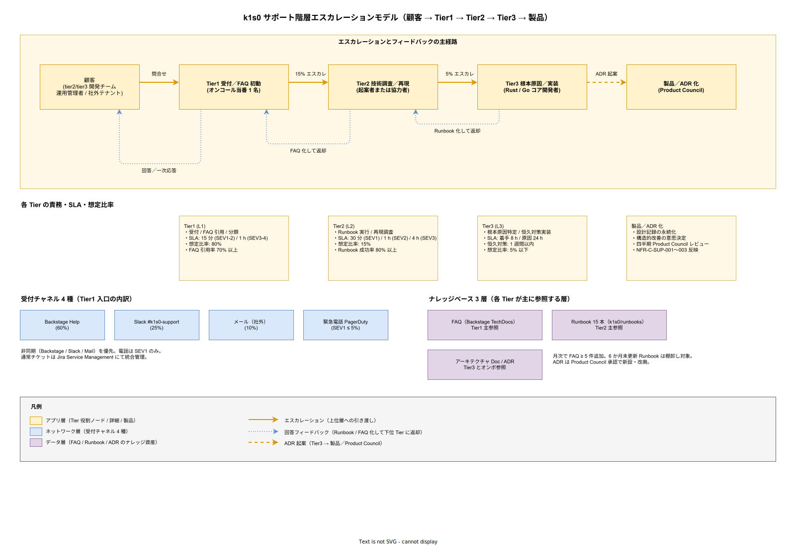
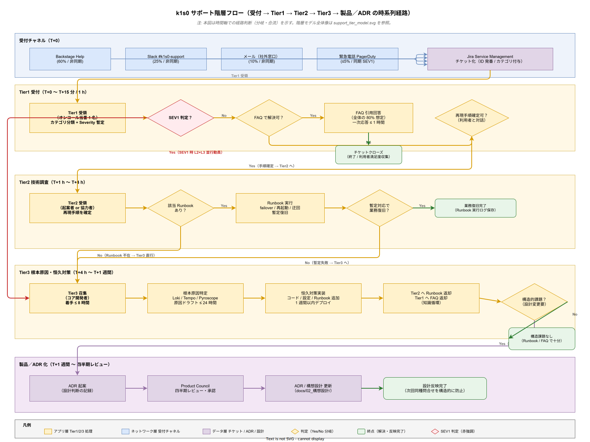
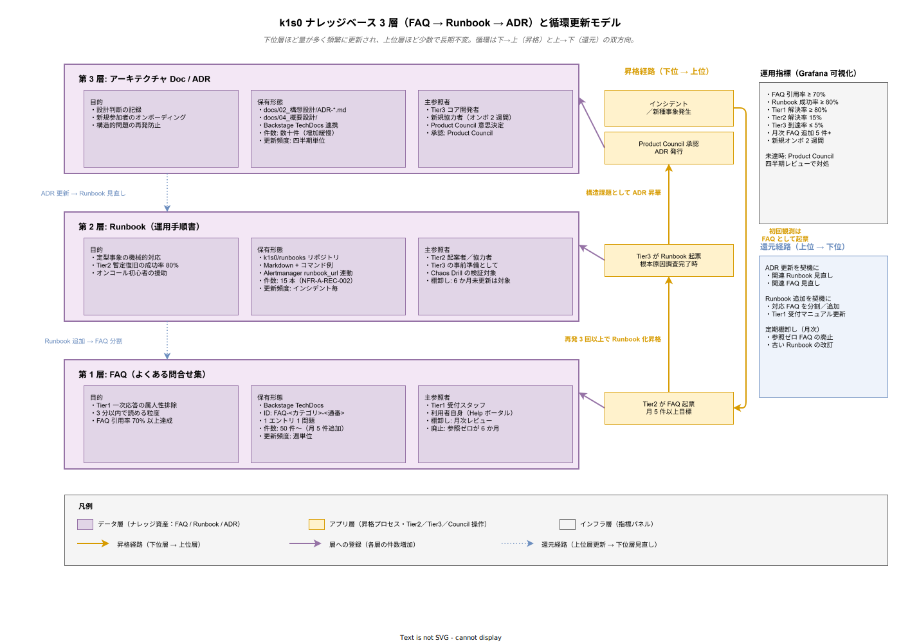

# 01. サポート階層方式

本ファイルは k1s0 の利用者（tier2 / tier3 開発チーム、tier1 運用者、運用管理者）から寄せられる問合せ・不具合報告・障害申告を受け付け、適切な技術層へ誘導して解決に至らせる階層型サポート体制の設計を規定する。要件定義 [40_運用ライフサイクル/02_サポート階層.md](../../03_要件定義/40_運用ライフサイクル/02_サポート階層.md) の OR-SUP-001〜006 に 1:1 で対応する。

## 本章の位置付け

採用側組織の情シス基盤はクラウド SaaS のサポート契約に頼れない。ベンダーサポートがないということは、全問合せを起案者・協力者・コア開発者の 2 名が受け止めることになる。採用検討で約束した「運用 採用側の小規模運用」は、この問合せ受け口の設計を誤ると即座に破綻する。なぜなら、問合せが雑多に 2 名へ直撃すれば、コア開発者は機能開発の時間を奪われ、企画で約束した開発速度を維持できなくなるからである。

この問題を構造的に解くため、k1s0 ではサポートを 3 階層に切り分け、各階層の責任範囲と応答 SLA を明示する。L1 は FAQ とナレッジベースで自己解決できる 80% の問合せを吸収し、L2 は再現手順付きで技術調査を要する 15% の問合せを引き受け、L3 は根本原因の特定と修正が必要な 5% の問合せに絞って対応する。この比率は SRE ベストプラクティス（Google SRE Book 第 11 章）と、同規模 SaaS 事業者の平均的な問合せ分布から設定している。本章の設計は、この比率を維持する仕組みを細部まで具体化することを目的とする。

## 全体エスカレーションモデル

本章の議論に入る前に、顧客からの問合せがどのように各 Tier を経由して最終的に製品設計（ADR）へ還元されるか、その全景を一枚で把握できるようにする。以下の図は、受付チャネル 4 種から Tier1 → Tier2 → Tier3 → 製品（Product Council）へと段階的にエスカレーションしていく「上流フロー」と、Tier3 で確立した根本原因の知見を Runbook／FAQ として下位 Tier に戻し、顧客への一次応答に結実させる「下流フィードバック」の双方向構造を示す。ナレッジベース 3 層（FAQ／Runbook／ADR）は、このサイクルの各 Tier で参照される知識資産として右側にまとめている。

この図で最も重要な読み方は「数字で表される想定比率が崩れた瞬間、運用 採用側の小規模運用は破綻する」という点である。Tier1 で 80% を吸収できなければ Tier2 / Tier3 の負荷が即座に膨張し、Tier3 のコア開発者は本来の機能開発時間を失う。したがって各 Tier の箱に記載した SLA と想定比率は、単なる目標値ではなく「未達となれば採用検討で約束した運用前提（採用側の小規模運用）自体が破綻する閾値」である。この閾値を守るための具体的手段（FAQ 整備、Runbook 整備、エスカレーション基準の明文化、オンコールローテーション、問合せ分析ループ）が本章残部の各節で順に展開される。

下流フィードバック（点線の矢印）が図に描かれている理由は、エスカレーションを一方通行の「投げ渡し」として運用すると下位 Tier の解決能力が育たず、結果として Tier2 / Tier3 に問合せが滞留することへの構造的対策である。Tier3 は根本原因を特定した際に必ず Runbook 化して Tier2 に戻す、Tier2 は再現手順が確定した段階で FAQ 化して Tier1 に戻す、という逆方向の知識循環を組み込むことで、同種事象の二度目以降は下位 Tier で完結できるようにする。この循環があってはじめて、Tier1 で 80% を吸収する体制を長期的に維持できる。

## 階層の定義と責任分界

### L1: 受付と一次切り分け

L1 は問合せの第一接点である。ここでは技術的深掘りをせず、問合せ内容を分類して記録し、既知の FAQ で解決できるものはその場で回答する。解決できないものは L2 へエスカレーションする。L1 の最大の責務は「L2 / L3 に届く問合せを 20% 以下に絞る」ことであり、そのための判断基準を明確に与える。

L1 の受付スタッフは、起案者または協力者のうちオンコール当番となっている 1 名が兼務する。リリース時点〜採用初期 では専任配置は不可能であり、兼務前提の運用となる。兼務による疲弊を避けるため、L1 の定型応答は Backstage TechDocs に格納された FAQ をベースとし、スタッフの記憶に依存する応答は禁止する。スタッフは FAQ の ID を引用する形で回答し、回答の属人性をゼロに近づける。

L1 の SLA は受付から 1 時間以内の一次応答（SEV3 / SEV4）、15 分以内の一次応答（SEV1 / SEV2）とする。ここでの「応答」は解決ではなく「受領の確認 + 分類結果の通知」である。解決までの時間は L2 / L3 の SLA に引き継ぐ。

### L2: 技術調査と暫定対応

L2 は L1 が切り分けた問合せのうち、再現手順が明確で Runbook でカバーできる事象を引き受ける。L2 の責務は「Runbook の実行 + ログ・メトリクスの確認 + 暫定対応の実施」であり、新規 Runbook の作成や根本原因の特定は L3 の責務である。

L2 スタッフは起案者・協力者のいずれか 1 名が担当する。L1 と L2 は同一人物が兼務することを許容するが、SEV1 発生時は L2 の作業に専念するため L1 受付は別の当番が引き継ぐ。この切替は PagerDuty のエスカレーションポリシーで自動化する（運用蓄積後）。

L2 の SLA は受付から 4 時間以内の暫定対応完了（SEV3）、1 時間以内の暫定対応着手（SEV2）、30 分以内の暫定対応着手（SEV1）とする。暫定対応で解決しない場合は L3 へエスカレーションする。

### L3: 根本原因特定と恒久対応

L3 は tier1 のコア開発者が担当する。L3 の責務は「根本原因の特定 + 恒久対策の実装 + 新規 Runbook の作成」である。L3 は機能開発と兼務するため、L3 への問合せ数を 5% に抑えることが運用 採用側の小規模運用の維持に直結する。

L3 スタッフは起案者が常時担当し、運用蓄積後は協力者のうち技術適性がある者を L3 に登用する。L3 への直接問合せは禁止し、L1 → L2 のエスカレーションを必ず経由させる。これは L3 の集中時間を保護するための構造的対策である。

L3 の SLA は受付から 8 時間以内の着手、24 時間以内の原因特定ドラフト、1 週間以内の恒久対策デプロイ（SEV1 / SEV2 の場合）とする。SEV3 以下は優先度に応じて計画的に対応し、Sprint プランニングで組み込む。

## 問合せチャネルと受付経路

問合せチャネルは 4 種類を用意する。チャネルごとに想定する利用シーンと応答時間が異なるため、利用者が目的に応じて選択できるようガイドラインを提示する。チャネル設計のポイントは「非同期チャネルを優先、同期チャネルは緊急時のみ」である。同期チャネル（電話）は対応コストが非同期チャネルの 3〜5 倍になるため、利用を SEV1 緊急時に限定する。

第 1 チャネルは Backstage Help ポータルである。利用者は Backstage のサイドメニューから問合せフォームを開き、カテゴリ（API 不具合 / 認証問題 / 性能問題 / 運用相談 / その他）と再現手順を記入して送信する。送信された問合せは内部的に Jira Service Management（採用後の運用拡大時に OSS 代替を検討）にチケット化される。Backstage Help は全問合せの 60% を占める想定で、L1 の主受付経路である。

第 2 チャネルは Slack 社内チャンネル（#k1s0-support）である。軽微な質問や FAQ 引用で解決可能な問合せはここで受け付ける。スレッド内で L1 が応答し、深掘りが必要な場合は Backstage Help へのチケット化を促す。Slack は全問合せの 25% を占める想定である。

第 3 チャネルはメール（k1s0-support@example.jp）である。他社テナントや非社員からの問合せを受け付ける窓口とし、社内は原則 Slack を優先する。メールは全問合せの 10% を占める想定である。

第 4 チャネルは緊急時電話（SEV1 発生時のみ）である。PagerDuty のコールアウトで起案者・協力者の携帯に直接架電し、15 分以内の一次応答を保証する。電話は全問合せの 5% 以下を想定する。

以下に問合せフローを示す。

## エスカレーション基準

エスカレーションは下位階層から上位階層へ問合せを引き上げる操作である。基準を曖昧にすると L3 に問合せが殺到するか、逆に L1 でハンドリングを抱え込んで SLA を破ることになる。k1s0 では以下 4 つの基準でエスカレーションを発火させる。

第 1 基準は「Severity SEV1 は即時 L2 + L3」である。SEV1 は全停止・データ損失・セキュリティインシデントを指し、L1 の判断を挟まず PagerDuty で L2 / L3 に並行通知する。L1 は通知後に受付台帳への記録と利用者への状況連絡に専念する。

第 2 基準は「Runbook 無しの事象は L3 直行」である。L2 は Runbook に基づいて対応するため、既知の Runbook がない事象は L2 で処理できない。この場合 L2 は即座に L3 へ引き渡し、L3 は調査結果を Runbook 化して L2 に戻す。

第 3 基準は「再現手順が確定しない場合は L2 で調査継続」である。L1 で受付けた問合せのうち、再現手順が曖昧なものは L1 から L2 に引き渡し、L2 が利用者と協力して再現手順を確定させる。確定後に Runbook が存在すれば L2 で処理、存在しなければ L3 へ引き上げる。

第 4 基準は「SLA 残り時間 50% で強制エスカレーション」である。SLA 期限の半分を消費しても解決の目処が立たない場合、上位階層へ自動エスカレーションする。これは PagerDuty の自動エスカレーションポリシーで実装する。

## オンコール体制

オンコールは 24 時間 365 日の受付保証を目的としない。k1s0 は 採用側組織の情シスの業務時間帯（平日 9:00〜19:00）を一次サポート時間帯とし、それ以外は SEV1 発生時のみ PagerDuty で呼び出す。完全 24/7 体制は採用側の小規模運用では実現不可能であり、企画で約束した体制と整合しない。

オンコールローテーションは 1 週間交代とする。リリース時点〜採用初期 では起案者 1 名 + 協力者 1 名の 2 名でローテーションし、各人週 1 回のオンコール負担となる。採用後の運用拡大時 で体制が 2〜3 名に拡張された段階で、協力者を増員してローテーション周期を 2〜3 週間に伸ばす。1 週間のうち業務時間外（19:00〜9:00 および土日祝）は、SEV1 のみ対応する「受動オンコール」とし、作業は一次対応（暫定復旧）に限定して、恒久対応は翌営業日に持ち越す。

オンコール報酬は 1 週間あたり 1.5 万円（休日手当込み）を想定する。これは 採用側組織の情シス部門で類似制度を導入している事例（三井住友海上システムズ、NTT データなど）の平均値を参考に設定している。運用蓄積後、人事部との協議で正式制度化する。

PagerDuty は リリース時点 から導入する。採用初期 は Slack の @here と電話の組み合わせで代用し、ルール化は PagerDuty 導入時に明文化する。PagerDuty の導入判断は、SEV1 発生頻度が月 1 回を超えた段階で前倒しする。

## ナレッジベースの設計

ナレッジベースは L1 の生産性を決定する最重要資産である。L1 がスタッフの記憶でなく FAQ で応答することで、スタッフ依存度をゼロに近づけ、バス係数 2 を実現する。ナレッジベースの設計は以下 3 層で構成する。

第 1 層は Backstage TechDocs に格納される FAQ である。FAQ は 1 エントリ 1 問題の粒度とし、回答は 3 分以内で読める長さに制限する。FAQ ID は `FAQ-<カテゴリ>-<通番>` で採番し、L1 スタッフが応答時に引用する。FAQ の追加・更新はプルリクエスト経由とし、月次レビューで古い FAQ の棚卸しを行う。

第 2 層は Runbook である。Runbook は L2 / L3 が利用する運用手順書で、本章の [08_Runbook設計方式.md](08_Runbook設計方式.md) で設計を規定する。L1 は Runbook を直接利用しないが、Runbook の存在有無で L2 / L3 どちらにエスカレーションするかを判断する。

第 3 層はアーキテクチャドキュメントである。構想設計・概要設計で作成した設計書をナレッジベースとして活用し、新規協力者のオンボーディングに使う。リリース時点 で新規協力者が 2 週間以内に基礎理解に到達できることを指標とする。

以下にナレッジベースの構造を示す。

## 問合せ分析とフィードバックループ

サポート階層は導入して終わりではなく、継続的に改善する必要がある。問合せの傾向分析を怠ると、同じ問合せが繰り返し L3 に流れ、5% 比率が徐々に崩れていく。k1s0 では以下のフィードバックループを設計する。

月次で問合せチケットを集計し、以下の指標を算出する。L1 解決率（目標 80% 以上）、L2 エスカレーション率（目標 15%）、L3 エスカレーション率（目標 5% 以下）、SLA 遵守率（目標 95% 以上）、FAQ 引用率（L1 応答における FAQ 引用の割合、目標 70% 以上）。これらを Grafana ダッシュボードで可視化し、Product Council で四半期レビューする。

FAQ 追加は L2 / L3 が対応した問合せのうち「再発性が高い」と判断されたものから自動的にドラフト化する。ドラフトは起案者がレビューし、PR 承認後に本番 FAQ に反映する。FAQ 追加の目標は月 5 件以上とする。

問合せが特定カテゴリに集中している場合は、設計または実装に構造的問題がある兆候として扱う。たとえば「認証エラー」が月 20 件を超える場合は、Keycloak 設定または tier1 認証 SDK の UX に問題がある可能性を疑い、根本的な設計改善を検討する。

## 内部 SRE 体制としてのサポート階層（NFR-C-SUP 系）

本章の前段で定義した L1/L2/L3 は、非機能要件 NFR-C-SUP-001（内部 SRE 体制）・NFR-C-SUP-002（コミュニティサポート活用）・NFR-C-SUP-003（ベンダー撤退シナリオ）を満たす具体実装でもある。採用検討での差別化ポイントである「商用 PaaS の SLA 外問題を回避する内部 SRE」を構造化するため、上記 L1〜L3 の責任分界に加えて、以下の 3 設計項目を本節で確定する。

**設計項目 DS-OPS-SUP-007 内部 SRE 体制の週次ローテーションとバス係数 2 の担保**

NFR-C-SUP-001（内部 SRE 2〜3 名体制、平日 8:00〜20:00 オンコール、Severity 1 初動 30 分）に対する実装である。リリース時点 で 2〜3 名（起案者＋協力者 少数名）を配置し、週次ローテーションをオンコールカレンダー（PagerDuty On-Call Schedule）で管理する。週あたりのオンコール時間は 60 時間（平日 5 日 × 12 時間）、1 人あたり月次オンコール負担は 2 週分＝120 時間以内に抑える。これは Google SRE が推奨する「オンコール負担は勤務時間の 25%（週 10 時間）以内」の上限を、短期的には許容しつつ 採用後の運用拡大時 で 3 名体制化して解消する設計である。バス係数 2（ひとり抜けても業務継続）は、Runbook 15 本（NFR-A-REC-002）の共通実行権限と、オンコール引継ぎ時の 30 分ハンドオフミーティングで担保する。

**設計項目 DS-OPS-SUP-008 コミュニティサポート経路の整備と窓口集約**

NFR-C-SUP-002（主要 OSS コミュニティ活用、商用サポート契約なし）への対応である。商用サポート費用を年間 2,000 万円規模で削減することが採用検討の前提条件であるため、代替として Dapr / ZEN Engine / Istio / CloudNativePG / OpenBao / Strimzi の 6 主要 OSS について、GitHub Issues・Slack・Discord の窓口 URL と過去 1 年のアクティビティ（Issue クローズ率、コントリビュータ数、メジャーリリース頻度）を Backstage の Community ページに集約する。L2 / L3 が根本原因不明の事象に遭遇した場合、社内調査と並行して 72 時間以内にコミュニティ Issue を起票する運用とし、年次の OSS 健全性レポート（Product Council 提出）で採用継続判断の根拠とする。

**設計項目 DS-OPS-SUP-009 ベンダー撤退シナリオと代替候補の年次再評価**

NFR-C-SUP-003（主要 OSS に代替候補を常に 1 つ以上確保）への対応である。採用 OSS のライセンス変更（HashiCorp BSL 化、Redis RSALv2 化、ElasticSearch の SSPL 化の前例あり）や fork 消滅で突然利用継続が不可となる事態に備え、Dapr → Rust 自作ファサード全面化、Istio Ambient → Linkerd / Consul、CloudNativePG → Crunchy Postgres Operator、OpenBao → Infisical または自作 Secret 管理、Strimzi → Redpanda Operator、flagd → LaunchDarkly OSS 代替、の 6 経路を設計文書として常備する。各代替候補は年次で活性度（GitHub Star / Commit 頻度 / コミュニティ規模）と移行コスト（人月見積）を再評価し、情シスマネージャ承認の年次レポートにまとめる。撤退発動条件は「採用 OSS の 6 か月間リリース停止」「Critical CVE が 30 日以上未修正」「コア開発者の離脱」の 3 条件とし、これは [05_撤退戦略方式.md](05_撤退戦略方式.md) と整合させる。

## 設計 ID 一覧

本章で採番する設計 ID を以下に示す。DS-OPS-SUP-001〜006 は OR-SUP-001〜006（要件定義 40_運用ライフサイクル）に、DS-OPS-SUP-007〜009 は NFR-C-SUP-001〜003（30_非機能要件 C. 運用・保守性 C5. サポート体制）に対応する。

| 設計 ID | 項目 | 対応要件 | 確定段階 |
| --- | --- | --- | --- |
| DS-OPS-SUP-001 | 3 階層サポート体制の定義 | OR-SUP-001 | リリース時点 |
| DS-OPS-SUP-002 | 問合せチャネル 4 種の設計 | OR-SUP-002 | リリース時点 |
| DS-OPS-SUP-003 | エスカレーション 4 基準 | OR-SUP-003 | リリース時点 |
| DS-OPS-SUP-004 | オンコールローテーション | OR-SUP-004 | リリース時点 |
| DS-OPS-SUP-005 | ナレッジベース 3 層構造 | OR-SUP-005 | リリース時点 |
| DS-OPS-SUP-006 | 問合せ分析フィードバック | OR-SUP-006 | リリース時点 |
| DS-OPS-SUP-007 | 内部 SRE 体制とバス係数 2 | NFR-C-SUP-001 | リリース時点 |
| DS-OPS-SUP-008 | コミュニティサポート窓口集約 | NFR-C-SUP-002 | リリース時点 |
| DS-OPS-SUP-009 | ベンダー撤退シナリオと代替候補再評価 | NFR-C-SUP-003 | 採用後の運用拡大時 |

## 対応要件一覧

本章は要件定義書の以下エントリに対応する。OR-SUP-001（サポート階層定義）、OR-SUP-002（問合せチャネル）、OR-SUP-003（エスカレーション基準）、OR-SUP-004（オンコール体制）、OR-SUP-005（ナレッジベース整備）、OR-SUP-006（問合せ分析改善）。加えて NFR-C-SUP-001（内部 SRE 2〜3 名体制）、NFR-C-SUP-002（コミュニティサポート活用）、NFR-C-SUP-003（ベンダー撤退シナリオ）にも直接対応する。NFR-C-OPS-012（サポートプロセス定義）および NFR-A-REC-002（Runbook 15 本整備）と連動する。
