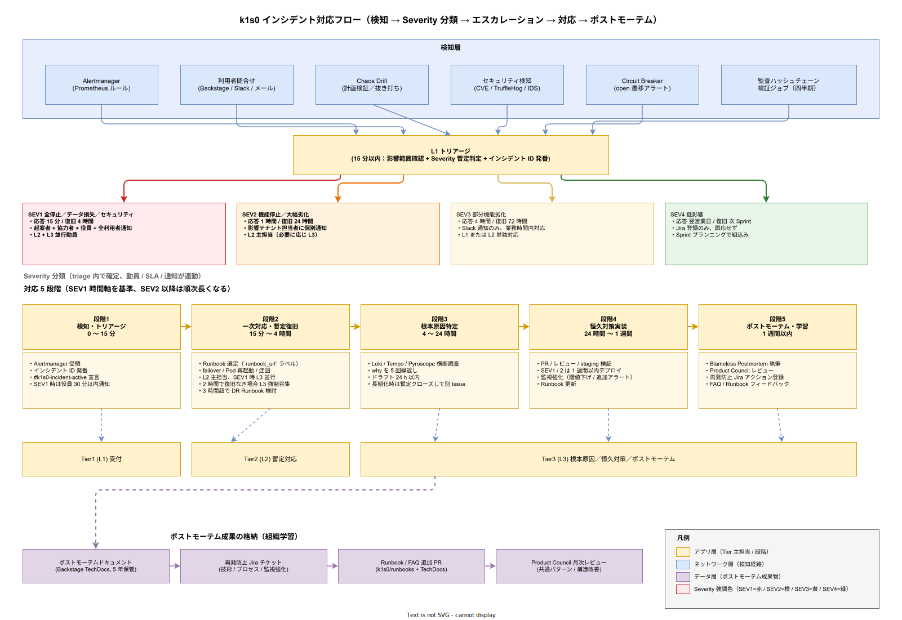
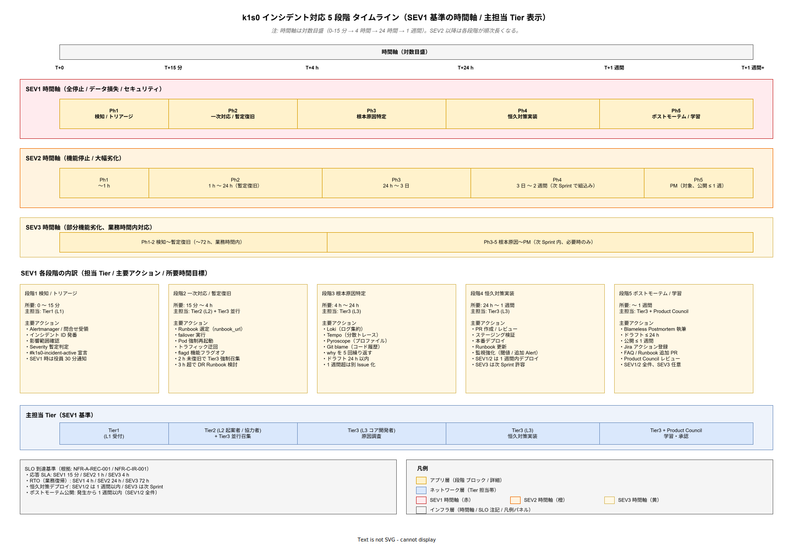
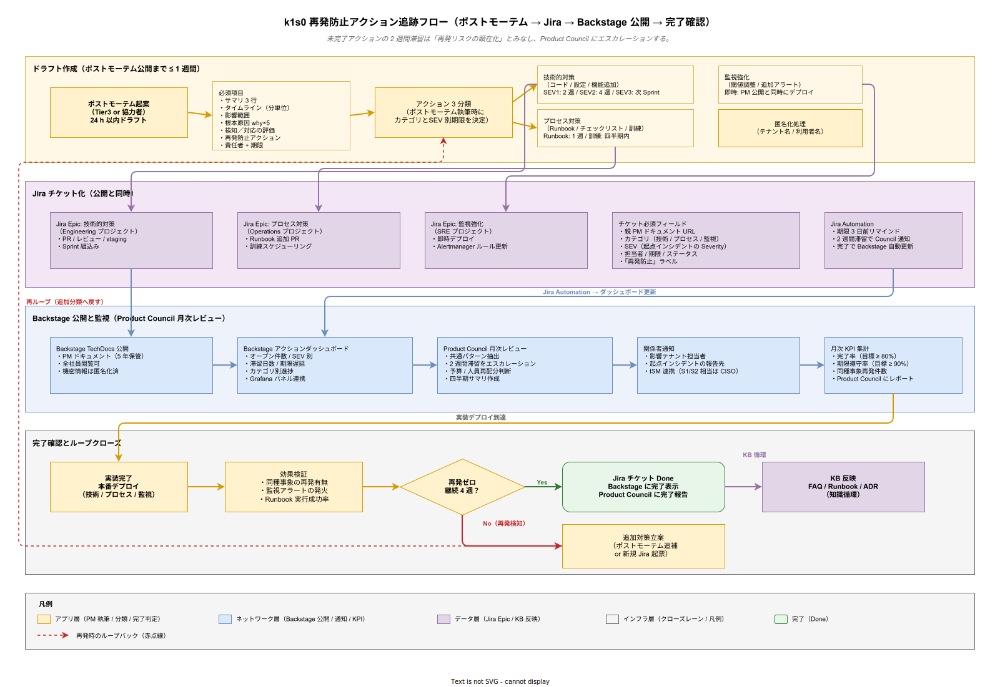

# 02. インシデント対応方式

本ファイルは k1s0 の稼働中に発生する障害・セキュリティ事象・性能劣化・データ不整合を検知してから復旧し、再発防止策を組織学習として定着させるまでのインシデント対応プロセスを規定する。要件定義 [40_運用ライフサイクル/01_インシデント対応詳細.md](../../03_要件定義/40_運用ライフサイクル/01_インシデント対応詳細.md) の OR-INC-001〜007 に 1:1 で対応する。

## 本章の位置付け

採用側組織の情シス基盤にとってインシデント対応は最後の防衛線である。検知の遅れは SLA 違反につながり、対応の遅れは採用検討で約束した SLO 99.9% を侵食し、再発防止の怠りは同じ事故を繰り返すことで利用者信頼を失わせる。企画段階で約束した「SLA 99% / SLO 99.9% / RTO 4h / RPO 秒オーダー」を運用局面で守るには、インシデント対応を属人的スキルから組織的プロセスへ昇格させる必要がある。

本章ではインシデントを「あらかじめ想定した手順（Runbook）で機械的に対応できる標準事象」と「想定外の事象で根本調査を要する非標準事象」に切り分け、それぞれに時間軸を伴った手順を定義する。Severity 定義・対応 SLA・通知ルール・ポストモーテム・再発防止の 5 軸を一貫した設計として規定することで、起案者・協力者の 2 名が SEV1 発生時に混乱せず動ける体制を構築する。

## インシデント対応フロー全体像

本章が扱う 5 軸（Severity／SLA／通知／ポストモーテム／再発防止）は、時間軸上では 1 本の連続したプロセスを形成する。読み手が個別節の詳細に入る前に、検知からポストモーテムまでの全景と、各段階でどのサポート階層（Tier1／Tier2／Tier3）が主担当となるかを一枚で把握できるように、以下の図を示す。

図の最上段「検知層」は、Alertmanager（メトリクスしきい値越え）・利用者問合せ・Chaos Drill（計画検証）・セキュリティ検知（CVE／TruffleHog／IDS）・Circuit Breaker の open 遷移・監査ハッシュチェーン検証ジョブという 6 種類の検知経路が並列に稼働することを示す。どの経路で検知されても Tier1 の L1 トリアージに合流させることで、検知手段が多様化しても「宣言されないインシデント」が発生しない状態を担保する。トリアージの 15 分制約は SEV1 応答 SLA（15 分）を前倒しで達成するための設計であり、この時間内に Severity 暫定判定とインシデント ID 発番を完了する。

中段の Severity 分類は、判定結果が即座に動員体制・SLA・通知マトリクスに連動することを示している。SEV1（赤）は起案者＋協力者＋役員まで巻き込む「組織全体の動員モード」であり、SEV4（緑）は Sprint プランニングに組み込まれる「日常開発の範疇」である。色を明確に分けているのは、対応者が Slack や PagerDuty 通知を見た瞬間に「今がどのモードか」を視覚的に判断できるようにするためである。

下段の対応 5 段階は SEV1 の時間軸を基準に描いており、SEV2 以降は各段階の所要時間が順次長くなる。リリース時点〜採用後の運用拡大時 は Tier1／Tier2 が主担当となるが、採用側のマルチクラスタ移行時〜5（根本原因特定・恒久対策・ポストモーテム）は Tier3（コア開発者）に集約される。この Tier3 集約は、組織学習（Blameless Postmortem の成果物、再発防止 Jira アクション、Runbook／FAQ 追加 PR、Product Council レビュー）として図右下のデータ層に永続化され、次回同種インシデントが発生した際の検知感度・初動速度を改善する循環を形成する。

## Severity の定義と判定基準

Severity（重要度）はインシデント対応の最初の判断であり、ここを誤ると動員体制・通知先・対応時間が全て狂う。k1s0 では 4 段階（SEV1〜SEV4）を定義し、各段階の判定基準を「影響範囲 × 業務停止度合い」の 2 軸で明示する。Severity は L1 受付時に暫定判定し、L2 への引き渡し時に確定する。SEV1 と判定された場合は即時 PagerDuty 起動、他 Severity は通常のエスカレーション経路に従う。

### SEV1: 全停止 / データ損失 / セキュリティ

SEV1 は k1s0 基盤の根幹機能が広範に停止している状態、またはデータの永続的損失・改ざん、情報漏洩を疑わせる状態を指す。具体例として、tier1 API が全テナントで応答不能になる、監査ログが書き込まれない（完整性要件違反）、Secret が外部流出した疑いがある、Kubernetes クラスタが全ノード停止、PostgreSQL Primary / Replica 全滅、といった事象が該当する。

SEV1 は「業務に従事する全利用者が作業継続不能」という業務影響度で判定する。部分的な影響（特定 API のみ、特定テナントのみ）は原則 SEV2 とし、SEV1 は全テナント × 基幹 API の停止に限定する。これは SEV1 の動員体制が起案者 + 協力者 + 役員通知 + 場合によっては外部ベンダー連絡まで広がるため、乱発すると組織の疲弊を招くからである。

### SEV2: 機能停止

SEV2 は特定機能の停止または大幅性能劣化で、業務は継続可能だが主要ユースケースが影響を受けている状態である。具体例として、特定 API（例: k1s0.PubSub）が機能停止している、PostgreSQL Primary がダウンし Replica に failover した直後、Kafka ブローカー 1 台停止で再バランス中、Keycloak の新規ログインが不可（既存セッションは有効）、といった事象が該当する。

SEV2 は「複数テナントが一部業務で不便を感じている」水準で判定する。業務に迂回手段があり、数時間の我慢で解消見込みのものは SEV2 に含める。完全な代替手段がない場合は SEV1 へ格上げ判定する。

### SEV3: 部分機能劣化

SEV3 は限定的な影響範囲での機能劣化である。具体例として、特定テナントのみでレイテンシが劣化、非致命的な API エラーが散発、ダッシュボードの表示遅延、一部バッチ処理の遅延、といった事象が該当する。業務は継続可能で、利用者への影響は限定的である。

SEV3 の対応は業務時間内のみとし、夜間・休日は翌営業日回しとする。

### SEV4: 低影響

SEV4 は運用改善要望・軽微な UI 不具合・ログ出力の見栄え問題など、利用者への実害がないか極めて軽微な事象である。対応は計画的に Sprint プランニングで組み込み、即応しない。

### Severity 対応 SLA 早見表

| Severity | 応答時間 | 復旧目標 | 通知先 | 動員体制 |
| --- | --- | --- | --- | --- |
| SEV1 | 15 分以内 | 4 時間以内 | PagerDuty 即時 / 役員 30 分以内 / 全利用者 1 時間以内 | 起案者 + 協力者 + 役員 + 場合により外部ベンダー（根拠: RTO 4h コミット） |
| SEV2 | 1 時間以内 | 24 時間以内 | PagerDuty 業務時間内 / 影響テナント利用者 | 起案者または協力者（単独対応可） |
| SEV3 | 4 時間以内 | 72 時間以内 | Slack 通知 / 影響テナント担当者 | 起案者または協力者（業務時間内対応） |
| SEV4 | 翌営業日 | 次 Sprint | Jira チケット登録のみ | Sprint プランニングで割当 |

応答時間は「第一次の状況確認連絡」を指し、復旧目標は「業務継続可能な状態への復帰」を指す。根本原因の特定・恒久対策の完了はこの SLA には含まれず、ポストモーテムで別途管理する。

## 対応手順の段階分割

インシデント対応は検知から再発防止まで 5 段階に分割する。各段階に時間目安と責任者を割り当て、時間超過時のエスカレーション基準を明示する。この段階分割により、起案者・協力者が「今どの段階にいるか」を常に把握でき、判断漏れを防ぐ。

### 段階 1: 検知とトリアージ（0〜15 分）

検知は Alertmanager または利用者からの問合せで発生する。Alertmanager のアラートは PagerDuty 経由で起案者・協力者に通知され、利用者からの問合せは L1 受付経由で L2 にエスカレーションされる。検知後、最初の 15 分で「影響範囲の確認 + Severity 判定 + インシデント宣言」を行う。

インシデント宣言は Slack の #k1s0-incident-active チャンネルへの投稿で行う。投稿内容は以下を必須とする: インシデント ID、Severity、現象概要、暫定影響範囲、調査担当者、宣言時刻。この宣言によりインシデント対応が正式に開始される。

SEV1 と判定された場合、宣言と同時に役員通知（Slack の #exec-notify チャンネル + メール）を発火させる。役員通知の SLA は 30 分以内である。

### 段階 2: 一次対応と暫定復旧（15 分〜4 時間）

一次対応は Runbook に従って実施する。Runbook の選定は Alertmanager のアラートから自動提示される（Alert ラベル `runbook_url` に基づく）。対応者は Runbook を開き、記載された手順を機械的に実行する。この段階では根本原因の特定は後回しとし、「業務影響を最小化するための暫定復旧」に専念する。

暫定復旧の手段として、failover 実行（PostgreSQL / Valkey / Kafka）、Pod 強制再起動、トラフィック迂回（Istio VirtualService 編集）、機能フラグ緊急オフ（flagd）、Rate Limit 強化（Envoy Gateway）を標準化する。各手段は Runbook で具体的コマンドとして記述する。

SEV1 で一次対応が 2 時間を超えても復旧しない場合、L3（コア開発者）を強制召集する。また SEV1 で 3 時間経過しても復旧目処が立たない場合は、DR（災害復旧）Runbook への移行を検討する。

### 段階 3: 根本原因特定（4〜24 時間）

暫定復旧後、根本原因の特定に着手する。ログ・メトリクス・トレース・コードを横断的に調査し、「なぜ発生したか」「なぜ検知が遅れたか」「なぜ影響が広がったか」の 3 問いに答えを出す。この段階で使うツールは Grafana Loki（ログ集約）、Tempo（分散トレース）、Pyroscope（プロファイル）、Git blame（コード履歴）である。

原因特定は 24 時間以内のドラフト化を目指す。24 時間を超える場合はポストモーテムドラフトに「調査継続中」と明記し、最大 1 週間まで延長する。1 週間を超える場合は長期調査として別タスク化し、インシデント自体は暫定クローズする。

### 段階 4: 恒久対策実装（24 時間〜1 週間）

根本原因が特定されたら、恒久対策を実装する。恒久対策はコード修正・設定変更・運用手順追加・Runbook 更新のいずれかまたは組合せで構成される。実装は通常の PR ワークフローに従い、レビュー・テスト・ステージング検証を経て本番デプロイする。

SEV1 / SEV2 の恒久対策は 1 週間以内のデプロイを目標とする。SEV3 以下は次 Sprint（最大 2 週間）での対応を許容する。恒久対策が完了するまで、同種インシデントの再発リスクが残るため、監視強化（閾値下げ / 追加アラート）を暫定的に入れる。

### 段階 5: ポストモーテムと組織学習（1 週間以内）

ポストモーテムは SEV1 / SEV2 全件、SEV3 は重大度判断で実施、SEV4 は実施しない。ポストモーテムのドラフトはインシデント発生から 24 時間以内に起案者または協力者が作成し、1 週間以内に公開する。公開後、Product Council で再発防止策をレビューし、アクションアイテムを Jira に登録する。

以下にインシデント対応段階の時間軸を示す。

## 通知ルール

通知は適切な相手に適切なタイミングで届かないと意味がない。過少通知は対応遅延を招き、過剰通知は受信者の疲労（アラート疲れ）を招く。k1s0 では Severity と対応段階に応じた通知マトリクスを固定する。

SEV1 発生時、検知と同時に PagerDuty が起案者・協力者の両方に即時コールする（SMS + 電話 + プッシュ通知）。30 分以内に役員通知（情シス部長・CTO）を発火させ、Slack の #exec-notify と指定メールアドレスへ配信する。1 時間以内に全利用者向けのアナウンスを Backstage ポータルのバナーとメール配信で通知する。アナウンス文面はテンプレート化し、起案者が穴埋めで公開できるようにする。

SEV2 発生時、PagerDuty は業務時間内のみ通知する（夜間・休日は翌営業日）。影響テナントの担当者に Slack DM で個別通知する。全利用者向けアナウンスは行わない。

SEV3 / SEV4 は Slack の #k1s0-incident-low チャンネルで共有するのみで、個別通知は行わない。

採用後の運用拡大時 でステータスページを導入し、利用者が自発的に稼働状況を確認できるようにする。ステータスページは Cachet（OSS）を候補とし、Keycloak 認証なしで社内向けに公開する。

## ポストモーテム方式

ポストモーテムは非難ではなく学習のためのものである（Blameless Postmortem）。特定個人のミスを追及するのではなく、「そのミスが起こりうる仕組み」を改善することに焦点を当てる。個人の過失として処理すると、次回以降ミスが報告されなくなり、隠蔽文化が醸成される。k1s0 ではポストモーテムのテンプレートで以下の項目を固定する。

サマリ（3 行以内のインシデント概要）、タイムライン（検知・宣言・対応・復旧の時刻を分単位で記録）、影響範囲（影響テナント・影響 API・影響データ件数）、根本原因（why を 5 回繰り返す分析）、検知の評価（検知が早かったか遅かったか、検知チャネルが機能したか）、対応の評価（Runbook が機能したか、対応者の判断は適切だったか）、再発防止アクション（技術的対策・プロセス対策・監視強化）、責任者と期限（各アクションの担当者と完了期限）。

ポストモーテムドキュメントは Backstage TechDocs に格納し、全社員が閲覧可能とする。機密情報（特定テナント名・利用者名）は匿名化する。監査証跡としての価値も持つため、5 年間保管する。

Product Council は月次でポストモーテム集計をレビューし、共通パターン（同じ根本原因の再発、類似アラートの多発）を抽出して構造的改善を提案する。

## 再発防止アクションの管理

ポストモーテムで定めたアクションは Jira でチケット化し、担当者と期限を明示する。アクションは以下 3 カテゴリに分類する。

技術的対策（コード修正・設定変更・新機能追加）は開発チームが Sprint に組み込む。目標完了期限は SEV1 なら 2 週間以内、SEV2 なら 4 週間以内、SEV3 なら次 Sprint である。

プロセス対策（Runbook 追加・チェックリスト追加・訓練計画）は運用チームが対応する。Runbook 追加は 1 週間以内、訓練計画は四半期内の実施をコミットする。

監視強化（閾値調整・新規アラート追加）は即時対応とし、ポストモーテム公開と同時にデプロイする。これは同種インシデントの再発検知を早めるための応急措置である。

アクションの遂行率は月次で Product Council にレポートし、未完了アクションが 2 週間以上滞留している場合はエスカレーションする。未完了の滞留は「再発リスクの顕在化」と同義であるため、予算・人員の再配分で解消する。

以下に再発防止アクションのフローを示す。

## Severity 判定のグレーゾーン対応

実運用では Severity の判定に迷うケースが必ず発生する。たとえば「1 テナントだけ API が応答不能、他は正常」という事象は SEV1 か SEV2 か。k1s0 では以下のルールで判定を確定させる。

判定に迷った場合は上位 Severity を採用する。SEV2 か SEV1 か迷えば SEV1 とする。過剰対応による疲弊より、過少対応による被害拡大のリスクを重視する。Severity は対応中に格下げ可能であり、宣言後に影響範囲が限定的と確認できれば SEV2 へ変更する。逆の格上げも発生することを前提に、初動はやや重めで構える。

単一テナント影響は SEV2 を基本とするが、そのテナントが「採用検討済みの重要顧客」である場合は SEV1 とする。この判定はテナント属性（Keycloak の属性情報）と連動させ、L1 受付時に自動判定できるようにする。

セキュリティ事象は常に SEV1 とする。Secret 漏洩疑い・不正アクセス疑い・監査ログ改ざん疑いは、影響範囲が不明でも SEV1 で宣言し、即時対応する。セキュリティ事象の過少判定は監督官庁への報告遅延につながるため、機械的に SEV1 扱いとする。

## 非機能要件 NFR-C-IR / NFR-C-ISM との接続

本章前段の Severity 4 段階と段階分割は、非機能要件 NFR-C-IR-001（Severity 別応答時間）・NFR-C-IR-002（Circuit Breaker 監視）・NFR-C-ISM-001（Information Security Management の Severity 体系連携）を満たすための具体設計でもある。これら 3 要件はサポート階層で定めた運用プロセスをインシデント対応の時間軸に接続する役割を持つため、本節で独立した設計項目として確定する。

**設計項目 DS-OPS-INC-008 Severity 別初動時間と完全復旧時間の二軸 SLA**

NFR-C-IR-001（SEV1 初動 30 分 / RTO 4 時間、SEV2 初動 2 時間 / 1 営業日、SEV3 初動 1 営業日 / 1 週間）に直接対応する。本章本文の SEV1 応答時間 15 分は、NFR-C-IR-001 の初動 30 分を PagerDuty の即時コールで前倒しした設計とし、30 分は「状況確認連絡完了」のデッドラインとして区別する。SEV2 は NFR-C-IR-001 の「1 時間以内」と本章の「1 時間以内」が一致するため再定義不要だが、復旧目標「24 時間以内」は NFR-C-IR-001 の「1 営業日」と同義である旨を運用ガイドに明記する。運用蓄積後、月次レポートで Severity 別の初動遵守率（目標 95%）と完全復旧遵守率（目標 90%）を Grafana で可視化し、未達時はポストモーテム対象とする。

**設計項目 DS-OPS-INC-009 Circuit Breaker open 遷移アラートとインシデント化**

NFR-C-IR-002（Circuit Breaker 状態の可視化、open 遷移で SEV2 アラート、5 分以内にアラート到達）への対応である。tier1 Service Invoke API に組み込む Circuit Breaker（構想設計 ADR-CB-001 で採用）の状態メトリクス `k1s0_circuit_breaker_state{api, endpoint}`（0=closed, 1=half-open, 2=open）を Prometheus で収集し、Alertmanager ルール `CircuitBreakerOpen` を「state==2 が 1 分継続」で発火させる。発火後は本章の 5 段階対応に即座に乗せ、L2 が Runbook `RB-API-002`（新規整備予定、下流サービス障害対応）を実行する。open 遷移が 24 時間で 3 回以上発生する API は、下流サービスの根本不安定性を示唆するため、SEV2 から SEV1 への格上げ判定対象とする。

**設計項目 DS-OPS-INC-010 セキュリティインシデント対応プロセス（ISM 接続）**

NFR-C-ISM-001（Information Security Management、S1〜S4 の 4 段階 Severity）との接続点を設計する。セキュリティ事象（Secret 漏洩、不正アクセス疑い、監査ログ改ざん疑い、データ漏洩疑い）は本章のグレーゾーン節で「機械的に SEV1」と定めたが、これに加えて ISM 側の S1〜S4 区分（S1: 重大情報漏洩 / S2: 内部アクセス違反 / S3: 設定ミス / S4: 誤操作）とのマッピングテーブルを整備する。S1 / S2 は k1s0 の SEV1 に、S3 は SEV2 に、S4 は SEV3 に対応付ける。セキュリティインシデント発生時は、本章の段階 1〜5 に加えて（a）情報セキュリティ責任者（CISO）への 30 分以内通知、（b）個人情報保護法 22 条の定める「速やかな」報告判断（漏洩 1,000 件以上または要配慮個人情報が含まれる場合は個人情報保護委員会へ 72 時間以内に速報）、（c）サイバー保険の事故発生通知、の 3 点を追加プロセスとして必須化する。CISO 通知経路は PagerDuty の Security Escalation Policy で起案者通知後 30 分経過した段階で自動的に発火させる。

## 設計 ID 一覧

| 設計 ID | 項目 | 対応要件 | 確定段階 |
| --- | --- | --- | --- |
| DS-OPS-INC-001 | Severity 4 段階定義 | OR-INC-001 | リリース時点 |
| DS-OPS-INC-002 | 対応 SLA 設定 | OR-INC-002 | リリース時点 |
| DS-OPS-INC-003 | 5 段階対応手順 | OR-INC-003 | リリース時点 |
| DS-OPS-INC-004 | 通知マトリクス | OR-INC-004 | リリース時点 |
| DS-OPS-INC-005 | ポストモーテム方式 | OR-INC-005 | リリース時点 |
| DS-OPS-INC-006 | 再発防止アクション管理 | OR-INC-006 | リリース時点 |
| DS-OPS-INC-007 | Severity 判定グレーゾーン | OR-INC-007 | リリース時点 |
| DS-OPS-INC-008 | Severity 別初動時間と完全復旧時間の二軸 SLA | NFR-C-IR-001 | リリース時点 |
| DS-OPS-INC-009 | Circuit Breaker open アラートのインシデント化 | NFR-C-IR-002 | リリース時点 |
| DS-OPS-INC-010 | セキュリティインシデント対応プロセス（ISM 接続） | NFR-C-ISM-001 | リリース時点 |

## 対応要件一覧

本章は要件定義書の以下エントリに対応する。OR-INC-001（Severity 定義）、OR-INC-002（対応 SLA）、OR-INC-003（対応手順）、OR-INC-004（通知）、OR-INC-005（ポストモーテム）、OR-INC-006（再発防止）、OR-INC-007（判定基準）。加えて NFR-C-IR-001（Severity 別応答時間）、NFR-C-IR-002（Circuit Breaker 監視）、NFR-C-ISM-001（Information Security Management）にも直接対応する。NFR-A-CONT-001（SLA 99%）、NFR-A-CONT-002（SLO 99.9%）、NFR-A-REC-001（RTO 4h）、NFR-A-REC-002（Runbook 15 本）と連動する。
