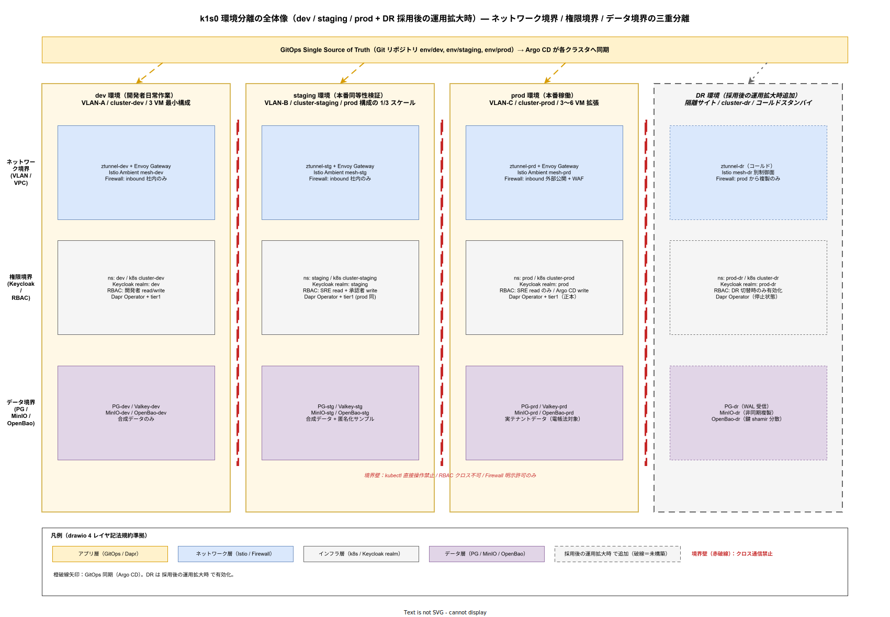
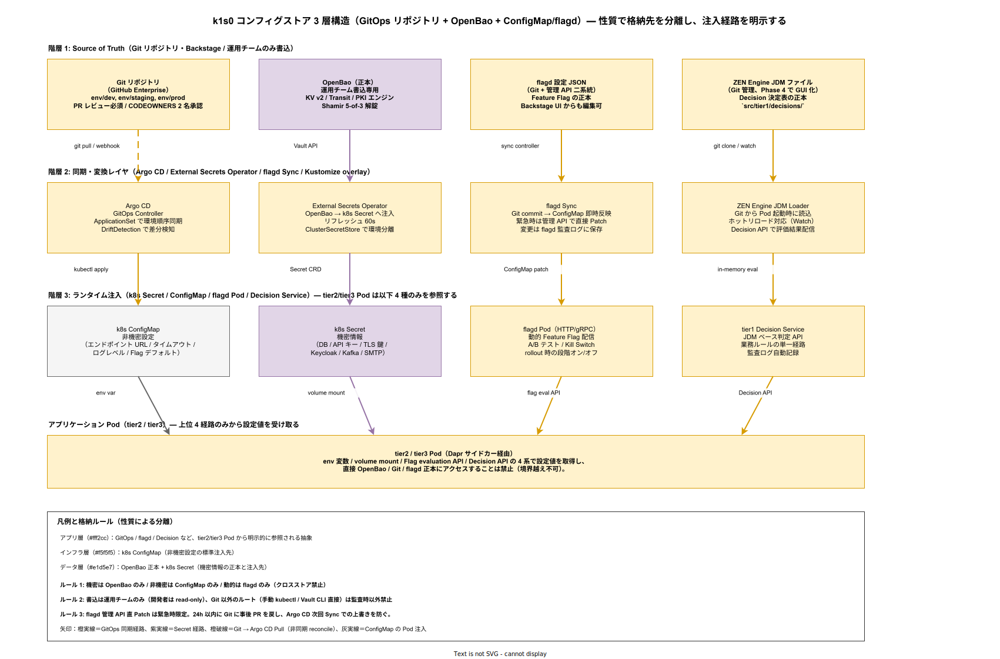

# 03. 環境構成管理方式

本ファイルは k1s0 の開発・検証・本番・災害復旧（DR）の各環境を独立管理しつつ、設定差分を最小化して再現性を確保する環境構成管理の設計を規定する。要件定義 [40_運用ライフサイクル/03_環境構成管理.md](../../03_要件定義/40_運用ライフサイクル/03_環境構成管理.md) の OR-ENV-001〜006 に 1:1 で対応する。

## 本章の位置付け

採用側組織の情シス基盤で最も頻発する事故は「本番でだけ起きる不具合」「設定ドリフト」「手動変更による再現不能」の 3 種である。これらは全て環境構成管理の不備から生じる。採用検討で約束した SLA 99% / RTO 4h を運用局面で守るには、本番環境の状態が Git リポジトリと完全に一致し、いかなる変更も Git 経由でしか入らない仕組みを構造的に担保する必要がある。

本章では環境を dev / staging / prod の 3 つ（採用後の運用拡大時 で dr を追加）に分割し、各環境を namespace 分離と VPC 分離で独立させる設計を規定する。同時に、本番同等性を staging で維持することで「本番でだけ起きる不具合」を構造的に潰す。変更管理は GitOps（Argo CD）一本に絞り、kubectl 直接操作は監査記録付き緊急時のみ許容する。この設計により、採用側の小規模運用でも環境ドリフトが発生しない仕組みを実現する。

## 環境分離の方針

k1s0 の環境は 3 つに分ける。dev は開発者の日常作業用、staging はリリース前検証用、prod は本番稼働用である。採用後の運用拡大時 で dr（災害復旧）環境を追加するが、リリース時点〜採用初期 段階では除外する。これは リリース時点 時点では単一データセンター運用で RTO 4h を達成可能であり、DR 環境は企画予算に含まれていないためである。

各環境は namespace レベルで分離し、さらに Kubernetes クラスタレベルでも分離する。namespace 分離だけでは「開発者の誤操作で本番 Pod に kubectl delete を打つ」リスクを排除できず、RBAC 設定ミスが即座に本番事故に直結する。クラスタ分離を並用することで、誤操作の影響範囲を環境内に閉じ込める。

環境ごとのリソース規模は、dev が 3 VM（最小構成）、staging が 3 VM（prod と同等構成だが縮小）、prod が 3〜6 VM（負荷に応じて拡張）となる。staging は prod と同じ OSS バージョン・同じ Operator 構成を維持し、唯一差があるのはレプリカ数とテナント数のみとする。これが「本番同等性」である。

ネットワーク分離は VLAN または VPC で行う。dev / staging / prod は相互に直接通信できず、必要な連携（例: staging → prod への参照データ取得）は明示的な Firewall ルールで許可する。これは構想設計 [../05_法務とコンプライアンス/](../../02_構想設計/05_法務とコンプライアンス/) のゼロトラスト原則に沿う。

以下に環境分離の全体像を示す。

## 環境昇格のパイプライン

変更は必ず dev → staging → prod の順で昇格する。飛び越しは禁止する。飛び越しを禁止する理由は、staging を経由せず prod に入った変更は「本番でだけ起きる不具合」のリスク源となり、過去に他社で発生した本番事故の大半がこのパターンに該当するためである。

dev への昇格は完全自動化する。開発者が feature ブランチを main にマージすると、GitHub Actions が CI パイプライン（lint・test・build・security scan・SBOM 生成）を実行し、Pass 後に自動で dev へデプロイする。ここまでの所要時間は目標 15 分以内である。

staging への昇格は半自動である。main ブランチから release ブランチを切ると、同等の CI が走り、Pass 後に staging へ自動デプロイされる。デプロイ後、staging で 24 時間の統合テスト（自動）とスモークテスト（手動 30 分）を実施する。この 24 時間はスケジュールされたバッチ処理・夜間処理が走るため、時間依存の不具合を検知する目的がある。

prod への昇格は手動承認必須である。staging での検証完了後、release ブランチから prod タグを切り、Argo CD の Manual sync で本番反映する。Manual sync の承認者は起案者または協力者のいずれかとし、両者の合議が望ましいが、緊急時は単独承認を許容する。承認の記録は Argo CD の監査ログに残る。

採用初期 段階では release ブランチ戦略ではなく GitOps の環境別リポジトリ（env/dev, env/staging, env/prod）を採用する。これは GitFlow の運用負荷を下げるための判断である。採用後の運用拡大時 で環境数が増えた段階で GitFlow への移行を再検討する。

## 変更管理: GitOps 単一経路

変更管理の要諦は「Git が唯一の真実である（Single Source of Truth）」である。本番環境の全ての設定は Git リポジトリから派生し、Argo CD が Git の状態を本番クラスタに常時同期する。この原則を徹底することで、誰がいつ何を変更したかが Git ログで完全に追跡可能となり、監査要件（J-SOX、電帳法）を満たす。

kubectl 直接操作は原則禁止する。禁止対象には `kubectl apply`、`kubectl edit`、`kubectl scale`、`kubectl patch` が含まれる。これらは Argo CD の自動 Sync と競合し、設定ドリフトの温床となる。参照系コマンド（`kubectl get`、`kubectl logs`、`kubectl describe`）のみ許可する。

緊急時のみ例外として kubectl 変更系コマンドを許容する。ただし、以下 3 条件を全て満たすこと: (1) SEV1 インシデント対応中であること、(2) 起案者または協力者による操作であること、(3) 操作ログが監査証跡として記録されること。緊急時操作の監査ログは kubectl プロキシ経由で自動収集し、24 時間以内に事後 PR で Git にも反映することを義務付ける。Git 反映を怠ると、次回の Argo CD Sync で緊急変更が上書きされるリスクがある。

Helm / Kustomize のテンプレート化は環境差分の最小化に使う。共通設定は base/ に、環境固有設定は overlays/{dev,staging,prod}/ に配置する。overlays の差分は「レプリカ数」「リソース上限」「環境変数（エンドポイント URL）」に限定し、ビジネスロジックに影響する設定差異は禁止する。これは「staging で動いたが prod で動かない」事故を構造的に防ぐための制約である。

## IaC（Infrastructure as Code）スタック

k1s0 の IaC は 3 層構造とする。アプリケーション層は Kubernetes マニフェスト（Helm + Kustomize）で管理し、ミドルウェア層は Operator（CloudNativePG / Strimzi / OpenBao など）を経由する CRD で管理し、インフラ層（VM / Network / Storage）は Terraform または OpenTofu で管理する。

Terraform / OpenTofu の選定は リリース時点 で確定する。Terraform は HashiCorp の BSL ライセンス変更（2023 年）で商用利用制約が生じたため、OpenTofu（Linux Foundation）への移行を検討する。ただし、採用初期 段階では既存エコシステムが豊富な Terraform を使い、リリース時点 で OpenTofu へ段階移行する。この判断は構想設計 ADR-CICD-002 に従う。

Kubernetes マニフェストは Helm Chart 形式で管理する。自作チャートは `charts/` ディレクトリに配置し、サードパーティチャート（Istio, Dapr, CloudNativePG など）は Helmfile で依存管理する。Helm の values.yaml は環境別に分割し、Kustomize で最終組み立てを行う。この組合せは業界標準であり、新規参画者の学習コストを下げる効果もある。

Operator の CRD は Git で管理する。CloudNativePG の `Cluster` リソース、Strimzi の `Kafka` リソース、OpenBao の `Vault` リソースなど、全て Git に記述して Argo CD 同期する。CRD の変更は PR レビューを必須とし、本番影響の大きい変更（レプリカ数減、ストレージサイズ変更など）は 複数名承認とする。

## コンフィグ管理

設定値は性質に応じて 3 つのストアに分離する。機密情報は OpenBao に、非機密の設定値は Kubernetes ConfigMap に、動的に切替える Feature Flag は flagd に格納する。この分離は構想設計 ADR-SEC-001（Secret 管理）と整合する。

OpenBao に格納する機密情報は、DB パスワード、API キー、TLS 秘密鍵、Keycloak クライアントシークレット、Kafka 認証情報、SMTP パスワードなどである。これらは Pod に External Secrets Operator 経由で注入され、Pod 内で環境変数または volume mount として利用される。OpenBao への書き込みは運用チームのみが実施し、開発チームは読み取り専用権限とする。

ConfigMap には、API エンドポイント URL、接続タイムアウト値、ログレベル、Feature Flag のデフォルト値を格納する。ConfigMap は Git でバージョン管理され、Argo CD 経由で反映される。

flagd は動的に切替える Feature Flag 専用である。新機能のロールアウト、A/B テスト、緊急オフ（kill switch）に使う。flagd の設定ファイルは Git 管理だが、変更は Argo CD Sync を経ずに flagd API 経由でも反映できる。これは緊急対応時のスピード優先の判断であり、変更監査は flagd 側のログで担保する。

## 環境差分の最小化

本番同等性（prod-like staging）の維持は、環境構成管理で最も重要な非機能要件である。staging と prod で「何が同じで何が違うか」を明示的にコントロールする。

同じにすべきもの: OSS バージョン、Helm Chart バージョン、Operator バージョン、Kubernetes バージョン、Network Policy、RBAC 定義、Istio Ambient 設定、Dapr Component 設定、監視設定（Alert ルール、ダッシュボード）、ログ設定（OTel Collector 設定）。

違っていて良いもの: レプリカ数（staging はコスト抑制で最小構成）、リソース制限値（staging は実負荷が低い）、テナント数（staging は合成データのみ）、エンドポイント URL（staging は内部 FQDN）、外部連携先（staging はステージング版の外部サービス）。

環境差分の検出は Argo CD の DriftDetection で自動化する。staging と prod のマニフェストを定期的に比較し、想定外の差分が生じた場合はアラートを発火する。これは「いつの間にか設定が食い違っていた」事故を検知する安全ネットである。

以下にコンフィグストアと環境差分のマトリクスを示す。

## バージョン管理と依存関係

OSS バージョンは年次で計画的に更新する。Renovate（AGPL のため 運用蓄積後導入）で Dependabot 的に PR を自動生成し、レビュー後マージする。セキュリティパッチは即時、マイナーバージョンは四半期、メジャーバージョンは年次を基本とする。

Kubernetes バージョンは LTS（Long Term Support）扱いではない（Kubernetes に LTS は存在しない）ため、N-1 ポリシーで追従する。k8s 1.30 リリース後、6 か月以内に k1s0 を 1.30 に上げる。上げる際は dev で 2 週間、staging で 2 週間検証後に prod 反映する。

Helm Chart のバージョンは Lock ファイル（Chart.lock）で固定する。勝手なバージョン変更を防ぐため、Lock ファイルの更新は Renovate 経由のみとし、手動更新は禁止する。

依存関係の全体俯瞰は SBOM（Software Bill of Materials）で管理する。SBOM は CI パイプラインで自動生成し、Backstage の Catalog に格納する。脆弱性が発見された OSS は SBOM から逆引きで利用箇所を特定し、優先的にパッチを当てる。

## 環境構築の再現性

環境構築は Runbook 化し、誰でも再現できる状態に保つ。新規環境（例: 新テナント用検証環境）の構築は、Runbook `RB-ENV-001` を実行することで 1 日以内に完了することを目標とする。

Runbook の内容は以下を含む: VM プロビジョニング（Terraform 実行）、Kubernetes クラスタ構築（kubeadm）、ネットワーク設定（Calico / Cilium）、ストレージ設定（Rook Ceph）、Istio Ambient インストール、Dapr Operator インストール、OpenBao インストール、Keycloak インストール、監視スタック（Grafana LGTM）インストール、Argo CD インストール、アプリケーションデプロイ（Argo CD 経由）。

再現性の検証は四半期に 1 回、dev 環境を完全再構築することで行う。再構築に 1 日以上かかる場合は手順に問題があると判断し、Runbook を改善する。これは「災害時に本当に再現できるか」の予行演習でもある。

## 非機能要件 NFR-C-ENV / NFR-C-MGMT との接続

前段で定めた環境分離・GitOps・IaC・コンフィグ管理は、IPA 非機能要求グレード「C. 運用・保守性」の環境構成要件（NFR-C-ENV-001 / NFR-C-ENV-002）と運用管理方針要件（NFR-C-MGMT-001 / NFR-C-MGMT-002 / NFR-C-MGMT-003）を具体化する。これら 5 要件は要件定義書で独立した受け入れ基準を持つため、以降 5 つの設計項目で明示的に対応する。

**設計項目 DS-OPS-ENV-007 3 環境構成（dev / staging / prod）の本番同等性維持**

NFR-C-ENV-001（dev はローカル docker-compose / kind、staging は本番と同構成でスケール 1/3、prod は本番）の受け入れ基準に対する実装である。staging と prod で差があってよいのはレプリカ数（staging は prod の 1/3 目安）・リソース制限値・テナント数・エンドポイント URL・外部連携先の 5 項目に限定し、それ以外（OSS バージョン、Helm Chart バージョン、Operator バージョン、Kubernetes バージョン、Network Policy、RBAC、Istio Ambient 設定、Dapr Component、監視設定）は Argo CD の DriftDetection で差分検知する。dev のローカル環境構築は `make dev-up` 1 コマンドで 30 分以内に完了する Backstage Software Template を提供し、新規参画者の On-Ramp Time を短縮する。Argo CD の ApplicationSet で staging → prod の順序同期を厳格化し、staging で 24 時間の連続稼働検証を通過しない変更は prod に届かない構造的ガードとする。

**設計項目 DS-OPS-ENV-008 運用ドキュメント鮮度 90%（NFR-C-ENV-002）の測定と維持**

NFR-C-ENV-002（リリース時点 で対応コードから 30 日以内に更新されたドキュメント割合 90% 以上）への対応である。Backstage TechDocs と Git の両方のメタデータ（last-commit-date）を突合し、対応コード（例: tier1 API 実装のファイル）が更新されてから関連ドキュメントの最終更新日までの経過日数を自動計測するジョブを週次で動かす。経過日数 30 日を超えるドキュメントは Backstage ダッシュボードに赤色で表示し、四半期のドキュメント鮮度レビューで改訂または DEPRECATED マーク付与を Product Council に諮る。鮮度指標は Grafana ダッシュボードで可視化し、目標 90% に対して月次トレンドを追跡する。この仕組みにより、「新規参加者の立ち上がりが遅れる属人化」を構造的に防ぐ。

**設計項目 DS-OPS-ENV-009 tier1 基盤設定の Git 管理と Audit 記録（NFR-C-MGMT-001）**

NFR-C-MGMT-001（Dapr Component YAML、Feature Flag、Decision 決定表、Binding 設定の全 Git 管理、Argo CD 同期、PR レビュー必須、Audit API 記録）への対応である。`src/tier1/` 配下のディレクトリ構造を `components/`（Dapr）、`bindings/`（Input/Output）、`secrets/`（OpenBao ポリシー）、`rbac/`（Keycloak）、`policy/`（Istio）の 5 サブディレクトリに統一し、全ファイル変更は CODEOWNERS で指定した 複数名承認を GitHub Branch Protection で強制する。Argo CD 同期後、変更イベントは tier1 Audit API（FR-T1-AUDIT-001）へ Webhook で送信し、監査証跡として PostgreSQL + MinIO の 3 層に記録する。これにより「誰がいつ何を変えたか」の追跡を Git log と Audit API の二重冗長で担保する。

**設計項目 DS-OPS-ENV-010 Feature Flag と Decision 決定表の Git 管理と履歴可視化（NFR-C-MGMT-002）**

NFR-C-MGMT-002（flagd JSON / JDM ファイルを `src/tier1/flags/`・`src/tier1/decisions/` で Git 管理、Backstage で履歴可視化）への対応である。flagd の設定 JSON は Git commit を即座に Argo CD が検知して flagd Pod の ConfigMap を更新し、ZEN Engine の JDM（JSON Decision Model）ファイルも同じ流儀で管理する。Backstage の Feature Flag プラグインは Git のコミット履歴を git API 経由で参照し、「いつ・誰が・どの Flag を On/Off にしたか」を時系列で表示する。採用側の全社展開期 以降の JDM エディタ化（要件定義書 FR-T1-DECISION-005）でも、編集結果は必ず Git commit を生成する設計とし、GUI 操作でも監査証跡を失わない。これは業務ルール改ざんの監査検知を構造的に可能にする。

**設計項目 DS-OPS-ENV-011 SBOM 生成率 100%（NFR-C-MGMT-003）と Cosign 署名**

NFR-C-MGMT-003（リリース時点 で SBOM 生成率 100%、CycloneDX / SPDX 形式、Cosign 署名）への対応である。CI パイプライン（GitHub Actions）で全コンテナイメージビルド直後に `syft` で CycloneDX 形式 SBOM を生成し、`cosign attest` で OIDC トークンベース署名（Keyless Signing）を行い、OCI Registry に attestation として添付する。Backstage の SBOM プラグインは各サービスの最新 SBOM を一覧表示し、脆弱性スキャン結果（`grype` で SBOM 経由の CVE 検索）を併記する。Critical CVE 発見時は、SBOM の逆引きで全影響サービスを一覧化し、NFR-C-MNT-002 の「48 時間以内パッチ適用」の対象を即座に特定できるようにする。これにより採用検討で約束した「脆弱性初動 48 時間」の運用が実現可能となる。

## DR 相当ゼロスタート再構築リハーサル

環境構築 Runbook は一度書いて終わりではなく、定期的に「リハーサル」を通じて手順の陳腐化を検知する。OSS バージョンアップ・ネットワーク設定変更・Operator 仕様変更は Runbook を黙って陳腐化させ、災害時に「書いてある手順通りに動かない」事態を招く。四半期の dev 再構築だけでは「既存 VM 基盤を流用した短縮手順」が回るに留まり、VM 調達からやり直す完全ゼロスタートの検証にならない。

**設計項目 DS-OPS-ENV-012 DR 相当ゼロスタート再構築リハーサル**

四半期 1 回の dev 完全再構築（DS-OPS-ENV-006 の一部）とは別に、半期に 1 回、空 VM からの完全ゼロスタート再構築を別クラスタで実施する。想定時間は 1 営業日以内（8 時間）で、超過時は Runbook 改善課題を Jira 起票する。リハーサル実施時は起案者または協力者がストップウォッチで各ステップの所要時間を計測し、Backstage TechDocs の `env-rebuild-rehearsal-log` に結果を記録する。リリース時点 までに初回実施、運用蓄積後は半期定期化する。本設計は、要件 ID 索引（docs/03_要件定義/80_トレーサビリティ/01_要件ID索引.md）で亡霊 ID として記録されている OR-ENV-007 の「環境再現性の証拠積み上げ」範囲を先行して充足し、採用後の運用拡大時 で追加される DR 環境構築（NFR-A-DR 系）の前倒し検証も兼ねる。

## 設計 ID 一覧

| 設計 ID | 項目 | 対応要件 | 確定段階 |
| --- | --- | --- | --- |
| DS-OPS-ENV-001 | 環境 3 種（dev/staging/prod）分離 | OR-ENV-001 | リリース時点 |
| DS-OPS-ENV-002 | 環境昇格パイプライン | OR-ENV-002 | リリース時点 |
| DS-OPS-ENV-003 | GitOps 単一経路変更管理 | OR-ENV-003 | リリース時点 |
| DS-OPS-ENV-004 | IaC 3 層スタック | OR-ENV-004 | リリース時点 |
| DS-OPS-ENV-005 | コンフィグ 3 ストア分離 | OR-ENV-005 | リリース時点 |
| DS-OPS-ENV-006 | 環境差分最小化と再現性検証 | OR-ENV-006 | リリース時点 |
| DS-OPS-ENV-007 | 3 環境構成の本番同等性維持 | NFR-C-ENV-001 | リリース時点 |
| DS-OPS-ENV-008 | 運用ドキュメント鮮度 90% 測定 | NFR-C-ENV-002 | リリース時点 |
| DS-OPS-ENV-009 | tier1 基盤設定 Git 管理と Audit 記録 | NFR-C-MGMT-001 | リリース時点 |
| DS-OPS-ENV-010 | Feature Flag / Decision の Git 管理と履歴可視化 | NFR-C-MGMT-002 | リリース時点 |
| DS-OPS-ENV-011 | SBOM 生成率 100% と Cosign 署名 | NFR-C-MGMT-003 | リリース時点 |
| DS-OPS-ENV-012 | DR 相当ゼロスタート再構築リハーサル | OR-ENV-007（亡霊 ID 補完） | リリース時点 |

## 対応要件一覧

本章は要件定義書の以下エントリに対応する。OR-ENV-001（環境分離）、OR-ENV-002（環境昇格）、OR-ENV-003（変更管理 GitOps）、OR-ENV-004（IaC）、OR-ENV-005（コンフィグ管理）、OR-ENV-006（差分最小化）、OR-ENV-007（要件 ID 索引で亡霊 ID として是正された欠番範囲。本章では DR 相当ゼロスタートリハーサルの補完設計でカバーする）。加えて NFR-C-ENV-001（3 環境構成）、NFR-C-ENV-002（ドキュメント鮮度 90%）、NFR-C-MGMT-001（設定 Git 管理）、NFR-C-MGMT-002（Feature Flag / Decision の Git 管理）、NFR-C-MGMT-003（SBOM 生成率 100%）にも直接対応する。NFR-C-OPS-003（構成管理自動化）、NFR-E-MON-008（設定変更監査）、NFR-H-AUD-001（監査証跡）と連動する。
