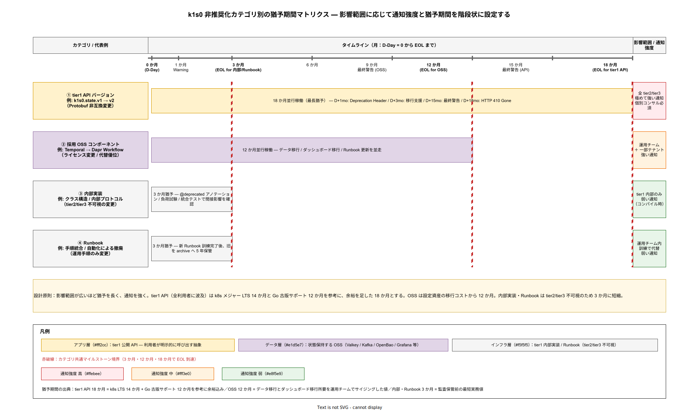
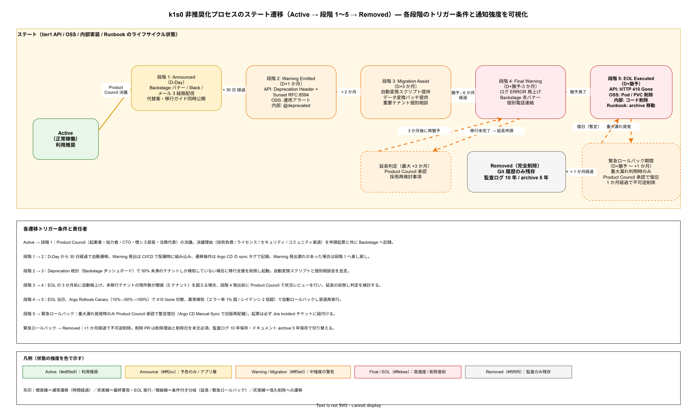

# 04. 非推奨と EOL 方式

本ファイルは k1s0 の tier1 API バージョン、採用 OSS、内部実装、Runbook を段階的に廃止し、利用者に混乱を与えずに EOL（End of Life）まで導く非推奨プロセスの設計を規定する。要件定義 [40_運用ライフサイクル/04_非推奨とEOL.md](../../03_要件定義/40_運用ライフサイクル/04_非推奨とEOL.md) の OR-EOL-001〜006 に 1:1 で対応する。

## 本章の位置付け

プラットフォームは一度公開した API や採用 OSS を永久に保守するわけにはいかない。技術負債の蓄積、セキュリティリスクの増大、運用コストの肥大化を防ぐため、計画的な廃止は不可避である。しかし JTC 情シス基盤の利用者は長期安定稼働を前提に tier2 / tier3 を構築しているため、唐突な廃止は業務停止を引き起こす。稟議で約束した「長期安定運用」と「技術負債抑制」の両立には、非推奨化の事前予告と十分な猶予期間が必須である。

本章では廃止対象ごとに異なる猶予期間を設定し、Deprecation Warning の段階的通知、移行支援ツールの提供、EOL 後の扱いを体系化する。この設計により、利用者は廃止タイミングを予測可能にし、k1s0 運用チームは技術負債を計画的に解消できる状態を両立する。

## 非推奨化の対象分類

非推奨化の対象は 4 カテゴリに分類する。カテゴリごとに猶予期間と通知強度を変える理由は、廃止の影響範囲と代替作業量が異なるためである。

### tier1 API バージョン

tier1 API（k1s0.State / k1s0.PubSub / k1s0.Secrets / ... の 11 API）のバージョンアップで非互換変更が必要な場合、旧バージョンを非推奨化する。API 非推奨化の影響は全 tier2 / tier3 アプリに及ぶため、猶予期間は最長の 18 か月とする。18 か月は Kubernetes のメジャーバージョンサポート期間（14 か月）と Go の古いバージョンサポート期間（12 か月）を参考に、余裕を持たせた数値である。

API バージョニングは Protobuf パッケージのバージョン接尾辞で表現する（例: `k1s0.state.v1`, `k1s0.state.v2`）。旧バージョンと新バージョンは 18 か月間並行稼働し、猶予期間中に tier2 / tier3 開発チームが段階的に移行する。

### OSS コンポーネント

OSS の廃止・代替（例: Temporal → Dapr Workflow 一本化、Grafana → 別ツール移行）は、運用チームの習熟度と設定資産の移行コストに影響する。猶予期間は 12 か月とする。新旧 OSS の並行稼働期間を含み、データ移行・ダッシュボード移行・Runbook 更新を段階的に進める。

OSS 廃止の判断は Product Council で行う。判断理由は「ライセンス変更（AGPL 追加、BSL 化）」「セキュリティ問題の長期化」「後継 OSS の優位性」「コミュニティ衰退」のいずれかを明示する。

### 内部実装

tier1 の内部実装（クラス構造、データスキーマ、プロトコルなど）で tier2 / tier3 に影響しない変更は、短い猶予期間で廃止可能である。猶予期間は 3 か月とする。内部実装は tier2 / tier3 から不可視であり、影響範囲が tier1 内部に閉じるため、長期猶予は不要である。

ただし、内部実装変更が間接的に tier2 / tier3 のパフォーマンスや挙動に影響する可能性があるため、事前に負荷試験と統合テストで影響を確認する。

### Runbook

Runbook の廃止（手順統合、自動化による手動 Runbook の不要化）は、運用チームの訓練内容に影響する。猶予期間は 3 か月とする。廃止前に新 Runbook での訓練を完了し、旧 Runbook は「アーカイブ」扱いで Backstage 内に保管する（監査証跡として 5 年保管）。

以下に非推奨化の対象カテゴリと猶予期間を示す。

## 非推奨化のプロセス

非推奨化は 5 段階プロセスで進める。各段階で利用者への通知・代替案の提示・移行支援を段階的に強める設計である。

### 段階 1: アナウンス（D-Day）

廃止方針を Product Council で決議し、利用者へ初回アナウンスを行う。アナウンスは Backstage ポータルのバナー、Slack の #k1s0-announce、メール配信の 3 経路で同時配信する。アナウンス内容には以下を含む: 廃止対象、廃止理由、代替案、EOL 予定日、移行ガイド URL、問合せ先。

この段階では利用者の作業は不要であり、情報提供に留まる。ただし、利用者が自発的に移行準備を開始できるよう、代替案と移行ガイドは初回アナウンス時点で公開する。

### 段階 2: Deprecation Warning 開始（D-Day + 1 か月）

廃止対象の利用時に Warning を発出する。Warning の発出手段は対象により異なる: tier1 API は Response Header `Deprecation: true` と `Sunset: <EOL 日>` を付与し、ログに警告を出力、Backstage の利用状況ダッシュボードで可視化。OSS は運用チーム向けアラートを追加し、利用状況を可視化。内部実装はコード内に `@deprecated` アノテーションを付与し、コンパイル時警告を出す。

Warning 開始により、利用者は「自分のアプリがこの非推奨機能に依存しているか」を自覚できる状態になる。Backstage の利用状況ダッシュボードでは、テナント別・アプリ別の利用量を表示し、移行優先度を判断できるようにする。

### 段階 3: 移行支援（D-Day + 3 か月）

移行ガイドドキュメント、マイグレーションツール（可能な場合）、個別コンサルティング（重要テナント向け）を提供する。マイグレーションツールは、API の場合は自動変換スクリプト（例: Protobuf スキーマの差分を検出して生成コードを書き換える）、データの場合はデータ変換バッチ、設定の場合は設定変換ツールを含む。

個別コンサルティングは、テナントからの個別相談を受け付ける枠組みである。起案者または協力者が相談会を月 2 回開催し、移行の具体的な質問に答える。この枠組みは、稟議で約束した「伴走型サポート」の一部として位置付けられる。

### 段階 4: 最終警告（D-Day + 猶予期間 - 3 か月）

EOL の 3 か月前に最終警告を発出する。この段階では Warning のログレベルを ERROR に格上げし、Backstage ダッシュボードに赤色バナーを表示する。移行未完了のテナントには個別にメール + 電話で連絡し、移行計画の確認を行う。

最終警告後も移行未完了のテナントがある場合、Product Council で延長判断を行う。延長は原則 3 か月までとし、それ以上の延長は認めない。延長の影響（運用コスト増、技術負債残存）は稟議再承認事項とする。

### 段階 5: EOL 実施（D-Day + 猶予期間）

EOL 当日、廃止対象を無効化する。tier1 API は HTTP 410 Gone を返却する。OSS は運用停止し、関連リソース（Pod、PVC、Secret）を削除する。内部実装はコードから削除する。Runbook はアーカイブフォルダに移動する。

EOL 後 1 か月間は「緊急ロールバック期間」とし、重大な移行漏れが発覚した場合に限り、Product Council 承認のもとで一時的に復旧する。1 か月経過後は完全削除し、復旧不可となる。

以下に 5 段階プロセスのタイムラインを示す。

## Deprecation Warning の具体仕様

Warning の仕様を曖昧にすると、利用者が気付かず EOL を迎えるリスクが高まる。k1s0 では以下の仕様を固定する。

tier1 API の Warning は HTTP Response Header で通知する。`Deprecation: true` は恒久的な非推奨を示し、`Sunset: Wed, 01 Apr 2027 00:00:00 GMT` は EOL 予定日を示す（RFC 8594 準拠）。同時に `Link` ヘッダで移行ガイドへの URL を提供する（rel="deprecation"）。

`Deprecation: true
Sunset: Wed, 01 Apr 2027 00:00:00 GMT
Link: <https://backstage.example.jp/docs/deprecation/state-v1>; rel="deprecation"`

ログ出力は構造化ログ（JSON）で以下を含める: `level: warn`, `event: deprecated_api_called`, `api: k1s0.state.v1.StateService.Get`, `sunset_date: 2027-04-01`, `tenant_id: <利用テナント>`, `app_id: <利用アプリ>`, `migration_guide: <URL>`。これにより Loki で集計し、移行進捗を測定できる。

Backstage のダッシュボードでは、テナント別・アプリ別の非推奨 API 利用回数を棒グラフで表示する。利用量が多いテナントにはメールでリマインダを自動送信する（月次）。

## 移行支援の具体手段

移行支援は利用者の手間を最小化する設計である。手動書き換えに頼ると、大規模テナントの移行が進まず、EOL 延期の圧力が増す。k1s0 では可能な限り自動化する。

API マイグレーションは、Protobuf スキーマの差分から自動変換スクリプトを生成する。新旧スキーマを比較し、フィールドのリネーム・型変更・パラメータ追加を自動検出して、tier2 / tier3 のコード修正スニペットを提示する。完全自動化は不可能な変更（セマンティクスが変わる変更）については、手動修正が必要な箇所をハイライトする。

データマイグレーションは、旧フォーマットのデータを新フォーマットに変換するバッチを提供する。変換は冪等であること、停止・再開可能であること、進捗が可視化されることを設計要件とする。大規模テナント（100 万件以上）では、夜間バッチで段階的に変換する。

設定マイグレーションは、Kubernetes マニフェスト（YAML）の自動変換ツールを提供する。旧 CRD 仕様から新 CRD 仕様への変換を行い、PR を自動生成する。利用者は PR をレビューしてマージするだけで設定移行が完了する。

## EOL 後の扱い

EOL 後の削除は徹底するが、監査証跡は残す。電帳法・J-SOX の要請により、過去の運用記録は 5〜10 年保管する必要があるため、以下のルールを適用する。

コード削除: EOL 後 1 か月でコードから完全削除する。削除は PR で行い、削除理由と削除日を PR 本文に記載する。Git 履歴は永続保持されるため、過去のコードは必要時に遡れる。

ドキュメントアーカイブ: 関連ドキュメント・Runbook は Backstage の archive フォルダに移動する。検索対象からは除外するが、直接 URL でアクセス可能な状態に保つ。保管期間は 5 年間とする。

監査ログ保持: 非推奨 API の利用履歴、EOL 決定の稟議記録、Product Council 議事録は監査ログとして 10 年保管する。保管先は Loki の cold storage 層（MinIO）とする。

関連設定削除: Kubernetes リソース（Deployment, Service, ConfigMap, Secret）は Argo CD 経由で自動削除される。手動残存物（PVC, 外部 DNS レコード）の削除チェックリストを Runbook 化する。

## OSS 廃止時のリスク評価

OSS を廃止する際は、以下 4 軸でリスクを評価する。評価結果が「高リスク」となった OSS は、廃止前に追加の緩和策を講じる。

セキュリティリスク: 廃止後の OSS に未パッチの脆弱性が残り、システム全体のリスク源となる可能性。緩和策は代替 OSS への完全移行を EOL 前に完了すること。

ライセンスリスク: 廃止した OSS を含む Docker イメージを配布し続けるとライセンス義務が残る。緩和策は廃止時にイメージから除去し、過去のイメージは archive に移す。

代替難易度: 代替 OSS が機能的に同等でない場合、一部機能が失われるリスク。緩和策は代替 OSS で満たせない機能を特定し、自作または別 OSS で補完する。

運用スキル: チームの習熟度が廃止 OSS に偏っている場合、代替 OSS の運用に時間がかかる。緩和策は移行期間中に代替 OSS の訓練を実施する。

以下に OSS 廃止のリスク評価マトリクスを示す。

| リスク軸 | 判定指標 | 高リスク時の緩和策 |
| --- | --- | --- |
| セキュリティ | 未パッチ CVE 件数 × CVSS スコア、最終リリースからの経過月数（12 か月超で高リスク） | 代替 OSS への完全移行を EOL 前に完了、並行稼働期間中は WAF / 外部境界で遮断 |
| ライセンス | 既配布イメージ数、AGPL 等の残存義務あり（配布継続で義務継続） | 廃止時にイメージ除去、archive registry へ移動、SBOM 自動再生成 |
| 代替難易度 | 機能カバー率（90% 未満で高リスク）、API 互換性有無 | 差分機能を自作補完、または別 OSS で補完、テストハーネスを増強 |
| 運用スキル | チーム内習熟者数（1 名のみは高リスク）、Runbook 整備状況 | 2 週間の集中訓練、ペアオペレーション期間 4 週間、Runbook 15 本整備 |

## 保守運用 NFR-C-MNT 系との接続

前節までに定めた非推奨化プロセスは、IPA 非機能要求グレード C2. 保守運用の 3 要件（NFR-C-MNT-001 / 002 / 003）に直接接続する。いずれも計画停止・OSS 追従・API 互換という「保守の時間軸」に関わるため、非推奨化プロセスの中に設計項目として位置付ける必要がある。

**設計項目 DS-OPS-EOL-007 計画停止ウィンドウの固定と zero-downtime 標準化**

NFR-C-MNT-001（計画停止は土曜 22:00〜日曜 6:00 の 8 時間ウィンドウに限定、業務時間内停止は原則禁止、Argo Rollouts による zero-downtime デプロイ標準化）への対応である。EOL 実施（5 段階プロセスの段階 5）は原則としてこの週末メンテナンスウィンドウで実行し、tier1 API 廃止の場合は「旧 API エンドポイントを HTTP 410 Gone に切り替える Argo Rollouts Canary」を 10%→50%→100% で段階実行する。Canary 中に異常検知（エラー率 1% 超、レイテンシ 2 倍超）があれば自動ロールバックし、翌週の再実行に回す。計画停止実績（月次）は停止回数・停止時間・影響テナント数を Grafana で可視化し、tier2/tier3 部門への月次レポートに含める。緊急 EOL（Critical CVE に起因する即時停止）は NFR-C-MNT-002 の 48 時間ルールを優先するが、事前告知を Backstage Announce と電話で代替する。

**設計項目 DS-OPS-EOL-008 OSS バージョン追従と Critical CVE 48 時間ルール**

NFR-C-MNT-002（Renovate 自動 PR、Critical CVE 48 時間以内、High 1 週間、Medium 以下月次、Critical 対応率 90% 以上）への対応である。Renovate は GitHub Actions でスケジュール実行（毎日 3:00 UTC）し、OSS の新バージョン・CVE 情報を PR として自動生成する。PR には CVE 識別子・CVSS スコア・修正版・影響範囲（SBOM 逆引き結果）を自動コメントし、SRE は CHANGELOG を確認して approve する。Critical CVE（CVSS 9.0 以上）は PagerDuty で即時通知され、48 時間カウントダウンタイマーを起動する。Argo CD が staging → prod の順で同期し、staging で 2 時間のスモークテスト後に prod 自動反映する。OSS 非推奨化の文脈では、Renovate が「サポート終了版」を検出した場合も EOL プロセスのトリガとして扱い、本章の段階 1（アナウンス）に自動遷移させる。PR から approve までのリードタイムは Grafana で可視化し、Critical 48 時間・High 1 週間の遵守率を月次レポートする。

**設計項目 DS-OPS-EOL-009 tier1 公開 API の後方互換方針と Buf breaking 検出**

NFR-C-MNT-003（tier1 公開 API は Phase 1〜2 では minor を越えた後方互換破壊を発生させない、DEPRECATED マーク → 3 か月猶予 → 削除の段階手順、Buf breaking 検出で CI ブロック）への対応である。tier1 API の Protobuf 契約（`proto/k1s0/*.proto`）は Buf の `buf breaking` コマンドを CI（GitHub Actions）で全 PR に対して実行し、後方互換破壊が検出されたらマージをブロックする。破壊変更が業務上不可避な場合、本章の 5 段階プロセスに乗せて v1 → v2 パッケージ移行を 18 か月猶予で実施する（tier1 API バージョン 18 か月猶予と整合）。ただし NFR-C-MNT-003 の DEPRECATED 3 か月猶予は、tier1 API 以外（OSS、内部実装、Runbook）にも波及するため、本章のカテゴリ別猶予期間（API 18 か月 / OSS 12 か月 / 内部実装・Runbook 3 か月）を NFR-C-MNT-003 のベースライン 3 か月に上書きする形で適用する。互換破壊は Product Council で重大改訂として承認記録し、ステークホルダー（tier2/tier3 代表者）の書面承認を稟議起票の前提条件とする。

## 設計 ID 一覧

| 設計 ID | 項目 | 対応要件 | 確定フェーズ |
| --- | --- | --- | --- |
| DS-OPS-EOL-001 | 非推奨化対象 4 カテゴリ | OR-EOL-001 | Phase 1b |
| DS-OPS-EOL-002 | 5 段階非推奨プロセス | OR-EOL-002 | Phase 1b |
| DS-OPS-EOL-003 | Deprecation Warning 仕様 | OR-EOL-003 | Phase 1b |
| DS-OPS-EOL-004 | 移行支援ツール提供 | OR-EOL-004 | Phase 1c |
| DS-OPS-EOL-005 | EOL 後の扱いと監査保持 | OR-EOL-005 | Phase 1c |
| DS-OPS-EOL-006 | OSS 廃止リスク評価 | OR-EOL-006 | Phase 1c |
| DS-OPS-EOL-007 | 計画停止ウィンドウと zero-downtime 標準化 | NFR-C-MNT-001 | Phase 1b |
| DS-OPS-EOL-008 | OSS バージョン追従と Critical CVE 48h ルール | NFR-C-MNT-002 | Phase 1b |
| DS-OPS-EOL-009 | tier1 API 後方互換と Buf breaking 検出 | NFR-C-MNT-003 | Phase 1b |

## 対応要件一覧

本章は要件定義書の以下エントリに対応する。OR-EOL-001（非推奨対象）、OR-EOL-002（非推奨プロセス）、OR-EOL-003（Warning 通知）、OR-EOL-004（移行支援）、OR-EOL-005（EOL 後扱い）、OR-EOL-006（OSS 廃止リスク）。加えて NFR-C-MNT-001（計画停止ウィンドウ）、NFR-C-MNT-002（OSS バージョン追従）、NFR-C-MNT-003（API 互換方針）にも直接対応する。NFR-H-LIC-001（OSS ライセンス管理）、NFR-H-AUD-001（監査証跡 10 年保管）と連動する。
