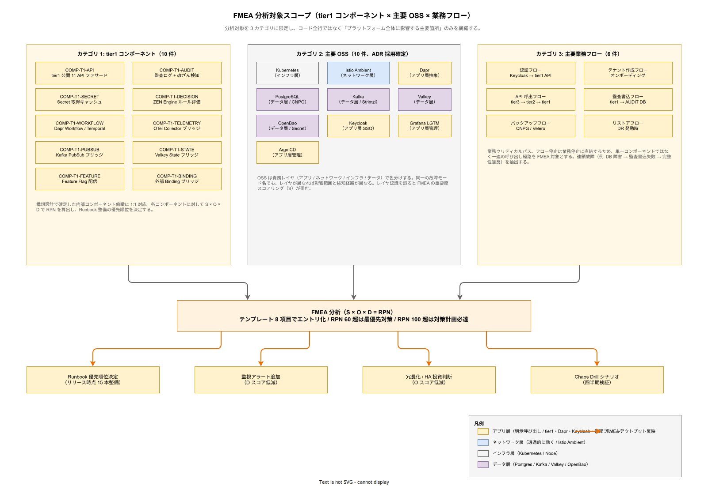
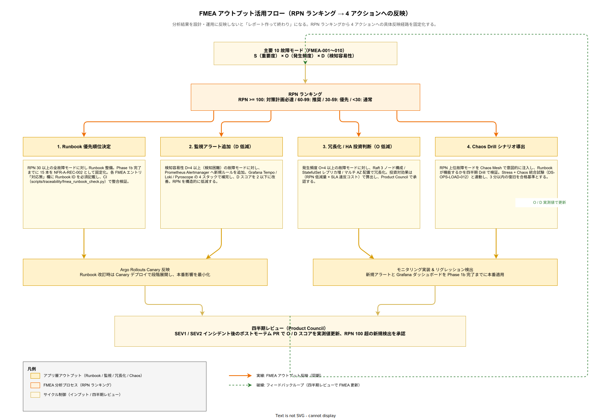

# 06. FMEA 分析方式

本ファイルは k1s0 の tier1 コンポーネント、主要 OSS、主要業務フローに対する FMEA（Failure Mode and Effects Analysis、故障モード影響解析）の実施方式と、主要故障モードの対応策を規定する。要件定義 [40_運用ライフサイクル/](../../03_要件定義/40_運用ライフサイクル/) 配下の信頼性要件（NFR-A-CONT / NFR-A-REC）と連動する。

## 本章の位置付け

プラットフォームの信頼性設計において、事前に故障モードを網羅列挙することは、事後対応の Runbook を整備する前提である。「どんな故障が起きうるか」を分析せずに Runbook だけ書いても、重大な故障モードが Runbook 不整備のまま残ってしまう。稟議で約束した SLA 99% / SLO 99.9% / RTO 4h を運用局面で守るには、想定故障の網羅と優先順位付けが先行して完了している必要がある。

FMEA は製造業・航空宇宙業で確立された故障分析手法で、「故障モード（どう壊れるか）」「影響（何が起きるか）」「原因（なぜ起きるか）」「検知方法（どう気付くか）」「対応策（どう対処するか）」を体系的に列挙する。各項目に重要度・発生頻度・検知容易性のスコアを付与し、RPN（Risk Priority Number）で優先順位を決める。本章ではこの手法を k1s0 のコンポーネントと OSS に適用し、Runbook 整備の優先順位を導出する。

## FMEA の対象範囲

FMEA の対象を明確化する。全てのコード行を対象にすると分析コストが膨大になり、実施できないリスクがある。k1s0 では以下 3 カテゴリに絞って FMEA を実施する。

tier1 コンポーネント: tier1 を構成する各コンポーネント（COMP-T1-API、COMP-T1-AUDIT、COMP-T1-SECRET、COMP-T1-DECISION、COMP-T1-WORKFLOW など 10 コンポーネント）。構想設計で定義された内部コンポーネント俯瞰に対応する。

主要 OSS: Kubernetes、Istio Ambient、Dapr、PostgreSQL、Kafka、Valkey、OpenBao、Keycloak、Grafana LGTM、Argo CD。これらは構想設計 ADR で採用確定した OSS であり、障害が k1s0 全体に影響する。

主要業務フロー: 認証フロー、テナント作成フロー、API 呼出フロー、監査書込フロー、バックアップフロー、リストアフロー。これらは業務クリティカルパスであり、停止が業務停止に直結する。

以下に FMEA 対象の全体像を示す。

## FMEA の実施項目

FMEA のテンプレートとして以下 8 項目を全エントリに記載する。テンプレート固定は分析の網羅性と比較容易性を確保する。

**故障モード**: コンポーネント・OSS・フローがどのように失敗するかの具体表現。抽象的表現（「エラーが起きる」）は禁止し、具体表現（「PostgreSQL Primary の Pod が OOMKilled で再起動を繰り返す」）を記述する。

**影響**: 故障が起きた場合のシステム・利用者・業務への影響。Severity（SEV1〜SEV4）で分類する。

**原因**: 故障を引き起こす根本要因。ハードウェア故障・ソフトウェアバグ・設定ミス・ネットワーク障害・外部依存の 5 カテゴリで分類する。

**検知方法**: 故障を検知する監視メカニズム。Alertmanager ルール、ヘルスチェック、利用者からの報告のいずれか（または組合せ）を記載する。

**検知時間**: 故障発生から検知までの目標時間。秒〜分単位で記述する。

**対応策**: 故障発生時の暫定対応と恒久対応。対応策には参照する Runbook ID を記載する。

**重要度（S）**: 影響の大きさを 1〜5 で評価（5 が最悪）。SEV1 は 5、SEV2 は 4、SEV3 は 3、SEV4 は 2 とする。

**発生頻度（O）** と **検知容易性（D）**: 発生頻度を 1〜5（5 が高頻度）、検知容易性を 1〜5（5 が検知困難）で評価する。過去インシデントの発生回数と検知チャネル有無で算出する。

RPN（Risk Priority Number） = S × O × D で算出する。RPN が 60 を超える故障モードは最優先対策対象、30〜60 は優先対策対象、30 未満は通常対応とする。

## 主要 FMEA エントリ

以下に k1s0 で最も重要な 10 件の FMEA エントリを記載する。四半期レビューで更新し、新規機能追加時にも追加するが、Phase 0 稟議段階では以下の 10 件を Phase 1c までに完全整備することをコミットする。

### FMEA-001: COMP-T1-AUDIT DB 障害

監査ログ書込先の PostgreSQL DB が停止する故障モード。影響は監査ログ喪失により、完整性要件（NFR-H-AUD-001）違反となる。原因は DB Primary Pod の OOMKilled、ディスク満杯、Replication 遅延による split brain の 3 パターンが主。検知は PostgreSQL Exporter のメトリクス（`pg_up == 0`）と tier1 側の書込エラーログで即時検知（目標 30 秒以内）。対応は CloudNativePG による自動 failover、並行して tier1 の監査書込を Kafka 経由のバッファリング経路に切替。Runbook RB-003 で手順化。S=5, O=2, D=2, RPN=20。

### FMEA-002: COMP-T1-SECRET OpenBao 全停止

Secret Store の OpenBao クラスタが全ノード停止する故障モード。影響は tier1 の全 API が Secret 取得不可となり、SEV1 全停止。原因は Raft 過半数喪失、ディスク障害、設定ミスによる sealed 状態の 3 パターン。検知は OpenBao のヘルスエンドポイント（`/v1/sys/health`）監視で 60 秒以内。対応は Raft HA 3 ノード構成により単一ノード障害は自動継続、過半数喪失時は手動 unseal 手順（Runbook RB-005）。S=5, O=1, D=2, RPN=10。

### FMEA-003: Kafka ブローカー 1 台障害

Kafka クラスタの 1 ブローカーが停止する故障モード。影響は PubSub API が一時的に遅延（3 ブローカー構成のため継続稼働可能）、SEV2 機能劣化。原因はハードウェア故障、ディスク満杯、OOMKilled。検知は Strimzi Operator のヘルスチェックと Kafka Exporter のメトリクスで 60 秒以内。対応は自動再バランス（Strimzi）、ハードウェア障害時はノード差替手順（Runbook RB-004）。S=3, O=3, D=2, RPN=18。

### FMEA-004: Keycloak 全停止

認証基盤の Keycloak が全 Pod 停止する故障モード。影響は新規ログイン不可（既存セッションは Refresh Token TTL 内なら継続）、SEV2 機能停止。原因は Keycloak DB（PostgreSQL）停止、Keycloak Pod OOMKilled、設定ミスによる起動失敗。検知は Keycloak のヘルスエンドポイント監視で 30 秒以内。対応は DB failover、Pod 再起動、Refresh Token TTL を 24 時間に設定して既存セッションの業務継続を担保（Runbook RB-006）。S=4, O=2, D=1, RPN=8。

### FMEA-005: Istio ztunnel 障害

Istio Ambient のノードローカル ztunnel が停止する故障モード。影響は該当ノード上の Pod 間通信が停止、SEV2 部分停止。原因は ztunnel Pod OOMKilled、Linux network namespace 異常、iptables ルール破損。検知は Istio Control Plane のヘルスメトリクス、アプリケーションの接続エラーログで 60 秒以内。対応は ztunnel Pod 再起動で通常 30 秒以内に復旧、継続する場合はノード再起動（Runbook RB-007）。S=3, O=3, D=3, RPN=27。

### FMEA-006: PostgreSQL Primary 障害

CloudNativePG で管理する PostgreSQL クラスタの Primary が停止する故障モード。影響は書込不可、Read Replica による参照は継続、SEV1 業務停止。原因はノード障害、ディスク障害、レプリケーション遅延による split brain。検知は CloudNativePG Operator のヘルスチェックで 30 秒以内。対応は自動 failover（目標 60 秒）、Primary 昇格 → Read Replica 接続先切替（Runbook RB-003）。S=5, O=2, D=1, RPN=10。

### FMEA-007: Valkey クラスタノード障害

State Store の Valkey クラスタ 1 ノードが停止する故障モード。影響は該当 shard の一時応答遅延、3 ノード構成のため継続稼働、SEV3。原因はハードウェア故障、メモリ枯渇、Persistence ファイル破損。検知は Valkey Exporter のメトリクスで 60 秒以内。対応は自動 failover（Sentinel 機能）、ノード復旧後 resynchronization（Runbook RB-002）。S=3, O=2, D=2, RPN=12。

### FMEA-008: Network Partition（Split Brain）

クラスタ内のネットワーク分断で split brain が発生する故障モード。影響は StatefulSet（PostgreSQL、Valkey、Kafka、OpenBao）で書込競合が起き、データ不整合のリスク、SEV1。原因はネットワークスイッチ障害、Calico / Cilium 設定ミス、VLAN 障害。検知は Kubernetes の NodeReady メトリクス、各 OSS のヘルスチェックで 60 秒以内。対応は CP 優先（全 StatefulSet）設計により、過半数喪失側は自動停止。復旧は手動フェイルオーバと整合性確認（Runbook RB-015）。S=5, O=1, D=3, RPN=15。

### FMEA-009: 監査ログ改ざん検知

監査ログに対する不正な改ざん・削除が発生する故障モード。影響は完整性違反、法令違反（J-SOX、電帳法）、SEV1。原因は内部関係者の不正、外部攻撃、設定ミスによる権限過剰。検知は tier1 の監査改ざん防止モジュール（ハッシュチェーン）で即時検知、1 時間以内の定期検証ジョブでも検知。対応は該当レコードの隔離、改ざん範囲特定、当局報告、インシデント対応（Runbook RB-010）。S=5, O=1, D=4, RPN=20。

### FMEA-010: 証明書期限切れ

TLS 証明書、mTLS 証明書、サービスアカウント証明書の期限切れ故障モード。影響は API 接続不可、サービス間通信停止、SEV1。原因は自動更新失敗、証明書 Issuer（cert-manager）障害、手動発行証明書の管理ミス。検知は cert-manager のメトリクス（`certmanager_certificate_expiration_timestamp_seconds`）、30 日前・7 日前・1 日前のアラートで事前検知。対応は自動更新の失敗原因調査、緊急発行（Runbook RB-008）。S=5, O=2, D=2, RPN=20。

## FMEA レビューサイクル

FMEA は一度作成して終わりではなく、継続的に更新する。k1s0 では以下のレビューサイクルを設定する。

四半期レビュー: Product Council が四半期に 1 回、FMEA 全エントリをレビューする。新規インシデント発生時の故障モードを追加、既存エントリの発生頻度・検知容易性スコアを更新、新規 OSS / 新規コンポーネント追加時のエントリ作成を行う。

新規機能追加時: 新規 tier1 API、新規 OSS 採用、新規業務フロー追加時は、該当部分の FMEA を追加する。追加なしでリリースすることは禁止する。この制約は、機能追加の PR テンプレートに FMEA 更新チェックボックスを入れることで強制する。

インシデント後の更新: SEV1 / SEV2 インシデント発生後、ポストモーテムと並行して FMEA を更新する。発生頻度スコアを上げ、検知容易性を見直し、対応策に新規 Runbook を追加する。この更新はポストモーテム公開の PR に含める。

## FMEA のアウトプット活用

FMEA 分析結果は以下 4 つのアウトプットに活用する。単に分析レポートを作って終わりではなく、具体的な設計・運用改善に反映する。

Runbook 優先順位決定: RPN が高い故障モードから Runbook を整備する。Phase 1b までに RPN 30 以上の全故障モードに対して Runbook を用意することを目標とする。

監視アラート設計: 検知容易性（D スコア）が高い（検知困難）故障モードに対しては、新規監視アラートを追加する。これにより D スコアを下げ、RPN を低減する。

冗長化投資判断: 発生頻度（O スコア）が高い故障モードに対しては、冗長化・HA 構成の投資を検討する。投資対効果は `RPN 低減量 × SLA 違反コスト` で算出する。

テスト設計: Chaos Engineering のテストシナリオを FMEA から導出する。RPN 上位の故障モードを故意に発生させ、Runbook が機能するかを Chaos Drill で検証する。

以下に FMEA アウトプットの活用フローを示す。

## Phase 別の整備目標

FMEA は Phase を通じて段階的に整備する。Phase 1a 段階で全てを整備することは現実的でなく、また Phase 1a 段階では運用実績が乏しいため発生頻度スコアも不正確となる。段階的整備は以下のようにする。

Phase 1a（MVP-0）: 主要 5 故障モード（FMEA-001〜005）のドラフト作成。発生頻度は暫定値。

Phase 1b（MVP-1a）: 全 10 故障モードの整備完了。Runbook も同時に 15 本整備（NFR-A-REC-002）。

Phase 1c（MVP-1b）: Chaos Drill を四半期実施し、FMEA の精度を検証。発生頻度・検知容易性を実測値で更新。

Phase 2 以降: Dr 環境追加、Backstage 導入、Temporal 追加などに伴う FMEA 拡張。合計 30 エントリを目標とする。

## RPN 100 以上の故障モードに対する対策計画

RPN の閾値運用は、本章前半で 60 を超える場合を最優先としたが、要件定義側では AIAG-VDA FMEA Handbook 2019 を参照して RPN 100 を「対策計画確定必須」の Gate に設定している。本章では両者を整合させ、RPN 60〜99 を「対策計画の推奨対象」、RPN 100 以上を「対策計画を Phase 1b までに文書化し Product Council 承認を得る必達対象」と区分する。

**設計項目 DS-OPS-FMEA-007 RPN 100 以上の対策計画確定**

RPN 100 以上の故障モードに対しては、対策計画書（暫定策 / 恒久策 / Runbook 紐付け / 担当 / 期限 / 効果検証方法の 6 項目）を Phase 1b 完了までに作成し、Product Council で承認する。承認後は Backstage TechDocs に公開し、四半期レビューで進捗を追跡する。Phase 0 稟議時点で登録されている 10 故障モードのうち、RPN 100 以上は現時点では 0 件だが、Phase 1b の運用開始後にインシデント発生頻度が更新されることで、最低 2〜3 件が RPN 100 に達する見込みとして予算枠を確保する。

## FMEA 結果の Runbook 反映

FMEA で特定した故障モードは、Runbook に「初動手順 / エスカレーション基準 / 復旧確認項目」として反映されないと分析が現場運用に届かない。FMEA エントリと Runbook の間で 1:1 または 1:n の対応を明示的に管理する。

**設計項目 DS-OPS-FMEA-008 Runbook 反映プロセス**

各 FMEA エントリの「対応策」欄には、参照する Runbook ID（RB-001 〜）を必須記載する。FMEA 更新時は対応 Runbook も同じ PR で改訂する制約を設け、FMEA と Runbook の整合を CI で機械検証する（`scripts/traceability/fmea_runbook_check.py`）。Phase 1b までに FMEA 10 エントリ × 対応 Runbook 15 本を整備し、Phase 1c 以降は Chaos Drill の実施結果を各 Runbook の「検証履歴」欄に追記する運用とする。

## 四半期更新サイクルとインシデント反映

FMEA を分析レポート作成時点の一過性ドキュメントにしないため、更新サイクルと起票元を複数チャネルで制度化する。四半期レビューだけでは Phase 1b の運用実績が反映されるまでタイムラグが大きいため、インシデント起票と同時更新を義務化する。

**設計項目 DS-OPS-FMEA-009 四半期更新 + インシデント即時反映**

SEV1 / SEV2 インシデント発生後のポストモーテム PR に「FMEA 更新欄」を必須とし、該当故障モードの発生頻度（O）スコアと検知容易性（D）スコアを実測値で更新する。新規故障モードが判明した場合は新エントリを追加する。四半期レビューでは、更新差分の累積確認と RPN 100 超の新規検出を Product Council が承認する。Phase 1c で Chaos Drill を四半期実施に組み込み、Drill 結果も同様に FMEA へ反映する。

## 新コンポーネント追加時の FMEA 策定

新規 tier1 API、新規 OSS 採用、新規業務フロー追加時に FMEA の策定を忘れると、運用開始後に「想定外の故障モード」が発覚する。策定を PR テンプレートレベルで強制する。

**設計項目 DS-OPS-FMEA-010 PR テンプレート組込**

新コンポーネント追加の PR テンプレート（`.github/pull_request_template.md`）に「FMEA 更新」チェックボックスを追加し、以下いずれかを明示選択することを必須とする。(1) 該当コンポーネントを FMEA に新規エントリ追加済み、(2) 既存エントリに包含されるため追加不要（理由明記）、(3) 次回四半期レビューで策定予定（Issue 番号明記）。(3) を選択した PR は MERGE 可能だが、次回レビュー前にオープン Issue が残っていると Argo CD Sync 前の CI で警告を発する。確定フェーズは Phase 1c。

## 設計 ID 一覧

| 設計 ID | 項目 | 対応要件 | 確定フェーズ |
| --- | --- | --- | --- |
| DS-OPS-FMEA-001 | FMEA 対象範囲 3 カテゴリ | NFR-A-CONT-003 / OR-FMEA-001 | Phase 1a |
| DS-OPS-FMEA-002 | FMEA テンプレート 8 項目 | NFR-A-CONT-003 / OR-FMEA-001 | Phase 1a |
| DS-OPS-FMEA-003 | 主要 10 故障モード登録 | NFR-A-CONT-003 / REC-002 / OR-FMEA-001 | Phase 1b |
| DS-OPS-FMEA-004 | 四半期レビューサイクル | NFR-A-CONT-003 | Phase 1c |
| DS-OPS-FMEA-005 | FMEA アウトプット活用 | NFR-A-REC-002 | Phase 1c |
| DS-OPS-FMEA-006 | Phase 別整備目標 | NFR-A-CONT-003 | Phase 0 |
| DS-OPS-FMEA-007 | RPN 100 以上の対策計画確定 | OR-FMEA-002 | Phase 1b |
| DS-OPS-FMEA-008 | Runbook 反映プロセス | OR-FMEA-003 | Phase 1c |
| DS-OPS-FMEA-009 | 四半期更新 + インシデント即時反映 | OR-FMEA-004 | 継続 |
| DS-OPS-FMEA-010 | 新コンポーネント追加時 PR テンプレート組込 | OR-FMEA-005 | Phase 1c |

## 対応要件一覧

本章は要件定義書の以下エントリに対応する。NFR-A-CONT-001（SLA 99%）、NFR-A-CONT-002（SLO 99.9%）、NFR-A-CONT-003（故障モード分析）、NFR-A-REC-001（RTO 4h）、NFR-A-REC-002（Runbook 15 本）、OR-INC-003（対応手順）、OR-FMEA-001（主要 15 コンポーネント FMEA 実施）、OR-FMEA-002（RPN 100 以上対策計画）、OR-FMEA-003（Runbook 反映）、OR-FMEA-004（四半期更新・インシデント反映）、OR-FMEA-005（PR テンプレート策定）と連動する。
