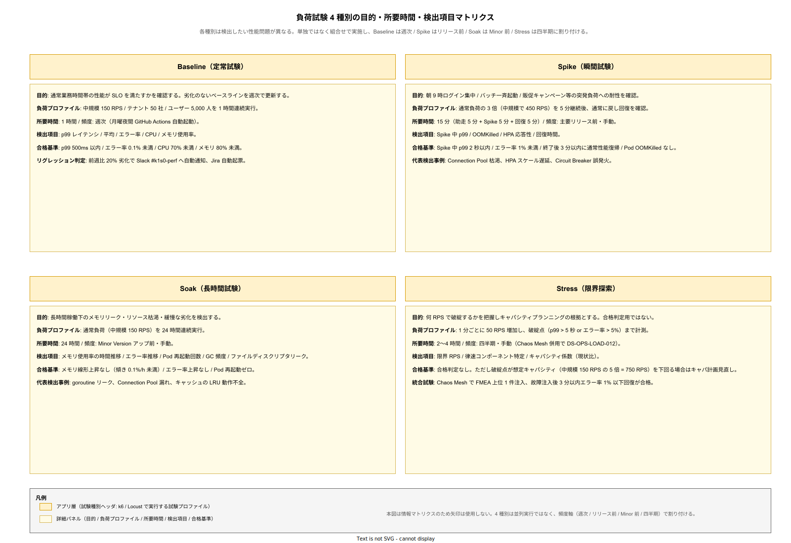
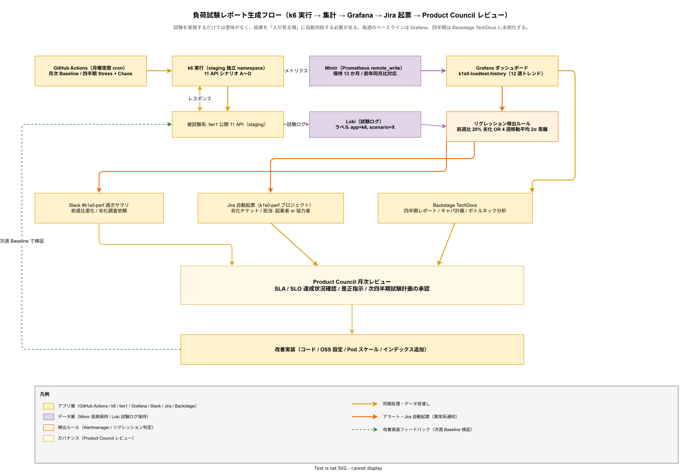

# 07. 負荷試験方式

本ファイルは k1s0 の tier1 API が企画で約束した性能数値（p99 500ms、エラー率 0.1% 以下、RPS 積算値）を満たすことを継続的に検証するための負荷試験設計を規定する。要件定義 [40_運用ライフサイクル/](../../03_要件定義/40_運用ライフサイクル/) の可用性・性能関連要件（NFR-B-PERF）と連動する。

## 本章の位置付け

性能目標は机上試算だけでは担保できない。企画書では「tier1 API p99 500ms 以内（業務 200ms + Dapr 80ms + OTel 20ms + 監査 50ms + NW・DB 150ms の積算）」を約束しているが、実測で裏付けを取らないと稟議の約束が虚偽になる。また、プラットフォームは時間と共に性能が劣化するため（テナント増加、データ量増加、OSS バージョンアップの影響）、一度計測して終わりではなく継続的な再試験が必要である。

本章では負荷試験の種別（Baseline / Spike / Soak / Stress）、対象 API、規模別目標値、合格基準、実施頻度、ツール選定を体系化する。同時にレポート形式と継続監視の仕組みを整備し、性能劣化を早期に検知する仕組みを構築する。

## 負荷試験ツール

負荷試験ツールは k6（Grafana Labs、Go + JavaScript スクリプト）を主軸とする。k6 は Prometheus / Grafana との統合が容易で、CI パイプライン組み込みもシンプルであり、ライセンスは AGPL-3.0 だが「試験ツールとしての利用」は配布には当たらないため、構想設計 ADR-0003 の AGPL 隔離原則の対象外とする（試験結果の公開と混同しないよう注意する）。

Phase 2 で大規模負荷試験が必要になった段階で Locust（MIT ライセンス、Python）を併用する。Locust は分散実行と Web UI が強みで、100 万ユーザー規模のシミュレーションに向く。k6 と Locust を使い分ける基準は、k6 は常用（CI 組み込み）、Locust はリリース前の大規模負荷試験とする。

レポート収集は Grafana に統一する。k6 の結果を InfluxDB / Prometheus に流し、Grafana ダッシュボードで可視化する。ダッシュボードは Backstage TechDocs に埋め込み、全社員が閲覧可能とする。

## 試験種別と目的

試験種別は 4 種類を定義する。各種別は検出したい性能問題が異なるため、単独ではなく組み合わせて実施する。

### Baseline（定常試験）

想定する通常負荷下での性能を計測する。目的は「通常業務時間帯の性能が SLO を満たすか」の確認である。中規模（150 RPS、テナント 50 社、ユーザー 5,000 人）を基準とし、1 時間連続で実行する。

p99 レイテンシ、平均レイテンシ、エラー率、CPU / メモリ使用率を計測する。合格基準は p99 500ms 以内、エラー率 0.1% 未満、CPU 70% 未満、メモリ 80% 未満である。

### Spike（瞬間試験）

突発的な負荷増加への耐性を計測する。目的は「朝 9 時のログイン集中、バッチ処理の一斉実行、販促キャンペーンのアクセス集中」といった瞬間的な高負荷に耐えられるかの確認である。通常負荷の 3 倍（中規模で 450 RPS）を 5 分間継続した後、通常負荷に戻し、応答性が回復するかを確認する。

合格基準は、Spike 中の p99 2 秒以内、エラー率 1% 未満、Spike 終了後 3 分以内に通常性能へ復帰、Pod が OOMKilled されないこと。

### Soak（長時間試験）

長時間連続稼働時のメモリリーク・リソース枯渇を検出する。目的は「本番環境で 1 週間稼働した結果、メモリが徐々に増え続けて OOMKilled になる」といった緩慢な劣化の検出である。通常負荷で 24 時間連続実行する。

合格基準は、24 時間の中でメモリ使用率の線形上昇がないこと（傾きが時間あたり 0.1% 未満）、エラー率が時間経過で上昇しないこと、Pod 再起動が発生しないこと。

### Stress（限界探索）

性能の限界点を探索する。目的は「何 RPS でシステムが破綻するか」を知ることで、キャパシティプランニングの根拠とする。負荷を徐々に上げ（1 分ごとに 50 RPS 増加）、破綻点まで計測する。破綻の定義は「p99 が 5 秒を超える」または「エラー率が 5% を超える」とする。

Stress 試験の目的は合格ではなく、数値を把握することである。破綻点が想定キャパシティ（中規模 150 RPS の 5 倍 = 750 RPS）を下回る場合、キャパシティ計画の見直しが必要となる。

以下に 4 試験種別のイメージを示す。

## 対象 API とシナリオ

対象は tier1 公開 11 API の全てである。各 API に対してシナリオを定義する。シナリオは「業務フローの模擬」であり、単一エンドポイントの繰り返しコールではなく、実際の業務パターンを再現する。

### k1s0.Service（RPC）

シナリオ: tier2 API のコールを模擬する。エンドポイント選択・認証ヘッダ付与・リクエスト送信・レスポンス検証を行う。Baseline は 50 RPS、中規模ピーク 150 RPS、Spike 450 RPS。

### k1s0.State（Valkey）

シナリオ: セッション情報の Get / Set / Delete を繰り返す。Get 80% / Set 15% / Delete 5% の比率。Baseline は 100 RPS、中規模ピーク 300 RPS、Spike 900 RPS。

### k1s0.PubSub（Kafka）

シナリオ: イベント発行を模擬する。1 メッセージ 1KB サイズで、1 秒あたり N 件発行。Baseline は 50 RPS、中規模ピーク 150 RPS、Spike 450 RPS。p99 Publish 50ms 以内を合格基準とする（構想設計の積算値）。

### k1s0.Secrets（OpenBao）

シナリオ: Secret 取得を模擬する。Cache hit 率を考慮し、80% はキャッシュから、20% は OpenBao から取得。Baseline は 20 RPS、中規模ピーク 60 RPS、Spike 180 RPS。

### k1s0.Binding / Workflow / Log / Telemetry / Decision / Audit-Pii / Feature

各 API についても同様にシナリオを定義する。Decision は p99 1ms 以内（構想設計の積算値）を合格基準とする。これは ZEN Engine のインメモリ評価性能を前提としている。

## 規模別の目標値

k1s0 の想定規模（小 / 中 / 大）ごとに負荷試験の目標値を定義する。小規模は Phase 1a のプロトタイプ、中規模は Phase 1b の本格運用、大規模は Phase 2 の拡張フェーズに対応する。

| 規模 | テナント数 | ユーザー数 | Baseline RPS | Spike RPS | p99 目標 | エラー率 |
| --- | --- | --- | --- | --- | --- | --- |
| 小規模 | 10 社 | 500 人 | 50 RPS | 150 RPS | 500ms | 0.1% |
| 中規模 | 50 社 | 5,000 人 | 150 RPS | 450 RPS | 500ms | 0.1% |
| 大規模 | 200 社 | 50,000 人 | 500 RPS | 1,500 RPS | 500ms | 0.1% |

p99 目標は規模に関わらず 500ms を維持する。規模拡大に伴い追加する Pod の水平スケーリングで対応する。エラー率も規模に関わらず 0.1% を維持する。これらは構想設計 ADR-NFR-001 のコミット値である。

## 合格基準

合格基準は複数指標の AND 条件とする。単一指標の合格では不十分で、総合的に性能目標を満たしている必要がある。

p99 レイテンシ: 500ms 以内（全 API 合算、ただし Decision は 1ms、State Get は 10ms、PubSub Publish は 50ms の個別基準も適用）

平均レイテンシ: 100ms 以内（中規模 150 RPS 時）

エラー率: 0.1% 未満（HTTP 5xx、gRPC UNAVAILABLE / INTERNAL を対象）

Pod リソース: CPU 70% 未満、メモリ 80% 未満（OOMKilled 回避）

DB 接続: PostgreSQL の Connection Pool 使用率 70% 未満、Idle 接続 20% 以上

メッセージキュー: Kafka の Consumer Lag 1,000 メッセージ未満、Lag 時間 10 秒未満

これらの指標は全て Grafana ダッシュボードで同時表示し、単一画面で合格判定を行う。1 指標でも不合格の場合は、該当コンポーネントのチューニングまたはスケーリング判断を行う。

## 実施頻度と自動化

負荷試験は以下の頻度で実施する。頻度を明確化することで、「忙しくて試験を怠った」事態を防ぐ。

Phase 1a（MVP-0）: プロトタイプ段階で机上値の妥当性を検証する目的で、1 回のみ手動実行。k6 スクリプトの雛形を整備。

Phase 1b（MVP-1a）以降: 週次で Baseline を自動実行。CI パイプラインで毎週月曜夜間に k6 を起動し、結果を Grafana に記録する。p99 劣化が前週比 20% を超える場合は Slack 通知を発火する。

リリース前: 主要リリース（Minor Version アップグレード）前に Spike + Soak を手動実行。4 時間 + 24 時間の試験で、リリースによる性能影響を確認する。

四半期: Stress 試験を四半期に 1 回実施。限界点を再計測し、キャパシティプランに反映する。

負荷試験の自動化は GitHub Actions から k6 を起動する形で実装する。試験環境は staging の独立 namespace を使い、通常の staging 業務に影響しないように分離する。

## 試験データの生成

負荷試験には「本番同等の特性を持つがセンシティブでない合成データ」が必要である。個人情報を含む本番データは試験には使えず、また架空のランダムデータでは本番特性を反映しない。k1s0 では合成データ生成器を整備する。

合成データ生成器は以下を生成する: テナント情報（5 社〜100 社、規模に応じて）、ユーザー情報（1 テナントあたり 100 人、全員合成）、業務データ（1 ユーザーあたり 1,000 レコード）、監査ログ（1 操作あたり 1 レコード）。生成は `scripts/load-test/gen-data.go` で実装し、実行時間は 10 分以内を目標とする。

合成データは個人情報ゼロを保証する。氏名は UUID、メールアドレスは `user-<uuid>@loadtest.example.jp`、住所は固定ダミー、電話番号は `000-0000-0000` とする。これにより GDPR・個人情報保護法の対象外となり、試験データを自由に扱える。

## レポート形式

試験結果は以下の形式でレポート化する。毎週の Baseline 結果は Grafana ダッシュボードで参照可能とし、四半期 Stress 試験はレポートドキュメントを作成する。

Grafana ダッシュボード: p99 / 平均レイテンシの時系列、エラー率の時系列、RPS の時系列、CPU / メモリの時系列、DB / Kafka の関連指標。全 API を並列表示し、異常値を即座に検知可能な UI とする。

週次サマリ: Slack チャンネル #k1s0-perf に自動投稿。前週比の変化（劣化 / 改善）を記載。劣化が見られる場合は起案者または協力者が調査を開始する。

四半期レポート: Backstage TechDocs に記載。Stress 試験結果、キャパシティ計画の更新、新規ボトルネックの分析を含む。Product Council で議論する。

以下にレポートフローを示す。

## 性能改善のフィードバックループ

負荷試験で劣化が検知された場合、以下のフローで改善する。検知と改善を分離せず、一貫したプロセスとして運用する。

検知: 週次 Baseline で前週比 20% 以上の劣化、または p99 500ms を超過。Slack 通知と Jira チケット自動作成。

分析: 起案者または協力者が Grafana で詳細分析。どのコンポーネント（API / State / PubSub / DB / Kafka）で劣化したかを特定。

原因特定: コード変更履歴（Git blame）、OSS バージョンアップ、データ量増加、設定変更の 4 軸で原因を絞る。

改善実装: コード最適化、インデックス追加、Pod 水平スケーリング、OSS 設定チューニングのいずれかで対処。

検証: 改善実装後、手動で Baseline を再実行し、p99 が回復したことを確認。翌週の自動 Baseline でも持続性を確認。

## Phase 1b パイロット前の必達合格条件

負荷試験を実施するだけでは意味がなく、「どの時点で合格しなければならないか」を明確化しないと、試験が「参考値」に格下げされてしまう。k1s0 ではパイロットテナントを受け入れる Phase 1b の本番投入前を最終防衛ラインとし、全シナリオの合格を必達条件として Gate 化する。

**設計項目 DS-OPS-LOAD-010 Phase 1b 昇格 Gate**

Phase 1b で本番テナント（パイロット部門）の業務データを受け入れる前に、中規模プロファイル（150 RPS、テナント 50 社、ユーザー 5,000 人）のシナリオ A〜D（tier1 公開 11 API 全ての Baseline + Spike）を 1 回以上合格することを本番 Go/NoGo の必達条件とする。不合格時は Product Council で延期判断を行い、原因分析とチューニング後に再試験する。記録は Backstage TechDocs に掲載し、稟議決定根拠として保存する。

## 定期実行サイクル

負荷試験は人手に依存すると「忙しくて今回はスキップ」が起きる。定期実行をカレンダー固定し、自動起動 + 自動レポート生成で省力化する。

**設計項目 DS-OPS-LOAD-011 月次基礎試験と四半期包括試験**

月次基礎試験は毎月第 1 月曜夜間に k6 で Baseline シナリオを自動実行、Grafana に結果を永続化する。四半期包括試験は四半期ごとに最終週の金曜夜間から土曜日にかけて 24 時間枠を確保し、Baseline + Spike + Soak + Stress を連続実行する。四半期包括試験には Chaos 試験（後述 DS-OPS-LOAD-012）も含める。実施担当は起案者または協力者で、実施 2 週間前に Slack #k1s0-perf と Backstage カレンダーで予告する。

## ストレステストとカオス試験の統合

Stress 単体では限界 RPS を知れるだけで、「故障時に性能がどう崩れるか」は分からない。カオス試験（意図的な故障注入）を Stress と同時期に実施することで、「高負荷 × 故障」の複合条件下での性能挙動を把握する。

**設計項目 DS-OPS-LOAD-012 Stress + Chaos 統合試験**

四半期包括試験の一部として、Stress 試験中に Chaos Mesh で FMEA 上位故障モード（DS-OPS-FMEA-003 参照）を 1 件注入する。注入故障は「PostgreSQL Primary Kill」「Kafka ブローカー 1 台停止」「ztunnel Pod Kill」の 3 種から輪番選択する。合格基準は、故障注入後 3 分以内にエラー率が 1% 以下まで回復すること、自動 failover が完了すること、tier1 API の p99 が 2 秒以内に戻ることとする。Phase 1c で試験運用を開始し、Phase 2 で完全自動化する。

## 結果の永続化とリグレッション検出

負荷試験結果が毎回揮発すると、「先月と比べて遅くなっている」傾向を検知できない。結果を Grafana に永続化し、時系列比較で劣化を自動検出する。

**設計項目 DS-OPS-LOAD-013 結果永続化とリグレッション検出**

k6 の実行結果は Prometheus remote_write で Mimir に流し、保持期間を 13 か月とする（前年同月比が 1 回実施可能）。Grafana ダッシュボード `k1s0-loadtest-history` で、直近 12 週間の p99 / 平均レイテンシ / エラー率 / 限界 RPS のトレンドを可視化する。リグレッション検出は「前週比 20% 以上の劣化」または「4 週移動平均から 2σ 以上の乖離」を自動アラート条件とし、Slack #k1s0-perf へ通知、Jira チケットを自動起票する。確定フェーズは Phase 1c。

## 設計 ID 一覧

| 設計 ID | 項目 | 対応要件 | 確定フェーズ |
| --- | --- | --- | --- |
| DS-OPS-LOAD-001 | 負荷試験ツール選定（k6 / Locust） | NFR-B-QA-001 / OR-LOAD-001 | Phase 1a |
| DS-OPS-LOAD-002 | 試験種別 4 種の定義 | NFR-B-QA-001 / OR-LOAD-001 | Phase 1a |
| DS-OPS-LOAD-003 | 対象 API とシナリオ | NFR-B-PERF-001 / OR-LOAD-001 | Phase 1b |
| DS-OPS-LOAD-004 | 規模別目標値 | NFR-B-PERF-001 | Phase 0 |
| DS-OPS-LOAD-005 | 合格基準 | NFR-B-PERF-001 | Phase 0 |
| DS-OPS-LOAD-006 | 実施頻度と自動化 | NFR-B-QA-001 | Phase 1b |
| DS-OPS-LOAD-007 | 合成データ生成器 | NFR-G-PRV-001 | Phase 1b |
| DS-OPS-LOAD-008 | レポート形式 | NFR-B-QA-002 | Phase 1b |
| DS-OPS-LOAD-009 | 改善フィードバックループ | NFR-B-QA-002 | Phase 1c |
| DS-OPS-LOAD-010 | Phase 1b 昇格 Gate | OR-LOAD-002 | Phase 1b |
| DS-OPS-LOAD-011 | 月次基礎試験と四半期包括試験 | OR-LOAD-003 | Phase 1b |
| DS-OPS-LOAD-012 | Stress + Chaos 統合試験 | OR-LOAD-004 | Phase 1c |
| DS-OPS-LOAD-013 | 結果永続化とリグレッション検出 | OR-LOAD-005 | Phase 1c |

## 対応要件一覧

本章は要件定義書の以下エントリに対応する。NFR-B-PERF-001（tier1 API p99 500ms）、NFR-B-PERF-002（tier1 API スループット 150 RPS）、NFR-B-QA-001（Phase 1b 性能試験の実施義務）、NFR-B-QA-002（定期性能退行検知）、NFR-G-PRV-001（個人情報保護、合成データ）、OR-LOAD-001（シナリオ定義）、OR-LOAD-002（Phase 1b 合格必達）、OR-LOAD-003（月次・四半期定期実行）、OR-LOAD-004（Stress / Chaos 包括試験）、OR-LOAD-005（結果永続化とリグレッション検出）と連動する。負荷試験そのものの実施義務は NFR-B-PERF-004（Decision p99 1ms）ではなく NFR-B-QA-001/002 に帰属するため、DS-OPS-LOAD-001 / 002 / 006 / 008 / 009 の紐付け先を是正済み（0.7 版）。
