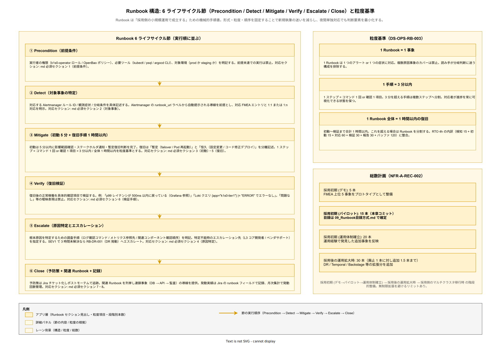

# 08. Runbook 設計方式

本ファイルは k1s0 の障害対応・運用作業を再現可能にする Runbook（手順書）の設計原則・必須セクション・粒度・検証方法を規定する。要件定義 [40_運用ライフサイクル/](../../03_要件定義/40_運用ライフサイクル/) の NFR-A-REC-002（Runbook 15 本整備）と連動する。

## 本章の位置付け

Runbook は「2 名運用で成立する」という企画コミットの中核資産である。起案者が不在の夜間・休日に協力者が単独で SEV1 に対応するには、判断要素を最小化した機械的手順が必要である。判断に頼る運用は属人化を招き、バス係数 2（ひとり抜けても業務継続可能）を破綻させる。

本章では Runbook の形式・粒度・必須セクションを統一する。統一することで、新規 Runbook 執筆時の迷いを減らし、レビューの観点を固定化し、利用時の読み手の学習コストを下げる。また Runbook の検証（Chaos Drill）と自動化（ArgoWorkflows / Temporal）の仕組みを規定し、Runbook が陳腐化しないフィードバックループを構築する。

## Runbook の形式

Runbook は Markdown 形式で記述し、Backstage TechDocs に格納する。Markdown を採用する理由は、Git でバージョン管理可能、レビューが PR で行える、テキスト検索が容易、静的サイト生成（TechDocs）で閲覧 UX を整えられる、という 4 点である。

格納先は Git リポジトリ `k1s0/runbooks` とする。このリポジトリは全社員が閲覧可能（Read 権限）、編集は運用チームと起案者・協力者のみ（Write 権限）とする。PR マージ後、Backstage TechDocs が自動でビルドして公開する。公開までの時間は 5 分以内を目標とする。

ファイル命名規則は `RB-<カテゴリ>-<通番>-<簡潔名>.md` とする。カテゴリは `API`（tier1 API 障害）、`DB`（DB 障害）、`NET`（ネットワーク障害）、`SEC`（セキュリティ事象）、`OPS`（定期運用作業）の 5 種類とする。例: `RB-DB-001-postgres-primary-failover.md`。

## Runbook の必須セクション

Runbook は以下 8 セクションを必須とする。セクションの順序も固定し、利用者が慣れた位置に情報を見つけられるようにする。セクション省略は禁止し、該当なしの場合は「該当なし」と明記する。

### セクション 1: 前提条件

Runbook を実行するための前提を記載する。実行者の権限（Kubernetes RBAC ロール、OpenBao ポリシー）、必要なツール（kubectl、psql、argocd CLI）、事前確認事項（該当環境が本番か staging か）を明記する。前提条件を満たさない状態での実行は禁止する。

例: 「本 Runbook の実行には `k1s0-operator` ロールが必要。kubectl コンテキストが `prod` になっていることを `kubectl config current-context` で確認すること。」

### セクション 2: 対象事象

Runbook が対応する事象を具体的に記述する。「どのアラートが発火したか」「どの症状が観測されたか」を記載する。複数事象に対応する Runbook の場合は、分岐条件を明示する。

例: 「Alertmanager の `PostgresPrimaryDown` アラートが発火、かつ `kubectl get pod -n cnpg` で Primary Pod が CrashLoopBackOff 状態。」

### セクション 3: 初動手順（5 分以内）

発生から 5 分以内に実施する初動を記載する。影響範囲の確認、ステークホルダーへの通知、暫定復旧の判断を含む。5 分という時間制約は、SEV1 の応答 SLA（15 分）のうち、最初の 5 分で状況把握と初動完了を達成する設計による。

手順は機械的に実行可能な形で記述する。「状況を確認する」ではなく「`kubectl get pod -n cnpg` を実行し、Primary Pod の STATUS を確認する」と具体化する。

### セクション 4: 原因特定手順

根本原因を特定するための調査手順を記載する。ログ確認コマンド、メトリクス参照先、関連コンポーネントの確認順序を明記する。特定できない場合のエスカレーション先（L3 コア開発者）も明記する。

### セクション 5: 復旧手順

暫定復旧と恒久復旧の手順を記載する。暫定復旧は業務影響を最小化する緊急対応（例: failover 実行、Pod 再起動）、恒久復旧は根本原因解消後の正常化手順（例: 設定変更、コード修正のデプロイ）を記述する。

各手順は 3 分以内で完了する 1 ステップとする。3 分を超える手順は複数ステップに分割する。3 分制約は、ステップ間でコマンド実行が完了しないと次に進めない事態を避け、対応者が進捗を常に可視化できる状態を保つためである。

全手順の合計は 1 時間以内を目標とする。1 時間は RTO 4h のうち、検知 15 分 + 初動 15 分 + 対応 60 分 + 検証 30 分 + 報告 30 分 + バッファ 2h の積算に基づく。

### セクション 6: 検証手順

復旧後に正常稼働を確認する手順を記載する。アプリケーションのヘルスチェック、メトリクスの正常化、監査ログの継続性、主要機能の動作確認を含む。

検証は「問題なし」ではなく具体的な確認項目で記述する。「p99 レイテンシが 500ms 以内に戻っている（Grafana ダッシュボード参照）」「エラーログが発生していない（Loki クエリ `{app="k1s0-tier1"} |= "ERROR"` で確認）」といった具体性を持たせる。

### セクション 7: 予防策

同種事象の再発防止策を記載する。監視強化（閾値見直し、追加アラート）、設定改善、コード修正案、訓練計画を含む。予防策は Jira チケット化を前提とし、ポストモーテムで追跡する。

### セクション 8: 関連 Runbook

関連する他 Runbook を列挙する。事象が連鎖する場合（例: DB 障害 → API 障害 → 監査ログ書込失敗）、連鎖先の Runbook を参照できるようにする。

## Runbook の粒度

Runbook の粒度設計は、実行者の認知負荷と網羅性のトレードオフである。粗すぎる（1 Runbook で多事象をカバー）と読み手が判断に迷い、細かすぎる（1 事象に 10 Runbook）と Runbook 総数が膨張して保守不能になる。k1s0 では以下の粒度で統一する。

1 Runbook = 1 事象: 1 つの Runbook は 1 つの原因イベント（アラート、症状）に対応する。複数の原因事象をカバーする Runbook は作らない。

1 手順 = 3 分以内: 1 つの手順ステップは、コマンド 1 回または確認 1 項目に相当し、3 分以内に完了するサイズとする。

1 Runbook 全体 = 1 時間以内の復旧: 初動から検証まで合計 1 時間以内で完了するサイズとする。これを超える場合は Runbook を分割する。

合計 Runbook 数 = Phase 1b 時点で 15 本: 要件 NFR-A-REC-002 のコミット値。詳細目録は [09_Runbook目録方式.md](09_Runbook目録方式.md) で定義する。

以下に Runbook の構造と粒度を示す。



## バージョン管理と変更プロセス

Runbook は Git で管理し、変更は PR 必須とする。PR テンプレートには以下を含める: 変更理由（新規事象対応 / 既存手順改善 / OSS バージョンアップ反映）、影響範囲（どの事象の対応に影響するか）、検証結果（staging で手順を実行したか）、レビュア（L2 / L3 担当者のいずれか）。

PR レビューは 2 名承認を原則とする。1 名は起案者または協力者、もう 1 名は対象コンポーネントの担当者（例: DB 関連なら DB 担当）。ただし緊急対応で Runbook 追加が必要な場合は 1 名承認で許容し、事後に 2 名目の承認を追記する。

変更履歴は Git の commit log で自動管理される。Runbook 内に Changelog セクションを追加することは要求しない（Git 履歴を一次情報源とする）。

## 検証: Chaos Drill

Runbook は書いただけでは機能を保証できない。「書いた手順で本当に復旧できるか」「最新の環境でコマンドが通るか」を定期検証する必要がある。k1s0 では Chaos Drill で検証する。

Chaos Drill は staging 環境で故意に障害を発生させ、Runbook に従って復旧するシミュレーション訓練である。頻度は四半期に 1 回、四半期ごとに対象 Runbook を変える。四半期で 3〜4 本の Runbook を検証し、年次で全 15 本をカバーする。

Chaos Drill のシナリオは以下 3 パターンを組み合わせる。

計画的ドリル: 事前にチームで日時とシナリオを共有し、全員参加で手順を追う。Runbook の文面を読みながら実行し、曖昧な箇所や誤記を発見する。

抜き打ちドリル: 日時を事前通知せず、オンコール当番に対して「今から障害を発生させる」と通知してからシナリオを走らせる。実戦さながらの対応力を検証する。Phase 1c 以降に導入。

自動化ドリル: Chaos Mesh（Kubernetes 向け Chaos Engineering OSS）で自動的に障害を発生させ、Runbook 実行を記録する。週次で軽微な障害（Pod 削除、ネットワーク遅延）を発生させ、自動復旧の挙動を確認する。Phase 2 以降に導入。

Chaos Drill で発見した問題は Runbook 改善 PR として即時対応する。検証なしで Runbook が陳腐化することを構造的に防ぐ。

## 自動化対象の識別

繰り返し発動する Runbook は自動化対象として識別する。自動化により人為ミスを減らし、対応時間を短縮する。ただし、全 Runbook を自動化することは目指さない。判断要素が残るもの、影響が広範囲のものは人間が実行する。

自動化候補の識別基準は以下 3 条件とする。

発動頻度が月 3 回以上: 頻繁に発動する Runbook は自動化で対応コストを削減できる。

判断要素が少ない: 手順が機械的で、分岐が少ない Runbook は自動化しやすい。

影響が局所的: 失敗時の影響が限定的（1 Pod 再起動、1 テナントのみ）の Runbook は、自動化の失敗リスクを許容できる。

自動化基盤は以下 2 種類を使い分ける。

ArgoWorkflows（Kubernetes ネイティブの軽量ワークフロー）: シンプルな Kubernetes リソース操作を自動化する。Pod 再起動、Manifest 再適用、failover コマンド実行などに用いる。

Temporal（長時間実行・ステートフルワークフロー）: 複数ステップのトランザクション的な自動化に用いる。データ移行、段階的リストア、複数コンポーネントの連携復旧に用いる。Phase 1c 以降に導入。

自動化 Runbook と手動 Runbook は Markdown の YAML front-matter で区別する。`automation: argo-workflow` または `automation: manual` と記載する。

## 監視連動: Alert から Runbook への自動提示

Alertmanager のアラート発火時、対応する Runbook URL をアラートメッセージに含めて自動提示する。これにより対応者は「どの Runbook を見れば良いか」を探す手間が省ける。

Alertmanager の設定で、各アラートルールに `runbook_url` ラベルを付与する。例:

```yaml
- alert: PostgresPrimaryDown
  expr: pg_up{role="primary"} == 0
  labels:
    severity: critical
    runbook_url: https://backstage.example.jp/docs/runbooks/RB-DB-001
  annotations:
    summary: "PostgreSQL Primary is down"
```

PagerDuty 通知、Slack 通知、メール通知のいずれでも Runbook URL が含まれるよう、Alertmanager テンプレートで `{{ .Labels.runbook_url }}` を展開する。

Runbook が未整備の新規アラートについては、`runbook_url` ラベルに `TBD`（To Be Determined）を付与し、月次の Runbook 整備ミーティングで整備対象リストに追加する。TBD ラベルのアラートが 10 件を超えた場合、Product Council で Runbook 整備の優先度を見直す。

## Runbook 品質の計測

Runbook の品質は主観で評価せず、以下指標で定量的に計測する。Phase 1b 以降、月次で計測し Grafana ダッシュボードで可視化する。

Runbook カバー率: 全アラートルール数に対する Runbook 整備済みアラート数の比率。目標 90% 以上。Phase 1b 時点の目標は 80%、Phase 1c で 90% 達成。

Runbook 実行成功率: Chaos Drill および実際のインシデント対応で、Runbook 通りに実行して復旧できた比率。目標 80% 以上。失敗事例は Runbook 改善のインプットとする。

Runbook 所要時間: 復旧完了までの平均時間。Runbook ごとに計測し、想定時間（1 時間以内）との乖離を監視する。

Runbook 更新頻度: 各 Runbook の最終更新日。6 か月以上更新されていない Runbook は陳腐化リスクがあるため、棚卸し対象とする。

## 新規協力者のオンボーディング

Runbook は新規協力者の学習教材としても機能する。Phase 1b で新規協力者を受け入れる際、最初の 2 週間で以下のオンボーディングを行う。

1 週目: 全 Runbook（15 本）を読破。不明点を起案者に質問する。Runbook の誤記や改善提案を PR で提出する。

2 週目: 3 本の Runbook を staging で実演する（起案者が見守り）。実演後、手順の曖昧箇所を改善する PR を提出する。

オンボーディング完了条件は「1 本の SEV2 インシデントを単独で対応できる」レベルとする。これは企画でコミットしたバス係数 2 の実現条件と一致する。

## 監視基盤・運用プロセス基盤との接続（NFR-C-MON / NFR-C-NOP / NFR-C-OPS 系）

Runbook が機能する前提として、Alertmanager が発火する元となる監視基盤が稼働し、Pod 間の時刻ずれがログ相関を妨げない状態が保たれ、Runbook 実行を支える運用プロセス基盤（Slack / PagerDuty / Backstage）が整備されている必要がある。これらは NFR-C-MON-001（監視基盤の構成要件）、NFR-C-MON-002（Consumer Lag 監視）、NFR-C-MON-003（Workflow 遅延監視）、NFR-C-NOP-004（時刻同期）、NFR-C-OPS-001（運用プロセス基盤）として要件定義書で独立定義されている。Runbook 設計と不可分であるため、本章で設計項目化する。

**設計項目 DS-OPS-RB-010 監視基盤（Prometheus / Tempo / Loki / Pyroscope）の構成要件**

NFR-C-MON-001（Telemetry API 背後の監視基盤構成）への対応である。メトリクス収集は Prometheus（自作 tier1 サービスが `/metrics` を公開、`prometheus.io/scrape=true` Annotation で自動発見）、分散トレースは Grafana Tempo（OTLP gRPC 経由で 100% サンプリング、Phase 1c で Tail-based Sampling に縮退）、ログ集約は Grafana Loki（構造化 JSON、ラベル `app / tenant_id / trace_id`）、プロファイリングは Grafana Pyroscope（Go / Rust / Java の CPU / Memory プロファイル、eBPF 版は Phase 2）の 4 スタックを採用する。各スタックの採用理由は構想設計 ADR-OBS-001（Grafana LGTM 統一）に基づく。監視基盤自体の死活は Dead Man's Switch（外部 CronJob、5 分間隔で `/metrics` をプローブ、途絶で外部 PagerDuty に直接通知）で二重冗長化する。これによりインシデントの検知遅れが構造的に発生しない状態を担保する。

**設計項目 DS-OPS-RB-011 Kafka Consumer Lag 監視と DLQ 運用**

NFR-C-MON-002（PubSub API の Consumer Lag 監視、DLQ 監視）への対応である。Strimzi Operator が公開する Kafka Exporter 経由で `kafka_consumergroup_lag{consumergroup, topic, partition}` を Prometheus で収集し、Alertmanager ルール `KafkaConsumerLagHigh`（Lag > 10,000 件を 5 分継続）を定義する。アラート発火時は Runbook `RB-MSG-002`（新規整備予定、Consumer Lag 対応）を参照し、Consumer Pod のスケールアウト、遅延メッセージの DLQ 退避、原因特定（Consumer 処理コード性能問題 / ブローカー負荷 / ディスク I/O 飽和）を順に実施する。DLQ（Dead Letter Queue）はトピック命名規則 `<original-topic>.dlq` で統一し、DLQ 流入件数も `kafka_dlq_messages_total` として Prometheus で計測する。DLQ が急増した場合は下流サービスの根本不安定性を示唆するため、SEV2 として本章 [02_インシデント対応方式.md](02_インシデント対応方式.md) のフェーズ対応に接続する。

**設計項目 DS-OPS-RB-012 Workflow 遅延と滞留の監視**

NFR-C-MON-003（Workflow API の遅延・滞留監視）への対応である。Dapr Workflow（Phase 1b〜1c）および Temporal（Phase 1c 以降）の両系統について、Workflow インスタンスの状態を以下メトリクスで監視する: `workflow_instances_running`（実行中数）、`workflow_instances_pending`（開始待ち数）、`workflow_duration_seconds`（完了までの所要時間ヒストグラム）、`workflow_failed_total`（失敗カウンタ）。Alertmanager ルール `WorkflowPendingHigh`（Pending > 1,000 を 10 分継続）、`WorkflowDurationP99High`（p99 > 想定値の 2 倍を 15 分継続）を定義し、Runbook `RB-WF-001`（新規整備予定、Workflow 滞留対応）を紐付ける。Workflow が滞留する原因は、下流サービス障害（Service Invoke 先が応答しない）、Workflow エンジン自体のリソース不足、あるいは Saga の補正トランザクション失敗の 3 系統に分かれるため、Runbook で分岐ツリーを提示する。Phase 2 で Temporal UI ダッシュボードを Backstage に埋め込み、SRE と業務担当者の両方が滞留状況を確認できる状態を整備する。

**設計項目 DS-OPS-RB-013 時刻同期（NTP）とログタイムライン相関**

NFR-C-NOP-004（全 VM / Pod で NTP ずれを 100ms 以内、chrony / systemd-timesyncd 利用、100ms 超で SEV3 アラート）への対応である。Kubernetes Node 側は chrony を DaemonSet で配置し、社内 NTP サーバ（`ntp.example.jp`）と外部 NTP サーバ（`pool.ntp.org`）の 2 階層同期とする。Pod 側は Node の時刻を継承するが、tier1 サービスのログ出力には ISO 8601 UTC タイムスタンプ（ナノ秒精度）を強制する。chrony の同期状態は Prometheus node_exporter の `node_timex_offset_seconds` を使い、`|offset| > 0.1` を 5 分継続で Alertmanager ルール `NodeTimeDrift` を発火させ SEV3 対応する。Runbook `RB-OPS-003`（新規整備予定、時刻ずれ対応）では NTP サーバ到達性の確認、chrony 再起動、上位 NTP 切替を順に実施する。時刻ずれを構造的に防ぐことで、Loki / Tempo / Audit ログの分散トレース相関が 100ms 精度で成立し、インシデント対応時の時系列追跡が属人性に頼らず機能する。

**設計項目 DS-OPS-RB-014 運用プロセス基盤（NFR-C-OPS-001）の統合構成**

NFR-C-OPS-001（運用プロセスの基盤整備）への対応である。本章で前提とする Slack（通知）、PagerDuty（オンコール）、Backstage（ナレッジベース / FAQ / Runbook 閲覧）、Jira（チケット管理）、GitHub（Runbook PR レビュー）の 5 ツールを運用プロセス基盤として位置付け、それぞれの責務を明確化する。Slack は非同期通知・雑談型問合せ・インシデント宣言の場、PagerDuty は SEV1 時のコールアウト・エスカレーションポリシー・オンコールローテーション、Backstage は Runbook / FAQ / Service Catalog / SBOM を TechDocs で統合表示、Jira は問合せチケット・再発防止アクション・Sprint 計画、GitHub は Runbook / IaC / アプリコードの一元バージョン管理を担う。5 ツール間の相互連携は（a）Alertmanager → Slack / PagerDuty の Webhook、（b）PagerDuty → Jira チケット自動生成、（c）GitHub PR マージ → Backstage TechDocs 再ビルド、（d）Jira チケット → Slack スレッド自動通知、の 4 経路で自動化する。これにより「人が情報を転記する」工程をゼロに近づけ、2 名運用でも情報の整合性が維持される状態を作る。

## 設計 ID 一覧

| 設計 ID | 項目 | 対応要件 | 確定フェーズ |
| --- | --- | --- | --- |
| DS-OPS-RB-001 | Runbook 形式（Markdown / TechDocs） | NFR-A-REC-002 | Phase 1a |
| DS-OPS-RB-002 | 必須 8 セクション | NFR-A-REC-002 | Phase 1a |
| DS-OPS-RB-003 | 粒度設計（3 分 / 1 時間 / 15 本） | NFR-A-REC-002 | Phase 1b |
| DS-OPS-RB-004 | バージョン管理と変更プロセス | NFR-A-REC-002 | Phase 1a |
| DS-OPS-RB-005 | Chaos Drill 検証 | NFR-A-REC-002 | Phase 1c |
| DS-OPS-RB-006 | 自動化対象識別 | OR-INC-003 | Phase 2 |
| DS-OPS-RB-007 | Alert 連動 Runbook 提示 | OR-INC-001 | Phase 1b |
| DS-OPS-RB-008 | 品質指標計測 | NFR-A-REC-002 | Phase 1c |
| DS-OPS-RB-009 | 新規協力者オンボーディング | OR-SUP-005 | Phase 1b |
| DS-OPS-RB-010 | 監視基盤 LGTM スタック構成 | NFR-C-MON-001 | Phase 1b |
| DS-OPS-RB-011 | Kafka Consumer Lag と DLQ 監視 | NFR-C-MON-002 | Phase 1b |
| DS-OPS-RB-012 | Workflow 遅延・滞留監視 | NFR-C-MON-003 | Phase 1c |
| DS-OPS-RB-013 | 時刻同期（NTP 100ms 以内） | NFR-C-NOP-004 | Phase 1a |
| DS-OPS-RB-014 | 運用プロセス基盤 5 ツール統合 | NFR-C-OPS-001 | Phase 1b |

## 対応要件一覧

本章は要件定義書の以下エントリに対応する。NFR-A-REC-002（Runbook 15 本整備）、OR-INC-001〜003（インシデント対応）、OR-SUP-005（ナレッジベース）、NFR-A-CONT-003（FMEA）と連動する。加えて NFR-C-MON-001（監視基盤構成）、NFR-C-MON-002（Consumer Lag 監視）、NFR-C-MON-003（Workflow 遅延監視）、NFR-C-NOP-004（時刻同期）、NFR-C-OPS-001（運用プロセス基盤）に直接対応する。
