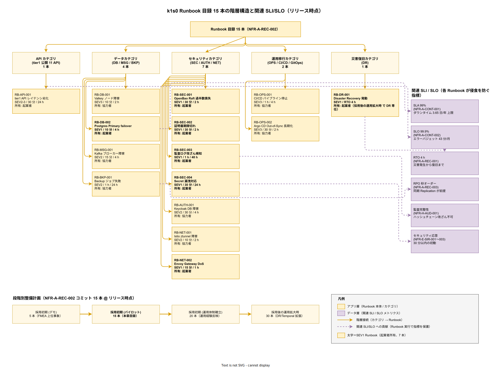
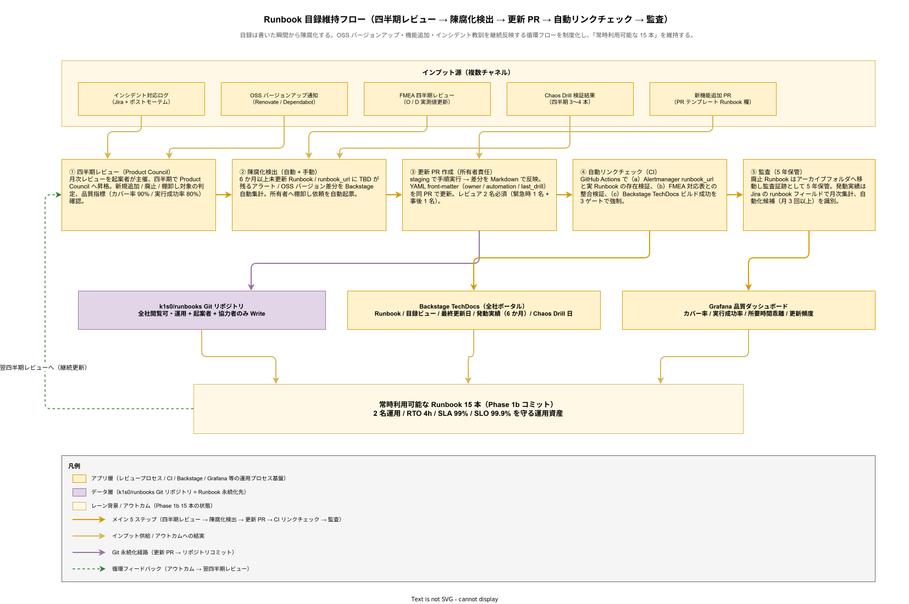

# 09. Runbook 目録方式

本ファイルは Phase 1b までに整備する Runbook 15 本（NFR-A-REC-002）の目録を定義し、各 Runbook の所有者・更新頻度・発動実績管理の方式を規定する。要件定義 [40_運用ライフサイクル/](../../03_要件定義/40_運用ライフサイクル/) の NFR-A-REC-002 と連動し、[08_Runbook設計方式.md](08_Runbook設計方式.md) の設計原則に基づく。

## 本章の位置付け

前章（08_Runbook 設計方式）で Runbook の形式・粒度・検証方法を規定したが、「具体的にどの 15 本を整備するのか」の確定までは踏み込んでいない。15 本の選定は、FMEA 分析で識別された主要故障モード（[06_FMEA分析方式.md](06_FMEA分析方式.md)）と、過去の他社インシデント事例、tier1 のコンポーネント構成、採用 OSS の一般的故障パターンから導出する。本章で 15 本を固定することで、Phase 1a〜1b の Runbook 整備作業の範囲を確定し、スケジュール管理を可能にする。

加えて、Runbook は陳腐化するリスクが高い。採用 OSS のバージョンアップで手順が変わる、新規機能追加で影響範囲が広がる、過去インシデントの教訓で手順が更新される、といった要因で継続的な保守が必要である。本章では所有者割当・更新頻度・棚卸しプロセスを規定し、15 本全てが常時利用可能な状態を維持する仕組みを構築する。

## Runbook 15 本の目録

Phase 1b 完了時点で整備する Runbook を以下に列挙する。優先順位は FMEA の RPN（Risk Priority Number）と業務クリティカリティで決定する。各 Runbook には ID、対象事象、想定 Severity、想定復旧時間、所有者、対応する FMEA エントリを割り当てる。

### RB-API-001: tier1 API レイテンシ劣化対応

対象事象: Alertmanager `TierOneLatencyHigh` 発火（p99 > 500ms を 5 分継続）、または利用者からの問合せで API の遅延報告。想定 Severity: SEV2〜SEV3。想定復旧時間: 暫定対応 30 分、恒久対応 24 時間。

手順の概要は、Grafana でコンポーネント別レイテンシを確認 → 原因特定（DB / Valkey / Kafka / Pod 負荷）→ 該当コンポーネントのスケーリング or Pod 再起動 → 復旧確認。所有者: 起案者（Phase 1c で協力者にも割当）。対応 FMEA: 間接対応。

### RB-DB-001: Valkey クラスタノード障害対応

対象事象: Alertmanager `ValkeyNodeDown` 発火、または State API の応答エラー増加。想定 Severity: SEV3（3 ノード構成のため自動 failover で継続稼働）。想定復旧時間: 暫定対応 10 分、恒久対応 2 時間。

手順の概要は、Sentinel の自動 failover 状況確認 → 停止ノードの原因特定（Pod / VM / ディスク）→ ノード復旧 or 差替 → resynchronization 完了確認。所有者: 協力者。対応 FMEA: FMEA-007。

### RB-DB-002: PostgreSQL Primary 障害対応（CNPG failover）

対象事象: Alertmanager `PostgresPrimaryDown` 発火。想定 Severity: SEV1（書込不可）。想定復旧時間: 暫定対応 10 分（自動 failover）、恒久対応 4 時間。

手順の概要は、CloudNativePG Operator の failover 状況確認 → 新 Primary 昇格確認 → アプリケーションの書込再開確認 → 旧 Primary の復旧 → Replica 再構成。所有者: 起案者。対応 FMEA: FMEA-006。

### RB-MSG-001: Kafka ブローカー障害対応

対象事象: Alertmanager `KafkaBrokerDown` 発火。想定 Severity: SEV2（3 ブローカー構成のため継続稼働）。想定復旧時間: 暫定対応 15 分、恒久対応 4 時間。

手順の概要は、Strimzi Operator の状態確認 → 停止ブローカーの原因特定 → 再起動 or 差替 → パーティション再バランス確認 → Consumer Lag の解消確認。所有者: 協力者。対応 FMEA: FMEA-003。

### RB-SEC-001: OpenBao Raft リーダ選出失敗対応

対象事象: Alertmanager `OpenBaoNoLeader` 発火、または tier1 の Secret 取得エラー急増。想定 Severity: SEV1（Secret 取得不可で全 API 影響）。想定復旧時間: 暫定対応 30 分（手動介入）、恒久対応 2 時間。

手順の概要は、Raft クラスタの状態確認（`vault operator raft list-peers`）→ 過半数喪失の判定 → 過半数喪失時は手動リーダ選出（ダウンノードの削除）→ sealed 状態なら unseal → ヘルスチェック。所有者: 起案者。対応 FMEA: FMEA-002。

### RB-AUTH-001: Keycloak DB 障害対応

対象事象: Alertmanager `KeycloakDbDown` 発火、または新規ログイン不可の報告。想定 Severity: SEV2（既存セッションは Refresh Token で継続）。想定復旧時間: 暫定対応 30 分、恒久対応 4 時間。

手順の概要は、Keycloak 専用 PostgreSQL の状態確認 → DB failover 実行 → Keycloak Pod 再起動 → ログイン動作確認 → Refresh Token TTL 確認。所有者: 協力者。対応 FMEA: FMEA-004。

### RB-NET-001: Istio ztunnel 障害対応

対象事象: Alertmanager `IstioZtunnelDown` 発火、または該当ノード上の Pod 間通信エラー。想定 Severity: SEV2（該当ノード上の Pod のみ影響）。想定復旧時間: 暫定対応 10 分、恒久対応 2 時間。

手順の概要は、ztunnel Pod の状態確認 → 再起動 → 失敗時はノード上の iptables / network namespace 確認 → ノード再起動（最終手段）→ 該当ノード上の Pod の通信回復確認。所有者: 協力者。対応 FMEA: FMEA-005。

### RB-SEC-002: 証明書期限切れ対応（自動更新失敗時）

対象事象: Alertmanager `CertExpiringSoon` 発火（期限 7 日前）、または `CertExpired` 発火（期限切れ）。想定 Severity: SEV1（API 接続不可）。想定復旧時間: 暫定対応 30 分、恒久対応 2 時間。

手順の概要は、cert-manager のログ確認 → 自動更新失敗原因の特定（ACME 通信失敗、DNS 問題、Issuer 設定ミス）→ 手動証明書発行（cert-manager CLI or 外部 CA）→ Kubernetes Secret 更新 → 該当 Pod の証明書再読込（Pod 再起動 or SIGHUP）。所有者: 起案者。対応 FMEA: FMEA-010。

### RB-NET-002: Envoy Gateway DoS 対応

対象事象: Alertmanager `GatewayRequestRateAbnormal` 発火（RPS が通常の 10 倍を超える）、または Envoy Gateway の 5xx 率急増。想定 Severity: SEV1（正規利用者も影響を受ける）。想定復旧時間: 暫定対応 15 分、恒久対応 1 時間。

手順の概要は、アクセス元 IP の分析（Grafana Loki）→ 攻撃パターン判定（Single IP / Botnet / DDoS）→ Envoy Gateway に緊急 RateLimit 設定投入 → 攻撃源 IP の Firewall Block → 正規利用者への影響確認 → 攻撃継続時はアップストリーム遮断判断（ISP / DDoS 防御サービス）。所有者: 起案者。対応 FMEA: 間接対応。

### RB-SEC-003: 監査ログ改ざん検知対応

対象事象: Alertmanager `AuditIntegrityFailure` 発火（ハッシュチェーン検証失敗）、または四半期監査検証ジョブでの改ざん発覚。想定 Severity: SEV1（法令違反リスク）。想定復旧時間: 暫定対応 1 時間、恒久対応（調査完了）48 時間。

手順の概要は、改ざん範囲の特定（どのレコードから不整合か）→ 該当レコードの隔離 → バックアップとの照合 → 原因特定（不正操作 / システム障害）→ 監督官庁報告要否判断（個人情報保護法 / J-SOX）→ インシデント宣言とポストモーテム起案。所有者: 起案者。対応 FMEA: FMEA-009。

### RB-SEC-004: Secret 漏洩発覚対応

対象事象: Git リポジトリでの Secret コミット検知（TruffleHog 等）、ログでの Secret 値露出、外部からの通報。想定 Severity: SEV1（セキュリティ事象）。想定復旧時間: 暫定対応 30 分、恒久対応 24 時間。

手順の概要は、漏洩 Secret の特定 → 即時ローテーション（OpenBao で新値発行）→ 旧 Secret の Revoke → 漏洩範囲調査（ログ確認、アクセス履歴確認）→ 影響範囲特定と利用者通知 → インシデント宣言。所有者: 起案者。対応 FMEA: 間接対応。

### RB-OPS-001: CI/CD パイプライン停止対応

対象事象: GitHub Actions の連続失敗、Argo CD の Sync 失敗急増。想定 Severity: SEV3（本番影響なし、開発生産性影響）。想定復旧時間: 暫定対応 1 時間、恒久対応 4 時間。

手順の概要は、GitHub Actions ログ確認 → 失敗原因の特定（外部依存 / ランナー障害 / テストコード問題）→ ランナー再起動 or 外部依存の迂回 → Argo CD の Sync 再試行 → 開発チームへの影響通知。所有者: 協力者。対応 FMEA: 間接対応。

### RB-OPS-002: Argo CD Out-of-Sync 長期化対応

対象事象: Argo CD ダッシュボードで 30 分以上 Out-of-Sync 状態が継続。想定 Severity: SEV3。想定復旧時間: 暫定対応 30 分、恒久対応 2 時間。

手順の概要は、Out-of-Sync の原因特定（Manifest 競合 / RBAC 不足 / リソース不足）→ 手動 Sync 試行 → 競合解消（手動変更の Git 反映、または Manifest 修正）→ 自動 Sync 復旧確認。所有者: 協力者。対応 FMEA: 間接対応。

### RB-BKP-001: Backup 失敗対応

対象事象: Alertmanager `BackupJobFailed` 発火（PostgreSQL / Valkey / Kafka / MinIO のいずれかのバックアップ失敗）。想定 Severity: SEV2（データロスリスク）。想定復旧時間: 暫定対応 1 時間、恒久対応 24 時間。

手順の概要は、失敗バックアップの特定（CNPG Backup, Velero 等）→ 原因特定（ストレージ満杯、認証失敗、ネットワーク問題）→ 手動バックアップ実行 → 成功確認 → 定期スケジュールの再有効化 → RPO 侵食時間の計算とインシデント判定。所有者: 協力者。対応 FMEA: 間接対応。

### RB-DR-001: Disaster Recovery 発動（RTO 4h）

対象事象: 本番クラスタ全停止（データセンター障害、広域ネットワーク障害）、または SEV1 が 3 時間経過しても復旧目処が立たない。想定 Severity: SEV1。想定復旧時間: RTO 4h 以内。

手順の概要は、災害宣言 → Product Council 召集 → DR 環境（Phase 2 以降）または代替構成の起動 → 最新バックアップからのリストア → DNS 切替 → サービス稼働確認 → 利用者通知と状況ページ更新 → 本番復旧後の切戻し計画。所有者: 起案者（Phase 2 以降は DR 専任ロール）。対応 FMEA: FMEA-008。

以下に Runbook 15 本の全体像を示す。API（1 本）・データ（4 本：DB／MSG／BKP）・セキュリティ（7 本：SEC／AUTH／NET）・運用移行（2 本：OPS／GitOps）・災害復旧（1 本：DR）の 5 カテゴリに分類し、各 Runbook の SEV・所有者・関連する SLI／SLO までを一枚に集約した。

この図で強調したい読み方は 3 点ある。第 1 に、セキュリティカテゴリが 7 本と最も多い事実は、JTC 情シス基盤が「稟議通過の前提に『改ざん耐性のある監査』と『Secret 漏洩ゼロ』を置いている」という企画コミットを反映している。RB-SEC 系 4 本と RB-AUTH／RB-NET 系を合わせた 7 本がすべて SEV1 または SEV2 に該当し、このカテゴリの Runbook が機能しないと稟議で約束した法令遵守（個人情報保護法・J-SOX）そのものが崩れる。

第 2 に、右側の関連 SLI／SLO への接続（紫破線）が示すように、各 Runbook は単独で完結する手順書ではなく、企画コミット済みの数値指標（SLA 99%・SLO 99.9%・RTO 4h・RPO 秒オーダー・監査完整性・セキュリティ応答 30 分）を守るための具体実装である。たとえば RB-DB-002（Postgres Primary failover）は SLA 99% を守る直接手段、RB-BKP-001（Backup 失敗対応）は RPO 秒オーダーを守る直接手段、RB-DR-001（DR 発動）は RTO 4 時間を守る直接手段である。Runbook を整備する作業が「動くドキュメント」の量産ではなく「稟議コミットの実装」であることが、この接続関係から読み取れる。

第 3 に、下段の Phase 別整備計画（Phase 1a 5 本 → Phase 1b 15 本 → Phase 1c 20 本 → Phase 2 30 本）は、NFR-A-REC-002 の「Phase 1b までに 15 本」というコミットが階段状に達成されることを示す。Phase 1a では FMEA 上位 5 事象を優先し、Phase 1b で残る 10 本を追加して本章目録を完成させる。Phase 1c 以降の追加は運用経験に基づく実証的判断であり、無制限な拡張を避けるため「廃止 1 本に対して追加 1.5 本まで」のリミットを別途設けている。

## 所有者の割当

各 Runbook に所有者を割り当てる。所有者は Runbook の初版執筆、定期更新、Chaos Drill での検証責任を負う。Phase 1b 時点では起案者 + 協力者 1 名の 2 名で 15 本を分担する。

所有者の分担は以下の原則とする。SEV1 Runbook（RB-DB-002、RB-SEC-001、RB-SEC-002、RB-NET-002、RB-SEC-003、RB-SEC-004、RB-DR-001 の 7 本）は起案者が所有する。これは SEV1 対応が最終的に起案者の判断を必要とするためである。SEV2 / SEV3 Runbook の 8 本は協力者が所有する。

Phase 2 で体制が 2〜3 名に拡張された段階で、新規協力者に SEV2 / SEV3 Runbook の所有を段階的に移譲する。起案者は SEV1 Runbook とレビュアに専念する。

所有者は Runbook の YAML front-matter に `owner: <name>` として明記する。変更時は PR で所有者変更を行う。

## 発動実績の記録

各 Runbook がどれだけ発動されたかを記録する。発動実績は Runbook の重要度判定と保守投資の根拠となる。

発動実績の記録は、インシデントチケット（Jira）と Runbook の対応付けで自動化する。Jira チケットに `runbook: RB-DB-002` のようなフィールドを追加し、対応完了時に記入する。月次集計で Runbook ごとの発動回数を算出する。

発動回数が多い Runbook（月 3 回以上）は自動化候補とする（[08_Runbook設計方式.md](08_Runbook設計方式.md) 参照）。発動回数がゼロの Runbook は「想定事象が発生していない」か「Runbook の存在が認知されていない」のいずれかのため、半年ごとに棚卸しする。

## 月次レビューと目録維持

Runbook 目録は月次レビューで維持する。レビュー観点は以下 4 点とする。

新規 Runbook の追加: 新規アラートルール追加、新規 OSS 採用、新規インシデント発生で新規 Runbook が必要になった場合に追加する。追加は Product Council 承認で決定する。

既存 Runbook の廃止: 対応対象事象が消滅した Runbook（OSS 廃止、機能廃止）は廃止する。廃止は Product Council 承認で決定し、アーカイブフォルダへ移動する（監査証跡として 5 年保管）。

更新頻度の監視: 6 か月以上更新されていない Runbook は棚卸し対象とする。所有者が内容レビューし、最新環境で動作確認する。

品質指標の確認: Runbook カバー率（目標 90%）、実行成功率（目標 80%）、所要時間乖離の 3 指標を Grafana ダッシュボードで確認し、異常値を改善 PR に落とす。

月次レビューのアウトプットは Product Council への報告資料にまとめ、四半期の Product Council で議論する。

## Runbook 総数の推移計画

Runbook の総数は Phase を通じて段階的に増加する。各 Phase の目標値を以下に示す。

| Phase | Runbook 本数 | 根拠 |
| --- | --- | --- |
| Phase 1a（MVP-0）| 5 本 | プロトタイプ段階で最小セット（FMEA 上位 5 事象） |
| Phase 1b（MVP-1a）| 15 本 | NFR-A-REC-002 のコミット値、本章の目録 |
| Phase 1c（MVP-1b）| 20 本 | 運用経験で発見した追加事象を反映 |
| Phase 2 | 30 本 | DR 環境、Temporal、Backstage 等の拡張分を追加 |

Phase 2 以降の追加 Runbook は、Product Council で追加ニーズを議論して決定する。無制限な追加は保守コストの肥大を招くため、「廃止 1 本に対して追加 1.5 本まで」のリミットを設ける。

## Backstage 目録ビュー

Runbook 目録は Backstage のポータル画面で一覧表示する。利用者は以下の情報を一画面で確認できる。

Runbook ID と名称、対象事象の概要、想定 Severity、所有者、最終更新日、発動実績（直近 6 か月）、Chaos Drill 最終実施日、対応 Alertmanager ルール、関連 Runbook。

Backstage ビューは Runbook Git リポジトリの YAML front-matter を自動集約して生成する。手動メンテナンスは不要であり、Runbook の front-matter を更新するだけでビューが更新される。

以下に目録維持のフローを示す。

## 設計 ID 一覧

| 設計 ID | 項目 | 対応要件 | 確定フェーズ |
| --- | --- | --- | --- |
| DS-OPS-RB-050 | Runbook 15 本の目録 | NFR-A-REC-002 | Phase 1b |
| DS-OPS-RB-051 | 所有者割当ポリシー | NFR-A-REC-002 | Phase 1b |
| DS-OPS-RB-052 | 発動実績記録 | NFR-A-REC-002 | Phase 1c |
| DS-OPS-RB-053 | 月次レビュー | NFR-A-REC-002 | Phase 1c |
| DS-OPS-RB-054 | Phase 別本数計画 | NFR-A-REC-002 | Phase 0 |
| DS-OPS-RB-055 | Backstage 目録ビュー | OR-SUP-005 | Phase 2 |

## 対応要件一覧

本章は要件定義書の以下エントリに対応する。NFR-A-REC-001（RTO 4h）、NFR-A-REC-002（Runbook 15 本整備）、OR-INC-001〜003（インシデント対応）、OR-SUP-005（ナレッジベース）。[08_Runbook設計方式.md](08_Runbook設計方式.md) の設計原則と [06_FMEA分析方式.md](06_FMEA分析方式.md) の故障モード分析と連動する。
