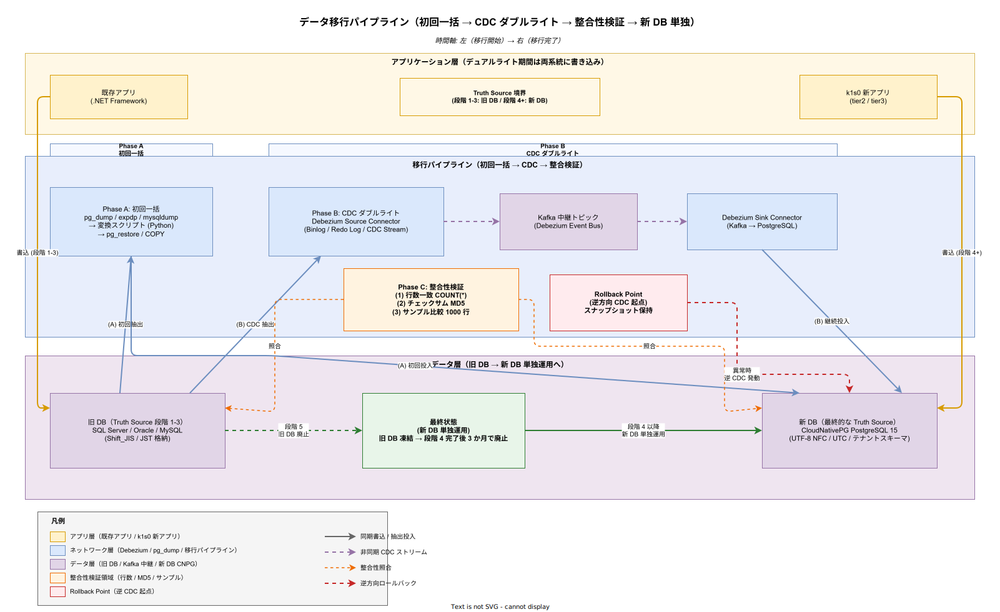

# 01. データ移行方式

本ファイルは k1s0 の導入に際して既存システム（レガシー RDB / ファイルサーバ / メッセージキュー）から k1s0 プラットフォームが管理するデータストアへ業務データを移す際の標準的な方式を定める。対象は既存 SQL Server / Oracle / MySQL から PostgreSQL（CloudNativePG）への表データ移行、既存 Windows ファイルサーバ / NAS から MinIO（S3 互換）への文書・バイナリ移行、既存 MSMQ / IBM MQ / RabbitMQ から Apache Kafka（Strimzi Operator）へのメッセージ移行の 3 系統である。

## 本ファイルの位置付け

JTC 情シス向けの基盤では、データ移行の設計を後回しにすると導入そのものが頓挫する。既存システムは 10 年以上運用されていることが多く、表の命名規則は Shift_JIS ベースの全角英数を含み、日付列は JST ローカル時刻で、外部キーが論理的には存在するが物理的に宣言されていない、といった状態で蓄積されている。この状態を「移行先は UTF-8 / UTC / 物理参照整合が前提」と切り捨てると、移行期間中にデータ不整合が大量発生し、稟議で約束した 2 名運用体制が破綻する。

本設計は構想設計 ADR-MIG-001（バッチ + CDC 二段構え方針）と ADR-MIG-002（デュアルライト期間を許容する並行稼働）を前提として、Phase 1a（MVP-0）から Phase 2 にかけてどのデータをどの順序で、どの道具で、どういう検証を経て移すかを具体化する。要件定義書 MIG-DATA-001 / MIG-STG-001 / MIG-INV-001 / MIG-PATTERN-001 / MIG-WAVE-001 / MIG-PILOT-001 / MIG-WAVE2-001 / MIG-PAR-001 と NFR-D-TIM/MTH/OBJ/PLN（全 11 要件）を対応先とする。

## 移行方針の基本構造

移行は「初回一括移行」と「継続同期」の二段構えで設計する。初回一括移行は既存データの凍結スナップショットを夜間メンテナンス時間帯に一括コピーするバッチ処理で、既存システムの連続運転を維持しながら k1s0 側に基準点を作る役割を担う。継続同期は初回一括移行後に既存システムが受け付ける更新を k1s0 側に伝播する仕組みで、Phase 1a〜Phase 1c では毎時バッチ、Phase 2 から Debezium による CDC（Change Data Capture）にアップグレードする。

二段構えとする理由は、初回一括移行だけでは既存システムが停止できず、CDC だけでは過去データの初期化ができないという、移行プロジェクトで頻発する二律背反を同時に解くためである。業界事例（AWS DMS / Fivetran / Striim の移行プロジェクト事例）でも、バッチ + CDC 併用が移行の既定路線となっている。

段階移行の全体構造は以下の通りである。初回バッチでスナップショット時点の全行を k1s0 側へ搬送し、その後の差分を CDC で追随する。並行稼働期間中はアプリケーションの更新系が両系統へ書き込む「デュアルライト」モードに切り替え、参照系はロールアウト進捗に応じて段階的に k1s0 側へ向ける。全部署の参照が k1s0 側を指した時点で既存系への書き込みを停止し、最終的に既存系を凍結する。

### データ移行パイプライン全体像

下図は「初回一括（Phase A）→ CDC ダブルライト（Phase B）→ 整合性検証（Phase C）→ 新 DB 単独運用」という 4 段のパイプラインを、アプリ層・移行パイプライン層・データ層の 3 レイヤ構成で可視化したものである。左端が移行開始時点（旧 DB が Truth Source）、右端が移行完了時点（新 DB が Truth Source）であり、中央の Debezium CDC と Kafka 中継トピックが並行稼働期間の「事実上の配線」を担う。橙色のチェックサム照合ブロックは旧 DB と新 DB の双方を恒常的に突き合わせており、行数・MD5・サンプル比較の 3 段階検証（本ファイル後段「検証の 3 段階」参照）の配置を図中で明示する。

図中右側の赤い Rollback Point は CNPG スナップショットと逆方向 CDC の起点を兼ねる概念ブロックで、切替後に新 DB 側で重大異常が発覚した場合に新 DB → 旧 DB の逆方向同期を発動するための基準点である。この基準点は [03_ロールバックと復旧方式.md](03_ロールバックと復旧方式.md) の DR シナリオと一体運用され、「旧 DB は段階 5（全社展開）完了から 3 か月は凍結保持」というロールバック猶予期間を物理的に担保する。

最終状態（緑）は新 DB（CloudNativePG PostgreSQL 15、UTF-8 NFC / UTC 統一、テナント別スキーマ）単独運用であり、旧 DB は段階 4 切替完了後 3 か月のロールバック猶予を経て廃止される。この図と [02_並行稼働_切替方式.md](02_並行稼働_切替方式.md) の Canary 5 ステップ切替図は相補的に読むべきもので、本図が「データの同期配線」、並行稼働図が「トラフィックの段階分配」を扱う。



## 対象データ領域

k1s0 が受け入れるデータ領域は 3 種類ある。第 1 は RDB 上の構造化データで、売上・在庫・人事・会計などの業務表が該当する。既存実装は SQL Server（多数）/ Oracle（大規模基幹）/ MySQL（小規模内製）が混在し、文字コードと日付タイムゾーンの取り扱いが異なる。移行先は PostgreSQL 15（CloudNativePG Operator）で、テナント別スキーマとして配置する。

第 2 はファイル系データで、Windows ファイルサーバの文書、スキャン PDF、画像、Excel 帳票、CAD 図面が該当する。既存はパス基底のアクセス制御で、ファイル名に全角・半角混在がある。移行先は MinIO（S3 互換）で、バケットをテナント別に切り分け、オブジェクトキーは `<tenant>/<category>/<year>/<month>/<uuid>.<ext>` の正規化パスに統一する。ファイル名の全角英数は NFKC 正規化で半角へ統一し、元ファイル名は S3 メタデータに `x-amz-meta-original-name` として保持する。

第 3 はメッセージ系データで、MSMQ / IBM MQ / RabbitMQ に蓄積された未処理メッセージの移行と、継続運用中のトピック移行が該当する。未処理メッセージは JSON / XML / 独自バイナリに分かれており、そのまま Kafka へ流すと下流のコンシューマが解釈できない。Avro + Schema Registry の新書式に変換した上で投入する。継続運用中のトピックは Kafka MirrorMaker 2 相当の独自中継プロセスを一時的に立ち上げ、既存キューから Kafka へミラーリングする。

## データ変換の 3 軸

既存データを k1s0 側にそのまま入れても動作しないため、3 軸の変換を設計段階から盛り込む。第 1 軸は文字コード変換で、Shift_JIS / EUC-JP / CP932 を UTF-8（NFC 正規化）へ統一する。変換には ICU ライブラリを使い、機種依存文字（いわゆる IBM 拡張漢字）の扱いは Unicode CJK Compatibility Ideographs への写像で対応する。写像テーブルは [../../03_要件定義/00_要件定義方針/09_データ辞書.md](../../03_要件定義/00_要件定義方針/09_データ辞書.md) で管理する。

第 2 軸はタイムゾーン変換で、JST ローカル時刻で格納されている日時列を UTC へ変換する。日時列は `TIMESTAMP WITH TIME ZONE`（PostgreSQL）へ移行し、アプリケーション層でのユーザ表示時に JST 変換する。この設計により、将来的な海外拠点展開でタイムゾーン対応が簡潔になる。変換ロジックは `CONVERT_TZ(col, 'Asia/Tokyo', 'UTC')` 相当の SQL を移行バッチ側に書き、既存データは一度だけ UTC で書き換える。

第 3 軸はスキーマ変換で、既存の物理表構造を k1s0 の論理モデルへマッピングする。マッピングは YAML ファイルで宣言的に定義し、ソース側 `<database>.<table>.<column>` と移行先 `<tenant>.<schema>.<table>.<column>` を 1:1 または 1:N で対応付ける。列追加（監査列 `created_at` / `updated_at` / `tenant_id`）、列削除（ソフト削除フラグなど不要になった列）、列分割（氏名 → 姓 / 名）、列結合（郵便番号 3 桁 + 4 桁 → 7 桁）の 4 パターンを標準操作として準備する。

## 移行ツールチェーン

Phase 1a〜Phase 1c では軽量ツールを組み合わせ、Phase 2 で Debezium へアップグレードする二段採用とする。Phase 1a〜1c で扱う移行データ量は 1 テナントあたり概ね 100GB 以下を想定しており、重量級 CDC 基盤の運用負荷を 2 名体制では負えないためである。

Phase 1a〜1c のツールチェーンは以下の通りである。RDB の初回移行は `pg_dump` / Oracle の `expdp` / MySQL の `mysqldump` で抽出した後、変換スクリプト（Python + pandas）で前述の 3 軸変換を施し、`pg_restore` または `COPY` で PostgreSQL へ投入する。差分同期は毎時の定期バッチで、ソース側の更新日時列をキーに差分を抽出する。更新日時列が存在しない表はトリガベースのシャドウ表を一時的に追加する。

ファイル系の移行は `rclone` または MinIO `mc mirror` を用い、初回一括同期後は `mc watch` で差分検知して転送する。メタデータ（作成者・更新日・アクセス権）は別途 CSV で抽出し、MinIO オブジェクトメタデータへ付与する。メッセージ系は各キューの公式 CLI / API（Get-MsmqQueue / runmqsc / rabbitmqadmin）でエクスポートし、Python 変換スクリプトで Avro へ変換した後、`kafka-console-producer` で Kafka へ流し込む。

Phase 2 のツールチェーンは Debezium + Kafka Connect + Schema Registry の組み合わせに切り替える。Debezium は SQL Server / Oracle / MySQL 各コネクタを公式サポートしており、DB のトランザクションログを直接読み取って行単位の変更イベントを Kafka トピックに発行する。この方式は毎時バッチに比べてレイテンシを分単位から秒単位に短縮でき、かつソース DB の負荷を増やさない。

## マッピング定義書の書式

移行対象のソース → ターゲット対応関係は YAML で宣言的に管理する。例を以下に示す。

```yaml
# src/migration/mappings/sales_orders.yaml
source:
  database: legacy_sales
  table: SALES_ORDERS
  charset: sjis
  timezone: Asia/Tokyo
target:
  tenant: tenant-a
  schema: sales
  table: orders
columns:
  - source: ORDER_ID
    target: order_id
    type: BIGINT
  - source: ORDER_DATE
    target: ordered_at
    type: TIMESTAMP WITH TIME ZONE
    transform: jst_to_utc
  - source: CUSTOMER_NAME
    target: customer_name
    type: TEXT
    transform: sjis_to_utf8_nfc
  - source: null
    target: tenant_id
    type: UUID
    default: "tenant-a"
  - source: null
    target: created_at
    type: TIMESTAMP WITH TIME ZONE
    default: NOW()
primary_key:
  - order_id
validation:
  row_count: strict
  checksum: md5_per_column
  sample_size: 1000
```

このマッピング定義を入力として、移行バッチは抽出 → 変換 → 投入を自動実行する。マッピング定義は Git 管理し、変更は PR レビューを経る。ソース側のスキーマ変更が発生した場合は YAML を更新し、差分 CI で整合検証を行う。

## 検証の 3 段階

移行後のデータ品質を担保するため、3 段階の検証を設計に組み込む。第 1 段階は行数一致検証で、ソース側 `SELECT COUNT(*)` と移行先 `SELECT COUNT(*)` が完全一致することを確認する。差分が 1 行でもあれば移行失敗とし、原因特定まで本番切替を進めない。

第 2 段階はチェックサム検証で、各列について `MD5(GROUP_CONCAT(col))` のようなハッシュを両側で計算し一致を確認する。文字コード変換を行う列は変換後の値でハッシュを計算し、両側で同じ変換ロジックを適用したサンプル変換値のハッシュを比較する。チェックサム不一致は多くの場合、文字コード写像の欠損や末尾空白の扱いで発生するため、原因分類テーブルを Runbook に用意する。

第 3 段階はサンプル比較検証で、ランダム抽出した 1,000 行の全列を目視相当の詳細比較で突き合わせる。抽出はソース側の主キーを乱数シード固定でサンプリングし、移行先で同じ主キーで参照した結果を列単位で diff する。差分が検出されたサンプルは原因調査の出発点となり、場合によってはマッピング定義を修正して再移行する。

合格基準は「行数一致 = 完全一致」「チェックサム一致 = 完全一致」「サンプル比較差分 = 0 行」の 3 点すべて満たすこととし、1 点でも不合格なら本番切替を実施しない。この合格基準は Phase 1a で確定し、Phase 1b 以降は同基準を継承する。

## 移行期間中のデュアルライト

初回一括移行から全部署の本番切替完了まで、数週間〜数か月の並行稼働期間が発生する。この期間中、アプリケーション更新系は既存系と k1s0 の両方に書き込む必要がある。この二重書き込みを「デュアルライト」と呼び、実装方式は 2 択がある。

第 1 方式はアプリケーション側デュアルライトで、既存アプリを改修して両系統へ書き込ませる。レガシーが .NET Framework の場合、tier3 拡張ポイント経由で k1s0 側にも書き込む層を追加する。この方式は応答性に優れ、両系統の整合が即時取れるが、既存アプリの改修が必須で、既存コードの品質に依存する。

第 2 方式は CDC + 参照切替で、既存系のみを更新し、CDC が k1s0 側に非同期で伝播する。参照系はロールアウト進捗に応じて k1s0 側を指すように Feature Flag で切り替える。この方式は既存アプリの改修を最小化できるが、CDC レイテンシ（数秒〜数十秒）の間、k1s0 側に未反映の状態が発生する。

k1s0 の推奨方針は第 2 方式（CDC + 参照切替）とし、読み取り系が主体の業務では CDC レイテンシを許容し、書き込みの強整合が必要な業務（金銭計算など）は第 1 方式（アプリケーション側デュアルライト）を個別採用する。並行稼働期間中の「真実の源泉（Truth Source）」は原則として既存系とし、本番切替完了時点で k1s0 側へ移す。この切替点を「逆ミラー開始点」と呼び、以降は k1s0 → 既存系への逆方向同期に切り替えてロールバック余地を確保する。

## 移行方法論・移行パターン・棚卸しの基盤設計

本ファイル前段はデータ移行の技術実装を規定したが、その技術実装は「どのような移行方法論に基づき、どの移行パターンを選択し、どの棚卸しに基づいて対象を特定するか」の方針層と接続して初めて運用可能となる。これらは要件定義書 30_非機能要件 NFR-D-MTH-001（.NET Framework 共存方式）、NFR-D-MTH-002（段階リリース）、NFR-D-MTH-003（データ移行ツール）および 70_プロジェクト管理 MIG-STG-001（Strangler Fig 段階移行戦略）、MIG-INV-001（移行対象の棚卸し）、MIG-PATTERN-001（移行パターン選択基準）として独立要件化されているため、本節で設計項目化する。

**設計項目 DS-MIG-DATA-012 .NET Framework 共存方式のデータ移行観点での接続**

NFR-D-MTH-001（サイドカー方式 / API Gateway 方式の 2 方式採用）への対応である。サイドカー方式（ADR-MIG-001）では、既存 .NET Framework アプリが Pod 内サイドカーを経由して tier1 State / PubSub / Decision API にアクセスするため、データ移行は「既存アプリが新旧両系統にデュアルライトしやすい構成」を選べる。API Gateway 方式（ADR-MIG-002）では、VM 直接稼働のまま Envoy Gateway 経由で tier1 API にアクセスするため、デュアルライトの実装は Envoy のミラーリング機能（`request_mirror_policies`）で 100% / 50% / 10% と段階的に調整できる。両方式は [02_並行稼働_切替方式.md](02_並行稼働_切替方式.md) の 5 段階ロールアウトと整合する形で、データ移行のデュアルライトと参照切替を制御する。Backstage Software Template として両方式のテンプレートを提供（サイドカー用 Chart と API Gateway 用 Chart）し、パイロット業務で両方式を Phase 1b で検証する。

**設計項目 DS-MIG-DATA-013 段階リリース（Canary / Blue-Green）とデータ整合性保証**

NFR-D-MTH-002（Argo Rollouts による Canary 10%→50%→100% または Blue-Green、異常検知時の自動ロールバック）への対応である。データ移行完了後の本番切替は、単純なトラフィック切替ではなく「データ整合性が担保された状態で段階切替する」必要がある。Canary 戦略では、10% トラフィックを新系統に流す段階で旧系統との行数・サム値・主要 KPI（売上合計・在庫数・承認件数など）を 5 分間隔で比較し、差分が 0.1% 以内であることを `argo-rollouts AnalysisTemplate` で検証する。差分が 0.1% を超えた場合は自動的に旧系統 100% へロールバックする。Blue-Green 戦略は金銭計算・監査記録など「差分 0 必須」の業務で採用し、切替直前に 30 分の静止点を設けて最終差分 0 を確認してから切替える。Phase 1c で自動ロールバック判定ロジックを実装し、Phase 2 以降は機械学習ベースの異常検知（PyTorch による時系列異常検知モデル）への拡張を検討する。

**設計項目 DS-MIG-DATA-014 データ移行ツールのパターン別整備と Runbook テンプレ化**

NFR-D-MTH-003（SQL Server → PostgreSQL は pgloader、ファイル → MinIO は mc、既存 Kafka → k1s0 Kafka は MirrorMaker、主要 3 パターンの Runbook 整備）への対応である。pgloader は SQL Server / MySQL の dump を直接 PostgreSQL に流し込める OSS（LGPL）で、Phase 1a の初回移行で採用する。ただし Oracle は pgloader の対応が限定的なため、`expdp` + 変換スクリプト + `COPY` の 3 段階パイプラインに分ける。ファイル移行は `mc mirror`（MinIO Client）で初回一括後に `mc watch` で差分検知する。既存 Kafka → k1s0 Kafka は MirrorMaker 2（Strimzi Operator 標準同梱）で、トピック単位の ACL / Schema Registry も同期する。各パターンは Runbook `RB-MIG-001`（pgloader 利用）、`RB-MIG-002`（mc mirror 利用）、`RB-MIG-003`（MirrorMaker 2 利用）としてテンプレート化し、Backstage TechDocs で公開する。Phase 2 で初回実施、Phase 3 で完全テンプレート化を目標とする。

**設計項目 DS-MIG-DATA-015 Strangler Fig Pattern の適用原則**

MIG-STG-001（Strangler Fig 段階移行、一斉書換え禁止、撤退容易性最優先、並行運用 2 年前提）への対応である。データ移行の全工程で Strangler Fig Pattern に従い、「旧系をそのまま残しながら、新系を機能単位で包み込む」方針を徹底する。データ移行の文脈では、旧 DB を読み取り専用として残しつつ、新 DB（PostgreSQL / CloudNativePG）に書き込みを寄せる形で段階的に Strangle する。並行運用期間を最低 1 か月（通常系）〜 3 か月（クリティカル系、MIG-PAR-001）確保し、Wave 単位の Runbook に撤退手順を必ず含める。Big Bang 切替は Product Council 承認がない限り禁止とし、「旧系廃棄は新系稼働 3 か月後の最速タイミング」という運用ルールを本設計の上位原則とする。この原則は [03_ロールバックと復旧方式.md](03_ロールバックと復旧方式.md) の DR 発動時にも継承され、旧系が生きていれば常に戻せる状態を保証する。

**設計項目 DS-MIG-DATA-016 移行対象の棚卸しと 6 軸分類**

MIG-INV-001（Phase 1 着手時に業務システム全体を棚卸しし、業務クリティカル度 / 技術スタック / 結合度 / データ量と更新頻度 / 撤退可能性 / 法的制約の 6 軸で分類）への対応である。棚卸し結果は Backstage の Service Catalog（`catalog-info.yaml` の拡張フィールド）に登録し、データ移行設計時に各システムの 6 軸評価値から自動的に推奨移行方式（サイドカー / API Gateway / 完全新規 / CDC）を算出する仕組みを構築する。Phase 1a 完了時に Wave 1 候補（結合度低 + クリティカル度低）、Phase 1b 完了時に Wave 2〜3 候補を確定させ、四半期ごとに棚卸し差分レビューを実施する。棚卸し漏れは「移行忘れ」「重複移行」の直接原因となるため、Backstage の Service Catalog に登録されていないシステムは移行対象として認めないガードレールとする。

**設計項目 DS-MIG-DATA-017 移行パターン選択基準 4 分類**

MIG-PATTERN-001（サイドカー / API Gateway / 完全新規 / Event Interception（CDC）の 4 パターン選択基準）への対応である。データ移行の文脈では、4 パターンがそれぞれ異なるデータ同期戦略を必要とする。サイドカー方式はアプリケーション側デュアルライト（本文該当節参照）と親和し、API Gateway 方式は Envoy の request_mirror_policies による受動的デュアルライトと親和する。完全新規構築は旧系凍結を前提とするため、初回一括移行のみで差分同期は不要である。Event Interception（CDC）は Debezium で旧系の変更をイベント化して新系に反映する方式で、読み取り系が主体の業務（レポーティング、分析）に適する。パターン選択は Wave 2 以降の移行設計書にパターン選択理由の記載を必須化し、完全新規構築は Product Council 承認必須とする。パターン別の移行期間実績を四半期集計し、計画精度にフィードバックする。

## 設計 ID 一覧

本ファイルで採番する設計 ID の索引を以下に示す。各 ID は本文中で定義した設計項目に 1:1 対応する。詳細本文は本文各節を参照する。

| 設計 ID | 設計項目 | 確定フェーズ | 対応要件 |
| --- | --- | --- | --- |
| DS-MIG-DATA-001 | バッチ + CDC 二段構え移行方針 | Phase 1a | MIG-DATA-001 / NFR-D-MTH-001 |
| DS-MIG-DATA-002 | RDB 3 系統（SQL Server / Oracle / MySQL）→ PostgreSQL | Phase 1a | MIG-DATA-001 / NFR-D-MTH-003 |
| DS-MIG-DATA-003 | ファイル系 → MinIO 移行（NFKC 正規化） | Phase 1b | MIG-DATA-001 / NFR-D-MTH-003 |
| DS-MIG-DATA-004 | メッセージ系 → Kafka 移行（Avro 変換） | Phase 1c | MIG-DATA-001 / NFR-D-MTH-003 |
| DS-MIG-DATA-005 | 文字コード変換（Shift_JIS → UTF-8 NFC） | Phase 1a | MIG-DATA-001 / NFR-D-OBJ-001 |
| DS-MIG-DATA-006 | タイムゾーン変換（JST → UTC） | Phase 1a | MIG-DATA-001 / NFR-D-OBJ-001 |
| DS-MIG-DATA-007 | スキーマ変換（列追加/削除/分割/結合） | Phase 1a | MIG-DATA-001 / NFR-D-OBJ-002 |
| DS-MIG-DATA-008 | マッピング定義 YAML 標準書式 | Phase 1a | MIG-DATA-001 / NFR-D-MTH-003 |
| DS-MIG-DATA-009 | 3 段階検証（行数・チェックサム・サンプル） | Phase 1a | MIG-DATA-001 / NFR-D-PLN-002 |
| DS-MIG-DATA-010 | デュアルライト方式（CDC + 参照切替） | Phase 1b | MIG-PAR-001 / NFR-D-MTH-002 |
| DS-MIG-DATA-011 | Phase 2 Debezium アップグレード計画 | Phase 2 | MIG-DATA-001 / NFR-D-TIM-001 |
| DS-MIG-DATA-012 | .NET Framework 共存方式とデータ移行接続 | Phase 1b | NFR-D-MTH-001 |
| DS-MIG-DATA-013 | 段階リリースとデータ整合性保証 | Phase 1b | NFR-D-MTH-002 |
| DS-MIG-DATA-014 | データ移行ツールのパターン別整備 | Phase 2 | NFR-D-MTH-003 |
| DS-MIG-DATA-015 | Strangler Fig Pattern の適用原則 | Phase 1a | MIG-STG-001 |
| DS-MIG-DATA-016 | 移行対象の棚卸しと 6 軸分類 | Phase 1a | MIG-INV-001 |
| DS-MIG-DATA-017 | 移行パターン選択基準 4 分類 | Phase 2 | MIG-PATTERN-001 |

## 対応要件一覧

本ファイルは要件定義書 30_非機能要件 NFR-D-TIM-001〜002（タイミング）、NFR-D-MTH-001〜003（方式）、NFR-D-OBJ-001〜003（目標）、NFR-D-PLN-001〜003（計画）の全 11 件（データ移行容易性）と、40_運用ライフサイクル MIG-DATA-001〜004（データ移行範囲）/ MIG-SCHEMA-001〜002（スキーマ変換規則）/ MIG-VALIDATE-001〜002（検証手順）に直接対応する。加えて NFR-D-MTH-001（.NET Framework 共存方式）、NFR-D-MTH-002（段階リリース）、NFR-D-MTH-003（データ移行ツール）、および 70_プロジェクト管理 MIG-STG-001（Strangler Fig）、MIG-INV-001（棚卸し）、MIG-PATTERN-001（パターン選択基準）にも直接対応する。構想設計 ADR-MIG-001（バッチ + CDC 二段構え）と ADR-MIG-002（デュアルライト期間）を前提としており、これら ADR の変更時は本ファイルも合わせて改訂する。レガシー共存制約 C-EXIST-001〜003 および既存 .NET 資産要件 FR-EXT-DOTNET-001/002 とも間接対応する。
