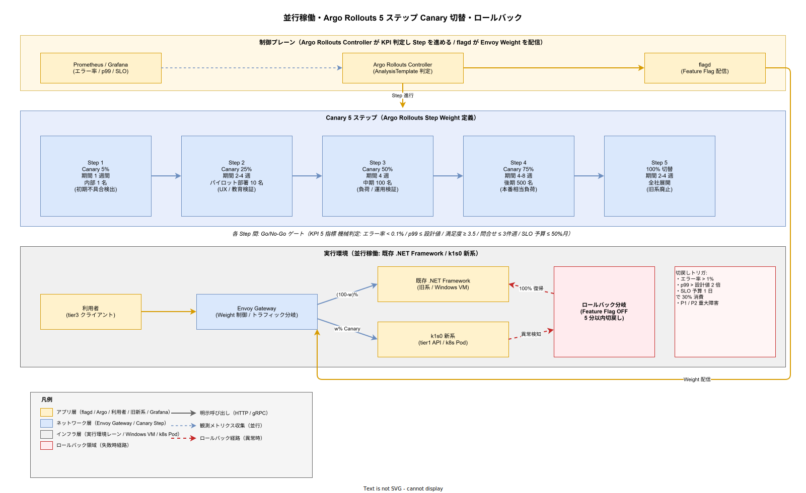

# 02. 並行稼働・切替方式

本ファイルは既存システムと k1s0 を一定期間並行稼働させながら、段階的に利用者を k1s0 側へ移すための切替方式を定める。対象は業務アプリケーションの利用者ロールアウト（Canary → パイロット → 段階拡大 → 全社）、参照系・更新系の切替順序、Feature Flag による即時切戻しの仕組み、切替期間中のユーザコミュニケーションの 4 領域である。

## 本ファイルの位置付け

採用側組織の情シス向け基盤の導入では、「全員一斉切替」は現実的でなく、利用部署間の差異（業務繁忙期・システム習熟度・IT リテラシー）を無視すると切替直後に問い合わせが殺到し、ヘルプデスクが溢れて業務停止を招く。過去の大型基幹刷新で本番切替後に「運用開始日から 2 週間は通常業務が成立しない」という事態が繰り返されており、同じ失敗は避けなければならない。

本設計は構想設計 ADR-MIG-002（段階切替 + Feature Flag 即時切戻し）を前提として、Canary（内部 1 名）から全社展開までの 5 段階ロールアウトを設計する。要件定義書 MIG-CUT-001〜004（段階切替計画）と MIG-COMM-001〜002（コミュニケーション手順）、および DX-FM-001〜007（Feature Management）との連動を対応先とする。10 分ルール（DX-GP-003）の下位で、既存ユーザの新系統アクセスパスを安全に拡大する設計である。

## 段階切替の 5 段階

ロールアウトは 5 段階で組み立てる。Canary（内部 1 名）→ パイロット部署（10 名）→ 段階拡大中期（100 名）→ 段階拡大後期（500 名）→ 全社展開の順序である。各段階の目的・期間・合格基準を明確化し、段階間の移行は機械的な Go/No-Go ゲートで決定する。判断を「空気」に委ねると、担当者が責任を取りたくないために切替が止まるか、逆に現場の不安を押し切って強行されるかの二極化に陥る。

### 並行稼働 + Canary 切替の全体像

下図は 5 段階ロールアウトを Argo Rollouts の Step Weight（5% → 25% → 50% → 75% → 100%）として表現し、制御プレーン（Argo Rollouts Controller / flagd / Prometheus）と実行環境（既存 .NET Framework 旧系 / k1s0 新系）、および異常検知時のロールバック分岐を 1 枚に収めたものである。上段の制御プレーンで Prometheus が観測メトリクスを Argo Rollouts Controller に供給し、AnalysisTemplate が KPI（エラー率 / p99 / SLO 予算 / ユーザ満足度 / 問合せ件数）を評価して Step を進める。flagd は Step 確定ごとに Envoy Gateway の Weight を配信し、実環境レーンの Envoy がトラフィックを (100−w)% / w% で旧系・新系に分配する。

右下の赤枠「ロールバック分岐」は Feature Flag OFF による 5 分以内切戻しの配線を表現する。k1s0 新系で切戻しトリガ（エラー率 > 1% / p99 > 設計値 2 倍 / SLO 予算 1 日 30% 消費 / P1 重大障害のいずれか）が発動した時点で、Envoy の Weight を 0% に戻し、トラフィック 100% が旧 .NET Framework 側に即時復帰する。この分岐は [03_ロールバックと復旧方式.md](03_ロールバックと復旧方式.md) の DR シナリオと接続し、Argo Rollouts のアプリケーション版ロールバックとは別経路で機能する冗長経路となる。

各 Step ボックス下に示した期間（1 週 → 2-4 週 → 4 週 → 4-8 週 → 2-4 週）と参加人数（内部 1 名 → 10 名 → 100 名 → 500 名 → 全社）は本章の 5 段階合格基準と 1:1 対応する。期間は目安であり、Go/No-Go ゲートで No-Go 判定が出た場合は次 Step へ進まず、原因是正 → 再計測のサイクルで同一 Step 内に留まる。

第 1 段階 Canary は起案者 1 名が自身の業務で使う段階である。期間は 1 週間、目的は技術的な初期不具合の発見である。合格基準はエラー率 < 0.1%、p99 レイテンシ ≤ 設計値（tier1 API 500ms、Decision 1ms、PubSub 50ms、State 10ms）、本人の業務が 1 週間破綻せず成立すること、の 3 点である。Canary 期間中は Feature Flag の対象ユーザを起案者 1 名に限定し、他のユーザからは完全に不可視とする。

第 2 段階パイロットは協力的な 1 部署（10 名前後）が参加する段階である。期間は 2〜4 週間、目的は UX・教育資料・サポート体制の初期検証である。合格基準は Canary と同じ技術指標に加え、ユーザ満足度（NPS 相当の 5 段階評価）の平均が 3.5 以上、問い合わせ件数が想定内（1 人あたり週 3 件以下）であること、を加える。この段階で問い合わせが想定を超えた場合、原因（UX / ドキュメント / 教育）を分類し、次段階に進む前に対策する。

第 3 段階段階拡大中期は 100 名規模（複数部署合計）が参加する段階である。期間は 4 週間、目的は負荷と運用の検証である。同時接続数・Kafka スループット・Valkey 接続プール・PostgreSQL コネクション数がそれぞれキャパシティ計画の 25% 水準に達することを確認する。合格基準は技術指標・ユーザ満足度に加え、SLO エラーバジェット消費が月間予算の 50% 以内であることを加える。

第 4 段階段階拡大後期は 500 名規模が参加する段階である。期間は 4〜8 週間、目的は本番相当負荷での運用安定性と、ヘルプデスクのスケールアウト検証である。キャパシティ計画の 80% 水準に達することを確認し、採用側の小規模運用で問い合わせ対応が回ることを実証する。合格基準は前段階の基準に加え、Runbook 掲載率（発生したインシデントのうち既存 Runbook で対処できた割合）が 80% 以上であることを加える。

第 5 段階全社展開は残るすべての利用者を k1s0 側へ移す段階である。期間は 2〜4 週間（一度に 2,000〜5,000 名規模の切替が発生する想定）、目的は既存系の凍結と完全移行である。合格基準は技術指標・ユーザ満足度・SLO を維持することに加え、既存系のアクセス数が 0 となり（参照系も含む）、既存系サーバ群を停止できる状態になったこと、を加える。

## Feature Flag を介した制御

ロールアウトの制御手段として、flagd（Open Feature 準拠）を中心に据える。新系統への切替は「k1s0 ルート有効」というブーリアン Feature Flag で制御し、対象は user_id / department_id / tenant_id の 3 軸で絞れる。Feature Flag の評価は tier1 Feature API（FR-FEATURE-001）の背後に位置し、tier2 / tier3 のアプリケーションは Feature Flag の存在を意識せず k1s0 SDK 経由で状態を取得する。

flagd の設定ファイルは Git 管理し、Argo CD で配信する。切替進捗は Git コミットとして履歴に残り、誰がいつどの部署を有効化したかが監査ログと同等の粒度で追跡できる。採用側の運用蓄積後は Backstage の Feature Flag 管理 UI から担当者が操作できるようにし、Git 操作に不慣れな運用担当者でも扱える導線を用意する。詳細は [../70_開発者体験方式設計/04_Backstageポータル詳細方式.md](../70_開発者体験方式設計/04_Backstageポータル詳細方式.md) で定義する。

Feature Flag の評価順序は以下の通りとする。第 1 に user_id 一致で個別指定（Canary / パイロット開始期）、第 2 に department_id 一致でパイロット部署指定、第 3 に tenant_id 一致で全社展開、の順に評価する。個別指定が全社展開よりも優先されるため、全社展開時に特定ユーザを一時的に無効化する「逆 Canary」も同じ仕組みで扱える。

## ロールアウトゲートの KPI

各段階の Go/No-Go を機械的に判断するため、以下 5 指標を KPI として定め、段階完了時にレポートを出す。

| 指標 | 計測方法 | 合格水準 | 超過時の判断 |
| --- | --- | --- | --- |
| エラー率 | tier1 API 5xx 応答率（Grafana） | < 0.1% | No-Go、原因特定まで次段階中断 |
| p99 レイテンシ | tier1 API p99（Grafana） | ≤ 設計値（500ms 等） | No-Go、容量増強または原因特定 |
| ユーザ満足度 | 段階終了時アンケート（5 段階） | 平均 ≥ 3.5 | 条件付き Go、UX 改善並行 |
| 問い合わせ件数 | Backstage Support プラグイン | 1 人週 ≤ 3 件 | No-Go、教育資料強化 |
| SLO エラーバジェット | SLO ダッシュボード | 消費 ≤ 50%/月 | No-Go、信頼性改善 |

合格水準は段階 3（段階拡大中期）以降に適用する。段階 1〜2（Canary / パイロット）では合格水準を参考値として扱い、計測を優先する。段階 3 以降は機械的に No-Go を返し、原因対処後に再計測する。この運用ルールは [../50_非機能方式設計/11_SLI_SLO_エラーバジェット方式.md](../50_非機能方式設計/11_SLI_SLO_エラーバジェット方式.md) と連動する。

## 即時切戻しの仕組み

切替失敗時の切戻しは「Feature Flag OFF で即時レガシー復帰」を基本とする。切戻しに要する時間を 5 分以内に抑える設計をリリース時点から維持する。Argo Rollouts によるアプリケーション版ロールバック（5 分以内で前バージョン復元）は別軸で [03_ロールバックと復旧方式.md](03_ロールバックと復旧方式.md) で扱い、本節では「既存系への逆ルーティング」に限定する。

切戻しの手順は以下の通りである。第 1 に運用担当者が障害を検知または報告を受ける。第 2 に Feature Flag の対象スコープを縮小する（例: 全社から特定テナントへ、特定テナントから特定部署へ）。第 3 に Git コミットを Argo CD が同期し、flagd が新設定を配信する（平均 2 分以内）。第 4 にアプリケーション側が次回リクエストから既存系ルートを選択し、ユーザは業務を継続できる。

切戻し発動の基準は、段階拡大期間中の KPI が以下のいずれかを満たした場合とする。エラー率が 1% を超過した、p99 レイテンシが設計値の 2 倍を超過した、SLO エラーバジェットが 1 日で月間予算の 30% を消費した、重大障害（データ消失・個人情報漏洩・監査ログ改ざん）が発生した、の 4 条件である。この基準は [../55_運用ライフサイクル方式設計/02_インシデント対応方式.md](../55_運用ライフサイクル方式設計/02_インシデント対応方式.md) で定義する重大度 P1〜P2 に相当する。

## 並行稼働のデータ整合

並行稼働期間中、既存系と k1s0 の両方にユーザが分散する状況が発生する。このとき、どちらの系統が「真実の源泉」を保持するかの定義が曖昧だと、同一業務の請求データが両系統で食い違い、月次締め処理で不整合が顕在化する。

k1s0 は以下のルールでデータ整合を担保する。第 1 に、並行稼働期間の初期（段階 1〜3）は既存系を Truth Source とし、k1s0 側の更新は CDC で伝播された既存系の状態を参照する「影の状態」として扱う。第 2 に、段階 4（後期）以降の切替済みテナントでは k1s0 側を Truth Source とし、逆方向 CDC で既存系へも反映する（将来の切戻しに備えた保険）。第 3 に、切替前後の境界時刻（切替タイムスタンプ）を各テナントごとに記録し、境界時刻以前のレコードは既存系、以降は k1s0 側が権威を持つと厳密に区分する。

境界時刻の切替は「静止点切替（Quiet Point Cutover）」方式を用いる。対象テナントの業務利用者が業務外時間（夜間 0 時〜4 時）にアクセスしていないことを確認し、既存系を読み書きともに短時間（30 分以内）凍結する。凍結中に CDC が最新差分を k1s0 側に反映し、差分 0 を検証した後、Feature Flag を切り替える。静止点切替後はアプリケーションの書き込みが k1s0 側に流れ、既存系は読み取り専用となる。

Saga パターンで複数サービスを跨ぐトランザクションが存在する場合は、並行稼働期間中は Saga 発火元を k1s0 側に寄せ、既存系への反映は補正トランザクションで扱う。詳細は [../40_制御方式設計/01_トランザクションとSaga方式.md](../40_制御方式設計/01_トランザクションとSaga方式.md) で定義する。

## コミュニケーション計画

切替の技術的成功は、ユーザ側の準備が整っていなければ「現場で使えない」という評価になる。採用初期から全社展開まで、段階ごとにコミュニケーション計画を実行する。

切替前（段階開始の 2〜4 週間前）には事前告知を行う。内容は「切替の目的」「変わる部分・変わらない部分」「問い合わせ窓口」「教育資料のリンク」で、部署長会議・全体メール・Teams / Slack の告知チャネルで重複配信する。段階 2 以降はパイロット部署による「先行ユーザの声」を事例として併記し、不安を軽減する。

切替中（段階実施中）は FAQ を Backstage TechDocs で公開し、週次で更新する。問い合わせで頻出した質問を運用チームが FAQ に反映し、翌週のメールで案内する。切替中のヘルプデスクは通常対応の 1.5 倍の体制で準備し、段階 3 以降はテンプレート回答スクリプトを準備する。問い合わせの平均応答時間を 4 時間以内に保つ。

切替後（段階完了後）は満足度アンケート実施、改善要望集約、定着確認ミーティング（段階ごとに 1 回、30 分）を行う。満足度 3 未満の回答は原因深堀り（1 対 1 ヒアリング）を実施し、次段階への改善フィードバックに含める。段階 5（全社展開）完了時は全社報告会で成果と残課題を共有する。

## 移行目標・移行計画・Wave 管理の基盤設計

前段で定めた 5 段階ロールアウトと即時切戻しは、並行稼働の技術的・組織的な制御メカニズムを規定したが、その上位層として「移行目標（OBJ）」「移行計画（PLN）」「並行運用期間と Wave 管理」の設計が必要である。これらは要件定義書 30_非機能要件 NFR-D-OBJ-001〜003（移行対象）、NFR-D-PLN-001〜003（移行計画）、および 70_プロジェクト管理 MIG-PAR-001（並行運用期間）、MIG-WAVE-001（移行波次）、MIG-WAVE2-001（Wave 2 ステージゲート）、MIG-PILOT-001（パイロット計画）、MIG-LGL-001（法的・契約的配慮）として要件化されている。本節で並行稼働プロセスに設計項目として組み込む。

**設計項目 DS-MIG-CUT-013 既存監査ログの集約（NFR-D-OBJ-001）**

NFR-D-OBJ-001（既存業務システムから k1s0 Audit API への監査イベント集約、REST `POST /audit/events` エンドポイント、採用側の段階移行）への対応である。並行稼働期間中は、新旧両系統の監査記録を tier1 Audit API に集約することで、J-SOX / 電帳法対応の監査ログが並行稼働によって分断されることを防ぐ。既存アプリは単発 HTTP 呼び出しで Audit API にイベントを投稿し、tier1 側で tenant_id / source_system / original_timestamp のメタデータを付与して PostgreSQL + MinIO の 3 層保管に流す。集約後の統合監査ビューは Backstage で「新旧両系統横断の監査クエリ UI」として提供し、監査要求時の回答期間を従来の 2 週間から 1 営業日以内に短縮する。採用後の Wave 1 で本運用化し、運用蓄積後に既存アプリの段階的改修により集約率 90% 以上を目標とする。

**設計項目 DS-MIG-CUT-014 既存業務アプリのメトリクス集約（NFR-D-OBJ-002）**

NFR-D-OBJ-002（Zabbix / SCOM から Prometheus Exporter 経由で Grafana 統合表示、運用蓄積後、優先度 COULD）への対応である。並行稼働期間中、運用チームが複数ダッシュボードを往復する負荷を低減するため、既存監視基盤のメトリクスを Prometheus に取り込む。Zabbix については `zabbix-agent2` の Prometheus Remote Write 機能、SCOM については `scom-exporter`（コミュニティ OSS）を利用する。取り込んだメトリクスは `legacy_` プレフィックス付きで Prometheus に格納し、Grafana ダッシュボードで「新旧横断の稼働率・リソース使用率」を可視化する。優先度 COULD（運用蓄積後）であるため、リリース時点では既存ダッシュボードの URL リンクを Backstage に集約するシンプルな実装に留め、採用後の運用展開で本格的な Exporter 統合を実施する。

**設計項目 DS-MIG-CUT-015 既存認証基盤（AD / LDAP / SAML IdP）の統合（NFR-D-OBJ-003）**

NFR-D-OBJ-003（Keycloak Federation で AD / LDAP / SAML IdP を上流化、リリース時点で AD / LDAP、採用後の運用展開で SAML IdP）への対応である。並行稼働期間中、ユーザは既存系・新系の両方にアクセスするため、ID 重複管理を避けることが業務効率の前提条件となる。Keycloak の User Federation 機能で社内 AD（LDAP プロトコル）を上流化し、Keycloak は AD のユーザ情報を読み取り専用で同期する。パスワード変更・認証判定も AD に委譲し、Keycloak は SSO トークン発行のみを担当する。採用後の運用展開で SAML IdP（取引先企業の IdP が Entra ID / Okta / PingFederate の場合）と Keycloak Identity Provider 連携を追加し、Federated Identity の Attribute Mapping を定義する。この設計により、k1s0 新規ログインの UX 負担をゼロに抑え、並行稼働期間中もユーザは既存 ID 情報のまま両系統を使い分けられる。

**設計項目 DS-MIG-CUT-016 パイロット合格基準の 6 条件充足（NFR-D-PLN-001）**

NFR-D-PLN-001（採用パイロット合格基準 6 条件: 11 API 利用可能 / p99 500ms / SEV1 0 件 / Runbook 10 本 / .NET 共存検証 / SSO 99%）への対応である。本章で定めた 5 段階ロールアウトのうち、第 2 段階パイロット（10 名）の合格基準は NFR-D-PLN-001 の 6 条件を全て含むよう設計する。合格基準の測定は Grafana（技術指標）、Backstage Survey（ユーザ満足度）、Runbook ダッシュボード（整備数）、Audit Log（SSO 成功率）の 4 ソースから自動集計し、パイロット期間完了時に Product Council に自動レポートする。6 条件のうち 1 件でも未達の場合は段階拡大を保留し、未達項目の改訂プロトコル（是正計画）を策定する。改訂プロトコルは未達の根本原因分析（Why 5 回）、是正アクション、再計測タイミング、責任者、期限を含む。これにより「曖昧な合格判断」を排除し、採用検討の延長リスクを構造的に低減する。

**設計項目 DS-MIG-CUT-017 リハーサル実施（NFR-D-PLN-002）**

NFR-D-PLN-002（本稼働前に staging 環境で 2 週間の定常運用リハーサル、RTO / RPO / Runbook 実行検証、全 Severity 別訓練 1 回ずつ）への対応である。リハーサルは「本番初日に想定外が起きない」状態を作るための最終検証であり、4 タイプの訓練を順次実施する: (1) 通常運用訓練（2 週間連続の定常負荷、日次業務フローを全て staging で再現）、(2) SEV1 訓練（PostgreSQL Primary 停止、OpenBao Raft リーダ喪失、ランサムウェア想定）、(3) SEV2 訓練（Kafka ブローカー 1 台停止、Keycloak DB 障害、API レイテンシ劣化）、(4) SEV3 訓練（Pod 単体 CrashLoop、証明書期限切れ、ログ書込遅延）。各訓練で Runbook を実行し、所要時間・成功可否・改善点を Retrospective ドキュメントに記録する。リハーサル未達（どれか 1 タイプの訓練で失敗）の場合は本稼働を 1 週間延期し、原因対処後に再実行する。

**設計項目 DS-MIG-CUT-018 撤退計画（NFR-D-PLN-003）**

NFR-D-PLN-003（Wave ごとの撤退基準と代替シナリオ明文化、パイロット 2 サイクル未達で段階拡大着手せず撤退判断、撤退時のデータ移行パス事前定義）への対応である。並行稼働期間中でも、ロールアウト合格基準が 2 サイクル連続で未達の場合は撤退発動を検討する。撤退基準の発動条件は（a）パイロット合格基準 6 条件のうち 3 件以上が 2 サイクル連続未達、（b）SEV1 インシデントがパイロット期間内で 3 件以上発生、（c）ユーザ満足度が 2 サイクル連続で 2.5 未満、（d）採用側の小規模運用での対応が破綻（オンコール負担が週 20 時間超が 4 週連続）の 4 条件のいずれかとする。撤退シナリオは「OpenShift / Rancher への移行」「商用 PaaS への後退」「tier1 API のみを切り出して再利用」の 3 経路を事前に ADR 化しておき、撤退時の移行コスト・所要期間・影響範囲を Product Council 承認済みの状態で常備する。撤退時のデータ移行パスは、tier1 State → 既存 DB 逆方向同期スクリプト、MinIO → ファイルサーバ逆同期、Audit ログ → CSV エクスポート、の 3 経路を Runbook 化する。

**設計項目 DS-MIG-CUT-019 並行運用期間の固定化（MIG-PAR-001）**

MIG-PAR-001（通常系最低 1 か月、クリティカル系（S1/S2）最低 3 か月、業務的挙動差分 / 技術的指標 / 利用者フィードバックの 3 指標継続モニタリング）への対応である。本章の 5 段階ロールアウトのうち、第 4 段階（500 名）の 4〜8 週間と第 5 段階（全社展開）の 2〜4 週間を合計すると通常系で最低 6 週間の並行運用が確保される設計となっており、MIG-PAR-001 の通常系 1 か月要件を上回る。クリティカル系（S1/S2 業務: 勘定系、受発注、人事、会計）については第 4 段階以降を 8 週間 → 12 週間に延長し、3 か月要件を確実に満たす。並行運用中は（a）業務的挙動差分（新旧両系統の出力データ比較、月次締め集計の一致率、承認結果の一致率）、（b）技術的指標（レスポンスタイム、エラー率、リソース消費）、（c）利用者フィードバック（Backstage Survey、Slack #k1s0-support の問合せカテゴリ分析）の 3 指標を Grafana で可視化する。短縮（Product Council 承認必須）は、3 指標が全て目標を 120% 以上上回る良好状態でのみ許可する。

**設計項目 DS-MIG-CUT-020 Wave 単位の移行順序管理（MIG-WAVE-001）**

MIG-WAVE-001（Wave 0: 移行対象外、Wave 1: 結合度低 + クリティカル度低、Wave 2: 結合度中 + クリティカル度中、Wave 3: 基幹系、後続 Wave は前 Wave 成功前提）への対応である。本章の 5 段階ロールアウトはテナント内の利用者拡大を扱うが、Wave 管理は複数業務システム横断の移行順序を扱う上位レイヤである。Wave 1（採用初期）は社内情報掲示板・部門 Web アプリなど結合度低の 2〜3 件、Wave 2（採用後の運用展開）は受発注システム・部門基幹系など結合度中の 5〜10 件、Wave 3（運用蓄積後）は勘定系・基幹会計など法的制約ありの基幹系を対象とする。Wave 2 着手条件は Wave 1 のパイロット 2 件が成功基準達成、Wave 3 着手条件は Wave 2 で 5 件以上が旧系撤退完了、を厳格に適用する。Wave スキップは Product Council 承認必須とし、過去 PJ の「基幹系から着手して破綻」の失敗パターンを構造的に排除する。

**設計項目 DS-MIG-CUT-021 Wave 2 ステージゲート 6 段階（MIG-WAVE2-001）**

MIG-WAVE2-001（対象分析 / 設計 / 実装 / 並行運用 / 切替 / 撤退の 6 ステージ、各ステージ担当 PM + 構想設計リードのダブルサインオフ）への対応である。Wave 2 以降の各業務システム移行で、本章の 5 段階ロールアウトを「切替ステージ」として位置付け、その前段に対象分析（1 か月）、設計（1 か月）、実装（2〜4 か月）、並行運用（1〜3 か月）を挟む。各ステージの完了条件は成果物テンプレート（WBS 側で定義）で明示化し、PM + 構想設計リードの 複数名承認がないと次ステージに進めない構造とする。ステージ飛ばしは Product Council 承認必須とし、「設計不十分のまま実装着手 → 手戻り」の失敗パターンを排除する。切替ステージの内部は本章の 5 段階ロールアウト（Canary → パイロット → 中期 → 後期 → 全社）に展開され、撤退ステージで旧系停止とハードウェア / ライセンス返却を完了させる。

**設計項目 DS-MIG-CUT-022 パイロット計画 2 件の実行管理（MIG-PILOT-001）**

MIG-PILOT-001（採用初期に 2 件のパイロット実行、パイロット 1: 社内情報掲示板 = サイドカー方式検証、パイロット 2: 外部公開 API = API Gateway 方式検証）への対応である。パイロット 2 件の実行は Wave 2 着手の前提条件であり、本章の 5 段階ロールアウトの実戦検証として位置付ける。パイロット 1（社内情報掲示板、500 名利用者、3 か月）では、サイドカー方式（ADR-MIG-001）で .NET Framework Web Forms アプリを Windows Container 化し、tier1 API にサイドカー経由でアクセスする。成功基準は旧系完全撤退、k1s0 上で 30 日連続稼働、SLO 達成（p99 500ms、エラー率 0.1%）。パイロット 2（外部公開 API、月間 100 万呼出、4 か月）では、API Gateway 方式（ADR-MIG-002）で Java アプリの前段に Envoy Gateway を配置し、クライアント（取引先）透過で 50% → 100% 段階切替する。成功基準はクライアント側影響なく切替完了、SLO 達成。両パイロット完了後、Runbook（切替・ロールバック）を Git 管理で整備し、ポストモーテムで学びを ADR-MIG-001/002 の改訂にフィードバックする。

**設計項目 DS-MIG-CUT-023 法的・契約的配慮の移行設計書必須チェック（MIG-LGL-001）**

MIG-LGL-001（監督官庁認可システムの事前通知、外部取引先 API の契約変更手続き、個人情報の目的内確認と同意取得）への対応である。並行稼働期間中および切替実行時に法的違反が発生しないよう、移行設計書に法的チェックリストを必須項目として組み込む。チェック項目は（a）監督官庁認可の有無と事前通知期間（金融庁: 30 日前、経産省: 14 日前が目安）、（b）取引先との契約書における「システム変更通知義務」条項の確認、（c）個人情報の取扱目的変更の有無と同意取得必要性、（d）業務委託先との契約における「サブプロセッサ変更通知」義務、（e）データ越境移転の有無と個情法 28 条対応、の 5 項目とする。Wave 2 以降の移行設計書は法務リードの承認（監督官庁系）と調達リードの承認（外部 API 系）を必須とし、承認なしでは並行稼働期間に進めないガードレールとする。切替失敗時の対外説明責任にも備え、切替日から 30 日以内にコンプライアンス違反が発覚しなかったことを Product Council に報告する。

## 設計 ID 一覧

本ファイルで採番する設計 ID の索引を以下に示す。

| 設計 ID | 設計項目 | 確定段階 | 対応要件 |
| --- | --- | --- | --- |
| DS-MIG-CUT-001 | 5 段階ロールアウト方式 | リリース時点 | MIG-CUT-001 / DX-FM-001 |
| DS-MIG-CUT-002 | Canary（1 名）段階の合格基準 | リリース時点 | MIG-CUT-002 |
| DS-MIG-CUT-003 | パイロット（10 名）段階の合格基準 | リリース時点 | MIG-CUT-002 |
| DS-MIG-CUT-004 | 段階拡大（100/500 名）の合格基準 | リリース時点 | MIG-CUT-003 |
| DS-MIG-CUT-005 | 全社展開段階の合格基準 | 採用後の運用拡大時 | MIG-CUT-004 |
| DS-MIG-CUT-006 | flagd による 3 軸制御方式 | リリース時点 | DX-FM-002 / DX-FM-003 |
| DS-MIG-CUT-007 | ロールアウトゲート KPI 5 指標 | リリース時点 | MIG-CUT-003 / DX-MET-001 |
| DS-MIG-CUT-008 | Feature Flag OFF による 5 分以内切戻し | リリース時点 | MIG-CUT-004 / DX-FM-004 |
| DS-MIG-CUT-009 | 切戻し発動基準（4 条件） | リリース時点 | MIG-CUT-004 |
| DS-MIG-CUT-010 | Truth Source 切替ルール | リリース時点 | MIG-CUT-003 |
| DS-MIG-CUT-011 | 静止点切替（Quiet Point Cutover） | リリース時点 | MIG-CUT-003 |
| DS-MIG-CUT-012 | コミュニケーション 3 段階計画 | リリース時点 | MIG-COMM-001 / MIG-COMM-002 |
| DS-MIG-CUT-013 | 既存監査ログの Audit API 集約 | 採用後の運用拡大時 | NFR-D-OBJ-001 |
| DS-MIG-CUT-014 | 既存業務アプリのメトリクス集約 | 採用後の運用拡大時 | NFR-D-OBJ-002 |
| DS-MIG-CUT-015 | 既存認証基盤（AD / LDAP / SAML）の Keycloak 統合 | リリース時点 | NFR-D-OBJ-003 |
| DS-MIG-CUT-016 | パイロット合格基準 6 条件の自動集計 | リリース時点 | NFR-D-PLN-001 |
| DS-MIG-CUT-017 | staging 2 週間リハーサル（4 Severity 訓練） | リリース時点 | NFR-D-PLN-002 |
| DS-MIG-CUT-018 | 撤退計画と代替シナリオ | リリース時点 | NFR-D-PLN-003 |
| DS-MIG-CUT-019 | 並行運用期間（通常 1 か月 / S1S2 3 か月） | 採用後の運用拡大時 | MIG-PAR-001 |
| DS-MIG-CUT-020 | Wave 単位の移行順序管理 | 採用後の運用拡大時 | MIG-WAVE-001 |
| DS-MIG-CUT-021 | Wave 2 ステージゲート 6 段階 | 採用側のマルチ Wave 期 | MIG-WAVE2-001 |
| DS-MIG-CUT-022 | パイロット計画 2 件の実行管理 | 採用初期 | MIG-PILOT-001 |
| DS-MIG-CUT-023 | 法的・契約的配慮の必須チェック | 採用後の運用拡大時 | MIG-LGL-001 |

## 対応要件一覧

本ファイルは要件定義書 40_運用ライフサイクル MIG-CUT-001〜004（段階切替計画）、MIG-COMM-001〜002（コミュニケーション手順）に直接対応する。加えて 30_非機能要件 NFR-D-OBJ-001（監査ログ集約）、NFR-D-OBJ-002（メトリクス集約）、NFR-D-OBJ-003（認証基盤統合）、NFR-D-PLN-001（パイロット合格基準）、NFR-D-PLN-002（リハーサル実施）、NFR-D-PLN-003（撤退計画）、および 70_プロジェクト管理 MIG-PAR-001（並行運用期間）、MIG-WAVE-001（Wave 定義）、MIG-WAVE2-001（Wave 2 ステージゲート）、MIG-PILOT-001（パイロット計画）、MIG-LGL-001（法的・契約的配慮）にも直接対応する。50_開発者体験 DX-FM-001〜007（Feature Management）、DX-MET-001（DORA 指標）、40_運用ライフサイクル配下の INC-001（インシデント対応）とも連動する。構想設計 ADR-MIG-002（段階切替 + Feature Flag 即時切戻し）と ADR-FM-001（flagd 採用）を前提とする。10 分ルール DX-GP-003 と連動し、既存業務からの移行体験を短時間で完結させる設計方針に整合する。
